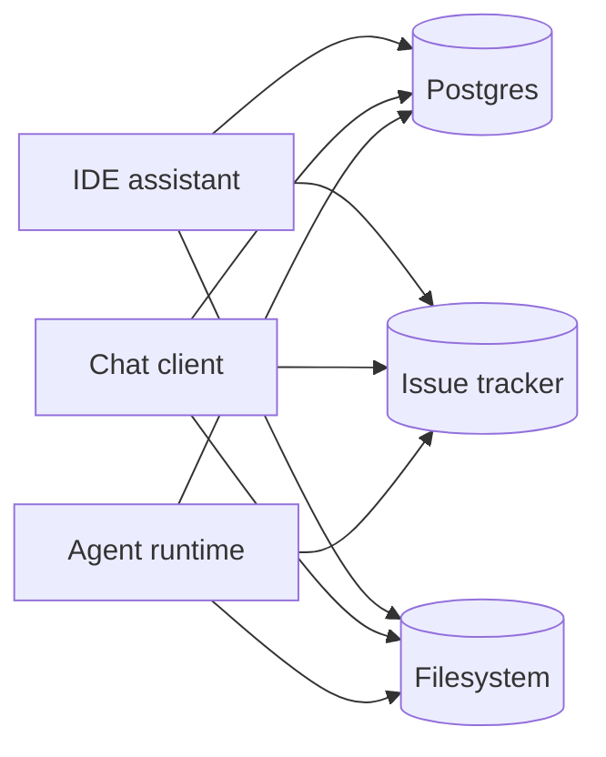
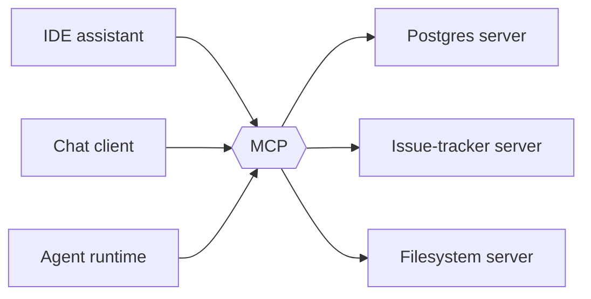
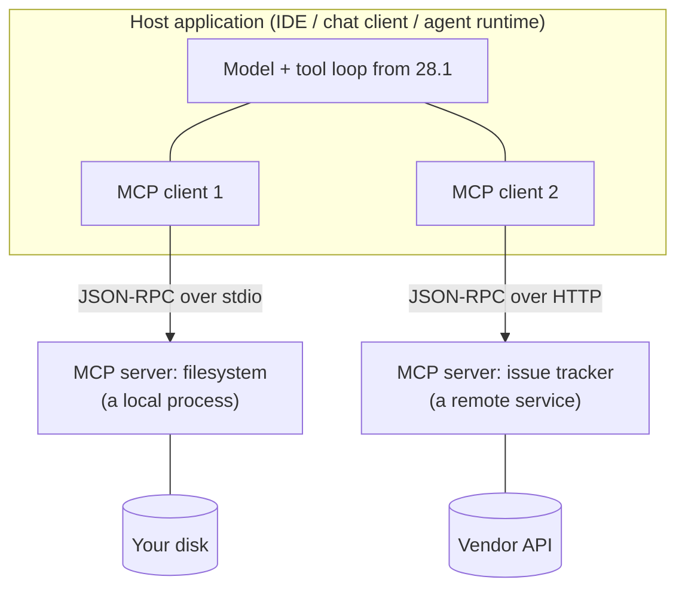

# 28.3 The Model Context Protocol

[Section 28.1](01-function-calling.md) gave you a working tool loop, and it
had one quiet assumption baked into it: that the tools live in the same
Python file as the loop. Real tools do not. They live in a database, a ticket
tracker, a filesystem, a company wiki — and the code that talks to each of
them has to be written by somebody, for some application. Multiply "somebody"
by "some application" and you get the plumbing problem this section is about,
along with the industry's answer to it: an open protocol, spoken over
JSON-RPC, called **MCP**.

## The M×N problem

Suppose there are $M$ AI applications — an IDE assistant, a chat client, an
agent runtime — and $N$ systems worth connecting to. Without a shared
convention, every application writes its own integration for every system:



Nine arrows for three and three. In general $M \times N$ — and every one of
them is a separate piece of code with its own bugs, its own auth handling,
and its own maintainer. Add a fourth application and you owe three new
integrations. Add a fourth system and you owe three more.

Now put a standard in the middle. Each application learns to speak the
protocol once. Each system gets wrapped in a **server** that speaks the
protocol once. Nothing else has to know about anything else:



Six arrows instead of nine, and — this is the part that matters — $M + N$
instead of $M \times N$. The fourth application costs *one* piece of work and
immediately reaches every existing server. This is not a new idea: it is
exactly why the Language Server Protocol replaced $\text{editors} \times
\text{languages}$ plugins, and why HTTP means your browser does not need a
different implementation for every website.

## What MCP is

The **Model Context Protocol** is an open standard, introduced by Anthropic
in late 2024 and developed in the open since, for connecting AI applications
to external context and capabilities. It specifies the messages, not the
implementation: there are SDKs in Python, TypeScript, and several other
languages, and servers written with any of them work with any compliant
client.

Three roles, and it is worth getting the names right because the
documentation uses them precisely:

- The **host** is the application the user actually runs — the IDE, the chat
  app, the agent runtime. It owns the model, the conversation, and the user's
  trust.
- An **MCP client** is a connector object *inside* the host. The host creates
  one client per server it connects to, and each client holds exactly one
  connection.
- An **MCP server** is a separate program (or a remote service) that exposes
  some capability. It knows nothing about models, prompts, or conversations.
  It answers protocol messages.



Two **transports** carry the messages. **stdio** is the local one: the host
launches the server as a child process and they exchange newline-delimited
JSON over that process's standard input and output — the pipes named among
the ways processes communicate in
[Section 23.1](../ch23-os/01-os-processes.md). No ports, no network, no
auth, and the server dies with the host. **HTTP** is
the remote one, for servers running as a service somewhere else, where
authorization becomes a real concern. The HTTP transport has been revised
since the first release (the current specification calls it *Streamable
HTTP*; an earlier revision used HTTP with Server-Sent Events, the format you
parsed in [Section 27.3](../ch27-inference/03-latency-streaming.md)). The
messages are identical on both; only the pipe changes.

## The three primitives

An MCP server can expose three kinds of thing, and the distinction between
them is *who decides to use it* — not what the data looks like.

| Primitive | Controlled by | Example | Analogy |
| --- | --- | --- | --- |
| **Tools** | The model | `create_issue`, `run_query`, `stock_level` | A function call |
| **Resources** | The application | `file:///notes/spec.md`, `db://orders/2024` | A file you attach |
| **Prompts** | The user | "Review this diff", "Summarize this incident" | A slash command |

**Tools** are Section 28.1 exactly: a name, a description, a JSON Schema, and
side effects. The model chooses when to call one. Methods: `tools/list` and
`tools/call`.

**Resources** are read-only data addressed by **URI**. The server lists what
it has (`resources/list`) and hands over the bytes on request
(`resources/read`). The crucial difference from tools is control: the *host
application* decides what to include — usually because the user picked a file
from a menu — rather than the model deciding to go and fetch it. Resources
are how you say "here is the document we are talking about" without giving
the model a general-purpose file reader.

**Prompts** are reusable templates the *user* invokes, typically surfaced as
slash commands or menu items. `prompts/list` returns their names and
arguments; `prompts/get` fills a template in and returns the messages to
send. A server for a code host might ship a `review-pr` prompt that knows the
team's review checklist.

!!! note "Who is in charge is the whole point"
    A model that can silently read any file is a security problem. A user who
    must hand-copy every file into the chat box is a usability problem.
    Splitting one idea — "get some data" — into a model-controlled primitive,
    an application-controlled primitive, and a user-controlled primitive is
    how MCP lets a product make that tradeoff deliberately instead of by
    accident.

Beyond these, the protocol also defines features that run in the *other*
direction — a server can ask the host to run a model completion (*sampling*)
or to ask the user a question (*elicitation*) — but tools, resources, and
prompts are the three you will meet first and use most.

## The wire format: JSON-RPC 2.0

MCP does not invent a message format. It uses **JSON-RPC 2.0**, a small,
old, boring specification, which is exactly what you want in a protocol.
There are only three message shapes.

A **request** has a method, optional params, and an `id`:

```json
{
  "jsonrpc": "2.0",
  "id": 3,
  "method": "tools/call",
  "params": {
    "name": "stock_level",
    "arguments": {"sku": "widget"}
  }
}
```

A **response** carries the same `id` back, plus *either* `result` or `error`
— never both:

```json
{
  "jsonrpc": "2.0",
  "id": 3,
  "result": {
    "content": [{"type": "text", "text": "42"}],
    "isError": false
  }
}
```

A **notification** is a request with **no `id`**, which means no reply is
expected or allowed. It is fire-and-forget:

```json
{
  "jsonrpc": "2.0",
  "method": "notifications/initialized"
}
```

That `id` is doing more work than it looks. Both sides may have several
messages in flight at once, and replies can come back in any order, so the
`id` is what matches a response to the request that caused it. It is the
same job `tool_call_id` did in Section 28.1, one layer down.

An **error object** has an integer `code`, a human `message`, and optional
structured `data`. The reserved codes come straight from JSON-RPC:

| Code | Name | When |
| --- | --- | --- |
| $-32700$ | Parse error | The bytes were not valid JSON |
| $-32600$ | Invalid Request | Valid JSON, but not a valid request object |
| $-32601$ | Method not found | No such method on this server |
| $-32602$ | Invalid params | Method exists; arguments are wrong |
| $-32603$ | Internal error | The server blew up |

```json
{
  "jsonrpc": "2.0",
  "id": 4,
  "error": {
    "code": -32602,
    "message": "missing required arguments",
    "data": {"missing": ["units"]}
  }
}
```

### The initialize handshake

No other message may be sent until the connection has been negotiated. The
client opens with `initialize`, announcing which protocol revision it speaks
(the revisions are date-stamped strings) and what it can do:

```json
{
  "jsonrpc": "2.0",
  "id": 1,
  "method": "initialize",
  "params": {
    "protocolVersion": "2025-06-18",
    "capabilities": {"roots": {"listChanged": true}},
    "clientInfo": {"name": "handbook-host", "version": "0.1.0"}
  }
}
```

The server replies with the version it will actually use and its own
capabilities — here, "I have tools, and I will not notify you when the list
changes":

```json
{
  "jsonrpc": "2.0",
  "id": 1,
  "result": {
    "protocolVersion": "2025-06-18",
    "capabilities": {"tools": {"listChanged": false}},
    "serverInfo": {"name": "inventory-server", "version": "1.0.0"}
  }
}
```

The client then sends the `notifications/initialized` notification, and the
connection is live. This is **capability negotiation**, and it is why a
client written against an old revision can talk to a new server: each side
declares what it supports, both sides stay inside the intersection, and
nobody calls `resources/read` on a server that never claimed to have
resources.

## Build it: a working MCP-style server

Enough description. Here is a server that speaks those exact messages. It is
"mini" only in that it implements three methods and runs in memory instead of
over a pipe — every dict below is a real, spec-shaped JSON-RPC message.

```python
import json

PROTOCOL_VERSION = "2025-06-18"        # MCP revisions are date-stamped

# JSON-RPC 2.0 reserved error codes.
PARSE_ERROR, INVALID_REQUEST = -32700, -32600
METHOD_NOT_FOUND, INVALID_PARAMS, INTERNAL_ERROR = -32601, -32602, -32603


class MiniMCPServer:
    """An MCP-style server. A real one reads these messages from stdin and
    writes them to stdout; this one takes them as Python dicts so you can
    watch every field."""

    def __init__(self, name, version="0.1.0"):
        self.name, self.version = name, version
        self.tools = {}

    def add_tool(self, name, description, input_schema, fn):
        self.tools[name] = {"description": description,
                            "inputSchema": input_schema, "fn": fn}

    def handle(self, message):
        """One JSON-RPC message in, one response out — or None for a
        notification, which by definition never gets a reply."""
        if message.get("jsonrpc") != "2.0":
            return self._error(message.get("id"), INVALID_REQUEST,
                               "jsonrpc must be exactly '2.0'")
        method = message.get("method")
        mid = message.get("id")
        params = message.get("params", {})

        if mid is None:                    # a notification: act, stay silent
            return None
        try:
            if method == "initialize":
                return self._ok(mid, {
                    "protocolVersion": PROTOCOL_VERSION,
                    "capabilities": {"tools": {"listChanged": False}},
                    "serverInfo": {"name": self.name, "version": self.version}})
            if method == "tools/list":
                return self._ok(mid, {"tools": [
                    {"name": n, "description": t["description"],
                     "inputSchema": t["inputSchema"]}
                    for n, t in sorted(self.tools.items())]})
            if method == "tools/call":
                return self._call_tool(mid, params)
        except Exception as exc:           # a server must never die
            return self._error(mid, INTERNAL_ERROR,
                               f"{type(exc).__name__}: {exc}")
        return self._error(mid, METHOD_NOT_FOUND, f"unknown method: {method!r}",
                           {"available": ["initialize", "tools/list",
                                          "tools/call"]})

    def _call_tool(self, mid, params):
        name = params.get("name")
        if name not in self.tools:
            return self._error(mid, INVALID_PARAMS, f"no tool named {name!r}",
                               {"available": sorted(self.tools)})
        schema = self.tools[name]["inputSchema"]
        args = params.get("arguments", {})
        missing = [k for k in schema.get("required", []) if k not in args]
        if missing:
            return self._error(mid, INVALID_PARAMS, "missing required arguments",
                               {"missing": missing})
        try:
            value = self.tools[name]["fn"](**args)
        except Exception as exc:
            # A tool that FAILS is a result, not a protocol error: the model
            # is meant to read the message and try something else.
            return self._ok(mid, {"isError": True, "content": [
                {"type": "text", "text": f"{type(exc).__name__}: {exc}"}]})
        return self._ok(mid, {"isError": False, "content": [
            {"type": "text", "text": str(value)}]})

    @staticmethod
    def _ok(mid, result):
        return {"jsonrpc": "2.0", "id": mid, "result": result}

    @staticmethod
    def _error(mid, code, message, data=None):
        err = {"code": code, "message": message}
        if data is not None:
            err["data"] = data
        return {"jsonrpc": "2.0", "id": mid, "error": err}


# --- two genuinely real tools, wrapped as an MCP server ----------------
INVENTORY = {"widget": 42, "gizmo": 7, "sprocket": 0}
PRICES = {"widget": 3.50, "gizmo": 19.99, "sprocket": 0.75}

def stock_level(sku):
    if sku not in INVENTORY:
        raise KeyError(f"unknown sku {sku!r}")
    return INVENTORY[sku]

def restock_cost(sku, units):
    return round(PRICES[sku] * units, 2)

server = MiniMCPServer("inventory-server", "1.0.0")
server.add_tool(
    "stock_level",
    "Return how many units of one SKU are in the warehouse right now. "
    "Call this before promising a customer a delivery date.",
    {"type": "object",
     "properties": {"sku": {"type": "string", "enum": sorted(INVENTORY),
                            "description": "The SKU to look up."}},
     "required": ["sku"]},
    stock_level)
server.add_tool(
    "restock_cost",
    "Compute the cost in USD of ordering a number of units of one SKU.",
    {"type": "object",
     "properties": {"sku": {"type": "string", "enum": sorted(INVENTORY),
                            "description": "The SKU to order."},
                    "units": {"type": "integer", "minimum": 1,
                              "description": "How many units to order."}},
     "required": ["sku", "units"]},
    restock_cost)

print(f"server {server.name!r} exposes: {', '.join(sorted(server.tools))}")
```

Notice what the server does *not* know: there is no model here, no prompt, no
conversation. It is a JSON-RPC dispatcher wrapped around two ordinary Python
functions, and that separation is the whole reason a server written for one
host works in another.

## Build it: the client, and the handshake on screen

The client is the host's side. It owns the request ids, does the handshake
before anything else, and — because this is a teaching version — prints every
message that crosses the boundary.

```python
# continues
class MiniMCPClient:
    """The host's connector. One client, one server, one id counter."""

    def __init__(self, server, verbose=True):
        self.server, self.verbose = server, verbose
        self._next_id = 0
        self.server_info = None

    def _send(self, method, params=None, notification=False):
        msg = {"jsonrpc": "2.0", "method": method}
        if params is not None:
            msg["params"] = params
        if not notification:                 # notifications carry no id
            self._next_id += 1
            msg["id"] = self._next_id
        self._show("-->", msg)
        reply = self.server.handle(msg)
        if reply is None:
            self._show("<--", "(nothing: a notification never gets a reply)")
            return None
        self._show("<--", reply)
        if "error" in reply:
            raise RuntimeError(f"server error {reply['error']['code']}: "
                               f"{reply['error']['message']}")
        return reply["result"]

    def _show(self, arrow, payload):
        if self.verbose:
            text = payload if isinstance(payload, str) else json.dumps(payload)
            print(f"  {arrow} {text}")

    def initialize(self):
        result = self._send("initialize", {
            "protocolVersion": PROTOCOL_VERSION,
            "capabilities": {},
            "clientInfo": {"name": "handbook-host", "version": "0.1.0"}})
        self.server_info = result["serverInfo"]
        self._send("notifications/initialized", notification=True)
        return result

    def list_tools(self):
        return self._send("tools/list")["tools"]

    def call_tool(self, name, arguments):
        return self._send("tools/call", {"name": name, "arguments": arguments})


client = MiniMCPClient(server)

print("1. handshake")
info = client.initialize()
print(f"     -> connected to {info['serverInfo']['name']}, "
      f"MCP {info['protocolVersion']}\n")

print("2. discovery")
for t in client.list_tools():
    print(f"     -> {t['name']}, required {t['inputSchema']['required']}")
print()

print("3. invocation")
out = client.call_tool("stock_level", {"sku": "gizmo"})
print(f"     -> text {out['content'][0]['text']!r}, isError {out['isError']}")
```

Read the arrows. Request 1 is the handshake; the server answers with its
version, its capabilities, and its identity. Then a notification goes out
with no `id` and the server correctly says nothing back. Request 2 asks for
the menu and gets both tools *with their full schemas* — this is how a host
that has never heard of your server learns what it can do, at runtime, with
no code generation. Request 3 calls a tool and gets a content array back.

## Errors, and the distinction that trips everyone up

There are two completely different kinds of failure here, and the protocol
handles them differently on purpose.

```python
# continues
print("a) a method this server does not implement")
try:
    client._send("resources/list")
except RuntimeError as exc:
    print("     client raised:", exc)

print("\nb) a tool call missing a required argument")
try:
    client.call_tool("restock_cost", {"sku": "gizmo"})
except RuntimeError as exc:
    print("     client raised:", exc)

print("\nc) a tool that ran and failed — NOT a protocol error")
out = client.call_tool("stock_level", {"sku": "flux_capacitor"})
print(f"     isError {out['isError']}, text {out['content'][0]['text']!r}")
```

(a) and (b) are **protocol** errors: the request was malformed or
unanswerable, so the server returns an `error` object with a reserved code
and the client raises. The host's *programmer* needs to know.

(c) is different. The request was perfectly well formed, the tool ran, and
the tool did not like its input. That comes back as a normal `result` with
`isError: true` and a text explanation — because the audience for that
message is the **model**, which should read "unknown sku 'flux_capacitor'"
and try a different SKU. Sending it as a JSON-RPC error would hide it from
the model behind an exception in the host. This is the same lesson as
Section 28.1's dispatcher, now written into a specification.

## Build it: a model driving the protocol

Last piece. Put a model in front of the client and the loop from Section 28.1
runs end to end over the wire — with the crucial difference that the tool
menu is *discovered*, not hard-coded.

```python
# continues
class FakeLLM:
    """Deterministic stand-in for a real model API. Everything it knows
    about the world arrived over the protocol in tools/list."""

    def respond(self, question, tools, seen):
        names = {t["name"] for t in tools}
        if "stock_level" in names and "stock_level" not in seen:
            return {"stop_reason": "tool_use", "name": "stock_level",
                    "arguments": {"sku": "widget"}}
        if "restock_cost" in names and "restock_cost" not in seen:
            have = int(seen["stock_level"])
            return {"stop_reason": "tool_use", "name": "restock_cost",
                    "arguments": {"sku": "widget", "units": 100 - have}}
        return {"stop_reason": "end_turn",
                "text": (f"You have {seen['stock_level']} widgets in stock. "
                         f"Topping up to 100 would cost "
                         f"${float(seen['restock_cost']):,.2f}.")}


def run_over_mcp(question, client, tools, llm, max_turns=5):
    seen = {}
    for turn in range(1, max_turns + 1):
        reply = llm.respond(question, tools, seen)
        if reply["stop_reason"] == "end_turn":
            return reply["text"]
        print(f"  turn {turn}: model wants "
              f"{reply['name']}({reply['arguments']})")
        out = client.call_tool(reply["name"], reply["arguments"])
        seen[reply["name"]] = out["content"][0]["text"]
    raise RuntimeError("model never stopped calling tools")


driver = MiniMCPClient(server, verbose=False)
driver.initialize()                 # handshake and discovery, quietly —
tools = driver.list_tools()         # we watched those two above
driver.verbose = True               # now watch the model-driven traffic

print(run_over_mcp("Do we need to restock widgets?", driver, tools, FakeLLM()))
```

Two turns, two `tools/call` messages, one English answer. The model asked for
`stock_level`, read `42` off the wire, worked out that 58 more units reach
100, asked for `restock_cost`, and produced a sentence. Every arrow you see
is a message a real MCP server would receive byte-for-byte.

And now the payoff of the whole design: `run_over_mcp` never mentions
inventory. Point `driver` at a filesystem server or a ticket server and the
same twelve lines drive those instead, because the tool menu arrives at
runtime in `tools/list`. That is $M + N$, in code.

!!! note "What is toy, what is faithful"
    Toy: the in-memory transport (real servers use pipes or HTTP), the three
    implemented methods, the schema check that only looks at `required`, and
    the scripted `FakeLLM`. Faithful: every message shape, the `id`
    correlation, the notification-has-no-id rule, the reserved error codes,
    the `initialize` handshake with capability negotiation, the
    `tools/list` → `tools/call` sequence, and the `isError`-versus-error
    distinction. Swap the transport and this client would talk to a real
    server.

!!! warning "Common mistakes"

    - **Giving a notification an `id`.** A notification is *defined* as a
      request without one. Add an `id` and you have promised a reply that
      never comes; a strict client will wait for it.
    - **Skipping the handshake.** Calling `tools/list` before `initialize`
      is a protocol violation, and it is also how you end up assuming
      capabilities the server never advertised.
    - **Returning a JSON-RPC error when a tool merely failed.** Use
      `isError: true` inside a normal result so the model can read the
      message and recover. Reserve error objects for malformed or
      unsupported *requests*.
    - **Assuming `id`s come back in order.** They do not have to. Match on
      the `id`, never on arrival order — that is the only reason it exists.
    - **Treating MCP as an AI-only idea.** It is an RPC protocol with a
      discovery step. The only "AI" part is that the discovery output is
      written to be read by a model.

## Check your understanding

1. Ten AI applications want to reach eight backend systems. How many
   integrations without a protocol, and how many with one? What has actually
   been eliminated?

    ??? success "Answer"
        Without: $10 \times 8 = 80$ bespoke integrations. With: $10 + 8 = 18$
        — ten clients and eight servers. What is eliminated is the *pairing*:
        no piece of code needs to know both a specific application and a
        specific backend, so the eleventh application costs one unit of work
        and immediately reaches all eight servers.

2. Which primitive would you use for each of these, and why: (a) letting the
   model file a bug report, (b) attaching the file the user has open in their
   editor, (c) a "explain this stack trace" command in a menu?

    ??? success "Answer"
        (a) A **tool** — the model decides when a bug is worth filing, and it
        has side effects. (b) A **resource** — the application knows which
        file is open and supplies it by URI; the model does not go looking.
        (c) A **prompt** — the user invokes it deliberately, and it expands
        into a prepared set of messages. The sorting question is always *who
        decides*, not what the payload contains.

3. A server receives `{"jsonrpc": "2.0", "method": "tools/call", "params":
   {"name": "delete_everything"}}`. What must it do?

    ??? success "Answer"
        Nothing it can report — the message has no `id`, so it is a
        notification and no response is permitted. That is also why real
        clients never send tool calls as notifications: you would get no
        result, no error, and no way to know whether anything happened. In
        our `MiniMCPServer.handle`, the `if mid is None` branch returns
        `None` before any method dispatch.

4. Your tool receives a valid SKU that simply is not in the database. Do you
   return error code $-32602$, or a result with `isError: true`? Who is the
   audience for each?

    ??? success "Answer"
        A result with `isError: true`. The request was well formed — the
        method exists and the arguments matched the schema — so this is a
        *tool* failure, and its audience is the model, which should read the
        text and try a different SKU. $-32602$ (Invalid params) is for
        arguments that violate the schema, and its audience is the host's
        programmer, who has a bug. Getting this backwards makes an agent
        unable to recover from ordinary, expected failures.
