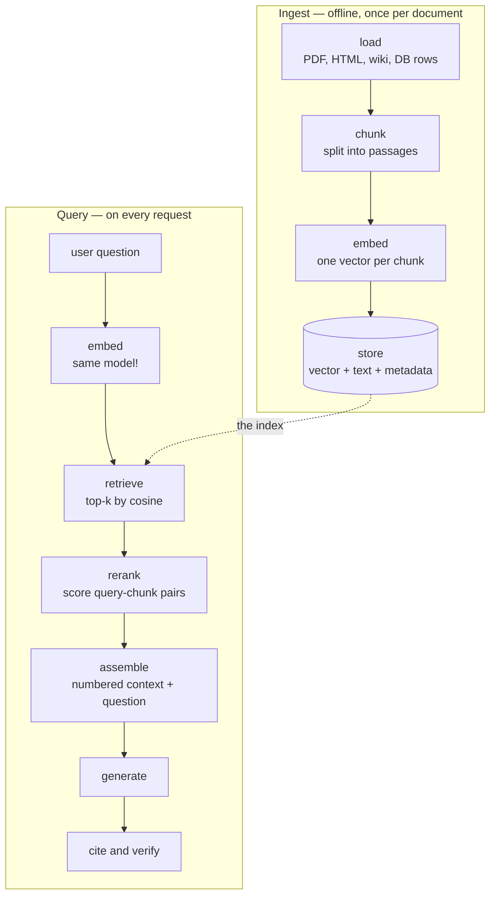

# 29.2 The RAG pipeline

A language model knows what was in its training data and nothing else. It does
not know your company's runbook, last night's incident report, or what changed
in the API this morning — and, worse, it will usually *answer anyway*, in the
same confident register it uses for things it does know. **Retrieval-augmented
generation** is the standard fix, and it is architecturally humble: before
asking the model anything, look the answer up and paste it into the prompt.
This section builds the whole pipeline — chunk, embed, store, retrieve, rerank,
assemble, generate, cite, evaluate — with runnable code at every stage, on top
of the vector search from [Section 29.1](01-embeddings-vector-search.md).

## Three reasons a model needs a library card

**Knowledge cutoff.** Training data stops at a date. Anything after it does not
exist as far as the weights are concerned.

**Hallucinated specifics.** This is the dangerous one. A model asked for a
number it does not have will frequently produce a *plausible* number rather
than an admission. The failure has no error message and no traceback — it
looks exactly like a correct answer.

**Private data.** Your internal documents were never in anyone's training set,
and you would not want them to be. Retrieval lets the model use them at query
time without any training at all.

The block below makes the second failure visible. `FakeLLM` is a deterministic
stand-in for a model API — it is scripted, never trained, and we use it
everywhere in this chapter in place of a network call. Its scripted behaviour
is the behaviour we want to study: asked something outside its frozen
"knowledge", it invents.

```python
import re

class FakeLLM:
    """Deterministic stand-in for a model API. Scripted, never trained.

    Everything it 'knows' is the KNOWN dict, frozen at some past date. Asked
    anything else it does what real models do: it produces a fluent,
    confident, completely invented specific. Given a Context: section it
    switches to quoting that context and citing the chunk number.
    """
    KNOWN = {"speed of light": "299,792,458 metres per second"}

    def __call__(self, prompt):
        question = prompt.rsplit("Question:", 1)[-1].strip()
        if "Context:" in prompt:                    # --- grounded mode ---
            context = prompt.split("Context:", 1)[1].split("Question:")[0]
            for line in context.strip().splitlines():
                m = re.match(r"\[(\d+)\]\s*(.*)", line.strip())
                if m and self._overlap(question, m.group(2)) >= 2:
                    return f"{m.group(2).rstrip('.')} [{m.group(1)}]"
            return "The provided context does not answer that."
        for key, val in self.KNOWN.items():         # --- ungrounded mode ---
            if key in question.lower():
                return val
        return "The maximum batch size is 128 documents."     # invented!

    @staticmethod
    def _overlap(a, b):
        stop = set("the a an of in to is are and or it for with what how many".split())
        ta = {w for w in re.findall(r"[a-z0-9]+", a.lower()) if w not in stop}
        return len(ta & set(re.findall(r"[a-z0-9]+", b.lower())))

llm = FakeLLM()
QUESTION = "Question: What is the maximum batch size of the Atlas ingestion service?"
print("no context   :", llm(QUESTION))

CONTEXT = """Context:
[1] Atlas processes files in batches, and the maximum batch size is 64 documents.
[2] Deploys are gated on the staging smoke test, which must pass twice in a row.
"""
print("with context :", llm(CONTEXT + "\n" + QUESTION))
```

Without context the answer is "The maximum batch size is 128 documents." — a
specific, plausible, wrong number, delivered without hedging. With two
sentences of retrieved context the same object answers **64**, and tags the
claim `[1]` so a human can check it. Nothing about the model changed. The
prompt changed.

!!! note "What this demo does and does not prove"

    Our `FakeLLM` invents because we wrote `return "…128 documents."`. It is a
    caricature, not evidence. Real models hallucinate for reasons we cannot
    reproduce in a browser — they are trained to continue text plausibly, and
    a fluent wrong number is more plausible-looking than "I don't know". What
    the demo *does* faithfully show is the shape of the fix, and every line
    around the model on this page is real code you would ship.

## The pipeline, end to end

RAG is two pipelines that meet at a database. The first runs offline, once per
document. The second runs on every request, in tens of milliseconds.



Written out as procedures, they are:

**Ingest — offline, once per document.**

1. **Load.** Pull the raw bytes out of a PDF, HTML page, wiki export or
   database row, and get plain text.
2. **Chunk.** Split that text into passages small enough to embed usefully.
3. **Embed.** One vector per chunk, from your chosen embedding model.
4. **Store.** Vector, chunk text, and metadata (source, heading, position)
   together, so a retrieved vector can be turned back into citable text.

**Query — on every request, in tens of milliseconds.**

1. **Embed the question** — with the *same* model that embedded the chunks.
2. **Retrieve** the top-$k$ chunks by cosine similarity.
3. **Rerank** those candidates by scoring each (query, chunk) pair jointly.
4. **Assemble** a prompt: numbered context, then the question.
5. **Generate** the answer.
6. **Cite and verify** — check every citation against what you actually
   supplied.

Two properties of this picture are worth fixing in your head now.

**The model is one box near the end.** Most of RAG is not machine learning at
all, it is data plumbing, and most RAG failures happen before the model is
reached.

**The embed step appears on both sides and must be the same model.** A query
embedded by model A cannot be compared with chunks embedded by model B, as
[Section 29.1](01-embeddings-vector-search.md) explained.

## Chunking is the whole ballgame

You cannot embed a 400-page manual as one vector: a single vector averaging
400 pages points in the direction of nothing in particular. So documents are
split into **chunks**.

The chunk is then the unit of everything downstream — the unit you embed, the
unit you retrieve, the unit you paste into the prompt, the unit you cite.
**Choose the boundaries badly and no amount of model quality recovers.**

Here is the failure, in its purest form.

```python
DOC = (
    "The Atlas ingestion service reads documents from the staging bucket and "
    "writes their embeddings to the vector store. It processes files in "
    "batches, and the maximum batch size is 64 documents; larger batches are "
    "rejected with a 413 error. Each batch is retried up to three times with "
    "exponential backoff before it is moved to the dead-letter queue. "
    "Operators can change the batch size in atlas.yaml, but the new value "
    "only takes effect after a restart of the service."
)
ANSWER = "the maximum batch size is 64 documents"

def fixed_size(text, size, overlap=0):
    """Cut every `size` characters, restarting `overlap` characters early."""
    step = size - overlap
    return [text[i:i + size] for i in range(0, len(text), step) if text[i:i + size]]

bad = fixed_size(DOC, 89)
print("chunk 1 ends   ...", repr(bad[1][-34:]))
print("chunk 2 starts ...", repr(bad[2][:34]))
print("a chunk containing the whole fact?", any(ANSWER in c for c in bad))

destroyed = [s for s in range(60, 201)
             if not any(ANSWER in c for c in fixed_size(DOC, s))]
print(f"\nchunk sizes 60-200 that split this one fact: {len(destroyed)} of 141")

good = fixed_size(DOC, 89, overlap=30)
print(f"\nwith overlap=30: {len(good)} chunks; fact intact in chunk",
      [i for i, c in enumerate(good) if ANSWER in c])
print("  ", repr(good[2][:78]))
```

Chunk 1 ends `'es, and the maximum batch size is '` and chunk 2 begins
`'64 documents; larger batches are r'`. The number has been amputated from its
subject.

Now imagine the retriever doing its job. A user asks "what is the maximum batch
size?". The query matches chunk 1 almost perfectly — it contains every query
word — and the model is handed a passage that says the maximum batch size is,
and then stops. There is no number to read. The model either says it does not
know, or fills the gap itself.

And this is not a cherry-picked chunk size: **59 of the 141 sizes** between 60
and 200 characters split that one sentence. Fixed-size character chunking is
a coin flip performed once per fact in your corpus.

### Overlap: the cheapest insurance in RAG

`overlap` restarts each chunk a little before the previous one ended, so every
boundary appears in the middle of some other chunk. With `size=89, overlap=30`
the fact lands intact inside chunk 2.

You pay for it in duplication. With overlap 30 out of 89, roughly a third of
your text is stored twice, so the index grows by about half. A conventional
starting point is an overlap of 10–20% of the chunk size, and the honest way to
choose is to measure recall (later on this page) at two or three settings.

### Four strategies, in increasing order of respect for the text

```python
import re

DOC = (
    "The Atlas ingestion service reads documents from the staging bucket and "
    "writes their embeddings to the vector store. It processes files in "
    "batches, and the maximum batch size is 64 documents; larger batches are "
    "rejected with a 413 error. Each batch is retried up to three times with "
    "exponential backoff before it is moved to the dead-letter queue. "
    "Operators can change the batch size in atlas.yaml, but the new value "
    "only takes effect after a restart of the service."
)
ANSWER = "the maximum batch size is 64 documents"

def sentences(text):
    return [s.strip() for s in re.findall(r"[^.;]+[.;]", text)]

def fixed_size(text, size, overlap=0):
    step = size - overlap
    return [text[i:i + size] for i in range(0, len(text), step) if text[i:i + size]]

def by_sentence(text, max_chars):
    """Never cut inside a sentence; pack sentences until the budget is full."""
    out, cur = [], ""
    for s in sentences(text):
        if cur and len(cur) + 1 + len(s) > max_chars:
            out.append(cur)
            cur = s
        else:
            cur = f"{cur} {s}".strip()
    return out + ([cur] if cur else [])

def recursive(text, max_chars, seps=("\n\n", ". ", ", ", " ")):
    """Try the strongest separator first; fall back to weaker ones."""
    if len(text) <= max_chars:
        return [text]
    if not seps:
        return fixed_size(text, max_chars)
    sep, rest = seps[0], seps[1:]
    out, cur = [], ""
    for part in text.split(sep):
        candidate = part if not cur else cur + sep + part
        if len(candidate) > max_chars and cur:
            out.extend(recursive(cur, max_chars, rest))
            cur = part
        else:
            cur = candidate
    return out + (recursive(cur, max_chars, rest) if cur else [])

def semantic(text, threshold=0.10):
    """Start a new chunk when the next sentence stops resembling the current one."""
    def bag(s):
        words = re.findall(r"[a-z]+", s.lower())
        counts = {}
        for w in words:
            counts[w] = counts.get(w, 0) + 1
        return counts

    def cosine(a, b):
        dot = sum(v * b.get(w, 0) for w, v in a.items())
        na = sum(v * v for v in a.values()) ** 0.5
        nb = sum(v * v for v in b.values()) ** 0.5
        return dot / (na * nb) if na and nb else 0.0

    out, cur = [], ""
    for s in sentences(text):
        if cur and cosine(bag(cur), bag(s)) < threshold:
            out.append(cur)
            cur = s
        else:
            cur = f"{cur} {s}".strip()
    return out + ([cur] if cur else [])

for name, chunks in [
    ("fixed(89)", fixed_size(DOC, 89)),
    ("fixed(89, ovl 30)", fixed_size(DOC, 89, 30)),
    ("sentence(160)", by_sentence(DOC, 160)),
    ("recursive(160)", recursive(DOC, 160)),
    ("semantic(0.10)", semantic(DOC)),
]:
    intact = any(ANSWER in c for c in chunks)
    print(f"{name:<18} {len(chunks)} chunks  sizes={[len(c) for c in chunks]}"
          f"  fact intact: {intact}")
```

Every strategy except naive fixed-size keeps the fact whole, and they differ in
what they respect:

| Strategy | Splits on | Good for | Cost |
| --- | --- | --- | --- |
| **Fixed-size** | character count | uniform chunk sizes, trivial to implement | cuts through sentences, numbers, code, tables |
| **Sentence** | sentence boundaries | prose, FAQs, transcripts | very uneven sizes if sentences are long |
| **Recursive** | strongest available separator, then weaker | Markdown, code, mixed documents — the pragmatic default | needs a separator list per format |
| **Semantic** | topic shifts between sentences | long unstructured prose with no headings | requires embedding every sentence; a threshold to tune |

Our `semantic` splitter uses a bag-of-words cosine as its similarity, which is
exactly the machinery of [Section 29.1](01-embeddings-vector-search.md); real
implementations swap in an embedding model and keep the loop.

Note also what none of them do: **preserve the *document* the chunk came
from.** Always store the source, the section heading, and the position
alongside the text — that is the metadata your citations and filters will need.

## Retrieval: choosing $k$, and where in the prompt things go

Now build the index. This block sets up a small knowledge base and a TF-IDF
retriever; the blocks after it continue from here.

```python
import re
import numpy as np

KB = [
    "The Atlas ingestion service reads documents from the staging bucket "
    "and writes their embeddings to the vector store.",
    "Atlas processes files in batches, and the maximum batch size is 64 "
    "documents; larger batches are rejected with a 413 error.",
    "Each Atlas batch is retried up to three times with exponential backoff "
    "before it is moved to the dead-letter queue.",
    "Operators change the Atlas batch size in atlas.yaml, but the new value "
    "only takes effect after a restart.",
    "The Beacon search API returns at most 50 results per page and uses a "
    "cursor for pagination.",
    "Beacon rejects a query longer than 512 characters with a 400 error.",
    "The Cinder billing job runs nightly at 02:00 UTC and writes invoices "
    "to the archive bucket.",
    "Cinder retries a failed invoice once, then raises an alert on the "
    "finance channel.",
    "All three services share one Postgres cluster, and connection pooling "
    "is handled by pgbouncer.",
    "Deploys are gated on the staging smoke test, which must pass twice in a row.",
]
STOP = set("the a an of in to is are and or it its for with at on by that "
           "this what how do i does can be when".split())

def tokenize(t):
    return re.findall(r"[a-z0-9]+", t.lower())

vocab = sorted({w for d in KB for w in tokenize(d)})
col = {w: i for i, w in enumerate(vocab)}
N = len(KB)
doc_freq = np.zeros(len(vocab))
for d in KB:
    for w in set(tokenize(d)):
        doc_freq[col[w]] += 1
idf = np.log((1 + N) / (1 + doc_freq)) + 1.0

def vec(text):
    v = np.zeros(len(vocab))
    for w in tokenize(text):
        if w in col:
            v[col[w]] += 1.0
    v *= idf
    n = np.linalg.norm(v)
    return v / n if n else v

INDEX = np.stack([vec(d) for d in KB])

def retrieve(query, k=4):
    """Top-k chunk ids by cosine similarity."""
    return [int(i) for i in np.argsort(-(INDEX @ vec(query)))[:k]]

def n_tokens(text):
    return max(1, round(len(text) / 4))   # ~4 chars per token (Section 26.1)

LABELLED = [                      # (question, the chunk ids that answer it)
    ("what is the Atlas batch size limit?", {1}),
    ("what happens when an Atlas batch keeps failing?", {2}),
    ("how do I change the Atlas batch size?", {3}),
    ("how many search results come back per page?", {4}),
    ("what is the query length limit?", {5}),
    ("when does the billing job run?", {6}),
]

print(f"{'k':>3} {'recall@k':>9} {'context tokens':>15}")
for k in (1, 2, 3, 5, 10):
    rec = [len(set(retrieve(q, k)) & g) / len(g) for q, g in LABELLED]
    toks = [sum(n_tokens(KB[i]) for i in retrieve(q, k)) for q, _ in LABELLED]
    print(f"{k:>3} {np.mean(rec):>9.3f} {np.mean(toks):>15.1f}")
```

That table is the $k$ decision, and it is not subtle:

- **Recall climbs and then stops.** 0.667 at $k=1$, 1.000 at $k=5$, and
  1.000 again at $k=10$.
- **Context keeps growing regardless.** 23.5 tokens at $k=1$, 132.8 at $k=5$,
  241.0 at $k=10$ — for **no further recall**.
- **Tokens cost twice.** They are money
  ([Section 29.3](03-agent-memory.md) does the arithmetic) and they are
  latency, since every context token must be prefilled
  ([Section 27.1](../ch27-inference/01-kv-cache.md)).

Typical production values are $k$ between 3 and 10. The way to pick yours is to
build a labelled set like `LABELLED`, print this table, and stop where recall
flattens.

### Lost in the middle

There is a second reason not to set $k = 50$ and relax. A well-replicated
finding — published as *Lost in the Middle: How Language Models Use Long
Contexts* — is that models use information at the **beginning** and **end** of
a long context far more reliably than information buried in the **middle**, and
that the effect gets worse as the context gets longer. We will not quote a
number, because the size of the effect depends on the model, the task, and the
context length; the *direction* is what you design around.

The standard mitigation costs three lines: after ranking, place the best chunk
first, the second-best last, the third second, and so on, so your strongest
evidence occupies the two positions the model reads best.

```python
# continues
def ends_first(ranked_ids):
    """Best chunk first, 2nd-best last, 3rd 2nd, 4th 2nd-last, ..."""
    front, back = [], []
    for position, chunk_id in enumerate(ranked_ids):
        (front if position % 2 == 0 else back).append(chunk_id)
    return front + back[::-1]

order = retrieve("what is the Atlas batch size limit?", 5)
print("by score  :", order)
print("ends first:", ends_first(order))
print("rank of each chunk in the final layout:",
      [order.index(c) + 1 for c in ends_first(order)])
```

The last line is the point: the final layout reads `1, 3, 5, 4, 2` — ranks 1
and 2 sit at the two ends, and rank 5, the weakest evidence, is the one buried
in the middle.

## Reranking: two encoders, two costs

Retrieval embedded the query and every chunk *separately*, then compared
vectors. That is a **bi-encoder**.

Its enormous advantage is that all the chunk vectors can be computed once,
offline — which is the only reason searching millions of documents is possible
at all. Its disadvantage is structural: each chunk was compressed into a vector
*before anyone knew what the question would be*, so anything the question would
have made important is already gone.

A **cross-encoder** scores the pair jointly. It takes `(query, chunk)` as one
input and produces one relevance number, so every word of the query can attend
to every word of the chunk. It is far more accurate — and far too slow to run
over a whole corpus.

| | Bi-encoder (retrieval) | Cross-encoder (reranking) |
| --- | --- | --- |
| **Input** | query and chunk, separately | the `(query, chunk)` pair, together |
| **Output** | one vector each, compared by cosine | one relevance score |
| **When is the chunk encoded?** | offline, at insert time | at query time, for every candidate |
| **Cost per query** | one matrix multiply over the index | one model call *per candidate* |
| **Scales to** | millions of chunks | tens of chunks |
| **Knows the question while reading the chunk?** | no | yes — that is the whole difference |

Hence the standard two-stage design: **a bi-encoder retrieves a cheap top-50, a
cross-encoder reranks those 50 down to the best 5.** Retrieve wide, rerank
narrow.

Our toy reranker is not a neural network — it is a scoring function over the
pair, using two signals a pooled vector has already thrown away: *which* rare
query terms appear, and *where* they appear.

```python
# continues
def rerank(query, candidates):
    """Score each (query, chunk) PAIR: rare-term overlap minus a late-start penalty."""
    q_terms = {w for w in tokenize(query) if w not in STOP}
    scored = []
    for i in candidates:
        d_terms = tokenize(KB[i])
        hits = [w for w in q_terms if w in d_terms]
        overlap = sum(idf[col[w]] for w in hits)
        first = min((d_terms.index(w) for w in hits), default=len(d_terms))
        scored.append((overlap - 0.05 * first, i))
    return [i for _, i in sorted(scored, reverse=True)]

retrieval_hits = rerank_hits = 0
for q, gold in LABELLED:
    cands = retrieve(q, 4)
    top_r, top_k = cands[0], rerank(q, cands)[0]
    retrieval_hits += top_r in gold
    rerank_hits += top_k in gold
    print(f"  {q[:46]:<46} retrieved {top_r}  reranked {top_k}  gold {sorted(gold)}")

print(f"\ntop-1 correct, retrieval only: {retrieval_hits}/{len(LABELLED)}")
print(f"top-1 correct, after rerank  : {rerank_hits}/{len(LABELLED)}")
```

Retrieval alone puts the right chunk first 4 times out of 6; reranking makes it
5. Two rows explain both the win and the limit.

**Row 1 — why reranking wins.** For *"what is the Atlas batch size limit?"* the
bi-encoder ranks chunk 3 (*"Operators change the Atlas batch size…"*) above
chunk 1 (*"…the maximum batch size is 64 documents"*). Both share the same
words, and once each was squashed into a vector there was nothing left to
separate them. The reranker sees that chunk 1 opens with "Atlas" at token 0
while chunk 3 makes you wait, and flips them.

**Row 2 — where it stops.** *"What happens when an Atlas batch keeps
failing?"* is wrong before and after. The answer chunk talks about *retries*
and a *dead-letter queue*; the question says *keeps failing*. No lexical method
bridges that, and no reranker built out of word overlap ever will. A real
cross-encoder — a small trained transformer — would.

## Assembling the prompt, with citations you can check

Now put it together: a template, numbered chunks, the question, and a rule.

```python
# continues
TEMPLATE = """You are a support assistant. Answer using ONLY the context below.
Cite every claim with the bracketed number of the chunk it came from.
If the context does not answer the question, say so.

Context:
{context}
Question: {question}
Answer:"""

def build_prompt(question, chunk_ids):
    body = "\n".join(f"[{n}] {KB[i]}" for n, i in enumerate(chunk_ids, start=1))
    return TEMPLATE.format(context=body, question=question)

question = "what is the Atlas batch size limit?"
chosen = rerank(question, retrieve(question, 3))
print(build_prompt(question, chosen))
```

Three details in that template are doing real work:

- **"Answer using ONLY the context below."** Tells the model to prefer the
  retrieved text over its own weights.
- **"Cite every claim with the bracketed number."** Gives you a
  machine-checkable trail.
- **"If the context does not answer the question, say so."** Gives the model a
  licence to fail, which it will not take unless offered.

Numbering the chunks `[1] [2] [3]` — rather than pasting their database ids —
matters too. The model only has to emit small integers it can see in front of
it, and your code maps those back to real documents. That mapping is what makes
verification trivial.

```python
# continues
class FakeLLM:
    """A second scripted stand-in, replacing the one above for this section.

    It answers by quoting the best-overlapping chunk.

    `sloppy=True` makes it cite a chunk number that was never in the prompt —
    the hallucinated-citation failure, which is common and easy to catch.
    """
    def __init__(self, sloppy=False):
        self.sloppy = sloppy

    def __call__(self, prompt):
        asked = prompt.rsplit("Question:", 1)[-1].split("Answer:")[0]
        q_terms = {w for w in tokenize(asked) if w not in STOP}
        best, best_n = None, 0
        for line in prompt.split("Context:", 1)[1].splitlines():
            m = re.match(r"\[(\d+)\]\s*(.+)", line.strip())
            if m:
                n = len(q_terms & set(tokenize(m.group(2))))
                if n > best_n:
                    best, best_n = m, n
        if best is None:
            return "The context does not answer that question."
        cite = "[9]" if self.sloppy else f"[{best.group(1)}]"
        return f"{best.group(2).rstrip('.')} {cite}"

def verify_citations(answer, n_chunks):
    """Every [n] in the answer must name a chunk that was actually supplied."""
    cited = [int(m) for m in re.findall(r"\[(\d+)\]", answer)]
    invalid = [c for c in cited if not 1 <= c <= n_chunks]
    return {"cited": cited, "invalid": invalid, "uncited_claim": not cited}

question = "what is the Atlas batch size limit?"
chosen = rerank(question, retrieve(question, 3))
prompt = build_prompt(question, chosen)

for name, model in [("careful", FakeLLM()), ("sloppy ", FakeLLM(sloppy=True))]:
    answer = model(prompt)
    report = verify_citations(answer, len(chosen))
    flag = "REJECT" if report["invalid"] or report["uncited_claim"] else "ok"
    print(f"{name} -> {flag:<6} {report}")
    print(f"          {answer}\n")

missing = "what is the refund policy?"
ids = rerank(missing, retrieve(missing, 3))
answer = FakeLLM()(build_prompt(missing, ids))
print("out-of-scope question ->", answer)
print("                        ", verify_citations(answer, len(ids)))
```

Three cases, three outcomes:

- **The careful model** cites `[1]`, which exists, and passes.
- **The sloppy model** cites `[9]` when only three chunks were supplied —
  `invalid: [9]` — and your code can reject the answer, retry, or strip the
  claim *before a user ever sees it*.
- **The out-of-scope query** ("what is the refund policy?") finds nothing in
  the knowledge base, the model says so, and `uncited_claim` is `True`. That is
  the *correct* signal here — an answer with no citations *and* no evidence —
  and exactly what you want your monitoring to count.

!!! tip "The one anti-hallucination check that is purely mechanical"

    You cannot check whether a sentence is true. You *can* always check whether
    its citation points at a document you actually supplied — and that check is
    a regular expression and a range test. Extend it by also verifying that the
    cited chunk's text contains the numbers the answer quotes.

## Evaluating RAG: two scoreboards, not one

RAG has two failure surfaces and you must measure them separately, because the
fixes are unrelated:

- **If retrieval never found the chunk**, no prompt engineering saves you.
- **If retrieval found it and the answer is still wrong**, the retriever is not
  your problem.

### Retrieval metrics

These need only a labelled set: questions paired with the ids of the chunks
that answer them. Two are standard.

$$
\text{recall@}k = \frac{|\text{retrieved top-}k \cap \text{relevant}|}{|\text{relevant}|},
\qquad
\text{MRR} = \frac{1}{|Q|}\sum_{q \in Q} \frac{1}{\text{rank of the first relevant hit}}
$$

In words:

- **Recall@k** asks *did we get it into the context at all* — what fraction of
  the chunks that should have been retrieved were in the top $k$.
- **MRR** (mean reciprocal rank) asks *how near the top*. It averages one over
  the rank of the first correct hit: 1.0 if the first result is always right,
  0.5 if it is always second. **This is the metric that moves when you add a
  reranker.**

$Q$ is the set of labelled questions; $|Q|$ is how many there are.

```python
# continues
def recall_at_k(k):
    return float(np.mean([len(set(retrieve(q, k)) & gold) / len(gold)
                          for q, gold in LABELLED]))

def mrr(rank_fn):
    reciprocal = []
    for q, gold in LABELLED:
        ranked = rank_fn(q)
        hit = next((r for r, i in enumerate(ranked, start=1) if i in gold), None)
        reciprocal.append(1.0 / hit if hit else 0.0)
    return float(np.mean(reciprocal))

def reranked_ranking(query):
    """Rerank the top 4, then keep the rest of the retrieval order behind them."""
    head = rerank(query, retrieve(query, 4))
    return head + [i for i in retrieve(query, len(KB)) if i not in head]

for k in (1, 2, 3, 5):
    print(f"recall@{k} = {recall_at_k(k):.3f}")

print(f"\nMRR, retrieval only : {mrr(lambda q: retrieve(q, len(KB))):.3f}")
print(f"MRR, top-4 reranked : {mrr(reranked_ranking):.3f}")
```

Recall@5 is 1.000 — every answer is somewhere in the top five — but MRR is only
0.792, meaning the right chunk is often *not* first.

Reranking the top 4 lifts MRR to 0.917 without changing recall at all, which is
precisely what a reranker is supposed to do: **it cannot find what retrieval
missed, it can only reorder what retrieval found.** Those two numbers together
tell you where to spend your next hour.

### Generation metrics

These are harder, because there is no key. The two that matter:

- **Faithfulness** (also called groundedness): is every claim in the answer
  supported by the retrieved context? Our citation verifier is the cheap
  mechanical floor of this. The usual full version splits the answer into
  claims and asks a second model, given the context, whether each is entailed —
  an "LLM-as-judge" setup.
- **Answer relevance**: does the answer address the question that was asked,
  as opposed to being a true statement about something else?

Both are typically scored by a judge model, which means your evaluation
inherits that model's biases and drifts when it is updated. Two habits follow:
keep a small human-labelled set as ground truth and check the judge against it
periodically, and **never report a judged score without saying which judge
produced it.**

## Failure modes and what to do about them

| Symptom | Likely cause | Fix |
| --- | --- | --- |
| Answer invents specifics not in any chunk | retrieval missed; prompt did not license refusal | measure recall@k first; add "if the context does not answer, say so"; verify citations |
| Right document retrieved, wrong detail quoted | chunk boundary split the fact | add overlap; chunk on sentences or structure; store section headings |
| Rare identifiers (error codes, part numbers) never found | dense-only retrieval blurs rare tokens | hybrid search — BM25 plus vectors, fused with RRF ([29.1](01-embeddings-vector-search.md)) |
| Relevant chunk is retrieved but ranked 7th | bi-encoder ceiling | retrieve wide, then rerank with a cross-encoder |
| Quality drops as you raise $k$ | evidence buried mid-context; noise crowding out signal | lower $k$; reorder best-to-the-ends; rerank |
| Answers cite documents the user may not read | no metadata filter | filter by tenant/permission *inside* the search, not after |
| Was working, now stale | index not updated on document change | re-ingest on write; store a content hash; expire old chunks |
| Multi-part questions get half an answer | one query, one retrieval | decompose the question and retrieve per part; or use a graph ([29.4](04-graphrag.md)) |

!!! warning "Common mistakes"

    - **Embedding queries with a different model than the chunks.** Cosine
      between two unrelated spaces is noise, and there is no error message —
      just quietly terrible results. Pin the model name next to the index.
    - **Chunking by character count and never looking at the chunks.** Print
      twenty of them. If a chunk starts mid-sentence or ends mid-number, your
      retriever is being asked to do the impossible.
    - **Skipping the labelled set.** "It seems better" is not a measurement.
      Thirty questions with known answer chunks take an hour to write and turn
      every later decision — $k$, chunk size, reranker, hybrid weights — into
      an experiment instead of an argument.
    - **Trusting citations because they look like citations.** A `[4]` in the
      output means nothing until your code has checked that chunk 4 was
      supplied. Verify every one.
    - **Raising $k$ to fix a recall problem that is really a chunking
      problem.** If the fact was split across a boundary, no value of $k$
      contains it.

## Check your understanding

1. Recall@5 is 1.000 but MRR is 0.792. Which component should you work on, and
   which metric should move?

    ??? success "Answer"
        Retrieval is already finding every answer inside the top five, so
        widening $k$ or changing the embedding buys nothing. The problem is
        *ordering*, which is the reranker's job — and in the demo reranking
        the top 4 lifts MRR from 0.792 to 0.917 while recall@5 stays 1.000.
        If recall had been low instead, reranking would be useless: it can
        only reorder what retrieval already returned.

2. A user asks for a specific limit, the right document *was* retrieved, and
   the model answers "the documentation does not state a value". What is the
   most likely cause, and what is the cheapest fix?

    ??? success "Answer"
        A chunk boundary split the fact — the retrieved chunk contains the
        words of the question but not the number, exactly like the chunk
        ending `'…the maximum batch size is '`. The cheapest fix is chunk
        overlap; the better one is to chunk on sentence or structural
        boundaries so a fact is never cut. Note the symptom is the *opposite*
        of a retrieval-recall failure, which is why you measure the two
        separately.

3. Why is a cross-encoder more accurate than a bi-encoder, and why do we still
   run the bi-encoder first?

    ??? success "Answer"
        A bi-encoder compresses each chunk into a vector before the query
        exists, so any detail the query would have made important is already
        lost; a cross-encoder reads the query and the chunk together and can
        let every query word interact with every chunk word. That joint pass
        costs one model call *per candidate*, which is impossible over
        millions of chunks — so the bi-encoder narrows the field to a few
        dozen (its vectors were computed offline, at insert time) and the
        cross-encoder ranks only those.

4. You raise $k$ from 5 to 20 and answer quality gets *worse*. Give two
   plausible explanations.

    ??? success "Answer"
        First, position: fifteen extra chunks push the strong evidence into
        the middle of a long context, where models use it least reliably — the
        "lost in the middle" effect. Reordering best-to-the-ends, or simply
        lowering $k$, helps. Second, noise: chunks 6–20 are the ones retrieval
        was least sure about, so you have added mostly irrelevant text that
        the model may quote anyway. It also costs tokens and prefill latency
        for, as the $k$ table showed, no additional recall.
