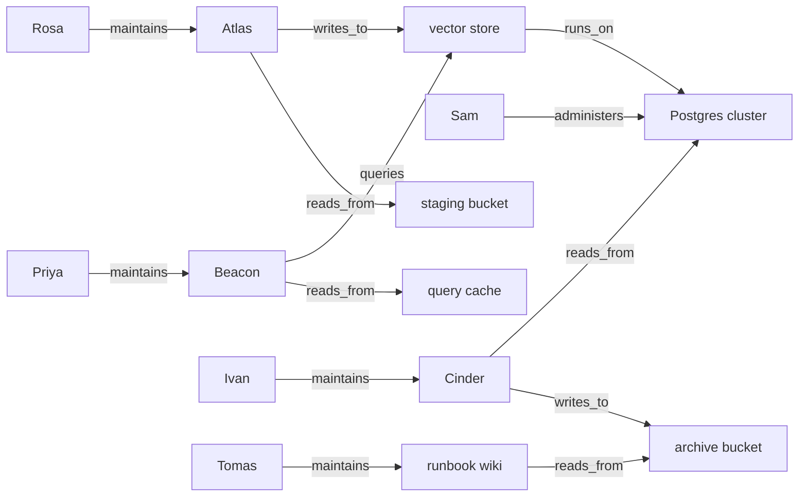

# 29.4 Knowledge graphs and GraphRAG

Vector search answers one shape of question extremely well: *which passage
talks about this?* It answers two other shapes badly. The first is the
**connection** question — "who is affected if this database goes down?" —
where the answer is never written in any single passage but is assembled from
several, chained together. The second is the **global** question — "what are
the main parts of this system?" — where the answer summarizes the whole corpus
and no top-$k$ of it will do. This section builds the standard fix: extract a
graph of entities and relations from the text, then *traverse* it. You already
know how to store and search a graph from
[Chapter 37](../ch37-graphs/index.md); the new part is where the graph comes
from and how it plugs into a RAG pipeline.

## The question top-$k$ cannot answer

Here is a knowledge base of thirteen operational notes, and a question that a
capable on-call engineer answers instantly and a vector index does not.

```python
import re
import numpy as np

NOTES = [
    "Rosa maintains the Atlas ingestion service.",
    "Atlas writes to the vector store.",
    "Atlas reads from the staging bucket.",
    "The vector store runs on the Postgres cluster.",
    "Priya maintains the Beacon search API.",
    "Beacon queries the vector store.",
    "Beacon reads from the query cache.",
    "Ivan maintains the Cinder billing job.",
    "Cinder reads from the Postgres cluster.",
    "Cinder writes to the archive bucket.",
    "Sam administers the Postgres cluster.",
    "Tomas maintains the runbook wiki.",
    "The runbook wiki reads from the archive bucket.",
]

def tokenize(t):
    return re.findall(r"[a-z0-9]+", t.lower())

vocab = sorted({w for note in NOTES for w in tokenize(note)})
col = {w: i for i, w in enumerate(vocab)}
N = len(NOTES)
doc_freq = np.zeros(len(vocab))
for note in NOTES:
    for w in set(tokenize(note)):
        doc_freq[col[w]] += 1
idf = np.log((1 + N) / (1 + doc_freq)) + 1.0

def vec(text):
    v = np.zeros(len(vocab))
    for w in tokenize(text):
        if w in col:
            v[col[w]] += 1.0
    v *= idf
    n = np.linalg.norm(v)
    return v / n if n else v

INDEX = np.stack([vec(note) for note in NOTES])
QUERY = "which people must be warned before the Postgres cluster is taken down?"
scores = INDEX @ vec(QUERY)

print(f"query: {QUERY}\n")
print("vector search, top 4:")
for i in np.argsort(-scores)[:4]:
    print(f"  {scores[i]:.3f}  {NOTES[i]}")

PEOPLE = ["Rosa", "Priya", "Ivan", "Sam", "Tomas"]
found = {p for i in np.argsort(-scores)[:4] for p in PEOPLE if p in NOTES[i]}
print("\npeople named anywhere in those four notes:", sorted(found))
```

Vector search does its job perfectly and still fails the task. All three
Postgres sentences come back — they are genuinely the most similar passages —
and exactly one person appears among them: **Sam**, the administrator. But
Rosa's Atlas service writes into the vector store, which runs on that cluster;
Ivan's Cinder job reads from the cluster directly. Both need warning, and
neither of their notes contains the word "Postgres". Raise $k$ and you
eventually scrape them in alongside every unrelated note, with no way to tell
which of them mattered or why. The information is not missing from the corpus.
It is *distributed across sentences*, and similarity search cannot chain.

## Entities, relations, triples

A **knowledge graph** stores exactly the structure the sentences imply:

- **Entities** are the nodes: people, services, data stores.
- **Relations** are labelled, directed edges: `maintains`, `writes_to`,
  `runs_on`.
- A **triple** is one edge written out — `(subject, relation, object)` — the
  atomic unit of every knowledge-graph system there has ever been.



Now the question "who must be warned about the Postgres cluster?" has an
obvious mechanical answer: start at `Postgres cluster`, walk outwards, collect
every person you reach. That is breadth-first search
([Section 37.2](../ch37-graphs/02-traversal.md)) on a graph you built five
minutes ago.

### Extracting triples with rules

The cheapest extractor is a table of regular expressions. Deterministic, free,
instant — and, as we will see, brittle.

```python
import re

NOTES = [
    "Rosa maintains the Atlas ingestion service.",
    "Atlas writes to the vector store.",
    "Atlas reads from the staging bucket.",
    "The vector store runs on the Postgres cluster.",
    "Priya maintains the Beacon search API.",
    "Beacon queries the vector store.",
    "Beacon reads from the query cache.",
    "Ivan maintains the Cinder billing job.",
    "Cinder reads from the Postgres cluster.",
    "Cinder writes to the archive bucket.",
    "Sam administers the Postgres cluster.",
    "Tomas maintains the runbook wiki.",
    "The runbook wiki reads from the archive bucket.",
]

RULES = [
    (r"^(.+?) maintains (?:the )?(.+?)\.?$", "maintains"),
    (r"^(.+?) administers (?:the )?(.+?)\.?$", "administers"),
    (r"^(?:The )?(.+?) writes to (?:the )?(.+?)\.?$", "writes_to"),
    (r"^(?:The )?(.+?) reads from (?:the )?(.+?)\.?$", "reads_from"),
    (r"^(?:The )?(.+?) runs on (?:the )?(.+?)\.?$", "runs_on"),
    (r"^(?:The )?(.+?) queries (?:the )?(.+?)\.?$", "queries"),
]
ALIAS = {"Atlas ingestion service": "Atlas",      # entity resolution, by hand
         "Beacon search API": "Beacon",
         "Cinder billing job": "Cinder"}

def canonical(name):
    return ALIAS.get(name.strip(), name.strip())

def extract(notes):
    """Return (subject, relation, object, source_note_id) for every match."""
    triples = []
    for note_id, note in enumerate(notes):
        for pattern, relation in RULES:
            m = re.match(pattern, note)
            if m:
                triples.append((canonical(m.group(1)), relation,
                                canonical(m.group(2)), note_id))
                break
    return triples

TRIPLES = extract(NOTES)
print(f"{len(TRIPLES)} triples from {len(NOTES)} notes")
for s, r, o, note_id in TRIPLES[:5]:
    print(f"  ({s!r}, {r!r}, {o!r})   from note {note_id}")

entities = {s for s, _, _, _ in TRIPLES} | {o for _, _, o, _ in TRIPLES}
print(f"\n{len(entities)} entities:", sorted(entities))

HARD = "After last month's outage, ownership of Cinder passed from Rosa to Ivan."
print(f"\nrules on {HARD!r} -> {extract([HARD])}")
```

Thirteen notes give thirteen triples and fourteen entities — and then the last
line shows the wall. `"ownership of Cinder passed from Rosa to Ivan"` states a
relation every human reads instantly, and the rule table returns `[]`, because
nobody wrote a pattern for *that* phrasing. English has an unbounded number of
ways to say "Ivan maintains Cinder", which is precisely the problem language
models are good at.

Note also `ALIAS`. "Atlas ingestion service" and "Atlas" are the same thing,
and something has to decide that. This is **entity resolution**, it is the
hardest part of building a real knowledge graph, and hand-writing the table is
only viable at this scale.

### Extracting triples with a model

Real systems ask a model. The prompt is roughly "read this text and return
JSON triples using only these relation types", the output is parsed and merged
into the graph. Our `FakeLLM` is scripted, as everywhere in this chapter, but
it stands in exactly where the API call would go.

```python
class FakeLLMExtractor:
    """Scripted stand-in for 'ask the model to return JSON triples'.

    A real extractor sends the sentence plus an allowed-relations list and
    parses the JSON that comes back. This one looks the answer up, so the
    output is identical every run — but the *interface* is the real one, and
    the point it illustrates is real too: it handles phrasings no regular
    expression anticipated.
    """
    SCRIPT = {
        "After last month's outage, ownership of Cinder passed from Rosa to Ivan.":
            [("Ivan", "maintains", "Cinder"), ("Rosa", "previously_maintained", "Cinder")],
        "Beacon has depended on the vector store since the migration.":
            [("Beacon", "queries", "vector store")],
        "Nothing in this sentence relates two things.": [],
    }
    ALLOWED = {"maintains", "administers", "writes_to", "reads_from",
               "runs_on", "queries", "previously_maintained"}

    def __call__(self, text):
        triples = self.SCRIPT.get(text, [])
        return [t for t in triples if t[1] in self.ALLOWED]   # always validate!

extractor = FakeLLMExtractor()
for sentence in ["After last month's outage, ownership of Cinder passed from Rosa to Ivan.",
                 "Beacon has depended on the vector store since the migration.",
                 "Nothing in this sentence relates two things."]:
    print(f"{sentence[:52]:<54} -> {extractor(sentence)}")
```

Two things in that class are not decoration. **`ALLOWED`** is a closed relation
vocabulary: without one, a model will invent `owns`, `is_owned_by`,
`maintained_by`, and `looks_after` for the same relationship, and your graph
will have four edge types that mean one thing. Constrain the schema and
validate the output, exactly as
[Section 28.2](../ch28-tools-mcp/02-structured-output.md) did for tool
arguments. And the third example returning `[]` matters just as much: an
extractor that always finds something will happily manufacture relations from
sentences that have none.

!!! note "Be honest about which one you would ship"

    Rule-based extraction is what we can *run* in a browser, so it is what this
    page uses. It is not what production systems use. Microsoft Research's
    GraphRAG, and every comparable system, extracts entities and relations
    with an LLM, one call per chunk, because the phrasing space is unbounded.
    That is also where most of the cost lives — see the end of this section.

## Storing the graph: dictionaries of lists

The representation is the one from
[Section 37.1](../ch37-graphs/01-representations.md): an **adjacency map**, a
dictionary from each node to a list of its edges. Two of them, in fact — one
for outgoing edges and one for incoming — because a knowledge graph is
directed but almost every interesting question ignores direction. Each edge
also carries the id of the note it came from, which is what will make the
answer citable.

```python
# continues
out_edges, in_edges = {}, {}
for s, r, o, note_id in TRIPLES:
    out_edges.setdefault(s, []).append((r, o, note_id))
    in_edges.setdefault(o, []).append((r, s, note_id))

print("out-edges of 'Atlas'          :", out_edges.get("Atlas"))
print("in-edges  of 'vector store'   :", in_edges.get("vector store"))
print("in-edges  of 'Postgres cluster':", in_edges.get("Postgres cluster"))

def degree(node):
    return len(out_edges.get(node, [])) + len(in_edges.get(node, []))

print("\nbusiest nodes:", [(e, degree(e))
                          for e in sorted(entities, key=lambda e: (-degree(e), e))[:5]])
```

A dictionary of lists costs $O(V + E)$ memory and answers "who are this node's
neighbours?" in time proportional to the number of neighbours — the right
trade for a sparse graph, and the reason nobody stores a knowledge graph as an
adjacency matrix. The degree count is the first thing worth looking at in any
new graph: here five nodes tie at degree 3 — the three services, the vector
store and the Postgres cluster — so this graph has no dramatic hub. On a real
service map the degree ranking tells you immediately which entities everything
depends on, and those are exactly the entities outage questions are about.

## Traversal: the answer, and the trail that justifies it

Now answer the opening question. Walk outwards from `Postgres cluster` in
breadth-first order, ignoring edge direction, and stop at people. Because BFS
explores in rings, the first time it reaches a person it has found the
*shortest* chain of reasoning — and because every edge remembers its source
note, that chain doubles as a citation trail.

```python
# continues
from collections import deque

PEOPLE = {s for s, r, _, _ in TRIPLES if r in ("maintains", "administers")}
print("people, derived from the graph itself:", sorted(PEOPLE))

def neighbours(node):
    """Both directions: a knowledge graph is directed, blast radius is not."""
    for r, o, note_id in out_edges.get(node, []):
        yield o, f"{node} --{r}--> {o}", note_id
    for r, s, note_id in in_edges.get(node, []):
        yield s, f"{s} --{r}--> {node}", note_id

def bfs_paths(start, max_hops=3):
    """Yield (node, path) for every node within max_hops, nearest first."""
    seen, frontier = {start}, deque([(start, [])])
    while frontier:
        node, path = frontier.popleft()
        if len(path) >= max_hops:
            continue
        for nxt, label, note_id in neighbours(node):
            if nxt in seen:
                continue
            seen.add(nxt)
            frontier.append((nxt, path + [(label, note_id)]))
            yield nxt, path + [(label, note_id)]

print("\nwho must be warned before 'Postgres cluster' goes down?")
for node, path in bfs_paths("Postgres cluster", max_hops=3):
    if node in PEOPLE:
        trail = "  ".join(label for label, _ in path)
        cites = sorted({note_id for _, note_id in path})
        print(f"  {node:<6} {len(path)} hop(s)  {trail}")
        print(f"         sources: {cites}")
```

Four people, each with the reasoning printed. **Sam** at one hop because he
administers the cluster. **Ivan** at two, because Cinder reads from the cluster
and Ivan maintains Cinder. **Rosa** and **Priya** at three, through the vector
store. Vector search found only Sam.

Look at what the traversal gives you that a similarity score never does: the
`sources` list on each line is the set of original notes whose text produced
those edges. You can show a user *"Rosa, because note 3 says the vector store
runs on the Postgres cluster, note 1 says Atlas writes to the vector store, and
note 0 says Rosa maintains Atlas."* That is an explanation, not a ranking, and
it is auditable.

!!! warning "Hops are expensive, and mostly noise"

    Every extra hop multiplies the reachable set. On a dense real graph, three
    hops from a busy node reaches almost everything, so "within $n$ hops" stops
    being a filter. Real systems cap hops at 2–3, prefer specific relation
    types when expanding, and rank the results — for instance by path length,
    as BFS naturally provides.

## Communities: answering questions about the whole corpus

The second failure of vector search is the *global* question: "what are the
main parts of this system?" No note answers it. No top-$k$ answers it either,
because the answer is a property of the whole graph.

GraphRAG's idea — introduced by Microsoft Research — is to partition the graph
into **communities** of densely connected entities, summarize each community
with a model, then answer global questions from the summaries instead of from
the raw text. Real implementations use the Leiden algorithm, a
modularity-optimizing method that also produces a *hierarchy* of communities.
We will build the simplest honest version: first connected components (which
we will see is too coarse), then label propagation.

```python
# continues
import random

undirected = {}
for s, _, o, _ in TRIPLES:
    undirected.setdefault(s, set()).add(o)
    undirected.setdefault(o, set()).add(s)

def connected_components(adj):
    """BFS from every unvisited node — Section 37.2, unchanged."""
    seen, components = set(), []
    for start in sorted(adj):
        if start in seen:
            continue
        group, frontier = [], deque([start])
        seen.add(start)
        while frontier:
            node = frontier.popleft()
            group.append(node)
            for m in sorted(adj[node]):
                if m not in seen:
                    seen.add(m)
                    frontier.append(m)
        components.append(sorted(group))
    return components

print("connected components:", len(connected_components(undirected)))

def label_propagation(adj, seed, rounds=10):
    """Every node repeatedly adopts the commonest label among its neighbours."""
    rng = random.Random(seed)
    label = {node: node for node in adj}
    order = sorted(adj)
    for _ in range(rounds):
        rng.shuffle(order)                      # order matters; that is the catch
        for node in order:
            counts = {}
            for m in adj[node]:
                counts[label[m]] = counts.get(label[m], 0) + 1
            if counts:
                label[node] = min(counts, key=lambda l: (-counts[l], l))
    groups = {}
    for node, l in label.items():
        groups.setdefault(l, []).append(node)
    return [sorted(g) for g in sorted(groups.values(), key=lambda g: (-len(g), g))]

print("communities found, by seed:",
      {s: len(label_propagation(undirected, s)) for s in range(6)})

COMMUNITIES = label_propagation(undirected, seed=2)
print()
for i, community in enumerate(COMMUNITIES):
    print(f"  community {i}: {community}")
```

Connected components returns **1**: everything is reachable from everything,
because the Postgres cluster touches all of it. Connectivity is not community.
Label propagation, which lets each node repeatedly adopt its neighbours'
commonest label, splits the same graph into three groups that a human would
recognize — ingestion-and-infrastructure, billing-and-docs, and search.

The seed sweep prints the honest caveat: `{0: 3, 1: 3, 2: 3, 3: 1, 4: 3, 5: 2}`.
Label propagation depends on the order nodes are updated in, and at seed 3 it
collapses into a single community. That instability is exactly why production
GraphRAG uses Leiden, which optimizes an explicit objective (modularity) and
yields a stable hierarchy. The *idea* — partition, summarize, answer globally
from the summaries — is what we are after here.

### Community summaries, and the global answer

```python
# continues
def summarize_community(members):
    """Rule-based community report. A real GraphRAG asks a model for prose."""
    people = sorted(m for m in members if m in PEOPLE)
    edges = [(s, r, o) for s, r, o, _ in TRIPLES if s in members and o in members]
    services = sorted({s for s, r, _ in edges if r in ("writes_to", "reads_from",
                                                       "queries", "runs_on")})
    stores = sorted({o for _, r, o in edges if r in ("writes_to", "reads_from",
                                                     "runs_on")})
    return (f"owners: {', '.join(people) or 'none'}; "
            f"services: {', '.join(services) or 'none'}; "
            f"data stores: {', '.join(stores) or 'none'}; "
            f"{len(edges)} internal relations")

REPORTS = [summarize_community(c) for c in COMMUNITIES]
for i, report in enumerate(REPORTS):
    print(f"community {i}: {report}")

def answer_global(question):
    """Global questions read the community reports, not the raw notes."""
    lines = [f"[C{i}] {r}" for i, r in enumerate(REPORTS)]
    return (f"Question: {question}\nAnswer, assembled from {len(REPORTS)} "
            f"community reports:\n" + "\n".join(lines))

print()
print(answer_global("What are the main parts of this system and who owns them?"))
print(f"\ncommunity reports: {sum(len(r) for r in REPORTS)} characters; "
      f"raw notes: {sum(len(n) for n in NOTES)} characters")
```

Three reports, covering every entity in the corpus, in fewer characters than
the notes themselves — and at this toy scale the saving is small, which is the
point worth stating plainly. The technique earns its keep when the corpus is
ten thousand documents and the community reports are a few hundred: then a
global question that no top-$k$ could ever cover is answered from a summary
layer that *does* cover everything. That layering — leaves, community reports,
global report — is the same hierarchy as the summary tree in
[Section 29.3](03-agent-memory.md), built over a graph instead of a
conversation.

## Combining graph and vector

In practice you run both and merge, exactly as hybrid search merged BM25 and
vectors in [Section 29.1](01-embeddings-vector-search.md). Vector retrieval
finds passages that *talk about* the query; graph expansion finds passages
*connected to* the entities in the query. Reciprocal rank fusion merges the
two ranked lists without needing their scores to be comparable.

```python
# continues
def vector_ranking(query, k=5):
    return [int(i) for i in np.argsort(-(INDEX @ vec(query)))[:k]]

def graph_ranking(query, max_hops=3):
    """Notes reachable from entities named in the query, nearest first."""
    mentioned = [e for e in sorted(entities, key=lambda e: (-len(e), e))
                 if e.lower() in query.lower()]
    ranked = []
    for start in mentioned:
        for _, path in bfs_paths(start, max_hops):
            for _, note_id in path:
                if note_id not in ranked:
                    ranked.append(note_id)
    return mentioned, ranked

def rrf(rankings, k=60):
    fused = {}
    for ranking in rankings:
        for rank, item in enumerate(ranking, start=1):
            fused[item] = fused.get(item, 0.0) + 1.0 / (k + rank)
    return sorted(fused, key=lambda d: -fused[d]), fused

QUERY = "which people must be warned before the Postgres cluster is taken down?"
v = vector_ranking(QUERY)
mentioned, g = graph_ranking(QUERY)
order, score = rrf([v, g])

print("entities recognised in the query:", mentioned)
print("vector ranking :", v)
print("graph ranking  :", g)
print("\nfused evidence:")
for note_id in order[:10]:
    tags = ("V" if note_id in v else "-") + ("G" if note_id in g else "-")
    print(f"  {score[note_id]:.4f} [{tags}]  {NOTES[note_id]}")
```

Read the `[VG]` tags. The three Postgres notes are found by *both* retrievers
and take the top three places, which is what agreement should buy you. Below
them sit notes only the graph produced, marked `[-G]` — including
*"Atlas writes to the vector store"* and, last in this listing,
*"Rosa maintains the Atlas ingestion service"*: the two links that put Rosa in
the answer at all, and neither of which similarity search would ever have
returned for a question about Postgres. The fused list contains everything
needed to answer the question *and* everything needed to justify it, which is
what you hand to the prompt template of
[Section 29.2](02-rag-pipeline.md).

## What it costs, honestly

GraphRAG is not a strictly better RAG. It is a different trade, and the trade
is expensive.

- **Extraction dominates the bill.** One or more model calls per chunk at
  ingest time, versus one cheap embedding call. On a large corpus that is the
  difference between minutes and hours, and between cents and real money.
- **The graph goes stale.** Vector indexes update per document: change a file,
  re-embed one chunk. A graph's entities and communities are *global*
  structures — new documents can merge two communities or rename an entity, and
  keeping summaries fresh means recomputing more than the part you changed.
- **Entity resolution is unsolved.** "Postgres cluster", "the PG cluster",
  "prod-db-1" and "our database" may be one thing. Get this wrong and the graph
  fragments into synonyms, and traversal quietly stops finding anything.
- **Extraction errors are silent and structural.** A wrong sentence in a vector
  index is one bad retrieval. A wrong edge in a graph is a wrong *inference*,
  reachable from everywhere, and it looks exactly as authoritative as a right
  one.

| Your situation | Reach for |
| --- | --- |
| "What does the docs say about X?" — most questions are lookups | **Vector RAG.** Cheap, incremental, well understood. Start here, always. |
| Rare identifiers, error codes, part numbers matter | **Hybrid** BM25 + vector with RRF ([29.1](01-embeddings-vector-search.md)) |
| "How is A connected to B?", blast radius, dependency chains | **Graph**, or graph + vector |
| "Summarize the main themes across all 10,000 documents" | **Graph communities**, the GraphRAG global mode |
| Your data is *already* a graph (org chart, code imports, service mesh) | **Graph** — you skip the expensive extraction step entirely |
| Small corpus, tight deadline, or no evaluation set yet | **Vector RAG.** Measure first; add structure when the metrics say you need it |

The last row is the one to take seriously. Vector RAG with good chunking,
hybrid retrieval, and an honest recall@k measurement solves most problems, and
you can build it in an afternoon. Add a graph when you have measured a class of
questions it fails on — not because graphs are interesting, though they are.

!!! warning "Common mistakes"

    - **Skipping entity resolution.** Without an alias table (or an embedding
      similarity pass over entity names), "Atlas" and "Atlas ingestion
      service" become two nodes, the edges split between them, and traversal
      silently returns half the answer.
    - **Leaving the relation vocabulary open.** An LLM extractor asked for
      "relations" will produce `owns`, `is_owned_by`, `maintained_by` and
      `looks_after` across four chunks. Fix the allowed list, validate against
      it, and reject the rest.
    - **Traversing too far.** Three hops from a hub node reaches everything;
      the "answer" becomes the whole corpus. Cap the hops, restrict the
      relation types, and rank by path length.
    - **Treating extracted edges as ground truth.** They came from a model
      reading prose. Carry the source note id on every edge — as we did — so a
      human can check the claim, and so your answers can cite it.
    - **Building a graph before measuring vector RAG.** Extraction costs real
      money and real maintenance. Prove the failure first.

## Check your understanding

1. Vector search retrieved all three notes mentioning the Postgres cluster and
   still missed Rosa. Would a better embedding model have fixed it?

    ??? success "Answer"
        No. Rosa's note — *"Rosa maintains the Atlas ingestion service"* — has
        no semantic relationship to Postgres at all; the connection exists only
        through two other sentences. Any retriever that scores each passage
        against the query independently must miss it, however good its
        embeddings are. The fix has to compose evidence across passages, which
        is what traversal does.

2. Why do we walk the graph ignoring edge direction, when the edges are
   directed?

    ??? success "Answer"
        Because the question is about *blast radius*, which flows both ways:
        `Cinder --reads_from--> Postgres cluster` means an outage in Postgres
        hurts Cinder, so from Postgres we must follow that edge backwards.
        Direction still matters for the *explanation* — the printed trail shows
        which way each relation points — but not for reachability. Other
        questions ("what does Atlas depend on?") do want direction respected,
        which is why we kept `out_edges` and `in_edges` separately.

3. Connected components returned 1 while label propagation returned 3. Both
   ran on the same graph. Is one of them wrong?

    ??? success "Answer"
        Neither. They answer different questions. Connected components asks "is
        there *any* path between these nodes?" and on this graph the answer is
        always yes, because the Postgres cluster is shared. Community detection
        asks "which nodes are *densely* connected relative to the rest?", which
        is a matter of degree and admits several defensible answers — as the
        seed sweep showed, label propagation itself gives different partitions
        on different runs. That instability is why production systems use
        Leiden, which optimizes an explicit objective.

4. A colleague proposes replacing your working vector RAG with GraphRAG
   because "it handles complex questions better". What do you ask for first?

    ??? success "Answer"
        A labelled set of the questions it is supposed to fix, and the current
        system's recall@k and MRR on them ([Section 29.2](02-rag-pipeline.md)).
        If the failures are multi-hop connection questions or corpus-wide
        summaries, a graph is the right tool. If they are chunking failures,
        missing rare identifiers, or a reranking problem, a graph costs an
        LLM call per chunk at ingest plus permanent maintenance and fixes none
        of them.
