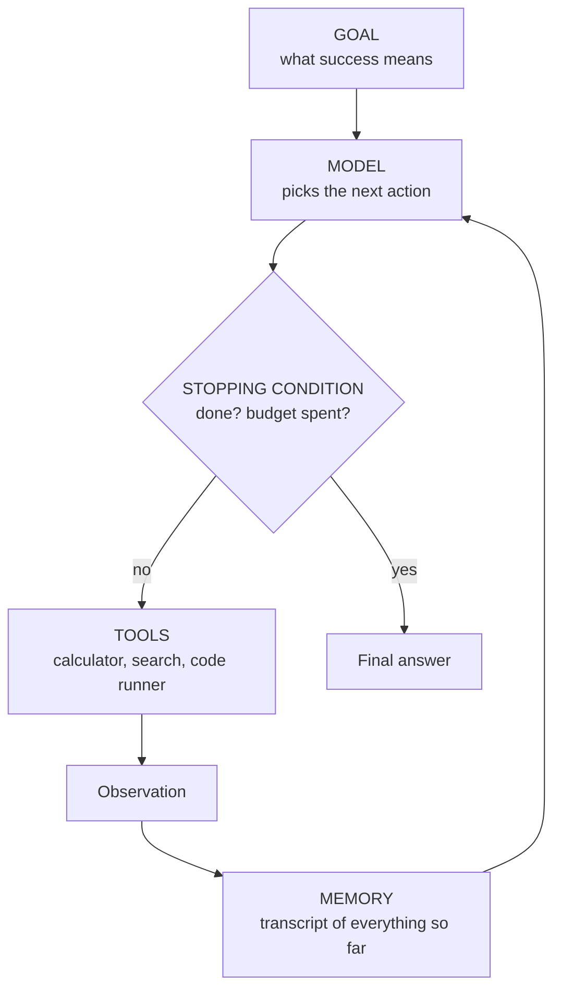

# 30.1 The agent loop and ReAct

You can already make a model call a tool
([28.1](../ch28-tools-mcp/01-function-calling.md)) and give it something to
remember ([Chapter 29](../ch29-memory-rag/index.md)). An **agent** is what you
get when you put those two capabilities inside a `while` loop and hand the
loop's steering wheel to the model.

That single structural change — **the model decides what happens next, not
you** — is the whole idea, and it is also the source of every failure mode in
this chapter. By the end of this page you will have written a complete agent in
about ninety lines, and then broken it four different ways on purpose.

## Definition first: an agent is a loop

!!! abstract "In plain words"

    - **What it is.** An agent is a model running in a loop: it looks at the
      situation, picks an action, sees what happened, and decides again — over
      and over — instead of producing one answer and stopping.
    - **Picture it.** A GPS reading out a fixed route recites the turns no
      matter what; a driver watching the road takes the next turn based on the
      traffic ahead, reroutes when a street is closed, and stops on arrival. An
      agent is the driver — it chooses each step from what it just saw.
    - **Why it matters.** The new thing is *who decides the control flow*. In a
      pipeline you fix the order in code; in an agent the model chooses it at
      run time. That flexibility is the whole point — and the reason an agent
      can also loop forever, so every one needs a budget.

> An **agent** is a program in which a model repeatedly chooses an action,
> observes the result of that action, and uses the observation to choose the
> next action, until it decides it is done or a budget runs out.

Read that again with the emphasis on *chooses*. The novelty is not that a
program calls a model in a loop — you could write that in Chapter 6. The
novelty is that the **control flow** is data produced by the model at runtime.

Four shapes of LLM program, distinguished by exactly one question:

| Shape | Example | Who decides what runs next? | How many model calls? |
| ----- | ------- | --------------------------- | --------------------- |
| Single completion | "Summarise this email." | Nobody — there is no "next". | 1 |
| Chain / pipeline | translate → summarise → format | The **programmer**, at write time. Fixed order. | Fixed (3 here) |
| Workflow | branch on a classifier's label, retry on error | The **programmer**, at write time; the model only fills in a branch condition. | Bounded, known shape |
| **Agent** | "Answer this using these tools." | The **model**, at run time. | Unknown until it stops |

A chain is a recipe. A workflow is a recipe with `if` statements. An agent is
a cook who decides what to do next after tasting. The cook can improvise — and
can also stand at the stove forever.

Here is the difference in code, with nothing subtle in it:

```python
# A pipeline: the ORDER is written by you, in the source, forever.
def pipeline(text):
    step1 = f"[cleaned] {text.strip().lower()}"
    step2 = f"[summarised] {step1[:20]}"
    return f"[formatted] {step2}"

# An agent loop: the order is decided by `policy`, at run time.
def agent(text, policy, tools, max_steps=4):
    observation = text
    for _ in range(max_steps):
        action = policy(observation)              # the model's choice
        if action == "STOP":
            return observation
        observation = tools[action](observation)
    return observation                            # budget ran out

def toy_policy(observation):
    if "cleaned" not in observation:
        return "clean"
    if "counted" not in observation:
        return "count"
    return "STOP"

toy_tools = {
    "clean": lambda s: f"[cleaned] {s.strip().lower()}",
    "count": lambda s: f"[counted {len(s)} chars] {s}",
}

print(pipeline("  Hello Agents  "))
print(agent("  Hello Agents  ", toy_policy, toy_tools))
```

The pipeline always runs three stages in the same order. The agent ran two,
because `toy_policy` looked at what came back and decided. Swap in a policy
that never returns `"STOP"` and the loop runs until `max_steps` — which is why
`max_steps` is in the signature from the very first draft.

## The anatomy of an agent

Every agent, in every framework you will meet on [30.4](04-frameworks.md), is
assembled from the same six parts:



| Part | What it is concretely | What goes wrong without it |
| ---- | --------------------- | -------------------------- |
| Goal | a string in the prompt | the agent drifts; nothing defines "done" |
| Model | a function `str -> str` | — |
| Tools | a dict of Python functions | the model can only talk, not act |
| Memory | the growing transcript | the agent forgets and repeats itself |
| Loop | a `for` over steps | you have a chain, not an agent |
| Stopping condition | a `Final Answer:` line **and** a step budget | the program never terminates |

Memory and the stopping condition are not optional extras. They are
load-bearing, and half of this page is about what happens when they are weak.

## ReAct: reason, then act

!!! abstract "In plain words"

    - **What it is.** ReAct interleaves *thinking* and *doing*: the model writes
      a short thought, takes one action, reads the result, then thinks again —
      **Thought → Action → Observation**, repeating until it can answer.
    - **Picture it.** It is how you cook from a half-remembered recipe. You say
      "I think it needs salt" (thought), add a pinch (action), taste
      (observation), and adjust — rather than dumping every ingredient in at
      once and hoping.
    - **Why it matters.** Reasoning without acting invents facts; acting without
      reasoning flails. Alternating the two means every action is justified by a
      thought and every thought is grounded in a real observation — and the
      written trail is exactly what you read when you debug the agent.

The dominant text format for agent loops comes from **ReAct** (Yao et al.,
*ReAct: Synergizing Reasoning and Acting in Language Models*, ICLR 2023).

The idea in one sentence: instead of asking the model *either* to reason ("think
step by step") *or* to act (call a tool), **interleave the two** — so that each
thought is informed by a real observation and each action is justified by a
thought.

The model is asked to emit a cycle of three labelled fields:

```text
Thought: I do not know the tower's height yet, so I should look it up.
Action: wiki
Action Input: Eiffel Tower
Observation: The Eiffel Tower stands in Paris, France. Height: 330 m.
Thought: Now I can convert 330 metres to feet.
Action: convert
Action Input: 330 m to ft
Observation: 330.0 m = 1082.68 ft
...
Thought: I have everything I need.
Final Answer: about 1082.68 feet.
```

The division of labour is the part to get right:

| Line | Written by |
| --- | --- |
| `Thought:` | the model |
| `Action:` | the model |
| `Action Input:` | the model |
| `Observation:` | **your program** — it parses the action, runs the real Python function, and appends the result |
| `Final Answer:` | the model, when it decides it is done |

The transcript *is* the memory: on the next turn the whole thing is fed back in
as the prompt.

!!! note "Why the reasoning line earns its place"

    The `Thought` line is not decoration. It is where the model connects the
    last observation to the next action, and it is the first thing you read
    when debugging a trace. A correct action after a nonsense thought means
    you got lucky, not that the agent works.

## Building a complete ReAct agent

Here is the whole thing, in four numbered parts you will see marked in the
source:

1. **Tools** — three ordinary Python functions, string in, string out.
2. **The model stand-in** — a rule-based policy.
3. **The parser** — model text into a decision dict, with a repair path.
4. **The loop** — with a step budget.

Read it once top to bottom before you run it.

Our model is a `FakeLLM`: a small, deterministic, rule-based **policy** that
reads the transcript and decides what is still missing. It stands in for a real
chat model so that the trace is identical on every machine and every run, with
no API key and no network. Its contract is deliberately the same contract a chat
API offers: **text in, text out**.

Each rule fires on the *absence* of something from the transcript
(`"Height:" not in transcript`), which is what makes it genuinely react to
whatever the tools return rather than replay a fixed script. Swapping it for a
real model is a one-line change, and we show that line immediately after the
code.

```python
"""A complete ReAct agent: three tools, a policy, a parser, and the loop."""
import re

# ---- 1. Tools: ordinary Python functions. String in, string out. -----------
WIKI = {
    "eiffel tower": "The Eiffel Tower stands in Paris, France. Height: 330 m.",
    "empire state building": "The Empire State Building is in New York. Height: 443 m.",
    "great pyramid": "The Great Pyramid of Giza stands near Cairo. Height: 139 m.",
}

def wiki(query):
    """Look a landmark up in a three-article in-memory encyclopedia."""
    key = query.strip().strip('"').lower()
    for title, article in WIKI.items():
        if key in title or title in key:
            return article
    return f"No article titled {query!r}. Known titles: {', '.join(WIKI)}."

def calc(expression):
    """Arithmetic on two numbers, e.g. '1082.68 / 100'. We parse the three
    parts ourselves rather than calling eval() on model output — that is
    28.1's security rule actually carried out."""
    m = re.fullmatch(r"\s*(-?[\d.]+)\s*([-+*/])\s*(-?[\d.]+)\s*", expression)
    if not m:
        return "Error: calc takes '<number> <op> <number>', e.g. '12 * 4'."
    a, op, b = float(m[1]), m[2], float(m[3])
    if op == "/" and b == 0:
        return "Error: division by zero."
    ops = {"+": lambda: a + b, "-": lambda: a - b,
           "*": lambda: a * b, "/": lambda: a / b}
    return str(round(ops[op](), 4))

FACTORS = {("m", "ft"): 3.28084, ("ft", "m"): 0.3048,
           ("km", "mi"): 0.621371, ("kg", "lb"): 2.20462}

def convert(text):
    """Convert a quantity between units, e.g. '330 m to ft'."""
    m = re.fullmatch(r"\s*([\d.]+)\s*(\w+)\s+to\s+(\w+)\s*", text)
    if not m:
        return "Error: expected '<number> <unit> to <unit>', e.g. '5 m to ft'."
    amount, src, dst = float(m[1]), m[2], m[3]
    if (src, dst) not in FACTORS:
        return f"Error: I cannot convert {src} to {dst}. Known: {list(FACTORS)}."
    return f"{amount} {src} = {round(amount * FACTORS[(src, dst)], 2)} {dst}"

TOOLS = {"wiki": wiki, "calc": calc, "convert": convert}

# ---- 2. The model stand-in ------------------------------------------------
class FakeLLM:
    """A rule-based policy standing in for a real chat model.

    A real model is a function from prompt text to reply text, and so is
    this: `llm(transcript) -> str`. Every rule fires when something the
    agent still needs is MISSING from the transcript, so the policy reacts
    to whatever the tools returned instead of replaying a script.
    """

    def __call__(self, transcript):
        if "Height:" not in transcript:            # nothing looked up yet
            return ("Thought: I need the tower's height before I can convert it.\n"
                    "Action: wiki\n"
                    "Action Input: Eiffel Tower")
        if " ft" not in transcript:                # have metres, need feet
            return ("Thought: The article says 330 m. Convert that to feet.\n"
                    "Action: convert\n"
                    "Action Input: 330 m to ft")
        if "10.8268" not in transcript:            # have feet, need the division
            return ("Thought: The height is 1082.68 ft; now divide it by 100.\n"
                    "Action: calc\n"
                    "Action Input: 1082.68 / 100")
        return ("Thought: I have the height in feet and the division.\n"
                "Final Answer: The Eiffel Tower is about 1082.68 ft tall, "
                "which is 10.8268 hundreds of feet.")

# ---- 3. Parser: model text -> a decision dict ------------------------------
def parse(reply):
    """Pull Thought / Action / Action Input / Final Answer out of a reply."""
    fields = {}
    for line in reply.splitlines():
        for tag in ("Thought", "Action Input", "Action", "Final Answer"):
            if line.strip().startswith(tag + ":"):
                fields[tag] = line.strip()[len(tag) + 1:].strip()
                break
    if "Final Answer" in fields:
        return {"kind": "final", **fields}
    if "Action" in fields and "Action Input" in fields:
        return {"kind": "act", **fields}
    return {"kind": "unparsed", **fields}          # the repair path

# ---- 4. The loop -----------------------------------------------------------
def run_react(llm, goal, tools, max_steps=6):
    transcript = f"Goal: {goal}\n"
    for step in range(1, max_steps + 1):
        reply = llm(transcript)                    # <-- the one line to swap
        decision = parse(reply)
        print(f"--- step {step} ---")
        print("Thought:", decision.get("Thought", "(none given)"))
        if decision["kind"] == "final":
            print("Final Answer:", decision["Final Answer"])
            return decision["Final Answer"]
        if decision["kind"] == "unparsed":
            observation = ("PARSE ERROR: reply with an 'Action:' line and an "
                           "'Action Input:' line, or with 'Final Answer:'.")
        else:
            action, arg = decision["Action"], decision["Action Input"]
            print(f"Action: {action}({arg!r})")
            observation = (tools[action](arg) if action in tools else
                           f"TOOL ERROR: no tool named {action!r}. "
                           f"Available tools: {', '.join(tools)}.")
        print("Observation:", observation)
        transcript += reply + f"\nObservation: {observation}\n"
    print(f"--- budget exhausted after {max_steps} steps, no answer ---")
    return None

goal = ("How tall is the Eiffel Tower in feet, and what is that height "
        "divided by 100?")
run_react(FakeLLM(), goal, TOOLS)
```

Run it and you get the full trace, exactly:

```text
--- step 1 ---
Thought: I need the tower's height before I can convert it.
Action: wiki('Eiffel Tower')
Observation: The Eiffel Tower stands in Paris, France. Height: 330 m.
--- step 2 ---
Thought: The article says 330 m. Convert that to feet.
Action: convert('330 m to ft')
Observation: 330.0 m = 1082.68 ft
--- step 3 ---
Thought: The height is 1082.68 ft; now divide it by 100.
Action: calc('1082.68 / 100')
Observation: 10.8268
--- step 4 ---
Thought: I have the height in feet and the division.
Final Answer: The Eiffel Tower is about 1082.68 ft tall, which is 10.8268 hundreds of feet.
```

Three tools, three steps, one answer — and **nowhere in the source did we write
"first look it up, then convert, then divide"**. That ordering was *chosen*, one
step at a time, from what came back. Change the encyclopedia entry to give the
height in feet already and the policy skips step 2 without a code change.

### Swapping in a real model

`run_react` mentions the model on exactly one line. Replacing the stand-in
with a hosted model is that line and nothing else — same string in, same
string out. This is not runnable here because it needs a network and an API
key, which is precisely why the rest of the page uses `FakeLLM`:

```text
# before — deterministic, offline, free:
reply = llm(transcript)

# after — a hosted chat model. MODEL_ID is whatever id your provider documents:
reply = client.messages.create(
    model=MODEL_ID,
    max_tokens=512,
    messages=[{"role": "user", "content": transcript}],
).content[0].text
```

Everything else on this page — the parser, the budget, the loop guard, the
tool validation, the token accounting — is provider-independent plumbing that
you would keep exactly as written.

## Failure mode 1: the loop that never ends

The most common agent bug is not a wrong answer; it is *no* answer. If the
model never emits `Final Answer`, the loop stops only because you made it
stop.

```python
# continues
class StubbornLLM:
    """A policy with an entirely realistic bug: it never decides it is done."""
    def __call__(self, transcript):
        return ("Thought: Let me just double-check the height.\n"
                "Action: wiki\n"
                "Action Input: Eiffel Tower")

run_react(StubbornLLM(), "How tall is the Eiffel Tower?", TOOLS, max_steps=3)
```

Three identical steps, then
`--- budget exhausted after 3 steps, no answer ---`.

**The budget is not a nicety; it is the difference between a slow answer and a
process you have to kill.** Real agents burn money per step, so production
budgets are usually a pair: max steps **and** max tokens or dollars (see
[30.4](04-frameworks.md)).

## Failure mode 2: repeating a failed action

A budget stops a runaway agent but does not make it smarter. A model that
mistypes a lookup will often mistype it again, identically, until the budget
runs out. The fix is a **loop guard**: fingerprint each action as the pair
`(tool name, normalised input)`, and if a fingerprint repeats, replace the
tool's output with a corrective observation.

```python
# continues
def run_guarded(llm, goal, tools, max_steps=6):
    transcript, seen = f"Goal: {goal}\n", set()
    for step in range(1, max_steps + 1):
        reply = llm(transcript)
        decision = parse(reply)
        if decision["kind"] == "final":
            print(f"step {step}: FINAL -> {decision['Final Answer']}")
            return decision["Final Answer"]
        action, arg = decision["Action"], decision["Action Input"]
        fingerprint = (action, arg.strip().lower())     # the action's identity
        if fingerprint in seen:
            observation = (f"LOOP GUARD: you already ran {action}({arg!r}) and "
                           "it did not help. Try a different action or input.")
        else:
            seen.add(fingerprint)
            observation = tools[action](arg) if action in tools else "TOOL ERROR"
        print(f"step {step}: {action}({arg!r})\n         -> {observation}")
        transcript += reply + f"\nObservation: {observation}\n"
    print("budget exhausted")

class TypoLLM:
    """Misspells the title, repeats the mistake, then reacts to the guard."""
    def __call__(self, transcript):
        if "Height:" in transcript:
            return "Thought: Found it.\nFinal Answer: 330 m."
        if "LOOP GUARD" not in transcript:
            return ("Thought: Look the tower up.\n"
                    "Action: wiki\nAction Input: Eifel Tower")      # typo
        return ("Thought: That exact call already failed; fix my spelling.\n"
                "Action: wiki\nAction Input: Eiffel Tower")

run_guarded(TypoLLM(), "How tall is the Eiffel Tower?", TOOLS)
```

Follow the four steps:

1. **Step 1** misspells the title and gets
   `No article titled 'Eifel Tower'. Known titles: …`.
2. **Step 2** repeats the identical call — and the guard, not the encyclopedia,
   answers.
3. **Step 3**: the policy reads `LOOP GUARD` in the transcript and changes its
   input.
4. **Step 4** finishes with `FINAL -> 330 m.`

The guard turned an infinite rut into a two-step detour, and it did so by
**writing into the transcript** — the only channel you have to the model's next
decision.

## Failure mode 3: hallucinated tool names

Models invent tools. They will confidently emit `Action: web_search` when your
registry contains only `wiki`. Never index `tools[action]` without checking
membership first: a bare `KeyError` kills the process, while a corrective
observation costs one step. `run_react` already does the check.

```python
# continues
class HallucinatingLLM:
    """Invents a tool that does not exist, then reads the error and recovers."""
    def __call__(self, transcript):
        if "TOOL ERROR" not in transcript:
            return ("Thought: I will search the web for the height.\n"
                    "Action: web_search\n"
                    "Action Input: height of the Eiffel Tower")
        if "Height:" not in transcript:
            return ("Thought: There is no web_search here, but wiki exists.\n"
                    "Action: wiki\nAction Input: Eiffel Tower")
        return "Thought: Done.\nFinal Answer: 330 metres."

run_react(HallucinatingLLM(), "How tall is the Eiffel Tower?", TOOLS, max_steps=4)
```

Step 1's observation is
`TOOL ERROR: no tool named 'web_search'. Available tools: wiki, calc, convert.`

Notice that it **lists the real tools**. An error message that merely says
"unknown tool" teaches the model nothing; one that names the alternatives is a
free correction, and the agent recovers on step 2.

!!! tip "Every error string an agent can see is a prompt"

    Because that is literally what it is — text appended to the transcript that
    the model reads before its next decision. Write your tool errors the way you
    would write an instruction, not the way you would write a log line.

## Failure mode 4: the transcript grows every step

Memory in a ReAct agent is a string that only ever gets longer, and you resend
all of it on every step. So the prompt grows linearly in steps, and the *total*
tokens sent grows with the **square** of the number of steps. Let us measure
that on the real transcript rather than assert it.

```python
# continues
def approx_tokens(text):
    """Rough English rule of thumb: about 4 characters per token."""
    return len(text) // 4

transcript, llm, sent = f"Goal: {goal}\n", FakeLLM(), 0
print(f"{'step':>4} | {'chars':>6} | {'prompt tokens':>13} | {'tokens sent so far':>18}")
for step in range(1, 5):
    sent += approx_tokens(transcript)              # the WHOLE thing is resent
    print(f"{step:>4} | {len(transcript):>6} | {approx_tokens(transcript):>13} "
          f"| {sent:>18}")
    reply = llm(transcript)
    decision = parse(reply)
    if decision["kind"] == "final":
        break
    observation = TOOLS[decision["Action"]](decision["Action Input"])
    transcript += reply + f"\nObservation: {observation}\n"

per_step = approx_tokens(transcript) / 4           # average growth per step
print(f"\naverage growth      : {per_step:.0f} tokens/step")
print(f"prompt at step 30   : {per_step * 30:.0f} tokens")
print(f"total sent, 30 steps: {per_step * 30 * 31 / 2:.0f} tokens")
```

The table shows the prompt going 21 → 63 → 96 → 126 tokens over four steps,
with 306 tokens sent in total. Extrapolating the average growth of 32
tokens/step, a 30-step run would send a 945-token prompt on its last call and
about 14,600 tokens over the whole run.

Four steps is nothing. Thirty steps of a *real* agent, with search results and
file contents as observations, is tens of thousands of tokens per call and
hundreds of thousands over the run — and eventually it simply does not fit in
the context window.

Every technique from
[29.3 Agent memory and context management](../ch29-memory-rag/03-agent-memory.md)
applies here directly:

- **Summarise old steps** once they are no longer being reasoned about.
- **Keep only the last $k$ observations verbatim.**
- **Store long tool outputs in a scratchpad**, and pass the model a short handle
  instead of the text.

## Tool descriptions matter more than model size

Beginners assume tool choice is a property of the model. **Mostly it is a
property of your descriptions.**

The model sees only the tool names and the description strings. If two tools are
described as "Searches." and "Converts.", there is nothing to choose between
them. Here is a policy crude enough that you can see exactly why — it scores
each tool by how many content words its description shares with the question:

```python
STOP_WORDS = {"a", "an", "the", "of", "or", "and", "to", "is", "in", "how",
              "many", "what", "such", "as", "by", "like", "between"}

def words(text):
    """Lower-cased content words, punctuation stripped."""
    return {w.strip("?.,()") for w in text.lower().split()} - STOP_WORDS

def fake_llm_choose_tool(question, tools):
    """Stand-in for tool selection: pick the description with the most words
    in common with the question. Ties are broken by name — i.e. arbitrarily,
    which is exactly what vague descriptions produce in a real model too."""
    scores = sorted(((len(words(desc) & words(question)), name)
                     for name, desc in tools.items()), reverse=True)
    return scores[0][1], scores

vague = {"wiki": "Searches.", "calc": "Computes.", "convert": "Converts."}
precise = {
    "wiki": "Look up facts about a named landmark, city or building.",
    "calc": "Evaluate one arithmetic expression on two numbers, e.g. 12 * 4.",
    "convert": ("Convert a quantity between units: metres, kilometres, feet, "
                "miles, kilograms, pounds."),
}

question = "How many miles is 12 kilometres?"
for label, tools in (("vague", vague), ("precise", precise)):
    choice, scores = fake_llm_choose_tool(question, tools)
    print(f"{label:>7} descriptions -> chose {choice:<8} scores={scores}")
```

- **Vague descriptions:** every tool scores `0`, and the tie-break picks `wiki`
  — the wrong tool, chosen by an accident of `reverse=True`, which sorts the
  alphabetically *last* name to the front.
- **Precise descriptions:** `convert` scores 2 (it names both *miles* and
  *kilometres*), `calc` scores 1, `wiki` nothing.

Same question, same "model", different documentation, different answer.

The practical rules that follow:

- **Say what the tool is for and when to reach for it**, not what it is called.
- **Name the units, formats and limits** in the description (`'330 m to ft'`),
  because the model copies the example you give it.
- **Describe the failure**: "returns `No article titled …` if the title is
  unknown" tells the model how to recover.
- **Fewer, sharper tools beat many overlapping ones.** Two tools that could
  both plausibly answer a question are a coin flip.

## Text parsing versus native function calling

Our agent asks the model to *type* `Action: wiki` and then parses that text.
That is how ReAct was originally done, and it still works with any model that
can produce text at all.

But it is brittle in a specific way: the model can misformat the reply. That is
why `parse` has an `"unparsed"` branch and the loop feeds a `PARSE ERROR`
observation back.

Modern APIs offer the alternative you met in
[28.1 Function calling and JSON Schema](../ch28-tools-mcp/01-function-calling.md):
you send tool *schemas*, and the model returns a structured tool call with typed
arguments. Some providers additionally offer a strict mode that constrains
decoding to your schema — but the arguments still arrive as untrusted input, so
you validate at your own boundary exactly as 28.1 does.

| | Text-parsing (ReAct-style) | Native function calling |
| --- | --- | --- |
| Model output | free text with labelled lines | a structured call with typed arguments |
| Argument validity | you validate, and repair | shape is usually right, and a strict mode can constrain it — you still validate ([28.1](../ch28-tools-mcp/01-function-calling.md)) |
| Works with | any text model, including small local ones | models trained for tool use |
| Parallel calls | awkward — one action per turn | usually supported natively |
| Debuggability | excellent: the trace is readable prose | good, but reasoning may be hidden |
| What still fails | malformed text | well-typed arguments to the wrong tool |

They are the same loop; only the encoding of "what the model chose" differs.

Note the last row. **Schemas eliminate *syntax* errors, not *judgement*
errors.** A perfectly typed call to the wrong tool with the wrong argument is
still wrong, which is why the previous section matters regardless of encoding.

!!! warning "Common mistakes"

    - **No step budget.** Every loop needs `max_steps`. A model that never
      emits a stopping token will happily run until you are out of credit.
    - **Calling `tools[name]` without checking `name in tools`.**
      Hallucinated tool names are routine; a `KeyError` kills the whole run,
      while a corrective observation costs one step.
    - **Swallowing tool errors.** If a tool fails and you append `""`, the
      model sees nothing wrong and repeats the call. Return the error *text* —
      it is the most useful prompt you will ever write.
    - **Forgetting that the transcript is resent every step.** Total cost
      grows quadratically in steps. Measure it before you deploy, not after.
    - **Assuming a bigger model fixes tool confusion.** Rewrite the tool
      descriptions first; it is free and usually decisive.
    - **Letting the model write its own `Observation:` lines.** Then it is
      inventing tool results, which is hallucination with extra steps.

## Check your understanding

??? success "1. A colleague says their program is 'an agent' because it calls a model three times: extract, classify, format. Is it?"
    No — that is a **chain**. The order of the three calls is fixed in the
    source code, and the model never chooses what happens next. It becomes an
    agent only when the model's output decides which step runs, and how many
    steps there are. The test is the "who decides control flow?" column of the
    table at the top of this page.

??? success "2. In our loop, who writes the `Observation:` lines — the model or the program?"
    The program. The model writes `Thought`, `Action` and `Action Input`; our
    code parses the action, runs the real Python function, and appends the
    result to the transcript. This is the same split as the tool-calling round
    trip in 28.1: the model requests, your program executes.

??? success "3. The loop guard fingerprints actions as `(tool, input.strip().lower())`. Why normalise the input, and what does that normalisation cost?"
    Without normalisation, `"Eiffel Tower"` and `" eiffel tower "` look like
    two different actions and the guard never fires. The cost is false
    positives: two genuinely distinct calls that differ only in case or spacing
    are treated as a repeat. For tools where whitespace or case is meaningful —
    a shell command, a password check — fingerprint the raw input instead.

??? success "4. Your agent has 12 tools and keeps picking the wrong one. You can either upgrade the model or rewrite the descriptions. Which first, and why?"
    Rewrite the descriptions first. The model chooses from names plus
    description text, so overlapping or vague descriptions make the choice
    close to arbitrary no matter how capable the model is — the vague/precise
    demo above shows the same "model" flipping its answer on documentation
    alone. Rewriting is free and takes minutes, and if it does not fix things
    you now have a much cleaner experiment for judging a model upgrade.

??? success "5. Why does total token cost grow quadratically in the number of steps, when the transcript itself only grows linearly?"
    The prompt at step $k$ is roughly $k$ steps' worth of text, so it grows
    linearly. But you send a prompt on *every* step, so the total sent is
    $1 + 2 + \dots + n = n(n+1)/2$ steps' worth — quadratic in $n$. That is
    why the printed table's "tokens sent so far" column climbs so much faster
    than its "prompt tokens" column.
