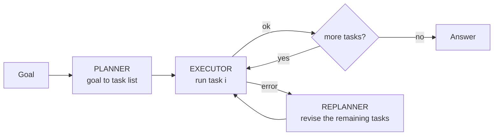

# 30.2 Planning and reflection

The ReAct agent from [30.1](01-agent-loop-react.md) is *greedy*: at every step
it looks at the last observation and picks the locally sensible next action. On
a three-step question that is exactly right. On a twenty-step task it is a
disaster, and the reason is arithmetic rather than vibes.

This page adds the four techniques that buy reliability back — planning up
front, decomposing into dependency-ordered subtasks, critiquing and revising
your own output, and searching over several candidate actions instead of
committing to the first. Then it computes what each one costs, because
sometimes the right amount of planning is none.

## Why greedy loops fall over on long tasks

Three things go wrong at once as tasks get longer:

- **No global view.** A step chosen from the last observation cannot know it
  was the wrong branch until several steps later, and by then the transcript is
  full of committed work.
- **Error compounding.** Steps multiply. If each step is right with
  probability $p$, an $n$-step task finishes correctly with probability roughly
  $p^n$.
- **No place to recover.** Without a plan there is nothing to compare progress
  against, so a derailed agent looks exactly like a working one.

The compounding is the part people underestimate. Write it down:

$$P(\text{task succeeds}) \approx p^{\,n}$$

```python
"""What per-step reliability actually buys you over a whole task."""
print(f"{'per-step p':>10} | " + " | ".join(f"n={n:<4}" for n in (5, 10, 20, 40)))
print("-" * 52)
for p in (0.99, 0.95, 0.90, 0.80):
    row = " | ".join(f"{p ** n:6.1%}" for n in (5, 10, 20, 40))
    print(f"{p:>10.0%} | {row}")

print(f"\n0.95 ** 20 = {0.95 ** 20:.4f}")
target, n = 0.90, 20
print(f"to finish {n} steps with {target:.0%} success you need "
      f"p >= {target ** (1 / n):.4f} per step")
```

Read $p$ as the chance one step is right and $n$ as the number of steps.

A step that works 95% of the time feels *excellent* when you watch it. Twenty
of them in a row succeed $0.95^{20} = 0.3585$ of the time — about one run in
three. To get a 20-step task to 90% you would need every single step to be
right 99.47% of the time, which no model reaches on open-ended work.

So you do not chase per-step accuracy. **You change the structure**: fewer
steps, checkable steps, and recovery when a step fails. That is what the rest of
this page is.

!!! note "The independence assumption"

    $p^n$ assumes step failures are independent, which is optimistic in one
    direction and pessimistic in another: a bad step often poisons later steps
    (worse than $p^n$), but a retry or a verifier can rescue a step (better).
    Use it as an order-of-magnitude argument, never as a prediction.

## Plan-and-Solve: decide the shape first

**Plan-and-Solve prompting** (Wang et al., 2023) makes the model produce a
complete plan *before* executing anything, then work the plan. The payoff is
that the plan is an artifact you can inspect, count, cost and — crucially —
**repair**.

Three roles, three different kinds of model call:

| Role | Called | Job |
| --- | --- | --- |
| **Planner** | once, up front | turn the goal into a list of concrete tasks |
| **Executor** | once per task | run one task and return `(value, error)` |
| **Replanner** | only when a task fails | revise the remaining tasks around the failure |



Here is the whole pattern, with a step that fails on purpose. As in 30.1, both
model roles are deterministic rule-based stand-ins, so the trace is identical
on every run; each is a plain function you would swap for one API call.

```python
"""Plan -> execute -> replan, with a deliberately failing step."""

TEMPS_C = {"Oslo": 22.0, "Cairo": 35.0}            # note: no record for Lima
REGION = {"Lima": "South America"}
REGIONAL_C = {"South America": 19.0}

class PlannerLLM:
    """Stand-in planner. Rule-based, so the plan is identical every run."""

    def plan(self, goal):
        cities = [c for c in ("Oslo", "Cairo", "Lima") if c in goal]
        steps = [{"id": i, "tool": "fetch", "arg": c}
                 for i, c in enumerate(cities, start=1)]
        steps.append({"id": len(steps) + 1, "tool": "mean", "arg": "fetched values"})
        steps.append({"id": len(steps) + 1, "tool": "c_to_f", "arg": "the mean"})
        return steps

    def replan(self, steps, failed, error):
        """Revise the plan around the failed step — the whole point of having
        a plan at all. Returns None when it has no idea how to repair it."""
        if "no record" in error and failed["arg"] in REGION:
            repaired = {"id": failed["id"], "tool": "regional_estimate",
                        "arg": REGION[failed["arg"]]}
            return [repaired if s["id"] == failed["id"] else s for s in steps]
        return None

class Executor:
    """Runs one step. Returns (value, error) — it never raises at the caller."""

    def __init__(self):
        self.values, self.result = [], None

    def run(self, step):
        tool, arg = step["tool"], step["arg"]
        if tool == "fetch":
            if arg not in TEMPS_C:
                return None, f"Error: no record for {arg}"
            self.values.append(TEMPS_C[arg])
            return TEMPS_C[arg], None
        if tool == "regional_estimate":
            self.values.append(REGIONAL_C[arg])
            return REGIONAL_C[arg], None
        if tool == "mean":
            self.result = sum(self.values) / len(self.values)
            return round(self.result, 2), None
        if tool == "c_to_f":
            self.result = self.result * 9 / 5 + 32
            return round(self.result, 2), None
        return None, f"Error: unknown tool {tool!r}"

goal = ("Average the recorded high temperatures for Oslo, Cairo and Lima, "
        "then report the answer in Fahrenheit.")
planner, executor = PlannerLLM(), Executor()
plan = planner.plan(goal)

print("PLAN")
for s in plan:
    print(f"  {s['id']}. {s['tool']}({s['arg']})")

print("\nEXECUTION")
i, replans, MAX_REPLANS = 0, 0, 2
while i < len(plan):
    step = plan[i]
    value, error = executor.run(step)
    if error:
        print(f"  {step['id']}. {step['tool']}({step['arg']}) -> {error}")
        revised = planner.replan(plan, step, error) if replans < MAX_REPLANS else None
        if revised is None:
            print("  giving up: no repair available")
            break
        replans += 1
        plan = revised
        print(f"     replanned step {step['id']} -> "
              f"{plan[i]['tool']}({plan[i]['arg']})")
        continue                                   # retry the SAME slot
    print(f"  {step['id']}. {step['tool']}({step['arg']}) -> {value}")
    i += 1
print(f"\nanswer: {executor.result:.1f} F   (after {replans} replan)")
```

The trace shows step 3 failing with `Error: no record for Lima`, the replanner
swapping in `regional_estimate(South America)`, and the run finishing at
`77.6 F`. Three details are doing the real work, and all three are engineering
rather than prompting:

1. **The executor returns errors, it does not raise.** An exception would kill
   the loop; a returned error string is something the replanner can read. This
   is the same rule as `dispatch` in
   [28.1](../ch28-tools-mcp/01-function-calling.md).
2. **`MAX_REPLANS` exists.** Replanning is a loop too, and a planner that keeps
   proposing the same broken step will replan forever without a cap.
3. **`continue` retries the same slot**, so the repaired step actually runs.
   Advancing `i` on failure silently skips work — a bug that produces
   confident, wrong answers computed from missing data.

Plan-then-execute is not free: a plan written before any observation can be
wrong from its first line. In practice the good architectures are **hybrids** —
plan coarsely, execute each plan step with a small ReAct loop, replan when a
step reports failure.

## Decomposition and dependency order

A plan is rarely a straight line. "Write a blog post" contains subtasks where
some must precede others and some are independent. That is a **directed
acyclic graph**, and ordering it is exactly the topological sort that lives
next door to the traversals in
[37.2 Breadth-first and depth-first search](../ch37-graphs/02-traversal.md):
Kahn's algorithm, which is one queue and one in-degree count.

```python
"""Order subtasks by dependency; also group them into parallel waves."""
from collections import deque

DEPS = {
    "research": [],
    "outline":  ["research"],
    "draft":    ["outline"],
    "images":   ["outline"],
    "edit":     ["draft", "images"],
    "publish":  ["edit"],
}

def topological_waves(deps):
    """Kahn's algorithm, emitting one 'wave' of ready tasks at a time.
    Returns (waves, leftover); a non-empty leftover means a dependency cycle."""
    indegree = {task: len(reqs) for task, reqs in deps.items()}
    dependents = {task: [] for task in deps}
    for task, reqs in deps.items():
        for req in reqs:
            dependents[req].append(task)

    ready = deque(sorted(t for t, d in indegree.items() if d == 0))
    waves = []
    while ready:
        wave = sorted(ready)                       # sorted -> deterministic
        ready.clear()
        waves.append(wave)
        for task in wave:
            for nxt in dependents[task]:
                indegree[nxt] -= 1
                if indegree[nxt] == 0:
                    ready.append(nxt)
    leftover = [t for t, d in indegree.items() if d > 0]
    return waves, leftover

waves, leftover = topological_waves(DEPS)
for k, wave in enumerate(waves, start=1):
    print(f"wave {k}: {', '.join(wave)}")
print("serial order:", " -> ".join(t for wave in waves for t in wave))
print("cycle?", leftover or "none")

broken = dict(DEPS, research=["publish"])          # research now waits on publish
waves2, leftover2 = topological_waves(broken)
print("\nwith a cycle -> scheduled:", [t for w in waves2 for t in w])
print("unschedulable:", sorted(leftover2))
```

Two things fall out of this for free:

- **The waves tell you what could run at the same time.** `draft` and `images`
  land in wave 3 together, so a multi-agent system could do them in parallel
  (that is [30.3](03-multi-agent.md)).
- **The leftover list is a cycle detector.** Add one bad edge — `research` now
  waits on `publish` — and the printed output is `scheduled: []` with all six
  tasks unschedulable: nothing has in-degree zero, so nothing can ever start.

LLM planners emit "A needs B, B needs A" more often than you would think, and
you want that caught by a five-line check rather than discovered by an agent
that never finishes.

## Self-refinement: generate, critique, revise

**Self-Refine** (Madaan et al., 2023) adds an inner loop around a *single*
output: produce a draft, criticise it, revise, repeat. Its across-attempts
cousin is **Reflexion** (Shinn et al., 2023), which turns a *failed trajectory*
into a written lesson kept in memory and retries the whole task.

The honest version needs a **verifier** — something that scores the draft by a
rule rather than by opinion. Otherwise you are asking a model whether it likes
its own work, and the answer is usually yes.

So we write a real scorer: five checkable requirements for a release note. The
improvement below is *measured by that scorer*, not asserted by a model.

```python
"""Generate -> critique -> revise, with a deterministic scorer so the
improvement is measured rather than claimed."""

REQUIREMENTS = [
    ("names the version",      lambda t: "v2.1" in t),
    ("mentions dark mode",     lambda t: "dark mode" in t.lower()),
    ("mentions CSV export",    lambda t: "csv export" in t.lower()),
    ("mentions the crash fix", lambda t: "crash" in t.lower()),
    ("stays under 45 words",   lambda t: len(t.split()) <= 45),
]

def score(text):
    """The verifier: returns (points, list of unmet requirement names)."""
    unmet = [name for name, check in REQUIREMENTS if not check(text)]
    return len(REQUIREMENTS) - len(unmet), unmet

def critic_llm(text):
    """Stand-in critic. A real one reads the draft; ours reads the verifier,
    which is exactly what makes its criticism trustworthy."""
    _, unmet = score(text)
    return None if not unmet else f"The draft never {unmet[0]}."

REVISIONS = {
    "names the version":      lambda t: "Release v2.1. " + t,
    "mentions dark mode":     lambda t: t + " It adds dark mode.",
    "mentions CSV export":    lambda t: t + " CSV export is now on the reports screen.",
    "mentions the crash fix": lambda t: t + " A crash when opening large files is fixed.",
    "stays under 45 words":   lambda t: " ".join(t.split()[:45]),
}

def reviser_llm(text, unmet):
    """Stand-in reviser: makes exactly one edit per round, as a real one would."""
    return REVISIONS[unmet[0]](text)

draft = "This release adds dark mode."
points, unmet = score(draft)
print(f"round 0: {points}/5  {draft!r}")
for rnd in range(1, 4):                            # cap the rounds at 3
    critique = critic_llm(draft)
    if critique is None:
        break
    print(f"         critic: {critique}")
    draft = reviser_llm(draft, unmet)
    points, unmet = score(draft)
    print(f"round {rnd}: {points}/5  {draft!r}")
print(f"\nunmet at the end: {unmet or 'none'}")
```

The score moves 2/5 → 3/5 → 4/5 → 5/5, and you can see exactly why: each round
fixes one *named* defect. Now the honesty:

- **With a verifier**, reflection is close to free reliability — you are running
  a test and fixing the failure it names. Unit tests, a compiler, a JSON Schema
  validator, a linter, `assert` statements: all of these are verifiers.
- **Without a verifier**, "critique your own answer" gives small and unreliable
  gains, and can make things worse by talking a correct answer into a wrong
  one. If you cannot write a scorer, be sceptical of any reported improvement
  from your reflection loop.
- **Cap the rounds.** Three is a normal cap. Improvement is usually
  front-loaded; rounds four and five mostly cost money.

## Self-consistency: sample several, take the majority

**Self-consistency** (Wang et al., 2022) is the cheapest reliability trick
there is:

1. Ask the same question $N$ times at a non-zero temperature.
2. Tally the answers.
3. Return the most common one.

It works when errors are *diverse* — many ways to be wrong, one way to be right
— so wrong answers split the vote while correct ones pile up.

```python
"""Majority voting over N noisy samples, measured over many trials."""
import random
from collections import Counter

CORRECT = 42
WRONG = [40, 41, 43, 84]            # several plausible wrong answers

def fake_llm_sample(rng, p_correct=0.55):
    """One sampled answer from a model that is right 55% of the time."""
    return CORRECT if rng.random() < p_correct else rng.choice(WRONG)

illustration = random.Random(5)     # one seeded trial, printed in full
tally = Counter(fake_llm_sample(illustration) for _ in range(7))
print("one trial, 7 samples:", dict(tally),
      "-> majority", tally.most_common(1)[0][0])

TRIALS, N = 2000, 7
rng = random.Random(0)
single_hits = majority_hits = 0
for _ in range(TRIALS):
    samples = [fake_llm_sample(rng) for _ in range(N)]
    single_hits += samples[0] == CORRECT
    majority_hits += Counter(samples).most_common(1)[0][0] == CORRECT
print(f"single sample : {single_hits / TRIALS:.1%} correct")
print(f"majority of {N} : {majority_hits / TRIALS:.1%} correct")
print(f"cost          : {N}x the tokens of one answer")
```

The single trial prints `{43: 1, 40: 1, 41: 2, 42: 3}`: only three of seven
samples are right, and that is *enough*, because the four wrong samples split
across three different wrong answers. Over 2000 trials, one sample is right
54.5% of the time and the majority of seven is right 84.4% — a real gain from a
model we never touched.

Now the two limits, both visible in the same output:

- **It costs $N$ times as much**, for a gain that flattens quickly, and the
  majority is still wrong on 15.6% of trials.
- **It needs answers you can *compare*.** "42" votes cleanly; a
  three-paragraph essay does not.

So it is superb for arithmetic, multiple choice, extraction and classification,
and nearly useless for open-ended writing unless you first extract a comparable
key.

## Searching over actions: beam search and Tree of Thoughts

Greedy means: take the best next action. **Tree of Thoughts** (Yao et al.,
2023) means: expand several candidate next steps, score the states they lead
to, and keep the promising ones.

The classic bounded version is **beam search** — keep the best $k$ states at
each depth. Keeping the best $k$ of anything is a job for the priority queue
from [21.2 Priority queues](../ch21-heaps/02-priority-queues.md), and
`heapq.nlargest` is exactly that in one call.

Our toy world:

- **Start** at 3.
- **Actions:** `+2`, `*3`, `-1`.
- **Goal:** get as close to 23 as possible in four steps.
- **Value function:** score a state by how far it is from the target, so higher
  is better and 0 means solved.

```python
"""Beam search over a toy action space, with heapq keeping the top k."""
import heapq

ACTIONS = {"+2": lambda v: v + 2, "*3": lambda v: v * 3, "-1": lambda v: v - 1}
TARGET, DEPTH = 23, 4

def value(state):
    """Value function: higher is better, 0 means solved."""
    return -abs(state - TARGET)

def beam_search(width):
    beam = [(value(3), "3", 3)]                    # (score, path, state)
    for depth in range(1, DEPTH + 1):
        children = [(value(fn(state)), f"{path} {name}", fn(state))
                    for _, path, state in beam
                    for name, fn in ACTIONS.items()]
        # nlargest on tuples breaks ties by path string -> fully deterministic
        beam = heapq.nlargest(width, children)
        shown = ", ".join(f"{st}({sc})" for sc, _, st in beam)
        print(f"  depth {depth}: {shown}")
    return max(beam)

for width in (2, 4):
    print(f"beam width {width}:")
    best_score, best_path, best_state = beam_search(width)
    print(f"  best: {best_path} = {best_state}  (off by {-best_score})\n")
```

Width 2 finishes on `3 *3 *3 -1 -1 = 25`, off by 2. Width 4 finds
`3 *3 -1 *3 -1 = 23` exactly.

Look at *where* the answer was lost. The winning route passes through the state
`8` at depth 2, scoring $-15$, while the two states a width-2 beam keeps scored
$-4$ and $-8$. **Once `8` is pruned the branch is gone forever**, and no amount
of good judgement later can recover it. That is the entire trade-off of search:

| | Greedy (width 1) | Beam (width $k$) | Full tree |
| --- | --- | --- | --- |
| States expanded per depth | $\lvert A \rvert$ | $k \cdot \lvert A \rvert$ | exponential |
| Finds an answer hidden behind a bad-looking step | rarely | sometimes | yes |
| Cost | 1× | $k$× | unusable |

In a real agent each state costs a model call to evaluate, so $k$ is a budget
decision — and the value function is the hard part. A wrong value function
makes a wide beam confidently explore nonsense. Which leads straight to the
next idea.

## Verification-first thinking

The single most reliable structural change you can make to an agent is to
**prefer outputs a program can check** — code that runs, arithmetic that
recomputes, JSON that validates, SQL that returns rows, a citation that
resolves. A checkable output turns "the model is probably right" into "the model
is right, and here is the check".

The trick is to make the agent emit *both* an answer and a machine-runnable
recipe for it. Note the security detail: the recipe is a structured
`(name, args)` tuple dispatched through an allowlist, **not** a string we hand
to `eval` — the same rule as
[28.1](../ch28-tools-mcp/01-function-calling.md).

```python
"""Verify an agent's arithmetic instead of trusting it."""

class ArithmeticAgent:
    """Answers with BOTH a value and a checkable recipe for it — which is
    what makes the answer verifiable at all. Its first attempt is wrong."""

    def __init__(self):
        self.attempt = 0

    def answer(self, question, feedback=None):
        self.attempt += 1
        if "odd numbers" in question:
            value = 380 if self.attempt == 1 else 400   # 380 is a plausible slip
            return {"value": value, "check": ("sum_odds_below", 40)}
        return {"value": 391, "check": ("multiply", 17, 23)}

CHECKS = {                                        # the allowlist of verifiers
    "sum_odds_below": lambda limit: sum(n for n in range(1, limit) if n % 2),
    "multiply": lambda a, b: a * b,
}

def verify(claim):
    """Recompute the recipe in Python and compare it with the claimed value."""
    name, *args = claim["check"]
    shown = f"{name}({', '.join(map(str, args))})"
    if name not in CHECKS:
        return False, f"no verifier named {name!r}"
    actual = CHECKS[name](*args)
    if actual != claim["value"]:
        return False, f"claimed {claim['value']} but {shown} = {actual}"
    return True, f"verified: {shown} == {actual}"

agent = ArithmeticAgent()
question = "What is the sum of the first 20 odd numbers?"
feedback = None
for attempt in range(1, 4):
    claim = agent.answer(question, feedback)
    ok, message = verify(claim)
    print(f"attempt {attempt}: value={claim['value']:<4} -> {message}")
    if ok:
        break
    feedback = message                            # goes back into the next try

print("\nsecond question:", verify(agent.answer("What is 17 times 23?"))[1])
```

The agent's first answer, 380, is wrong, and nothing about its confidence would
have told you. The verifier caught it in microseconds
(`claimed 380 but sum_odds_below(40) = 400`), and the corrective message went
back into the next attempt, which passed.

So: design your agents so their outputs land in **checkable** form whenever you
can. When you cannot, at least make them **comparable**, so self-consistency has
something to vote on.

## When not to add planning

Every technique on this page multiplies model calls. Before adding one, do the
arithmetic:

$$\text{latency} \approx c \cdot \ell, \qquad
  \text{cost} \approx \frac{c \cdot t \cdot \rho}{1000}$$

| Symbol | Meaning |
| --- | --- |
| $c$ | model calls the architecture makes for one task |
| $t$ | tokens per call |
| $\ell$ | latency of one call, in seconds |
| $\rho$ | price per thousand tokens |

```python
"""What each architecture costs, on the same task."""

# Illustrative numbers, not a price list: providers and models differ wildly
# and prices change. Substitute your own and rerun.
LATENCY_S, TOKENS, PRICE_PER_1K = 1.4, 1800, 0.004

ARCHITECTURES = [
    ("single completion",       1, "no tools, no recovery"),
    ("ReAct, 4 steps",          4, "recovers from tool errors"),
    ("plan + ReAct, 4 steps",   6, "1 plan + 4 steps + 1 replan"),
    ("+ reflection, 3 rounds", 12, "6 + 3 critiques + 3 revisions"),
    ("+ self-consistency N=5", 60, "the whole thing, five times"),
]

print(f"{'architecture':<24} {'calls':>6} {'latency':>9} {'cost':>9}   why")
print("-" * 76)
for name, calls, why in ARCHITECTURES:
    latency = calls * LATENCY_S
    cost = calls * TOKENS * PRICE_PER_1K / 1000
    print(f"{name:<24} {calls:>6} {latency:>8.1f}s {cost:>8.3f}$   {why}")

base, worst = ARCHITECTURES[1][1], ARCHITECTURES[-1][1]
print(f"\nthe full stack costs {worst / base:.0f}x a plain ReAct run "
      f"and answers {worst * LATENCY_S:.0f}s later")
```

Fifteen times the cost and eighty-four seconds of latency is an easy trade for
a nightly batch job and an absurd one for an autocomplete box.

Skip the planning machinery when:

- **the task is one or two steps** — a plan for a two-step task is overhead
  with a planning-error risk attached;
- **latency is user-visible** — every extra call is another second of somebody
  waiting;
- **you have no verifier** — reflection without a scorer mostly buys tokens;
- **the failure is cheap to retry** — where a wrong answer costs nothing, one
  attempt plus a retry beats an elaborate plan;
- **you have not measured yet** — build the plain loop, log the failures, and
  let the failures pick the technique. Adding all four upfront gives you an
  expensive system whose bugs you cannot isolate.

!!! warning "Common mistakes"

    - **Replanning without a cap.** The replanner is a loop; give it
      `MAX_REPLANS` or it will politely propose the same broken step forever.
    - **Advancing past a failed step.** After a repair, retry the *same* slot.
      Skipping produces an answer computed from missing data — and it looks
      completely normal in the logs.
    - **Reflection with no scorer.** "Critique your draft" without a verifier
      produces confident revisions with no measurable gain. This page's loop
      only works because `score()` is a real function.
    - **Trusting an LLM plan's dependency order.** Run a topological sort and
      check the leftover list; a cycle turns into an agent that never finishes.
    - **Self-consistency on free-form text.** Majority voting needs comparable
      answers. Extract a key — a number, a label, a normalised string — first,
      or every vote is 1-1-1-1-1.

## Check your understanding

??? success "1. Each step of your agent succeeds 90% of the time and the task takes 15 steps. Roughly how often does the whole task succeed, and what is the cheapest way to improve it?"
    About $0.9^{15} \approx 0.21$, so roughly one run in five. The cheapest
    improvement is usually *fewer steps* — merge or automate steps so the
    exponent shrinks — followed by making steps verifiable so a failure is
    caught and retried rather than propagated. Chasing per-step accuracy from
    90% to 95% only gets you to $0.95^{15} \approx 0.46$, still a coin flip.

??? success "2. Why does the reflection loop on this page produce honest improvement, while 'ask the model to critique itself' often does not?"
    Because the critique comes from `score()`, a deterministic verifier that
    checks real requirements against the text. The model is not judging its own
    quality; it is being told which named requirement is unmet and making one
    edit. Replace the verifier with the model's opinion and the loop can
    happily report improvement that is not there.

??? success "3. Beam width 2 missed the exact answer in the search demo. Where exactly was the answer lost, and would a better value function have saved it?"
    At depth 2. The winning route passes through the state `8`, which scores
    $-15$, while the two states the width-2 beam kept scored $-4$ and $-8$.
    Once `8` is pruned the branch is gone forever. A better value function
    *could* have saved it — one that understood a `*3` was coming would rank
    `8` highly — which is the real lesson: search quality is bounded by the
    value function, not by the width.

??? success "4. When is self-consistency a bad idea?"
    When the answers are not comparable (free-form prose has nothing to vote
    on), when the errors are not diverse (a model that is confidently wrong the
    *same* way every time gives you a confidently wrong majority), or when
    latency and cost matter — it multiplies both by $N$ without changing
    per-sample accuracy at all.

??? success "5. Your planner outputs a plan whose topological sort returns a non-empty leftover list. What has it produced, and what should the system do?"
    A dependency **cycle**: every task in the leftover list is waiting,
    directly or transitively, on another task in that list, so none of them
    ever reaches in-degree zero. Do not start executing. Report the cycle back
    to the planner as an error message naming the stuck tasks — that is a
    replan trigger exactly like a failed step, and it costs one model call
    instead of an agent that spins until its budget runs out.
