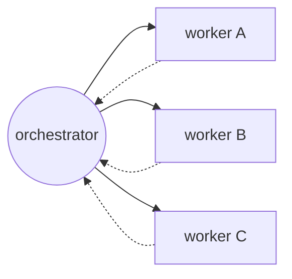
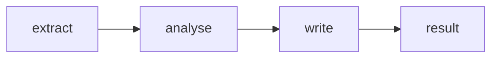
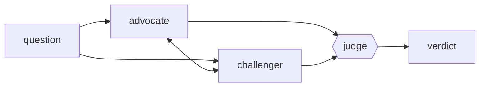
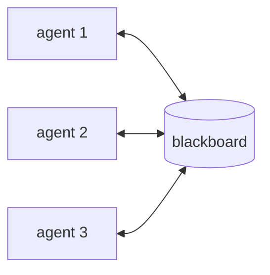
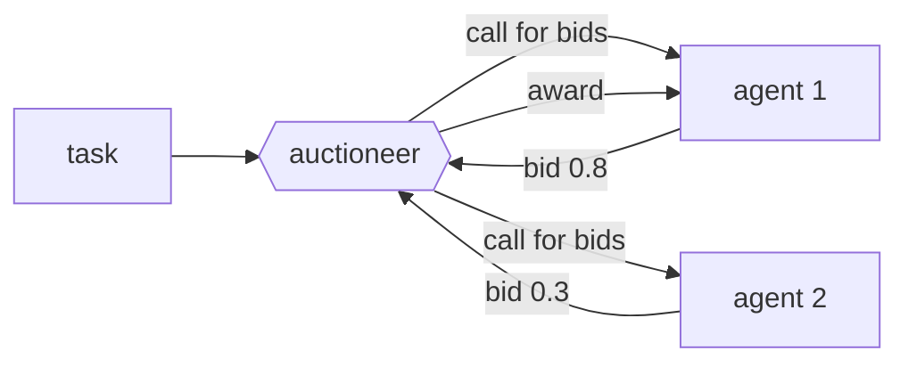

# 30.3 Multi-agent systems

Everything so far has been one model in one loop. The obvious next move is to
run several — a researcher, a writer, a critic — and let them collaborate. That
move is real and sometimes decisive, and it is also the single most
over-recommended idea in agent engineering, because the moment you have more
than one agent you have a *distributed system*, with all the routing,
termination and shared-state bugs that implies. This page builds a working
three-agent team by hand, and is equally careful about when not to.

## Why more than one agent

Four honest reasons, each of which you can test:

- **Specialization.** A prompt that is excellent at "find and quote sources"
  is a different prompt from one that is excellent at "write 60 clear words".
  Splitting them lets each be sharp, with its own tools and its own
  instructions.
- **Separate context windows.** This is the most underrated reason. A
  researcher can chew through 50,000 tokens of raw pages and hand back 300
  tokens of findings. The writer never sees the 50,000. You have bought
  context space by putting a boundary in.
- **Parallelism.** Independent subtasks — the `draft` and `images` wave from
  [30.2](02-planning-reflection.md) — can run at the same time on different
  workers, cutting wall-clock time.
- **Adversarial checking.** A critic that never wrote the draft has no sunk
  cost in it. This is why review works for humans, and it is the multi-agent
  version of the verifier lesson from 30.2.

And the counterweight, which is just as real:

- **Cost multiplies.** Three agents exchanging six messages is six model calls
  plus whatever each of them does internally. A team is rarely 3× the cost of
  one agent — it is usually more, because context gets re-explained.
- **Coordination bugs are the worst bugs you will meet.** Messages to the
  wrong agent, two agents editing the same state, a team that never decides
  it is finished. None of these produce a stack trace.
- **One strong agent with good tools very often wins.** If your "team" is
  three copies of the same model with three slightly different system prompts
  and no separate tools or context, you have bought latency and spent money on
  paraphrase. Ask what each agent *has* that the others do not — different
  tools, different data, different context budget — and if the answer is
  "nothing", collapse the team.

!!! tip "The rule of thumb"

    Add a second agent when you can name the thing it has that the first one
    does not: its own tools, its own corpus, its own context window, or a
    genuinely independent judgement. "It has a different personality" is not
    one of those things.

## Topologies

Five shapes cover almost everything you will see.

**1 — Supervisor / orchestrator–worker.** One agent owns the goal and calls the
others. Solid arrows are assignments, dotted arrows are results.



**2 — Pipeline.** A fixed sequence of specialists; each one's output is the
next one's input.



**3 — Debate.** Two agents argue a position; a judge decides.



**4 — Blackboard / shared state.** Every agent reads and writes one shared
store instead of messaging anybody.



**5 — Market / bidding.** An auctioneer offers a task; agents bid with a
claimed fitness; the highest bid wins the work.



| Topology | Control flow | Best for | Main failure mode |
| --- | --- | --- | --- |
| **Supervisor / orchestrator–worker** | one agent decides who runs next | most real systems; clear ownership | the supervisor becomes the bottleneck and the context hog |
| **Pipeline** | fixed stage order | repeatable document/data processing | no recovery — a bad stage 1 poisons everything downstream |
| **Debate** | two or more argue, a judge decides | contested judgement calls, fact-checking | expensive; agents converge on each other and agree wrongly |
| **Blackboard / shared state** | anyone reads or writes a shared store | many agents, loosely coupled, opportunistic | write conflicts and untraceable causality |
| **Market / bidding** | agents bid for tasks by claimed fitness | dynamic worker pools, load balancing | agents overbid; the bid is just another model output |

Start with **supervisor**. It is the easiest to debug because every message
passes through one place, and it is the pattern almost every framework in
[30.4](04-frameworks.md) implements by default.

## Message passing: envelopes, mailboxes, a router

Before agents can collaborate, you need a way for them to talk. The whole
mechanism is three small pieces: a `Message` type, a mailbox per agent, and a
router that moves messages between them. Ours is deliberately
**concurrency-free** — no threads, no async, no clock. A single driver loop
takes one message at a time, in a fixed order, so the transcript is identical
on every run. That is exactly how you want to debug a multi-agent system, and
it is how you should build your first one.

```python
"""Messages, mailboxes and a router. Deterministic and thread-free."""
from collections import deque
from dataclasses import dataclass, field

@dataclass(frozen=True)
class Message:
    """One envelope. Frozen: nobody can rewrite a message in flight."""
    sender: str
    recipient: str
    kind: str                    # "request" | "result" | "critique" | "done"
    body: dict = field(default_factory=dict)
    turn: int = 0

    def short(self, width=46):
        """One readable log line, with long bodies truncated."""
        parts = []
        for key, value in self.body.items():
            text = str(value)
            parts.append(f"{key}={text[:width]}{'…' if len(text) > width else ''}")
        return (f"t{self.turn:<2} {self.sender:>12} -> {self.recipient:<12} "
                f"{self.kind:<8} {'; '.join(parts)}")

class Router:
    """One mailbox per agent, plus a full log. No threads and no clock:
    send() appends, take() pops. The transcript is identical every run."""

    def __init__(self, names):
        self.boxes = {name: deque() for name in names}
        self.log = []

    def send(self, message):
        if message.recipient not in self.boxes:      # allowlist, as in 28.1
            raise KeyError(f"no agent named {message.recipient!r}")
        self.boxes[message.recipient].append(message)
        self.log.append(message)

    def take(self, name):
        return self.boxes[name].popleft() if self.boxes[name] else None

bus = Router(["orchestrator", "researcher"])
bus.send(Message("orchestrator", "researcher", "request",
                 {"topic": "Larkspur-2"}, turn=1))
bus.send(Message("researcher", "orchestrator", "result",
                 {"facts": 3}, turn=2))
for m in bus.log:
    print(m.short())
print("researcher inbox depth :", len(bus.boxes["researcher"]))
print("orchestrator inbox depth:", len(bus.boxes["orchestrator"]))

try:
    bus.send(Message("researcher", "wrter", "result", {}, 3))   # typo!
except KeyError as exc:
    print("routing error caught:", exc)
```

Three design choices worth copying:

1. **`frozen=True`.** A message is a fact about the past. If an agent could
   mutate one after sending it, your log would stop being evidence.
2. **`kind` is a small closed vocabulary.** `"done"` is how the system knows
   to stop; free-form kinds mean nobody can write a termination check.
3. **The router allowlists recipients.** A typo'd agent name raises
   immediately instead of dropping a message into the void — and silently
   dropped messages are the hardest multi-agent bug there is.

## The centrepiece: an orchestrator–worker team

Now the real thing. Three specialized `FakeLLM` workers — a researcher with a
corpus, a writer with a composition rule, and a critic with a *real
deterministic checklist* — coordinated by an orchestrator that owns the goal,
the routing and the budget. As always, each `handle` method is a rule-based
stand-in for one model call; swapping any of them for a real API call is the
one-line change from [30.1](01-agent-loop-react.md).

Watch the shape: workers never talk to each other. Every message goes through
the orchestrator, which is what makes the log readable and the system
debuggable.

```python
# continues
NOTES = {   # a made-up in-memory corpus — no network, no real satellite
    "Larkspur-2": [
        "Larkspur-2 launched in 2021.",
        "Larkspur-2 orbits at 705 km.",
        "Larkspur-2 carries a 4-band imager.",
    ],
}

class ResearcherLLM:
    """Worker 1. Retrieves notes, and says so honestly when it has none."""
    name = "researcher"

    def handle(self, msg):
        topic = msg.body["topic"]
        facts = NOTES.get(topic, [])
        return Message(self.name, msg.sender, "result" if facts else "error",
                       {"topic": topic, "facts": facts}, msg.turn + 1)

class WriterLLM:
    """Worker 2. Composes from facts; reacts to a critique when given one."""
    name = "writer"

    def handle(self, msg):
        facts, missing = msg.body["facts"], msg.body.get("missing", [])
        keep = [f for f in facts if "orbits" not in f]     # thin first draft
        if "gives the altitude" in missing:
            keep = list(facts)                             # revision uses them all
        return Message(self.name, msg.sender, "result",
                       {"draft": "Briefing. " + " ".join(keep)}, msg.turn + 1)

CHECKS = [
    ("names the satellite",   lambda t: "Larkspur-2" in t),
    ("gives the launch year", lambda t: "2021" in t),
    ("gives the altitude",    lambda t: "705 km" in t),
    ("stays under 60 words",  lambda t: len(t.split()) <= 60),
]

class CriticLLM:
    """Worker 3. Adversarial by construction: it runs a real checklist, so
    its approval means something (the verifier lesson from 30.2)."""
    name = "critic"

    def handle(self, msg):
        missing = [n for n, check in CHECKS if not check(msg.body["draft"])]
        return Message(self.name, msg.sender, "critique" if missing else "done",
                       {"score": f"{len(CHECKS) - len(missing)}/{len(CHECKS)}",
                        "missing": missing}, msg.turn + 1)

class Orchestrator:
    """Owns the goal, the routing decisions and the budget. Workers never
    talk to each other; every message passes through here."""
    name = "orchestrator"

    def __init__(self, topic, max_revisions=2):
        self.topic, self.max_revisions = topic, max_revisions
        self.facts, self.draft, self.revisions = [], None, 0

    def start(self):
        return Message(self.name, "researcher", "request",
                       {"topic": self.topic}, 1)

    def handle(self, msg):
        if msg.kind == "error":
            return None                                    # nothing to write
        if msg.sender == "researcher":
            self.facts = msg.body["facts"]
            return Message(self.name, "writer", "request",
                           {"facts": self.facts}, msg.turn + 1)
        if msg.sender == "writer":
            self.draft = msg.body["draft"]
            return Message(self.name, "critic", "request",
                           {"draft": self.draft}, msg.turn + 1)
        if msg.sender == "critic":                         # kind == "critique"
            if self.revisions >= self.max_revisions:
                return None                                # stop revising
            self.revisions += 1
            return Message(self.name, "writer", "request",
                           {"facts": self.facts, "missing": msg.body["missing"]},
                           msg.turn + 1)
        return None

def run_team(orchestrator, workers, max_turns=12):
    """Round-robin driver: one message delivered per turn, in a fixed order."""
    agents = {w.name: w for w in workers}
    agents[orchestrator.name] = orchestrator
    bus = Router(list(agents))
    bus.send(orchestrator.start())

    for turn in range(1, max_turns + 1):
        for name in ("researcher", "writer", "critic", "orchestrator"):
            msg = bus.take(name)
            if msg is None:
                continue
            if msg.kind == "done":                         # termination signal
                print(f"[stop] critic approved the draft ({msg.body['score']}) "
                      f"after {turn} deliveries")
                return bus, orchestrator
            reply = agents[name].handle(msg)
            if reply is None:
                print(f"[stop] {name} has nothing further to send")
                return bus, orchestrator
            bus.send(reply)
            break
        else:                                              # no mailbox had mail
            print("[stop] every mailbox is empty")
            return bus, orchestrator
    print(f"[stop] turn budget of {max_turns} exhausted")
    return bus, orchestrator

bus, orch = run_team(Orchestrator("Larkspur-2"),
                     [ResearcherLLM(), WriterLLM(), CriticLLM()])

print("\nMESSAGE LOG")
for m in bus.log:
    print(" ", m.short())
print("\nFINAL ARTIFACT")
print(" ", orch.draft)
print(f"\nrevisions: {orch.revisions}   messages: {len(bus.log)}")
```

The printed log is the whole story of the collaboration in ten messages:

```text
[stop] critic approved the draft (4/4) after 10 deliveries

MESSAGE LOG
  t1  orchestrator -> researcher   request  topic=Larkspur-2
  t2    researcher -> orchestrator result   topic=Larkspur-2; facts=[…]
  t3  orchestrator -> writer       request  facts=[…]
  t4        writer -> orchestrator result   draft=Briefing. Larkspur-2 launched in 2021. …
  t5  orchestrator -> critic       request  draft=Briefing. Larkspur-2 launched in 2021. …
  t6        critic -> orchestrator critique score=3/4; missing=['gives the altitude']
  t7  orchestrator -> writer       request  facts=[…]; missing=['gives the altitude']
  t8        writer -> orchestrator result   draft=Briefing. Larkspur-2 launched in 2021. …
  t9  orchestrator -> critic       request  draft=Briefing. Larkspur-2 launched in 2021. …
  t10       critic -> orchestrator done     score=4/4; missing=[]
```

Read `t6`: the critic scored the first draft **3/4** and named the missing
requirement. `t7` is the orchestrator turning that critique into a fresh
writing request, and by `t10` the draft scores 4/4 and the critic emits `done`,
which is what actually stops the loop. The final artifact is a short briefing
carrying all three facts, produced in one revision.

Notice what the critic is *not*: it is not a model asked "is this good?" It
runs `CHECKS`, a list of deterministic predicates. That is the difference
between a review step that measurably improves the artifact and one that
politely says "looks great!" — the same point 30.2 made about reflection, now
enforced by a separate agent.

## Shared state versus message passing

Our team passes frozen messages. The alternative is a **blackboard**: one
mutable object every agent reads and writes. It is tempting because it looks
simpler — no envelopes, no routing. It is also where
[9.1 References and aliasing](../ch09-collections/01-references.md) comes back
to bite, at team scale.

```python
"""Two 'agents' sharing one list. Nothing here is agent-specific — it is
plain Python aliasing, which is exactly why it catches people out."""
findings = ["Larkspur-2 launched in 2021."]
researcher_view = findings          # a REFERENCE, not a copy (see 9.1)
writer_view = findings              # ...and so is this

researcher_view.append("DRAFT NOTE: check this number")
print("writer sees   :", writer_view)
print("same object?  :", researcher_view is writer_view)

writer_view = list(findings)        # the fix: hand over a snapshot
researcher_view.append("another private scribble")
print("writer snapshot:", writer_view)
print("researcher list:", researcher_view)
```

The writer sees the researcher's private working note without asking, because
`researcher_view` and `writer_view` are the same list object. In a one-file
demo that is a curiosity. In a system where the "agents" are prompts built from
that list, it means one agent's scratch note silently becomes another agent's
input — and there is nothing in the log to tell you it happened.

| | Message passing | Shared state (blackboard) |
| --- | --- | --- |
| Who can change what | only the owner; others get copies | anybody, at any time |
| Debuggability | the log *is* the causal history | you see the final value, not who wrote it |
| Coupling | agents need only the message schema | agents need to agree on the whole structure |
| Cost | the same data may be re-sent | written once, read many |
| Good for | small teams, auditability, most first systems | many agents over one large artifact |

If you do use shared state, take three precautions: give each entry a
**writer's name and a turn number**, hand out **copies** on read
(`list(...)`, `dict(...)`, or a frozen dataclass), and make the shared object
**append-only** where you can, so nothing is ever silently overwritten.

## Termination and deadlock

A single agent stops when it says `Final Answer` or its budget runs out
(30.1). A team has three ways to fail to stop, and you need a guard for each:

| Failure | What it looks like | Guard |
| --- | --- | --- |
| **Runaway** | messages keep flowing, work keeps happening | global turn budget |
| **Livelock (ping-pong)** | two agents exchange the same messages forever | message fingerprints |
| **Deadlock** | every mailbox is empty and nobody said `done` | detect the empty-mailbox state |

Our `run_team` already has all three: `max_turns`, the `done` kind, and the
`for … else` branch that fires when no mailbox had mail. Here is the ping-pong
case on its own — first without a detector, then with one:

```python
# continues
class ClarifyBot:
    """Never commits: always answers a question with a question."""
    def __init__(self, name, question):
        self.name, self.question = name, question

    def handle(self, msg):
        return Message(self.name, msg.sender, "request",
                       {"ask": self.question}, msg.turn + 1)

def fingerprint(msg):
    """A message's identity: who, to whom, what kind, what content.
    The turn number is deliberately excluded — otherwise every message is
    unique and the detector never fires."""
    return (msg.sender, msg.recipient, msg.kind, tuple(sorted(msg.body.items())))

def run_pair(agents, first, max_turns=6, detect=True):
    bus = Router(list(agents))
    bus.send(first)
    seen = {fingerprint(first)}
    for turn in range(1, max_turns + 1):
        for name in agents:
            msg = bus.take(name)
            if msg is None:
                continue
            print(" ", msg.short())
            reply = agents[name].handle(msg)
            if detect and fingerprint(reply) in seen:
                print(f"  [ping-pong] {reply.sender} -> {reply.recipient} would "
                      f"repeat an identical message; stopping at turn {turn}")
                return
            seen.add(fingerprint(reply))
            bus.send(reply)
            break
        else:
            print(f"  [deadlock] every mailbox is empty at turn {turn}")
            return
    print(f"  [stop] turn budget of {max_turns} exhausted")

pair = {"alice": ClarifyBot("alice", "what exactly is the scope?"),
        "bob": ClarifyBot("bob", "what do you mean by scope?")}
opener = Message("alice", "bob", "request",
                 {"ask": "what exactly is the scope?"}, 1)

print("without a detector (budget only):")
run_pair(pair, opener, detect=False)
print("\nwith fingerprint detection:")
run_pair(pair, opener, detect=True)
```

Without the detector the pair burns all six turns and produces nothing; with
it, the loop is caught on the third message — two model calls instead of six,
and a log line that tells you exactly which pair is stuck. Extend the same idea
to teams by fingerprinting `(sender, recipient, kind, body)` for every message
and stopping when the *rate of new fingerprints* falls to zero: messages are
still moving, but no new information is.

Deadlock looks different — nothing at all happens:

```python
# continues
class WaitingBot:
    """Waits for an approval that will never arrive: it replies to nothing."""
    def __init__(self, name):
        self.name = name

    def handle(self, msg):
        return None

def run_pair2(agents, first, max_turns=4):
    bus = Router(list(agents))
    bus.send(first)
    for turn in range(1, max_turns + 1):
        for name in agents:
            msg = bus.take(name)
            if msg is None:
                continue
            print(" ", msg.short(), "-> (no reply)")
            reply = agents[name].handle(msg)
            if reply is not None:
                bus.send(reply)
            break
        else:
            print(f"  [deadlock] every mailbox is empty at turn {turn} "
                  "and nobody ever sent 'done'")
            return
    print("  budget exhausted")

run_pair2({"alice": WaitingBot("alice"), "bob": WaitingBot("bob")},
          Message("alice", "bob", "request", {"ask": "approve the plan?"}, 1))
```

One message is delivered, nobody answers, and at turn 2 every mailbox is empty.
Without the `for … else` branch this loop would spin silently to its budget
looking busy. Deadlock detection in a message system is genuinely this cheap:
*no messages in flight and no agent has declared completion* is a bug, and you
can check it in one line.

## Should this be one agent or several?

Work down the list. Stop at the first "no".

1. **Can one agent with the right tools do it?** If yes, do that. It is
   cheaper, faster, and has one log.
2. **Does any subtask need a different context window?** Bulk reading, log
   crunching, and long-document review are the clearest wins: a worker absorbs
   the volume and returns a summary.
3. **Does any subtask need different tools or credentials?** A worker with
   read-only database access and no email tool is a *security* boundary as well
   as an engineering one.
4. **Is independent judgement worth paying for?** A separate critic beats
   self-critique when the check is genuinely independent — and beats it most
   when the critic runs deterministic checks rather than opinions.
5. **Can the subtasks run in parallel?** Look at the topological waves from
   30.2. No parallel waves means a team buys you nothing on latency.
6. **Can you write the termination condition down?** If you cannot say in one
   sentence what makes the team stop, you are not ready to build it.

If you answered no to 2–5, you want one agent and better tools. That is not a
consolation prize; it is usually the right architecture.

!!! warning "Common mistakes"

    - **Agents that are the same model with different adjectives.** If they
      share tools, context and data, three "specialists" are one agent charged
      three times.
    - **No global turn budget.** Per-agent budgets do not compose: three
      agents with five steps each can exchange far more than fifteen messages.
    - **No explicit `done`.** If termination is "the orchestrator seems
      satisfied", nothing in the code can check it. Make completion a message
      kind.
    - **Sharing a mutable object between agents.** Aliasing bugs (9.1) become
      invisible cross-agent contamination. Send copies or frozen values.
    - **Letting workers talk to each other on day one.** Star-shaped routing
      through a supervisor is easier to debug by an order of magnitude. Add
      direct edges only when you have measured the bottleneck.
    - **A critic with no checklist.** "Review this draft" produces praise.
      `CHECKS` produces `3/4, missing=['gives the altitude']`.

## Check your understanding

??? success "1. Your team is a researcher and a writer using the same model, the same tools, and the same context. What have you actually bought?"
    Latency and cost, and very little else. The strongest reasons for a second
    agent — a separate context window, different tools, different credentials,
    independent judgement — are all absent. Collapse it to one agent with a
    two-part prompt, measure, and split only when you can name what the second
    agent would have that the first does not.

??? success "2. Why does `fingerprint()` deliberately exclude the turn number?"
    Because the turn number makes every message unique. The detector is asking
    "have these two agents already exchanged exactly this content?", and the
    answer must not depend on when. Include the turn and the set grows forever
    while the loop spins — the detector would never fire.

??? success "3. Our driver has both a `max_turns` budget and a `for … else` empty-mailbox branch. Why are both needed?"
    They catch opposite failures. The budget catches a system that is *too
    busy* — messages flowing forever with no completion. The empty-mailbox
    branch catches a system that is *not busy at all* — deadlock, where every
    agent is waiting and nothing is in flight. A budget alone would spin
    through all its turns doing nothing before reporting; the empty-mailbox
    check reports the real cause immediately.

??? success "4. The critic returns `kind='done'` and the driver stops on it — not on the orchestrator deciding it is happy. Why is that better?"
    Because termination becomes a *checkable fact in the message log* rather
    than a state hidden inside one agent. Anyone reading the log can see the
    exact message that ended the run and the score attached to it, and a test
    can assert that a `done` message with a 4/4 score was sent. Termination
    conditions you cannot see in the log are termination conditions you cannot
    debug.
