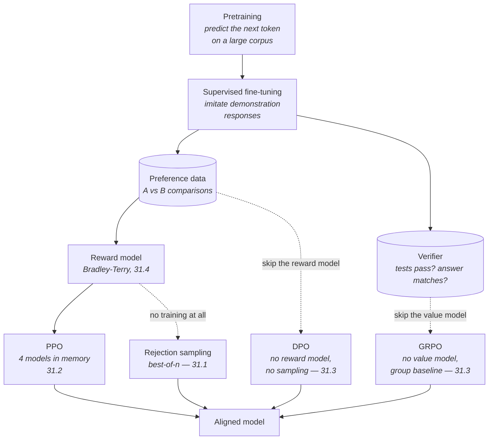

# Chapter 31 · Reinforcement Learning for LLMs

A pretrained language model is a very good imitator of the internet. It is not
yet an assistant, and the gap between the two is not knowledge — it is
behaviour. It has to prefer being helpful to being plausible, admit when it does
not know, refuse some requests, follow the instruction it was given rather than
the one it saw most often in training. None of that can be taught by showing it
more text, because there is no corpus of "the ideal response to every prompt a
user will ever send". What there *is*, cheaply and in quantity, is people
willing to look at two answers and say which is better.

Turning that judgement into weight updates is what this chapter is about. It is
the stage of training called **post-training** or **alignment**, and it is where
most of the difference between a raw model and a product gets made. You will
build the whole pipeline in numpy: a policy that samples, a reward that scores,
a gradient that moves the weights towards what scored well, and the four or five
things that go wrong when you do that naively — runaway updates, exploding
variance, models that drift into gibberish while chasing a number, and reward
functions that get gamed so thoroughly the model ends up worse than when it
started.

We build it in the order the field discovered it. REINFORCE first, because it is
the honest core of every method here. Then PPO, as four patches to REINFORCE,
each fixing a problem you will have already watched happen. Then DPO and GRPO,
which are best understood as deletions — each one removes an entire model from
PPO's memory bill. And finally the reward itself, which is the part nobody can
outsource: where the number comes from, how it gets corrupted, and why a passing
test suite is worth more than a very good preference model.

!!! note "This chapter is harder than the others — here is how to read it"

    Not because the code is complicated. Every snippet here is shorter than the
    binary search tree in [Chapter 20](../ch20-bst/index.md). It is harder
    because it stacks: policy gradients only make sense once "gradient" means
    something concrete, PPO only makes sense as a fix to policy gradients, and
    DPO only makes sense once you have seen the KL-regularised objective it
    solves in closed form.

    So: **read it in order, and run every block.** Section 31.1 is
    deliberately slow — it builds "gradient" from scratch by measuring a slope
    with finite differences, assuming nothing about calculus beyond arithmetic.
    Do not skip it even if the word is familiar; the rest of the chapter uses
    exactly the machinery it sets up, and the finite-difference gradient check
    it teaches is used to verify every analytic gradient that follows.

    Expect to spend longer here than on any other chapter in Part V, and expect
    the second read to be much easier than the first. If a formula stops you,
    look at the runnable block underneath it — every single equation on these
    pages is also written out as numpy you can print, poke at, and break.

## The map

Here is the whole pipeline, from a raw pretrained model to a deployed one. The
top row is the classical RLHF path (roughly what the InstructGPT paper
described); the two branches below it are the routes that later replaced parts
of it.

Read the dotted arrows as the three ways to spend less. DPO removes the reward
model *and* the generation loop by solving the objective on paper. GRPO removes
the value network by using a group of sampled responses as the baseline. And
best-of-$n$ removes training entirely, which is why 31.1 makes you implement it
before anything else — it is a real baseline, not a straw man.

**After this chapter you can …**

- say precisely what reinforcement learning buys over supervised fine-tuning,
  and why "judging is easier than producing" is the reason it matters for LLMs;
- define state, action, policy, reward, trajectory, return and discount against
  both a grid world and a language model, and explain why a next-token predictor
  *is already* a policy;
- explain what a gradient is without calculus, measure one by finite
  differences, and verify an analytic gradient against a numerical one — the
  check you should run on every derivation you write;
- implement epsilon-greedy on a bandit and read a regret curve to diagnose too
  little and too much exploration;
- implement best-of-$n$ / rejection sampling, and price it in KL;
- write the REINFORCE update from the formula, and explain every symbol in it;
- explain why a baseline reduces variance without introducing bias, and
  demonstrate the effect numerically;
- derive PPO as four fixes — importance ratio, clipped objective, multiple
  epochs, KL penalty — and implement the clipped loss;
- run a PPO loop and show the clip binding, and say what the clip costs and buys;
- compute the memory bill for PPO on a 7B model and explain which two models the
  alternatives delete;
- state the DPO loss, explain the implicit reward and the role of $\beta$, and
  implement a complete DPO trainer with a verified gradient;
- name DPO's real failure modes, including the one where both likelihoods fall;
- compute group-relative advantages and implement GRPO on a verifiable task;
- choose between PPO, DPO, GRPO and rejection sampling on data, memory, compute
  and stability grounds;
- train a Bradley-Terry reward model and measure held-out accuracy;
- measure inter-annotator agreement with Cohen's kappa and say why raw agreement
  misleads;
- recognise reward hacking in a reward curve, state Goodhart's law, and
  implement a length-debiased reward that fixes one instance of it;
- distinguish outcome from process supervision on a multi-step trace, and use a
  rule-based verifier as a reward;
- describe RLAIF and Constitutional AI accurately, and implement a
  critique-and-revise loop;
- explain the credit-assignment problem over an agent trajectory and compare
  uniform, discounted and step-level attribution.

**Prerequisites.** [Chapter 26](../ch26-llm-internals/index.md) is required: this
chapter treats the model as a policy, which is exactly the softmax-over-logits
object built in [26.4](../ch26-llm-internals/04-sampling.md), and everything is
written in the same hand-rolled numpy style.
[Section 27.1](../ch27-inference/01-kv-cache.md) is needed for the memory
arithmetic in 31.2 — RL training generates constantly, so the KV cache is part
of the bill. [Chapter 30](../ch30-agents/index.md) motivates the credit
assignment discussion at the end of 31.4, and
[Section 24.2](../ch24-practice/02-testing.md) is the direct ancestor of
verifiable rewards: a passing test suite *is* a reward function. From Parts
I–IV you need [Chapter 6](../ch06-loops/index.md) (every training loop is a
loop), [Chapter 7](../ch07-arrays/index.md) (arrays and indexing) and
[Section 16.1](../ch16-complexity/01-big-o.md) (counting work before timing it).
No calculus is assumed anywhere.

**Sections**

- [31.1 RL from first principles](01-rl-basics.md) — supervised versus
  reinforcement signal, the seven-word vocabulary defined on a grid world and on
  an LLM, epsilon-greedy on a three-armed bandit with a regret curve, gradients
  built from finite differences and checked against the analytic form, softmax
  policies and log-probabilities, and best-of-$n$ as a serious baseline.
- [31.2 Policy gradients and PPO](02-policy-gradient-ppo.md) — REINFORCE
  symbol by symbol and running, baselines and the variance they remove,
  advantage and actor-critic, PPO as four fixes with the clipping figure
  generated from code, a toy PPO loop where the clip visibly binds, and the
  four-model memory bill for a 7B run.
- [31.3 DPO and GRPO](03-dpo-grpo.md) — the closed-form optimum rearranged into
  an implicit reward, the DPO loss term by term, a complete DPO trainer with a
  finite-difference gradient check and a before/after table, what $\beta$ does
  at both extremes, DPO's honest failure modes, GRPO's group-relative advantage
  on a verifiable task, and a four-way comparison table.
- [31.4 Reward models — PRM, RLHF, RLAIF](04-reward-models.md) — why humans
  compare instead of scoring, Cohen's kappa, a Bradley-Terry reward model with
  held-out accuracy, reward hacking plotted as it happens, length debiasing as
  the fix, outcome versus process supervision on a multi-step trace, test suites
  as rewards, a Constitutional-AI critique-revise loop, and credit assignment
  over an agent trajectory.
- [Exercises](exercises.md) — tune epsilon, verify a gradient, predict what
  clipping does, poison a preference pair, compute group-relative advantages by
  hand, break your own reward function, and fix it.

!!! note "What is real and what is simulated here"

    Nothing on these pages calls a model, touches a network, or imports torch —
    the Run buttons execute numpy in your browser. Every policy is a softmax
    over a handful of logits, every "response" is an index into a short list,
    and where a language model is needed it is a deterministic `FakeLLM`. What
    is **faithful** is the mathematics: the REINFORCE update, the PPO clipped
    objective, the DPO loss and its gradient, the group-relative advantage, and
    the Bradley-Terry loss are all written exactly as the papers state them. A
    DPO step on eight preference pairs with ten parameters is a *correct* DPO
    step. Each page says explicitly which parts are toy scale and which are the
    real algorithm.
