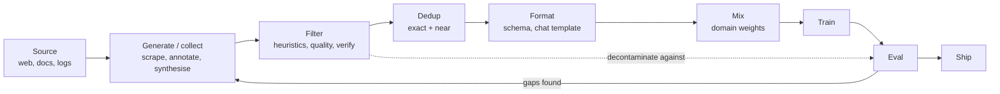

# 32.1 Why data decides everything

Chapters 26 to 31 gave you the machinery: attention, sampling, tool calls,
agent loops, DPO. Every one of those is a *lever*, and every one of them is
now roughly standardised across the field — the architecture of a modern
open-weights model is a handful of well-known choices, and anyone can copy
them in an afternoon. What is not standardised, not copyable, and not
published in full by anyone is the corpus. This section argues that at a
fixed compute budget, the data pipeline is where the remaining quality
lives, shows you the shape that data takes on disk, and hands you three
runnable tools — a schema validator, a mixture sampler, and a contamination
detector — that every data engineer writes in their first week.

## The thesis, argued with mechanisms

The slogan is *garbage in, garbage out*, and slogans are worth very little.
Here is the mechanism instead. Training minimises the negative log
likelihood of the corpus — the model is rewarded, token by token, for
predicting exactly the text you fed it. That single fact has three sharp
consequences.

**A model cannot learn a behaviour that the corpus never demonstrates.**
If no document in the corpus ever refuses a request, no amount of parameter
count teaches refusal. If the corpus contains code but never contains code
*with a test that fails and is then fixed*, the model has never seen the
repair loop and will not perform it. Capability is downstream of
demonstration; there is no architectural substitute for an example.

**A model learns the corpus's mistakes with the same enthusiasm as its
truths.** The loss function does not know which tokens are correct. A web
scrape in which 3% of arithmetic is wrong teaches the model that arithmetic
is 3% wrong — and because it is trained to *imitate the distribution*, it
will reproduce plausible-looking errors, not flag them. Filtering is not
tidiness; it is the only place where the notion "this text is wrong" enters
the system at all.

**Every token you spend on one thing is a token you did not spend on
another.** Compute-optimal training (the Chinchilla line of work, Hoffmann
et al.) fixed the number of tokens you can afford. If 82% of that budget is
generic web text, then the fraction reaching mathematics is what it is,
regardless of how clever the attention variant is. Changing the *mixture*
changes what the model is good at, and it costs nothing extra to train.

This is the shift the field calls **data-centric AI** — a term Andrew Ng
popularised around 2021 for the practice of holding the model fixed and
iterating on the data instead of the reverse. Its footprints are everywhere
in modern LLM work: careful public pretraining corpora (The Pile, C4,
RedPajama, Dolma, FineWeb) that are as much *filtering* projects as
collection projects; the "Textbooks Are All You Need" line of small models
trained on curated and synthetic textbook-style text; and LIMA (Zhou et al.),
which fine-tuned on roughly **1,000** carefully hand-curated examples and
argued that alignment is largely a matter of surfacing behaviour the base
model already has. We are deliberately not quoting leaderboard deltas here:
those numbers age in months, and the mechanism above does not.

!!! note "What is settled and what is current practice"
    Settled: loss is computed on the corpus, so the corpus defines the
    ceiling. Also settled: exact and near-duplicate text hurts, and
    benchmark leakage invalidates measurement. Current practice, and
    moving: which specific filters, which mixture weights, how much
    synthetic data is safe. Treat published recipes as of their date.

## The data lifecycle

Data engineering is a loop, not a step. Everything in this chapter is one
box in this diagram, and the arrow that matters most is the one that goes
backwards.



The backwards arrow is the whole job. You never know which filter mattered
until an eval tells you what the model still cannot do; then you go back and
generate or keep more of *that*. Sections 32.2 to 32.4 walk the loop
clockwise: how to generate data, the particular data agents need, and how to
filter it.

## Three kinds of training data (plus one)

Part V has already met all of these in passing. Here they are as records on
disk, which is how you will actually meet them.

**Pretraining text** — unlabelled documents. There is no "answer"; the
training signal is next-token prediction over the whole string.

```json
{
  "id": "web-0004821",
  "text": "A hash table stores key–value pairs in an array of slots ...",
  "source": "commoncrawl-2024-18",
  "url": "https://example.org/notes/hashing",
  "lang": "en",
  "n_tokens": 812,
  "quality_score": 0.71
}
```

**SFT instruction pairs** — a prompt and one target response. Loss is
computed only on the response tokens, so the model learns *what to say when
asked*, not how to write prompts.

```json
{
  "id": "sft-0001",
  "instruction": "Explain what a hash table is.",
  "input": "",
  "output": "A hash table maps keys to slots using a hash function ...",
  "source": "handwritten",
  "license": "CC-BY-4.0"
}
```

**Preference pairs** — one prompt, two responses, and a label saying which
is better. This is exactly the format
[DPO](../ch31-rl/03-dpo-grpo.md) consumes: a `chosen` and a `rejected`
completion for the same prompt.

```json
{
  "id": "pref-0007",
  "prompt": "Explain what a hash table is.",
  "chosen": "A hash table maps keys to array slots via a hash function ...",
  "rejected": "It's a table. With hashes.",
  "annotator": "human",
  "margin": 3
}
```

And the fourth kind, the one agent work runs on: **trajectories**, the full
Thought–Action–Observation chain an agent produced while solving a task,
plus whether it succeeded. That format gets its own section —
[32.3](03-trajectories.md).

## JSONL: the lingua franca

Almost every dataset you will touch is **JSONL**: one JSON object per line,
UTF-8, newline-separated. It wins because it is *streamable* — you can read
a 400 GB file line by line without loading it, exactly the pattern from
[Section 11.2](../ch11-files/02-read-write.md) — and because appending is
just writing another line.

The single most valuable thing you can add to a JSONL pipeline is a
**schema validator** that runs before training, not after. The block below
writes three records (one deliberately broken), then reads them back and
validates each against a declared schema. Following this chapter's
create-then-read rule, the file is made in the same block that consumes it.

```python
import json

# --- write side: three SFT records, one deliberately malformed -------------
records = [
    {"id": "sft-0001", "instruction": "Explain what a hash table is.",
     "input": "", "output": "A hash table maps keys to slots using a hash "
                            "function, giving average O(1) lookup.",
     "source": "handwritten", "license": "CC-BY-4.0"},
    {"id": "sft-0002", "instruction": "Translate to French.",
     "input": "good morning", "output": "bonjour",
     "source": "handwritten", "license": "CC-BY-4.0"},
    {"id": "sft-0003", "instruction": "Summarise the text.",
     "input": "a long article", "output": "",          # empty output — bad
     "source": "scrape", "license": "unknown"},
]

with open("sft_demo.jsonl", "w", encoding="utf-8") as f:
    for r in records:
        f.write(json.dumps(r, ensure_ascii=False) + "\n")

# --- schema: required field name -> (type, extra check) --------------------
SCHEMA = {
    "id":          (str, lambda v: len(v) > 0),
    "instruction": (str, lambda v: len(v.strip()) >= 5),
    "input":       (str, lambda v: True),          # may be empty
    "output":      (str, lambda v: len(v.strip()) > 0),
    "source":      (str, lambda v: v in {"handwritten", "synthetic", "scrape"}),
    "license":     (str, lambda v: v != "unknown"),
}

def validate(rec):
    """Return a list of problems; empty list means the record is clean."""
    problems = []
    for field, (typ, ok) in SCHEMA.items():
        if field not in rec:
            problems.append(f"missing field '{field}'")
        elif not isinstance(rec[field], typ):
            problems.append(f"'{field}' is {type(rec[field]).__name__}, "
                            f"want {typ.__name__}")
        elif not ok(rec[field]):
            problems.append(f"'{field}' failed its check (value={rec[field]!r})")
    for field in rec:
        if field not in SCHEMA:
            problems.append(f"unexpected field '{field}'")
    return problems

# --- read side: stream the file back, one JSON object per line -------------
kept, dropped = [], []
with open("sft_demo.jsonl", "r", encoding="utf-8") as f:
    for lineno, line in enumerate(f, start=1):
        rec = json.loads(line)
        problems = validate(rec)
        if problems:
            dropped.append((lineno, rec["id"], problems))
        else:
            kept.append(rec)

print(f"read {len(kept) + len(dropped)} records, "
      f"kept {len(kept)}, dropped {len(dropped)}")
for lineno, rid, problems in dropped:
    print(f"  line {lineno} ({rid}):")
    for p in problems:
        print(f"     - {p}")
```

```text
read 3 records, kept 2, dropped 1
  line 3 (sft-0003):
     - 'output' failed its check (value='')
     - 'license' failed its check (value='unknown')
```

Note what the validator caught: an empty `output` (which would train the
model to answer with silence) and an unknown licence (which is a legal
problem, not a quality one). Both are invisible until something checks.
`json.loads` per line also gives you a free corruption check — a truncated
write raises `json.JSONDecodeError` on exactly the line that broke.

## The chat-message format

Modern instruction models are not trained on bare strings; they are trained
on a **list of messages**, each with a `role` (`system`, `user`,
`assistant`, and often `tool`). A **chat template** then renders that list
into the single token sequence the model sees, inserting special markers so
the model can tell whose turn it is. Different model families use different
markers, so the messages list is the portable format and the rendered string
is not.

```python
import json

SYSTEM = "You are a careful, concise assistant."

raw_pairs = [
    {"instruction": "Explain what a hash table is.", "input": "",
     "output": "It maps keys to slots with a hash function: average O(1) lookup."},
    {"instruction": "Translate to French.", "input": "good morning",
     "output": "bonjour"},
]

def to_chat(pair, system=SYSTEM):
    """Turn one instruction/input/output record into a chat-message record."""
    user = pair["instruction"]
    if pair["input"]:
        user += "\n\n" + pair["input"]
    return {"messages": [
        {"role": "system",    "content": system},
        {"role": "user",      "content": user},
        {"role": "assistant", "content": pair["output"]},
    ]}

chat_records = [to_chat(p) for p in raw_pairs]
print(json.dumps(chat_records[1], indent=2, ensure_ascii=False))

# A chat *template* renders those messages into the string the model
# actually sees. The markers below are invented; the shape is universal.
def render(record):
    return "\n".join(f"<|{m['role']}|>\n{m['content']}\n<|end|>"
                     for m in record["messages"])

print()
print(render(chat_records[1]))
```

```text
{
  "messages": [
    {
      "role": "system",
      "content": "You are a careful, concise assistant."
    },
    {
      "role": "user",
      "content": "Translate to French.\n\ngood morning"
    },
    {
      "role": "assistant",
      "content": "bonjour"
    }
  ]
}

<|system|>
You are a careful, concise assistant.
<|end|>
<|user|>
Translate to French.

good morning
<|end|>
<|assistant|>
bonjour
<|end|>
```

The most common bug in the entire field of fine-tuning is a **template
mismatch**: you train with one set of markers and serve with another. The
model then sees a prompt shaped unlike anything it was trained on and
behaves strangely for no visible reason. Always render training data with
the same template the serving stack will use.

## Data mixture: the cheapest lever you have

A corpus is not one pile; it is several, and you choose how often to draw
from each. Those choices are **mixture weights**. The naive option is to
sample in proportion to how much text you happen to have — which hands most
of the budget to whichever source was easiest to scrape. The alternative is
to pick weights deliberately, which means some small domains get repeated
(more than one epoch) and some huge ones get truncated.

```python
import numpy as np
import matplotlib.pyplot as plt

rng = np.random.default_rng(0)

# Tokens available in each domain (billions), and the mixture we choose.
domains   = ["web", "books", "code", "math", "dialogue"]
available = np.array([800.0, 60.0, 90.0, 8.0, 12.0])     # B tokens on disk
natural   = available / available.sum()                   # "just use it all"
curated   = np.array([0.45, 0.10, 0.25, 0.12, 0.08])      # hand-chosen

BUDGET = 100.0          # B tokens of training compute we can afford

print(f"{'domain':>9} {'on disk':>8} {'natural':>8} {'curated':>8} {'epochs':>8}")
for i, d in enumerate(domains):
    epochs = curated[i] * BUDGET / available[i]
    print(f"{d:>9} {available[i]:7.0f}B {natural[i]:7.1%} "
          f"{curated[i]:7.1%} {epochs:8.2f}")

# Sampling from a mixture = draw a domain, then a document from it.
N = 20_000
draws_nat = rng.choice(len(domains), size=N, p=natural)
draws_cur = rng.choice(len(domains), size=N, p=curated)
share_nat = np.bincount(draws_nat, minlength=len(domains)) / N
share_cur = np.bincount(draws_cur, minlength=len(domains)) / N

print(f"\nempirical share over {N} sampled documents")
for i, d in enumerate(domains):
    print(f"{d:>9}  natural {share_nat[i]:6.1%}   curated {share_cur[i]:6.1%}"
          f"   ratio x{share_cur[i] / share_nat[i]:5.1f}")

x = np.arange(len(domains))
plt.figure(figsize=(7, 3.5))
plt.bar(x - 0.2, share_nat, width=0.4, label="natural (size-proportional)")
plt.bar(x + 0.2, share_cur, width=0.4, label="curated mixture")
plt.xticks(x, domains)
plt.ylabel("share of sampled documents")
plt.xlabel("domain")
plt.title("Mixture weights reshape what the model actually sees")
plt.legend()
plt.tight_layout()
```

```text
   domain  on disk  natural  curated   epochs
      web     800B   82.5%   45.0%     0.06
    books      60B    6.2%   10.0%     0.17
     code      90B    9.3%   25.0%     0.28
     math       8B    0.8%   12.0%     1.50
 dialogue      12B    1.2%    8.0%     0.67

empirical share over 20000 sampled documents
      web  natural  82.6%   curated  44.8%   ratio x  0.5
    books  natural   6.3%   curated  10.3%   ratio x  1.6
     code  natural   9.0%   curated  25.1%   ratio x  2.8
     math  natural   0.8%   curated  11.9%   ratio x 14.8
 dialogue  natural   1.3%   curated   7.8%   ratio x  6.0
```

Read the `epochs` column carefully: it is $w_i B / A_i$, the number of times
the training run passes over domain $i$. Only `math` exceeds 1.00 — at a 12%
weight and 8 B tokens available, the math corpus is seen **1.5 times**.
Every other domain is sampled without exhausting it. Repetition is not free
(repeated text is memorised faster than it is generalised), so "how many
epochs does my smallest upweighted domain get?" is a question worth asking
before every run.

The empirical shares confirm that sampling really does reproduce the weights
— and the `ratio` column shows the actual effect of curation: mathematics
goes from 0.8% of what the model sees to 11.9%, a factor of nearly fifteen
in this draw, for zero extra compute.

## Contamination: the failure that fakes success

If a test question appears in the training data, the model can recall it
instead of solving it, and your benchmark number measures memorisation.
This is **contamination** (or benchmark leakage), and it is the single most
common way an impressive result turns out to be nothing. It is easy to do by
accident: benchmark questions get posted online, scraped, and land in a
Common Crawl dump two years later.

The standard defence is **n-gram overlap decontamination**: build the set of
$n$-grams in your training corpus, and drop any evaluation item that shares
too many of them. Here $n = 8$ words, a common choice — long enough that
coincidental matches are rare, short enough to catch light paraphrase.

```python
import re

def ngrams(text, n=8):
    words = re.findall(r"[a-z0-9]+", text.lower())
    return {tuple(words[i:i + n]) for i in range(len(words) - n + 1)}

def contamination(train_docs, test_docs, n=8):
    """For each test item: fraction of its n-grams seen in training."""
    train_grams = set()
    for d in train_docs:
        train_grams |= ngrams(d, n)
    report = []
    for i, t in enumerate(test_docs):
        g = ngrams(t, n)
        hit = len(g & train_grams)
        report.append((i, hit / len(g) if g else 0.0, hit))
    return report, len(train_grams)

train = [
    "The capital of France is Paris and it sits on the river Seine in Europe.",
    "To reverse a linked list iteratively you walk the list keeping three "
    "pointers named previous current and next until current becomes none.",
    "Photosynthesis converts light energy into chemical energy stored in "
    "glucose inside the chloroplasts of green plants.",
]

test = [
    # verbatim leak from train doc 1
    "To reverse a linked list iteratively you walk the list keeping three "
    "pointers named previous current and next until current becomes none.",
    # same topic, different words — legitimately unseen
    "Explain how to invert a singly linked structure without extra memory.",
    # partial leak: one sentence copied, one new
    "Photosynthesis converts light energy into chemical energy stored in "
    "glucose inside the chloroplasts of green plants. Name the two stages.",
]

report, n_train_grams = contamination(train, test, n=8)
print(f"training set has {n_train_grams} distinct 8-grams\n")
print(f"{'test item':>10} {'overlap':>9} {'matched':>8}  verdict")
for i, frac, hit in report:
    verdict = "CONTAMINATED" if frac > 0.10 else "clean"
    print(f"{i:>10} {frac:8.1%} {hit:8d}  {verdict}")
```

```text
training set has 32 distinct 8-grams

 test item   overlap  matched  verdict
         0   100.0%       15  CONTAMINATED
         1     0.0%        0  clean
         2    69.2%        9  CONTAMINATED
```

Item 0 is a verbatim copy: every one of its 15 8-grams is in training. Item
2 is the interesting case — only its *first sentence* leaked, and the
detector still flags it at 69.2% overlap, because a copied sentence produces
many overlapping windows. Item 1 asks the same thing in different words and
correctly scores zero; n-gram overlap does not catch semantic duplication,
which is a real limitation we return to in
[Section 32.4](04-filtering.md), where the same detector becomes a pipeline
stage. The rule is simple and admits no exceptions: **decontaminate against
every eval you intend to report**, and say in the write-up that you did.

## Licensing, provenance, and PII — the honest section

Three obligations travel with every corpus, and none of them is a
solved problem.

**Licensing.** Text on the open web is not automatically licensed for
training. Some is public domain, some is permissively licensed, much is
"all rights reserved" and merely visible. The legal position varies by
jurisdiction and is actively being litigated. The engineering response is
the same regardless: record the licence per record (as the schema above
did), and be able to *remove* a source later. A corpus you cannot filter by
provenance is a corpus you can never fix.

**Provenance.** For every record, keep where it came from, when it was
fetched, and what transformed it. This is not bookkeeping for its own sake:
when an eval regresses, provenance is how you find which batch did it.

**PII.** Personally identifiable information — names, emails, phone numbers,
addresses, identifiers — ends up in scraped text constantly, and a model can
reproduce it verbatim. Every serious pipeline runs a scrubber. Here is one,
built from the pattern syntax of
[Section 41.1](../ch41-regex/01-fundamentals.md), along with an honest look at
what it misses. `subn` returns both the new string and the number of
substitutions, which is what makes the scrubber *auditable* rather than silent.

```python
import re

EMAIL = re.compile(r"\b[A-Za-z0-9._%+-]+@[A-Za-z0-9.-]+\.[A-Za-z]{2,}\b")
PHONE = re.compile(r"(?<![\w-])\(?\d{3}\)?[-. ]?\d{3}[-. ]?\d{4}(?![\w-])")

def scrub(text):
    text, n_mail = EMAIL.subn("[EMAIL]", text)
    text, n_tel = PHONE.subn("[PHONE]", text)
    return text, n_mail + n_tel

docs = [
    "Contact ada@example.org or call (608) 555-0142 before Friday.",
    "Reach me at grace dot hopper at navy dot mil, or ring 0044 20 7946 0958.",
    "Order 608-555-0142 shipped; tracking number 555 123 4567 is on the label.",
]

for i, d in enumerate(docs):
    cleaned, n = scrub(d)
    print(f"doc {i}: {n} redaction(s)")
    print(f"   before: {d}")
    print(f"   after : {cleaned}")
```

```text
doc 0: 2 redaction(s)
   before: Contact ada@example.org or call (608) 555-0142 before Friday.
   after : Contact [EMAIL] or call [PHONE] before Friday.
doc 1: 0 redaction(s)
   before: Reach me at grace dot hopper at navy dot mil, or ring 0044 20 7946 0958.
   after : Reach me at grace dot hopper at navy dot mil, or ring 0044 20 7946 0958.
doc 2: 2 redaction(s)
   before: Order 608-555-0142 shipped; tracking number 555 123 4567 is on the label.
   after : Order [PHONE] shipped; tracking number [PHONE] is on the label.
```

Document 0 works. The other two are the lesson. Document 1 contains **two**
pieces of real PII and the scrubber found **zero**: an obfuscated email
("grace dot hopper at navy dot mil") that people write specifically to
defeat regexes, and a UK phone number whose grouping does not match the
North American pattern. Document 2 is the mirror-image failure: two
**false positives**, an order ID and a tracking number that happen to look
like phone numbers, now destroyed.

So a regex scrubber is a *floor*, not a solution. Real pipelines stack it
with a named-entity model, allow-lists for known-safe formats, and — the
part no tool replaces — a human reading a random sample of the output. Say
in your dataset card exactly which scrubber ran, and never claim the corpus
is PII-free. Claim that these patterns were removed.

!!! warning "Common mistakes"
    - **Validating after training instead of before.** A schema check costs
      seconds and catches empty outputs, wrong types, and truncated JSON.
      Run it as the first stage of every pipeline.
    - **Training with one chat template and serving with another.** The
      model sees an unfamiliar prompt shape and quality drops for no visible
      reason. Render training data with the serving template.
    - **Letting mixture weights be an accident.** "Whatever we scraped" is a
      mixture too — just one nobody chose. Write the weights down; compute
      the epochs each domain gets.
    - **Reporting a benchmark you never decontaminated against.** If you did
      not check for leakage, the number is not evidence. Run the overlap
      detector and say in the write-up that you did.
    - **Treating a PII regex as compliance.** It is one layer. It misses
      obfuscated formats and shreds innocent order numbers.

## Check your understanding

??? success "Why can't a bigger model make up for a corpus that never demonstrates a behaviour?"
    Because training only ever minimises prediction error on the text you
    supplied. Parameters give the model *capacity* to represent behaviour,
    but the gradient signal that shapes behaviour comes entirely from the
    tokens in the corpus. A behaviour with zero demonstrations has zero
    gradient pointing towards it. Scale changes how well the model fits the
    data; it does not add data.

??? success "In the mixture table, `math` shows 1.50 epochs while `web` shows 0.06. What do those two numbers mean, and which one should worry you?"
    Epochs is $w_i B / A_i$ — the weight times the token budget, divided by
    how many tokens that domain actually has. `web` at 0.06 means the run
    touches only 6% of the available web text, so no document repeats.
    `math` at 1.50 means the 8 B-token math corpus is passed over one and a
    half times, so half of it is seen twice. Repetition is the one to watch:
    repeated text is memorised faster than it is generalised, and heavy
    upweighting of a small domain is how you get a model that recites its
    math corpus.

??? success "Test item 1 in the contamination demo scored 0.0% overlap. Does that prove it is uncontaminated?"
    No. It proves no 8-word window of it appears verbatim in training. A
    paraphrase, a translation, or the same problem with different numbers
    would all score near zero and still leak the answer. N-gram overlap
    catches copying, not knowledge. Semantic near-duplicate detection
    (Section 32.4) catches more, and neither catches everything — which is
    why held-out evals written after the training cutoff remain valuable.

??? success "The PII scrubber redacted a tracking number. Why is that not simply a bug to fix by making the regex stricter?"
    Because the two error types trade off against each other. A stricter
    phone pattern (requiring "call" or "tel" nearby, say) would stop
    destroying tracking numbers — and would also stop catching phone numbers
    that appear bare in a signature block. Every threshold you pick buys
    recall with precision. The engineering answer is to pick the trade-off
    deliberately for your risk profile, stack independent detectors, and
    audit a human-read sample either way.
