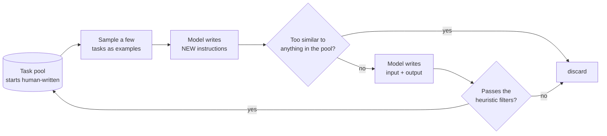
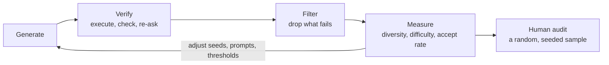

# 32.2 Synthetic data generation

The last section argued that data is the lever. This one is about the awkward
follow-up question: where do you get any? Human annotation is slow, expensive,
and — the part people forget — *inconsistent*, because two annotators asked to
write "a good answer" will write two different kinds of good. Since roughly
2022 there has been a second option: use a language model to write the data,
then spend your human budget on *checking* it rather than producing it. That
trade is the single biggest change in how instruction data gets built, and it
comes with a failure mode severe enough to have its own name. This section
implements four real recipes — Self-Instruct, Evol-Instruct, UltraFeedback-style
preference synthesis, and persona seeding — and then makes the failure mode
happen on purpose.

!!! abstract "In plain words"

    - **What it is.** Instead of paying people to write training examples, you
      let a capable model write them, and spend your human budget on *checking*
      the output rather than authoring it.
    - **Picture it.** A strong student writing practice problems for a weaker one
      to drill on — cheap, endless, and exactly as good as the strong student's
      own understanding.
    - **Why it matters.** It is the biggest reason instruction data got cheap, and
      its risk is subtle: a model is far better at *asking* questions than at
      *answering* them, so left unchecked the practice set fills with confident
      wrong answers.

## Why synthesise: the arithmetic

Nothing about synthetic data is subtle economically. A human writing a careful
instruction/response pair is doing minutes of skilled work; a model does it in
seconds of GPU time. Put your own numbers in — the rates below are placeholders
you should replace with real quotes — and the ratio is what matters.

```python
# All rates are ILLUSTRATIVE placeholders. Replace them with your own quotes;
# the shape of the answer is what this block is for.
N = 50_000                 # examples wanted

HUMAN_MINUTES = 6.0        # minutes for one careful instruction + response
HUMAN_RATE_HR = 25.0       # currency units per hour, fully loaded

GEN_TOKENS = 600           # prompt + completion tokens per generated example
GEN_COST_PER_MTOK = 3.0    # currency units per million tokens
AUDIT_FRACTION = 0.05      # fraction of synthetic data a human still reads
AUDIT_MINUTES = 1.5        # minutes to read and judge one example

human_cost = N * HUMAN_MINUTES / 60 * HUMAN_RATE_HR
human_days = N * HUMAN_MINUTES / 60 / 6 / 20       # 20 annotators, 6 useful h/day

gen_cost = N * GEN_TOKENS / 1e6 * GEN_COST_PER_MTOK
audit_cost = N * AUDIT_FRACTION * AUDIT_MINUTES / 60 * HUMAN_RATE_HR

print(f"{'approach':<28}{'cost':>12}{'human days':>13}")
print(f"{'all human':<28}{human_cost:>12,.0f}{human_days:>13.1f}")
print(f"{'generated':<28}{gen_cost:>12,.0f}{0.0:>13.1f}")
print(f"{'generated + 5% audit':<28}{gen_cost + audit_cost:>12,.0f}"
      f"{N * AUDIT_FRACTION * AUDIT_MINUTES / 60 / 6 / 20:>13.1f}")
print(f"\ncost ratio, all-human vs generated+audit: "
      f"{human_cost / (gen_cost + audit_cost):.0f}x")
print(f"generation is {gen_cost / (gen_cost + audit_cost):.0%} of the "
      f"generated+audit bill — the humans are still the expensive part")
```

```text
approach                            cost   human days
all human                        125,000         41.7
generated                             90          0.0
generated + 5% audit               1,652          0.5

cost ratio, all-human vs generated+audit: 76x
generation is 5% of the generated+audit bill — the humans are still the expensive part
```

Read the last line before you get excited about the ratio. Generation itself is
almost free; the audit is most of the remaining cost even at 5%, and cutting the
audit to zero is exactly how teams ship a corpus full of confident nonsense. The
right way to state the benefit is: **synthetic data moves the human from author
to inspector**, and inspecting is perhaps four times faster than authoring. It
does not remove the human.

## Distillation: a strong teacher, a smaller student

The most common use of a model to make data is **distillation**, and it is three
steps:

1. **Run a strong model — the *teacher*** — over a set of prompts you curated.
2. **Keep its outputs**, exactly as if a human had written them.
3. **Fine-tune a smaller or cheaper model — the *student*** — on them.

The name and the original idea come from Hinton, Vinyals and Dean's 2015 work on
distilling the knowledge in a neural network, where the student learned from the
teacher's full output distribution.

In LLM practice the usual version is coarser and simpler: the student is trained
on the teacher's *sampled text*. Stanford's Alpaca is the best-known early public
example — a small open model fine-tuned on instruction data generated by a much
stronger one.

The API shape is unremarkable, which is the point. This is not runnable here
(network, API key), so it gets no Run button:

```text
for prompt in prompts:                       # a list you curated
    response = client.messages.create(
        model=TEACHER_MODEL_ID,
        max_tokens=512,
        messages=[{"role": "user", "content": prompt}],
    ).content[0].text
    write_jsonl({"instruction": prompt, "output": response,
                 "source": "distill", "teacher": TEACHER_MODEL_ID})
```

!!! warning "The legal part is not a footnote"

    Many commercial model providers' terms of service restrict using their
    outputs to train competing models. Whether a given distillation is
    permitted depends on the provider, the licence of the outputs, and where
    you are — and it changes. Record the teacher and the date in every record's
    provenance (Section 32.1), read the terms that actually apply to you, and
    treat "everyone does it" as what it is: not a legal opinion.

Two technical limits are worth stating up front.

- **The student inherits the teacher's ceiling, mistakes included.** It is
  learning to imitate a specific model, not learning to be correct.
- **Style transfers faster than substance.** Distilled models often sound
  exactly like their teacher while being noticeably worse at the reasoning
  underneath, because imitating surface form is much easier than reproducing
  the computation.

!!! abstract "In plain words"

    - **What it is.** Grow a big, varied set of tasks out of a tiny handful of
      hand-written ones, by asking the model for more and keeping only the ones
      that are genuinely new.
    - **Picture it.** A few sample exam questions pinned to a board. Each round you
      write a few more in the same spirit, throw away any that are near-copies of
      what is already up there, and pin the survivors — which then seed the next
      round.
    - **Why it matters.** A pile of near-duplicate tasks looks large but teaches
      little. The "keep only what is new" filter is what turns a big dataset into
      a genuinely *diverse* one.

## Self-Instruct: bootstrapping a task pool from a handful of seeds

**Self-Instruct** (Wang et al., *Self-Instruct: Aligning Language Models with
Self-Generated Instructions*, ACL 2023) is the recipe that made instruction data
cheap. You start with a small pool of human-written tasks — the paper used 175 —
and then loop:



One turn of that loop, in order:

1. **Sample** a few tasks from the pool to serve as few-shot examples.
2. **Generate** a batch of new instructions from that prompt.
3. **Reject the near-duplicates** — anything too similar to a task already in
   the pool.
4. **Generate an instance** for each survivor: its input and its output.
5. **Filter** on the heuristics — wrong task type, degenerate stub, no answer
   produced.
6. **Append** what is left to the pool, where it becomes a few-shot example for
   the next round.

Step 6 is what makes it *self*-instruct: the pool bootstraps itself. Step 3 is
the load-bearing part — without it the model proposes the same handful of tasks
forever, and you get a large dataset with a tiny effective size.

### The similarity filter

Self-Instruct's rule is: keep a new instruction only if its **ROUGE-L** overlap
with every existing instruction is below 0.7. ROUGE-L scores two strings by the
length of their **longest common subsequence** of words — a subsequence, not a
substring, so it tolerates inserted and deleted words (though not reordering,
which shortens the common subsequence). Here it is implemented and
tried on the cases that matter.

```python
import re

def tokens(text):
    """Lower-cased word tokens; punctuation dropped."""
    return re.findall(r"[a-z0-9]+", text.lower())

def lcs_length(a, b):
    """Length of the longest common subsequence, one row of the DP table."""
    prev = [0] * (len(b) + 1)
    for x in a:
        cur = [0]
        for j, y in enumerate(b, start=1):
            cur.append(prev[j - 1] + 1 if x == y
                       else max(prev[j], cur[j - 1]))
        prev = cur
    return prev[-1]

def rouge_l(s, t):
    """F1 of LCS precision and recall: 1.0 means identical word sequences."""
    a, b = tokens(s), tokens(t)
    if not a or not b:
        return 0.0
    lcs = lcs_length(a, b)
    precision, recall = lcs / len(a), lcs / len(b)
    if precision + recall == 0:
        return 0.0
    return 2 * precision * recall / (precision + recall)

reference = "Explain what a hash table is."
candidates = [
    "Explain what a hash table is.",              # identical
    "Explain what a hash map is.",                # one word changed
    "Explain, in simple terms, what a hash table is.",   # padded
    "Explain what a binary search tree is.",      # different topic, same frame
    "Write a Python function that reverses a string.",   # unrelated
]
print(f"{'ROUGE-L':>8}  {'verdict':<10} candidate")
for c in candidates:
    score = rouge_l(reference, c)
    verdict = "DISCARD" if score > 0.7 else "keep"
    print(f"{score:>8.2f}  {verdict:<10} {c!r}")
```

```text
 ROUGE-L  verdict    candidate
    1.00  DISCARD    'Explain what a hash table is.'
    0.83  DISCARD    'Explain what a hash map is.'
    0.80  DISCARD    'Explain, in simple terms, what a hash table is.'
    0.62  keep       'Explain what a binary search tree is.'
    0.14  keep       'Write a Python function that reverses a string.'
```

The threshold is doing real work in the fourth row. "Explain what a binary
search tree is" shares the whole frame with the reference and differs only in
the topic — and it scores just under the line, so it survives. Nudge the
threshold to 0.6 and you would lose it, along with most of the pool's topical
coverage. Nudge it to 0.9 and near-copies flood in. 0.7 is the paper's choice
and a reasonable default, not a law of nature.

### The full pipeline, three rounds

Now the whole loop. The generator is a `FakeLLM`: deterministic, offline, and
genuinely reactive — it reads the sampled seed instructions, prefers a topic
they do *not* mention, and occasionally just parrots one of them back, which is
the behaviour the similarity filter exists to catch. A real model does the same
thing more fluently.

```python
# continues
import random

SEED_POOL = [
    "Explain what a hash table is.",
    "Write a Python function that sorts a list of numbers.",
    "List three reasons to write unit tests.",
    "Summarise a paragraph in one sentence.",
    "Translate a sentence into French.",
    "Explain what a linked list is.",
]

# Tasks a text-only dataset cannot contain: no model output can draw a picture.
BANNED = {"draw", "plot", "image", "photo", "video", "colour", "picture"}

class FakeLLM:
    """Stand-in for the generator model. Text in, list of instructions out."""

    FRAMES = [
        "Explain {obj} to a complete beginner.",
        "List three common mistakes people make with {obj}.",
        "Write a Python function that {code}.",
        "Compare {obj} with {obj2} in two sentences.",
        "Draw a colourful diagram of {obj}.",     # will fail the text-only rule
        "Translate {obj} into Old Norse.",        # it cannot answer this itself
        "Explain.",                               # degenerate stub
    ]
    OBJECTS = ["a hash table", "a binary search tree", "a Python set",
               "a stack", "a queue", "a linked list"]
    CODE = ["reverses a string", "counts the words in a paragraph",
            "removes duplicates from a list",
            "checks whether a word is a palindrome"]

    def __init__(self, seed=0):
        self.rng = random.Random(seed)

    def propose(self, prompt, k=4):
        """Given a few-shot prompt of example tasks, write k new instructions."""
        mentioned = [o for o in self.OBJECTS if o in prompt]
        fresh = [o for o in self.OBJECTS if o not in mentioned] or self.OBJECTS
        out = []
        for _ in range(k):
            if self.rng.random() < 0.25:            # sometimes it just parrots
                shown = [ln.strip("- ").strip() for ln in prompt.splitlines()
                         if ln.strip().startswith("-")]
                out.append(self.rng.choice(shown))
                continue
            frame = self.rng.choice(self.FRAMES)
            obj = self.rng.choice(fresh)
            other = self.rng.choice([o for o in self.OBJECTS if o != obj])
            out.append(frame.format(obj=obj, obj2=other,
                                    code=self.rng.choice(self.CODE)))
        return out

    def instance(self, instruction):
        """Write the (input, output) pair for an instruction, or fail."""
        low = instruction.lower()
        if low.startswith("explain") and "to a complete beginner" in low:
            topic = instruction[len("Explain "):].split(" to a complete")[0]
            return "", (f"{topic[0].upper()}{topic[1:]} is a data structure. "
                        "Here is the idea in one paragraph ...")
        if low.startswith("list three common mistakes"):
            return "", "1. ...\n2. ...\n3. ..."
        if low.startswith("write a python function"):
            return "def solve(x):\n    ...", "def solve(x):\n    return x"
        if low.startswith("compare"):
            return "", "They differ in ordering guarantees and in lookup cost."
        return "", ""            # the generator cannot answer its own question

def self_instruct(rounds=3, k=4, gen_seed=2, sample_seed=100, threshold=0.7):
    llm = FakeLLM(gen_seed)
    pool = list(SEED_POOL)
    reasons, growth = {}, [len(pool)]
    for r in range(1, rounds + 1):
        shown = random.Random(sample_seed + r).sample(pool, 3)
        prompt = "\n".join(f"- {s}" for s in shown)
        if r > 1:
            print()
        print(f"ROUND {r}  (pool = {len(pool)})")
        for cand in llm.propose(prompt, k=k):
            toks = tokens(cand)
            reason = None
            if len(toks) < 4:
                reason = "too short"
            elif set(toks) & BANNED:
                reason = "not a text-only task"
            else:
                best, closest = max((rouge_l(cand, p), p) for p in pool)
                if best > threshold:
                    reason = f"too similar ({best:.2f}) to a pool task"
                elif not llm.instance(cand)[1]:
                    reason = "no instance produced"
            if reason:
                reasons[reason.split(" (")[0]] = \
                    reasons.get(reason.split(" (")[0], 0) + 1
                print(f"   REJECT  {cand:<62} <- {reason}")
            else:
                pool.append(cand)
                print(f"   accept  {cand}")
        growth.append(len(pool))
    return pool, reasons, growth

pool, reasons, growth = self_instruct()
print(f"\npool size after each round: {growth}")
print(f"accepted {growth[-1] - growth[0]} of 12 proposals "
      f"({(growth[-1] - growth[0]) / 12:.0%})")
print("rejection reasons:")
for reason, count in sorted(reasons.items(), key=lambda kv: -kv[1]):
    print(f"   {count:>2}  {reason}")
```

```text
ROUND 1  (pool = 6)
   REJECT  Explain.                                                       <- too short
   accept  List three common mistakes people make with a linked list.
   REJECT  Draw a colourful diagram of a hash table.                      <- not a text-only task
   REJECT  Translate a stack into Old Norse.                              <- no instance produced

ROUND 2  (pool = 7)
   accept  Compare a queue with a Python set in two sentences.
   accept  Write a Python function that checks whether a word is a palindrome.
   REJECT  Draw a colourful diagram of a binary search tree.              <- not a text-only task
   REJECT  Write a Python function that sorts a list of numbers.          <- too similar (1.00) to a pool task

ROUND 3  (pool = 9)
   REJECT  Compare a queue with a Python set in two sentences.            <- too similar (1.00) to a pool task
   REJECT  Explain what a linked list is.                                 <- too similar (1.00) to a pool task
   REJECT  Draw a colourful diagram of a stack.                           <- not a text-only task
   accept  Compare a binary search tree with a linked list in two sentences.

pool size after each round: [6, 7, 9, 10]
accepted 4 of 12 proposals (33%)
rejection reasons:
    3  not a text-only task
    3  too similar
    1  too short
    1  no instance produced
```

Everything worth knowing about Self-Instruct is in that trace.

The pool grew 6 → 7 → 9 → 10, and **the reasons for rejection changed as it
grew**: round 1 lost proposals to a stub, a picture task and an unanswerable
one, and not a single near-duplicate. By round 3 the generator was re-proposing
tasks the pool already contained, and the similarity filter became the dominant reason —
zero of its rejections in round 1, one in round 2, two in round 3, three of the
eight total. That is the shape of every real run. The pool is a coverage
problem, and once the easy region is covered the generator keeps walking back
into it, so near-duplicate rejection grows from irrelevant to dominant while
the acceptance rate falls.

Note the fourth rejection reason, `no instance produced`. The generator asked
for a translation into Old Norse and then could not perform it. This is the
quiet failure that makes synthetic corpora bad: a model is much better at
*proposing* tasks than at *doing* them, so an unfiltered pipeline fills up with
questions whose answers are confabulated. Generating the answer and checking
that it exists is the cheapest possible verification, and Section 32.4 is
entirely about the stronger ones.

!!! note "What is toy, what is faithful"

    Toy: a hand-written generator with seven sentence frames instead of a real
    model, six seed tasks instead of 175, three rounds instead of thousands,
    and no instance-level deduplication. Faithful: the loop structure, the
    ROUGE-L < 0.7 filter, the text-only task blacklist, filtering on failed
    instance generation, and above all the *dynamics* — a pool that grows
    quickly at first and then saturates, with near-duplicates dominating the
    rejections.

!!! abstract "In plain words"

    - **What it is.** Take tasks you already have and rewrite them to be *harder* —
      add a constraint, demand the reasoning, pin down a vague word — instead of
      only ever generating fresh easy ones.
    - **Picture it.** A teacher taking a warm-up question and turning the screw:
      "now do it without the built-in function, and show every step." Same topic,
      higher difficulty.
    - **Why it matters.** Breadth alone leaves every task at the difficulty of the
      seeds. Evolving them upward is how a dataset gains a difficulty *curriculum* —
      as long as you throw away rewrites that became unanswerable.

## Evol-Instruct: making instructions harder on purpose

Self-Instruct gives you breadth. It does not give you *difficulty*: sampled
tasks tend to sit at the difficulty of the seeds. **Evol-Instruct** (Xu et al.,
the method behind WizardLM) fixes that by rewriting existing instructions to be
harder, in two directions:

- **In-depth evolving** — add constraints, deepen the question, make it
  concrete, or demand more reasoning steps. Same task, higher difficulty.
- **In-breadth evolving** — mutate into a *new* instruction in a nearby domain
  at comparable difficulty. New task, same level.

The five operators implemented below are one reasonable reading of that split:

| Operator | Direction | What it does to the instruction |
| --- | --- | --- |
| `add_constraints` | in-depth | forbids something, so the easy solution stops working |
| `deepen` | in-depth | demands more than an answer — here, its cost |
| `concretize` | in-depth | replaces something vague with a specific value |
| `add_reasoning_steps` | in-depth | asks for the intermediate work, not just the result |
| `breadth_mutation` | in-breadth | writes a new instruction in a nearby domain |

Crucially the paper also specifies **elimination evolving**. A rewrite is
discarded if any one of four things is true:

1. it gained no information over its parent;
2. the model cannot answer it;
3. the answer is empty, or nothing but stop words;
4. the rewriting prompt's own template text leaked into the instruction.

Rewriting blindly is how you get a dataset of unanswerable garbage, so the
checks come with the method.

```python
import re
import textwrap

SEED = "Write a Python function that removes duplicates from a list."

# ---- the five operators, as deterministic rewriters ------------------------
def add_constraints(instr):
    return instr.rstrip(".") + ", without using the built-in set type."

def deepen(instr):
    return instr.rstrip(".") + ", and state the time complexity of your answer."

def concretize(instr):
    """Replace something vague with something specific — if there is anything."""
    for vague, concrete in [("a list", "the list [3, 1, 3, 7, 1]"),
                            ("a string", "the string 'level'"),
                            ("a paragraph", "the paragraph below")]:
        if vague in instr:
            return instr.replace(vague, concrete, 1)
    return instr                      # nothing to concretise: no change at all

def add_reasoning_steps(instr):
    return instr.rstrip(".") + ", showing each intermediate step."

def breadth_mutation(instr):
    """A NEW instruction in a nearby domain at similar difficulty."""
    return "Write a Python function that groups a list of words by first letter."

OPS = {"add_constraints": add_constraints, "deepen": deepen,
       "concretize": concretize, "add_reasoning_steps": add_reasoning_steps,
       "breadth_mutation": breadth_mutation}

def rewrite(op, parent):
    """The rewriter model. On long parents it confuses itself and echoes its
    own prompt template — a real and very common failure."""
    child = op(parent)
    if len(parent.split()) > 22:
        child = "#Rewritten Prompt#: " + child
    return child

# ---- the responder, used only to test whether a rewrite is answerable ------
def respond(instruction):
    if instruction.lower().count("without using") >= 2:
        return "Sorry, I cannot satisfy both of those constraints at once."
    if len(instruction.split()) > 30:
        return "..."                              # gives up, emits punctuation
    return ("Here is a solution with an explanation of how it works and "
            "what it costs.")

# ---- elimination evolving: four checks, straight from the paper ------------
def eliminate(parent, child, answer):
    if child.strip() == parent.strip():
        return "no information gain over the parent"
    low = answer.lower()
    if "sorry" in low or "cannot" in low:
        return "the model could not answer it"
    if len(re.findall(r"[a-z0-9]+", low)) <= 3:
        return "answer is empty or stop words only"
    if "#rewritten prompt#" in child.lower() or "given prompt" in child.lower():
        return "rewriting template leaked into the instruction"
    return None

# ---- the tree. WizardLM picks one operator at random per round; we write the
# schedule out so the trace is identical on every machine. Each entry is
# (operator name, children to try if this node survives).
PLAN = [
    ("add_constraints", [
        ("add_constraints", []),                  # stack the same constraint
        ("deepen", [
            ("concretize", []),                   # now far too long
            ("breadth_mutation", []),
        ]),
    ]),
    ("concretize", [
        ("concretize", []),                       # nothing vague left
        ("add_reasoning_steps", []),
    ]),
    ("breadth_mutation", [
        ("deepen", []),
    ]),
]

def evolve(seed, plan):
    """Walk the plan, printing every node's operator, length and fate."""
    kept, killed = [], []
    print(f"seed ({len(seed.split())}w): {seed}")

    def grow(parent, nodes, level):
        for op_name, children in nodes:
            child = rewrite(OPS[op_name], parent)
            answer = respond(child)
            why = eliminate(parent, child, answer)
            pad = "  " * level
            # the operators append, so the TAIL is what changed: show that
            shown = child if len(child) <= 56 else "..." + child[-53:]
            tag = f"{op_name} {len(child.split())}w"
            if why:
                killed.append((op_name, why))
                print(f"{pad}x [{tag:<24}] {shown}")
                print(f"{pad}    ELIMINATED: {why}")
            else:
                kept.append(child)
                print(f"{pad}+ [{tag:<24}] {shown}")
                grow(child, children, level + 1)

    grow(seed, plan, 1)
    return kept, killed

kept, killed = evolve(SEED, PLAN)
print(f"\nkept {len(kept)}, eliminated {len(killed)} "
      f"of {len(kept) + len(killed)} rewrites")
for op_name, why in killed:
    print(f"   - [{op_name}] {why}")
longest = max(kept, key=lambda k: len(k.split()))
print(f"longest survivor ({len(longest.split())}w):")
print(textwrap.fill(longest, width=72, initial_indent="   ",
                    subsequent_indent="   "))
```

```text
seed (10w): Write a Python function that removes duplicates from a list.
  + [add_constraints 16w     ] ...tes from a list, without using the built-in set type.
    x [add_constraints 22w     ] ...ilt-in set type, without using the built-in set type.
        ELIMINATED: the model could not answer it
    + [deepen 24w              ] ...t type, and state the time complexity of your answer.
      x [concretize 31w          ] ...t type, and state the time complexity of your answer.
          ELIMINATED: answer is empty or stop words only
      x [breadth_mutation 15w    ] ...function that groups a list of words by first letter.
          ELIMINATED: rewriting template leaked into the instruction
  + [concretize 15w          ] ...hat removes duplicates from the list [3, 1, 3, 7, 1].
    x [concretize 15w          ] ...hat removes duplicates from the list [3, 1, 3, 7, 1].
        ELIMINATED: no information gain over the parent
    + [add_reasoning_steps 19w ] ...list [3, 1, 3, 7, 1], showing each intermediate step.
  + [breadth_mutation 13w    ] ...function that groups a list of words by first letter.
    + [deepen 21w              ] ...letter, and state the time complexity of your answer.

kept 6, eliminated 4 of 10 rewrites
   - [add_constraints] the model could not answer it
   - [concretize] answer is empty or stop words only
   - [breadth_mutation] rewriting template leaked into the instruction
   - [concretize] no information gain over the parent
longest survivor (24w):
   Write a Python function that removes duplicates from a list, without
   using the built-in set type, and state the time complexity of your
   answer.
```

Each line shows the operator, the child's length in words, and its **tail** —
the operators append, so the tail is where the change lives. (The one exception
is `concretize`, which edits the middle; that is why the 31-word child looks
like its 24-word parent from the right. Read the word count.) Depth is
difficulty: the seed asked for a function, and the longest survivor asks for
that function *plus* a banned built-in *plus* a complexity analysis. No seed
instruction did all three.

Now read the four eliminations, because they are the reason the method works at
all. Every one of these would otherwise have become a training example.

| Eliminated node | Why it had to go |
| --- | --- |
| `add_constraints` on an already-constrained parent | The same constraint stacked twice; the responder refuses, so there is no answer to train on. |
| `concretize` on the 24-word parent | The rewrite pushed past the responder's limit and the "answer" came back as punctuation. |
| `breadth_mutation` under a 24-word parent | The rewriter echoed `#Rewritten Prompt#` into the instruction — a leaked template marker that would ship inside the corpus. |
| `concretize` on an already-concrete instruction | Nothing vague left to replace, so the operator returned its input unchanged: a duplicate wearing a new id. |

Note that two of the four are triggered by *length of the parent*, not by the
operator. That is the practical warning: the deeper you evolve, the more the
rewriter's own failures leak into the data, so the elimination check has to run
at every node rather than once at the end.

!!! tip "Difficulty is a curriculum knob, not a virtue"

    Harder is not automatically better. Evolve too far and you get instructions
    that no model can answer, which produce garbage responses that then teach
    the student to produce garbage. Evolve too little and the student never
    leaves the seeds' difficulty band. Track the *answerable* rate — the
    fraction of evolved instructions that survive elimination — and stop
    evolving a branch when it falls off a cliff.

## Synthesising preferences: the UltraFeedback pattern

Chapter 31 consumed preference pairs and did not ask where they came from. One
answer is: from a model. **UltraFeedback** (Cui et al.) popularised the pattern
that most open preference datasets now follow:

1. take a prompt;
2. sample responses from **several different models** (not several samples from
   one — you want genuinely different failure modes);
3. have a strong model score every response on **multiple named criteria**, not
   one vague "quality";
4. turn the scores into `chosen` / `rejected` pairs.

The multi-criteria step is what stops the scorer from collapsing into "longer is
better". Here it is end to end, with rule-based scorers standing in for the
judge model, and the output in exactly the format
[31.3's DPO trainer](../ch31-rl/03-dpo-grpo.md) expects.

```python
import json

PROMPT = "Explain why a hash table lookup is usually O(1)."

# Four responses that fail in four different ways — this is why you sample
# from several models rather than four times from one.
RESPONSES = {
    "model-a": ("Each key is hashed to a bucket index, so the lookup touches "
                "one bucket instead of scanning. Example: 40 keys in 64 "
                "buckets averages under one comparison. In the worst case, "
                "when every key collides, it degrades to O(n)."),
    "model-b": "Hashing gives the index directly.",
    "model-c": ("Hash tables are always O(log n) because they are internally "
                "balanced trees, which is why lookup never degrades."),
    "model-d": ("Great question! Hash tables are a fascinating and very "
                "important topic that many people ask about. Let us talk "
                "about why hash table lookup is usually O(1), which is "
                "indeed a very common and interesting question to ask."),
}

FALSEHOODS = ["always o(log n)", "internally balanced trees", "never degrades"]
KEY_IDEAS = ["hash", "bucket", "index"]

def score_helpfulness(text):
    words = len(text.split())
    s = 1
    s += 2 if 25 <= words <= 90 else (1 if 12 <= words < 25 else 0)
    s += 1 if "example" in text.lower() or ":" in text else 0
    s += 1 if sum(k in text.lower() for k in KEY_IDEAS) >= 2 else 0
    return min(s, 5)

def score_truthfulness(text):
    return 1 if any(f in text.lower() for f in FALSEHOODS) else 5

def score_honesty(text):
    """Does it acknowledge the limits of its own claim?"""
    hedged = any(w in text.lower() for w in ["worst case", "unless", "usually",
                                             "on average", "degrades"])
    overclaims = any(w in text.lower() for w in ["always", "never"])
    return 5 if hedged and not overclaims else (2 if overclaims else 3)

def score_instruction_following(text):
    """The instruction said 'explain WHY'. Did it?"""
    explains = any(w in text.lower() for w in ["because", "so ", "since"])
    restates = text.lower().count("hash table lookup is usually") > 0
    return (5 if explains else 2) - (2 if restates else 0)

CRITERIA = {"helpful": score_helpfulness, "truthful": score_truthfulness,
            "honest": score_honesty, "follows": score_instruction_following}

scores = {m: {c: fn(t) for c, fn in CRITERIA.items()}
          for m, t in RESPONSES.items()}
overall = {m: sum(s.values()) / len(s) for m, s in scores.items()}

header = "".join(f"{c:>10}" for c in CRITERIA)
print(f"{'model':<9}{header}{'overall':>10}")
for m in RESPONSES:
    row = "".join(f"{scores[m][c]:>10}" for c in CRITERIA)
    print(f"{m:<9}{row}{overall[m]:>10.2f}")

# Pairs: the best response against every other one, as DPO records.
best = max(overall, key=lambda m: overall[m])
pairs = [{"prompt": PROMPT,
          "chosen": RESPONSES[best],
          "rejected": RESPONSES[m],
          "margin": round(overall[best] - overall[m], 2),
          "source": "ai-feedback",
          "scores": {"chosen": scores[best], "rejected": scores[m]}}
         for m in RESPONSES if m != best]

print(f"\nbest = {best}; built {len(pairs)} preference pairs")
print(f"margins: {[p['margin'] for p in pairs]}")
print("\none record, in the format 31.3 consumes:")
print(json.dumps({k: pairs[1][k] for k in ("prompt", "chosen", "rejected",
                                           "margin")},
                 indent=2)[:420] + " ...")
```

```text
model       helpful  truthful    honest   follows   overall
model-a           5         5         5         5      5.00
model-b           2         5         3         2      3.00
model-c           2         1         2         5      2.50
model-d           3         5         5         0      3.25

best = model-a; built 3 preference pairs
margins: [2.0, 2.5, 1.75]

one record, in the format 31.3 consumes:
{
  "prompt": "Explain why a hash table lookup is usually O(1).",
  "chosen": "Each key is hashed to a bucket index, so the lookup touches one bucket instead of scanning. Example: 40 keys in 64 buckets averages under one comparison. In the worst case, when every key collides, it degrades to O(n).",
  "rejected": "Hash tables are always O(log n) because they are internally balanced trees, which is why lookup never deg ...
```

The criteria table is the whole argument for multi-criteria scoring. Read it
column by column, because each column catches a different failure that a single
"how good is this" score would blur together.

`model-d` is the longest response by some distance and it never answers the
question — it restates it. Only the `follows` column notices, and it says so
loudly with a 0. A length-biased judge scoring one number would very plausibly
have ranked this response first; that is exactly the reward-hacking dynamic
[31.4](../ch31-rl/04-reward-models.md) plots. `model-c` is fluent, confident and
factually wrong, and *only* `truthful` notices — it scores a perfect 5 on
`follows` because it does explain a why, just a false one. `model-b` is correct
but useless, which shows up as a low `helpful`.

Then read the overall column and notice what averaging costs you: `model-d`
(3.25) outranks the terse-but-correct `model-b` (3.00), because four criteria
averaged let a padded answer coast on three of them. Averaging is a choice, not
a fact; UltraFeedback keeps the per-criterion scores so downstream users can
weight them differently, and so should you. Our records keep them in a `scores`
field for exactly that reason.

The `margin` field is worth keeping even though DPO ignores it. It lets you drop
pairs that are nearly tied — where the "preference" is noise — before training,
which is one of the cheapest quality wins available on a preference set.

!!! warning "AI feedback inherits the judge's blind spots"

    Every pair above encodes the *scorer's* opinion, not the truth. If the judge
    model is bad at arithmetic, its preference pairs teach the student bad
    arithmetic with total confidence. RLAIF and Constitutional AI
    ([31.4](../ch31-rl/04-reward-models.md)) are the same bargain: cheap, scalable,
    and bounded by the judge. Keep a human-labelled subset and measure judge
    agreement against it; if agreement is poor, no amount of AI feedback helps.

## Diversity beats volume

The most common way a synthetic corpus fails is not that the records are wrong.
It is that there are 100,000 of them and they are all the same record. The
standard fix is **seed conditioning**: give the generator a varied seed —
a persona, a domain, a source document, a difficulty level — so that the
distribution of outputs inherits the seed distribution's variety.

Two ways to measure whether it worked, both cheap enough to run on every batch:

- **distinct-$n$**: the number of unique word $n$-grams divided by the total
  number of $n$-grams. Low distinct-2 means the same phrases repeat everywhere.
- **vocabulary size**: how many different words the set uses at all, reported
  next to the mean record length so you can tell a bigger vocabulary from a
  longer one.

One caution before the numbers: distinct-$n$ is **length-sensitive**. Short
records produce few $n$-grams each, so the unique-over-total ratio rises simply
because the denominator is small. Comparing distinct-$n$ across sets of very
different record lengths measures length, not diversity. The two sets below are
therefore built to have nearly the same record count *and* the same mean length,
and the block prints both so you can check that before believing the rest.

```python
import re

def tokens(text):
    return re.findall(r"[a-z0-9]+", text.lower())

def distinct_n(texts, n):
    grams, total = set(), 0
    for t in texts:
        w = tokens(t)
        for i in range(len(w) - n + 1):
            grams.add(tuple(w[i:i + n]))
            total += 1
    return len(grams) / total if total else 0.0

def mean_pairwise_jaccard(texts):
    sets = [set(tokens(t)) for t in texts]
    scores = [len(sets[i] & sets[j]) / len(sets[i] | sets[j])
              for i in range(len(sets)) for j in range(i + 1, len(sets))]
    return sum(scores) / len(scores)

# --- Set A: three templates crossed with eight topics ----------------------
TOPICS = ["a hash table", "a linked list", "a binary search tree", "a stack",
          "a queue", "a heap", "a graph", "a trie"]
TEMPLATES = ["Explain what {t} is, in simple terms, for someone new to code.",
             "Describe how {t} works, in simple terms, for someone new to code.",
             "Tell me about {t}, in simple terms, for someone new to code."]
set_a = [tpl.format(t=t) for tpl in TEMPLATES for t in TOPICS]

# --- Set B: six personas crossed with four structurally different frames ---
PERSONAS = ["a nurse scheduling night shifts",
            "a warehouse manager tracking pallets",
            "a music teacher organising sheet music",
            "a biologist labelling field samples",
            "a bank auditor reviewing transfers",
            "a game developer storing player scores"]
FRAMES = [
    "You are {p}. Which data structure fits, and why?",
    "Write a Python class {p} could use, then say what it costs.",
    "{p} reports lookups getting slower every week. Diagnose the cause.",
    "Rewrite this note from {p} as three precise engineering requirements.",
]
set_b = [f.format(p=p) for f in FRAMES for p in PERSONAS]

print(f"{'metric':<22}{'set A':>10}{'set B':>10}")
rows = [("records", len(set_a), len(set_b)),
        ("unique records", len(set(set_a)), len(set(set_b))),
        ("vocabulary size", len({w for t in set_a for w in tokens(t)}),
         len({w for t in set_b for w in tokens(t)}))]
for name, a, b in rows:
    print(f"{name:<22}{a:>10}{b:>10}")
print(f"{'mean tokens/record':<22}"
      f"{sum(len(tokens(t)) for t in set_a) / len(set_a):>10.1f}"
      f"{sum(len(tokens(t)) for t in set_b) / len(set_b):>10.1f}")
for n in (1, 2, 3):
    print(f"{'distinct-' + str(n):<22}{distinct_n(set_a, n):>10.3f}"
          f"{distinct_n(set_b, n):>10.3f}")
print(f"{'mean pairwise Jaccard':<22}{mean_pairwise_jaccard(set_a):>10.3f}"
      f"{mean_pairwise_jaccard(set_b):>10.3f}")
print(f"\nexample A: {set_a[1]!r}")
print(f"example B: {set_b[1]!r}")
```

```text
metric                     set A     set B
records                       24        24
unique records                24        24
vocabulary size               30        62
mean tokens/record          13.5      14.6
distinct-1                 0.093     0.177
distinct-2                 0.173     0.255
distinct-3                 0.319     0.371
mean pairwise Jaccard      0.605     0.171

example A: 'Explain what a linked list is, in simple terms, for someone new to code.'
example B: 'You are a warehouse manager tracking pallets. Which data structure fits, and why?'
```

Check the guard rows first: 24 records each, 24 *unique* records each, and 13.5
against 14.6 mean tokens. The sets are the same size and nearly the same length,
so the diversity numbers are comparing diversity.

And every one of them disagrees with the record count. Set A uses **30 distinct
words** to set B's 62, so its whole world is half the size. Its distinct-1 is
0.093 against 0.177 — almost exactly a factor of two — because "in simple terms,
for someone new to code" reappears in every single record. Its mean pairwise
Jaccard is 0.605: pick two set-A records at random and they share about 60% of
their word types, against 17% for set B.

Notice that the gap *narrows* as $n$ grows (0.093 → 0.173 → 0.319 for A). That
is expected and worth understanding: longer $n$-grams are rarer in any corpus,
so the ratio drifts upward for both sets. Diversity metrics are for comparing
two sets under the same settings, never for reading an absolute verdict off a
single number.

This is why **"we generated a million examples" is not a quality claim**. The
number that matters is the effective size after near-duplicate removal
([32.4](04-filtering.md)), and a template-generated million can collapse to a
few thousand distinct behaviours.

!!! abstract "In plain words"

    - **What it is.** Train a model on the output of a model, generation after
      generation with no fresh real data, and the variety slowly drains out of it.
    - **Picture it.** A photocopy of a photocopy of a photocopy. Each copy looks
      fine on its own, but the faint details vanish first and never come back,
      until everything is a washed-out average.
    - **Why it matters.** The rare cases — unusual phrasings, niche topics,
      minority dialects — die first and die permanently, and a corpus that has
      lost them does not look broken. It just looks bland.

## Model collapse: when synthetic data eats itself

Now the failure mode with a name. If each generation of a model is trained on
the previous generation's output, with no fresh real data, the distribution
degrades: variance shrinks, rare events disappear, and the model converges on
its own most typical output. Shumailov et al. named this **model collapse**, and
the mechanism is simple enough to simulate exactly.

Take a distribution, fit it from a finite sample, sample from the fit, refit
from *that* sample, and repeat. The maximum-likelihood variance of $n$ samples
is biased low by a factor $\frac{n-1}{n}$ — each refit "sees" slightly less
spread than the distribution it was drawn from — so after $g$ refits

$$
\mathbb{E}\left[\sigma_g^2\right]
= \sigma_{\text{true}}^2 \left(\frac{n-1}{n}\right)^{g+1}
$$

and the spread shrinks geometrically. In words: $\sigma_g^2$ is the variance
after $g$ rounds of refitting, $\sigma_{\text{true}}^2$ the variance you started
with, and $n$ the sample size each round; because $\frac{n-1}{n}$ is a hair below
1, raising it to a growing power marches the spread steadily toward zero.

That is only half the story, though: a Gaussian has no *categories* to lose. The
block below therefore runs two simulations side by side.

- **A Gaussian chain**, to check the variance formula against 4,000 independent
  chains.
- **A vocabulary chain** over 300 words with a Zipf-like frequency curve, to
  watch rare items disappear.

The second one is where the sharp edge is. A word that draws zero samples in one
generation has probability exactly zero in the next fit, and can never come
back. That is extinction, and it is irreversible.

```python
import numpy as np
import matplotlib.pyplot as plt

# ============ 1. Gaussian chain: does the variance formula hold? ============
N, GENERATIONS, CHAINS = 20, 30, 4000

def gaussian_chains(mode, seed=0):
    """One row per independent chain. mode='replace' trains each generation
    only on the last one's samples; 'accumulate' keeps half real data."""
    rng = np.random.default_rng(seed)
    real = rng.normal(0.0, 1.0, size=(CHAINS, N))
    data = real.copy()
    per_gen = []
    for _ in range(GENERATIONS):
        per_gen.append(data.var(axis=1))                 # MLE fit, ddof=0
        mu = data.mean(axis=1, keepdims=True)
        sd = data.std(axis=1, keepdims=True)
        fresh = mu + sd * rng.normal(size=(CHAINS, N))   # sample from the fit
        data = fresh if mode == "replace" else np.concatenate(
            [fresh[:, :N // 2], real[:, :N // 2]], axis=1)
    return np.sqrt(np.array(per_gen).mean(axis=1))       # root-mean-square sd

replace = gaussian_chains("replace")
accumulate = gaussian_chains("accumulate")
g = np.arange(GENERATIONS)
theory = np.sqrt(((N - 1) / N) ** (g + 1))

# ============ 2. Vocabulary chain: which words survive? =====================
V, DRAWS, VGEN, VCHAINS = 300, 400, 30, 200
ranks = np.arange(1, V + 1)
p_true = 1.0 / ranks
p_true /= p_true.sum()                    # Zipf-like: a few common, a long tail
COMMON, RARE = ranks <= 50, ranks > 50

rng = np.random.default_rng(0)
p = np.tile(p_true, (VCHAINS, 1))
alive_common, alive_rare = [], []
for _ in range(VGEN):
    counts = np.array([rng.multinomial(DRAWS, row) for row in p])
    p = counts / DRAWS                    # refit on our own samples
    alive_common.append((p[:, COMMON] > 0).sum(axis=1).mean())
    alive_rare.append((p[:, RARE] > 0).sum(axis=1).mean())

# ============ 3. Report =====================================================
print(f"{'gen':>5}{'sd(replace)':>13}{'theory':>9}{'sd(accum)':>11}"
      f"{'common alive':>14}{'rare alive':>12}")
print(f"{'true':>5}{1.0:>13.3f}{1.0:>9.3f}{1.0:>11.3f}"
      f"{'50/50':>14}{'250/250':>12}")
for i in (0, 1, 3, 5, 10, 20, 29):
    print(f"{i:>5}{replace[i]:>13.3f}{theory[i]:>9.3f}{accumulate[i]:>11.3f}"
          f"{alive_common[i]:>10.1f}/50{alive_rare[i]:>8.1f}/250")

print(f"\nafter ONE generation: {alive_common[0] / 50:.0%} of common words "
      f"survive, but only {alive_rare[0] / 250:.0%} of rare ones")
print(f"after {VGEN} generations: {alive_common[-1] + alive_rare[-1]:.0f} of "
      f"{V} words are left")
print(f"spread after {GENERATIONS} generations, synthetic only : "
      f"{replace[-1]:.3f}")
print(f"spread after {GENERATIONS} generations, 50% real kept  : "
      f"{accumulate[-1]:.3f}")

fig, axes = plt.subplots(1, 2, figsize=(9.0, 3.2))
axes[0].plot(replace, label="synthetic only")
axes[0].plot(theory, "--", label=r"theory $((n-1)/n)^{(g+1)/2}$")
axes[0].plot(accumulate, label="50% real data kept")
axes[0].set_xlabel("generation")
axes[0].set_ylabel("root-mean-square standard deviation")
axes[0].set_title("spread shrinks each generation")
axes[0].legend(fontsize=8)
axes[1].plot(100 * np.array(alive_common) / 50, label="50 common words")
axes[1].plot(100 * np.array(alive_rare) / 250, label="250 rare words")
axes[1].set_xlabel("generation")
axes[1].set_ylabel("% of words still in the vocabulary")
axes[1].set_title("the tails die first")
axes[1].legend(fontsize=8)
fig.tight_layout()
```

```text
  gen  sd(replace)   theory  sd(accum)  common alive  rare alive
 true        1.000    1.000      1.000         50/50     250/250
    0        0.974    0.975      0.974      44.9/50    86.6/250
    1        0.955    0.950      0.953      39.9/50    60.1/250
    3        0.909    0.902      0.937      32.6/50    38.3/250
    5        0.862    0.857      0.931      28.1/50    28.3/250
   10        0.750    0.754      0.930      21.1/50    17.5/250
   20        0.575    0.584      0.929      14.7/50     9.9/250
   29        0.444    0.463      0.928      11.7/50     7.2/250

after ONE generation: 90% of common words survive, but only 35% of rare ones
after 30 generations: 19 of 300 words are left
spread after 30 generations, synthetic only : 0.444
spread after 30 generations, 50% real kept  : 0.928
```

The `sd(replace)` and `theory` columns agree to within about one percent for
most of the run and drift a few percent apart at the end, where the spread
across 4,000 chains is widest. That agreement is the useful part: collapse is
not a vague warning, it is a quantity you can predict before you run anything.

The vocabulary columns are the ones to remember, and the headline is the line
under the table. **After a single generation, 90% of the common words survive
and only 35% of the rare ones do.** Nothing filtered them; they simply failed to
appear in one finite sample, and a word with zero observed count has zero
probability in the refit forever after. Thirty generations later, 19 words are
left out of 300. In a text corpus those "rare words" are unusual phrasings,
minority dialects, niche topics, uncommon formats — and a corpus that has lost
them does not look broken. It looks bland.

The last two printed lines are the mitigation, and it is undramatic: **keep real
data in the mix.** Anchoring every generation to the original real sample — what
the `accumulate` mode above does — holds the spread at 0.928 instead of 0.444.

(In the model-collapse literature "accumulate" usually means appending *every*
past generation; anchoring to real data is the simpler cousin, and the
simulation here is the anchored one.)

In practice this means anchoring every synthetic batch to something real — a
source document, a human seed, a verified answer — rather than to the previous
batch of synthetic data.

!!! note "What this simulation does and does not show"

    It shows the statistical core of collapse — refitting on your own finite
    samples loses spread at a predictable rate, and loses rare categories
    abruptly and permanently. It does *not* show anything about language models
    specifically: a real LLM is neither a Gaussian nor a bag of independent
    words, real pipelines filter their synthetic data (which changes the
    dynamics in both directions), and how much synthetic data is safe in a real
    mix is an open, actively-researched question. Treat the mechanism as
    settled and the safe fraction as current practice.

## The quality-control loop

Everything above is the *generate* box of one loop that has four:



The last box never goes away. Whatever your automatic metrics say, a person
reads a random sample — and *random* means seeded and reproducible, not
"whichever ones we happened to look at".

```python
import hashlib
import json
import random

CONFIG = {"generator": "fake-llm-v1", "rounds": 3, "rouge_threshold": 0.7,
          "banned_verbs": ["draw", "plot", "image"], "seed": 2}

# A batch of synthetic arithmetic tasks, with a verifiable answer field.
batch = [{"id": f"syn-{i:03d}", "prompt": f"What is {a} * {b}?",
          "answer": str(a * b if i % 4 else a * b + 1)}      # every 4th is wrong
         for i, (a, b) in enumerate([(3, 4), (12, 7), (9, 9), (6, 5), (11, 3),
                                     (8, 8), (15, 2), (7, 7), (4, 13),
                                     (10, 10), (5, 6), (14, 2)])]

def verify(rec):
    """The cheapest verifier there is: recompute the answer ourselves."""
    a, b = [int(t) for t in rec["prompt"].replace("?", "").split() if t.isdigit()]
    return rec["answer"] == str(a * b)

kept = [r for r in batch if verify(r)]
print(f"generated {len(batch)}, verified {len(kept)}, "
      f"accept rate {len(kept) / len(batch):.0%}")

config_hash = hashlib.sha256(
    json.dumps(CONFIG, sort_keys=True).encode()).hexdigest()[:12]
audit = random.Random(CONFIG["seed"]).sample(kept, 3)
print(f"config sha256[:12] = {config_hash}")
print("human audit sample (reproducible from the seed above):")
for rec in audit:
    print(f"   {rec['id']}  {rec['prompt']:<18} -> {rec['answer']}")
```

```text
generated 12, verified 9, accept rate 75%
config sha256[:12] = 3fbae2f0766d
human audit sample (reproducible from the seed above):
   syn-001  What is 12 * 7?    -> 84
   syn-002  What is 9 * 9?     -> 81
   syn-011  What is 14 * 2?    -> 28
```

The accept rate is the number to watch across batches. A run whose accept rate
suddenly climbs from 75% to 99% has usually not got better; more often the
verifier broke. And the config hash means that six months later, "which
generator settings produced this batch?" has an answer.

!!! warning "Common mistakes"

    - **Generating without a similarity filter.** The model returns to the same
      few tasks, and you ship a large dataset with a small effective size. The
      filter is the method, not an optimisation.
    - **Keeping instructions whose answers were never checked.** Models propose
      tasks far better than they perform them. An unanswerable instruction with
      a confabulated answer is worse than no example at all.
    - **Reporting volume as if it were quality.** "One million synthetic
      examples" says nothing until you report distinct-$n$ and the count after
      near-duplicate removal.
    - **Training on your own outputs, repeatedly, with no real data.** Variance
      and tails shrink measurably every generation. Anchor each batch to
      something real.
    - **Trusting a single-number AI judge.** Score named criteria separately;
      a scalar judge tends to reward length and fluency, which is precisely what
      a weak model produces most easily.
    - **Skipping the human audit because the metrics look fine.** The metrics
      measure what you thought to measure. The audit is what catches the rest.

## Check your understanding

??? success "1. Self-Instruct's ROUGE-L threshold is 0.7. What breaks at 0.95, and what breaks at 0.4?"

    At 0.95 almost nothing is rejected, so near-duplicate instructions flood the
    pool; the dataset grows while its effective size stalls, and the generator's
    few-shot examples become increasingly repetitive, which makes the next round
    worse. At 0.4 the filter rejects any instruction sharing a common frame with
    an existing one — including genuinely different tasks phrased similarly, like
    "Explain what a binary search tree is" next to "Explain what a hash table
    is" — so the pool stops growing and loses topical coverage. The threshold
    trades effective size against coverage; 0.7 is a default, and you should
    check what it is discarding.

??? success "2. In the collapse simulation the standard deviation falls smoothly from 0.974 to 0.444 over 30 generations, but 65% of the rare words die in the very first one. Why the difference?"

    Because they are different kinds of quantity. Standard deviation is an
    average over every sample, so each generation nudges it down by the same
    small factor $\sqrt{(n-1)/n}$ and the curve is smooth and predictable.
    Vocabulary survival is a *threshold* event: a word with true probability
    $p$ draws zero counts in a sample of $m$ with probability roughly
    $(1-p)^m$, and once it draws zero its refitted probability is exactly zero.
    There is no gradual decline and no way back — extinction is absorbing. The
    rarest words fail that draw immediately, which is why the tail empties in
    one step while the bulk erodes over thirty. In a corpus this is why rare
    topics and unusual formats vanish long before the writing quality visibly
    drops.

??? success "3. Your UltraFeedback-style judge gives model-d (the padded response) the highest score. What is wrong, and what would you check?"

    The judge is length-biased: it is scoring fluency and volume rather than the
    named criteria. Check it the way 31.4 checks a reward model — fit the judge's
    scores against response length and see how much variance length alone
    explains. If it explains most of it, the judge is a length detector. Fixes:
    score criteria separately (as above), include an explicit
    conciseness/instruction-following axis, calibrate against a human-labelled
    subset, and consider debiasing the score by subtracting its length component.

??? success "4. Distinct-2 for set A was much lower than for set B, but both sets had 24 unique records. Why isn't 'all records are unique' enough?"

    Uniqueness is measured on whole strings, and changing one word makes a
    string unique. Distinct-$n$ measures whether the *phrases* differ. Set A
    repeats "in simple terms" in every record and one of three openings, so
    almost every bigram appears many times; a model trained on it learns those
    phrasings very strongly and learns almost nothing about task variety. The
    practical rule: measure diversity at the n-gram and embedding level, not at
    the record level, and remember that near-duplicate removal (32.4) will
    delete what uniqueness counting missed.
