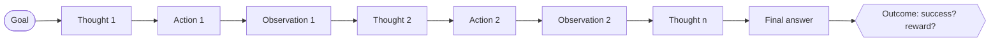

# 32.3 Agent trajectory data

Sections 32.1 and 32.2 dealt in records that fit on one line: a prompt, a
response, a preference. Agent data is not like that. When you train a model to
*use tools* — the loop of [Chapter 30](../ch30-agents/index.md) — the unit of
data is an entire episode: every thought, every tool call, every observation
that came back, and finally whether the thing worked. That is a **trajectory**,
and collecting it well is a different engineering problem from scraping text.
This section builds the whole pipeline: a schema, a recorder bolted onto a ReAct
loop, an environment designed to be collected from, a rollout driver, and a
converter that turns raw trajectories into all three of the training formats
Part V has used.

!!! abstract "In plain words"

    - **What it is.** A trajectory is the full recording of one attempt at a task —
      every thought, every tool call, every result that came back — plus a verdict
      on whether it worked.
    - **Picture it.** A dashcam for an agent. You do not just keep where it ended
      up; you keep the whole drive, including the wrong turn and the recovery, so
      later you can learn from the route and not only the destination.
    - **Why it matters.** The final answer alone cannot teach *how* to get there,
      and the most valuable moments — catching a mistake and fixing it — live in
      the middle of the path, not at the end.

## What a trajectory is

A trajectory is the complete record of one attempt at one task. Not the answer —
the *path to* the answer, plus a verdict on it.



Four things make this harder to collect than a prompt/response pair.

**It is long.** A ten-step episode with real tool output is thousands of tokens.
Storage and context limits both bite.

**It is a tree of decisions flattened into a line.** The agent could have acted
differently at every step, and the record shows only the branch taken. That is
why the *outcome* has to be attached: without it you cannot tell a good path
from a lucky one.

**The interesting parts are the mistakes.** A trajectory where the agent
mistyped a tool name, read the error, and corrected itself is worth more than a
clean one, because recovery is precisely the behaviour that is hard to teach.
Filter errors out indiscriminately and you train a model that has never seen an
error message.

**It is only useful if you can say whether it worked.** An unlabelled
trajectory is a transcript, not training data. Everything in this section is
downstream of that one requirement.

## A precise schema

Two record types: a `Step` and a `Trajectory` that owns a list of them. Here is
every field and why it earns its place.

| Field | Type | Why it is there |
| --- | --- | --- |
| `traj_id` | str | Unique per *attempt*. Two attempts at one task get two ids. |
| `task_id` | str | Unique per *task*. This is what lets you group a success and a failure on the same problem into a preference pair. |
| `goal` | str | The user-visible instruction. Becomes the `prompt` downstream. |
| `steps` | list[Step] | The Thought–Action–Observation chain, in order. |
| `final_answer` | str | What the agent actually returned, verbatim. |
| `success` | bool | The verdict from the **environment**, not from a judge. |
| `reward` | float | A scalar for RL. Here it mirrors `success`; in general it can be shaped (partial credit, step penalties). |
| `n_steps` | int | Denormalised for cheap filtering — you sort by it constantly. |
| `policy` | str | Which agent produced this. Needed to compare policies and to spot a batch collected with a broken one. |
| `env_seed` | int | The seed that rebuilds the exact world. Without it the episode is not reproducible. |
| `difficulty` | int | The graded label you designed into the task, used for stratified sampling later. |
| `Step.index` | int | Position in the episode. |
| `Step.thought` | str | The reasoning line. Train on it, and read it first when debugging. |
| `Step.action` | str | Tool name. |
| `Step.action_input` | str | Tool argument, exactly as the agent wrote it. |
| `Step.observation` | str | What came back. **Your program writes this**, never the model. |
| `Step.error` | bool | Did this step fail? Cheap to compute at write time, expensive to recover later. |

Dataclasses give you this with type hints, a readable `repr`, and `asdict` for
free. The block writes one trajectory to JSONL and reads it back, following the
create-then-read rule of [Section 11.2](../ch11-files/02-read-write.md).

```python
import json
from dataclasses import dataclass, field, asdict

@dataclass
class Step:
    """One Thought -> Action -> Observation cycle."""
    index: int
    thought: str
    action: str
    action_input: str
    observation: str
    error: bool = False

@dataclass
class Trajectory:
    """One attempt at one task, start to finish."""
    traj_id: str
    task_id: str
    goal: str
    steps: list = field(default_factory=list)
    final_answer: str = ""
    success: bool = False
    reward: float = 0.0
    n_steps: int = 0
    policy: str = ""
    env_seed: int = 0
    difficulty: int = 0

    def to_dict(self):
        d = asdict(self)                 # recurses into the Step objects
        d["n_steps"] = len(self.steps)   # always consistent on write
        return d

    @staticmethod
    def from_dict(d):
        steps = [Step(**s) for s in d.pop("steps")]
        return Trajectory(steps=steps, **d)

demo = Trajectory(
    traj_id="tr-0001", task_id="ledger-07", policy="careful",
    goal="How many bolts are in the warehouse?", env_seed=7, difficulty=2,
    steps=[
        Step(0, "I do not know which boxes exist yet.", "list_boxes", "",
             "boxes: blue, green, red, amber"),
        Step(1, "Open them one at a time and add up the bolts.", "open", "blue",
             "blue contains: bolt x4, rivet x2"),
        Step(2, "Four so far; keep going.", "open", "greeen",
             "ERROR: no box named 'greeen'. Boxes: blue, green, red, amber",
             error=True),
    ],
    final_answer="4", success=False, reward=0.0)

# --- write, then read back in the same block --------------------------------
with open("traj_demo.jsonl", "w", encoding="utf-8") as f:
    f.write(json.dumps(demo.to_dict()) + "\n")

with open("traj_demo.jsonl", "r", encoding="utf-8") as f:
    back = [Trajectory.from_dict(json.loads(line)) for line in f]

t = back[0]
print(f"read {len(back)} trajectory: id={t.traj_id} steps={t.n_steps} "
      f"success={t.success}")
print(f"round-trip identical: {t.to_dict() == demo.to_dict()}")
print(f"error steps: {[s.index for s in t.steps if s.error]}")
```

```text
read 1 trajectory: id=tr-0001 steps=3 success=False
round-trip identical: True
error steps: [2]
```

The round-trip check is not ceremony. Serialisation bugs — a field silently
dropped, a bool becoming a string, a nested object flattened — are the most
common way a trajectory corpus quietly loses information, and they are invisible
until training. Assert the round-trip in a test
([Section 24.2](../ch24-practice/02-testing.md)) and you will never debug it.

!!! tip "One trajectory per line, one episode per record"

    Resist the temptation to store steps as separate rows "for convenience".
    The episode is the atom: a step is meaningless without the ones before it,
    and splitting them means every consumer has to re-join and re-sort. JSONL
    with one nested object per line streams just as well.

## Instrumenting an agent

Now the recorder. This is the ReAct loop from
[Section 30.1](../ch30-agents/01-agent-loop-react.md) — same text protocol, same
`FakeLLM` standing in for a chat model — with the logging added. Note how little
it takes: three lines inside the loop and one dataclass. The mistake people make
is bolting the recorder on afterwards, at which point the thoughts are gone.

```python
# continues
WAREHOUSE = {"blue":  {"bolt": 4, "rivet": 2},
             "green": {"nut": 7},
             "red":   {"bolt": 5, "screw": 1},
             "amber": {"washer": 3}}

def list_boxes(_arg):
    return "boxes: " + ", ".join(WAREHOUSE)

def open_box(name):
    key = name.strip().lower()
    if key not in WAREHOUSE:
        return f"ERROR: no box named {key!r}. Boxes: {', '.join(WAREHOUSE)}"
    inside = WAREHOUSE[key]
    return f"{key} contains: " + ", ".join(f"{k} x{v}" for k, v in inside.items())

TOOLS = {"list_boxes": list_boxes, "open": open_box}

class FakeLLM:
    """Rule-based policy standing in for a chat model: text in, text out.
    Every rule fires on something MISSING from the transcript, so it reacts
    to the tool output instead of replaying a script."""

    def __call__(self, transcript):
        if "boxes:" not in transcript:
            return ("Thought: I do not know which boxes exist yet.\n"
                    "Action: list_boxes\nAction Input: ")
        unopened = [b for b in WAREHOUSE if f"{b} contains:" not in transcript]
        if unopened:
            return (f"Thought: {len(unopened)} box(es) unopened; "
                    f"open {unopened[0]} next.\n"
                    f"Action: open\nAction Input: {unopened[0]}")
        total = sum(int(line.split("bolt x")[1].split(",")[0])
                    for line in transcript.splitlines() if "bolt x" in line)
        return (f"Thought: Every box is open; the bolts add up to {total}.\n"
                f"Final Answer: {total}")

def parse(reply):
    """Model text -> (kind, fields). Identical to 30.1's parser."""
    fields = {}
    for line in reply.splitlines():
        for tag in ("Thought", "Action Input", "Action", "Final Answer"):
            if line.strip().startswith(tag + ":"):
                fields[tag] = line.strip()[len(tag) + 1:].strip()
                break
    kind = ("final" if "Final Answer" in fields else
            "act" if "Action" in fields else "unparsed")
    return kind, fields

def run_and_record(llm, goal, task_id, truth, max_steps=8):
    """The ReAct loop, with a Trajectory recorded as it goes."""
    traj = Trajectory(traj_id=f"tr-{task_id}", task_id=task_id, goal=goal,
                      policy="fakellm-careful", env_seed=0, difficulty=2)
    transcript = f"Goal: {goal}\n"
    for i in range(max_steps):
        reply = llm(transcript)
        kind, f = parse(reply)
        if kind == "final":
            traj.final_answer = f["Final Answer"]
            traj.success = traj.final_answer.strip() == str(truth)
            traj.reward = 1.0 if traj.success else 0.0
            traj.steps.append(Step(i, f.get("Thought", ""), "final_answer",
                                   traj.final_answer, "(episode ends)"))
            break
        action, arg = f.get("Action", ""), f.get("Action Input", "")
        obs = (TOOLS[action](arg) if action in TOOLS
               else f"ERROR: no tool named {action!r}")
        traj.steps.append(Step(i, f.get("Thought", ""), action, arg, obs,
                               error=obs.startswith("ERROR")))
        transcript += reply + f"\nObservation: {obs}\n"
    traj.n_steps = len(traj.steps)
    return traj

TRUTH = sum(b.get("bolt", 0) for b in WAREHOUSE.values())
traj = run_and_record(FakeLLM(), "How many bolts are in the warehouse?",
                      "ledger-demo", TRUTH)

for s in traj.steps:
    print(f"[{s.index}] Thought: {s.thought}")
    print(f"    Action : {s.action}({s.action_input!r})")
    print(f"    Observ.: {s.observation}")
print(f"\nfinal_answer={traj.final_answer!r} truth={TRUTH} "
      f"success={traj.success} reward={traj.reward} steps={traj.n_steps}")
```

```text
[0] Thought: I do not know which boxes exist yet.
    Action : list_boxes('')
    Observ.: boxes: blue, green, red, amber
[1] Thought: 4 box(es) unopened; open blue next.
    Action : open('blue')
    Observ.: blue contains: bolt x4, rivet x2
[2] Thought: 3 box(es) unopened; open green next.
    Action : open('green')
    Observ.: green contains: nut x7
[3] Thought: 2 box(es) unopened; open red next.
    Action : open('red')
    Observ.: red contains: bolt x5, screw x1
[4] Thought: 1 box(es) unopened; open amber next.
    Action : open('amber')
    Observ.: amber contains: washer x3
[5] Thought: Every box is open; the bolts add up to 9.
    Action : final_answer('9')
    Observ.: (episode ends)

final_answer='9' truth=9 success=True reward=1.0 steps=6
```

Six steps, one verdict, and $4 + 5 = 9$ is right. Two details to copy into your
own recorder. First, `final_answer` is stored **as a step**, not just as a
field — otherwise the last thought, the one that justifies the answer, is lost.
Second, `success` is computed by comparing against `TRUTH`, a number the
*program* knows. Nothing here asks a model whether the model did well.

## Designing an environment worth collecting from

Hard-coded tools over a fixed warehouse are fine for one demo and useless for
collecting 10,000 episodes. For that you need an **environment**: an object that
manufactures tasks on demand and rules on them. Four properties, and you have to
build all four in deliberately.

**Deterministic and seeded.** Seed $s$ must rebuild exactly the same world. If
it does not, you cannot reproduce a failure, you cannot re-run a prefix, and
the Monte-Carlo labelling later in this section is impossible.

**Resettable.** `reset()` returns the world to its start. Collection is a loop
over thousands of episodes; leaking state between them poisons the corpus in a
way that is very hard to notice.

**Verifiably successful.** The environment computes the ground truth itself and
compares. `success()` must never call a model. This is the same argument
[31.4](../ch31-rl/04-reward-models.md) makes for verifiable rewards: a checker
you wrote cannot be talked into agreeing with you.

**Graded difficulty.** Tasks need a knob you control, so you can measure where
the policy breaks and sample the corpus by difficulty. Below, `difficulty` is
literally how many of the four boxes hold the target item, so difficulty 3
*requires* more exploration than difficulty 1 — the grading is structural, not
a label somebody guessed.

```python
# continues
import random

class LedgerEnv:
    """A deterministic, resettable warehouse.

    difficulty = how many of the four boxes actually hold the target item,
    so difficulty 3 needs strictly more exploration than difficulty 1.
    """
    BOXES = ("blue", "green", "red", "amber")
    DECOYS = ("nut", "screw", "rivet", "washer")
    ITEMS = ("bolt", "clamp", "spring")
    MAX_STEPS = 8

    def __init__(self, seed, difficulty):
        self.seed, self.difficulty = seed, difficulty
        self.reset()

    def reset(self):
        """Rebuild the world from the seed. Same seed -> same world, always."""
        rng = random.Random(1000 * self.difficulty + self.seed)
        self.item = rng.choice(self.ITEMS)
        holders = rng.sample(self.BOXES, self.difficulty)
        self.contents = {}
        for b in self.BOXES:
            box = {d: rng.randint(1, 9) for d in self.DECOYS
                   if rng.random() < 0.4}
            if b in holders:
                box[self.item] = rng.randint(1, 9)
            self.contents[b] = box
        self.truth = sum(c.get(self.item, 0) for c in self.contents.values())
        self.opened, self.n_steps, self.answer = [], 0, None
        return self.goal()

    def goal(self):
        return f"How many {self.item}s are in the warehouse in total?"

    def step(self, action, arg=""):
        """Apply one action, return the observation string."""
        self.n_steps += 1
        if action == "final_answer":
            self.answer = arg.strip()
            return "(episode ends)"
        if action == "list_boxes":
            return "boxes: " + ", ".join(self.BOXES)
        if action == "open":
            key = arg.strip().lower()
            if key not in self.contents:
                return f"ERROR: no box named {key!r}"
            self.opened.append(key)
            inside = sorted(self.contents[key].items())
            body = ", ".join(f"{k} x{v}" for k, v in inside) or "nothing"
            return f"{key} contains: {body}"
        return f"ERROR: no action named {action!r}"

    def is_done(self):
        return self.answer is not None or self.n_steps >= self.MAX_STEPS

    def success(self):
        """Verifiable: compare against a number the environment computed."""
        return self.answer is not None and self.answer == str(self.truth)

env = LedgerEnv(seed=3, difficulty=2)
print(f"goal     : {env.goal()}")
for b, c in env.contents.items():
    print(f"  {b:<6} {c}")
print(f"truth    : {env.truth}")
print(f"same seed rebuilds the same world : "
      f"{LedgerEnv(3, 2).contents == env.contents}")
print(f"a different seed gives a different one: "
      f"{LedgerEnv(4, 2).contents != env.contents}")

# Walk it by hand to see reset / step / is_done / success in sequence.
env.reset()
print(f"\n{'action':<24}{'observation':<44}{'done'}")
for action, arg in [("list_boxes", ""), ("open", "green"), ("open", "amber"),
                    ("open", "bleu"), ("final_answer", str(env.truth))]:
    obs = env.step(action, arg)
    print(f"{action + ' ' + repr(arg):<24}{obs:<44}{env.is_done()}")
print(f"success() = {env.success()}  (answer {env.answer!r} vs truth {env.truth})")
```

```text
goal     : How many bolts are in the warehouse in total?
  blue   {'nut': 7}
  green  {'screw': 3, 'rivet': 2, 'bolt': 7}
  red    {}
  amber  {'nut': 6, 'washer': 7, 'bolt': 9}
truth    : 16
same seed rebuilds the same world : True
a different seed gives a different one: True

action                  observation                                 done
list_boxes ''           boxes: blue, green, red, amber              False
open 'green'            green contains: bolt x7, rivet x2, screw x3 False
open 'amber'            amber contains: bolt x9, nut x6, washer x7  False
open 'bleu'             ERROR: no box named 'bleu'                  False
final_answer '16'       (episode ends)                              True
success() = True  (answer '16' vs truth 16)
```

Read the `red` box: it is empty, and the agent has no way to know that without
opening it. That is deliberate. An environment where the shortcut always works
teaches shortcuts.

## Collecting at scale

With an environment, collection is a loop over seeds, difficulties and policies.
Three policies here, all reading the same transcript and differing only in when
they stop:

- **careful** opens every box before answering;
- **greedy** stops as soon as it has seen the item once — a heuristic that is
  exactly right at difficulty 1 and exactly wrong above it;
- **hasty** gets impatient after each box with probability 0.5, so it is
  genuinely stochastic and produces the mixture of successes and failures that
  preference data needs.

```python
# continues
def policy(transcript, boxes, item, rng, mode):
    """ReAct policy: read the transcript, return (thought, action, input).

    careful: open every box.  greedy: stop at the first box holding the item.
    hasty:   after each box, get impatient with probability 0.5.
    """
    if "boxes:" not in transcript:
        return ("I do not know which boxes exist yet.", "list_boxes", "")
    opened = [b for b in boxes if f"{b} contains:" in transcript]
    left = [b for b in boxes if b not in opened]
    stop = (not left
            or (mode == "greedy" and f"{item} x" in transcript)
            or (mode == "hasty" and opened and rng.random() < 0.5))
    if not stop:
        return (f"{len(left)} box(es) unopened; open {left[0]}.",
                "open", left[0])
    total = sum(int(line.split(f"{item} x")[1].split(",")[0])
                for line in transcript.splitlines() if f"{item} x" in line)
    return (f"I opened {len(opened)} of {len(boxes)} boxes; I count {total}.",
            "final_answer", str(total))

def rollout(env, mode, rng, prefix=()):
    """Run one episode and record it. `prefix` replays fixed actions first."""
    env.reset()
    traj = Trajectory(traj_id=f"tr-{mode}-d{env.difficulty}-s{env.seed}",
                      task_id=f"ledger-d{env.difficulty}-s{env.seed}",
                      goal=env.goal(), policy=mode,
                      env_seed=env.seed, difficulty=env.difficulty)
    transcript = f"Goal: {env.goal()}\n"

    def record(thought, action, arg):
        nonlocal transcript
        obs = env.step(action, arg)
        traj.steps.append(Step(len(traj.steps), thought, action, arg, obs,
                               error=obs.startswith("ERROR")))
        transcript += (f"Thought: {thought}\nAction: {action}\n"
                       f"Action Input: {arg}\nObservation: {obs}\n")

    for thought, action, arg in prefix:        # replay a known prefix
        record(thought, action, arg)
    while not env.is_done():                   # then let the policy drive
        record(*policy(transcript, env.BOXES, env.item, rng, mode))

    traj.final_answer = env.answer or ""
    traj.success = env.success()
    traj.reward = 1.0 if traj.success else 0.0
    traj.n_steps = len(traj.steps)
    return traj

SEEDS, MODES, DIFFS = range(40), ("careful", "greedy", "hasty"), (1, 2, 3)
corpus = []
for mode in MODES:
    for d in DIFFS:
        for s in SEEDS:
            # one seeded rng per rollout: the whole run is reproducible
            corpus.append(rollout(LedgerEnv(s, d), mode,
                                  random.Random(9000 + 17 * s + d)))

print(f"collected {len(corpus)} trajectories over "
      f"{len(SEEDS) * len(DIFFS)} distinct tasks\n")
print(f"{'policy':<9}{'diff':>5}{'n':>5}{'success':>10}{'mean steps':>12}"
      f"{'mean reward':>13}")
for mode in MODES:
    for d in DIFFS:
        sub = [t for t in corpus if t.policy == mode and t.difficulty == d]
        print(f"{mode:<9}{d:>5}{len(sub):>5}"
              f"{sum(t.success for t in sub) / len(sub):>10.0%}"
              f"{sum(t.n_steps for t in sub) / len(sub):>12.1f}"
              f"{sum(t.reward for t in sub) / len(sub):>13.2f}")

tasks = {t.task_id for t in corpus}
mixed = [tid for tid in tasks
         if any(t.success for t in corpus if t.task_id == tid)
         and any(not t.success for t in corpus if t.task_id == tid)]
print(f"\ntasks with BOTH a success and a failure: {len(mixed)} of {len(tasks)}")
```

```text
collected 360 trajectories over 120 distinct tasks

policy    diff    n   success  mean steps  mean reward
careful      1   40      100%         6.0         1.00
careful      2   40      100%         6.0         1.00
careful      3   40      100%         6.0         1.00
greedy       1   40      100%         4.6         1.00
greedy       2   40        0%         3.5         0.00
greedy       3   40        0%         3.1         0.00
hasty        1   40       48%         3.7         0.47
hasty        2   40       22%         3.8         0.23
hasty        3   40       18%         4.0         0.17

tasks with BOTH a success and a failure: 101 of 120
```

This table is the single most useful artefact of a collection run, and it is
worth reading slowly.

`greedy` goes **100% → 0% → 0%**. That is a policy whose heuristic is exactly
right in one regime and catastrophically wrong outside it — and if you had
collected only difficulty-1 tasks, it would have looked perfect. Grading the
difficulty is what exposed it.

`greedy` also uses *fewer* steps on harder tasks (4.6 → 3.1), which is the
signature of a policy failing faster, not solving faster. Any time mean steps
falls while success falls, you are looking at premature stopping.

`hasty` degrades gently (48% → 22% → 18%) because its failure is stochastic
rather than structural. And the last line is what makes the corpus valuable for
more than SFT: **101 of 120 tasks have at least one success and at least one
failure**, which is exactly the raw material for preference pairs.

!!! warning "A 100% success rate is a problem, not a triumph"

    The `careful` rows are all 100%. That means every one of its 120
    trajectories carries identical information about *what to do differently* —
    namely none. Data collection wants tasks the policy solves **sometimes**,
    which is the same filtering rule GRPO needs in
    [31.3](../ch31-rl/03-dpo-grpo.md): if every rollout in a group gets the same
    score, the group teaches nothing. Tune difficulty until your success rate
    sits somewhere in the middle.

## Turning trajectories into training data

One corpus, three products. Each takes a different slice of the same records.

**SFT on successes.** Keep the trajectories that worked, render each as a chat
record, train on the assistant turn. Simple, and the backbone of every agent
fine-tune.

**Preference pairs from success and failure on the same task.** `chosen` is a
successful trajectory, `rejected` is a failed one — *for the same `task_id`*.
The "same prompt" requirement is not a formality: as
[31.3](../ch31-rl/03-dpo-grpo.md) shows, DPO's normalising constant only cancels
because both completions condition on the same prompt.

**Step-level labels for a PRM.** An outcome reward says the episode failed; a
[process reward model](../ch31-rl/04-reward-models.md) says *which step* went
wrong. Getting those labels without an annotator is the interesting part, and
the next section does it.

```python
# continues
def render(traj, upto=None):
    """The trajectory as the text a model would generate."""
    lines = []
    for s in traj.steps[:upto]:
        lines.append(f"Thought: {s.thought}")
        if s.action == "final_answer":
            lines.append(f"Final Answer: {s.action_input}")
        else:
            lines.append(f"Action: {s.action}\nAction Input: {s.action_input}")
            lines.append(f"Observation: {s.observation}")
    return "\n".join(lines)

SYSTEM = ("You are a warehouse assistant. Use list_boxes and open, then give "
          "Final Answer.")

# --- 1. SFT records from successful trajectories ----------------------------
sft = [{"task_id": t.task_id,
        "messages": [{"role": "system", "content": SYSTEM},
                     {"role": "user", "content": t.goal},
                     {"role": "assistant", "content": render(t)}],
        "source": "agent-rollout", "policy": t.policy}
       for t in corpus if t.success and not any(s.error for s in t.steps)]

# --- 2. Preference pairs: same task, one success, one failure ---------------
by_task = {}
for t in corpus:
    by_task.setdefault(t.task_id, []).append(t)

pref = []
for task_id, group in sorted(by_task.items()):
    wins = [t for t in group if t.success]
    losses = [t for t in group if not t.success]
    if not wins or not losses:
        continue
    win = min(wins, key=lambda t: t.n_steps)        # shortest correct path
    loss = max(losses, key=lambda t: t.n_steps)     # longest wrong one
    pref.append({"task_id": task_id, "prompt": win.goal,
                 "chosen": render(win), "rejected": render(loss),
                 "margin": win.reward - loss.reward,
                 "source": "outcome-verified"})

print(f"SFT records          : {len(sft)}")
print(f"preference pairs     : {len(pref)}")
print(f"pairs by difficulty  : "
      f"{ {d: sum(1 for p in pref if f'-d{d}-' in p['task_id']) for d in DIFFS} }")
print(f"\nSFT assistant turn (first 3 lines):")
for line in sft[0]["messages"][2]["content"].splitlines()[:3]:
    print(f"   {line}")
print(f"\none preference pair, keys: {sorted(pref[0])}")
p = pref[0]
print(f"   task_id  : {p['task_id']}")
print(f"   prompt   : {p['prompt']}")
print(f"   chosen   ends: {p['chosen'].splitlines()[-1]}")
print(f"   rejected ends: {p['rejected'].splitlines()[-1]}")
```

```text
SFT records          : 195
preference pairs     : 101
pairs by difficulty  : {1: 21, 2: 40, 3: 40}

SFT assistant turn (first 3 lines):
   Thought: I do not know which boxes exist yet.
   Action: list_boxes
   Action Input:

one preference pair, keys: ['chosen', 'margin', 'prompt', 'rejected', 'source', 'task_id']
   task_id  : ledger-d1-s1
   prompt   : How many bolts are in the warehouse in total?
   chosen   ends: Final Answer: 4
   rejected ends: Final Answer: 0
```

195 SFT records out of 360 trajectories: the corpus is 54% training data and
46% evidence of failure, and the failures are not waste — they become the
`rejected` side of the pairs.

Note the difficulty breakdown: 21 pairs at difficulty 1 but 40 at difficulties 2
and 3, because at difficulty 1 the greedy policy also succeeds, so fewer tasks
have a failure to pair against. Preference data concentrates automatically where
the policy is unreliable, which is where you want it.

Two choices in that code deserve to be argued rather than copied. `chosen` is
the **shortest** correct trajectory and `rejected` the **longest** wrong one —
which quietly teaches "shorter is better" alongside "correct is better". If you
do not want that, pair by outcome only and match lengths. This is the same
length-bias trap that [31.4](../ch31-rl/04-reward-models.md) makes visible in
reward models; it enters through your data-construction rules just as easily.

### Step-level labels without an annotator

Here is the trick that makes process supervision affordable. The environment is
deterministic and resettable, so the value of any prefix can be *measured* in
four steps:

1. **Reset** the environment from the trajectory's recorded `env_seed` and
   difficulty, rebuilding the identical world.
2. **Replay** the first $k$ steps exactly as recorded.
3. **Roll out** the remainder many times, with whatever completion policy you
   choose.
4. **Score** the prefix as the fraction of those completions that succeeded.

That fraction is a Monte-Carlo value estimate, and it is exactly the labelling
scheme used to build process-supervision datasets without humans.

```python
# continues
def mc_value(traj, k, n_rollouts=12, completion="hasty"):
    """Estimate the value of traj's first k steps: reset, replay, roll out."""
    prefix = [(s.thought, s.action, s.action_input) for s in traj.steps[:k]]
    if any(a == "final_answer" for _, a, _ in prefix):
        return 1.0 if traj.success else 0.0        # episode already ended
    wins = 0
    for r in range(n_rollouts):
        env = LedgerEnv(traj.env_seed, traj.difficulty)
        wins += rollout(env, completion, random.Random(5000 + r),
                        prefix=prefix).success
    return wins / n_rollouts

good = next(t for t in corpus if t.policy == "careful"
            and t.difficulty == 3 and t.env_seed == 1)

print(f"task {good.task_id}: {good.goal}")
print(f"{'after step':>11}  {'action':<22}{'MC value':>9}{'delta':>8}  label")
prm_records, prev = [], None
for k, s in enumerate(good.steps):
    v = mc_value(good, k + 1)
    delta = "" if prev is None else f"{v - prev:+.2f}"
    label = "good" if prev is None or v >= prev else "bad"
    prm_records.append({"task_id": good.task_id, "step": k,
                        "prefix": render(good, upto=k + 1),
                        "value": round(v, 3), "label": label})
    print(f"{k:>11}  {s.action + ' ' + s.action_input:<22}{v:>9.2f}"
          f"{delta:>8}  {label}")
    prev = v
print(f"\n{len(prm_records)} step records; a PRM is trained to predict the "
      f"'value' column from the 'prefix' column")
```

```text
task ledger-d3-s1: How many clamps are in the warehouse in total?
 after step  action                 MC value   delta  label
          0  list_boxes                 0.08          good
          1  open blue                  0.08   +0.00  good
          2  open green                 0.17   +0.08  good
          3  open red                   0.42   +0.25  good
          4  open amber                 1.00   +0.58  good
          5  final_answer 14            1.00   +0.00  good

6 step records; a PRM is trained to predict the 'value' column from the 'prefix' column
```

That column is a value function, measured rather than learned. It starts at 0.08
— an impatient completion from the very beginning almost never opens all four
boxes — and climbs to 1.00 the moment the last box is open, because from there
*no* completion can get it wrong. Every step in this trajectory is labelled
good, which is correct: it is an optimal path on a difficulty-3 task.

Run the same procedure on a `greedy` trajectory and the value **drops** at the
step where it stops early. That drop is the label a PRM learns to predict.

Two honest caveats come with the method.

- **The estimate is noisy.** Twelve rollouts give a standard error of up to
  about $0.14$ — a 95% interval nearer $\pm 0.28$ — and a real pipeline uses
  many more.
- **It is expensive.** The cost is
  $(\text{steps}) \times (\text{rollouts})$ episodes per trajectory, which is
  why process supervision costs real money even when nobody is annotating.

## Cleaning trajectories

Raw trajectories are messy in four specific ways, and all four have mechanical
fixes. Run them **in this order** — the last one is the only stage that can
destroy meaning, so it goes last.

1. **Truncate loops.** A step repeating an `(action, input)` pair already taken
   returns information the transcript already has. Teaching a model to repeat
   itself is teaching it the failure mode of
   [30.1](../ch30-agents/01-agent-loop-react.md).
2. **Strip detours.** A failed call that was later retried successfully with the
   same action is a typo, not a lesson — unless you are deliberately keeping
   recovery examples, in which case keep the pair together and say so.
3. **Redact secrets.** Tool output is the single most likely place for a token or
   an internal address to enter your corpus. Scrub it here, with the same regex
   discipline as [Section 41.1](../ch41-regex/01-fundamentals.md), and remember
   that [32.1](01-why-data.md) already showed why a regex is a floor and not a
   guarantee.
4. **Cap the length.** Keep the head and the tail; a marker in the middle is
   more honest than a silent truncation.

The block below builds a deliberately awful episode and runs all four stages on
it, printing the step count after each.

```python
# continues
import re

SECRETS = [(re.compile(r"sk-[A-Za-z0-9\-]{6,}"), "[REDACTED_KEY]"),
           (re.compile(r"\b[\w.+-]+@[\w-]+\.[A-Za-z]{2,}\b"), "[REDACTED_EMAIL]")]

messy = Trajectory(
    traj_id="tr-messy", task_id="ledger-messy", goal="How many bolts in total?",
    policy="unfiltered", env_seed=0, difficulty=2, final_answer="9",
    success=True, reward=1.0,
    steps=[
        Step(0, "List the boxes.", "list_boxes", "", "boxes: blue, green, red, amber"),
        Step(1, "Open blue.", "open", "blue", "blue contains: bolt x4"),
        Step(2, "Open blue again.", "open", "blue", "blue contains: bolt x4"),
        Step(3, "Try green.", "open", "gren", "ERROR: no box named 'gren'", error=True),
        Step(4, "Open blue once more.", "open", "blue", "blue contains: bolt x4"),
        Step(5, "Open green.", "open", "green", "green contains: nut x7"),
        Step(6, "Fetch the manifest.", "fetch_manifest", "",
             "ok, token sk-live-9f2ad3c1b7 owner ops@warehouse.test"),
        Step(7, "Open red.", "open", "red", "red contains: bolt x5"),
        Step(8, "Open amber.", "open", "amber", "amber contains: washer x3"),
        Step(9, "Recheck the box list.", "list_boxes", "", "boxes: blue, green, red, amber"),
        Step(10, "Bolts: 4 + 5 = 9.", "final_answer", "9", "(episode ends)"),
    ])

def drop_loops(steps):
    """Remove steps whose (action, input) pair was already taken."""
    seen, out = set(), []
    for s in steps:
        key = (s.action, s.action_input)
        if key in seen and s.action != "final_answer":
            continue
        seen.add(key)
        out.append(s)
    return out

def drop_detours(steps):
    """Remove errored steps that a later successful step of the same action
    repaired — a typo, not a lesson."""
    repaired = {s.action for s in steps if not s.error}
    return [s for s in steps if not (s.error and s.action in repaired)]

def redact(steps):
    for s in steps:
        for pattern, replacement in SECRETS:
            s.thought = pattern.sub(replacement, s.thought)
            s.observation = pattern.sub(replacement, s.observation)
    return steps

def cap(steps, keep=6):
    """Keep the first step and the last keep-2, with an explicit marker."""
    if len(steps) <= keep:
        return steps
    elided = len(steps) - (keep - 1)
    marker = Step(-1, f"{elided} steps elided", "elided", "",
                  f"({elided} steps removed to fit the length cap)")
    return [steps[0], marker] + steps[-(keep - 2):]

stages = [("raw", messy.steps)]
stages.append(("after drop_loops", drop_loops(stages[-1][1])))
stages.append(("after drop_detours", drop_detours(stages[-1][1])))
stages.append(("after redact", redact(stages[-1][1])))
stages.append(("after cap(6)", cap(stages[-1][1])))

print(f"{'stage':<22}{'steps':>7}{'removed':>9}")
prev = None
for name, steps in stages:
    removed = "" if prev is None else f"{prev - len(steps):>9}"
    print(f"{name:<22}{len(steps):>7}{removed}")
    prev = len(steps)

print("\ncleaned trajectory:")
for s in stages[-1][1]:
    print(f"  {s.action:<15}{s.action_input:<8}{s.observation}")
print(f"\nsecrets remaining: "
      f"{any(p.search(s.observation) for s in stages[-1][1] for p, _ in SECRETS)}")
```

```text
stage                   steps  removed
raw                        11
after drop_loops            8        3
after drop_detours          7        1
after redact                7        0
after cap(6)                6        1

cleaned trajectory:
  list_boxes             boxes: blue, green, red, amber
  elided                 (2 steps removed to fit the length cap)
  fetch_manifest         ok, token [REDACTED_KEY] owner [REDACTED_EMAIL]
  open           red     red contains: bolt x5
  open           amber   amber contains: washer x3
  final_answer   9       (episode ends)

secrets remaining: False
```

Eleven steps became six, and the token is gone. Three notes on what just
happened, because each is a decision you are making on the reader's behalf.

**`drop_loops` removed three steps** — two repeats of `open blue` and one repeat
of `list_boxes`. Note the guard for `final_answer`: without it, an agent that
answers twice would lose its real answer.

**`drop_detours` removed the `open 'gren'` typo**, and that is a *policy
choice*. The error-and-recovery pair is exactly the behaviour you might most
want to teach. Keep a fraction of them on purpose, and record which fraction in
the dataset card.

**`cap` is the one to be careful with**, because it is the only stage that can
remove a step the answer depended on. Here it elided two steps, one of them
`open blue` — and `blue` held four of the nine bolts, so the cleaned transcript
ends by asserting 9 while showing only the 5 that came from `red`. That is a
real corruption, silently introduced by a length budget.

So: cap *last*, cap generously, and check that the survivors still support their
conclusions.

!!! warning "Common mistakes"

    - **Recording the actions but not the thoughts.** The reasoning line is
      most of what you are trying to teach, and it cannot be reconstructed
      afterwards from the tool log.
    - **Letting a model judge success.** If the environment can compute the
      answer, it must. A judged trajectory corpus inherits the judge's errors
      and you will never find them.
    - **Collecting only from tasks the policy always solves.** A 100% success
      rate produces trajectories that all say the same thing. Aim for a middling
      success rate — the same rule GRPO applies to its prompt sets.
    - **Building preference pairs across different tasks.** `chosen` and
      `rejected` must answer the same prompt or the DPO derivation does not
      hold; a pair of unrelated episodes trains noise.
    - **Filtering out every trajectory that contains an error.** You have just
      removed all the recovery behaviour from the corpus. Filter *unrecovered*
      errors instead.
    - **Truncating long trajectories without checking what was lost.** As
      above: capping can delete the observation the final answer rests on.

## Check your understanding

??? success "Why does a trajectory dataset need `task_id` as well as `traj_id`?"
    `traj_id` identifies one attempt; `task_id` identifies the problem. Every
    interesting operation groups by `task_id`: pairing a success with a failure
    into a preference record, computing per-task success rates, splitting
    train/test without leaking the same task into both, and re-running a task
    with a new policy for comparison. With only `traj_id` you have a pile of
    transcripts and no way to say which ones are about the same thing.

??? success "The `greedy` policy scored 100% at difficulty 1 and 0% at difficulties 2 and 3, while its mean step count fell from 4.6 to 3.1. What does the falling step count tell you that the success rate alone does not?"
    It tells you *how* it fails. A policy that fails by running out of budget
    would show step counts rising to the cap; `greedy`'s fall, so it is
    terminating early and confidently. That is premature stopping: it finds the
    item in one box, concludes it is done, and never looks further. The pairing
    of "fewer steps, worse outcome" is the diagnostic signature, and it points
    at the stopping rule rather than at the tools or the budget.

??? success "The Monte-Carlo step values were 0.08, 0.08, 0.17, 0.42, 1.00. Why does the value jump to exactly 1.00 after the fourth step, and what property of the environment made this labelling possible at all?"
    After the fourth step every box is open, so any completion — however
    impatient — has all the information and computes the right total; the
    remaining uncertainty is zero. The value is exactly 1.00 rather than
    approximately, because the sum is deterministic once the observations are
    in the transcript. The labelling is only possible because the environment is
    **deterministic and resettable**: `mc_value` rebuilds the identical world
    from `env_seed`, replays the prefix, and samples the rest. If the world were
    rebuilt differently each time, the rollouts would be measuring a different
    task from the one whose prefix you are scoring.

??? success "Cleaning removed 5 of 11 steps and the final trajectory no longer contains the observation that justifies its answer. Is the cleaned record still safe to train on?"
    No — not as an SFT target. The assistant turn now claims "4 + 5 = 9" while
    the visible transcript only shows the 5, so training on it rewards
    asserting a number that the context does not support, which is a recipe for
    exactly the confident-and-unfounded behaviour you are trying to remove. The
    fix is either to cap more generously, to cap *before* deciding whether the
    record is trainable and re-verify afterwards, or to drop records whose final
    answer stops being derivable from the surviving steps. The general rule:
    every cleaning stage needs a post-check, not just a step count.
