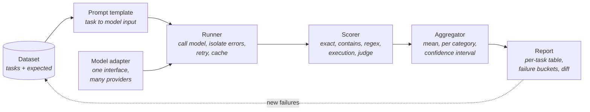

# 33.2 Building an eval harness

There are excellent evaluation frameworks, and you should end up using one. You
should not start with one, for the same reason [30.4](../ch30-agents/04-frameworks.md)
told you to hand-write the agent loop first: a harness is four hundred lines of
plumbing wrapped around five decisions, and if you adopt someone else's plumbing
before you have made those decisions yourself, you will not be able to tell
whether a number it prints is real. This section builds the whole thing —
dataset, model interface, scorers, runner, report — and then adds the parts that
separate an eval you can act on from one you merely have: error isolation,
confidence intervals, a regression gate, and metrics that make sense for agents.

## Anatomy

Every harness ever written is this pipeline, whatever it calls the pieces:



The dotted arrow is the part people skip and the part that makes the system
improve: every failure the report surfaces becomes a new dataset item, which is
the private-eval loop from [33.1](01-benchmarks.md).

Five decisions live in that diagram, and every one of them is yours to make:

1. what a task *is*;
2. how the model is called;
3. what counts as correct;
4. what happens when something explodes;
5. what the report must show for you to act on it.

The next section makes all five, in code.

## The harness

All of it fits in one runnable block, and everything later in this section is an
extension of that code. Two tables first, so the block is a thing you recognise
rather than a wall you read.

### The five regions

| Region | What it owns | The decision inside it |
| --- | --- | --- |
| **Dataset** | a frozen `Task` dataclass, so an item cannot be mutated mid-run | what counts as one eval item |
| **Models** | two `FakeLLM`s behind a single `complete(prompt)` interface | how a provider is swapped without touching anything else |
| **Scorers** | four pluggable functions, chosen per task by name | what counts as correct |
| **Runner** | the loop, with `try/except` around every single task | what happens when something explodes |
| **Report** | per-task table, aggregate, per category, failure buckets | what you need to see in order to act |

### The four scorers, and the fifth

| Scorer | Decides by | Partial credit | Breaks down when |
| --- | --- | --- | --- |
| `exact` | string equality after stripping | no | the model is chatty, or the gold has a variant spelling |
| `contains` | is the reference a substring of the output | no | the reference appears inside a *denial* of it |
| `regex` | does the output match a pattern | no | the pattern is stricter than the real requirement |
| `execution` | run the code, then run its tests | yes — the fraction of tests that passed | there is nothing executable to test |
| a judge ([33.3](03-llm-as-judge.md)) | ask a model to grade against a rubric | yes, on an anchored scale | the judge has not been validated against humans |

The first four are in the block below. The fifth is the whole of
[33.3](03-llm-as-judge.md), because it needs far more care than a function
signature suggests.

```python
"""A complete evaluation harness: dataset, models, scorers, runner, report."""
from dataclasses import dataclass
import re

# ---------------------------------------------------------------- dataset


@dataclass(frozen=True)
class Task:
    """One eval item. `expected` means whatever `scorer` says it means."""
    id: str
    prompt: str
    scorer: str
    expected: str = ""
    tests: tuple = ()
    category: str = "general"


TASKS = [
    Task("t01", "What is the capital of France? Answer with the name only.",
         "exact", "Paris", category="knowledge"),
    Task("t02", "What is 2 + 2? Answer with the number only.",
         "exact", "4", category="math"),
    Task("t03", "Name a prime number between 10 and 20.",
         "contains", "13", category="knowledge"),
    Task("t04", "Give the date 14 March 2021 as an ISO date.",
         "regex", r"^\d{4}-\d{2}-\d{2}$", category="format"),
    Task("t05", "Write count_vowels(s) returning the number of vowels.",
         "execution", tests=(("count_vowels('hello')", 2),
                             ("count_vowels('AEIOU')", 5),
                             ("count_vowels('')", 0),
                             ("count_vowels('rhythm')", 0)),
         category="code"),
    Task("t06", "Write second_largest(xs): the second largest DISTINCT value, "
                "or None.",
         "execution", tests=(("second_largest([1, 5, 3])", 3),
                             ("second_largest([9, 9, 4])", 4),
                             ("second_largest([2, 1])", 1),
                             ("second_largest([4, 4, 4])", None)),
         category="code"),
    Task("t07", "Which is the deepest ocean?", "contains", "Pacific",
         category="knowledge"),
    Task("t08", "Summarise the quarterly report in one sentence.",
         "contains", "revenue", category="long-form"),
]

# ----------------------------------------------------------------- models


class FakeLLM:
    """Deterministic stand-in for a model API: scripted and offline.

    `replies` maps a substring of the prompt to the reply. `outages` lists
    substrings that make the call raise, standing in for a real API error.
    """

    def __init__(self, name, replies, outages=(), fallback="I don't know."):
        self.name, self.replies = name, replies
        self.outages, self.fallback = outages, fallback

    def complete(self, prompt):
        for marker in self.outages:
            if marker in prompt:
                raise RuntimeError("503 from upstream provider")
        for marker, reply in self.replies.items():
            if marker in prompt:
                return reply
        return self.fallback


STRONG = FakeLLM("strong-1", {
    "capital of France": "Paris",
    "2 + 2": "4",
    "prime number": "13 is prime.",
    "ISO date": "2021-03-14",
    "count_vowels": "def count_vowels(s):\n"
                    "    return sum(c in 'aeiouAEIOU' for c in s)",
    "second_largest": "def second_largest(xs):\n"
                      "    d = sorted(set(xs), reverse=True)\n"
                      "    return d[1] if len(d) > 1 else None",
    "deepest ocean": "The Pacific Ocean, at the Mariana Trench.",
    "quarterly report": "The company had a solid three months.",
})

WEAK = FakeLLM("weak-1", {
    "capital of France": "The capital of France is Paris.",
    "2 + 2": "4",
    "prime number": "9 is a prime number.",
    "ISO date": "March 14, 2021",
    "count_vowels": "def count_vowels(s):\n"
                    "    return sum(c in 'aeiou' for c in s)",
    "second_largest": "def second_largest(xs):\n"
                      "    return sorted(xs)[-2]",
    "deepest ocean": "The Atlantic Ocean.",
}, outages=("quarterly report",))

# ---------------------------------------------------------------- scorers


def score_exact(output, task):
    return float(output.strip() == task.expected)


def score_contains(output, task):
    return float(task.expected.lower() in output.lower())


def score_regex(output, task):
    return float(re.search(task.expected, output.strip()) is not None)


def score_execution(output, task):
    """Run the generated code, then its tests. Partial credit is the point."""
    namespace = {}
    try:
        exec(output, namespace)                      # the model wrote this
    except Exception:
        return 0.0                                   # did not even define it
    passed = 0
    for call, expected in task.tests:
        try:
            passed += (eval(call, namespace) == expected)
        except Exception:                            # a crash is a failed test
            pass
    return passed / len(task.tests)


SCORERS = {"exact": score_exact, "contains": score_contains,
           "regex": score_regex, "execution": score_execution}

# ----------------------------------------------------------------- runner


@dataclass
class Result:
    task: Task
    output: str
    score: float
    error: str = ""

    @property
    def failure(self):
        if self.error:
            return "model error"
        if self.score == 1.0:
            return ""
        if self.score > 0:
            return "partial"
        return "format" if self.task.scorer == "regex" else "wrong"


def run_eval(model, tasks):
    """One task must never take the suite down with it."""
    results = []
    for task in tasks:
        try:
            output = model.complete(task.prompt)
            score = SCORERS[task.scorer](output, task)
            results.append(Result(task, output, score))
        except Exception as exc:                     # isolation lives here
            results.append(Result(task, "", 0.0, f"{type(exc).__name__}: {exc}"))
    return results

# ----------------------------------------------------------------- report


def report(model, results):
    print(f"=== {model.name} " + "=" * (46 - len(model.name)))
    print(f"{'task':<6}{'category':<11}{'scorer':<11}{'score':>6}  note")
    for r in results:
        print(f"{r.task.id:<6}{r.task.category:<11}{r.task.scorer:<11}"
              f"{r.score:>6.2f}  {r.error or r.failure}")

    n = len(results)
    print(f"\naccuracy {sum(r.score for r in results) / n:>6.1%}   "
          f"strict pass rate {sum(r.score == 1 for r in results) / n:>6.1%}"
          f"   ({n} tasks)")

    by_cat = {}
    for r in results:
        by_cat.setdefault(r.task.category, []).append(r.score)
    print("by category  " + "   ".join(
        f"{c} {sum(v) / len(v):.0%}" for c, v in sorted(by_cat.items())))

    buckets = {}
    for r in results:
        if r.failure:
            buckets[r.failure] = buckets.get(r.failure, 0) + 1
    print("failures     " + ("   ".join(f"{k} x{v}" for k, v in
                                        sorted(buckets.items())) or "none"))
    print()


for model in (STRONG, WEAK):
    report(model, run_eval(model, TASKS))
```

### What the two runs show

`strong-1` scores **87.5%** and `weak-1` scores **28.1%**, and the interesting
content is not those two numbers.

**Error isolation is the feature that makes a suite trustworthy.** `weak-1`
raises a `RuntimeError` on task `t08` — a simulated provider outage, which on a
real run is the single most common interruption. The `try/except` in `run_eval`
turns it into a scored result with an `error` field instead of a traceback that
kills the process on item 340 of 500. The rule: **the runner catches everything,
records what it caught, and keeps going**. A harness that dies halfway is a
harness you will stop running.

**Partial credit changes what you can see.** The execution scorer returns the
*fraction* of tests that passed, so `weak-1`'s `count_vowels` (which forgets
uppercase) scores 0.75 and its `second_largest` (which forgets duplicates)
scores 0.50. A binary scorer would have shown two zeros and told you nothing
about which was closer. This is why the report prints both `accuracy` (mean
score, 28.1%) and `strict pass rate` (fraction scoring exactly 1.0, 12.5%) —
they answer different questions, and quoting the first while your users
experience the second is a common way to over-claim.

**Failure buckets point at the fix.** `weak-1`'s line reads
`format x1  model error x1  partial x2  wrong x3`. Those four buckets have four
completely different remedies: constrain the output format
([28.2](../ch28-tools-mcp/02-structured-output.md)), add a retry
([30.4](../ch30-agents/04-frameworks.md)), improve the model, and check whether
the reference is even right. An aggregate score tells you *that* something is
wrong; the buckets tell you *what to do on Monday*.

**Categories are the cheapest analysis you will ever add.** `weak-1` scores
100% on `math` and 0% on `knowledge`. Ten extra lines of code, and now a
regression in one area cannot hide behind a gain in another.

!!! warning "The execution scorer runs model-written code"
    Ours uses `exec` because everything here is a string we wrote ourselves and
    the block must run in your browser. In production, generated code executes
    in a sandbox — a container with no credentials, no network, a memory cap and
    a wall-clock limit — exactly as
    [30.4](../ch30-agents/04-frameworks.md) insisted. `exec` on model output
    inside your own process is not an eval harness, it is a remote code
    execution vulnerability with a progress bar.

## Statistical honesty

!!! abstract "In plain words"

    - **What it is.** A way to ask "is this gap real or just luck?" using only the
      results you already have — by re-drawing your own task scores many times and
      watching how much the average wobbles.
    - **Picture it.** You have 50 marked tasks. Deal 50 cards *with replacement*
      from that same deck, average them, and repeat a few thousand times. The
      spread of those thousands of averages is your uncertainty — no formula, no
      distribution assumed.
    - **Why it matters.** On 50 tasks that spread is about ±12 points, wider than
      most reported "improvements". A bare number invites a false comparison;
      quoting the interval tells you whether you have actually found anything.

Here is the number that should change how you read every eval result: on 50
tasks, a 95% confidence interval on accuracy is about **±12 points wide on each
side**. Most reported improvements are smaller than that.

```python
"""How big does a gap have to be before it means anything?"""
import numpy as np

N_TASKS = 50

# --- 1. the same model, the same suite, five runs -----------------------
rng = np.random.default_rng(7)
p_task = rng.uniform(0.15, 0.95, size=N_TASKS)     # per-task pass probability
runs = [rng.binomial(1, p_task).mean() for _ in range(5)]
print("same model, same tasks, temperature > 0:")
print("  run scores: " + "  ".join(f"{s:.1%}" for s in runs))
print(f"  spread {max(runs) - min(runs):.1%} wide, with nothing changed\n")

# --- 2. one run of two models, and a bootstrap CI on each ---------------
r = np.random.default_rng(0)
a = np.zeros(N_TASKS)
a[r.choice(N_TASKS, 36, replace=False)] = 1.0       # model A: 36 / 50
b = np.zeros(N_TASKS)
b[r.choice(N_TASKS, 38, replace=False)] = 1.0       # model B: 38 / 50


def boot_ci(x, reps=4000, seed=1, alpha=0.05):
    """Percentile bootstrap: resample TASKS with replacement, re-average."""
    g = np.random.default_rng(seed)
    idx = g.integers(0, len(x), size=(reps, len(x)))
    means = x[idx].mean(axis=1)
    return np.percentile(means, [100 * alpha / 2, 100 * (1 - alpha / 2)])


for name, x in (("model A", a), ("model B", b)):
    lo, hi = boot_ci(x)
    print(f"{name}: {x.mean():.1%}   95% CI [{lo:.1%}, {hi:.1%}]"
          f"   width {hi - lo:.0%}")
print(f"the +{b.mean() - a.mean():.0%} gap sits inside both intervals\n")

# --- 3. the PAIRED comparison, on the same tasks ------------------------
b2, b8 = a.copy(), a.copy()
zeros = np.flatnonzero(a == 0)
b2[zeros[:2]] = 1.0                                 # B = A plus two fixes
b8[zeros[:8]] = 1.0                                 # B = A plus eight fixes

print(f"{'scenario':<24}{'A':>4}{'B':>5}{'B-A':>7}{'95% CI on B-A':>21}"
      f"{'  W/L/T':>12}")
for label, other in (("independent errors", b), ("B fixes 2 of A's", b2),
                     ("B fixes 8 of A's", b8)):
    d = other - a
    lo, hi = boot_ci(d)
    w, l = int((d > 0).sum()), int((d < 0).sum())
    print(f"{label:<24}{a.mean():>4.0%}{other.mean():>5.0%}{d.mean():>+7.0%}"
          f"   [{lo:>+5.0%}, {hi:>+5.0%}]  {'real' if lo > 0 else 'noise':>6}"
          f"{w:>5}/{l}/{N_TASKS - w - l}")

# --- 4. how many tasks do you need? -------------------------------------
print(f"\n95% half-width on a single accuracy near 75%:")
for n in (20, 50, 200, 1000, 5000):
    half = 1.96 * (0.75 * 0.25 / n) ** 0.5
    print(f"  {n:>5} tasks   +/- {half:.1%}")
```

### Four lessons, in the order the output prints them

**Run-to-run variance is not small.** Five runs of one unchanged model at
nonzero temperature score 50.0%, 56.0%, 58.0%, 52.0% and 50.0% — an 8-point
spread caused by nothing but sampling ([26.4](../ch26-llm-internals/04-sampling.md)).
Before you attribute a 3-point change to your prompt edit, run the *old* prompt
twice.

**A bootstrap confidence interval takes five lines.** Resample the tasks with
replacement, re-compute the mean, repeat a few thousand times, take the 2.5th
and 97.5th percentiles. No formulas, no distributional assumptions, works for
any metric you can average — including partial credit, cost, and steps. Model A
lands at 72.0% with a CI of [58.0%, 84.0%] and model B at 76.0% with [64.0%,
88.0%]. The 4-point gap is comfortably inside the noise.

**Pairing is free precision, so always evaluate on identical tasks.** The same
+4-point gap, analysed as a per-task difference, gets a CI of [−16%, +24%] when
the two models fail on unrelated tasks, and [+0%, +10%] when B is A plus two
fixes. The interval shrank from 40 points wide to 10 because the shared
difficulty of the tasks cancels out. Note that even the narrow one touches zero:
two wins out of fifty is not evidence, and the honest reading is "possibly
better, cannot tell". Eight wins out of fifty — a +16-point gap with a CI of
[+6%, +26%] — is.

**Sizing is arithmetic, not opinion.** The half-width of a 95% interval near 75%
accuracy is 19.0 points at 20 tasks, 12.0 at 50, 6.0 at 200, 2.7 at 1000 and 1.2
at 5000. It shrinks as $1/\sqrt{n}$, so **detecting a gap half as large costs
four times as many tasks.** If you need to resolve 2 points, you need roughly a
thousand items, and no amount of careful prompt engineering substitutes for
that.

!!! tip "Report an interval, always"
    "72% ± 12 on 50 tasks" is a sentence a colleague can act on. "72%" invites
    them to compare it with a 74% from a different suite, which means nothing.
    Getting into this habit costs one function and removes an entire category of
    self-deception.

## The regression gate

An eval that a human runs when they remember is a nice document. An eval that
runs on every commit and can fail the build is infrastructure. This is
[24.2's regression-test discipline](../ch24-practice/02-testing.md) applied to a
component that has no compiler, and the mechanism is the same: record a golden
result, compare, refuse to ship a step backwards.

```python
# continues
"""A regression gate: the same harness, wired into the build."""
# A prompt change ships. It teaches the model to quote revenue in summaries —
# and, unnoticed, changes the date format.
STRONG_V2 = FakeLLM("strong-2", {**STRONG.replies,
                                 "ISO date": "14/03/2021",
                                 "quarterly report": "Revenue rose 4% "
                                                     "quarter on quarter."})

BASELINE = {r.task.id: r.score for r in run_eval(STRONG, TASKS)}
new = {r.task.id: r for r in run_eval(STRONG_V2, TASKS)}

before = sum(BASELINE.values()) / len(BASELINE)
after = sum(r.score for r in new.values()) / len(new)
print(f"aggregate accuracy {before:.1%} -> {after:.1%}   "
      f"({after - before:+.1%})")

regressions = [(tid, BASELINE[tid], new[tid].score)
               for tid in BASELINE if new[tid].score < BASELINE[tid]]
gains = [(tid, BASELINE[tid], new[tid].score)
         for tid in BASELINE if new[tid].score > BASELINE[tid]]

for label, rows in (("REGRESSED", regressions), ("improved", gains)):
    for tid, old, now in rows:
        print(f"  {label:<10} {tid}  {old:.2f} -> {now:.2f}   "
              f"{new[tid].task.category}: {new[tid].output!r}")

if regressions:
    print(f"\nGATE FAILED: {len(regressions)} task(s) went backwards.")
    print("In CI this is a non-zero exit code and the deploy stops.")
else:
    print("\nGATE PASSED")
```

Read the first line of that output very carefully: **aggregate accuracy is
87.5% before and 87.5% after.** A gate that only checked the average would have
waved this change through.

Per task, one item improved and one *regressed* — the new system prompt fixed the
summary and silently broke the ISO date format. In a real product the broken date
is the one that pages someone at 2 a.m.

### Three rules that make gates survivable

- **Gate on per-task regressions, not only on the aggregate.** Improvements and
  regressions cancel in a mean.
- **Set the tolerance from your measured variance, not from a round number.**
  If five reruns of the unchanged system span 8 points, a 2% tolerance produces
  a build that fails at random and gets disabled within a week. Either pin
  decoding to greedy for the gate, run each task several times, or widen the
  band to what you actually measured.
- **Allow deliberate updates, loudly.** Sometimes the new behaviour is correct
  and the golden file is stale. The fix is to re-record the baseline in its own
  commit, with the diff visible in review — never to lower the threshold.

## Evaluating agents

Everything so far scores a single answer. An agent produces a *trajectory* —
the recorded sequence of thoughts, tool calls, observations and errors from
[Chapter 30](../ch30-agents/index.md), stored in the format
[32.3](../ch32-data/03-trajectories.md) describes. Scoring only the final answer
throws away almost all of the information and hides the failures that will hurt
you.

### Five metrics, each with a decision attached

| Metric | Question it answers | What a bad value makes you do |
| --- | --- | --- |
| **Success rate** | did it finish the job | improve the model, tools, or prompt |
| **Steps to success** | how efficiently | cut redundant steps; better planning |
| **Cost per success** | what it costs to actually get value | route easy tasks to a cheaper model |
| **Tool-error rate** | are the tools usable by a model | fix schemas and error messages, not the model |
| **Trajectory shape** | did it get there for the right reasons | add guards; catch lucky successes |

```python
"""Agent metrics computed over recorded trajectories."""
from statistics import median

PRICE_PER_1K_TOKENS = 0.002        # dollars
ALLOWED_TOOLS = {"search", "read", "calc", "finish"}

# Each step: (tool, argument, ok, tokens, latency_s). One dict per episode.
TRAJECTORIES = [
    {"task": "T1", "success": True, "steps": [
        ("search", "refund policy", True, 900, 1.2),
        ("read", "doc/17", True, 1400, 0.9),
        ("finish", "", True, 300, 0.4)]},
    {"task": "T2", "success": True, "steps": [
        ("search", "invoice 8812", False, 800, 2.1),
        ("search", "invoice 8812", False, 800, 2.0),
        ("search", "invoice #8812", True, 850, 1.1),
        ("read", "inv/8812", True, 1600, 1.0),
        ("calc", "1499*0.2", True, 400, 0.3),
        ("finish", "", True, 350, 0.5)]},
    {"task": "T3", "success": False, "steps": [
        ("search", "sso outage", True, 900, 1.3),
        ("read", "kb/44", False, 700, 3.0),
        ("read", "kb/44", False, 700, 3.1),
        ("read", "kb/44", False, 700, 2.9),
        ("search", "sso outage 2024", True, 900, 1.2),
        ("read", "kb/91", True, 1500, 1.0),
        ("read", "kb/92", True, 1500, 1.0),
        ("read", "kb/93", True, 1500, 1.1)]},
    {"task": "T4", "success": True, "steps": [
        ("search", "vat rate", True, 850, 1.0),
        ("finish", "", True, 300, 0.4)]},
    {"task": "T5", "success": False, "steps": [
        ("search", "export csv", True, 900, 1.1),
        ("shell", "cat /etc/passwd", True, 500, 0.6),
        ("finish", "", True, 300, 0.4)]},
    {"task": "T6", "success": True, "steps": [
        ("search", "seat upgrade", True, 900, 1.1),
        ("read", "policy/3", False, 700, 2.4),
        ("read", "policy/4", True, 1500, 1.0),
        ("calc", "220-180", True, 400, 0.3),
        ("finish", "", True, 300, 0.5)]},
]


def cost(traj):
    return sum(s[3] for s in traj["steps"]) / 1000 * PRICE_PER_1K_TOKENS


def wall_clock(traj):
    return sum(s[4] for s in traj["steps"])


def trajectory_flags(traj):
    """Score the SHAPE of the episode, not only its final answer."""
    calls = [(s[0], s[1]) for s in traj["steps"]]
    return {
        "repeated call": len(calls) != len(set(calls)),
        "unknown tool": any(t not in ALLOWED_TOOLS for t, _ in calls),
        "no finish": calls[-1][0] != "finish",
    }


print(f"{'task':<6}{'ok':>4}{'steps':>7}{'errs':>6}{'cost':>8}{'secs':>7}"
      f"   shape problems")
for t in TRAJECTORIES:
    errs = sum(1 for s in t["steps"] if not s[2])
    bad = [k for k, v in trajectory_flags(t).items() if v]
    money = f"${cost(t):.4f}"
    print(f"{t['task']:<6}{'Y' if t['success'] else 'N':>4}"
          f"{len(t['steps']):>7}{errs:>6}{money:>9}"
          f"{wall_clock(t):>7.1f}   {', '.join(bad) or '-'}")

n = len(TRAJECTORIES)
wins = [t for t in TRAJECTORIES if t["success"]]
all_steps = [s for t in TRAJECTORIES for s in t["steps"]]
total_cost = sum(cost(t) for t in TRAJECTORIES)
clean = [t for t in wins if not any(trajectory_flags(t).values())]

print(f"\nsuccess rate          {len(wins) / n:>8.1%}")
print(f"clean-trajectory rate {len(clean) / n:>8.1%}"
      f"   (succeeded AND well-formed)")
print(f"median steps to success{median(len(t['steps']) for t in wins):>7.1f}")
print(f"tool-error rate       "
      f"{sum(1 for s in all_steps if not s[2]) / len(all_steps):>8.1%}"
      f"   ({sum(1 for s in all_steps if not s[2])}/{len(all_steps)} calls)")
per_task = f"${total_cost / n:.4f}"
per_success = f"${total_cost / len(wins):.4f}"
print(f"cost per task         {per_task:>8}")
print(f"cost per SUCCESS      {per_success:>8}"
      f"   ({n / len(wins):.2f}x the naive figure)")
print(f"p90 latency           "
      f"{sorted(wall_clock(t) for t in TRAJECTORIES)[int(0.9 * n)]:>7.1f}s")
```

### What the trajectories say that the success rate does not

The headline is a respectable **66.7% success rate**. Everything below it is
worse news.

- **Clean-trajectory rate is 50.0%.** `T2` succeeded, but only after issuing the
  identical failing search twice — it got the right answer by flailing. If you
  ship it, that flailing is your latency and your bill. A trajectory-level
  scorer catches lucky successes that a final-answer scorer calls wins.
- **The tool-error rate is 22.2%** — six of twenty-seven calls failed. That is a
  *tool* problem, not a model problem. `T3` retried `read kb/44` three times
  because the error message told it nothing actionable. Fixing the error message
  ("kb/44 not found; try search first") usually beats fixing the model.
- **`T5` called `shell`, which is not in the allowed set.** A metric that only
  looked at the final answer would have recorded a plain failure and moved on.
  This one is a security finding, and only the trajectory contains it.
- **Cost per success is 1.50× cost per task**, because failures cost money too —
  and here the most expensive episode by far ($0.0168, 14.6 seconds) is the one
  that failed. Budget by cost-per-success, never by cost-per-call.

## Cost and latency are eval axes, not footnotes

A change that raises accuracy 2 points and triples the p95 latency is usually a
regression, and a harness that reports only accuracy cannot tell you so. Record
these alongside the score, every run:

| Axis | Record | Why it belongs in the eval |
| --- | --- | --- |
| Quality | accuracy, strict pass rate, per category | the thing you think you are measuring |
| Cost | input and output tokens, dollars per task **and per success** | the constraint that decides what you can ship |
| Latency | time to first token, total time, p50 and p95 | what the user actually feels ([27.3](../ch27-inference/03-latency-streaming.md)) |
| Reliability | error rate, retries, timeouts, truncations | the failures that never appear in an accuracy number |

The pattern to internalise from [27.3](../ch27-inference/03-latency-streaming.md)
is that averages hide the problem: p95 latency is the number your users complain
about, and it can double while the mean barely moves.

## The real harnesses

Once you have built the small version, adopting a real one is a morning's work
and worth it — they bring hundreds of implemented tasks, standard prompt
formats, and results other people can reproduce. Named accurately, with what
each is *for*:

- **lm-evaluation-harness** (EleutherAI) — the de-facto standard for
  academic-style tasks: hundreds of benchmarks including MMLU, with both
  log-likelihood and generation scoring, and the reference implementation for
  most published numbers.
- **HELM** (Stanford CRFM) — a *holistic* framing: many scenarios crossed with
  many metrics (accuracy, calibration, robustness, fairness, efficiency)
  reported as a matrix rather than a single leaderboard column.
- **BigCode evaluation harness** — code generation specifically: HumanEval,
  MBPP, MultiPL-E, with sandboxed execution and pass@k.
- **SWE-bench harness** — builds a container per task instance, applies the
  model's patch, runs the repository's own tests, and reports resolution.
- **promptfoo** and **Inspect** (UK AI Security Institute, formerly the AI
  Safety Institute) — the
  application-developer end: declare your own datasets, assertions and judges
  in config or Python, diff prompt versions side by side, and run in CI.

None of them will run in this browser tab — they need network, GPUs and
containers — so here is what using them looks like, in a fence with no Run
button. Flags drift between versions; read this for shape and check the current
documentation:

```console
$ # EleutherAI lm-evaluation-harness
$ lm_eval --model hf \
      --model_args pretrained=org/my-model,dtype=bfloat16 \
      --tasks mmlu,gsm8k --num_fewshot 5 --batch_size 8 \
      --output_path results/

$ # BigCode harness: pass@k needs n >> k, and execution must be enabled
$ accelerate launch main.py --model org/my-model \
      --tasks humaneval --n_samples 20 --temperature 0.2 \
      --allow_code_execution --metric_output_path humaneval.json

$ # SWE-bench: score a predictions file by running each repo's tests
$ python -m swebench.harness.run_evaluation \
      --dataset_name princeton-nlp/SWE-bench_Verified \
      --predictions_path preds.jsonl --run_id nightly --max_workers 8

$ # promptfoo: your own cases, your own assertions, in CI
$ npx promptfoo eval -c promptfooconfig.yaml --output results.json
$ npx promptfoo view

$ # Inspect: tasks as Python, with a viewer for every trajectory
$ inspect eval tasks/support_agent.py --model <provider>/<model> --limit 50
$ inspect view
```

The judgement call is the same as with agent frameworks: adopt one when you feel
a specific pain — you need a task someone else already implemented, you want
your numbers to be comparable with published ones, or you need a viewer for
trajectories. Adopt it *after* you can write the forty lines yourself, so that
when a number looks wrong you know where to look.

!!! warning "Common mistakes"

    - **No error isolation.** One provider 503 on item 340 kills a 500-item run.
      Catch everything in the runner, record it as a scored result, keep going.
    - **Comparing models on different task samples.** Pairing shrank our
      interval from 40 points wide to 10. Same tasks, same order, same prompts —
      otherwise you are measuring the sample.
    - **Reporting a mean with no interval.** On 50 tasks the 95% half-width is
      about 12 points. Most claimed improvements are inside it.
    - **Gating on the aggregate only.** Our v2 prompt kept accuracy at exactly
      87.5% while breaking a task, because one gain cancelled one regression.
    - **Scoring only the agent's final answer.** Success rate 66.7%,
      clean-trajectory rate 50.0%, one unauthorised tool call — none of which is
      visible from the answer alone.
    - **Ignoring cost and latency until launch.** They are not operational
      details; they decide which version you are allowed to ship.
    - **A tolerance nobody can meet.** A gate that fails randomly gets disabled,
      and then you have no gate.

## Check your understanding

1. Why does the runner catch exceptions per task instead of letting them
   propagate, and what must it record when it does?

    ??? success "Answer"

        Because an eval run is long, expensive, and the failure modes are
        external: rate limits, timeouts, malformed responses, provider outages.
        A traceback on item 340 of 500 destroys the run and, worse, tempts you
        to re-run only the remainder — which changes the sample. The runner must
        record the exception type and message, the task id, and a score, so the
        failure shows up as a bucket in the report (`model error x1`) rather
        than as a silently missing row. Silently dropping failed items inflates
        every score computed afterwards.

2. Your new prompt takes the suite from 72% to 75% on 50 tasks. What do you do
   before claiming an improvement?

    ??? success "Answer"

        Compute the interval and pair the comparison. A 95% CI on 50 tasks is
        roughly ±12 points, so 72% versus 75% is well inside noise. Run the old
        prompt again — five runs of an unchanged model spanned 8 points in the
        block above. Then evaluate both prompts on exactly the same tasks and
        bootstrap the *per-task difference*: that shrank our interval from 40
        points wide to 10. If the paired interval still includes zero, you have
        a plausible improvement and no evidence, and the honest options are to
        collect more tasks or to look at which specific items changed.

3. Two agent versions both have a 70% success rate. Name three ways they could
   still differ enormously, and the metric that reveals each.

    ??? success "Answer"

        Efficiency — one takes three steps and the other eleven: median steps to
        success. Economics — failures cost money, so identical success rates can
        hide a 2× difference in cost per success. Soundness — one succeeds
        cleanly, the other flails through repeated failing calls or reaches for
        tools it should not have: the clean-trajectory rate and the tool-error
        rate. Our six trajectories had 66.7% success and only 50.0% clean
        trajectories, and one of the failures was an unauthorised `shell` call
        that no final-answer metric could see.

4. Why gate the build on per-task regressions rather than on the aggregate
   score, and what makes a gate get switched off?

    ??? success "Answer"

        Because gains and regressions cancel in a mean: our v2 prompt scored
        exactly 87.5% before and after while breaking the ISO date task and
        fixing the summary task. Per-task comparison surfaces both. A gate gets
        switched off when it fails for reasons the team cannot act on — usually
        a tolerance tighter than the run-to-run variance. Fix that by pinning
        decoding for the gate, averaging several runs per task, or setting the
        band from measured variance, and by re-recording the baseline in a
        visible commit when a change is deliberate.
