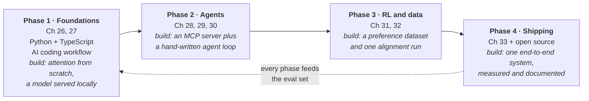

# 34.1 The four-phase learning path

The chapters of Part V were ordered for *explanation* — each one assumed the
last. That is not the order in which you should build things, because the fastest
way to learn this material is to alternate between reading a mechanism and
shipping something that uses it. This section is that alternation, written as
four phases. Each phase has a small number of goals, the chapters that support
them, one thing you build, and a self-check you should be able to pass before
moving on. The self-checks are the important part: they are the difference
between having read Part V and being able to use it.

## How to use this

A phase is a gate, not a calendar block. Take as long as you need, and do not
move on because a number of weeks has elapsed — move on when you can do the
things in the "you are ready when" list without looking anything up. Two
warnings before the plan.

**The most common failure is reading all four phases and building none of them.**
Every phase below has exactly one deliverable, and the deliverable is the point;
the reading exists to make it possible. If you have to choose between finishing
a chapter and finishing a build, finish the build.

**The second most common failure is starting at Phase 3.** Post-training is the
most interesting-sounding part of this field and the least useful place to
begin: it assumes you can already evaluate a model, which assumes you can serve
one, which assumes you know what one is. People who skip ahead end up able to
recite "DPO removes the reward model" and unable to say why their fine-tune made
things worse.



## Phase 1 — Foundations

**Goal:** stop treating the model as a black box, and become the person on the
team who can answer "why is it slow / expensive / truncating".

| What | Where | Why it is first |
| --- | --- | --- |
| Tokenization, attention, the decoder stack, sampling | [Chapter 26](../ch26-llm-internals/index.md) | every later concept reduces to these; they will still be true in ten years |
| KV cache, batching, latency, quantization | [Chapter 27](../ch27-inference/index.md) | turns cost and speed from mysteries into arithmetic |
| Genuinely fluent Python | Parts I–III | the language of the data and training side |
| Working TypeScript | see below | the language of the product surface and much of the tool ecosystem |
| Using AI coding tools well | this section | the largest single multiplier on everything after it |

**Fluency is a specific, testable thing.**

- **In Python** it means reading a traceback without flinching
  ([Chapter 10](../ch10-exceptions/index.md)), generators and iterators,
  `dataclass`, type hints, virtual environments and packaging, `pytest`
  ([24.2](../ch24-practice/02-testing.md)), and enough `asyncio` to know what
  blocks an event loop.
- **In TypeScript** it means interfaces and unions, `Promise` and
  `async`/`await`, npm and the difference between Node and browser runtimes, and
  enough of the type system to read a library's `.d.ts` without giving up.

You do not need to be equally good at both. You do need to be able to *ship* in
both, because the model server is usually Python and the thing users touch
usually is not.

**Serve a model yourself.** Not through a hosted API — locally, where you can
see the memory and the tokens per second. This cannot run in a browser tab, so
it gets a fence with no Run button:

```console
$ # the smallest useful loop: a local model, a prompt, a number
$ ollama run llama3.2 "Explain a KV cache in two sentences."

$ # llama.cpp, if you want to watch the quantization arithmetic bite
$ ./llama-cli -m models/model-Q4_K_M.gguf -p "hello" -n 128

$ # vLLM, when you care about throughput rather than one prompt
$ vllm serve org/small-model --max-model-len 8192
$ curl localhost:8000/v1/completions -d '{"model":"org/small-model",
    "prompt":"hello","max_tokens":32}'
```

Run the same prompt at two quantization levels and record tokens per second and
peak memory. The numbers you get will make
[27.4](../ch27-inference/04-quantization-deploy.md) permanent in a way that
reading it cannot.

### Working with AI coding agents

This deserves its own treatment, because it is now part of the job and because
most people use these tools in the way that helps least — as a faster autocomplete
for code they could have written anyway. The leverage is elsewhere.

**Give the agent a verifiable task.** "Make the code better" produces
plausible-looking churn you then have to review line by line. "Make
`test_parser.py::test_nested_quotes` pass without changing the test" produces a
diff with a pass/fail attached. This is the same insight as verifiable rewards
in [31.4](../ch31-rl/04-reward-models.md): when a checkable criterion exists,
the whole interaction gets better, because the agent can tell whether it is done.

**Let it run the tests.** An agent that can execute the suite iterates against
reality; an agent that can only write text iterates against your patience. Give
it a command it can run, and make that command fast — a slow suite degrades an
agent's usefulness far more than it degrades yours.

**Review the diff, not the explanation.** The summary an agent writes of its own
change is the least reliable artefact in the interaction — it describes what was
intended. Read `git diff` ([24.1](../ch24-practice/01-git-workflow.md)) and hold
it to the standard of [24.3](../ch24-practice/03-style-review.md). Two questions
catch most problems: *did it delete something it did not mention*, and *did it
weaken a test to make it pass*.

**Write a rules file for the repository.** Every serious coding agent reads a
project instruction file — the name varies by tool and will keep changing, so
check what yours looks for. The contents should not: how to run the tests, how
to run the linter, the directory layout, the conventions that are not obvious
from the code, and the things that are off-limits. Ten lines that stop an agent
from reinventing your logging setup pay for themselves in a day. Keep it in
version control and update it when a reviewer has to say the same thing twice.

**Know when not to delegate.** Do not hand off work whose *purpose* is to build
your own model of the system: the first implementation of a data structure you
are learning, a bug you do not yet understand, a security-sensitive boundary, or
a design decision with long consequences. Delegating those buys you working code
and costs you the understanding you needed to maintain it. The rule that holds up:
**delegate work you could do but would rather not; never delegate the work you
cannot yet check.**

**Build this.** Implement single-head attention in numpy from scratch, then run
a quantized model locally and record tokens per second and peak memory at two
quantization levels.

**You are ready to move on when you can …**

- explain what a KV cache stores, and compute its size in gigabytes for a given
  model and context length;
- say exactly what breaks if you remove the causal mask;
- predict the effect of raising temperature or lowering top-p on a specific
  output;
- read a serving log and say whether you are compute-bound or memory-bound.

## Phase 2 — Agents

**Goal:** build systems where the model is a component, not the product.

| What | Where |
| --- | --- |
| Function calling, schemas, structured output, MCP | [Chapter 28](../ch28-tools-mcp/index.md) |
| Embeddings, retrieval, chunking, agent memory | [Chapter 29](../ch29-memory-rag/index.md) |
| The agent loop, planning, reflection, multi-agent, frameworks | [Chapter 30](../ch30-agents/index.md) |

The order inside this phase matters more than usual. Write the loop by hand
first ([30.1](../ch30-agents/01-agent-loop-react.md)) — a `while` loop, a parser,
a tool dispatch table and a step budget — and only then look at a framework
([30.4](../ch30-agents/04-frameworks.md)). Adopting the framework first teaches
you the framework; writing the loop first teaches you agents, after which every
framework is an afternoon.

**Build this.** An MCP server ([28.4](../ch28-tools-mcp/04-building-mcp-server.md))
exposing three tools over a data source you actually care about — your notes, a
public API, a database you own — plus a hand-written agent that uses it to
answer questions a single model call cannot. Then port the loop to a framework
and write down what the port bought and cost.

**You are ready to move on when you can …**

- write a tool schema that a model uses correctly on the first try;
- explain why retrieval quality, not model quality, is usually the bottleneck in
  a RAG system ([29.2](../ch29-memory-rag/02-rag-pipeline.md));
- state three structural defences against prompt injection, and why prompt-level
  ones do not work;
- debug an agent from its trace rather than by re-running it and hoping.

## Phase 3 — RL and data

**Goal:** understand where model behaviour comes from, and treat the dataset as
the artefact you engineer.

| What | Where |
| --- | --- |
| Policy gradients, PPO, DPO, GRPO, reward models | [Chapter 31](../ch31-rl/index.md) |
| Data mixtures, synthesis, filtering, trajectories | [Chapter 32](../ch32-data/index.md) |

Be honest with yourself about this phase: it is the one that needs hardware. The
mathematics is all in Chapter 31 and runs in numpy, but an actual fine-tune needs
a GPU — your own, a rented hour, or a free tier. Keep the model small. A 0.5B
model fine-tuned on 500 preference pairs teaches you the whole pipeline; a 7B
run teaches you the same thing more slowly and more expensively.

**Build this.** Generate a small preference dataset for a task you understand
well, filter it deliberately ([32.1](../ch32-data/01-why-data.md)), run one
alignment method end to end ([31.3](../ch31-rl/03-dpo-grpo.md)), and evaluate
the result against the base model with a held-out set you made *before* training.
The evaluation is not optional — without it you cannot tell an improvement from
a plausible-sounding regression.

**You are ready to move on when you can …**

- explain what DPO removes from PPO, and what that costs;
- look at a reward curve and say why it is not evidence of improvement;
- name the failure mode where both chosen and rejected likelihoods fall;
- describe how you would build a trajectory dataset from your agent's own logs,
  including what you would filter out
  ([32.3](../ch32-data/03-trajectories.md)).

## Phase 4 — Shipping

**Goal:** produce evidence, not claims.

This phase is [Chapter 33](../ch33-eval/index.md) plus the work that turns a
prototype into something a stranger can evaluate: an eval set built from your own
failures, a regression gate in CI, a README with a results table, and at least
one contribution to somebody else's project. [34.2](02-portfolio.md) is entirely
about this phase, so it gets one paragraph here rather than a section.

**Build this.** One end-to-end system, deployed somewhere a stranger can use it,
with a measured before-and-after number attached to at least one change you made
to it.

**You are ready to move on when you can …**

- state a number for your own system with a confidence interval attached;
- defend that measurement when someone asks how the scorer normalizes.

## Keeping the algorithm muscle alive

There is a gap between the work — retrieval, schemas, latency budgets — and the
interview, which will still ask you to find a shortest path on a whiteboard. The
gap is real and it is not a scandal: those questions test whether you can hold a
structure in your head and reason about its cost, which is exactly what
[16.1](../ch16-complexity/01-big-o.md) trained you to do.

The efficient maintenance strategy is spaced repetition on a small set of
structures, not a marathon before an interview. The highest-yield set:

- **[Graphs](../ch37-graphs/index.md)** — traversal, shortest paths,
  topological order.
- **[Balanced trees](../ch35-balanced-trees/index.md)** — rotations and the
  invariant, not the full red-black case analysis.
- **[Hashing and tries](../ch36-hashing-tries/index.md)** — the structures
  behind most "make this faster" follow-ups.
- **[Linear-time sorting](../ch38-linear-sorting/index.md)** — for the "can you
  beat $n \log n$" question.
- **[Regular expressions](../ch41-regex/index.md)** — the one Part VI topic you
  will also use every week at work.

Here is a scheduler for that, small enough to adapt:

```python
"""A spaced-repetition schedule for keeping algorithm skills warm."""

TOPICS = ["BFS / DFS", "Dijkstra", "union-find", "AVL rotations",
          "hash collisions", "tries", "counting sort", "recursion + memo",
          "heaps", "sliding window", "regex parsing", "topological sort"]
INTERVALS = [1, 2, 4, 8]          # weeks between reviews, per box
WEEKS = 12
PER_WEEK = 2                      # you have time for two drills a week

box = {t: 0 for t in TOPICS}
due = {t: i // PER_WEEK + 1 for i, t in enumerate(TOPICS)}   # stagger the start
log = {w: [] for w in range(1, WEEKS + 1)}

for week in range(1, WEEKS + 1):
    ready = sorted((t for t in TOPICS if due[t] == week), key=TOPICS.index)
    for topic in ready[:PER_WEEK]:
        log[week].append(topic)
        box[topic] = min(box[topic] + 1, len(INTERVALS) - 1)
        due[topic] = week + INTERVALS[box[topic]]
    for topic in ready[PER_WEEK:]:                 # overflow slips a week
        due[topic] = week + 1

for week in range(1, WEEKS + 1):
    print(f"week {week:>2}: " + ", ".join(log[week]))

reviews = sum(len(v) for v in log.values())
print(f"\n{reviews} drills over {WEEKS} weeks covering {len(TOPICS)} topics")
print("times each topic came up: "
      f"{sorted((sum(t in log[w] for w in log) for t in TOPICS))}")
```

Read the last line before you copy the schedule. Twenty-four drills across twelve
topics means the first four topics come up three times and the last four come up
**once** — the queue never catches up. That is not a bug in the scheduler, it is
the arithmetic of a two-per-week budget, and it leaves you two honest options:
cut the topic list, or raise the budget. Choosing a shorter list you actually
review beats a complete list you review once.

## A weekly budget that survives a job

Assume six to ten hours a week around other work. The failure mode is not too
few hours, it is hours that all go to reading.

| Activity | Hours | Why |
| --- | --- | --- |
| Building the phase deliverable | 3–5 | the only activity that produces evidence |
| Reading the supporting chapter | 1–2 | just enough to unblock the build |
| One paper, first two passes | 1 | keeps you current without drowning (see below) |
| Algorithm drill | 0.5–1 | two problems, spaced as above |
| Writing down what you learned | 0.5 | a README, a note, an issue comment |

The last row looks optional and is not. Writing is where you discover which
parts you did not understand, and it is the only one of these activities that
also produces something you can show someone.

!!! abstract "In plain words"

    - **What it is.** A way to read research papers cheaply: three passes of
      increasing depth, where the first two are quick enough to quit if the paper
      turns out not to be worth more.
    - **Picture it.** Buying a house. First a drive-by (five minutes: is it even in
      the right neighbourhood?), then a walkthrough (an hour: does the layout
      work?), and only for the one you are serious about, a full inspection —
      *reproducing* the core idea yourself, with the paper closed.
    - **Why it matters.** You cannot read everything, and skimming abstracts
      teaches vocabulary without understanding. Reproducing a result — that third
      pass with a number attached — is the single most instructive exercise here,
      because rebuilding a claim forces you to confront every term you skimmed.

## Reading a paper in three passes

You cannot read everything, and skimming abstracts teaches you vocabulary
without understanding. The three-pass method — popularised in S. Keshav's short
note *How to Read a Paper* — solves this by making the first two passes cheap
enough to abandon.

| Pass | Time | What you read | What you decide |
| --- | --- | --- | --- |
| 1 | 5–10 min | title, abstract, introduction, section headings, figures, conclusion | is this relevant to me at all |
| 2 | ~1 hour | figures and tables carefully, the method section, skipping proofs; note references worth chasing | can you state the contribution, the setup, and the main result in three sentences |
| 3 | 4+ hours | re-derive: reimplement the core idea on a toy scale, with the paper closed | can you say what would break if each design choice were reversed |

Most papers deserve pass 1. A few deserve pass 2. The ones that change how you
work deserve pass 3, and pass 3 is what the runnable blocks in this Part have
been training you to do: a DPO update on eight pairs, an attention head on a
five-token sequence, a bootstrap on fifty tasks.

**Reproducing a result** is pass 3 with a number attached, and it is the single
most instructive exercise available. The method is four steps:

1. pick a paper with released code;
2. pick the *smallest* experiment it reports;
3. reproduce that one number;
4. write down every place your result differed, and why.

Expect differences — data version, tokenizer, decoding settings, evaluation
normalizer ([33.1](../ch33-eval/01-benchmarks.md)) — and expect the write-up of
those differences to be more valuable than the number itself. It is also, as
[34.2](02-portfolio.md) argues, one of the four portfolio pieces that reliably
impresses people who know the field.

!!! warning "Common mistakes"

    - **Reading four phases and building none.** The deliverable is the phase;
      the chapters exist to unblock it.
    - **Starting at Phase 3 because post-training sounds interesting.** Without
      evaluation you cannot tell whether your fine-tune helped, and without
      serving you cannot tell why it is slow.
    - **Fine-tuning a 7B model as your first training run.** Use the smallest
      model that shows the effect. You are debugging a pipeline, not chasing a
      benchmark.
    - **Delegating the work whose purpose was to teach you something.** An agent
      can write your first hash table. Then you have a hash table and not the
      understanding.
    - **Chasing frameworks instead of mechanisms.** The frameworks in this
      field are rewritten on a scale of months; attention, KV caches, and the
      PPO and DPO update rules are not.
    - **A drill list longer than your budget.** Twelve topics at two per week
      means four of them get reviewed once in three months.

## Check your understanding

1. Why does this path put inference and serving (Chapter 27) before agents and
   RAG, when most job postings talk about agents?

    ??? success "Answer"

        Because the failures you will actually be paid to fix in an agent or
        RAG system are usually cost, latency and context limits, and all three
        are Chapter 27 arithmetic. An engineer who cannot compute a KV-cache
        footprint or explain why time-to-first-token is dominated by prefill
        will build an agent that works in a demo and is unaffordable in
        production. Agents are also more fun to build once you can tell why the
        loop is slow, which keeps Phase 2 from becoming a debugging swamp.

2. You are given a week to add a feature to an unfamiliar codebase, and a coding
   agent. What do you delegate and what do you keep?

    ??? success "Answer"

        Delegate work that is verifiable and mechanical: making a named failing
        test pass, adding tests to an untested module, mechanical refactors, a
        first draft of documentation, and searching the codebase for every call
        site of a function. Keep the parts whose purpose is understanding —
        reading the code path that the feature touches, deciding the design, and
        anything at a security or data boundary. Review every diff rather than
        the agent's description of it, and check specifically for deleted code
        it did not mention and tests it weakened.

3. A colleague says they have "finished" Phase 2 because they read Chapters
   28–30. How would you check?

    ??? success "Answer"

        Ask for the artefacts and one explanation. The artefacts: an MCP server
        with three working tools and a hand-written agent loop that uses them.
        The explanation: why prompt-level defences against prompt injection do
        not work, and what three structural defences replace them. Reading
        produces recognition; the self-check list is written as "can you do X"
        precisely because recognition and ability diverge sharply in this
        material.

4. Why is pass 3 of the paper-reading method — reimplementing at toy scale —
   worth four hours when the paper's own code is on the internet?

    ??? success "Answer"

        Because running someone's code tells you it runs, and reimplementing
        tells you which parts matter. The whole of Part V is built on this: a
        DPO update on eight preference pairs is a correct DPO update, and
        writing it forces you to confront every term you skimmed. Pass 3 also
        produces the ability the third self-check asks for — saying what would
        break if a design choice were reversed — which is the question that
        separates people who can extend a method from people who can only apply
        it.
