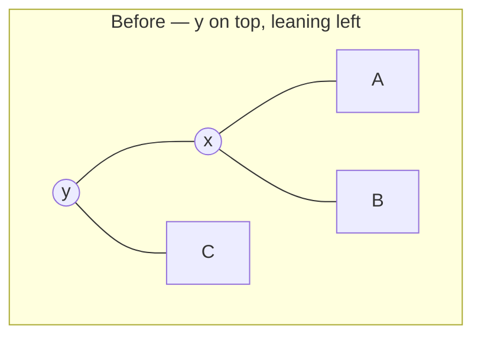
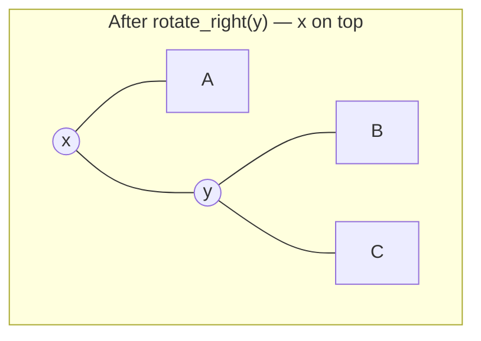
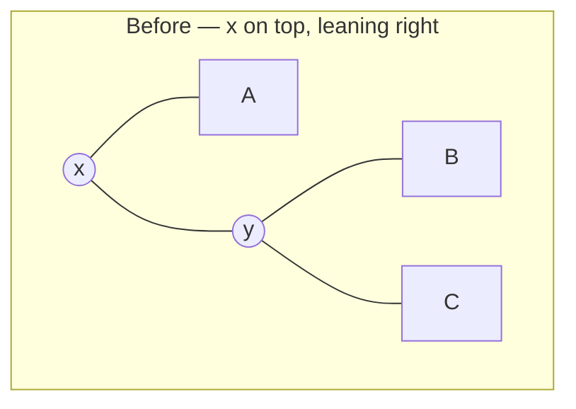
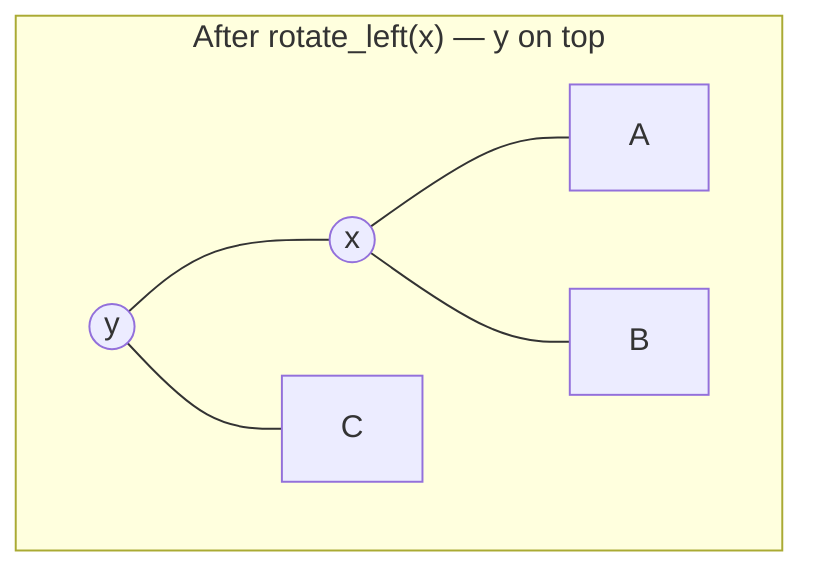
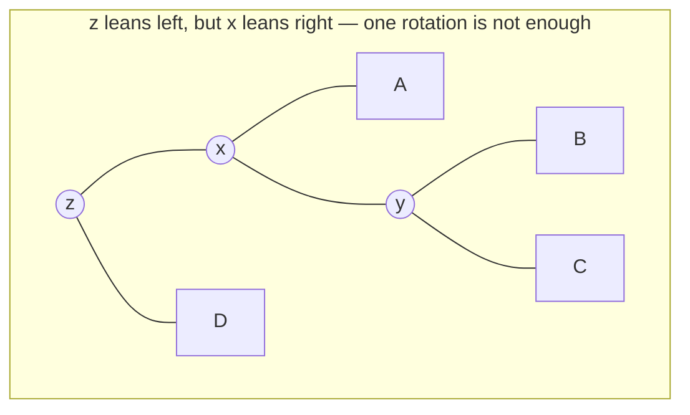
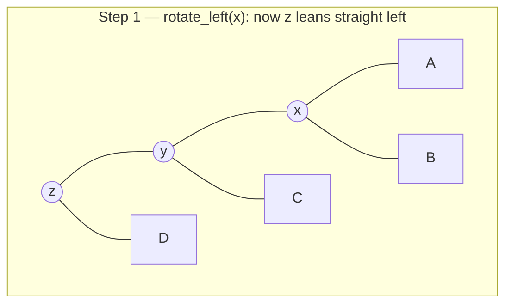
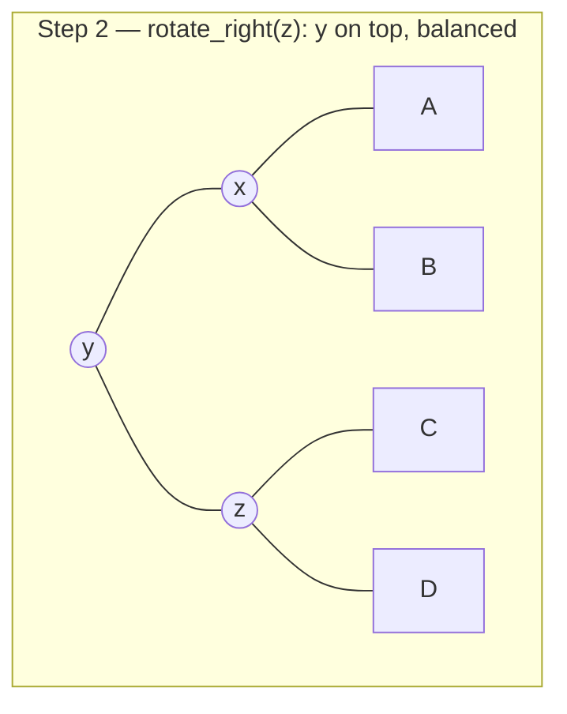

# 35.1 Rotations

[Section 20.3](../ch20-bst/03-traversals-balance.md) ended with a diagnosis
and no cure: feed a binary search tree its keys in sorted order and it
quietly becomes a linked list of height $n-1$, taking every $O(\log n)$
promise down with it. This section provides the cure's essential
ingredient — the **rotation**, a three-pointer re-wiring that changes a
tree's *shape* while leaving its *contents in the same order*. Rotations
are the only structural move AVL trees, red-black trees, and splay trees
ever make. Learn this one operation properly and the next two sections
become bookkeeping.

Throughout Part VI we keep Chapter 20's measure of **height**: the number
of *edges* on the longest root-to-leaf path. A single node has height 0,
the empty tree has height $-1$, and a chain of $n$ nodes has height $n-1$.

## The wound, measured

First, reopen the injury with numbers rather than adjectives. Build the
same 63 keys twice — once in sorted order, once shuffled — and count how
many nodes a search has to touch:

```python
import random

class Node:
    def __init__(self, key):
        self.key = key
        self.left = None
        self.right = None

def insert(root, key):
    """Plain BST insert (iterative, so a 63-deep chain is no problem)."""
    if root is None:
        return Node(key)
    node = root
    while True:
        if key < node.key:
            if node.left is None:
                node.left = Node(key)
                return root
            node = node.left
        elif key > node.key:
            if node.right is None:
                node.right = Node(key)
                return root
            node = node.right
        else:
            return root                      # duplicate: ignore

def height(node):
    """Edges on the longest root-to-leaf path; empty tree is -1."""
    if node is None:
        return -1
    h, level = -1, [node]
    while level:
        h += 1
        level = [kid for n in level for kid in (n.left, n.right) if kid]
    return h

def probe(root, key):
    """How many nodes a search for `key` has to look at."""
    steps, node = 0, root
    while node is not None:
        steps += 1
        if key == node.key:
            return steps
        node = node.left if key < node.key else node.right
    return steps

n = 63
keys = list(range(1, n + 1))

sorted_root = None
for k in keys:
    sorted_root = insert(sorted_root, k)

random.seed(35)
shuffled = keys[:]
random.shuffle(shuffled)
random_root = None
for k in shuffled:
    random_root = insert(random_root, k)

for name, root in [("sorted inserts", sorted_root),
                   ("shuffled inserts", random_root)]:
    avg = sum(probe(root, k) for k in keys) / n
    worst = max(probe(root, k) for k in keys)
    print(f"{name:>17} | height {height(root):>2} "
          f"| avg probes {avg:5.1f} | worst {worst:>2}")
```

```text
   sorted inserts | height 62 | avg probes  32.0 | worst 63
 shuffled inserts | height 10 | avg probes   6.4 | worst 11
```

Sorted input produces height 62 — exactly $n-1$ — and an average search
that touches 32 of the 63 keys. That is a linear scan with extra steps:
the shuffled tree answers the same questions in about a fifth of the work,
and $\log_2 64 = 6$ says a *perfectly* shaped tree would need at most 6.
The data is fine. The shape is the bug.

## Many trees hold the same sorted data

Here is the observation that makes a fix possible. The BST invariant
constrains *relative* placement — everything in a node's left subtree is
smaller, everything on the right is larger — but it says nothing about
which key must sit at the root. Every arrangement that respects the
invariant is a legal BST over the same keys, and every one of them has the
*same in-order traversal*:

```python
# continues
def build(order):
    root = None
    for k in order:
        root = insert(root, k)
    return root

def inorder(node, out=None):
    if out is None:
        out = []
    if node is not None:
        inorder(node.left, out)
        out.append(node.key)
        inorder(node.right, out)
    return out

for order in ([4, 2, 6, 1, 3, 5, 7],
              [1, 2, 3, 4, 5, 6, 7],
              [7, 6, 5, 4, 3, 2, 1],
              [2, 1, 4, 3, 6, 5, 7]):
    tree = build(order)
    print(f"insert {str(order):<24} height {height(tree)}  "
          f"in-order {inorder(tree)}")

import math
print("distinct BST shapes on 7 keys:", math.comb(14, 7) // 8)
```

```text
insert [4, 2, 6, 1, 3, 5, 7]    height 2  in-order [1, 2, 3, 4, 5, 6, 7]
insert [1, 2, 3, 4, 5, 6, 7]    height 6  in-order [1, 2, 3, 4, 5, 6, 7]
insert [7, 6, 5, 4, 3, 2, 1]    height 6  in-order [1, 2, 3, 4, 5, 6, 7]
insert [2, 1, 4, 3, 6, 5, 7]    height 3  in-order [1, 2, 3, 4, 5, 6, 7]
distinct BST shapes on 7 keys: 429
```

Four different heights, one identical in-order sequence. There are 429 legal
shapes for these seven keys (the Catalan number $C_7$), and only the first is
optimal.

So the repair job is not "fix the data" but "move from a bad shape to a good
one". We may do that *at any time*, because a reader of the tree cannot tell
which shape we chose. The only requirement is that each reshaping step keeps
the invariant intact.

!!! note "The proof obligation for this page"

    Every rotation we write must leave the in-order traversal **exactly**
    unchanged. In-order order *is* the tree's meaning; a reshaping that
    reorders keys is not a rotation, it is a bug. We will check this with
    code, not with confidence.

## The right rotation

Take a subtree whose root is `y` and whose left child is `x`. Name the
three subtrees hanging off them $A$, $B$, $C$:



Read off the ordering constraints: $A < x < B < y < C$. Now write those
same constraints with `x` on top instead:



Left-to-right the leaves still read $A$, $x$, $B$, $y$, $C$. Nothing moved
in the *sequence*; the tree simply grabbed `x` and pulled it up. The left
side lost a level and the right side gained one.

Three pointers change. Written as steps you can follow with a finger:

1. **Remember the new root.** `x = y.left`. (If `y.left` is `None`, a right
   rotation is undefined — there is nothing to pull up.)
2. **Re-home the middle subtree.** $B$ (`x.right`) sits between `x` and `y`
   in sorted order, so it must end up between them in the tree: it becomes
   `y`'s *left* child. `y.left = x.right`.
3. **Lower `y`.** `x.right = y`.
4. **Tell the parent.** `x` is now the subtree's root, so whoever pointed
   at `y` must point at `x` instead. Our functions return the new root and
   make the caller re-link — the same "return the new root" style used for
   BST insert in Chapter 20.

That is the whole operation, and here it is:

```python
# continues
def rotate_right(y):
    """Pull y's left child up. Returns the subtree's new root."""
    x = y.left                       # 1. the node that rises
    y.left = x.right                 # 2. B moves across
    x.right = y                      # 3. y drops
    return x                         # 4. caller re-links

def show(node, indent=""):
    """Print the tree sideways: right subtree above, left subtree below."""
    if node is None:
        return
    show(node.right, indent + "    ")
    print(indent + str(node.key))
    show(node.left, indent + "    ")

tree = build([30, 20, 40, 10, 25])
print("BEFORE  height", height(tree), " in-order", inorder(tree))
show(tree)

tree = rotate_right(tree)
print("AFTER   height", height(tree), " in-order", inorder(tree))
show(tree)
```

```text
BEFORE  height 2  in-order [10, 20, 25, 30, 40]
    40
30
        25
    20
        10
AFTER   height 2  in-order [10, 20, 25, 30, 40]
        40
    30
        25
20
    10
```

Sideways printing puts the root at the left margin, so you can watch 20
move outwards and 30 move inwards. Both traversals read
`10, 20, 25, 30, 40`: key 25 changed parents (from 20 to 30) and still
landed in exactly the same slot, because "between 20 and 30" is the only
place the invariant allows it to be.

## The left rotation, and a checker that keeps us honest

The left rotation is the same picture in a mirror: it pulls a node's
*right* child up, shortening the right side.





The constraint chain reads $A < x < B < y < C$ in both pictures. Subtree $B$
is again the one that changes parents — this time from `y.left` to
`x.right`, the only slot that still means "bigger than `x`, smaller
than `y`".

`rotate_left` and `rotate_right` undo each other: rotating left at `x` then
right at the resulting root gives back the original tree.

Now write both, plus the two checkers that make this page's claim testable —
an in-order comparison and a full BST-invariant validator. Then run them over
hundreds of random trees and random rotation sites:

```python
# continues
def rotate_left(x):
    """Pull x's right child up. Returns the subtree's new root."""
    y = x.right
    x.right = y.left
    y.left = x
    return y

def is_bst(node, lo=None, hi=None):
    """Every key strictly inside the (lo, hi) window its ancestors allow."""
    if node is None:
        return True
    if lo is not None and node.key <= lo:
        return False
    if hi is not None and node.key >= hi:
        return False
    return (is_bst(node.left, lo, node.key)
            and is_bst(node.right, node.key, hi))

def positions(root):
    """Every (parent, side, node) triple in the tree; parent None at root."""
    out, stack = [], [(None, None, root)]
    while stack:
        parent, side, node = stack.pop()
        if node is None:
            continue
        out.append((parent, side, node))
        stack.append((node, "left", node.left))
        stack.append((node, "right", node.right))
    return out

def rotate_somewhere(root, rng):
    """Rotate at one randomly chosen legal spot; return the (new) root."""
    choices = [(p, s, nd) for (p, s, nd) in positions(root)
               if nd.left is not None or nd.right is not None]
    parent, side, node = rng.choice(choices)
    if node.left is not None and (node.right is None or rng.random() < 0.5):
        new_sub = rotate_right(node)
    else:
        new_sub = rotate_left(node)
    if parent is None:
        return new_sub
    setattr(parent, side, new_sub)
    return root

rng = random.Random(2718)
order_kept = shape_changed = 0
for _ in range(400):
    tree = build(rng.sample(range(200), rng.randint(4, 14)))
    before, before_h = inorder(tree), height(tree)
    tree = rotate_somewhere(tree, rng)
    if inorder(tree) == before and is_bst(tree):
        order_kept += 1
    if height(tree) != before_h:
        shape_changed += 1

print("trials:", 400)
print("in-order preserved and still a valid BST:", order_kept)
print("trials where the height actually changed:", shape_changed)
```

```text
trials: 400
in-order preserved and still a valid BST: 400
trials where the height actually changed: 141
```

Four hundred random trees, four hundred random rotations, four hundred
unchanged traversals. Meanwhile 141 of those rotations moved the height —
proof that the operation really does reshape, and not merely shuffle
pointers around to no effect.

!!! note "The rotation invariant"

    A rotation changes the tree's **shape** and leaves its **in-order
    traversal** exactly as it was.

That is the licence the rest of this chapter spends.

## Double rotations

A single rotation cures a subtree that leans *straight* — left-left or
right-right. It cannot cure a **zig-zag**. Consider a node `z` whose left
child `x` leans to the *right*:



Rotating right at `z` here just hands the zig-zag to the other side: `x`
rises with its heavy right subtree still attached, and the tree tilts the
opposite way. The fix is a **double rotation** — two single rotations
whose job is to bring the *middle* key `y` to the top:





The **left-right rotation** is therefore just a composition:
`rotate_left` the left child, then `rotate_right` the node. The
**right-left rotation** mirrors it. Both are two `O(1)` steps, so both are
$O(1)$:

```python
# continues
def rotate_left_right(z):
    """Zig-zag fix for a left child that leans right."""
    z.left = rotate_left(z.left)     # step 1: straighten the child
    return rotate_right(z)           # step 2: lift the middle key

def rotate_right_left(z):
    """Mirror image: a right child that leans left."""
    z.right = rotate_right(z.right)
    return rotate_left(z)

zig = build([30, 10, 20])            # 30 leans left, 10 leans right
print("zig-zag  height", height(zig), inorder(zig), "root", zig.key)
fixed = rotate_left_right(zig)
print("after LR height", height(fixed), inorder(fixed), "root", fixed.key)

zag = build([10, 30, 20])            # mirror: 10 leans right, 30 leans left
print("zag-zig  height", height(zag), inorder(zag), "root", zag.key)
fixed = rotate_right_left(zag)
print("after RL height", height(fixed), inorder(fixed), "root", fixed.key)
```

```text
zig-zag  height 2 [10, 20, 30] root 30
after LR height 1 [10, 20, 30] root 20
zag-zig  height 2 [10, 20, 30] root 10
after RL height 1 [10, 20, 30] root 20
```

Both zig-zags collapse from height 2 to height 1, and both end with 20 —
the *median* of the three keys — at the top. That is the pattern worth
memorising: **a double rotation promotes the middle key of the zig-zag.**

## Playground: watch a chain become a tree

Rotations compose. Nothing stops us from applying a whole sequence and
watching the height fall while the in-order sequence sits perfectly still.
Start from the worst case — the keys 1 through 7 inserted in sorted order,
a chain of height 6 — and apply four left rotations at named positions:

```python
# continues
def rotate_at(root, path, direction):
    """Rotate at the node reached by `path` (e.g. ["right", "right"])."""
    if not path:
        return rotate_left(root) if direction == "left" else rotate_right(root)
    parent = root
    for step in path[:-1]:
        parent = getattr(parent, step)
    child = getattr(parent, path[-1])
    turned = rotate_left(child) if direction == "left" else rotate_right(child)
    setattr(parent, path[-1], turned)
    return root

root = build([1, 2, 3, 4, 5, 6, 7])          # the degenerate chain
plan = [([], "left"),
        (["right"], "left"),
        (["right", "right"], "left"),
        ([], "left")]

print(f"{'step':<34}{'height':>7}   in-order")
print(f"{'start (sorted inserts 1..7)':<34}{height(root):>7}   {inorder(root)}")
for path, direction in plan:
    root = rotate_at(root, path, direction)
    where = "root" + "".join("." + s for s in path)
    print(f"{'rotate ' + direction + ' at ' + where:<34}"
          f"{height(root):>7}   {inorder(root)}")
show(root)
```

```text
step                               height   in-order
start (sorted inserts 1..7)             6   [1, 2, 3, 4, 5, 6, 7]
rotate left at root                     5   [1, 2, 3, 4, 5, 6, 7]
rotate left at root.right               4   [1, 2, 3, 4, 5, 6, 7]
rotate left at root.right.right         3   [1, 2, 3, 4, 5, 6, 7]
rotate left at root                     2   [1, 2, 3, 4, 5, 6, 7]
        7
    6
        5
4
        3
    2
        1
```

Height 6, 5, 4, 3, 2 — and the in-order column never twitches. The last
picture is a *perfect* tree of seven keys, the same one that
`build([4, 2, 6, 1, 3, 5, 7])` produced at the top of this page. We
started with the pathological chain and, using nothing but legal moves,
arrived at the optimal shape. Four rotations, worst case cured.

Change the plan and re-run it: rotate the wrong way and the height goes
*up* (that is legal too — rotations are neutral tools). What no plan can
do is change the in-order column.

## Why a rotation costs $O(1)$

Look again at `rotate_right`: three assignments, one return. No loop, no
recursion, no traversal of $A$, $B$, or $C$ — those subtrees are moved by
*re-pointing a single reference*, however many million nodes they contain.
The cost is a constant number of pointer writes regardless of tree size:

```python
# continues
import time

def chain(n):
    """A right-leaning chain of n nodes, built directly in O(n)."""
    root = Node(0)
    node = root
    for k in range(1, n):
        node.right = Node(k)
        node = node.right
    return root

per_rotation = {}
for size in (1_000, 100_000):
    tree = chain(size)
    reps = 20_000
    start = time.perf_counter()
    for _ in range(reps):
        tree = rotate_left(tree)     # rotate one way ...
        tree = rotate_right(tree)    # ... and straight back
    elapsed = time.perf_counter() - start
    per_rotation[size] = elapsed / (2 * reps)
    print(f"chain of {size:>7} nodes: "
          f"{per_rotation[size] * 1e6:.3f} microseconds per rotation")

ratio = per_rotation[100_000] / per_rotation[1_000]
print(f"100x more nodes costs {ratio:.1f}x per rotation  -> O(1) confirmed")
```

```text
chain of    1000 nodes: 0.049 microseconds per rotation
chain of  100000 nodes: 0.050 microseconds per rotation
100x more nodes costs 1.0x per rotation  -> O(1) confirmed
```

A hundred times more data, the same cost per rotation. The absolute
microsecond figure depends on the machine and will differ for you; the
*ratio* is the result, and it stays at about 1.0 because the number of
pointer writes never changed.

This is what makes self-balancing affordable. An insert already walks a
root-to-leaf path, which is $O(h)$ work. If repairing the balance costs a
handful of $O(1)$ rotations on the way back up that same path, the repair is
*free* in Big-O terms: $O(h)$ to descend, plus $O(h)$ of bookkeeping, plus
$O(1)$ rotations, is still $O(h)$.

And the whole point of the repair is that it keeps $h$ at $O(\log n)$. Cheap
local fixes, global guarantee. [Section 35.2](02-avl.md) turns that sentence
into a working tree.

!!! warning "Common mistakes"

    - **Forgetting to re-link the parent.** `rotate_right(y)` returns the
      new subtree root; if the caller ignores the return value, the parent
      still points at `y` and the rotated part of the tree vanishes.
      Always write `parent.left = rotate_right(parent.left)`.
    - **Dropping the middle subtree.** Doing `x.right = y` *before*
      `y.left = x.right` overwrites `x.right`, so subtree $B$ is lost and
      $y$ becomes its own child — usually an infinite loop on the next
      traversal. The order of the three assignments matters.
    - **Rotating in the missing direction.** `rotate_right(y)` requires
      `y.left is not None`; on a node with no left child it raises
      `AttributeError` on `x.right`. Check before you turn.
    - **Expecting one rotation to fix a zig-zag.** A left child that leans
      right needs the double rotation; a single right rotation just tips
      the imbalance to the other side.
    - **Believing a rotation can sort things.** It cannot change the
      in-order sequence at all — that is a feature. If your rotation
      changes the traversal, you have written the assignments wrongly.

## Check your understanding

1. In `rotate_right(y)` with `x = y.left`, which subtree changes parents,
   and why is there exactly one legal place for it to go?

    ??? success "Answer"
        Subtree $B = $ `x.right` — the keys strictly between `x` and `y`.
        After the rotation `x` is above `y`, so the only slot whose window
        is "greater than `x`, less than `y`" is `y.left`. That is why step
        2 is `y.left = x.right`.

2. A subtree is `z` with left child `x`, and `x` has a right child `y`
   (a zig-zag). Which rotation sequence balances it, and which key ends up
   at the top?

    ??? success "Answer"
        Left-right: `rotate_left(x)` first, then `rotate_right(z)`. The
        middle key `y` ends up on top, with `x` and `z` as its children.

3. Predict before running: you take the tree `build([1, 2, 3, 4, 5, 6, 7])`
   and apply `rotate_right` at the root. What happens?

    ??? success "Answer"
        It fails — the root `1` has no left child, so `x` is `None` and
        `x.right` raises `AttributeError`. In that chain every node leans
        right, so only *left* rotations are available.

4. A rotation is $O(1)$, but an insert into a balanced tree is
   $O(\log n)$. Why does adding rebalancing not make insertion slower in
   Big-O terms?

    ??? success "Answer"
        The insert already walks one root-to-leaf path, $O(h) = O(\log n)$
        steps. Rebalancing adds at most a constant amount of work per node
        on that same path, so the total stays $O(\log n)$ — and in exchange
        $h$ is *guaranteed* to remain $O(\log n)$ instead of degrading
        to $n-1$.
