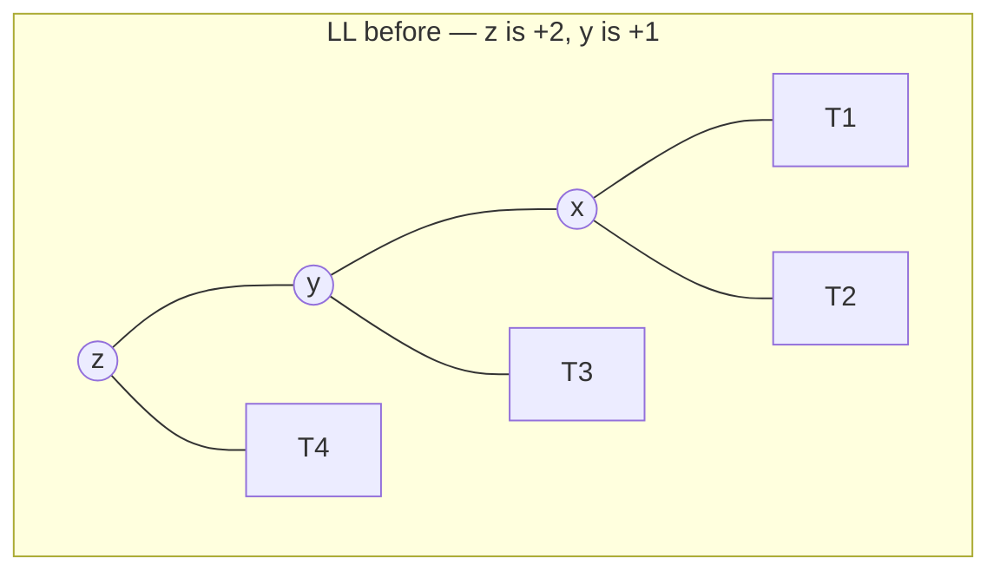
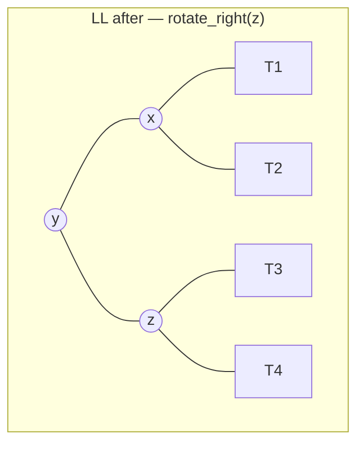
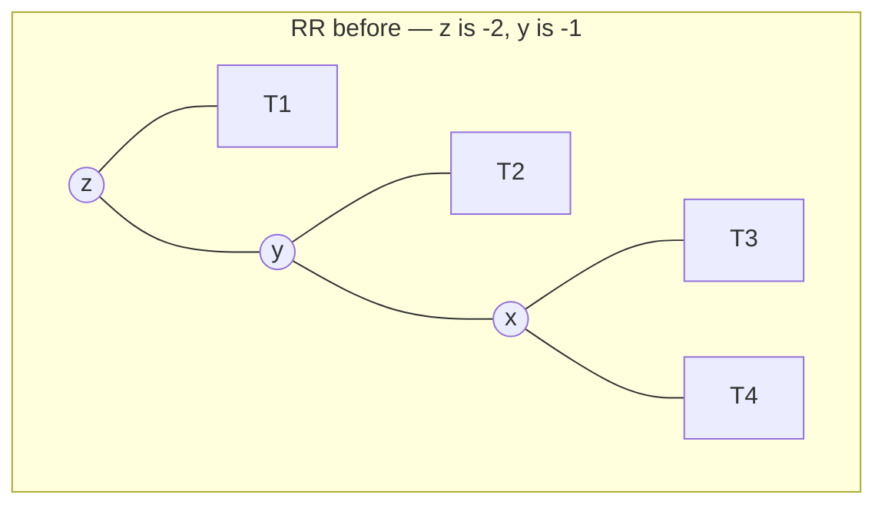
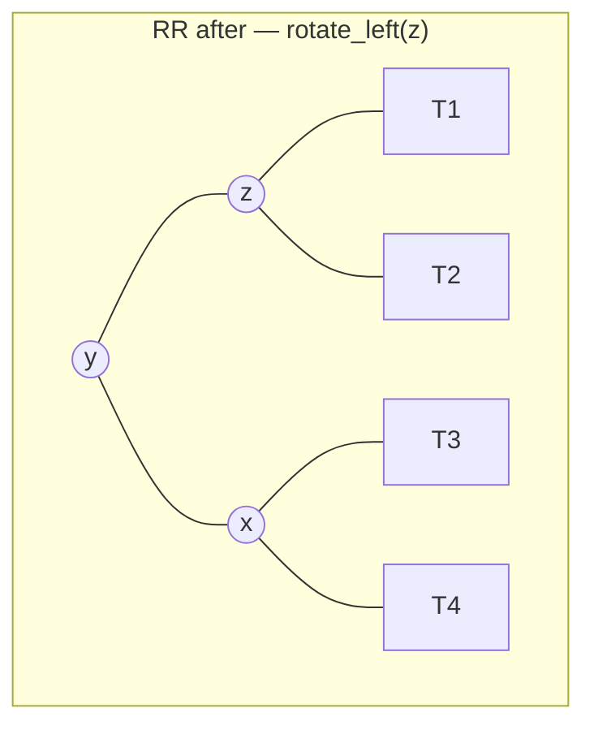
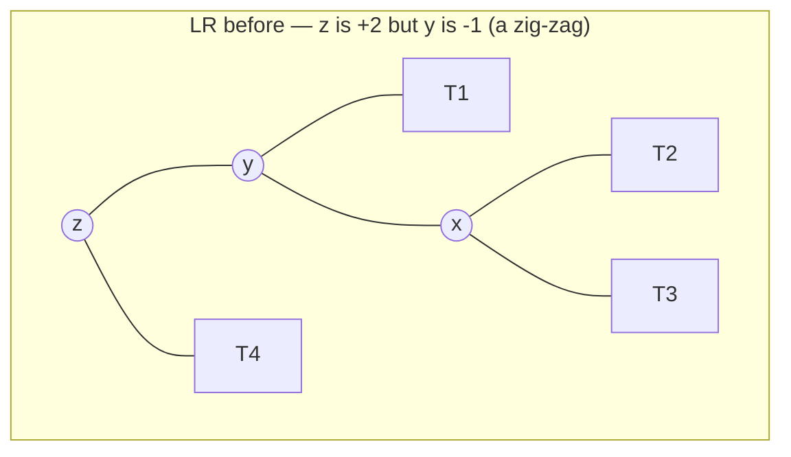
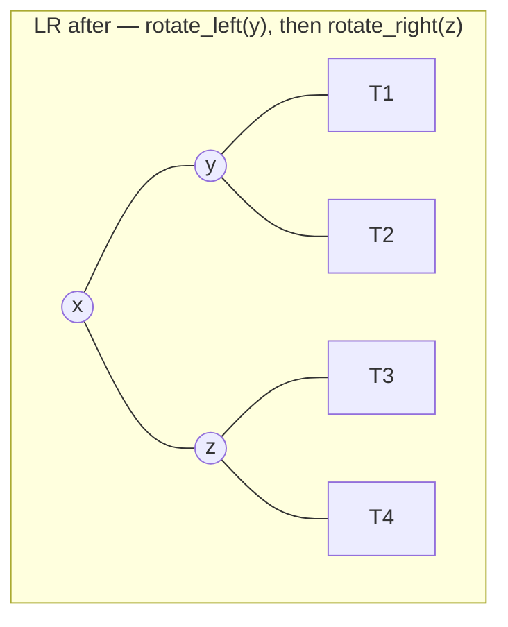
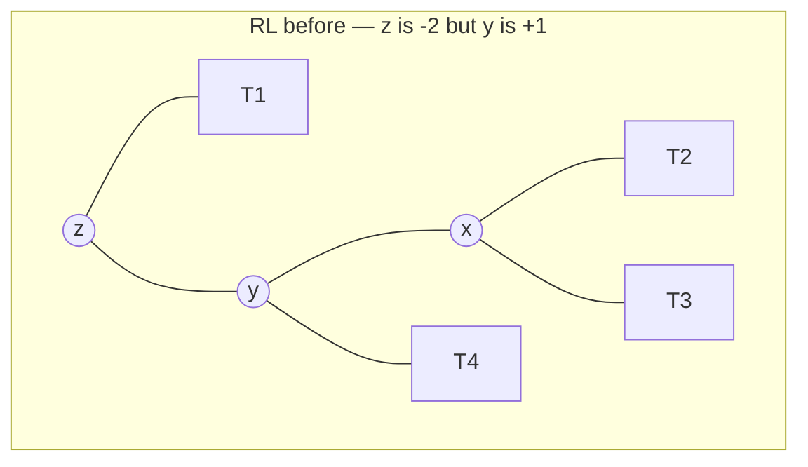

# 35.2 AVL trees

[Section 35.1](01-rotations.md) gave us a legal move that reshapes a tree
without disturbing its meaning. What it did not give us is a *policy*: when
should we rotate, and where? An AVL tree answers with the strictest
sensible rule anyone has found — **no node's two subtrees may differ in
height by more than one** — and then repairs any violation immediately, on
the way back up from every insert and delete. It is the oldest
self-balancing tree (Adelson-Velsky and Landis, 1962) and still the one to
reach for when lookups vastly outnumber updates.

## The invariant, stated precisely

Write $h(v)$ for the height of the subtree rooted at $v$, counted in edges,
with $h(\text{empty}) = -1$ as in [Chapter 20](../ch20-bst/01-tree-vocab.md).
A binary search tree is an **AVL tree** when, for *every* node $v$:

$$ \bigl| h(v.\mathit{left}) - h(v.\mathit{right}) \bigr| \le 1 $$

The quantity $h(v.\mathit{left}) - h(v.\mathit{right})$ is $v$'s **balance
factor**, so the rule reads: every balance factor is $-1$, $0$, or $+1$.
Note the two words that do the work — *every node*, not just the root. A
tree can be perfectly balanced at the root and still fail deep inside.

Here is the invariant as an executable predicate. It computes real heights
bottom-up and stops at the first offender, naming it:

```python
class AVLNode:
    def __init__(self, key, left=None, right=None):
        self.key = key
        self.left = left
        self.right = right
        self.height = 0            # cached; maintained in the next section

def is_avl(root):
    """Check |h(left) - h(right)| <= 1 at EVERY node. Returns (ok, message)."""
    report = []

    def check(node):
        if node is None:
            return -1                       # height of the empty tree
        lh = check(node.left)
        rh = check(node.right)
        if not report and abs(lh - rh) > 1:
            report.append(f"node {node.key}: left height {lh}, "
                          f"right height {rh}, balance factor {lh - rh}")
        return 1 + max(lh, rh)

    check(root)
    return (not report), (report[0] if report else "AVL invariant holds")

#      4                    4
#    /   \                /   \
#   2     6      vs      2     6      -- but 6 has a long right leg
#  / \   / \            / \      \
# 1   3 5   7          1   3      7
#                                  \
#                                   8
good = AVLNode(4, AVLNode(2, AVLNode(1), AVLNode(3)),
                  AVLNode(6, AVLNode(5), AVLNode(7)))
bad = AVLNode(4, AVLNode(2, AVLNode(1), AVLNode(3)),
                 AVLNode(6, None, AVLNode(7, None, AVLNode(8))))

print("balanced tree :", is_avl(good))
print("lopsided tree :", is_avl(bad))
```

```text
balanced tree : (True, 'AVL invariant holds')
lopsided tree : (False, 'node 6: left height -1, right height 1, balance factor -2')
```

The checker points straight at node 6: an empty left side ($h = -1$) against
a right side of height 1 is a gap of 2. Node 4 above it is *not* the
problem — its own subtrees are heights 1 and 2, which is legal. Imbalance is
always reported at the lowest node where it appears.

## Storing the height instead of recomputing it

`is_avl` above walks the whole tree, so it is $O(n)$ — fine for a checker,
ruinous inside an insert. The standard trick is to **cache** each node's
height in the node itself, and repair the cache on the way back up the
insertion path. A node's height depends only on its children's heights:

$$ h(v) = 1 + \max\bigl(h(v.\mathit{left}),\ h(v.\mathit{right})\bigr) $$

so refreshing one node is $O(1)$, and refreshing every node on a
root-to-leaf path is $O(h)$ — work the insert was already doing.

```python
# continues
def h(node):
    """Cached height. The empty tree is -1."""
    return -1 if node is None else node.height

def update_height(node):
    node.height = 1 + max(h(node.left), h(node.right))

def balance_factor(node):
    return 0 if node is None else h(node.left) - h(node.right)

def refresh_all(node):
    """One post-order pass to initialise the caches on a hand-built tree."""
    if node is None:
        return
    refresh_all(node.left)
    refresh_all(node.right)
    update_height(node)

for name, tree in (("good", good), ("bad", bad)):
    refresh_all(tree)
    print(f"{name}: root height {h(tree)}, balance factors "
          + ", ".join(f"{n.key}:{balance_factor(n):+d}"
                      for n in (tree, tree.left, tree.right)))
```

```text
good: root height 2, balance factors 4:+0, 2:+0, 6:+0
bad: root height 3, balance factors 4:-1, 2:+0, 6:-2
```

A positive balance factor means "left-heavy", negative means "right-heavy",
and the AVL rule is simply: **no factor outside $[-1, +1]$**. Node 6's $-2$
is the alarm bell that the next section teaches us to silence.

## The four cases

After an insert, exactly one thing can have gone wrong at a node $z$ on the
path back up: its balance factor reached $+2$ or $-2$. Which rotation fixes
it depends on *which way the heavy child leans*. Four combinations, four
prescriptions — and the names describe the shape of the path from $z$ down
to the newcomer.

### Case LL — left child, left grandchild





The left side was two levels too tall; one right rotation moves `y` up,
hands $T_3$ to `z`, and the two sides now differ by zero.

### Case RR — right child, right grandchild





### Case LR — left child, right grandchild





The middle key `x` — the *grandchild* — is the one that rises, exactly as
in [35.1](01-rotations.md)'s double rotation.

### Case RL — right child, left grandchild




Follow this table with a finger and you can rebalance any node by hand:

| Case | `balance_factor(z)` | `balance_factor(z.heavy child)` | Do this |
|---|---|---|---|
| LL | $> +1$ | $\ge 0$ (left-heavy or level) | `rotate_right(z)` |
| LR | $> +1$ | $< 0$ (right-heavy) | `rotate_left(z.left)`, then `rotate_right(z)` |
| RR | $< -1$ | $\le 0$ (right-heavy or level) | `rotate_left(z)` |
| RL | $< -1$ | $> 0$ (left-heavy) | `rotate_right(z.right)`, then `rotate_left(z)` |

The "or level" entries never occur after an *insert* (the heavy child is
always strictly heavier one way), but they do occur after a *delete* — which
is why the table uses $\ge$ and $\le$ rather than $>$ and $<$.

## A complete AVL tree

Everything above assembles into one class. The rotations are 35.1's three
pointer moves plus two `update_height` calls; `_rebalance` is the decision
table; `insert` is Chapter 20's recursive insert with `return
self._rebalance(node)` in place of `return node`.

```python
import random

class AVLNode:
    __slots__ = ("key", "left", "right", "height")
    def __init__(self, key):
        self.key = key
        self.left = self.right = None
        self.height = 0

def h(node):
    return -1 if node is None else node.height

class AVLTree:
    def __init__(self):
        self.root = None
        self.rotations = 0

    # ---- the two primitives, now maintaining cached heights
    def _rotate_right(self, y):
        x = y.left
        y.left = x.right
        x.right = y
        y.height = 1 + max(h(y.left), h(y.right))   # y first: it is now lower
        x.height = 1 + max(h(x.left), h(x.right))
        self.rotations += 1
        return x

    def _rotate_left(self, x):
        y = x.right
        x.right = y.left
        y.left = x
        x.height = 1 + max(h(x.left), h(x.right))
        y.height = 1 + max(h(y.left), h(y.right))
        self.rotations += 1
        return y

    def _bf(self, node):
        return 0 if node is None else h(node.left) - h(node.right)

    def _rebalance(self, node):
        node.height = 1 + max(h(node.left), h(node.right))
        bf = self._bf(node)
        if bf > 1:                                   # left-heavy
            if self._bf(node.left) < 0:              # LR
                node.left = self._rotate_left(node.left)
            return self._rotate_right(node)          # LL (or finish LR)
        if bf < -1:                                  # right-heavy
            if self._bf(node.right) > 0:             # RL
                node.right = self._rotate_right(node.right)
            return self._rotate_left(node)           # RR (or finish RL)
        return node

    # ---- public operations
    def insert(self, key):
        self.root = self._insert(self.root, key)

    def _insert(self, node, key):
        if node is None:
            return AVLNode(key)
        if key < node.key:
            node.left = self._insert(node.left, key)
        elif key > node.key:
            node.right = self._insert(node.right, key)
        else:
            return node                              # duplicate: ignore
        return self._rebalance(node)

    def height(self):
        return h(self.root)

    def in_order(self):
        out, stack, node = [], [], self.root
        while stack or node:
            while node:
                stack.append(node)
                node = node.left
            node = stack.pop()
            out.append(node.key)
            node = node.right
        return out

def plain_bst_height(keys):
    """Chapter 20's unbalanced insert, measured iteratively."""
    root = None
    for k in keys:
        if root is None:
            root = AVLNode(k)
            continue
        node = root
        while True:
            if k < node.key:
                if node.left is None:
                    node.left = AVLNode(k); break
                node = node.left
            else:
                if node.right is None:
                    node.right = AVLNode(k); break
                node = node.right
    height, level = -1, [root]
    while level:
        height += 1
        level = [c for n in level for c in (n.left, n.right) if c]
    return height

keys = list(range(1, 32))          # 1, 2, 3, ..., 31 -- the worst case
tree = AVLTree()
for k in keys:
    tree.insert(k)

print(f"{'structure':<22}{'height':>8}{'search steps':>14}")
print(f"{'plain BST (Ch 20)':<22}{plain_bst_height(keys):>8}{plain_bst_height(keys) + 1:>14}")
print(f"{'AVL tree':<22}{tree.height():>8}{tree.height() + 1:>14}")
print("rotations performed:", tree.rotations)
print("still sorted:", tree.in_order() == keys)
```

```text
structure               height  search steps
plain BST (Ch 20)           30            31
AVL tree                     4             5
rotations performed: 26
still sorted: True
```

Thirty-one keys
arriving in the single worst possible order, and the AVL tree is a
*perfect* tree of height 4 — the theoretical minimum, since
$\log_2 32 = 5$ levels. The plain BST is a 31-node chain. Twenty-six
rotations bought a sixfold reduction in the worst-case search, and the
in-order traversal is untouched, exactly as [35.1](01-rotations.md)
guaranteed.

## Deletion, and its honest price

Deletion reuses Chapter 20's three cases (leaf, one child, two children via
the in-order successor) and then rebalances every node on the way back up.
The code change is small; the cost story is not.

An insert can raise a subtree's height by at most one, and a single
rebalance at the lowest offending node restores the *original* height —
so after the first rotation, nothing above it is out of balance. **Insert
therefore needs at most one rotation site: $O(1)$ rotations.** A delete
*shortens* a subtree, and shortening can propagate: fixing one node can
leave its parent one short, and so on all the way to the root. **Delete may
need $O(\log n)$ rotations.** Both are still $O(\log n)$ overall, but the
constant differs, and the difference is why the next section exists.

```python
# continues
def _min_node(node):
    while node.left is not None:
        node = node.left
    return node

def _delete(tree, node, key):
    if node is None:
        return None
    if key < node.key:
        node.left = _delete(tree, node.left, key)
    elif key > node.key:
        node.right = _delete(tree, node.right, key)
    else:
        if node.left is None:
            return node.right                    # 0 or 1 child
        if node.right is None:
            return node.left
        successor = _min_node(node.right)         # 2 children
        node.key = successor.key
        node.right = _delete(tree, node.right, successor.key)
    return tree._rebalance(node)

AVLTree.delete = lambda self, key: setattr(
    self, "root", _delete(self, self.root, key))

def is_avl(node):
    bad = []
    def check(n):
        if n is None:
            return -1
        lh, rh = check(n.left), check(n.right)
        real = 1 + max(lh, rh)
        if not bad and abs(lh - rh) > 1:
            bad.append(f"node {n.key} unbalanced ({lh} vs {rh})")
        if not bad and n.height != real:
            bad.append(f"node {n.key} cached height {n.height}, real {real}")
        return real
    check(node)
    return (not bad), (bad[0] if bad else "AVL invariant holds")

# a randomized stress test: build, then delete everything in random order
rng = random.Random(35)
checked = 0
for trial in range(40):
    live = rng.sample(range(300), 40)
    t = AVLTree()
    for k in live:
        t.insert(k)
    order = live[:]
    rng.shuffle(order)
    for k in order:
        t.delete(k)
        live.remove(k)
        ok, msg = is_avl(t.root)
        assert ok, msg
        assert t.in_order() == sorted(live), "in-order broken"
        checked += 1

print(f"{checked} deletions, invariant re-checked after every one: all clean")

# how many rotations can ONE operation trigger?
rng = random.Random(1962)
worst_insert = worst_delete = 0
histogram = {}
for trial in range(30):
    t = AVLTree()
    live = rng.sample(range(5000), 400)
    for k in live:
        before = t.rotations
        t.insert(k)
        worst_insert = max(worst_insert, t.rotations - before)
    order = live[:]
    rng.shuffle(order)
    for k in order:
        before = t.rotations
        t.delete(k)
        spent = t.rotations - before
        worst_delete = max(worst_delete, spent)
        histogram[spent] = histogram.get(spent, 0) + 1

print("worst rotations for a single insert:", worst_insert)
print("worst rotations for a single delete:", worst_delete)
print("delete rotation counts:", sorted(histogram.items()))
```

```text
1600 deletions, invariant re-checked after every one: all clean
worst rotations for a single insert: 2
worst rotations for a single delete: 6
delete rotation counts: [(0, 9148), (1, 1592), (2, 1067), (3, 129), (4, 61), (5, 2), (6, 1)]
```

Sixteen hundred deletions with the invariant re-checked after every one, and
then the cost measurement. **No insert ever exceeded two rotations** — that
is one site performing at most a double rotation, and it is a theorem, not
luck. Deletes mostly cost nothing, but one of them in this run needed six
rotations: the repair genuinely climbed the tree. Both operations stay
$O(\log n)$; only one of them is $O(1)$ *rotations*. Exercise 35.8 pushes
on that distinction.

## How tall can an AVL tree actually get?

Turn the question around: what is the *fewest* nodes an AVL tree of height
$h$ can have? Its two subtrees must differ by at most one level, and to be
as sparse as possible one should have height $h-1$ and the other $h-2$:

$$ N(h) = 1 + N(h-1) + N(h-2), \qquad N(-1) = 0,\; N(0) = 1 $$

That is the Fibonacci recurrence, so $N(h) = F_{h+3} - 1$ and $N$ grows like
$\varphi^{h}$ with $\varphi = (1+\sqrt 5)/2$. Inverting gives the classic
bound, with height in edges:

$$ h \;\le\; \log_\varphi\!\bigl(\sqrt 5\,(n+1)\bigr) - 3 \;\approx\; 1.4405 \log_2(n+1) - 1.3277 $$

An AVL tree is never worse than about **44% taller than a perfect tree** —
and, unlike a plain BST, that is a guarantee against every input order, not
an average over lucky ones.

```python
# continues
import math

N = {-1: 0, 0: 1}
for level in range(1, 31):
    N[level] = 1 + N[level - 1] + N[level - 2]
print("sparsest AVL trees:",
      ", ".join(f"h={i}:{N[i]}n" for i in range(6)))

rng = random.Random(1962)
print(f"\n{'n':>7} {'AVL height':>11} {'bound':>7} {'perfect':>8} {'ok':>4}")
for n in (15, 100, 1000, 10_000):
    t = AVLTree()
    for k in rng.sample(range(1_000_000), n):
        t.insert(k)
    bound = 1.4405 * math.log2(n + 1) - 1.3277
    perfect = math.floor(math.log2(n))
    print(f"{n:>7} {t.height():>11} {bound:>7.2f} {perfect:>8} "
          f"{str(t.height() <= bound):>5}")
```

```text
sparsest AVL trees: h=0:1n, h=1:2n, h=2:4n, h=3:7n, h=4:12n, h=5:20n

      n  AVL height   bound  perfect   ok
     15           4    4.43        3  True
    100           7    8.26        6  True
   1000          11   13.03        9  True
  10000          15   17.81       13  True
```

Every measured height sits under the bound, and in fact within two levels of
a *perfect* tree — random insertion never comes close to the Fibonacci
worst case. Ten thousand keys, fifteen comparisons.

## When AVL beats red-black

Both guarantee $O(\log n)$; the difference is the constant, and it comes
straight from how strict the invariant is.

- **Lookups dominate.** AVL's factor of 1.44 versus a red-black tree's
  worst case of about $2\log_2 n$ means AVL trees are measurably shallower,
  so `contains` touches fewer nodes. Read-mostly indexes, symbol tables
  built once and queried forever, in-memory caches of static data.
- **Updates dominate.** Every AVL insert and delete must recompute heights
  all the way back up even when nothing rotates. Red-black trees do less
  bookkeeping and rotate less on delete, which is why they are the default
  in the standard libraries of the next section.
- **You need the invariant to be obvious.** AVL's rule is one inequality
  you can check by eye; a red-black tree's is five interacting properties.
  For teaching, for assertions in test builds, and for code you will have
  to debug at 2 a.m., that clarity is worth something.

!!! warning "Common mistakes"

    - **Updating heights in the wrong order inside a rotation.** After
      `x.right = y`, node `y` is *below* `x`, so `y`'s height must be
      recomputed first. Refresh the child, then the parent — swap those two
      lines and every height above is silently wrong.
    - **Forgetting to rebalance on the way back up.** `_insert` must return
      `self._rebalance(node)`, not `node`. Returning `node` gives a correct
      BST with a useless invariant — and no error message.
    - **Reading heights from a stale cache.** Any code that re-links nodes
      must call `update_height`; a cached height that no longer matches the
      children makes `balance_factor` lie and the rotations fire at random.
    - **Assuming delete needs at most one rotation.** It does not. Insert
      gets that guarantee; delete can rotate at every level on the path.
    - **Checking balance only at the root.** The invariant is universally
      quantified — *every* node. A tree whose root is balanced can be
      badly broken two levels down.

## Check your understanding

1. A node has left subtree of height 4 and right subtree of height 2. What
   is its balance factor, is the AVL invariant satisfied, and which two
   cases could apply?

    ??? success "Answer"
        Balance factor $4 - 2 = +2$, so the invariant is violated
        (left-heavy). If the left child is left-heavy or level it is case
        LL, fixed by `rotate_right`; if the left child is right-heavy it is
        case LR, needing `rotate_left` on the child first.

2. Predict before running: insert `10, 20, 30` into an empty AVL tree. What
   is the root afterwards, and which case fired?

    ??? success "Answer"
        Root 20, case RR. After 10 and 20 the tree leans right; inserting 30
        makes 10's balance factor $-2$ with a right-heavy child, so a single
        `rotate_left(10)` lifts 20 to the top with children 10 and 30.

3. Why can an insert never need more than one rotation site, while a delete
   can need one at every level?

    ??? success "Answer"
        A rotation after an insert restores the subtree to the height it had
        *before* the insert, so no ancestor's balance factor changes and the
        repair stops there. A delete shrinks a subtree, and the rotation
        that fixes it can shrink it further — leaving the parent short and
        the problem propagating upward.

4. An AVL tree has height 6. What is the smallest number of keys it can
   contain, and how does that number arise?

    ??? success "Answer"
        $N(6) = 1 + N(5) + N(4) = 1 + 20 + 12 = 33$. The sparsest tree of
        height $h$ puts a sparsest tree of height $h-1$ on one side and one
        of height $h-2$ on the other — the Fibonacci recurrence, which is
        exactly why the height bound involves $\log_\varphi$.
