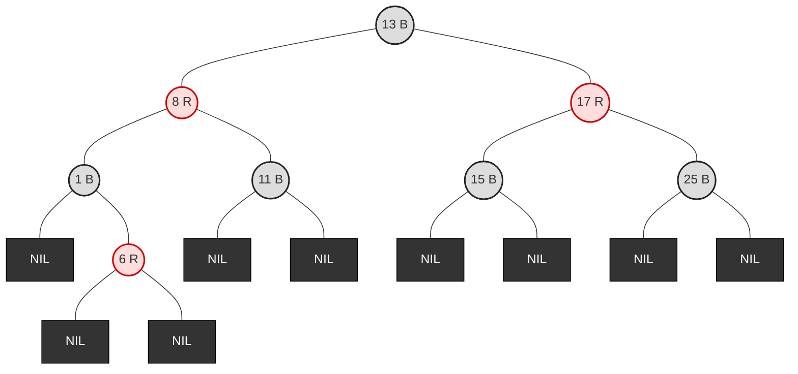
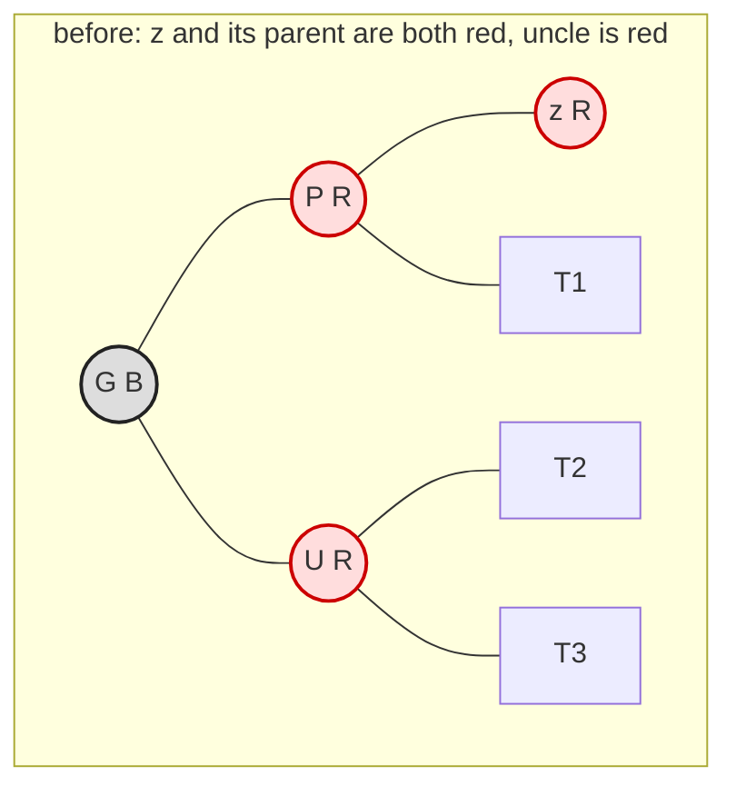
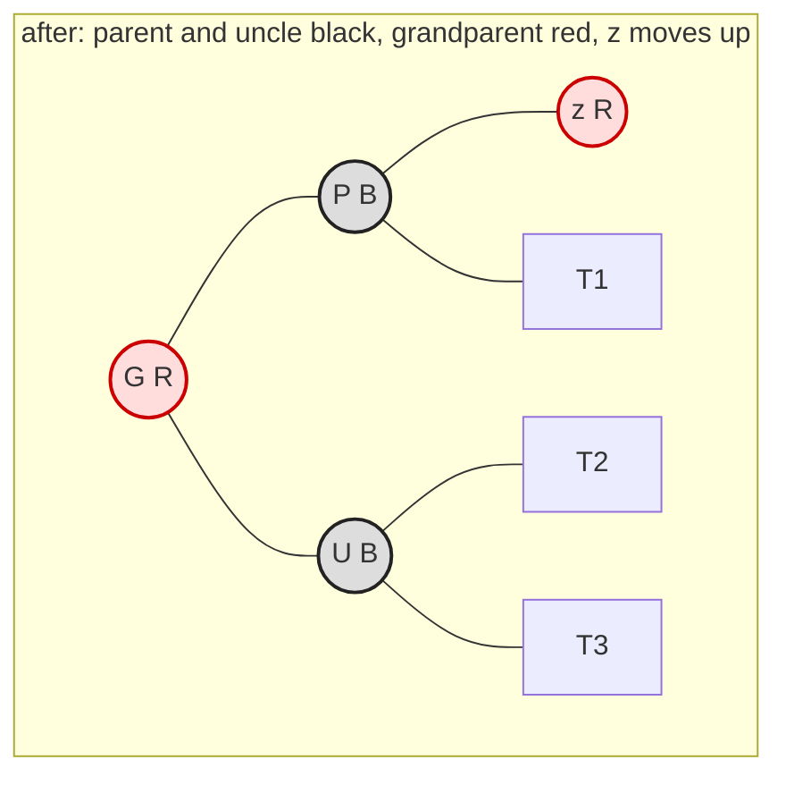
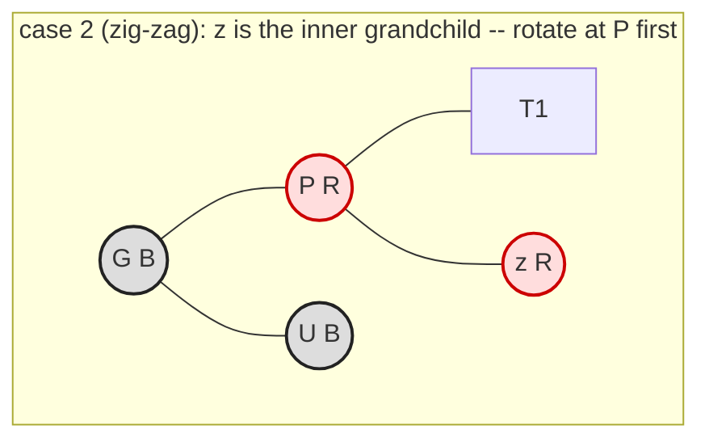
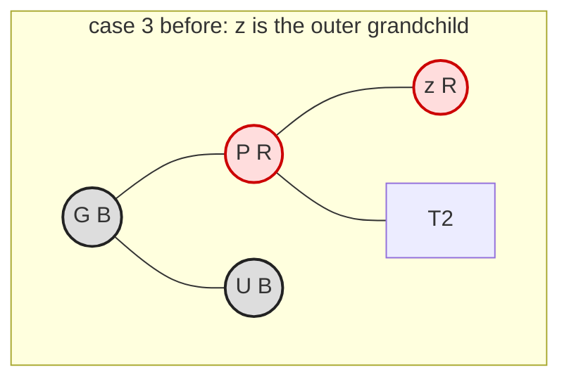
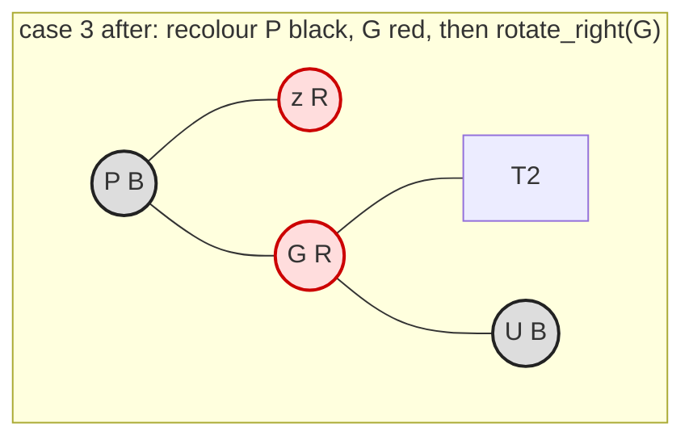

# 35.3 Red-black trees

AVL trees buy their short height with strict bookkeeping: every insert and
delete recomputes heights all the way back to the root, and a delete may
rotate at every level. A **red-black tree** trades a little height for a lot
less work per update — it allows paths up to twice as long as the shortest
one, and in exchange keeps the repair rules short enough that an insert is
always $O(1)$ rotations and a delete at most three. That trade is why this,
and not AVL, is the tree inside Java's `TreeMap`, C++'s `std::map`, and the
Linux kernel. This section states the five properties exactly, checks them
with code after every single insert, and is honest about the one operation
that is genuinely hard.

## The five properties

Every node carries one extra bit: a **colour**, red or black. The empty
subtrees hanging off the bottom count as nodes too — call them **NIL
leaves**, drawn as small black squares — so a "real" node with one child
actually has one real child and one NIL child. With that convention, a
red-black tree is a binary search tree satisfying:

1. **P1 — Every node is either red or black.**
2. **P2 — The root is black.**
3. **P3 — Every NIL leaf is black.**
4. **P4 — A red node's children are both black.** (No red node has a red
   parent — "no two reds in a row" on any path.)
5. **P5 — For every node, all paths from that node down to its descendant
   NIL leaves contain the same number of black nodes.** That number is the
   node's **black-height**.

P4 and P5 are the entire balancing mechanism, and they pull against each other
in a productive way. P5 pins down the *black* nodes: every root-to-leaf path
has exactly the same number of them. P4 stops the reds from clumping: they
must sit one at a time, between blacks.

!!! note "What P4 and P5 buy together"

    The longest root-to-leaf path (alternating black-red-black-red) is at
    most **twice** the shortest (all black). That single ratio is the whole
    balance guarantee.



Check it by hand: the root 13 is black (P2); no red node has a red child
(P4); and every path from 13 to a NIL passes exactly two black *real* nodes
plus the NIL — for instance 13→8→1→NIL and 13→17→25→NIL and
13→8→1→6→NIL all carry the same black count, because 6 is red and does not
add one (P5).

## A validator that names the broken property

Vague claims about invariants are worthless; here is the checker. It returns
the *first* property violated, with the node responsible, and we will run it
after every insert for the rest of the section.

```python
RED, BLACK = "red", "black"

class RBNode:
    __slots__ = ("key", "color", "left", "right", "parent")
    def __init__(self, key, color=RED):
        self.key = key
        self.color = color
        self.left = self.right = self.parent = None

class RedBlackTree:
    """One shared NIL sentinel stands in for every empty subtree."""
    def __init__(self):
        self.NIL = RBNode(None, BLACK)
        self.NIL.left = self.NIL.right = self.NIL.parent = self.NIL
        self.root = self.NIL

def rb_validate(tree):
    """Return (ok, message) naming the first of P1-P5 that fails."""
    NIL = tree.NIL
    if NIL.color != BLACK:
        return False, "P3 violated: the NIL leaf is not black"
    if tree.root is not NIL and tree.root.color != BLACK:
        return False, "P2 violated: the root is red"
    problems = []

    def black_height(node):
        if node is NIL:
            return 1                                  # the NIL leaf itself
        if node.color not in (RED, BLACK):
            problems.append(f"P1 violated: node {node.key} is {node.color!r}")
            return 0
        if node.color == RED:
            for kid, side in ((node.left, "left"), (node.right, "right")):
                if kid is not NIL and kid.color == RED:
                    problems.append(f"P4 violated: red node {node.key} has a "
                                    f"red {side} child {kid.key}")
        left_bh, right_bh = black_height(node.left), black_height(node.right)
        if problems:
            return 0
        if left_bh != right_bh:
            problems.append(f"P5 violated: node {node.key} sees black-height "
                            f"{left_bh} left but {right_bh} right")
            return 0
        return left_bh + (1 if node.color == BLACK else 0)

    black_height(tree.root)
    return (not problems), (problems[0] if problems else
                            "all five properties hold")

# build the diagram above by hand, then break it three ways
t = RedBlackTree()
def node(key, color, left=None, right=None):
    n = RBNode(key, color)
    n.left = left if left else t.NIL
    n.right = right if right else t.NIL
    return n

six = node(6, RED)
one = node(1, BLACK, right=six)
t.root = node(13, BLACK,
              node(8, RED, one, node(11, BLACK)),
              node(17, RED, node(15, BLACK), node(25, BLACK)))
print("as drawn        :", rb_validate(t))

t.root.color = RED
print("root painted red:", rb_validate(t))
t.root.color = BLACK

one.color = RED                     # now red 8 has a red child, 1
print("node 1 -> red   :", rb_validate(t))
one.color = BLACK

six.color = BLACK                   # an extra black on one path only
print("node 6 -> black :", rb_validate(t))
```

```text
as drawn        : (True, 'all five properties hold')
root painted red: (False, 'P2 violated: the root is red')
node 1 -> red   : (False, 'P4 violated: red node 8 has a red left child 1')
node 6 -> black : (False, 'P5 violated: node 1 sees black-height 1 left but 2 right')
```

Three deliberate one-bit edits, three different diagnoses.

Notice that the second one is reported at node **8**, not at node 1: P4 is a
statement about a red node's *children*, so the offending pair is named from
above.

The last edit is the subtle case worth staring at. Painting node 6 black
created no adjacent reds and left the root alone. It merely made *one* path
one black node longer than its sibling — and P5 caught it at node 1.

## Why the height is at most about $2\log_2 n$

The argument is two steps, both short.

**Step one.** Consider any node $x$ with black-height $b$ — the black nodes
on any path from $x$ down to a NIL, counting $x$ itself when it is black and
counting the NIL, which is the count P5 fixes and the count the code below
prints. Its subtree contains at least $2^{\,b-1} - 1$ real nodes. Proof by
induction: a NIL has $b = 1$ and $2^{0} - 1 = 0$ real nodes below it; a real
node's two children each have black-height $b$ or $b-1$, so its subtree holds
at least $2\bigl(2^{\,b-2} - 1\bigr) + 1 = 2^{\,b-1} - 1$.

**Step two.** By P4 no two nodes on a path are both red, and by P2 and P3 the
two ends of a root-to-NIL path — the root and the NIL — are both black, so at
least half that path's nodes are black. Let $\hat h$ be the longest root-to-NIL
path in edges; it holds $\hat h + 1$ nodes, so
$b \ge \lceil \hat h / 2\rceil + 1$ and
$n \ge 2^{\,b-1} - 1 \ge 2^{\hat h / 2} - 1$, which rearranges to
$\hat h \le 2\log_2(n+1)$. Our height convention counts edges between
*real* nodes, one fewer:

$$ h \;\le\; 2\log_2(n+1) - 1 $$

Twice the perfect height — worse than AVL's 1.44, still $O(\log n)$, and
still immune to insertion order. Both steps are checkable on the tree we
built above:

```python
# continues
import math, random

def rb_height(tree):
    """Edges between real nodes, as in Chapter 20. Empty tree is -1."""
    if tree.root is tree.NIL:
        return -1
    height, level = -1, [tree.root]
    while level:
        height += 1
        level = [c for n in level for c in (n.left, n.right) if c is not tree.NIL]
    return height

def rb_black_height(tree):
    """Black nodes from the root down to a NIL, counting the NIL."""
    node, count = tree.root, 1
    while node is not tree.NIL:
        if node.color == BLACK:
            count += 1
        node = node.left
    return count

def count_nodes(tree):
    total, level = 0, [tree.root]
    while level:
        total += len(level)
        level = [c for n in level for c in (n.left, n.right) if c is not tree.NIL]
    return total

n, b, height = count_nodes(t), rb_black_height(t), rb_height(t)
print(f"real nodes n = {n}, black-height b = {b}, height h = {height}")
print(f"step one:  n >= 2**(b-1) - 1  ->  {n} >= {2 ** (b - 1) - 1}   "
      f"{n >= 2 ** (b - 1) - 1}")
print(f"step two:  h <= 2*log2(n+1) - 1  ->  {height} <= "
      f"{2 * math.log2(n + 1) - 1:.2f}   {height <= 2 * math.log2(n + 1) - 1}")
```

```text
real nodes n = 8, black-height b = 3, height h = 3
step one:  n >= 2**(b-1) - 1  ->  8 >= 3   True
step two:  h <= 2*log2(n+1) - 1  ->  3 <= 5.34   True
```

Eight nodes, black-height 3, and the tree indeed carries at least the
$2^{3-1} - 1 = 3$ nodes the counting argument demands. Both inequalities hold —
but one hand-checked tree proves nothing about the general case, and we
cannot build a big one until the tree can insert. So: insertion.

## Insertion: colour first, ask questions after

Insert exactly as in Chapter 20, then paint the newcomer **red**. Red is the
cheap colour: adding a red node never changes any black-height, so P5 is safe
for free, and P2 is fixed by one line at the end.

That leaves exactly one property that can break — P4, because the new red
node might have a red parent. Fixing it is a loop that walks *upward*, with
three cases distinguished by the colour of the new node's **uncle** (its
parent's sibling).

### Case 1 — the uncle is red: recolour and climb





Both children of `G` gained a black and `G` lost one, so every path through
`G` has exactly the same black count as before — P5 survives. But `G` is now
red and *its* parent might be red too, so the problem moves two levels up
and the loop repeats. No rotation at all; this is why insertion is cheap.

### Cases 2 and 3 — the uncle is black: rotate

If the uncle is black, recolouring would break P5, so we must reshape. Two
sub-cases, exactly the "straight" and "zig-zag" shapes of
[35.1](01-rotations.md):







Case 2 rotates at `P` to turn the zig-zag into case 3. Case 3 recolours and
rotates once at `G`, which puts a **black** node on top of two reds — P4 is
restored and, crucially, the subtree's root is black again, so nothing above
it can still be broken. **Case 3 ends the loop**, which is why an insert
performs at most two rotations no matter how tall the tree.

## The whole thing, running

```python
# continues
class RedBlackTree(RedBlackTree):          # extend the class defined above
    rotations = 0                          # counted so we can check the claim

    def rotate_left(self, x):
        self.rotations += 1
        y = x.right
        x.right = y.left
        if y.left is not self.NIL:
            y.left.parent = x
        y.parent = x.parent
        if x.parent is self.NIL:
            self.root = y
        elif x is x.parent.left:
            x.parent.left = y
        else:
            x.parent.right = y
        y.left, x.parent = x, y

    def rotate_right(self, y):
        self.rotations += 1
        x = y.left
        y.left = x.right
        if x.right is not self.NIL:
            x.right.parent = y
        x.parent = y.parent
        if y.parent is self.NIL:
            self.root = x
        elif y is y.parent.right:
            y.parent.right = x
        else:
            y.parent.left = x
        x.right, y.parent = y, x

    def insert(self, key):
        z = RBNode(key, RED)
        z.left = z.right = z.parent = self.NIL
        parent, node = self.NIL, self.root
        while node is not self.NIL:                    # ordinary BST descent
            parent = node
            if key < node.key:
                node = node.left
            elif key > node.key:
                node = node.right
            else:
                return                                  # duplicate
        z.parent = parent
        if parent is self.NIL:
            self.root = z
        elif key < parent.key:
            parent.left = z
        else:
            parent.right = z
        self._fix_insert(z)

    def _fix_insert(self, z):
        while z.parent.color == RED:                   # P4 is broken at z
            grand = z.parent.parent
            if z.parent is grand.left:
                uncle = grand.right
                if uncle.color == RED:                 # case 1: recolour
                    z.parent.color = uncle.color = BLACK
                    grand.color = RED
                    z = grand                          # climb two levels
                else:
                    if z is z.parent.right:            # case 2: straighten
                        z = z.parent
                        self.rotate_left(z)
                    z.parent.color = BLACK             # case 3: recolour ...
                    z.parent.parent.color = RED
                    self.rotate_right(z.parent.parent) # ... and rotate; done
            else:                                       # mirror image
                uncle = grand.left
                if uncle.color == RED:
                    z.parent.color = uncle.color = BLACK
                    grand.color = RED
                    z = grand
                else:
                    if z is z.parent.left:
                        z = z.parent
                        self.rotate_right(z)
                    z.parent.color = BLACK
                    z.parent.parent.color = RED
                    self.rotate_left(z.parent.parent)
        self.root.color = BLACK                        # P2, restored cheaply

    def in_order(self):
        out, stack, node = [], [], self.root
        while stack or node is not self.NIL:
            while node is not self.NIL:
                stack.append(node)
                node = node.left
            node = stack.pop()
            out.append(node.key)
            node = node.right
        return out

# the worst case from Chapter 20: 1, 2, 3, ..., 31 in order
tree = RedBlackTree()
for k in range(1, 32):
    tree.insert(k)
    ok, message = rb_validate(tree)
    assert ok, f"broken after inserting {k}: {message}"

print("31 sorted inserts, validated after every one:", rb_validate(tree)[1])
print("height", rb_height(tree), "  black-height", rb_black_height(tree))
print("in-order sorted:", tree.in_order() == list(range(1, 32)))
print("bound 2*log2(n+1)-1 =", round(2 * math.log2(32) - 1, 2))
```

```text
31 sorted inserts, validated after every one: all five properties hold
height 7   black-height 5
in-order sorted: True
bound 2*log2(n+1)-1 = 9.0
```

Height 7 against the plain BST's 30 — and against AVL's 4. That gap is the
trade in one number: the red-black tree is nearly twice as tall as the AVL
tree on this input, and it did strictly less work to get there.

Now fill in the empirical table promised earlier:

```python
# continues
rng = random.Random(1972)
worst_rotations = 0
print(f"{'n':>7} {'RB height':>10} {'bound':>7} {'perfect':>8} {'valid':>6}")
for n in (15, 100, 1000, 10_000):
    t = RedBlackTree()
    for k in rng.sample(range(1_000_000), n):
        before = t.rotations
        t.insert(k)
        worst_rotations = max(worst_rotations, t.rotations - before)
    bound = 2 * math.log2(n + 1) - 1
    print(f"{n:>7} {rb_height(t):>10} {bound:>7.2f} "
          f"{math.floor(math.log2(n)):>8} {str(rb_validate(t)[0]):>6}")
print("most rotations any single insert needed:", worst_rotations)
```

```text
      n  RB height   bound  perfect  valid
     15          4    7.00        3   True
    100          7   12.32        6   True
   1000         11   18.93        9   True
  10000         15   25.58       13   True
most rotations any single insert needed: 2
```

Across all 11 115 insertions no single one needed more than two rotations —
the theory's promise, measured.

Every height sits far under the bound, and only one or two levels above a
perfect tree: the $2\log_2 n$ worst case is a promise, not a prediction. On
*random* input a red-black tree is essentially as short as the AVL trees
measured in [35.2](02-avl.md), which hit exactly the same heights 4, 7, 11,
15.

The two structures separate on adversarial input: sorted inserts gave AVL 4
and red-black 7. Ten thousand keys, sixteen nodes on the longest search path,
guaranteed regardless of arrival order.

## Deletion: the part everyone skips, and why

Deletion is where red-black trees stop being friendly. Removing a node is
Chapter 20's usual three cases, but if the node that physically leaves the
tree was **black**, every path through it just lost a black node and P5 is
broken.

The standard repair introduces a temporary fiction. The node that moved into
the gap is treated as carrying an extra unit of blackness — it is **"doubly
black"** — and a fix-up loop pushes that extra black around the tree until
something can absorb it. Three shapes, distinguished by the doubly-black
node's **sibling**:

1. **Sibling is red.** Rotate to make it black, then retry: this turns the
   case into one of the two below.
2. **Sibling is black with two black children.** Paint the sibling red. That
   removes one black from the sibling's paths, matching the loss on our own
   side, and moves the doubly-black marker up to the parent.
3. **Sibling is black with a usefully-coloured child.** One or two rotations
   plus recolouring absorb the extra black, and the loop ends.

Four cases plus a mirror image of each, several of which fall through into
one another. It runs in $O(\log n)$ with at most three rotations, so it is
*fast* — it is simply intricate.

Most data-structures courses (and most textbook chapters) therefore implement
red-black **insert only**, then reach for a library when deletion is needed.
We do the same here: this page implements insert, and describes delete rather
than pretending to.

If you want a self-balancing tree with a deletion you can write and trust
from memory, AVL is the honest answer — its delete is [35.2](02-avl.md)'s
twenty lines, fully implemented and stress-tested there.

## Where this lives in real software

Red-black trees are not a classroom curiosity; they are probably running on
your machine right now.

- **Java** — `java.util.TreeMap` and `java.util.TreeSet` are red-black
  trees. Their documentation guarantees $O(\log n)$ for `get`, `put`,
  `remove`, and `containsKey`, and iteration walks the tree in-order, which
  is why a `TreeMap` yields its keys sorted.
- **C++** — the standard only requires `std::map`, `std::set`,
  `std::multimap`, and `std::multiset` to give logarithmic operations and
  ordered iteration, but every mainstream implementation uses a red-black
  tree to do it. (`std::unordered_map` is the hash-table sibling.)
- **The Linux kernel** — a generic, deliberately *intrusive* red-black tree
  lives in `lib/rbtree.c`: you embed a `struct rb_node` inside your own
  struct rather than storing pointers to it, so the tree costs no extra
  allocation. The process scheduler keeps runnable tasks ordered in one, and
  many subsystems use it wherever an ordered, worst-case-bounded index is
  needed.
- **Python** — has none of this in its standard library. `dict` and `set`
  are hash tables ([Chapter 14](../ch14-beyond/01-collections-tour.md)),
  which is why Python code that needs ordered ranges either keeps a sorted
  list with the `bisect` module or installs a third-party package.

!!! info "Java corner"

    `TreeMap` exposes the operations a balanced tree makes cheap and a hash
    table cannot: `firstKey()`, `lastKey()`, `floorKey(k)`, `ceilingKey(k)`,
    `headMap`, `tailMap`, and `subMap(lo, hi)`. Every one of them is a
    root-to-leaf descent plus an in-order walk. If you ever find yourself
    sorting a `HashMap`'s keys inside a loop, a `TreeMap` was the answer.

## AVL versus red-black, side by side

| | AVL | Red-black |
|---|---|---|
| Invariant | $\lvert h_L - h_R\rvert \le 1$ at every node | the five colour properties |
| Height bound (edges) | $\approx 1.44\log_2(n+1) - 1.33$ | $2\log_2(n+1) - 1$ |
| Height, 31 sorted inserts | 4 | 7 |
| Extra data per node | height (an int) | colour (one bit) |
| Rotations per insert | at most 2 (one site) | at most 2 |
| Rotations per delete | up to $O(\log n)$ | at most 3 |
| Rebalancing work | heights recomputed up the whole path | mostly recolouring |
| Best at | lookup-heavy workloads | update-heavy workloads |
| Found in | some databases, in-memory indexes | Java `TreeMap`, C++ `std::map`, Linux |

Neither is "better". If your structure is built once and queried a million
times, AVL's shorter paths win. If it churns, red-black's cheaper updates
win. Both beat an unbalanced BST by an unbounded margin the moment the input
arrives sorted.

!!! warning "Common mistakes"

    - **Colouring the new node black.** It breaks P5 immediately on the path
      to that node, and nothing in the fix-up loop repairs a black-height
      mismatch. New nodes are always red.
    - **Forgetting `self.root.color = BLACK` at the end.** Case 1 can leave
      the root red. The final line is not a detail — it is P2.
    - **Treating NIL as `None`.** The fix-up code reads `uncle.color` and
      `z.parent.parent` without checking for `None`; a shared black sentinel
      makes those reads always legal. Swap in `None` and you will chase
      `AttributeError`s through every case.
    - **Checking only "no two reds in a row".** P4 alone permits wildly
      unbalanced trees — it is P5, the equal black-heights, that does the
      balancing. A validator that skips P5 proves nothing.
    - **Believing red-black trees are always shorter than a plain BST is
      deep.** They are not shorter than AVL trees; they are *never tall*,
      which is a different and more valuable property.

## Check your understanding

1. A red-black tree has black-height 3 at the root. What are the minimum and
   maximum possible numbers of real nodes, and the minimum and maximum
   root-to-NIL path lengths?

    ??? success "Answer"
        At least $2^3 - 1 = 7$ nodes (the all-black perfect tree of height
        2). The shortest path has 3 blacks; the longest alternates and has
        3 blacks plus up to 2 reds below the root, so no path is more than
        twice the shortest. Maximum nodes: a tree where every legal position
        is filled with alternating colours.

2. During a fix-up the uncle is red. How many rotations does that step
   perform, and where does the algorithm look next?

    ??? success "Answer"
        Zero rotations — case 1 only recolours: parent and uncle become
        black, grandparent becomes red. The algorithm then continues from
        the grandparent, two levels up, because the grandparent's new red
        may clash with *its* parent.

3. Predict before running: you insert `1, 2, 3` into an empty red-black
   tree. What colour is each node afterwards, and what is the root?

    ??? success "Answer"
        Root 2 (black) with red children 1 and 3. Inserting 3 makes a red
        child under red 2 with a black (NIL) uncle — case 3 — so 2 is
        recoloured black, 1's position becomes red, and a left rotation at
        1 lifts 2 to the root.

4. Java's `TreeMap` guarantees $O(\log n)$ for `get`. Which of the five
   properties is doing the real work behind that guarantee, and why is P4
   not enough on its own?

    ??? success "Answer"
        P5. Equal black-heights on every path is what forces the tree to be
        balanced; P4 only limits how the reds may be arranged *between* the
        blacks, capping the longest path at twice the shortest. Without P5
        there would be no shortest-path floor to be twice of.
