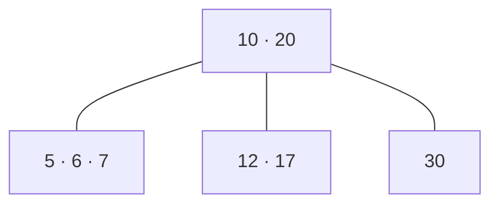
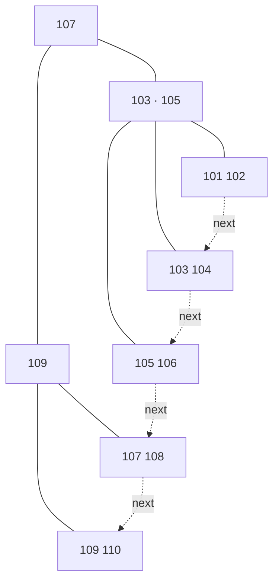

# 35.4 B-trees and the disk

AVL and red-black trees answer the question "how few *comparisons* can a
lookup need?". That is the right question when the whole tree is in RAM.
Point the same tree at a billion rows on a disk and the question changes:
the machine no longer pays per comparison, it pays per **block read**, and a
binary tree makes about thirty of those where a well-shaped tree makes
three. This section changes the cost model and watches the optimal data
structure change with it — into the **B-tree**, the structure underneath
essentially every database index and file system on your machine.

!!! abstract "In plain words"

    - **What it is.** A B-tree is a search tree built for storage where
      *fetching one item costs the same as fetching a whole block* — so it uses
      fat nodes packed with many keys and stays only a few levels deep.
    - **Picture it.** Think of a printed phone book. Each page holds hundreds of
      names, so you find anyone by flipping through a handful of *pages*, not by
      turning past one name at a time. A B-tree node is a page; a disk block is
      what the hardware hands you whole, whether you wanted one name or all of
      them.
    - **Why it matters.** When a single read is a disk seek — thousands of times
      slower than a comparison in memory — the only cost worth counting is how
      many blocks you touch. Fat, shallow nodes turn a lookup over a billion
      keys from about thirty reads into four.

## Change the cost model, change the answer

### What a disk actually charges for

A disk — spinning or solid-state — cannot hand you a single byte. The
smallest unit it transfers is a **block** (4 KB is the usual size, matching
the page size discussed in
[section 23.2](../ch23-os/02-memory-layout.md)). Reading one byte and reading
four thousand cost the same.

The times are wildly different from RAM's. A memory access takes on the order
of 100 nanoseconds; a random SSD read takes tens of *micro*seconds; a spinning
disk seek takes milliseconds. That gap is four to five orders of magnitude, so
the only cost worth counting is **how many blocks a search touches**.

### Fat nodes change the base of the logarithm

A binary tree touches one block per level, and it has $\log_2 n$ levels. But a
4 KB block has room for hundreds of keys, and a node that holds $k$ keys can
have $k+1$ children — so a tree built out of *fat* nodes has $\log_{k+1} n$
levels instead.

Changing the base of a logarithm is ordinarily a constant factor nobody cares
about. When the constant multiplies a millisecond, it is the whole game.

```python
import math

BLOCK_BYTES = 4096
KEY_BYTES = 8            # a 64-bit integer key
POINTER_BYTES = 8        # a 64-bit block address
n = 1_000_000_000        # one billion keys

print(f"one block holds about "
      f"{BLOCK_BYTES // (KEY_BYTES + POINTER_BYTES)} key+pointer pairs\n")

print(f"{'keys/node':>10} {'children':>9} {'levels':>7} {'disk reads':>11} "
      f"{'time @ 10us':>12}")
for keys_per_node in (1, 15, 127, 255):
    children = keys_per_node + 1
    levels = math.ceil(math.log(n, children))
    print(f"{keys_per_node:>10} {children:>9} {levels:>7} {levels:>11} "
          f"{levels * 10:>10} us")
```

```text
one block holds about 256 key+pointer pairs

 keys/node  children  levels  disk reads  time @ 10us
         1         2      30          30        300 us
        15        16       8           8         80 us
       127       128       5           5         50 us
       255       256       4           4         40 us
```

Thirty reads versus four. The first row is an ordinary balanced binary tree —
AVL, red-black, it does not matter, they all have about $\log_2 n$ levels. The
last row is a B-tree whose nodes fill a 4 KB block.

Same billion keys, same guarantees, but one costs 300 microseconds of I/O and
the other 40. On a spinning disk that is 30 milliseconds versus 4.

!!! tip "The cost model chooses the data structure"

    Nothing about the *keys* changed between those two rows — only what we
    agreed to count. Count comparisons and a binary tree is optimal; count
    block transfers and it is thirty times worse than a wide one. **Change
    the cost model and you change the answer.**

!!! note "Why not just make one giant node?"

    Because a node must be *read entirely* to be searched, and a block is
    the unit the hardware moves. Nodes larger than a block cost extra reads
    with nothing to show for them; nodes smaller than a block waste the read
    you already paid for. **One node per block** is the whole design rule,
    and everything else about B-trees follows from it.

## The structure

A **B-tree of order $m$** is a search tree in which:

1. every node holds at most $m-1$ keys, sorted, and at most $m$ children;
2. every node except the root holds at least $\lceil m/2 \rceil - 1$ keys;
3. an internal node with $k$ keys has exactly $k+1$ children;
4. the keys of child $i$ all lie between key $i-1$ and key $i$ of the
   parent — the BST rule, generalised from one separator to many;
5. **all leaves are at the same depth.**

!!! note "Rule 5 is the balance condition"

    A B-tree does not let subtrees differ by a level and then rotate to
    repair it, the way AVL and red-black trees do. It simply **forbids the
    difference**: every leaf sits at the same depth, always.

It can afford that bluntness because it grows in a strange direction. A
B-tree never gets taller by adding a level at the bottom. It gets taller only
when the *root* splits, and a root split lifts every leaf by one at once.

Here is an order-4 tree (so 1 to 3 keys per node, 2 to 4 children) over the
keys we will build in a moment:



Everything left of 10 lives in the first child, everything between 10 and 20
in the second, everything above 20 in the third. Searching for 17 reads the
root (one block), binary-searches its two keys to pick the middle child,
reads that block, and finds 17 — two blocks for a tree of eight keys.

!!! info "Order $m$ and minimum degree $t$"

    Implementations usually take the *minimum* degree $t$ as the parameter
    instead of the order: a node holds between $t-1$ and $2t-1$ keys, so
    $m = 2t$. The code below uses `t`; order 4 means `t = 2`. The two
    descriptions are the same tree.

## Search: binary search inside, then descend

Searching is Chapter 20's descent with one extra step per level. Inside a
node you have a sorted list of keys, so you use
[Chapter 22's binary search](../ch22-sorting/03-searching.md) — Python's
`bisect_left` — to find either the key itself or the child to follow. That
inside-the-node work is free in disk terms: the block is already in memory.

## Insertion: split a full node and push its median up

Insertion always lands in a leaf, and then one of two things happens.

1. **The leaf has room.** Insert the key in sorted position. Done.
2. **The leaf is full.** It **splits**. The middle key moves *up* into the
   parent, and the remaining keys become two nodes sitting on either side of
   it.
3. **The parent is now full too.** Then the parent splits the same way, and
   so on up the tree.
4. **The split reaches the root.** A brand new root is created holding a
   single key. *That* is the only way a B-tree grows taller — which is
   exactly why all leaves stay at the same depth.

The implementation below splits **pre-emptively**: on the way down, any full
node is split before we descend into it. That guarantees there is always room
in the parent when a child splits, so no work has to be undone.

```python
from bisect import bisect_left

class BNode:
    __slots__ = ("keys", "children", "leaf")
    def __init__(self, leaf=True):
        self.keys = []
        self.children = []
        self.leaf = leaf

class BTree:
    """B-tree with minimum degree t: t-1 to 2t-1 keys per node (order m = 2t)."""
    def __init__(self, t=2):
        self.t = t
        self.root = BNode(leaf=True)
        self.splits = 0

    # ---- search: one block per level
    def search(self, key):
        node, blocks = self.root, 0
        while True:
            blocks += 1                                # this node = one block
            i = bisect_left(node.keys, key)            # binary search inside
            if i < len(node.keys) and node.keys[i] == key:
                return True, blocks
            if node.leaf:
                return False, blocks
            node = node.children[i]

    # ---- insert
    def insert(self, key):
        if len(self.root.keys) == 2 * self.t - 1:      # root full: grow upward
            fresh = BNode(leaf=False)
            fresh.children.append(self.root)
            self.root = fresh
            self._split_child(fresh, 0)
        self._insert_nonfull(self.root, key)

    def _split_child(self, parent, i):
        """Split the full child at index i; its median key rises into parent."""
        t, full = self.t, parent.children[i]
        median = full.keys[t - 1]
        right = BNode(leaf=full.leaf)
        right.keys = full.keys[t:]                     # upper half
        full.keys = full.keys[:t - 1]                  # lower half
        if not full.leaf:
            right.children = full.children[t:]
            full.children = full.children[:t]
        parent.keys.insert(i, median)                  # the median moves UP
        parent.children.insert(i + 1, right)
        self.splits += 1
        return median

    def _insert_nonfull(self, node, key):
        i = bisect_left(node.keys, key)
        if i < len(node.keys) and node.keys[i] == key:
            return                                      # duplicate: ignore
        if node.leaf:
            node.keys.insert(i, key)
            return
        if len(node.children[i].keys) == 2 * self.t - 1:
            self._split_child(node, i)                  # pre-emptive split
            if key > node.keys[i]:
                i += 1
            elif key == node.keys[i]:
                return
        self._insert_nonfull(node.children[i], key)

    # ---- display
    def levels(self):
        rows, level = [], [self.root]
        while level:
            rows.append("   ".join(str(nd.keys) for nd in level))
            level = [c for nd in level for c in nd.children]
        return rows

    def show(self, label):
        print(label)
        for depth, row in enumerate(self.levels()):
            print(f"    depth {depth}: {row}")

    def keys_in_order(self):
        out = []
        def walk(nd):
            for j, k in enumerate(nd.keys):
                if not nd.leaf:
                    walk(nd.children[j])
                out.append(k)
            if not nd.leaf:
                walk(nd.children[-1])
        walk(self.root)
        return out

tree = BTree(t=2)                                       # order 4
for key in [10, 20, 5, 6, 12, 30, 7, 17]:
    before = tree.splits
    tree.insert(key)
    note = "  <-- SPLIT" if tree.splits > before else ""
    tree.show(f"insert {key}{note}")
```

```text
insert 10
    depth 0: [10]
insert 20
    depth 0: [10, 20]
insert 5
    depth 0: [5, 10, 20]
insert 6  <-- SPLIT
    depth 0: [10]
    depth 1: [5, 6]   [20]
insert 12
    depth 0: [10]
    depth 1: [5, 6]   [12, 20]
insert 30
    depth 0: [10]
    depth 1: [5, 6]   [12, 20, 30]
insert 7
    depth 0: [10]
    depth 1: [5, 6, 7]   [12, 20, 30]
insert 17  <-- SPLIT
    depth 0: [10, 20]
    depth 1: [5, 6, 7]   [12, 17]   [30]
```

Two splits, both worth studying.

- **`insert 6` split the root.** The root `[5, 10, 20]` was full, so the
  median **10 rose to become a new root** and the tree gained its only extra
  level — every leaf moved down together.
- **`insert 17` split a child.** The descent hit `[12, 20, 30]`, which was
  full, so its median **20 rose into the root** and the node became
  `[12, 17]` and `[30]`.

Notice what never happened: no node was re-linked to a different depth, and no
rotation was needed. Splitting *is* the balancing mechanism.

## The invariants, checked

Five rules were stated; here is the code that enforces all five, plus a
randomized stress test over three different orders.

```python
# continues
import random

def validate(tree):
    """Check rules 1-5 and report the first violation."""
    t, problems, leaf_depths = tree.t, [], set()

    def walk(node, depth, low, high, is_root):
        if node.leaf:
            leaf_depths.add(depth)
        if node.keys != sorted(node.keys):
            problems.append(f"rule 1: keys not sorted in {node.keys}")
        floor = 1 if is_root else t - 1
        if not (floor <= len(node.keys) <= 2 * t - 1):
            if not (is_root and node.leaf and not node.keys):    # empty tree
                problems.append(f"rule 2: node {node.keys} holds "
                                f"{len(node.keys)} keys, allowed {floor}"
                                f"..{2 * t - 1}")
        if not node.leaf and len(node.children) != len(node.keys) + 1:
            problems.append(f"rule 3: node {node.keys} has "
                            f"{len(node.children)} children")
        for k in node.keys:
            if (low is not None and k <= low) or (high is not None and k >= high):
                problems.append(f"rule 4: key {k} outside ({low}, {high})")
        if not node.leaf:
            bounds = [low] + node.keys + [high]
            for j, child in enumerate(node.children):
                walk(child, depth + 1, bounds[j], bounds[j + 1], False)

    walk(tree.root, 0, None, None, True)
    if len(leaf_depths) > 1:
        problems.append(f"rule 5: leaves at depths {sorted(leaf_depths)}")
    return (not problems), (problems[0] if problems else
                            f"valid; all leaves at depth {leaf_depths.pop()}")

print("hand-built tree:", validate(tree))
for key in (17, 30, 99):
    print(f"search({key:>2}) ->", tree.search(key))

rng = random.Random(1972)
for trial in range(40):
    order_t = rng.choice([2, 3, 8])
    bt = BTree(t=order_t)
    keys = rng.sample(range(2000), 300)
    for k in keys:
        bt.insert(k)
    ok, why = validate(bt)
    assert ok, why
    assert bt.keys_in_order() == sorted(keys)
print("40 random trees of 300 keys each, orders 4/6/16: every invariant held")

big = BTree(t=64)                       # 127 keys per node, like a real index
for k in range(200_000):
    big.insert(k)
print("200000 sorted inserts ->", len(big.levels()), "levels;",
      "search(199999) reads", big.search(199_999)[1], "blocks")
```

```text
hand-built tree: (True, 'valid; all leaves at depth 1')
search(17) -> (True, 2)
search(30) -> (True, 2)
search(99) -> (False, 2)
40 random trees of 300 keys each, orders 4/6/16: every invariant held
200000 sorted inserts -> 3 levels; search(199999) reads 3 blocks
```

The last line is the point of the whole section: two hundred thousand keys
inserted in the worst possible order for a binary tree, and every lookup is
**three block reads**.

Compare that with the best a binary tree could manage. *Any* binary tree over
200 000 nodes must be at least 17 edges deep — $2^{17} - 1 = 131\,071$ is not
enough room — so even a perfectly balanced AVL or red-black tree would touch
at least 18 nodes. On disk that is 18 block reads against the B-tree's 3.

## Deletion: borrow from a sibling, or merge with one

Deleting can leave a node with too few keys ($< t-1$), which breaks rule 2.
There are exactly two repairs, and they mirror the two ways a node can be
under-full:

- **Borrow.** If an adjacent sibling has a spare key ($\ge t$), rotate one
  through the parent: the parent's separator drops into the hungry node, and
  the sibling's outermost key rises to replace it. Costs $O(1)$ and stops
  there.
- **Merge.** If both siblings are at the minimum, merge the node, the
  parent's separator, and one sibling into a single node of $2t-2$ keys —
  legal, since $2t-2 \le 2t-1$. The parent loses a key, which may leave
  *it* under-full, so merging can cascade upward. If the root ends up with
  no keys at all, it is discarded and the tree gets *shorter* — the exact
  inverse of growth by root split.

Deleting a key from an *internal* node is handled first by swapping it with
its in-order predecessor or successor (which always lives in a leaf), exactly
as in [Chapter 20](../ch20-bst/02-bst-ops.md), and then deleting from the
leaf.

### Three deletions, three mechanisms

The implementation below is complete, and the stress test at the end deletes
every key of every tree while re-validating all five invariants after each
removal.

```python
# continues
def _max_key(node):
    while not node.leaf:
        node = node.children[-1]
    return node.keys[-1]

def _min_key(node):
    while not node.leaf:
        node = node.children[0]
    return node.keys[0]

def _merge(tree, node, i):
    """Fold child i, separator i, and child i+1 into one node."""
    left, right = node.children[i], node.children[i + 1]
    left.keys.append(node.keys.pop(i))
    left.keys.extend(right.keys)
    left.children.extend(right.children)
    node.children.pop(i + 1)

def _fill(tree, node, i):
    """Make sure child i has at least t keys before we descend into it."""
    t = tree.t
    if i > 0 and len(node.children[i - 1].keys) >= t:            # borrow left
        child, sib = node.children[i], node.children[i - 1]
        child.keys.insert(0, node.keys[i - 1])
        node.keys[i - 1] = sib.keys.pop()
        if not sib.leaf:
            child.children.insert(0, sib.children.pop())
    elif i < len(node.children) - 1 and len(node.children[i + 1].keys) >= t:
        child, sib = node.children[i], node.children[i + 1]      # borrow right
        child.keys.append(node.keys[i])
        node.keys[i] = sib.keys.pop(0)
        if not sib.leaf:
            child.children.append(sib.children.pop(0))
    elif i < len(node.children) - 1:
        _merge(tree, node, i)
    else:
        _merge(tree, node, i - 1)

def _delete(tree, node, key):
    t = tree.t
    i = bisect_left(node.keys, key)
    if i < len(node.keys) and node.keys[i] == key:
        if node.leaf:
            node.keys.pop(i)                                     # case 1
            return
        left, right = node.children[i], node.children[i + 1]
        if len(left.keys) >= t:                                  # case 2a
            predecessor = _max_key(left)
            node.keys[i] = predecessor
            _delete(tree, left, predecessor)
        elif len(right.keys) >= t:                               # case 2b
            successor = _min_key(right)
            node.keys[i] = successor
            _delete(tree, right, successor)
        else:                                                    # case 2c
            _merge(tree, node, i)
            _delete(tree, left, key)
        return
    if node.leaf:
        return                                                   # not present
    was_last = (i == len(node.keys))
    if len(node.children[i].keys) < t:
        _fill(tree, node, i)
    if was_last and i > len(node.keys):
        _delete(tree, node.children[i - 1], key)
    else:
        _delete(tree, node.children[i], key)

def btree_delete(self, key):
    _delete(self, self.root, key)
    if not self.root.leaf and not self.root.keys:
        self.root = self.root.children[0]                # tree gets shorter

BTree.delete = btree_delete

worked = BTree(t=2)
for k in [10, 20, 5, 6, 12, 30, 7, 17]:
    worked.insert(k)
worked.show("start")
for key in (30, 6, 10):
    worked.delete(key)
    worked.show(f"delete {key}")
print(validate(worked))
```

```text
start
    depth 0: [10, 20]
    depth 1: [5, 6, 7]   [12, 17]   [30]
delete 30
    depth 0: [10, 17]
    depth 1: [5, 6, 7]   [12]   [20]
delete 6
    depth 0: [10, 17]
    depth 1: [5, 7]   [12]   [20]
delete 10
    depth 0: [7, 17]
    depth 1: [5]   [12]   [20]
(True, 'valid; all leaves at depth 1')
```

Three deletions, three different mechanisms:

- **`delete(30)` borrowed.** The leaf `[30]` was already at the minimum, so
  removing 30 would empty it. Its left sibling `[12, 17]` had a spare key,
  so the parent's separator 20 dropped down into the hungry leaf and the
  sibling's largest key 17 rose to take 20's place — then 30 left, giving
  `[20]`. Three keys rotated through the parent; the shape never changed.
- **`delete(6)` was trivial.** `[5, 6, 7]` had three keys, one above the
  minimum, so 6 simply left.
- **`delete(10)` was an internal key.** Its predecessor 7 (the largest key
  in the left child) took its place, and 7 was then deleted from the leaf.

### The general case, verified exhaustively

```python
# continues
rng = random.Random(1962)
checks = 0
for trial in range(25):
    order_t = rng.choice([2, 3, 5])
    bt = BTree(t=order_t)
    keys = rng.sample(range(1000), 120)
    for k in keys:
        bt.insert(k)
    remaining = set(keys)
    order = keys[:]
    rng.shuffle(order)
    for k in order:
        bt.delete(k)
        remaining.discard(k)
        ok, why = validate(bt)
        assert ok, why
        assert bt.keys_in_order() == sorted(remaining)
        checks += 1
print(f"{checks} deletions across 25 trees: all five invariants held after "
      f"every single one")
```

```text
3000 deletions across 25 trees: all five invariants held after every single one
```

## B+ trees: put the data in the leaves and link them

Real databases use a variant, the **B+ tree**, with two changes:

1. **Only the leaves hold data.** Internal nodes keep *separator* keys only
   — signposts, not records. Records are bulkier than keys, so keeping them
   out of the internal nodes lets more separators fit per block, which
   raises the branching factor, which lowers the height.
2. **The leaves are linked** left-to-right in a list.

Change 2 is the one that pays. A range query — `WHERE id BETWEEN 104 AND 108`,
or "every log entry from Tuesday" — descends *once* to the first matching leaf
and then walks the leaf chain: one sequential block read per leaf, with no
re-descent through the tree. Sequential reads are also the access pattern
disks are fastest at.

### A B+ tree index, built and queried



Note 107 appearing twice: once upstairs as a separator, once downstairs as
real data. In a B+ tree every key lives in a leaf, and the copies upstairs
are only directions.

```python
from bisect import bisect_left, bisect_right

class Leaf:
    __slots__ = ("keys", "rows", "next", "leaf")
    def __init__(self):
        self.keys, self.rows, self.next, self.leaf = [], [], None, True

class Internal:
    __slots__ = ("keys", "children", "leaf")
    def __init__(self):
        self.keys, self.children, self.leaf = [], [], False

class BPlusTree:
    """Order-m B+ tree: separators upstairs, every row in a linked leaf."""
    def __init__(self, m=4):
        self.m = m
        self.root = Leaf()

    def insert(self, key, row):
        split = self._insert(self.root, key, row)
        if split is not None:                       # the root split: grow up
            separator, right = split
            new_root = Internal()
            new_root.keys = [separator]
            new_root.children = [self.root, right]
            self.root = new_root

    def _insert(self, node, key, row):
        if node.leaf:
            i = bisect_left(node.keys, key)
            if i < len(node.keys) and node.keys[i] == key:
                node.rows[i] = row                  # update in place
                return None
            node.keys.insert(i, key)
            node.rows.insert(i, row)
            if len(node.keys) <= self.m - 1:
                return None
            mid = len(node.keys) // 2
            right = Leaf()
            right.keys, right.rows = node.keys[mid:], node.rows[mid:]
            node.keys, node.rows = node.keys[:mid], node.rows[:mid]
            right.next, node.next = node.next, right      # relink the chain
            return right.keys[0], right             # COPY the key upward
        i = bisect_right(node.keys, key)
        split = self._insert(node.children[i], key, row)
        if split is None:
            return None
        separator, child = split
        node.keys.insert(i, separator)
        node.children.insert(i + 1, child)
        if len(node.keys) <= self.m - 1:
            return None
        mid = len(node.keys) // 2
        rising = node.keys[mid]
        right = Internal()
        right.keys, right.children = node.keys[mid + 1:], node.children[mid + 1:]
        node.keys, node.children = node.keys[:mid], node.children[:mid + 1]
        return rising, right                        # MOVE the median upward

    def _descend(self, key):
        node, blocks = self.root, 0
        while not node.leaf:
            blocks += 1
            node = node.children[bisect_right(node.keys, key)]
        return node, blocks + 1

    def get(self, key):
        leaf, blocks = self._descend(key)
        i = bisect_left(leaf.keys, key)
        found = i < len(leaf.keys) and leaf.keys[i] == key
        return (leaf.rows[i] if found else None), blocks

    def range(self, low, high):
        leaf, blocks = self._descend(low)
        hits = []
        while leaf is not None:
            for key, row in zip(leaf.keys, leaf.rows):
                if key > high:
                    return hits, blocks
                if key >= low:
                    hits.append((key, row))
            leaf = leaf.next                        # sideways, not downward
            if leaf is not None:
                blocks += 1
        return hits, blocks

    def leaf_chain(self):
        node = self.root
        while not node.leaf:
            node = node.children[0]
        out = []
        while node is not None:
            out.append(node.keys)
            node = node.next
        return out

index = BPlusTree(m=4)
people = {101: "ada", 102: "bo", 103: "cy", 104: "dee", 105: "eli",
          106: "fay", 107: "gus", 108: "hal", 109: "ivy", 110: "jo"}
for user_id in sorted(people):
    index.insert(user_id, people[user_id])

level = [index.root]
depth = 0
while level:
    print(f"depth {depth}: " + "   ".join(str(nd.keys) for nd in level))
    level = [c for nd in level for c in getattr(nd, "children", [])]
    depth += 1
print("leaf chain:", index.leaf_chain())

row, blocks = index.get(107)
print(f"\npoint query  id = 107      -> {row!r}, {blocks} blocks")
rows, blocks = index.range(104, 108)
print(f"range query  104 <= id <= 108 -> {[r for _, r in rows]}, {blocks} blocks")
```

```text
depth 0: [107]
depth 1: [103, 105]   [109]
depth 2: [101, 102]   [103, 104]   [105, 106]   [107, 108]   [109, 110]
leaf chain: [[101, 102], [103, 104], [105, 106], [107, 108], [109, 110]]

point query  id = 107      -> 'gus', 3 blocks
range query  104 <= id <= 108 -> ['dee', 'eli', 'fay', 'gus', 'hal'], 6 blocks
```

The range query cost three blocks to descend to the leaf holding 104, then
three more leaves along the `next` chain — the last of them only to discover
that 109 is past the end. Six blocks for five rows. On a plain B-tree the same
query would have to walk back up and down the tree between consecutive
matches; on a B+ tree it is a straight line.

**That is why the default index of a relational database is a B+ tree.** The
receipts:

- **PostgreSQL** — the default index type is literally spelled `btree`, and
  it is a B+ tree.
- **MySQL / InnoDB** — stores every table and every secondary index as one.
- **File systems** — NTFS indexes directories with B+ trees, and Btrfs is
  named for the B-trees it is built out of.

## The whole family, priced

```python
# continues
n = 1_000_000_000
rows = [
    ("plain BST, sorted input", n - 1, "comparisons", "nothing"),
    ("AVL tree", 1.4405 * math.log2(n + 1) - 1.3277, "comparisons",
     "RAM, read-heavy"),
    ("red-black tree", 2 * math.log2(n + 1) - 1, "comparisons",
     "RAM, update-heavy"),
    ("B-tree, order 256", math.log(n, 128), "block reads", "disk"),
    ("B+ tree, order 256", math.log(n, 128), "block reads + leaf scan",
     "disk, range queries"),
]
print(f"{'structure':<24}{'worst height @ 1e9':>19}  "
      f"{'cost is counted in':<24}best for")
for name, tall, unit, best in rows:
    print(f"{name:<24}{tall:>19,.1f}  {unit:<24}{best}")
```

```text
structure                worst height @ 1e9  cost is counted in      best for
plain BST, sorted input       999,999,999.0  comparisons             nothing
AVL tree                               41.7  comparisons             RAM, read-heavy
red-black tree                         58.8  comparisons             RAM, update-heavy
B-tree, order 256                       4.3  block reads             disk
B+ tree, order 256                      4.3  block reads + leaf scan disk, range queries
```

Every row after the first is $O(\log n)$, and Big-O cannot tell them apart:
$\log_2 n$ and $\log_{128} n$ differ by the constant $\log_2 128 = 7$. The
lesson of this section is that the constant is the entire engineering decision
once it multiplies a disk seek.

Chapter 16 taught you to ignore constants when comparing *growth rates*. Here
is the exception that proves the rule — and the reason
[section 23.2](../ch23-os/02-memory-layout.md)'s memory hierarchy is worth
memorising: **the right data structure depends on which layer of that
hierarchy your data lives in.**

!!! warning "Common mistakes"

    - **Making nodes bigger than a block.** A 16 KB node on a 4 KB block
      device costs four reads per level and buys a branching factor only
      twice as large. Fit the node to the block.
    - **Forgetting that all leaves must stay level.** A B-tree grows at the
      *root*, never at a leaf. Code that adds a level below an existing leaf
      is not a B-tree, and range scans over it will miss keys.
    - **Confusing the two "children = keys + 1" halves.** A leaf has keys and
      no children; an internal node with $k$ keys has exactly $k+1$
      children. A split must move the median *and* re-partition the child
      list, or the counts drift apart.
    - **Using a B-tree in RAM.** With no block-transfer cost, its wide nodes
      only add binary searches. In memory, use a red-black or AVL tree — or,
      if you do not need order, a hash table.
    - **Assuming a B+ tree's separator keys are data.** A separator may name
      a key that has since been deleted from the leaves; it is a signpost,
      not a record. Lookups must always reach a leaf to be sure.

## Check your understanding

1. A B-tree of order 101 (so 50 to 100 keys per node) indexes $10^6$ keys.
   Roughly how many blocks does a lookup read, and how does that compare
   with a red-black tree over the same data?

    ??? success "Answer"
        With around 100 children per node, $\log_{100} 10^6 = 3$ — about
        three or four block reads. A red-black tree would be roughly
        $\log_2 10^6 \approx 20$ levels deep, so up to twenty reads. Same
        Big-O, five times the I/O.

2. Predict before running: insert `1, 2, 3, 4, 5` into a B-tree with
   $t = 2$ (order 4). After which insertion does the root split, and what
   key ends up in the new root?

    ??? success "Answer"
        The root fills at `[1, 2, 3]`. Inserting 4 finds it full, splits it
        pre-emptively, and the median **2** rises into a new root, leaving
        `[1]` and `[3]`; then 4 joins `[3]`. Inserting 5 gives root `[2]`
        over `[1]` and `[3, 4, 5]`.

3. Why does deleting from a B-tree ever *merge* nodes, when borrowing is
   cheaper?

    ??? success "Answer"
        Borrowing needs a sibling with a spare key. If every adjacent
        sibling is already at the minimum $t-1$, there is nothing to lend,
        and the only legal repair is to fuse the under-full node, a sibling,
        and the separator between them into one node of $2t-2$ keys.

4. A query asks for every order placed in a two-week window. Explain why a
   B+ tree answers it faster than a B-tree with the same branching factor,
   even though both find the first match in the same number of reads.

    ??? success "Answer"
        In a B+ tree all the data is in leaves and the leaves are linked, so
        after the first match the scan walks sideways — one sequential block
        read per additional leaf, no tree traversal. A B-tree stores data in
        internal nodes too, so continuing the scan means walking back up and
        down the tree between consecutive matches, re-reading interior
        blocks.
