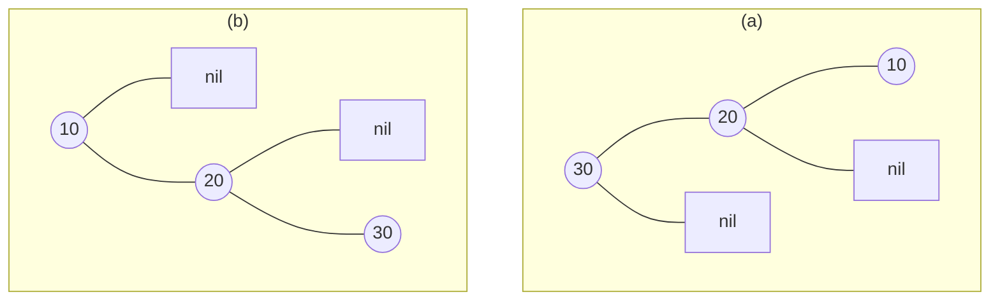
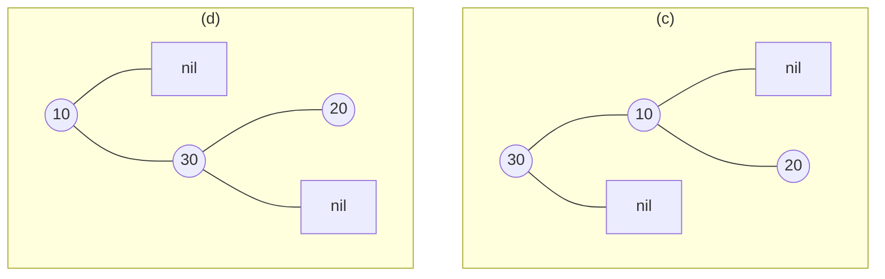
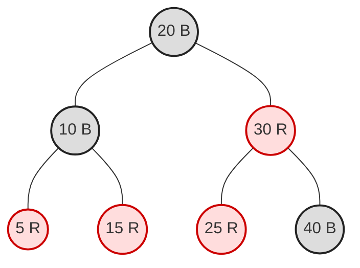

# Chapter 35 · Exercises

## The chapter in brief

- A binary search tree's height is a consequence of **arrival order**, not of
  the data — and sorted input degrades it to a chain of height $n-1$
  ([35.1](01-rotations.md)).
- Many different tree shapes hold the same keys, and all of them share one
  in-order traversal, so reshaping is always legal.
- A **rotation** re-points three pointers in $O(1)$: it changes the shape and
  leaves the in-order traversal untouched.
- A single rotation fixes a subtree that leans *straight*; a **double
  rotation** fixes a zig-zag by promoting the middle key.
- The **AVL invariant** is one inequality at *every* node —
  $\lvert h_L - h_R \rvert \le 1$ — enforced with a cached height per node
  ([35.2](02-avl.md)).
- Rebalancing has exactly four cases (LL, RR, LR, RL), chosen by the sign of
  the balance factor and of the heavy child's.
- Insert needs at most one rotation site; **delete can rotate at every level**
  on the path back up.
- An AVL tree is never more than about $1.44\log_2 n$ tall, because its
  sparsest shape follows the Fibonacci recurrence.
- A **red-black tree** swaps that single inequality for five colour
  properties, and P5 — equal black-heights — is the one doing the balancing
  ([35.3](03-red-black.md)).
- Colouring the newcomer red keeps P5 free, so insertion only ever repairs P4,
  in at most two rotations; deletion is the genuinely hard operation.
- A **B-tree** changes the cost model from comparisons to **block reads**, and
  a node sized to one disk block answers a billion-key query in four
  ([35.4](04-b-trees.md)).
- B-trees grow *upward* by splitting the root and shrink by merging, which is
  why all leaves stay at the same depth without a single rotation.

### Key terms

| Term | What it means |
| --- | --- |
| [rotation](../concept-index.md#r) | three-pointer re-link that changes shape and preserves in-order order |
| double rotation | two rotations that lift the middle key of a zig-zag |
| [balance factor](../concept-index.md#b) | $h(\text{left}) - h(\text{right})$; legal values are $-1$, $0$, $+1$ |
| [AVL tree](../concept-index.md#a) | BST where every balance factor is in $[-1, +1]$ |
| [red-black tree](../concept-index.md#r) | BST balanced by five colour properties instead of heights |
| black-height | black nodes on any path from a node down to a NIL leaf |
| [B-tree](../concept-index.md#b) | wide search tree with all leaves at equal depth, sized to a disk block |
| B+ tree | B-tree with data only in the leaves and the leaves linked left to right |
| node split | full node halves, median rises into the parent — how a B-tree grows |
| [invariant](../concept-index.md#i) | a promise the structure keeps between every operation |
| [$O(\log n)$](../appendix/B-big-o.md) | the guarantee every structure in this chapter exists to protect |

Now put it to work. Balanced trees reward pencil work: draw the tree, name the
case, apply the rule — *then* run the code and see whether the machine agrees
with you. The first three exercises are paper-first on purpose; the last one
is a small engineering project.

### Exercise 35.1 — Name the rotation ●

Four subtrees have just become unbalanced after an insert. For each, give
the balance factor of the top node, name the case (LL, RR, LR, or RL), and
say which rotation or pair of rotations repairs it. Do all four on paper
before running anything.





??? success "Solution"

    (a) balance factor $+2$, left child left-heavy → **LL** →
    `rotate_right(30)`.
    (b) balance factor $-2$, right child right-heavy → **RR** →
    `rotate_left(10)`.
    (c) balance factor $+2$, left child right-heavy → **LR** →
    `rotate_left(10)` then `rotate_right(30)`.
    (d) balance factor $-2$, right child left-heavy → **RL** →
    `rotate_right(30)` then `rotate_left(10)`.

    ```python
    class N:
        def __init__(self, k, left=None, right=None):
            self.k, self.left, self.right = k, left, right

    def h(n):
        return -1 if n is None else 1 + max(h(n.left), h(n.right))

    def bf(n):
        return h(n.left) - h(n.right)

    def case_of(z):
        if bf(z) > 1:
            return "LL -> rotate_right(z)" if bf(z.left) >= 0 else \
                   "LR -> rotate_left(z.left), rotate_right(z)"
        if bf(z) < -1:
            return "RR -> rotate_left(z)" if bf(z.right) <= 0 else \
                   "RL -> rotate_right(z.right), rotate_left(z)"
        return "balanced"

    trees = {
        "(a)": N(30, N(20, N(10))),
        "(b)": N(10, None, N(20, None, N(30))),
        "(c)": N(30, N(10, None, N(20))),
        "(d)": N(10, None, N(30, N(20))),
    }
    for label, root in trees.items():
        print(f"{label} root {root.k}, balance factor {bf(root):+d}: {case_of(root)}")
    ```

    The whole decision is two balance factors: the sign of the top node's
    tells you which side is heavy, and the sign of the heavy child's tells
    you whether the lean is straight (single rotation) or a zig-zag (double).

### Exercise 35.2 — Predict the AVL tree ●

Insert `50, 25, 75, 10, 30, 60, 90, 5` into an empty AVL tree, one key at a
time. Before running anything, write down: (a) the final height, (b) the
root key, and (c) how many rotations fired along the way. Then check.

??? success "Solution"

    Height 3, root 50, **zero** rotations. The sequence was chosen to arrive
    pre-balanced: 50 splits the range, 25 and 75 split the halves, and the
    next four fill the third level. Only the final key, 5, deepens a path,
    and it deepens it by exactly one — no balance factor ever leaves
    $[-1, +1]$.

    ```python
    class Node:
        __slots__ = ("key", "left", "right", "height")
        def __init__(self, key):
            self.key, self.left, self.right, self.height = key, None, None, 0

    def h(n):
        return -1 if n is None else n.height

    rotations = 0

    def rot_right(y):
        global rotations
        rotations += 1
        x = y.left
        y.left, x.right = x.right, y
        y.height = 1 + max(h(y.left), h(y.right))
        x.height = 1 + max(h(x.left), h(x.right))
        return x

    def rot_left(x):
        global rotations
        rotations += 1
        y = x.right
        x.right, y.left = y.left, x
        x.height = 1 + max(h(x.left), h(x.right))
        y.height = 1 + max(h(y.left), h(y.right))
        return y

    def rebalance(n):
        n.height = 1 + max(h(n.left), h(n.right))
        balance = h(n.left) - h(n.right)
        if balance > 1:
            if h(n.left.left) < h(n.left.right):
                n.left = rot_left(n.left)
            return rot_right(n)
        if balance < -1:
            if h(n.right.right) < h(n.right.left):
                n.right = rot_right(n.right)
            return rot_left(n)
        return n

    def insert(n, key):
        if n is None:
            return Node(key)
        if key < n.key:
            n.left = insert(n.left, key)
        elif key > n.key:
            n.right = insert(n.right, key)
        else:
            return n
        return rebalance(n)

    root = None
    for key in [50, 25, 75, 10, 30, 60, 90, 5]:
        root = insert(root, key)
        print(f"after {key:>2}: root {root.key}, height {h(root)}, "
              f"rotations so far {rotations}")
    ```

    Now change the sequence to `5, 10, 25, 30, 50, 60, 75, 90` and re-run:
    same keys, same final set, but seven rotations and still height 3. The
    tree defends itself.

### Exercise 35.3 — Hand-execute a B-tree split ●

A B-tree with minimum degree $t = 2$ (order 4, so 1–3 keys per node) starts
empty. Insert `1, 2, 3, 4, 5, 6, 7` in order. On paper, draw the tree after
each insert. Which insertions cause a split, which key rises each time, and
what is the final height?

??? success "Solution"

    Splits happen on the insertions of **4** and **6**. Inserting 4 finds
    the root `[1, 2, 3]` full, so median **2** rises into a new root.
    Inserting 6 finds the leaf `[3, 4, 5]` full, so median **4** rises into
    the root, giving root `[2, 4]`. Final height: 1 (two levels).

    ```python
    from bisect import bisect_left

    class BNode:
        def __init__(self, leaf=True):
            self.keys, self.children, self.leaf = [], [], leaf

    class BTree:
        def __init__(self, t=2):
            self.t, self.root = t, BNode()

        def insert(self, key):
            if len(self.root.keys) == 2 * self.t - 1:
                fresh = BNode(leaf=False)
                fresh.children.append(self.root)
                self.root = fresh
                self._split(fresh, 0)
            self._insert_nonfull(self.root, key)

        def _split(self, parent, i):
            t, full = self.t, parent.children[i]
            median = full.keys[t - 1]
            right = BNode(leaf=full.leaf)
            right.keys, full.keys = full.keys[t:], full.keys[:t - 1]
            if not full.leaf:
                right.children, full.children = full.children[t:], full.children[:t]
            parent.keys.insert(i, median)
            parent.children.insert(i + 1, right)
            print(f"    split: median {median} rises")

        def _insert_nonfull(self, node, key):
            i = bisect_left(node.keys, key)
            if node.leaf:
                node.keys.insert(i, key)
                return
            if len(node.children[i].keys) == 2 * self.t - 1:
                self._split(node, i)
                if key > node.keys[i]:
                    i += 1
            self._insert_nonfull(node.children[i], key)

        def rows(self):
            out, level = [], [self.root]
            while level:
                out.append("   ".join(str(n.keys) for n in level))
                level = [c for n in level for c in n.children]
            return out

    tree = BTree(t=2)
    for key in range(1, 8):
        print(f"insert {key}")
        tree.insert(key)
        for depth, row in enumerate(tree.rows()):
            print(f"    depth {depth}: {row}")
    ```

    Notice that the tree got taller exactly once, when the *root* split. A
    B-tree cannot grow at the bottom, which is precisely why all its leaves
    stay at the same depth.

### Exercise 35.4 — Write `is_avl` from scratch ●●

Without looking back at [35.2](02-avl.md), write a function `is_avl(node)`
that returns `True` only if *every* node satisfies
$\lvert h(\text{left}) - h(\text{right})\rvert \le 1$. It must run in
$O(n)$ — a version that calls a separate `height()` at every node is
$O(n^2)$ and will not count. Test it on a balanced tree, a chain, and a
tree that is balanced at the root but broken two levels down.

??? success "Solution"

    The trick is to have the recursion return the height *and* signal
    failure in one pass. Returning $-\infty$ (or a sentinel) for a broken
    subtree lets the failure propagate without a second traversal.

    ```python
    class Node:
        def __init__(self, key, left=None, right=None):
            self.key, self.left, self.right = key, left, right

    BROKEN = float("-inf")

    def _height_or_broken(node):
        """Height of the subtree, or BROKEN if the AVL rule fails inside it."""
        if node is None:
            return -1
        left = _height_or_broken(node.left)
        if left == BROKEN:
            return BROKEN
        right = _height_or_broken(node.right)
        if right == BROKEN:
            return BROKEN
        if abs(left - right) > 1:
            return BROKEN
        return 1 + max(left, right)

    def is_avl(node):
        return _height_or_broken(node) != BROKEN

    def chain(keys):
        root = Node(keys[0])
        node = root
        for k in keys[1:]:
            node.right = Node(k)
            node = node.right
        return root

    balanced = Node(4, Node(2, Node(1), Node(3)), Node(6, Node(5), Node(7)))
    # balanced at the root (heights 1 and 2) but node 6 is a chain
    sneaky = Node(4, Node(2, Node(1), Node(3)),
                     Node(6, None, Node(7, None, Node(8))))

    for label, tree in (("perfect tree", balanced),
                        ("chain of 5  ", chain([1, 2, 3, 4, 5])),
                        ("sneaky tree ", sneaky),
                        ("empty tree  ", None)):
        print(f"{label}: is_avl = {is_avl(tree)}")
    ```

    Each node is visited once and does $O(1)$ work, so the whole check is
    $O(n)$. The "sneaky" case is the one that catches naive checkers: the
    root's two subtrees have heights 1 and 2, a legal difference — the
    violation is at node 6, whose sides are $-1$ and $1$.

### Exercise 35.5 — Repair a red-black colouring ●●

Here is a red-black tree whose colours have been tampered with. Node values
and shape are correct; exactly one colour is wrong.



Which of the five properties is violated, at which node, and what single
colour change repairs the whole tree? Answer on paper, then verify with a
validator.

??? success "Solution"

    P4 is violated at node **30**: it is red and its left child 25 is also
    red. The repair is to repaint **25 black**. The tempting alternative —
    darkening 30 instead — silences P4 but immediately breaks P5, because
    the path 20→30→40→NIL would then carry one more black node than
    20→30→25→NIL. Only one of the two ends the argument.

    ```python
    RED, BLACK = "red", "black"

    class RB:
        def __init__(self, key, color, left=None, right=None):
            self.key, self.color, self.left, self.right = key, color, left, right

    def validate(root):
        if root is not None and root.color != BLACK:
            return "P2 violated: the root is red"
        found = []

        def bh(n):
            if n is None:
                return 1
            if n.color == RED:
                for kid, side in ((n.left, "left"), (n.right, "right")):
                    if kid is not None and kid.color == RED:
                        found.append(f"P4 violated: red {n.key} has red "
                                     f"{side} child {kid.key}")
            left, right = bh(n.left), bh(n.right)
            if found:
                return 0
            if left != right:
                found.append(f"P5 violated at {n.key}: {left} vs {right}")
                return 0
            return left + (n.color == BLACK)

        bh(root)
        return found[0] if found else "all five properties hold"

    def build(color_30, color_25):
        return RB(20, BLACK,
                  RB(10, BLACK, RB(5, RED), RB(15, RED)),
                  RB(30, color_30, RB(25, color_25), RB(40, BLACK)))

    print("as drawn      :", validate(build(RED, RED)))
    print("30 -> black   :", validate(build(BLACK, RED)))
    print("25 -> black   :", validate(build(RED, BLACK)))
    ```

    ```text
    as drawn      : P4 violated: red 30 has red left child 25
    30 -> black   : P5 violated at 30: 1 vs 2
    25 -> black   : all five properties hold
    ```

    The middle line is the lesson: silencing P4 by darkening the *parent*
    immediately trips P5. Red-black repairs always have to keep both
    properties in view at once — which is exactly why the insertion fix-up
    needs three interacting cases rather than one rule.

### Exercise 35.6 — Measure the height growth ●●

Claims are cheap. Build plain BSTs, AVL trees, and red-black trees over the
same key sets for $n = 100, 500, 1000, 5000$, twice each — once with
shuffled keys and once with sorted keys — and tabulate the heights against
$\log_2 n$. Then plot the sorted-input case. Which curve is not a logarithm?

??? success "Solution"

    ```python
    import math, random
    import matplotlib.pyplot as plt

    class Node:
        __slots__ = ("key", "left", "right", "height")
        def __init__(self, key):
            self.key, self.left, self.right, self.height = key, None, None, 0

    def h(n):
        return -1 if n is None else n.height

    def rot_right(y):
        x = y.left
        y.left, x.right = x.right, y
        y.height = 1 + max(h(y.left), h(y.right))
        x.height = 1 + max(h(x.left), h(x.right))
        return x

    def rot_left(x):
        y = x.right
        x.right, y.left = y.left, x
        x.height = 1 + max(h(x.left), h(x.right))
        y.height = 1 + max(h(y.left), h(y.right))
        return y

    def avl_insert(n, key):
        if n is None:
            return Node(key)
        if key < n.key:
            n.left = avl_insert(n.left, key)
        elif key > n.key:
            n.right = avl_insert(n.right, key)
        else:
            return n
        n.height = 1 + max(h(n.left), h(n.right))
        balance = h(n.left) - h(n.right)
        if balance > 1:
            if h(n.left.left) < h(n.left.right):
                n.left = rot_left(n.left)
            return rot_right(n)
        if balance < -1:
            if h(n.right.right) < h(n.right.left):
                n.right = rot_right(n.right)
            return rot_left(n)
        return n

    def bst_height(keys):
        """Iterative plain insert; a sorted chain would blow the stack."""
        root = Node(keys[0])
        for k in keys[1:]:
            node = root
            while True:
                if k < node.key:
                    if node.left is None:
                        node.left = Node(k); break
                    node = node.left
                else:
                    if node.right is None:
                        node.right = Node(k); break
                    node = node.right
        height, level = -1, [root]
        while level:
            height += 1
            level = [c for n in level for c in (n.left, n.right) if c]
        return height

    rng = random.Random(35)
    sizes = [100, 500, 1000, 5000]
    plain_sorted, avl_sorted = [], []

    print(f"{'n':>6} {'log2 n':>7} {'BST rand':>9} {'BST sorted':>11} "
          f"{'AVL rand':>9} {'AVL sorted':>11}")
    for n in sizes:
        ordered = list(range(n))
        shuffled = ordered[:]
        rng.shuffle(shuffled)

        avl_r = avl_s = None
        for k in shuffled:
            avl_r = avl_insert(avl_r, k)
        for k in ordered:
            avl_s = avl_insert(avl_s, k)

        plain_sorted.append(bst_height(ordered))
        avl_sorted.append(h(avl_s))
        print(f"{n:>6} {math.log2(n):>7.1f} {bst_height(shuffled):>9} "
              f"{bst_height(ordered):>11} {h(avl_r):>9} {h(avl_s):>11}")

    plt.plot(sizes, plain_sorted, "o-", label="plain BST, sorted input")
    plt.plot(sizes, avl_sorted, "s-", label="AVL, sorted input")
    plt.plot(sizes, [math.log2(n) for n in sizes], "--", label="log2(n)")
    plt.xlabel("number of keys n")
    plt.ylabel("tree height (edges)")
    plt.title("Height growth under sorted insertion")
    plt.legend()
    ```

    ```text
         n  log2 n  BST rand  BST sorted  AVL rand  AVL sorted
       100     6.6        11          99         7           6
       500     9.0        17         499        10           8
      1000    10.0        23         999        11           9
      5000    12.3        26        4999        14          12
    ```

    The plain-BST-on-sorted-input column is exactly $n-1$ — a straight
    diagonal that leaves the plot behind entirely. Every other column hugs
    $\log_2 n$, and the AVL numbers are the *smallest* of all, because
    inserting sorted keys into an AVL tree produces a near-perfect tree. Note
    also that a *random* plain BST does fine; it is the adversarial ordering
    that destroys it, which is exactly the failure mode balancing removes.

### Exercise 35.7 — Range queries on linked leaves ●●

Using the B+ tree from [35.4](04-b-trees.md), answer this: for a tree with
$m = 4$ over the keys $0, 10, 20, \ldots, 190$, how many blocks does
`range(45, 125)` read, and how does that compare with running `get()`
separately for every key in the range? Write the code that measures both.

??? success "Solution"

    ```python
    from bisect import bisect_left, bisect_right

    class Leaf:
        def __init__(self):
            self.keys, self.rows, self.next, self.leaf = [], [], None, True

    class Internal:
        def __init__(self):
            self.keys, self.children, self.leaf = [], [], False

    class BPlus:
        def __init__(self, m=4):
            self.m, self.root = m, Leaf()

        def insert(self, key, row):
            split = self._insert(self.root, key, row)
            if split:
                sep, right = split
                new_root = Internal()
                new_root.keys, new_root.children = [sep], [self.root, right]
                self.root = new_root

        def _insert(self, node, key, row):
            if node.leaf:
                i = bisect_left(node.keys, key)
                node.keys.insert(i, key)
                node.rows.insert(i, row)
                if len(node.keys) <= self.m - 1:
                    return None
                mid = len(node.keys) // 2
                right = Leaf()
                right.keys, right.rows = node.keys[mid:], node.rows[mid:]
                node.keys, node.rows = node.keys[:mid], node.rows[:mid]
                right.next, node.next = node.next, right
                return right.keys[0], right
            i = bisect_right(node.keys, key)
            split = self._insert(node.children[i], key, row)
            if not split:
                return None
            sep, child = split
            node.keys.insert(i, sep)
            node.children.insert(i + 1, child)
            if len(node.keys) <= self.m - 1:
                return None
            mid = len(node.keys) // 2
            rising = node.keys[mid]
            right = Internal()
            right.keys, right.children = node.keys[mid+1:], node.children[mid+1:]
            node.keys, node.children = node.keys[:mid], node.children[:mid+1]
            return rising, right

        def _descend(self, key):
            node, blocks = self.root, 0
            while not node.leaf:
                blocks += 1
                node = node.children[bisect_right(node.keys, key)]
            return node, blocks + 1

        def get(self, key):
            leaf, blocks = self._descend(key)
            i = bisect_left(leaf.keys, key)
            hit = i < len(leaf.keys) and leaf.keys[i] == key
            return (leaf.rows[i] if hit else None), blocks

        def range(self, low, high):
            leaf, blocks = self._descend(low)
            hits = []
            while leaf is not None:
                for key, row in zip(leaf.keys, leaf.rows):
                    if key > high:
                        return hits, blocks
                    if key >= low:
                        hits.append((key, row))
                leaf = leaf.next
                if leaf is not None:
                    blocks += 1
            return hits, blocks

    index = BPlus(m=4)
    for key in range(0, 200, 10):
        index.insert(key, f"row-{key}")

    hits, scan_blocks = index.range(45, 125)
    print("matches       :", [k for k, _ in hits])
    print("range() blocks:", scan_blocks)

    probe_blocks = sum(index.get(k)[1] for k, _ in hits)
    print("one get() per match blocks:", probe_blocks)
    print("saving:", probe_blocks - scan_blocks, "block reads")
    ```

    ```text
    matches       : [50, 60, 70, 80, 90, 100, 110, 120]
    range() blocks: 7
    one get() per match blocks: 24
    saving: 17 block reads
    ```

    Seven blocks against twenty-four for the same eight rows. Every `get()`
    pays the full descent from the root; the range scan pays it **once** and
    then walks sideways at one block per leaf. The gap grows
    linearly with the size of the range and with the height of the tree,
    which is why a database planner will choose an index range scan over
    repeated point lookups whenever it expects more than a handful of rows.

### Exercise 35.8 — AVL deletion, with proof ●●●

The tree below inserts and rebalances correctly but cannot delete. Add a
`delete(key)` that removes a key and restores the AVL invariant, then prove
it works with a randomized stress test: build trees of random size from
random keys, delete every key in random order, and after **each** deletion
assert that (a) the AVL invariant holds at every node, (b) every cached
height is correct, and (c) the in-order traversal equals the sorted list of
surviving keys. Finally, report the largest number of rotations a single
deletion required, and explain why it is larger than the insert bound.

```python
class Node:
    __slots__ = ("key", "left", "right", "height")
    def __init__(self, key):
        self.key, self.left, self.right, self.height = key, None, None, 0

def h(n):
    return -1 if n is None else n.height

class AVL:
    def __init__(self):
        self.root, self.rotations = None, 0

    def _rot_right(self, y):
        self.rotations += 1
        x = y.left
        y.left, x.right = x.right, y
        y.height = 1 + max(h(y.left), h(y.right))
        x.height = 1 + max(h(x.left), h(x.right))
        return x

    def _rot_left(self, x):
        self.rotations += 1
        y = x.right
        x.right, y.left = y.left, x
        x.height = 1 + max(h(x.left), h(x.right))
        y.height = 1 + max(h(y.left), h(y.right))
        return y

    def _rebalance(self, n):
        n.height = 1 + max(h(n.left), h(n.right))
        balance = h(n.left) - h(n.right)
        if balance > 1:
            if h(n.left.left) - h(n.left.right) < 0:
                n.left = self._rot_left(n.left)
            return self._rot_right(n)
        if balance < -1:
            if h(n.right.left) - h(n.right.right) > 0:
                n.right = self._rot_right(n.right)
            return self._rot_left(n)
        return n

    def insert(self, key):
        self.root = self._insert(self.root, key)

    def _insert(self, n, key):
        if n is None:
            return Node(key)
        if key < n.key:
            n.left = self._insert(n.left, key)
        elif key > n.key:
            n.right = self._insert(n.right, key)
        else:
            return n
        return self._rebalance(n)

    def in_order(self):
        out, stack, node = [], [], self.root
        while stack or node:
            while node:
                stack.append(node)
                node = node.left
            node = stack.pop()
            out.append(node.key)
            node = node.right
        return out

    # delete(key) is missing -- that is the exercise

tree = AVL()
for k in range(1, 32):
    tree.insert(k)
print("height after 31 sorted inserts:", h(tree.root))
print("delete implemented?", hasattr(AVL, "delete"))
```

??? success "Solution"

    Deletion is Chapter 20's three cases plus one line: return
    `self._rebalance(node)` instead of `node` on the way back up. The subtle
    part is the two-child case — after copying the successor's key down, you
    must delete the *successor* from the right subtree, and that recursive
    call rebalances the right subtree before this node rebalances itself.

    ```python
    import random

    class Node:
        __slots__ = ("key", "left", "right", "height")
        def __init__(self, key):
            self.key, self.left, self.right, self.height = key, None, None, 0

    def h(n):
        return -1 if n is None else n.height

    class AVL:
        def __init__(self):
            self.root, self.rotations = None, 0

        def _rot_right(self, y):
            self.rotations += 1
            x = y.left
            y.left, x.right = x.right, y
            y.height = 1 + max(h(y.left), h(y.right))
            x.height = 1 + max(h(x.left), h(x.right))
            return x

        def _rot_left(self, x):
            self.rotations += 1
            y = x.right
            x.right, y.left = y.left, x
            x.height = 1 + max(h(x.left), h(x.right))
            y.height = 1 + max(h(y.left), h(y.right))
            return y

        def _rebalance(self, n):
            n.height = 1 + max(h(n.left), h(n.right))
            balance = h(n.left) - h(n.right)
            if balance > 1:
                if h(n.left.left) - h(n.left.right) < 0:
                    n.left = self._rot_left(n.left)
                return self._rot_right(n)
            if balance < -1:
                if h(n.right.left) - h(n.right.right) > 0:
                    n.right = self._rot_right(n.right)
                return self._rot_left(n)
            return n

        def insert(self, key):
            self.root = self._insert(self.root, key)

        def _insert(self, n, key):
            if n is None:
                return Node(key)
            if key < n.key:
                n.left = self._insert(n.left, key)
            elif key > n.key:
                n.right = self._insert(n.right, key)
            else:
                return n
            return self._rebalance(n)

        # ---- the new part
        def delete(self, key):
            self.root = self._delete(self.root, key)

        def _delete(self, n, key):
            if n is None:
                return None
            if key < n.key:
                n.left = self._delete(n.left, key)
            elif key > n.key:
                n.right = self._delete(n.right, key)
            else:
                if n.left is None:
                    return n.right                    # 0 or 1 child
                if n.right is None:
                    return n.left
                successor = n.right                    # 2 children
                while successor.left is not None:
                    successor = successor.left
                n.key = successor.key
                n.right = self._delete(n.right, successor.key)
            return self._rebalance(n)                  # <- the one-line fix

        def in_order(self):
            out, stack, node = [], [], self.root
            while stack or node:
                while node:
                    stack.append(node)
                    node = node.left
                node = stack.pop()
                out.append(node.key)
                node = node.right
            return out

    def audit(node):
        """(a) balanced everywhere and (b) every cached height correct."""
        def check(n):
            if n is None:
                return -1
            left, right = check(n.left), check(n.right)
            assert abs(left - right) <= 1, f"unbalanced at {n.key}"
            real = 1 + max(left, right)
            assert n.height == real, f"stale height at {n.key}"
            return real
        check(node)

    rng = random.Random(1962)
    deletions = worst = 0
    for trial in range(30):
        keys = rng.sample(range(2000), rng.randint(20, 200))
        tree = AVL()
        for k in keys:
            tree.insert(k)
        alive = keys[:]
        order = keys[:]
        rng.shuffle(order)
        for k in order:
            before = tree.rotations
            tree.delete(k)
            worst = max(worst, tree.rotations - before)
            alive.remove(k)
            audit(tree.root)                                    # (a) and (b)
            assert tree.in_order() == sorted(alive)             # (c)
            deletions += 1

    print(f"{deletions} deletions across 30 trees: invariant, cached heights,"
          f" and order all verified after every one")
    print("largest rotation count for a single deletion:", worst)
    ```

    An insert can only make a subtree *taller*, and the single rotation that
    repairs it restores the subtree to its original height — so no ancestor
    is affected and the repair stops immediately. A delete makes a subtree
    *shorter*, and the rotation that rebalances it can shorten it again,
    leaving the parent one short. The fix therefore propagates, and on a tall
    tree a single deletion can rotate at many levels — still $O(\log n)$
    total, but no longer $O(1)$ rotations.
