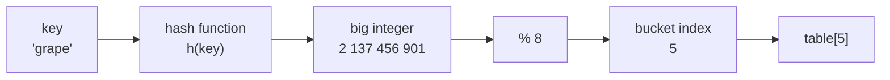
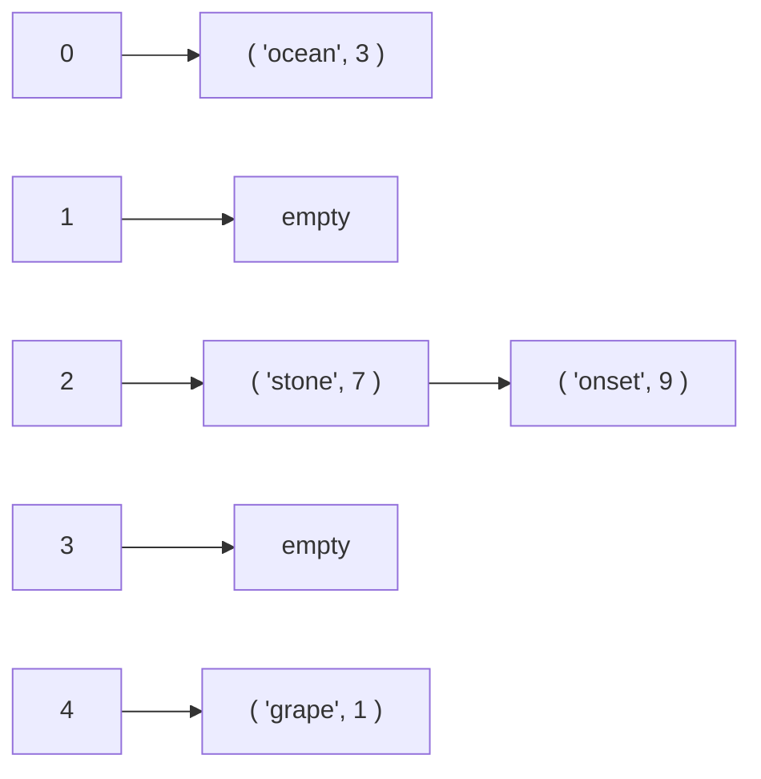

# 36.1 Hash tables from scratch

You have used a hash table in every chapter since [Chapter 14](../ch14-beyond/01-collections-tour.md).
Every `counts[word] += 1`, every `if name in seen`, every `d.get(key, 0)`
went through one. What you have never done is open it. This section builds
a working `dict` out of a plain list and one arithmetic idea, and the idea
is so blunt it feels like cheating: **stop searching for the key and compute
where it must be instead**.

## The $O(1)$ promise, measured first

Start with the claim, because it is the strangest one in this book. Looking
something up in a list means comparing against elements until you find it —
$O(n)$, and [Chapter 22](../ch22-sorting/03-searching.md) got that down to
$O(\log n)$ by sorting first. A hash table claims $O(1)$: the same cost for
ten keys and for ten million. Before explaining how, let us watch it
happen.

```python
import random, time

rng = random.Random(36)
LIST_PROBES, DICT_PROBES = 100, 20_000   # the dict is so fast it needs more

print(f"{'n':>8} {'list scan (us)':>16} {'dict lookup (us)':>18}")
for n in (1_000, 4_000, 16_000, 64_000):
    keys = [f"key{i}" for i in range(n)]
    as_list = keys[:]                          # unsorted list
    as_dict = {k: i for i, k in enumerate(keys)}

    probes = [keys[rng.randrange(n)] for _ in range(LIST_PROBES)]
    t0 = time.perf_counter()
    for p in probes:
        p in as_list
    t_list = (time.perf_counter() - t0) / LIST_PROBES * 1e6

    probes = [keys[rng.randrange(n)] for _ in range(DICT_PROBES)]
    t0 = time.perf_counter()
    for p in probes:
        p in as_dict
    t_dict = (time.perf_counter() - t0) / DICT_PROBES * 1e6

    print(f"{n:>8} {t_list:>16.1f} {t_dict:>18.3f}")
```

```text
       n   list scan (us)   dict lookup (us)
    1000              2.1              0.028
    4000              9.8              0.029
   16000             33.9              0.039
   64000            133.1              0.069
```

The absolute microsecond numbers depend on your machine; the *shape* does not.
Multiply $n$ by four and the list scan takes four times longer, dead on — a
64-fold growth from top to bottom.

The dict column grows by a factor of two over the same range, and that is not
the algorithm: it is the CPU cache, which stops holding the whole table once
it gets big. Algorithmically the dict column is flat, and that flat line is
the whole subject of this section.

### Direct addressing: when the key *is* the index

The base case is easy to believe. If your keys happened to be the integers
$0, 1, \dots, 9$, you would not search at all — you would index:

```python
# A "direct address table": the key IS the index. Zero comparisons.
names = [None] * 10
names[3] = "Ada"
names[7] = "Grace"
print("id 3 ->", names[3])
print("id 7 ->", names[7])
```

```text
id 3 -> Ada
id 7 -> Grace
```

That is genuinely $O(1)$, and it is useless, because real keys are not small
integers. They are strings like `"grape"`, or nine-digit student ids, or
tuples. A direct address table for nine-digit ids needs a billion slots to
hold thirty students.

### A hash table is direct addressing with a translator in front

The translator is a *hash function*: it turns any key into an integer, and a
modulo squashes that integer into a legal index. Look-up becomes three moves —
compute, index, done.

!!! tip "The one idea behind the whole chapter"

    A hash table does not **search** for the key. It **computes the key's
    address**. There is no path to walk and no comparisons to count, so the
    cost never learns how many keys are stored — which is exactly why it does
    not grow with $n$.



## What makes a hash function good

Four requirements, and they pull against each other.

1. **Deterministic.** The same key must produce the same number every time
   within one program run. Break this and you can never find anything
   again.
2. **Uniform.** Outputs should spread over the whole index range with no
   favourites. Clumping is the enemy: every key that lands in a crowded
   bucket pays a linear search inside it.
3. **Fast.** It runs on *every* operation. A hash that costs more than the
   search it replaces is a bad trade.
4. **Avalanche.** Changing one bit of the key should change about half the
   bits of the output. Real keys come in families — `user_0001`,
   `user_0002` — and a hash without avalanche maps a family to a clump.

Requirements 2 and 4 are the ones beginners underestimate, so we are going
to measure them rather than assert them.

## Three hash functions, side by side

Here are three. The first sums character codes — the obvious first idea,
and the one nearly everyone writes first. The second is **djb2**, Daniel
Bernstein's classic string hash: multiply by 33 and add, keeping 32 bits.
The third is Python's built-in `hash`, a tuned industrial function
(CPython uses SipHash for strings and bytes).

```python
WORDS = """
apple bread chair dance eagle flame grape house ivory joker knife lemon
maple night ocean paper queen river stone table under vivid water xenon
yield zebra alpha gamma delta actor badge cabin dealt eager fable gauge
habit inlet jelly kneel latch mango noble opera panel quilt roast salad
tiger ultra vapor wagon yeast zonal amber blend cargo depth elbow fjord
glaze hinge input joint karma layer merit nerve olive pitch quart raven
sight track upset value wharf xylem youth zesty acorn brave crane drift
ember frost glide honey index jumbo koala lunar mirth novel orbit prism
quest ridge spice trend urban vigor waltz yacht blaze cider donor equip
flint grove haste irony jolly knack loyal moral nudge onset plaid quiet
rally shine thumb usher vault wound yodel zilch angle broad cheap dozen
exact fetch giant hotel imply judge kiosk livid mount naval optic price
quirk rough spend theme unite vocal weave yearn zoned notes tones bleat
epics cried dicer
""".split()

def weak_hash(s):
    """Sum the character codes. Simple, fast -- and badly broken."""
    return sum(ord(c) for c in s)

def djb2(s):
    """Bernstein's classic: h = h*33 + c, kept to 32 bits."""
    h = 5381
    for c in s:
        h = (h * 33 + ord(c)) & 0xFFFFFFFF
    return h

print(f"{len(WORDS)} words, all five letters, all distinct\n")
print(f"{'hash':<10}{'distinct outputs':>18}{'smallest':>12}{'largest':>12}{'span':>12}")
w = [weak_hash(s) for s in WORDS]
d = [djb2(s) for s in WORDS]
print(f"{'weak_hash':<10}{len(set(w)):>18}{min(w):>12}{max(w):>12}{max(w)-min(w):>12}")
print(f"{'djb2':<10}{len(set(d)):>18}{min(d):>12}{max(d):>12}{max(d)-min(d):>12}")
print(f"{'hash':<10}{len(set(hash(s) for s in WORDS)):>18}"
      f"{'(varies)':>12}{'(varies)':>12}{'(varies)':>12}")
```

```text
159 words, all five letters, all distinct

hash        distinct outputs    smallest     largest        span
weak_hash                 55         499         575          76
djb2                     159   252869080   282946821    30077741
hash                     159    (varies)    (varies)    (varies)
```

Read that first row again. **One hundred and fifty-nine distinct words
produce only fifty-five distinct hash values**, all crammed into a span of
76. The table has not even been sized yet and the weak hash has already
thrown away two-thirds of the information. Two reasons, both fatal:

- Addition does not care about order, so every **anagram** collides.
- Five letters between `a` (97) and `z` (122) can only sum to something
  between 485 and 610 — a range of 126 values, no matter how many words you
  feed it. Fewer possible outputs than keys means collisions are
  *arithmetically unavoidable*, not merely likely.

`djb2`'s span looks narrow too — 30 million out of a possible 4.3 billion,
because every word here has exactly five letters. But 30 million distinct
possibilities for 159 keys is room to spare, and, decisively, its *low* bits
vary freely: those are the bits the modulo will keep.

The built-in `hash` and `djb2` keep all 159 apart. Notice that we printed
`(varies)` for the built-in: CPython randomizes string hashing at interpreter
start-up, so the actual numbers differ every time you press Run.
[Section 36.2](02-collisions-resizing.md) explains why that is a security
feature.

**Never write a program that depends on a specific value of
`hash("some string")`** — and never print one as expected output.

```python
# continues
for family in (["stone", "onset", "notes", "tones"],
               ["cider", "cried", "dicer"],
               ["spice", "epics"],
               ["table", "bleat"]):
    print(f"{', '.join(family):<28} weak: "
          f"{[weak_hash(x) for x in family]}  "
          f"djb2 all different: "
          f"{len(set(djb2(x) for x in family)) == len(family)}")
```

```text
stone, onset, notes, tones   weak: [553, 553, 553, 553]  djb2 all different: True
cider, cried, dicer          weak: [519, 519, 519]  djb2 all different: True
spice, epics                 weak: [532, 532]  djb2 all different: True
table, bleat                 weak: [520, 520]  djb2 all different: True
```

## The centrepiece: where do the keys actually land?

A hash value is not an address yet. The last step is the **modulo**: with $m$
buckets, key $k$ lives in bucket $h(k) \bmod m$. Now we can ask the question
that matters — after that squash, how evenly are the 159 words spread over 128
buckets?

### Two yardsticks: chi-squared and empty buckets

The standard measure is the **chi-squared statistic**. With $n$ keys in $m$
buckets, each bucket expects $\bar c = n/m$ keys, and

$$ \chi^2 = \sum_{i=0}^{m-1} \frac{(c_i - \bar c)^2}{\bar c} $$

measures total deviation from that ideal. A genuinely uniform hash gives
$\chi^2 \approx m$; the bigger the number, the worse the clumping. Empty
buckets are the second yardstick: scattering $n$ balls into $m$ bins at
random leaves about $m e^{-n/m}$ bins empty.

```python
# continues
import math
import matplotlib.pyplot as plt

M = 128

def bucket_counts(fn, words, m=M):
    counts = [0] * m
    for word in words:
        counts[fn(word) % m] += 1
    return counts

def chi_squared(counts, n):
    expected = n / len(counts)
    return sum((c - expected) ** 2 / expected for c in counts)

n = len(WORDS)
print(f"{n} words into {M} buckets "
      f"(uniform would give chi2 ~ {M}, ~{M * math.exp(-n / M):.0f} empty)\n")
print(f"{'hash':<12}{'chi2':>9}{'empty':>8}{'fullest':>9}")

fns = [("weak_hash", weak_hash), ("djb2", djb2), ("built-in hash", hash)]
all_counts = []
for name, fn in fns:
    counts = bucket_counts(fn, WORDS)
    all_counts.append(counts)
    print(f"{name:<12}{chi_squared(counts, n):>9.0f}"
          f"{counts.count(0):>8}{max(counts):>9}")

fig, axes = plt.subplots(3, 1, figsize=(8, 6), sharex=True, sharey=True)
for ax, (name, _), counts in zip(axes, fns, all_counts):
    ax.bar(range(M), counts, width=1.0)
    ax.set_ylabel("keys")
    ax.set_title(f"{name}: {counts.count(0)} of {M} buckets empty", fontsize=10)
axes[-1].set_xlabel("bucket index")
fig.tight_layout()
```

```text
159 words into 128 buckets (uniform would give chi2 ~ 128, ~37 empty)

hash             chi2   empty  fullest
weak_hash         351      73        7
djb2              143      40        8
built-in hash     140      42        5
```

The plot makes the failure visible in one glance. `djb2` and the built-in hash
produce a ragged but honest scatter across all 128 bars. `weak_hash` produces
**a wall and a desert**: buckets 0–63 and 115–127 hold everything, and buckets
64–114 are completely, structurally empty.

That is not bad luck. The word sums live in $[499, 575]$; take those mod 128
and you can only ever land in $\{115,\dots,127\} \cup \{0,\dots,63\}$.
Fifty-one of the 128 buckets are *unreachable* — two fifths of the table can
never be used, so the 77 that remain carry $159/77 \approx 2.1$ keys each
instead of $159/128 \approx 1.2$: about 1.7 times as crowded as they should
be.

The chi-squared numbers agree: 351 for the weak hash against roughly 128 for
an ideal one, and 73 empty buckets where uniformity predicts 37. (The built-in
hash's row shifts a little every run, since its string hashing is randomized —
another reminder not to hard-code those numbers.)

!!! tip "A small table hides a bad hash"

    Run the same experiment with `M = 32` and all three hashes score around
    31–34. With only 32 buckets the modulo wraps the weak hash's narrow
    range five times over and smears it out by accident. Bad hash functions
    look fine on small tables and fall apart exactly when the table grows —
    the worst possible failure schedule.

### Structured keys make it far worse

Real key sets are rarely a dictionary of English words. They are `user_0001`,
`order_2024_11_03`, `192.168.1.7` — families of near-identical strings, and
that is where the weak hash stops being merely poor and becomes a disaster.

```python
# continues
ids = [f"user_{i:04d}" for i in range(1, 201)]
print(f"{len(ids)} keys, {len(set(weak_hash(k) for k in ids))} distinct "
      f"weak_hash values, {len(set(djb2(k) for k in ids))} distinct djb2 values")
for name, fn in (("weak_hash", weak_hash), ("djb2", djb2)):
    counts = bucket_counts(fn, ids, 64)
    print(f"{name:<10} 64 buckets -> fullest {max(counts):>3} keys, "
          f"{counts.count(0):>2} empty, chi2 {chi_squared(counts, len(ids)):.0f}")
```

```text
200 keys, 19 distinct weak_hash values, 200 distinct djb2 values
weak_hash  64 buckets -> fullest  19 keys, 45 empty, chi2 654
djb2       64 buckets -> fullest  10 keys, 27 empty, chi2 231
```

Two hundred keys, **nineteen** distinct hash values. Every key shares a
prefix, so the sum only varies by the digit sum of the number — and
`user_0012`, `user_0021`, `user_0102` and `user_0201` are all the same key as
far as `weak_hash` is concerned. The table degenerates into nineteen linked
lists.

Look at djb2's row too, though: 231 is a long way from the ideal 64, and 27
empty buckets is far more than the 3 that uniformity predicts. djb2 gave every
key a distinct hash and still produced a lumpy table. That is not the hash
function's fault — it is the number 64's.

## Why table size matters: powers of two versus primes

The modulo step has a trap of its own. Taking $h \bmod 2^k$ keeps exactly
the **low $k$ bits** of $h$ and throws away everything above them. If those
low bits carry no information, neither does the bucket index.

```python
# Object ids, memory addresses, and record numbers are often aligned:
# they arrive as multiples of 8, 16, 64 ...
addresses = [i * 16 for i in range(64)]

for m in (64, 61):
    used = {a % m for a in addresses}
    print(f"table size {m:>3}: {len(used):>2} of {m} buckets used")
```

```text
table size  64:  4 of 64 buckets used
table size  61: 61 of 61 buckets used
```

Sixty-four keys, and a 64-slot power-of-two table puts them all into four
buckets, because every key ends in four zero bits. A prime-sized table of 61
uses every slot, because 61 shares no factor with 16 and the modulo therefore
mixes the high bits back in. **This is why classic textbook hash tables use
prime table sizes.**

### A good hash plus a bad table size

The trap is subtler than "avoid round numbers", and djb2 walks straight into
it. Its multiplier is 33, and $33 \equiv 1 \pmod{32}$ — so modulo 32, the
multiply does nothing at all and djb2 collapses into the weak
sum-of-characters hash plus a constant:

```python
# continues
def weak_hash(s):
    return sum(ord(c) for c in s)

def djb2(s):
    h = 5381
    for c in s:
        h = (h * 33 + ord(c)) & 0xFFFFFFFF
    return h

sample = ["grape", "user_0042", "hashing", "z"]
print("djb2(s) % 32 == (weak_hash(s) + 5381) % 32 for every string?",
      all(djb2(s) % 32 == (weak_hash(s) + 5381) % 32 for s in sample))

ids = [f"user_{i:04d}" for i in range(1, 201)]
for m in (32, 31):
    counts = [0] * m
    for k in ids:
        counts[djb2(k) % m] += 1
    exp = len(ids) / m
    chi = sum((c - exp) ** 2 / exp for c in counts)
    kind = "power of two" if m == 32 else "prime       "
    print(f"djb2 % {m} ({kind}): fullest {max(counts):>3}, chi2 {chi:>6.0f}")
```

```text
djb2(s) % 32 == (weak_hash(s) + 5381) % 32 for every string? True
djb2 % 32 (power of two): fullest  19, chi2    227
djb2 % 31 (prime       ): fullest  10, chi2     52
```

The same hash function, the same keys, one bucket count apart: a fullest
bucket of 19 versus 10, and a chi-squared four times worse. A good hash
function and a bad table size add up to a bad hash table.

!!! info "What real libraries do"

    Java's `HashMap` and CPython's `dict` both use power-of-two table sizes,
    because masking (`h & (m-1)`) is much faster than division. They pay for
    it by *stirring the bits first*: Java's `HashMap` applies
    `h ^ (h >>> 16)` so high bits influence low ones, and CPython's probe
    sequence mixes in the untouched high bits at every step. Prime sizes and
    bit-stirring are two solutions to the same problem — never do neither.

## A complete hash map

Everything so far assembles into one class. Collisions are handled by
**chaining**: each bucket holds a small list of `(key, value)` pairs, and a
lookup does one hash, one index, and then a short linear scan inside that
bucket only.



```python
_MISSING = object()          # a private sentinel: distinguishes "no default"

class HashMap:
    """A dict, built from a list of chains. Resizing arrives in 36.2."""

    def __init__(self, capacity=8):
        self._buckets = [[] for _ in range(capacity)]
        self._size = 0

    def _index(self, key):
        return hash(key) % len(self._buckets)

    def put(self, key, value):
        chain = self._buckets[self._index(key)]
        for i, (k, _) in enumerate(chain):
            if k == key:                      # already present: overwrite
                chain[i] = (key, value)
                return
        chain.append((key, value))            # new key: extend the chain
        self._size += 1

    def get(self, key, default=_MISSING):
        for k, v in self._buckets[self._index(key)]:
            if k == key:
                return v
        if default is _MISSING:
            raise KeyError(key)
        return default

    def remove(self, key):
        chain = self._buckets[self._index(key)]
        for i, (k, v) in enumerate(chain):
            if k == key:
                chain.pop(i)
                self._size -= 1
                return v
        raise KeyError(key)

    def __len__(self):
        return self._size

    def __contains__(self, key):
        return any(k == key for k, _ in self._buckets[self._index(key)])

    def __getitem__(self, key):
        return self.get(key)

    def __setitem__(self, key, value):
        self.put(key, value)

    def items(self):
        for chain in self._buckets:
            yield from chain

    def load_factor(self):
        return self._size / len(self._buckets)

    def chain_lengths(self):
        return [len(c) for c in self._buckets]


m = HashMap(capacity=16)
for word in "grape ocean stone onset table apple".split():
    m[word] = len(word)

print("len:", len(m), " load factor:", round(m.load_factor(), 3))
print("m['stone'] =", m["stone"])
print("'apple' in m:", "apple" in m, "  'mango' in m:", "mango" in m)
print("get with default:", m.get("mango", "not stored"))

m["stone"] = 99                                # overwrite, not append
print("after overwrite: len", len(m), "value", m["stone"])
print("removed:", m.remove("ocean"), " len now", len(m))
print("sorted contents:", sorted(m.items()))

try:
    m.remove("ocean")
except KeyError as e:
    print("second remove raises KeyError:", e)
```

```text
len: 6  load factor: 0.375
m['stone'] = 5
'apple' in m: True   'mango' in m: False
get with default: not stored
after overwrite: len 6 value 99
removed: 5  len now 5
sorted contents: [('apple', 5), ('grape', 5), ('onset', 5), ('stone', 99), ('table', 5)]
second remove raises KeyError: 'ocean'
```

That is a working dictionary in sixty lines.

### Stress-testing the chains

Now push all 159 words through it and look at the chains — the thing that
decides whether the $O(1)$ promise survives.

```python
# continues
WORDS = """
apple bread chair dance eagle flame grape house ivory joker knife lemon
maple night ocean paper queen river stone table under vivid water xenon
yield zebra alpha gamma delta actor badge cabin dealt eager fable gauge
habit inlet jelly kneel latch mango noble opera panel quilt roast salad
tiger ultra vapor wagon yeast zonal amber blend cargo depth elbow fjord
glaze hinge input joint karma layer merit nerve olive pitch quart raven
sight track upset value wharf xylem youth zesty acorn brave crane drift
ember frost glide honey index jumbo koala lunar mirth novel orbit prism
quest ridge spice trend urban vigor waltz yacht blaze cider donor equip
flint grove haste irony jolly knack loyal moral nudge onset plaid quiet
rally shine thumb usher vault wound yodel zilch angle broad cheap dozen
exact fetch giant hotel imply judge kiosk livid mount naval optic price
quirk rough spend theme unite vocal weave yearn zoned notes tones bleat
epics cried dicer
""".split()

big = HashMap(capacity=64)
for i, word in enumerate(WORDS):
    big.put(word, i)

lengths = big.chain_lengths()
print(f"{len(big)} keys, 64 buckets, load factor {big.load_factor():.2f}")
print(f"longest chain {max(lengths)}, empty buckets {lengths.count(0)}, "
      f"average non-empty chain {sum(lengths) / (64 - lengths.count(0)):.2f}")
print("every key retrievable:",
      all(big.get(w) == i for i, w in enumerate(WORDS)))
print("every key removable:",
      all(big.remove(w) == i for i, w in enumerate(WORDS)), " len now", len(big))
```

```text
159 keys, 64 buckets, load factor 2.48
longest chain 7, empty buckets 7, average non-empty chain 2.79
every key retrievable: True
every key removable: True  len now 0
```

A load factor of 2.48 and a longest chain of 7: a lookup costs one hash plus
at most seven comparisons, and *that number does not grow with the number of
keys as long as the table grows too*. Keeping it that way is
[Section 36.2](02-collisions-resizing.md)'s job. (Your chain numbers will
differ a little — the built-in `hash` is randomized per run, so the longest
chain here lands somewhere around five to seven.)

## Which keys are allowed: hashability

Try to use a list as a dictionary key and Python stops you:

```python
# raises TypeError
shopping = {}
shopping[["milk", "eggs"]] = 2      # a list as a key
```

```text
TypeError: unhashable type: 'list'
```

This is not Python being fussy. Look again at what `put` does: it computes
`hash(key) % len(self._buckets)` **once**, at insert time, and files the pair
in that bucket. If the key later changes, the hash changes, and the pair is
sitting in a bucket where nobody will ever look for it.

!!! note "The hashability rule"

    **A key's hash must never change while it is in the table.** Python
    enforces this the only way it can: only immutable objects are hashable.

Tuples of immutables are hashable; lists, dicts, and sets are not. A tuple
containing a list is not hashable either, because hashing a tuple hashes its
contents.

```python
ok = {("milk", 2): "aisle 3", (1, 2, 3): "coords", frozenset({1, 2}): "set key"}
print(sorted(ok.values()))

for candidate in [("a", "b"), ["a", "b"], {"a": 1}, ("a", ["b"])]:
    try:
        hash(candidate)
        verdict = "hashable"
    except TypeError as e:
        verdict = f"NOT hashable ({e})"
    print(f"{str(candidate):<16} {verdict}")
```

```text
['aisle 3', 'coords', 'set key']
('a', 'b')       hashable
['a', 'b']       NOT hashable (unhashable type: 'list')
{'a': 1}         NOT hashable (unhashable type: 'dict')
('a', ['b'])     NOT hashable (unhashable type: 'list')
```

## The contract: equal keys must have equal hashes

There is a second rule, and unlike the first one Python cannot enforce it for
you.

!!! note "The hash/equality contract"

    $$ a = b \;\Longrightarrow\; h(a) = h(b) $$

    Equal objects **must** hash equally. The reverse is not required: unequal
    objects may share a hash — that is just a collision, and chaining handles
    it.

Break this rule and nothing raises. The table simply misplaces things.

### Breaking it, way one: value equality with an identity hash

```python
class BadPoint:
    """__eq__ compares coordinates; __hash__ still compares identities."""
    def __init__(self, x, y):
        self.x, self.y = x, y

    def __eq__(self, other):
        return isinstance(other, BadPoint) and (self.x, self.y) == (other.x, other.y)

    __hash__ = object.__hash__          # <-- the bug: identity hash

    def __repr__(self):
        return f"BadPoint({self.x}, {self.y})"

a = BadPoint(1, 2)
b = BadPoint(1, 2)
print("a == b ?", a == b)

grid = {a: "first"}
grid[b] = "second"                       # "the same" key, written twice

print("entries in the dict:", len(grid))
print("grid[a] =", grid[a], "  grid[b] =", grid[b])
print("contents:", grid)
print("b in {a} ?", b in {a})
```

```text
a == b ? True
entries in the dict: 2
grid[a] = first   grid[b] = second
contents: {BadPoint(1, 2): 'first', BadPoint(1, 2): 'second'}
b in {a} ? False
```

Two keys the program itself calls equal, two separate entries, and a
dictionary printing what looks like the same key twice. No exception, no
warning — just a `dict` that quietly stopped being a mapping.

If this were a cache, you would compute the same expensive result twice. If it
were a set of visited states, your graph search would revisit everything.

### Breaking it, way two: hash a field and then mutate it

```python
class Tag:
    def __init__(self, name):
        self.name = name
    def __hash__(self):
        return hash(self.name)
    def __eq__(self, other):
        return isinstance(other, Tag) and self.name == other.name
    def __repr__(self):
        return f"Tag({self.name!r})"

t = Tag("draft")
notes = {t: "chapter one"}
print("before mutation:", t in notes, "->", notes[t])

t.name = "final"                          # the key mutates in place
print("after mutation, t in notes    :", t in notes)
print("after mutation, Tag('draft')  :", Tag("draft") in notes)
print("after mutation, Tag('final')  :", Tag("final") in notes)
print("but iteration still sees it   :", list(notes.items()))
print("len(notes) =", len(notes))
```

```text
before mutation: True -> chapter one
after mutation, t in notes    : False
after mutation, Tag('draft')  : False
after mutation, Tag('final')  : False
but iteration still sees it   : [(Tag('final'), 'chapter one')]
len(notes) = 1
```

The entry never left the table — `len` still says 1 and iteration still yields
it — but **no key can reach it any more**. The pair is filed in bucket
`hash("draft") % m`. `Tag("final")` hashes to a different bucket, and
`Tag("draft")` reaches the right bucket only to find a stored key that no
longer compares equal.

Data that exists, occupies memory, and is unreachable. This is precisely why
lists are unhashable.

## Doing it correctly

The fix is a two-line habit: **hash a tuple of exactly the fields that
`__eq__` compares, and make those fields immutable.**

```python
class Point:
    __slots__ = ("_x", "_y")             # no other attributes can be added

    def __init__(self, x, y):
        object.__setattr__(self, "_x", x)
        object.__setattr__(self, "_y", y)

    x = property(lambda self: self._x)   # read-only
    y = property(lambda self: self._y)

    def __eq__(self, other):
        if not isinstance(other, Point):
            return NotImplemented        # let the other type try
        return (self.x, self.y) == (other.x, other.y)

    def __hash__(self):
        return hash((self.x, self.y))    # same fields as __eq__, in a tuple

    def __repr__(self):
        return f"Point({self.x}, {self.y})"

p, q, r = Point(1, 2), Point(1, 2), Point(3, 4)
print("p == q:", p == q, " hashes equal:", hash(p) == hash(q))
print("p == r:", p == r)

grid = {p: "origin-ish"}
grid[q] = "overwritten"                  # q *is* p as far as the dict cares
print("entries:", len(grid), grid)
print("set of three points:", sorted({p, q, r}, key=lambda pt: (pt.x, pt.y)))
print("p != Point(1, 3):", p != Point(1, 3))

try:
    p.x = 99
except AttributeError as e:
    print("mutation blocked:", e)
```

```text
p == q: True  hashes equal: True
p == r: False
entries: 1 {Point(1, 2): 'overwritten'}
set of three points: [Point(1, 2), Point(3, 4)]
p != Point(1, 3): True
mutation blocked: property 'x' of 'Point' object has no setter
```

One entry, one set element, and the key cannot be mutated behind the
dictionary's back. In everyday code you would get all of this from
`@dataclass(frozen=True)`, which generates exactly these two methods — but
now you know what it generates and why.

Java states the same contract explicitly in the `Object` documentation, and
every Java course drills it:

=== "Python"

    ```python
    class Point:
        def __init__(self, x, y):
            self._x, self._y = x, y

        def __eq__(self, other):
            if not isinstance(other, Point):
                return NotImplemented
            return (self._x, self._y) == (other._x, other._y)

        def __hash__(self):
            return hash((self._x, self._y))
    ```

=== "Java"

    ```java
    public final class Point {
        private final int x, y;

        public Point(int x, int y) { this.x = x; this.y = y; }

        @Override
        public boolean equals(Object o) {
            if (this == o) return true;
            if (!(o instanceof Point)) return false;
            Point p = (Point) o;
            return x == p.x && y == p.y;
        }

        @Override
        public int hashCode() {
            return Objects.hash(x, y);   // same fields as equals()
        }
    }
    ```

!!! info "Java corner"

    Java's rule is word for word the one above: *if `a.equals(b)`, then
    `a.hashCode() == b.hashCode()`*. Override one without the other and
    `HashMap` and `HashSet` break in the same silent way. The difference is
    that Java hands you `Objects.hash(x, y)` as the tuple-hash equivalent,
    and that `hashCode()` returns a 32-bit `int` while Python's `__hash__`
    returns a machine-word-sized integer. Java's `record` types (Java 16+)
    generate both methods for you, exactly like Python's frozen dataclass.

!!! warning "Common mistakes"

    - **Writing `__eq__` and forgetting `__hash__`.** Python at least
      protects you here: defining `__eq__` sets `__hash__ = None`, so the
      class becomes unhashable and you get a `TypeError` rather than silent
      corruption. Java gives you no such warning.
    - **Hashing a field you later change.** The entry becomes unreachable
      while still occupying space and still appearing in iteration. Hash
      only immutable fields.
    - **Assuming `hash(x)` is stable across runs.** It is for `int`, but for
      `str` and `bytes` CPython randomizes it per process. Never persist a
      hash value to a file, a database, or a network protocol.
    - **Believing equal hashes mean equal keys.** They do not. Chained
      lookup must still compare keys with `==`; skipping that comparison
      turns every collision into a wrong answer.
    - **Picking a table size that shares factors with your keys.** Powers of
      two with an unstirred hash keep only the low bits — the single most
      common cause of "my hash table is mysteriously slow".

## Check your understanding

1. `weak_hash` gives `"stone"` and `"notes"` the same value. Is that a bug
   in the hash function or a bug in the hash table?

    ??? success "Answer"
        Neither, strictly — it is a *collision*, and collisions are legal and
        unavoidable ([36.2](02-collisions-resizing.md) proves it). The table
        still returns correct answers because `get` compares keys with `==`
        after finding the bucket. The problem with `weak_hash` is not that
        collisions exist but that it manufactures them wholesale: 159 words
        produce only 55 distinct values, so the chains grow long and the
        $O(1)$ promise degrades into a linear scan.

2. Predict before running: a table with 16 buckets stores the keys `"ab"`,
   `"ba"`, and `"c"` using `weak_hash`. Which buckets do they land in?

    ??? success "Answer"
        `ord('a') + ord('b') = 97 + 98 = 195`, and $195 \bmod 16 = 3$, for
        both `"ab"` and `"ba"` — they are anagrams, so they collide. `"c"` is
        99, and $99 \bmod 16 = 3$ as well. All three share bucket 3.
        ```python
        def weak_hash(s):
            return sum(ord(c) for c in s)
        for key in ("ab", "ba", "c"):
            print(key, weak_hash(key), weak_hash(key) % 16)
        ```

3. Why is a tuple usable as a dictionary key but a list is not, given that
   both are just ordered sequences?

    ??? success "Answer"
        Because a tuple cannot change after it is built, so its hash is
        stable for as long as it sits in a table. A list can be appended to
        or reassigned in place, which would change its hash and strand the
        entry in the wrong bucket. Python refuses to define `__hash__` for
        mutable built-in containers rather than let that happen. (A tuple
        that *contains* a list is also unhashable, because hashing a tuple
        hashes its elements.)

4. A colleague speeds up their hash map by skipping the `k == key`
   comparison inside the chain — "we already know the hash matched". What
   breaks, and how often?

    ??? success "Answer"
        Every collision now returns the wrong value. Sharing a bucket means
        sharing `h(k) % m`, not being the same key, and with $m$ buckets and
        $n$ keys collisions are routine — with 159 words in 64 buckets above,
        the fullest bucket held seven different keys. The hash narrows the
        search to one bucket; only `==` decides the answer.
