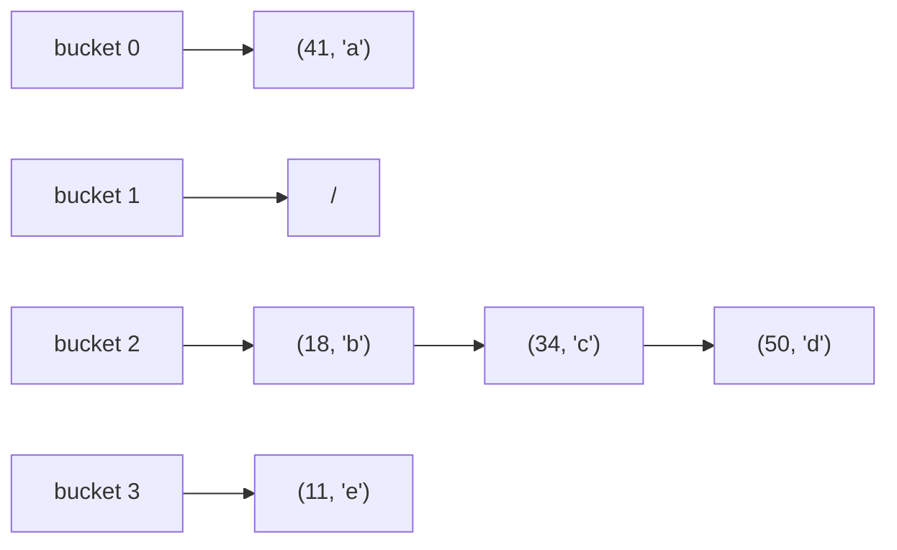
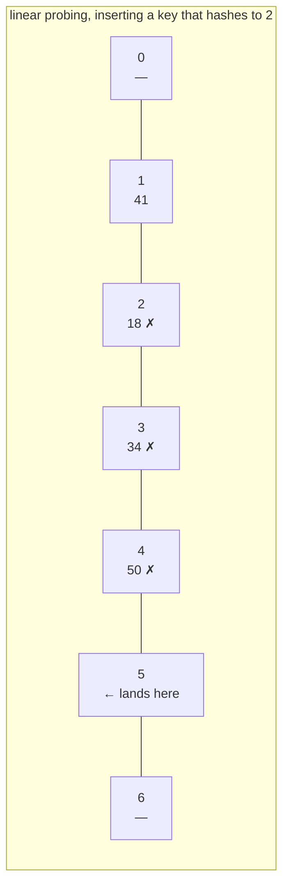

# 36.2 Collisions and resizing

[Section 36.1](01-hash-tables.md) built a hash table and left two promises
unpaid. It said the chains stay short "as long as the table grows too", and
it said lookup is $O(1)$ "on average" — with no account of what happens on a
bad day. This section pays both debts. Collisions turn out to be not an
occasional nuisance but a mathematical certainty that arrives far earlier
than intuition suggests, and everything interesting about hash table
engineering is a strategy for surviving them.

## Collisions are certain, and they arrive early

The easy half of the argument is the **pigeonhole principle**: put 159 words
into 128 buckets and at least one bucket holds two words. No hash function,
however brilliant, can avoid that.

The surprising half is how few keys it takes even when the table has room to
spare. This is the **birthday paradox** in disguise. Twenty-three people in
a room give a better-than-even chance that two share a birthday, even though
there are 365 days — because what matters is not people-versus-days but
*pairs* of people, and 23 people make 253 pairs.

For a table of $m$ buckets and $k$ keys hashed uniformly at random, the
probability that **all $k$ land in different buckets** is the product of
"each new key misses everything before it":

$$ P(\text{no collision}) = \prod_{i=0}^{k-1}\left(1 - \frac{i}{m}\right)
   \qquad\Longrightarrow\qquad
   P(\text{collision}) = 1 - \prod_{i=0}^{k-1}\left(1 - \frac{i}{m}\right) $$

Let us check that against a simulation rather than trusting it.

```python
import math, random

def p_collision(k, m):
    """Exact probability that k random keys collide in a table of m buckets."""
    p_clear = 1.0
    for i in range(k):
        p_clear *= (m - i) / m
    return 1 - p_clear

def first_collision(m, rng):
    """Insert random keys until one lands in an occupied bucket."""
    seen = set()
    k = 0
    while True:
        k += 1
        bucket = rng.randrange(m)
        if bucket in seen:
            return k
        seen.add(bucket)

rng = random.Random(36)
print(f"{'buckets m':>10} {'measured 1st collision':>24} {'sqrt(pi*m/2)+2/3':>19}")
for m in (365, 1000):
    trials = [first_collision(m, rng) for _ in range(2000)]
    print(f"{m:>10} {sum(trials) / len(trials):>24.2f} "
          f"{math.sqrt(math.pi * m / 2) + 2 / 3:>19.2f}")

print(f"\n{'keys k':>7} {'P(collision), m=365':>21} {'P(collision), m=1000':>22}")
for k in (10, 23, 30, 50, 70):
    print(f"{k:>7} {p_collision(k, 365):>21.3f} {p_collision(k, 1000):>22.3f}")

print()
for m in (365, 1_000, 1_000_000):
    k = 1
    while p_collision(k, m) < 0.5:
        k += 1
    print(f"m = {m:>9}: 50% chance of a collision after just {k:>5} keys "
          f"(1.177*sqrt(m) = {1.1774 * math.sqrt(m):.0f})")
```

```text
 buckets m   measured 1st collision    sqrt(pi*m/2)+2/3
       365                    24.91               24.61
      1000                    40.09               40.30

 keys k   P(collision), m=365   P(collision), m=1000
     10                 0.117                  0.044
     23                 0.507                  0.225
     30                 0.706                  0.356
     50                 0.970                  0.712
     70                 0.999                  0.916

m =       365: 50% chance of a collision after just    23 keys (1.177*sqrt(m) = 22)
m =      1000: 50% chance of a collision after just    38 keys (1.177*sqrt(m) = 37)
m =   1000000: 50% chance of a collision after just  1178 keys (1.177*sqrt(m) = 1177)
```

The simulation lands on the analytic estimate $\sqrt{\pi m/2}$ almost
exactly. And the last block is the number to remember: **a table with a
million buckets collides after about 1178 keys**, when it is 0.1% full.
Collisions are not an edge case to handle later; they are the normal
operating condition, and the whole design question is what to do about them.

There are two families of answers. **Separate chaining** keeps colliding
keys outside the table, in a list per bucket. **Open addressing** keeps
everything inside the table and, on a collision, goes looking for another
slot.

## Separate chaining, and why the load factor is the only number that matters



Define the **load factor**

$$ \alpha = \frac{n}{m} = \frac{\text{keys stored}}{\text{buckets available}} $$

With a uniform hash, each of the $n$ keys picks a bucket independently, so
the expected length of any one chain is exactly $\alpha$. An *unsuccessful*
search scans a whole chain: $\alpha$ comparisons. A *successful* search stops
halfway down, on average, giving the classic

$$ \text{probes(successful)} \;\approx\; 1 + \frac{\alpha}{2} $$

Notice what is missing from both formulas: $n$. A table with a hundred keys
in fifty buckets and one with a hundred million keys in fifty million
buckets have the same $\alpha$ and the same cost. **That, precisely, is
where the $O(1)$ comes from** — not from magic, but from a promise to grow
$m$ whenever $n$ grows.

```python
import random

M = 1021                                  # a prime table size

def chain_experiment(alpha, m=M, seed=0):
    n = int(alpha * m)
    keys = random.Random(seed).sample(range(10 ** 6), n)
    buckets = [[] for _ in range(m)]
    for k in keys:
        buckets[k % m].append(k)
    lengths = [len(b) for b in buckets]
    # a successful search scans until it hits its own key
    probes = sum(buckets[k % m].index(k) + 1 for k in keys) / n
    return sum(lengths) / m, max(lengths), probes

print(f"{'alpha':>6} {'avg chain':>10} {'= alpha?':>9} {'longest':>8} "
      f"{'probes':>8} {'1+a/2':>7}")
for alpha in (0.25, 0.5, 0.75, 1.0, 2.0, 4.0):
    avg, longest, probes = chain_experiment(alpha)
    print(f"{alpha:>6.2f} {avg:>10.2f} {str(abs(avg - alpha) < 0.01):>9} "
          f"{longest:>8} {probes:>8.2f} {1 + alpha / 2:>7.2f}")
```

```text
 alpha  avg chain  = alpha?  longest   probes   1+a/2
  0.25       0.25      True        3     1.11    1.12
  0.50       0.50      True        4     1.29    1.25
  0.75       0.75      True        5     1.38    1.38
  1.00       1.00      True        6     1.52    1.50
  2.00       2.00      True        8     2.01    2.00
  4.00       4.00      True       12     3.02    3.00
```

The average chain length *is* the load factor, to two decimal places, and
the measured probe count sits on $1 + \alpha/2$ every time. Note also how
gently chaining degrades: even at $\alpha = 4$ — four times more keys than
buckets — a successful search costs about three comparisons. Chaining never
breaks; it just gets slowly slower.

## Open addressing: no chains, one array

Chaining pays for its robustness with pointers. Every entry is a separate
list node somewhere else in memory, which is a cache miss per hop and an
allocation per insert. **Open addressing** stores every entry directly in the
table and resolves a collision by probing: if slot $h(k)$ is taken, try
another slot, and another, until an empty one appears. The sequence of slots
tried is the **probe sequence**, and the three classic choices differ only in
how they generate it.

$$
\begin{aligned}
\text{linear probing:}\quad & i_j = \bigl(h(k) + j\bigr) \bmod m \\
\text{quadratic probing:}\quad & i_j = \bigl(h(k) + j^2\bigr) \bmod m \\
\text{double hashing:}\quad & i_j = \bigl(h(k) + j \cdot h_2(k)\bigr) \bmod m
\end{aligned}
$$



Linear probing is the fastest per step — the next slot is the next cache
line, already in memory — and it has the worst failure mode. Occupied slots
merge into runs, and a run *grows at both ends*: any key hashing anywhere
inside a run of length $L$ ends up extending it. Long runs therefore get
longer faster than short ones. This is **primary clustering**, and it is
measurable.

```python
import random

M = 1021

def build_linear(keys, m=M):
    slots = [None] * m
    for k in keys:
        i = k % m
        while slots[i] is not None:
            i = (i + 1) % m
        slots[i] = k
    return slots

def cluster_lengths(slots):
    """Lengths of the maximal runs of occupied slots (wrapping around)."""
    m = len(slots)
    occupied = [s is not None for s in slots]
    start = occupied.index(False)                    # rotate to start on a gap
    occupied = occupied[start:] + occupied[:start]
    runs, current = [], 0
    for o in occupied:
        if o:
            current += 1
        elif current:
            runs.append(current)
            current = 0
    if current:
        runs.append(current)
    return runs

rng = random.Random(36)
print(f"{'alpha':>6}  {'strategy':<16}{'clusters':>9}{'longest run':>12}{'mean run':>10}")
for alpha in (0.5, 0.7, 0.9):
    n = int(alpha * M)
    keys = rng.sample(range(10 ** 6), n)

    probed = cluster_lengths(build_linear(keys))

    scattered = [None] * M                            # ideal: no clustering
    for j, slot in enumerate(rng.sample(range(M), n)):
        scattered[slot] = j
    ideal = cluster_lengths(scattered)

    print(f"{alpha:>6.2f}  {'linear probing':<16}{len(probed):>9}"
          f"{max(probed):>12}{sum(probed) / len(probed):>10.2f}")
    print(f"{'':>6}  {'random scatter':<16}{len(ideal):>9}"
          f"{max(ideal):>12}{sum(ideal) / len(ideal):>10.2f}")
```

```text
 alpha  strategy         clusters longest run  mean run
  0.50  linear probing        191          20      2.67
        random scatter        266          10      1.92
  0.70  linear probing        166          42      4.30
        random scatter        208          19      3.43
  0.90  linear probing         62         121     14.81
        random scatter         94          55      9.77
```

At 90% full, linear probing has produced a run of **121 consecutive occupied
slots** where scattering the same number of keys at random gives a worst run
of 55. Any key unlucky enough to hash into the front of that run walks the
whole thing.

**Quadratic probing** breaks up primary clustering by making the step grow:
$+1, +4, +9, +16, \dots$ Two keys with *different* home slots now diverge
instead of marching in lock-step. Two keys with the *same* home slot still
follow identical paths — that residue is called **secondary clustering**.
The price is a guarantee: with $m$ prime, $h + j^2$ visits only about half
the slots, so insertion is only guaranteed to succeed while $\alpha < 0.5$.

**Double hashing** removes secondary clustering too, by making the *step
size itself* depend on the key: $h_2(k)$ must never be zero and must be
coprime with $m$ (easy if $m$ is prime and $1 \le h_2(k) < m$). Two keys with
the same home slot now walk away from each other at different speeds, and
the resulting probe sequences behave almost exactly like independent random
choices — the theoretical ideal.

```python
import random

M = 1021                                     # prime, so any step 1..M-1 works

def linear_step(k, m):
    return 1

def double_step(k, m):
    return 1 + (k % (m - 1))                 # never 0, always coprime with m

def build(keys, step_fn, m=M):
    slots = [None] * m
    for k in keys:
        i, step = k % m, step_fn(k, m)
        while slots[i] is not None:
            i = (i + step) % m
        slots[i] = k
    return slots

def successful_probes(slots, keys, step_fn):
    m, total = len(slots), 0
    for k in keys:
        i, step, count = k % m, step_fn(k, m), 1
        while slots[i] != k:
            i = (i + step) % m
            count += 1
        total += count
    return total / len(keys)

rng = random.Random(2)
keys = rng.sample(range(10 ** 6), int(0.9 * M))
for name, step in (("linear probing", linear_step), ("double hashing", double_step)):
    table = build(keys, step)
    print(f"{name:<16} at alpha=0.90: {successful_probes(table, keys, step):.2f} "
          f"probes per successful search")
```

```text
linear probing   at alpha=0.90: 5.27 probes per successful search
double hashing   at alpha=0.90: 2.61 probes per successful search
```

## Deleting from an open-addressed table: the tombstone

Here is a bug that has shipped in real code more than once. In an
open-addressed table, a search stops at the first empty slot — that is what
makes an unsuccessful search fast. Now delete a key by simply emptying its
slot, and you have punched a hole in the middle of somebody else's probe
sequence.

```python
M = 8
slots = [None] * M

def insert(k):
    i = k % M
    while slots[i] is not None:
        i = (i + 1) % M
    slots[i] = k
    return i

def find(k):
    """Stop at the first empty slot -- the standard, and here fatal, rule."""
    i = k % M
    while slots[i] is not None:
        if slots[i] == k:
            return i
        i = (i + 1) % M
    return None

for k in (1, 9, 17):                 # 1 % 8 == 9 % 8 == 17 % 8 == 1
    print(f"insert {k:>2} -> slot {insert(k)}")
print("table:", slots)
print("find(17) ->", find(17), " (correct: 17 lives in slot 3)")

slots[2] = None                      # "delete" 9 by clearing its slot
print("\nafter clearing slot 2 (deleting 9):", slots)
print("find(17) ->", find(17), " <-- WRONG: reported missing")
print("...but 17 is still sitting in slot", slots.index(17))
```

```text
insert  1 -> slot 1
insert  9 -> slot 2
insert 17 -> slot 3
table: [None, 1, 9, 17, None, None, None, None]
find(17) -> 3  (correct: 17 lives in slot 3)

after clearing slot 2 (deleting 9): [None, 1, None, 17, None, None, None, None]
find(17) -> None  <-- WRONG: reported missing
...but 17 is still sitting in slot 3
```

Deleting 9 deleted 17 as well, as far as anyone can tell. The search for 17
starts at slot 1, steps to slot 2, finds it empty, and concludes — correctly,
by its own rule — that 17 was never inserted. The value is intact, occupying
memory, and permanently unreachable. No exception, no warning; just a table
that has started lying. Delete a few thousand keys from a busy cache and you
will lose entries you never touched.

The fix has a name: a **tombstone**. Deleting writes a special marker that
means *"something used to be here — keep probing"*. Searches walk past
tombstones; insertions may reuse them.

```python
EMPTY = None
TOMB = object()                        # a unique marker: "deleted, keep going"

class LinearProbeMap:
    """Open addressing with linear probing, tombstones, and resizing."""

    def __init__(self, capacity=8, max_load=0.5):
        self._keys = [EMPTY] * capacity
        self._vals = [EMPTY] * capacity
        self._size = 0                 # live entries
        self._used = 0                 # live entries + tombstones
        self.max_load = max_load
        self.probes = 0                # instrumentation

    def _slot(self, key):
        """Find the slot holding key, or the first place it could be put."""
        m = len(self._keys)
        i = hash(key) % m
        first_tomb = None
        while True:
            self.probes += 1
            k = self._keys[i]
            if k is EMPTY:
                return (first_tomb if first_tomb is not None else i), False
            if k is TOMB:
                if first_tomb is None:
                    first_tomb = i
            elif k == key:
                return i, True
            i = (i + 1) % m

    def put(self, key, value):
        i, found = self._slot(key)
        self._vals[i] = value
        if not found:
            if self._keys[i] is EMPTY:
                self._used += 1
            self._keys[i] = key
            self._size += 1
            if self._used > self.max_load * len(self._keys):
                self._resize(2 * len(self._keys))

    def get(self, key, default=None):
        i, found = self._slot(key)
        return self._vals[i] if found else default

    def remove(self, key):
        i, found = self._slot(key)
        if not found:
            raise KeyError(key)
        self._keys[i] = TOMB           # <-- the tombstone, not EMPTY
        self._vals[i] = EMPTY
        self._size -= 1
        return i

    def _resize(self, capacity):
        live = [(k, v) for k, v in zip(self._keys, self._vals)
                if k is not EMPTY and k is not TOMB]
        self._keys = [EMPTY] * capacity
        self._vals = [EMPTY] * capacity
        self._size = self._used = 0
        for k, v in live:              # tombstones evaporate here
            self.put(k, v)

    def __len__(self):
        return self._size

    def __contains__(self, key):
        return self._slot(key)[1]

    def layout(self):
        return ["." if k is EMPTY else "X" if k is TOMB else str(k)
                for k in self._keys]


t = LinearProbeMap(capacity=8, max_load=0.9)   # high load: no resize mid-demo
for k in (1, 9, 17):
    t.put(k, f"value of {k}")
print("layout:", t.layout())
print("get(17):", t.get(17))

t.remove(9)
print("\nafter remove(9):", t.layout(), "  ('X' is the tombstone)")
print("get(9) :", t.get(9))
print("get(17):", t.get(17), "  <-- still reachable, because the probe walks past X")
print("len:", len(t), " 17 in t:", 17 in t, " 9 in t:", 9 in t)

t.put(25, "value of 25")               # 25 % 8 == 1: reuses the tombstone
print("\nafter put(25):", t.layout())
```

```text
layout: ['.', '1', '9', '17', '.', '.', '.', '.']
get(17): value of 17

after remove(9): ['.', '1', 'X', '17', '.', '.', '.', '.']   ('X' is the tombstone)
get(9) : None
get(17): value of 17   <-- still reachable, because the probe walks past X
len: 2  17 in t: True  9 in t: False

after put(25): ['.', '1', '25', '17', '.', '.', '.', '.']
```

The tombstone in slot 2 keeps the road open to slot 3, and the next
insertion that probes through it reclaims the space. Note the two separate
counters in the class: `_size` counts live entries, `_used` counts live
entries *plus* tombstones. Resizing must be triggered by `_used`, because a
table full of tombstones is just as slow as a table full of keys even though
`len()` says it is empty. Rehashing drops the tombstones, which is why a
heavily churned table gets faster after a resize even when it holds the same
number of keys.

## Load factor and resizing

Now the experiment that ties the section together: **how does the cost of a
search actually grow with $\alpha$?** Theory says

$$
\begin{aligned}
\text{chaining, successful:}\quad & 1 + \tfrac{\alpha}{2} \\
\text{linear probing, successful:}\quad & \tfrac{1}{2}\left(1 + \tfrac{1}{1-\alpha}\right) \\
\text{double hashing, successful:}\quad & \tfrac{1}{\alpha}\ln\tfrac{1}{1-\alpha}
\end{aligned}
$$

Chaining's formula is a straight line. The other two have $1 - \alpha$ in a
denominator, which means they blow up as the table fills. Measure it.

```python
import math, random
import matplotlib.pyplot as plt

M, TRIALS = 1021, 6

def linear_step(k, m): return 1
def double_step(k, m): return 1 + (k % (m - 1))

def build(keys, step_fn, m=M):
    slots = [None] * m
    for k in keys:
        i, step = k % m, step_fn(k, m)
        while slots[i] is not None:
            i = (i + step) % m
        slots[i] = k
    return slots

def open_probes(keys, step_fn):
    slots = build(keys, step_fn)
    m, total = M, 0
    for k in keys:
        i, step, count = k % m, step_fn(k, m), 1
        while slots[i] != k:
            i = (i + step) % m
            count += 1
        total += count
    return total / len(keys)

def chain_probes(keys, m=M):
    buckets = [[] for _ in range(m)]
    for k in keys:
        buckets[k % m].append(k)
    return sum(buckets[k % m].index(k) + 1 for k in keys) / len(keys)

alphas = [0.1, 0.2, 0.3, 0.4, 0.5, 0.6, 0.7, 0.8, 0.85, 0.9, 0.95]
chain, linear, double = [], [], []
for a in alphas:
    n = int(a * M)
    c = l = d = 0.0
    for t in range(TRIALS):
        keys = random.Random(1000 + t).sample(range(10 ** 6), n)
        c += chain_probes(keys)
        l += open_probes(keys, linear_step)
        d += open_probes(keys, double_step)
    chain.append(c / TRIALS)
    linear.append(l / TRIALS)
    double.append(d / TRIALS)

print(f"{'alpha':>6} {'chaining':>9} {'1+a/2':>7} {'linear':>8} {'theory':>7} "
      f"{'double':>8} {'theory':>7}")
for a, c, l, d in zip(alphas, chain, linear, double):
    print(f"{a:>6.2f} {c:>9.2f} {1 + a / 2:>7.2f} {l:>8.2f} "
          f"{0.5 * (1 + 1 / (1 - a)):>7.2f} {d:>8.2f} "
          f"{math.log(1 / (1 - a)) / a:>7.2f}")

plt.plot(alphas, chain, "o-", label="chaining (measured)")
plt.plot(alphas, linear, "s-", label="linear probing (measured)")
plt.plot(alphas, double, "^-", label="double hashing (measured)")
fine = [a / 100 for a in range(5, 97)]
plt.plot(fine, [0.5 * (1 + 1 / (1 - a)) for a in fine], "--",
         color="0.5", label="linear probing (theory)")
plt.axvline(0.75, color="crimson", ls=":", label="typical resize threshold")
plt.xlabel("load factor  alpha = n / m")
plt.ylabel("probes per successful search")
plt.title("Why hash tables resize before they fill up")
plt.ylim(0, 8)
plt.legend()
```

```text
 alpha  chaining   1+a/2   linear  theory   double  theory
  0.10      1.04    1.05     1.05    1.06     1.05    1.05
  0.20      1.09    1.10     1.12    1.12     1.12    1.12
  0.30      1.14    1.15     1.20    1.21     1.20    1.19
  0.40      1.19    1.20     1.32    1.33     1.29    1.28
  0.50      1.24    1.25     1.49    1.50     1.38    1.39
  0.60      1.29    1.30     1.73    1.75     1.50    1.53
  0.70      1.34    1.35     2.13    2.17     1.69    1.72
  0.80      1.39    1.40     2.72    3.00     1.99    2.01
  0.85      1.42    1.43     3.38    3.83     2.20    2.23
  0.90      1.44    1.45     4.57    5.50     2.51    2.56
  0.95      1.46    1.48     7.68   10.50     3.14    3.15
```

There they are — the classic curves. Chaining crawls from 1.04 to 1.46 over
the entire range. Double hashing tracks its theory to two decimals. Linear
probing is fine up to about $\alpha = 0.7$ and then turns upward hard: 2.13
probes at 0.7, 4.57 at 0.9, 7.68 at 0.95. (Measured linear probing runs a
little *below* theory at high load because the formula assumes an infinitely
large table; with $m = 1021$ the clusters cannot grow without bound.)

That knee is why every real implementation resizes. The rule is simple:

> When $\alpha$ exceeds a threshold, allocate a table of double the size and
> **rehash every key into it**. You cannot copy slots across — bucket
> indices are computed modulo $m$, and $m$ just changed.

Java's `HashMap` resizes at $\alpha = 0.75$; CPython's `dict` grows when it
is two-thirds full; Rust's `HashMap` uses about 0.875 with a
cluster-friendly layout. All of them sit at or below the knee.

```python
class ResizingHashMap:
    """36.1's chaining map, plus the one rule that keeps it O(1)."""

    def __init__(self, capacity=8, max_load=0.75):
        self._buckets = [[] for _ in range(capacity)]
        self._size = 0
        self.max_load = max_load
        self.rehashes = 0
        self.pairs_moved = 0

    def _index(self, key, m=None):
        return hash(key) % (m or len(self._buckets))

    def put(self, key, value):
        chain = self._buckets[self._index(key)]
        for i, (k, _) in enumerate(chain):
            if k == key:
                chain[i] = (key, value)
                return
        chain.append((key, value))
        self._size += 1
        if self._size > self.max_load * len(self._buckets):
            self._grow()

    def get(self, key, default=None):
        for k, v in self._buckets[self._index(key)]:
            if k == key:
                return v
        return default

    def _grow(self):
        old = self._buckets
        new_capacity = 2 * len(old)
        self._buckets = [[] for _ in range(new_capacity)]
        for chain in old:
            for k, v in chain:
                self._buckets[self._index(k, new_capacity)].append((k, v))
                self.pairs_moved += 1
        self.rehashes += 1

    def capacity(self):
        return len(self._buckets)

    def __len__(self):
        return self._size


m = ResizingHashMap()
checkpoints = [8, 64, 512, 4096, 20000]
print(f"{'n inserted':>11}{'capacity':>10}{'load':>7}{'rehashes':>10}"
      f"{'pairs moved':>13}{'moved / n':>11}")
for n in range(1, 20001):
    m.put(f"key{n}", n)
    if n in checkpoints:
        print(f"{n:>11}{m.capacity():>10}{len(m) / m.capacity():>7.2f}"
              f"{m.rehashes:>10}{m.pairs_moved:>13}{m.pairs_moved / n:>11.2f}")
print("\nall values still correct:",
      all(m.get(f"key{i}") == i for i in range(1, 20001)))
```

```text
 n inserted  capacity   load  rehashes  pairs moved  moved / n
          8        16   0.50         1            7       0.88
         64       128   0.50         4           94       1.47
        512      1024   0.50         7          769       1.50
       4096      8192   0.50        10         6148       1.50
      20000     32768   0.61        12        24582       1.23
```

## Why doubling is free: amortized $O(1)$

A resize is expensive — it touches every key. If it happened often, the
$O(1)$ claim would be a lie. It does not, and the accounting is the same
one that made [Python's list append](../ch16-complexity/03-complexity-zoo.md)
amortized constant.

Growing from capacity 1 to capacity $2^t$ by doubling moves

$$ 1 + 2 + 4 + \dots + 2^{t-1} = 2^t - 1 < n $$

pairs in total, spread over $n$ insertions. Look at the `moved / n` column
above: it hovers around 1.5 and never grows. Each insert pays a constant
*average* price no matter how large the table gets — even though one insert
in every few thousand is individually expensive.

```python
n = 1_000_000
capacity, moved, resizes = 1, 0, 0
for size in range(1, n + 1):
    if size > capacity:
        moved += capacity          # rehash everything currently stored
        capacity *= 2
        resizes += 1
print(f"{n:,} inserts: {resizes} resizes, {moved:,} pairs moved "
      f"({moved / n:.2f} per insert)")
print("worst single insert touched", capacity // 2, "pairs")
print("amortized cost per insert: O(1); worst case for one insert: O(n)")
```

```text
1,000,000 inserts: 20 resizes, 1,048,575 pairs moved (1.05 per insert)
worst single insert touched 524288 pairs
amortized cost per insert: O(1); worst case for one insert: O(n)
```

A million inserts, twenty resizes, barely more than one move per insert.
That is the same "cheap on average, occasionally expensive" bargain as a
growing list — and it is why real-time systems, which cannot tolerate the
occasional half-million-element pause, sometimes prefer a balanced tree with
a *uniform* $O(\log n)$ cost over a hash table's spiky $O(1)$.

## The worst case, and the attacker who arranges it

Everything above assumed the hash spreads keys uniformly. If it does not,
every key lands in one bucket, the table becomes a linked list, and lookup
is $O(n)$. Building such a table is $O(n^2)$.

```python
import time

class FixedChainMap:
    def __init__(self, capacity=4096):
        self._buckets = [[] for _ in range(capacity)]

    def put(self, key, value):
        chain = self._buckets[hash(key) % len(self._buckets)]
        for i, (k, _) in enumerate(chain):
            if k == key:
                chain[i] = (key, value)
                return
        chain.append((key, value))


def fill_ms(keys, repeats=1):
    total = 0.0
    for _ in range(repeats):
        m = FixedChainMap()                     # allocation is not timed
        t0 = time.perf_counter()
        for k in keys:
            m.put(k, k)
        total += time.perf_counter() - t0
    return total * 1000 / repeats


fill_ms(list(range(2000)))                      # warm-up

print(f"{'n':>6} {'spread keys (ms)':>18} {'x prev':>8} "
      f"{'colliding keys (ms)':>21} {'x prev':>8}")
prev_good = prev_evil = None
for n in (250, 500, 1000, 2000):
    good = list(range(n))                       # spread over the buckets
    evil = [i * 4096 for i in range(n)]         # every one hashes to bucket 0

    t_good = fill_ms(good, repeats=20)
    t_evil = fill_ms(evil)

    g = "-" if prev_good is None else f"{t_good / prev_good:.1f}x"
    e = "-" if prev_evil is None else f"{t_evil / prev_evil:.1f}x"
    print(f"{n:>6} {t_good:>18.3f} {g:>8} {t_evil:>21.2f} {e:>8}")
    prev_good, prev_evil = t_good, t_evil
```

```text
     n   spread keys (ms)   x prev   colliding keys (ms)   x prev
   250              0.023        -                  0.40        -
   500              0.046     2.0x                  1.74     4.3x
  1000              0.104     2.3x                  8.05     4.6x
  2000              0.197     1.9x                 33.95     4.2x
```

Double $n$ and the honest column doubles — linear, as promised. The
adversarial column *quadruples*. That is $O(n^2)$ written in wall-clock
time: 2000 keys take 34 ms instead of a fifth of one, a 170-fold penalty,
and it gets worse with every key added.

Now make it an attack. A web server puts every query parameter of an
incoming request into a dictionary. If the attacker knows the hash function,
they can compute thousands of keys that all collide and send them in one
request. The server spends quadratic time parsing it, and a handful of small
requests take the machine down. This is **hash flooding**, and it was
demonstrated against most major web platforms at once in 2011.

The defence is to make the hash function unpredictable. CPython (since 3.3)
seeds string and bytes hashing with a random value chosen at interpreter
start-up, using SipHash — a function specifically designed to be
*keyed*, so that without the secret you cannot predict which keys collide.

Run the same one-line program three times in three fresh interpreters and
you get three different answers:

```console
$ python3 -c 'print(hash("collide me"))'
-8722809301133134159
$ python3 -c 'print(hash("collide me"))'
4406587261371806341
$ python3 -c 'print(hash("collide me"))'
1358962073531224195
```

Inside a single process the hash is rock solid — it has to be, or nothing
would ever be found again. Across processes it is deliberately, usefully
unpredictable:

```python
import sys

print("hash randomization enabled (1 = yes):", sys.flags.hash_randomization)
print("stable within this process:",
      hash("collide me") == hash("collide me"))
print("integers are NOT randomized:", hash(42) == 42, hash(-7) == -7)
print("...which is why the attack above used integer keys.")

# The practical rule, demonstrated: derive persistent ids from a *stable*
# hash, never from hash().
import hashlib
digest = hashlib.sha256(b"collide me").hexdigest()[:16]
print("stable across runs and machines:", digest)
```

```text
hash randomization enabled (1 = yes): 1
stable within this process: True
integers are NOT randomized: True True
...which is why the attack above used integer keys.
stable across runs and machines: ec100dc1f10af47a
```

The rule that follows: **never store, transmit, or compare a Python string
hash across processes.** If you need a hash value that survives — a cache
key on disk, a shard index, a content address — use `hashlib`, whose digests
are specified down to the byte.

Randomization raises the cost of an attack; it does not change the worst
case. Two other defences do:

- **Treeify long chains.** Java's `HashMap` (since Java 8) converts a bucket
  whose chain exceeds eight entries into a
  [red-black tree](../ch35-balanced-trees/03-red-black.md), turning the
  worst case from $O(n)$ into $O(\log n)$ per bucket.
- **Use a data structure with a guarantee.** A balanced tree is $O(\log n)$
  for *every* input, adversarial or not — which brings us to the comparison
  this whole chapter has been building toward.

## Hash table, balanced tree, or sorted array?

This is the table to remember, and its second row is the answer to the
question every beginner eventually asks: *why doesn't my dictionary keep
things in order?*

| | Hash table | [Balanced BST](../ch35-balanced-trees/index.md) | Sorted array |
|---|---|---|---|
| Lookup by key | $O(1)$ average | $O(\log n)$ | $O(\log n)$ binary search |
| Insert | $O(1)$ amortized | $O(\log n)$ | $O(n)$ — shifting |
| Delete | $O(1)$ average | $O(\log n)$ | $O(n)$ |
| Worst-case lookup | $O(n)$ | $O(\log n)$ **guaranteed** | $O(\log n)$ guaranteed |
| Ordered iteration | ✗ *impossible* | ✓ in-order walk, $O(n)$ | ✓ free |
| Min / max | $O(n)$ scan | $O(\log n)$ | $O(1)$ |
| Range query `a..b` | $O(n)$ scan | $O(\log n + k)$ | $O(\log n + k)$ |
| Predecessor / successor | $O(n)$ scan | $O(\log n)$ | $O(\log n)$ |
| Needs keys to be | hashable | comparable | comparable |
| Memory overhead | table slack + chains | 2–3 pointers per node | none |
| Cost profile | spiky (resizes) | uniform | uniform |

A hash table's speed comes from **destroying the order information**.
$h(\texttt{"apple"})$ and $h(\texttt{"banana"})$ are two unrelated numbers;
the fact that `"apple" < "banana"` is nowhere in the table, so there is no
cheaper way to list the keys in order than to collect them all and sort —
$O(n \log n)$, no better than starting from a plain list. A balanced tree
keeps that information in its shape, which is exactly why it can answer
"every key between 100 and 200" in $O(\log n + k)$ and why Java's `TreeMap`
exists alongside `HashMap`.

So the rule of thumb:

- **Membership, counting, caching, deduplication, symbol tables** — hash
  table. This is the overwhelming majority of uses, which is why `dict` is
  the default.
- **Ranges, ordering, "next larger", leaderboards, time-series windows** —
  balanced tree.
- **Built once and then only read** — sorted array plus binary search: the
  same $O(\log n)$ with a fraction of the memory and perfect cache
  behaviour.

!!! warning "Common mistakes"

    - **Deleting from an open-addressed table by clearing the slot.** Every
      key whose probe sequence passed through that slot becomes
      unreachable — and nothing raises. Always use a tombstone.
    - **Resizing on `len()` instead of on slots used.** Tombstones cost
      probes but not length. A table of 1000 tombstones and 3 keys reports
      length 3 and behaves like a table of 1003 entries.
    - **Copying buckets across on resize.** The bucket index is
      `hash(key) % m`, and `m` has changed. Every key must be rehashed.
    - **Running a table close to full.** Linear probing at $\alpha = 0.95$
      costs three times what it costs at 0.7, and unsuccessful searches are
      far worse than successful ones. Resize at 0.5–0.75.
    - **Assuming average means always.** $O(1)$ is an average over a
      well-behaved key distribution. Adversarial or merely unlucky keys give
      $O(n)$, and no amount of resizing helps when every key hashes to the
      same bucket.
    - **Reaching for a hash table when you need order.** If your next
      requirement is "…and list them sorted" or "…and find the nearest
      value", you wanted a tree.

## Check your understanding

1. A table has 1000 buckets and holds 30 keys. Would you bet on there being
   at least one collision?

    ??? success "Answer"
        Yes, but only just — the exact probability is 0.356, so the safer bet
        is *no collision*, at about 2:1 on. Push it to 38 keys and it becomes
        an even-money bet. The point is how few keys it takes: the table is
        3% full and a collision is already a serious possibility, because
        what matters is the number of *pairs*, which grows quadratically.

2. A colleague argues that since chaining degrades so gently — 3 probes at
   $\alpha = 4$ — resizing is a waste of time. What is wrong with that?

    ??? success "Answer"
        Nothing, for a fixed $\alpha$. The mistake is thinking $\alpha$ stays
        fixed. Without resizing, $m$ is constant and $\alpha = n/m$ grows
        linearly with the number of keys, so the average chain length grows
        linearly and lookup becomes $O(n)$. Resizing is exactly the mechanism
        that keeps $\alpha$ bounded, and it is what converts "cost depends on
        $\alpha$" into "cost is constant".

3. Predict before running: a linear-probing table with $m = 8$ contains
   keys 3, 11, 19 (all with home slot 3, stored in slots 3, 4, 5). You
   delete 11 by writing a tombstone. What does a search for 19 do, and what
   does a search for 27 do?

    ??? success "Answer"
        Searching for 19: slot 3 holds 3 (not a match), slot 4 holds a
        tombstone (keep going), slot 5 holds 19 — found, three probes.
        Searching for 27 (also home slot 3): slots 3, 4, 5 are non-empty or
        tombstoned, slot 6 is empty — search stops and reports "not found",
        four probes. A future insertion of 27 would prefer slot 4, the first
        tombstone seen.

4. Why can a hash table not offer `range(a, b)` in $O(\log n + k)$, while a
   balanced tree can?

    ??? success "Answer"
        Because a good hash function deliberately destroys the relationship
        between keys. Keys that are adjacent in sorted order land in
        unrelated buckets — that scattering is the entire source of the
        $O(1)$ lookup. To answer a range query the table must examine every
        bucket, $O(m + n)$. A balanced tree stores the ordering *in its
        shape*, so it can descend to `a` in $O(\log n)$ and then walk
        forward, touching only the $k$ answers.
