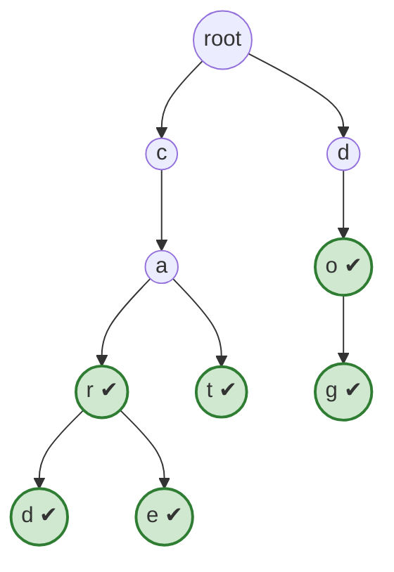
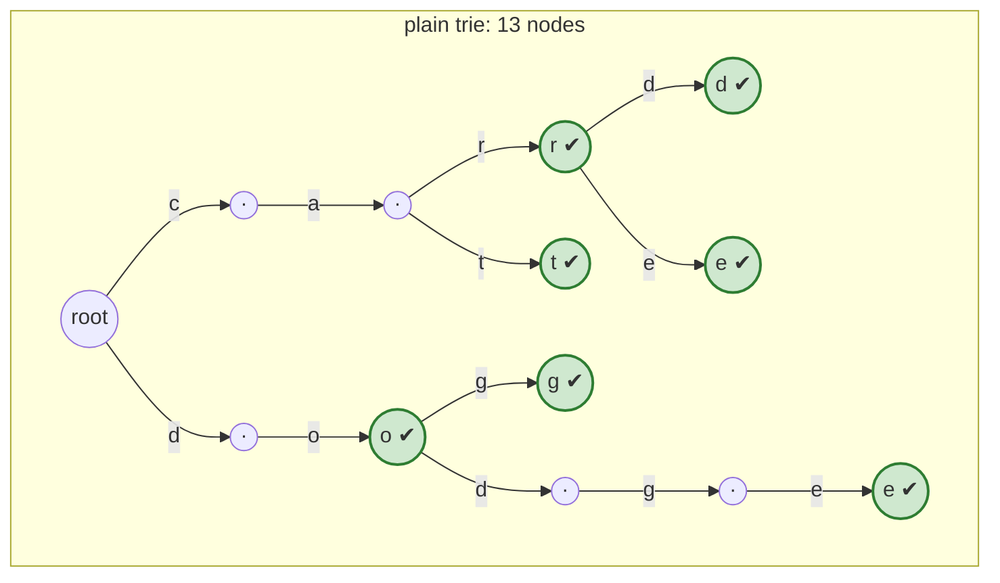
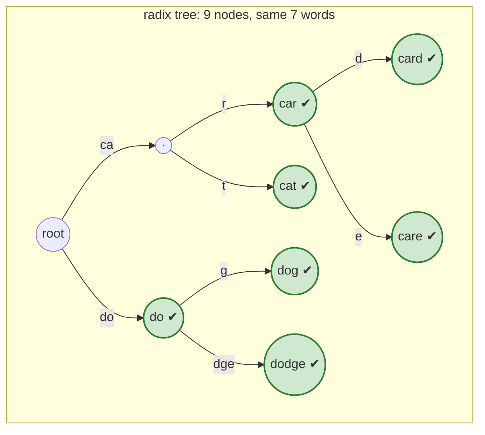

# 36.3 Tries

A hash table answers one question superbly and refuses every other. Ask it
"is `"program"` a word?" and it replies instantly. Ask it "which words start
with `"pro"`?" and it can only shrug and scan all $n$ keys, because
$h(\texttt{"pro"})$ has no relationship whatsoever to $h(\texttt{"program"})$
— scattering the keys was the entire point. This section builds the
structure that answers the second question, and it does so by making a
choice that sounds absurd at first: **stop storing the key at all**.

## The problem hash tables cannot solve

Three everyday features are all the same query in disguise:

- **Autocomplete.** You type `pro`, and the box offers `program`,
  `project`, `promise` — ranked, in a few milliseconds, over a dictionary of
  hundreds of thousands of words.
- **Longest-prefix matching.** A router holds a table of network prefixes
  and must find the *most specific* one containing a destination address.
  Every packet on the internet triggers one of these lookups.
- **Spell-checking and word breaking.** Is `"unhappiness"` a real word? Is
  `"unhap"` at least the start of one — worth continuing to read, or a dead
  end that lets you abandon this branch now?

A balanced tree ([Chapter 35](../ch35-balanced-trees/index.md)) can do the
first one, in a fashion: sorted order groups the `pro` words together, so you
binary-search to `"pro"` and walk forward.

But it pays for that three times over. Every comparison is a full string
comparison, the tree stores the whole of every key, and longest-prefix matching
over *bit* prefixes fits it badly. There is a structure built for exactly this
job.

## The idea: the key is the path

!!! abstract "In plain words"

    - **What it is.** A *trie* is a tree keyed by the letters of the words
      themselves: each step down spells one more character, so words that share
      a prefix share the same path until the point they differ.
    - **Picture it.** Think of a signpost tree where one road is marked "pro-".
      Everything reachable past that sign — `program`, `project`, `promise` —
      travels the same road until it forks on the next letter. Following the
      road *is* spelling the word.
    - **Why it matters.** Because shared prefixes share a path, a trie answers
      the very question a hash table cannot: "which stored keys start with
      `pro`?" You walk to the `pro` fork once, and everything hanging below it
      is the answer — the basis of autocomplete, spell-check, and IP routing.

A **trie** (from re*trie*val; most people say "try") stores a set of strings
in a tree where **each edge is labelled with one character, and a key is
spelled out by the path from the root to a node**. The nodes carry no keys.
Walk down `c`, `a`, `t` and you have arrived at the entry for `"cat"` —
without the string `"cat"` being stored anywhere.

That leaves one thing to record: which nodes are the ends of real words.
`"do"` and `"dog"` can both be in the set even though one is a prefix of the
other, so every node carries a boolean, the **end-of-word marker**.



Six words — `car`, `card`, `care`, `cat`, `do`, `dog` — in ten nodes counting
the root, because they share prefixes. Spelled out separately the six words are
19 characters; the trie stores 9. The green ✔ nodes end a word; the white ones
are merely waypoints.

Note carefully the two awkward cases in that picture:

- `"ca"` is a node but **not** a word.
- `"do"` is a node **and** a word, with a child hanging below it.

Those two are exactly what the end-of-word marker exists to distinguish, and
forgetting it is the classic first-trie bug: without the flag, `"ca"` and
`"dog"` become indistinguishable from `"cat"` and `"do"`.

Three consequences fall straight out of the picture:

1. Every operation costs one step per character: $O(L)$ for a key of length
   $L$, **with no dependence on how many keys the trie holds**.
2. Common prefixes are stored once. Ten thousand words starting with `"pre"`
   share three nodes.
3. All keys with a given prefix live in one subtree. Finding that subtree is
   $O(L)$; listing what is in it is proportional to the number of answers.

## A complete trie

The node is two fields: a dictionary from character to child, and a flag.

```python
class TrieNode:
    __slots__ = ("children", "is_word")

    def __init__(self):
        self.children = {}          # character -> TrieNode
        self.is_word = False        # does a key END here?


class Trie:
    def __init__(self):
        self.root = TrieNode()
        self._size = 0

    # ---- walking down, the operation everything else is built from
    def _node_for(self, prefix):
        """The node at the end of `prefix`, or None if the path breaks."""
        node = self.root
        for ch in prefix:
            node = node.children.get(ch)
            if node is None:
                return None
        return node

    def insert(self, word):
        node = self.root
        for ch in word:
            nxt = node.children.get(ch)
            if nxt is None:
                nxt = TrieNode()          # extend the path
                node.children[ch] = nxt
            node = nxt
        if node.is_word:
            return False                  # already present
        node.is_word = True
        self._size += 1
        return True

    def search(self, word):
        """Exact membership: the path exists AND ends on a word marker."""
        node = self._node_for(word)
        return node is not None and node.is_word

    def starts_with(self, prefix):
        """Is any stored key prefixed by this? The path existing is enough."""
        return self._node_for(prefix) is not None

    def collect_all_with_prefix(self, prefix, limit=None):
        """Every key beginning with `prefix`, in alphabetical order."""
        start = self._node_for(prefix)
        found = []
        if start is None:
            return found

        def dfs(node, path):              # depth-first, children in order
            if limit is not None and len(found) >= limit:
                return
            if node.is_word:
                found.append(prefix + "".join(path))
            for ch in sorted(node.children):
                path.append(ch)
                dfs(node.children[ch], path)
                path.pop()

        dfs(start, [])
        return found

    def __len__(self):
        return self._size

    def __contains__(self, word):
        return self.search(word)

    def node_count(self):
        total, stack = 0, [self.root]
        while stack:
            node = stack.pop()
            total += 1
            stack.extend(node.children.values())
        return total

    def paths(self):
        """Every node, named by the string that reaches it. For inspection."""
        out = []

        def walk(node, path):
            out.append(path + ("*" if node.is_word else ""))
            for ch in sorted(node.children):
                walk(node.children[ch], path + ch)

        walk(self.root, "")
        return out


t = Trie()
for word in ["car", "card", "care", "cat", "do", "dog"]:
    t.insert(word)

print("len:", len(t), " nodes:", t.node_count())
print("search('car')  :", t.search("car"))
print("search('ca')   :", t.search("ca"), "   <-- a path, but not a word")
print("starts_with('ca'):", t.starts_with("ca"))
print("starts_with('cz'):", t.starts_with("cz"))
print("'dog' in t:", "dog" in t)
print("prefix 'ca' ->", t.collect_all_with_prefix("ca"))
print("prefix 'car' ->", t.collect_all_with_prefix("car"))
print("prefix 'd'  ->", t.collect_all_with_prefix("d"))
print("prefix ''   ->", t.collect_all_with_prefix(""))
print("nodes named :", t.paths())
```

```text
len: 6  nodes: 10
search('car')  : True
search('ca')   : False    <-- a path, but not a word
starts_with('ca'): True
starts_with('cz'): False
'dog' in t: True
prefix 'ca' -> ['car', 'card', 'care', 'cat']
prefix 'car' -> ['car', 'card', 'care']
prefix 'd'  -> ['do', 'dog']
prefix ''   -> ['car', 'card', 'care', 'cat', 'do', 'dog']
nodes named : ['', 'c', 'ca', 'car*', 'card*', 'care*', 'cat*', 'd', 'do*', 'dog*']
```

`paths()` prints the diagram: ten nodes, named by the string that reaches each
one (the root is the empty string), with a `*` on the six that end a word.
`"ca"` appears with no star.

Notice the last line of output too. `collect_all_with_prefix("")` returns the
whole dictionary in sorted order for free, because a depth-first walk that
visits children in alphabetical order emits words in alphabetical order. **A
trie is a sorted container that never sorts anything.**

The collection is [recursion](../ch17-recursion/index.md) at its most
natural: *emit this node if it ends a word, then recurse into each child.*
The `path` list is the accumulator, pushed before the call and popped after
— the standard backtracking pattern.

## Deletion, and the rule that makes it subtle

Insertion only ever adds. Deletion has to decide whether to *remove* nodes, and
that decision is where every buggy trie goes wrong. Deleting `"card"` from our
trie must not disturb `"car"` or `"care"`; deleting `"car"` must not remove a
single node, because `"car"` is still the path to two other words.

!!! note "The prune rule"

    After clearing a word marker, walk back up. Delete a node **only if** it
    has no children **and** is not itself a word. Stop climbing at the first
    node that fails the test.

```python
# continues
def delete(self, word):
    """Remove `word`; return True if it was there. Prunes dead nodes only."""

    def prune(node, depth):
        if depth == len(word):
            if not node.is_word:
                return False                  # word was never in the trie
            node.is_word = False
            return True
        ch = word[depth]
        child = node.children.get(ch)
        if child is None:
            return False                      # path breaks: not present
        removed = prune(child, depth + 1)
        if removed and not child.is_word and not child.children:
            del node.children[ch]             # child is now useless
        return removed

    was_there = prune(self.root, 0)
    if was_there:
        self._size -= 1
    return was_there

Trie.delete = delete

t = Trie()
for word in ["car", "card", "care", "cat", "do", "dog"]:
    t.insert(word)

def show(label):
    print(f"{label:<22} nodes {t.node_count():>2}  {t.paths()}")

show("start")
for word in ["car", "card", "care", "do", "dog", "cat"]:
    ok = t.delete(word)
    show(f"delete({word!r}) -> {ok}")

print("\ndelete a word that is not there:", t.delete("zebra"))
print("delete a prefix that is not a word:", t.delete("ca"))
print("final size:", len(t), " final nodes:", t.node_count())
```

```text
start                  nodes 10  ['', 'c', 'ca', 'car*', 'card*', 'care*', 'cat*', 'd', 'do*', 'dog*']
delete('car') -> True  nodes 10  ['', 'c', 'ca', 'car', 'card*', 'care*', 'cat*', 'd', 'do*', 'dog*']
delete('card') -> True nodes  9  ['', 'c', 'ca', 'car', 'care*', 'cat*', 'd', 'do*', 'dog*']
delete('care') -> True nodes  7  ['', 'c', 'ca', 'cat*', 'd', 'do*', 'dog*']
delete('do') -> True   nodes  7  ['', 'c', 'ca', 'cat*', 'd', 'do', 'dog*']
delete('dog') -> True  nodes  4  ['', 'c', 'ca', 'cat*']
delete('cat') -> True  nodes  1  ['']

delete a word that is not there: False
delete a prefix that is not a word: False
final size: 0  final nodes: 1
```

Follow the node counts, because every one of them is the rule in action.

- `delete('car')` removes **nothing** — 10 nodes before, 10 after. The
  `car` node lost its star but still has two children.
- `delete('card')` removes exactly one node.
- `delete('care')` removes **two**: `care` goes, and now `car` has no
  children and no star, so it goes too. The pruning *cascades* back up.
- `delete('do')` removes nothing — `do` is still the path to `dog`.
- `delete('dog')` removes three at once: `dog`, then `do`, then `d`.
- `delete('cat')` removes `cat`, `ca`, and `c`, leaving the lone root.

And the two error cases behave: deleting an absent word returns `False`
without corrupting anything, and `"ca"` — a path that is not a word — is
correctly reported as not present.

!!! warning "Common mistakes"

    - **Forgetting `is_word`.** Without it, "the path exists" and "the word
      is stored" become the same test, and `"ca"` is suddenly a word.
    - **Pruning a node that is a word.** Deleting `"card"` must not delete
      `"car"`. Check `is_word` *and* `children` before removing.
    - **Pruning a node that still has children.** Deleting `"do"` must leave
      the path to `"dog"` intact.
    - **Stopping the cascade too early — or too late.** The climb continues
      only while nodes are both childless and unmarked; the first node that
      fails ends it. Deleting the root is never right.
    - **Assuming `starts_with` implies `search`.** They are different
      questions and different tests.

## $O(L)$, and what that really buys you

The cost of every trie operation is one step per character of the key.
There is no comparison against other stored keys, no rebalancing, no
$\log n$ anywhere. **The number of keys in the trie does not appear in the
cost at all.** Measure it: build tries of 1000 to 32 000 words and time the
same lookups in each.

```python
import random, string, time, bisect

class TrieNode:
    __slots__ = ("children", "is_word")
    def __init__(self):
        self.children, self.is_word = {}, False

def build_trie(words):
    root = TrieNode()
    for w in words:
        node = root
        for ch in w:
            nxt = node.children.get(ch)
            if nxt is None:
                nxt = TrieNode()
                node.children[ch] = nxt
            node = nxt
        node.is_word = True
    return root

def trie_search(root, word):
    node = root
    for ch in word:
        node = node.children.get(ch)
        if node is None:
            return False
    return node.is_word

rng = random.Random(0)
pool = set()
while len(pool) < 32_000:                       # 8-letter nonsense words
    pool.add("".join(rng.choice(string.ascii_lowercase) for _ in range(8)))
pool = sorted(pool)

REPEATS = 3000
print(f"{'words in trie':>14} {'trie (us)':>11} {'set (us)':>10} "
      f"{'sorted+bisect (us)':>20} {'trie nodes':>12}")
for n in (1_000, 4_000, 16_000, 32_000):
    words = pool[:n]
    root = build_trie(words)
    as_set = set(words)
    probes = [words[i * (n // 5)] for i in range(5)]

    t0 = time.perf_counter()
    for _ in range(REPEATS):
        for p in probes:
            trie_search(root, p)
    t_trie = (time.perf_counter() - t0) / (REPEATS * 5) * 1e6

    t0 = time.perf_counter()
    for _ in range(REPEATS):
        for p in probes:
            p in as_set
    t_set = (time.perf_counter() - t0) / (REPEATS * 5) * 1e6

    t0 = time.perf_counter()
    for _ in range(REPEATS):
        for p in probes:
            bisect.bisect_left(words, p)
    t_bis = (time.perf_counter() - t0) / (REPEATS * 5) * 1e6

    nodes, stack = 0, [root]
    while stack:
        nd = stack.pop()
        nodes += 1
        stack.extend(nd.children.values())

    print(f"{n:>14} {t_trie:>11.3f} {t_set:>10.3f} {t_bis:>20.3f} {nodes:>12}")
```

```text
 words in trie   trie (us)   set (us)   sorted+bisect (us)   trie nodes
          1000       0.191      0.038                0.097         5442
          4000       0.206      0.032                0.118        21783
         16000       0.205      0.032                0.130        87099
         32000       0.189      0.036                0.127       174251
```

Thirty-two times more words, and the trie column does not move — around 0.2
microseconds at every size, whatever your machine reports in absolute terms.
Eight characters, eight dictionary lookups, every time. The `bisect` column
drifts upward, as $O(L \log n)$ must.

Be honest about the third fact in that table, though: **the hash set is five to
six times faster than our trie**, and it is also $O(L)$ — hashing a string
reads all $L$ characters too. A trie is not the way to make exact lookups
faster. Every one of its steps is a small dictionary lookup and a pointer chase
into cold memory, where the hash set does one pass and one jump.

The trie earns its place on the operations a hash set cannot perform *at all*:

| Operation | Trie | Hash set | Balanced BST |
|---|---|---|---|
| `search(word)` | $O(L)$ | $O(L)$, faster constant | $O(L \log n)$ |
| `starts_with(prefix)` | $O(L)$ | $O(n \cdot L)$ scan | $O(L\log n)$ |
| all words with a prefix | $O(L + \text{output})$ | $O(n \cdot L)$ scan | $O(L\log n + \text{output})$ |
| longest prefix of a query in the set | $O(L)$ | $O(L^2)$ — try every cut | $O(L\log n)$ |
| sorted iteration | free (DFS) | $O(n \log n)$ sort | free |

## The honest cost: space

Look at the node counts again. 32 000 eight-letter words, 256 000 characters —
and 174 251 nodes. Shared prefixes saved a third of them, and that is with
*random* strings, which share almost nothing. Real vocabularies share far more.

But each node is a Python object holding a dictionary, so a node costs far more
than the one character it represents. That is the trie's real price: **a lot of
small objects and a lot of pointer chasing.**

A production trie fights back on the node representation, replacing the
per-node dictionary with one of:

- a **fixed array of 26 slots** — fast, wasteful;
- a **sorted array of pairs** — compact, slower;
- a **bitmap plus a packed array** — both, complicated.

### Radix trees: collapse the single-child chains

The deeper fix attacks the structure instead. In the random-word trie above,
almost every node below depth 3 has exactly one child: once you are past the
shared prefixes, each word runs off alone in a private chain of nodes.

A **radix tree** (also *compressed trie*, or **PATRICIA** trie) collapses each
of those chains into a single edge labelled with a whole string.





The chain `d → g → e` under `"do"` becomes one edge labelled `"dge"`. Insert
now has one extra case — if a new word diverges partway along an edge, that
edge must be **split** — and search must match a whole label at a time.

```python
class RadixNode:
    __slots__ = ("edges", "is_word")
    def __init__(self):
        self.edges = {}                    # first char -> (label, child)
        self.is_word = False


class RadixTrie:
    def __init__(self):
        self.root = RadixNode()

    def insert(self, word):
        node, i = self.root, 0
        while True:
            if i == len(word):
                node.is_word = True
                return
            ch = word[i]
            if ch not in node.edges:                       # brand-new branch
                leaf = RadixNode()
                leaf.is_word = True
                node.edges[ch] = (word[i:], leaf)
                return
            label, child = node.edges[ch]
            j = 0                                          # match along label
            while j < len(label) and i + j < len(word) and label[j] == word[i + j]:
                j += 1
            if j == len(label):                            # whole label matched
                node, i = child, i + j
                continue
            mid = RadixNode()                              # SPLIT the edge at j
            node.edges[ch] = (label[:j], mid)
            mid.edges[label[j]] = (label[j:], child)
            if i + j == len(word):
                mid.is_word = True
            else:
                leaf = RadixNode()
                leaf.is_word = True
                mid.edges[word[i + j]] = (word[i + j:], leaf)
            return

    def search(self, word):
        node, i = self.root, 0
        while i < len(word):
            ch = word[i]
            if ch not in node.edges:
                return False
            label, child = node.edges[ch]
            if not word.startswith(label, i):
                return False
            i += len(label)
            node = child
        return node.is_word

    def node_count(self):
        total, stack = 0, [self.root]
        while stack:
            node = stack.pop()
            total += 1
            stack.extend(child for _, child in node.edges.values())
        return total


def plain_trie_nodes(words):
    root, total = {}, 1
    for w in words:
        node = root
        for ch in w:
            if ch not in node:
                node[ch] = {}
                total += 1
            node = node[ch]
    return total


words = ["car", "card", "care", "cat", "do", "dog", "dodge"]
r = RadixTrie()
for w in words:
    r.insert(w)

print("every inserted word found  :", all(r.search(w) for w in words))
print("non-words correctly absent :",
      not any(r.search(w) for w in ["c", "ca", "doe", "dodg", "cards", ""]))
print(f"plain trie {plain_trie_nodes(words)} nodes, radix tree {r.node_count()} nodes")

vocab = ("apple bread chair dance eagle flame grape house ivory joker knife "
         "lemon maple night ocean paper queen river stone table under vivid "
         "water xenon yield zebra alpha gamma delta actor badge cabin").split()
r2 = RadixTrie()
for w in vocab:
    r2.insert(w)
print(f"\n{len(vocab)} five-letter words: plain trie "
      f"{plain_trie_nodes(vocab)} nodes, radix tree {r2.node_count()} nodes")
print("all still found:", all(r2.search(w) for w in vocab))
```

```text
every inserted word found  : True
non-words correctly absent : True
plain trie 13 nodes, radix tree 9 nodes

32 five-letter words: plain trie 155 nodes, radix tree 38 nodes
all still found: True
```

A quarter of the nodes, for words that barely share anything — because most of
those 32 words branch apart at their very first letter, and each then becomes a
single edge instead of four more nodes.

Two things carry over unchanged. The `is_word` marker still matters (`"do"` is
a word sitting on an internal node), and lookups still cost $O(L)$ character
comparisons — just spread over fewer objects.

This is the shape used in practice: Git stores object directories this way,
Ethereum's state is a *Merkle Patricia trie*, and every serious IP routing
table is a compressed bit trie.

## A working autocomplete engine

Now the payoff. An autocomplete box needs three things:

1. **Find the subtree** for what has been typed — one walk of $L$ edges.
2. **Collect the words in it** — a depth-first sweep of that subtree.
3. **Rank them** — because offering `promiscuity` above `program` is useless
   no matter how fast it arrives.

Step 3 is the only new machinery: it means storing a frequency alongside each
word, on the end-of-word node.

```python
class ACNode:
    __slots__ = ("children", "freq")
    def __init__(self):
        self.children = {}
        self.freq = 0                    # 0 means "not a word"


class Autocomplete:
    def __init__(self):
        self.root = ACNode()

    def add(self, word, freq=1):
        node = self.root
        for ch in word:
            node = node.children.setdefault(ch, ACNode())
        node.freq += freq                # repeated adds accumulate

    def suggest(self, prefix, k=5):
        node = self.root
        for ch in prefix:
            node = node.children.get(ch)
            if node is None:
                return []                # nothing starts with this
        hits = []

        def dfs(node, suffix):
            if node.freq:
                hits.append((node.freq, prefix + "".join(suffix)))
            for ch in sorted(node.children):
                suffix.append(ch)
                dfs(node.children[ch], suffix)
                suffix.pop()

        dfs(node, [])
        hits.sort(key=lambda pair: (-pair[0], pair[1]))   # frequency, then a-z
        return hits[:k]


CORPUS = [
    ("print", 980), ("python", 870), ("program", 640), ("programming", 610),
    ("programmer", 190), ("project", 520), ("promise", 300), ("property", 470),
    ("protocol", 210), ("prototype", 160), ("process", 560), ("processor", 130),
    ("product", 240), ("production", 220), ("profile", 180), ("promote", 90),
    ("prompt", 350), ("proof", 70), ("proper", 110), ("propose", 60),
    ("protect", 150), ("provide", 430), ("provider", 200), ("proxy", 140),
    ("public", 690), ("publish", 260), ("pull", 310), ("push", 480),
    ("pure", 120), ("purpose", 170), ("parse", 330), ("parser", 250),
    ("partial", 100), ("pattern", 400), ("package", 580), ("param", 290),
    ("parameter", 540), ("path", 720), ("pointer", 280), ("pop", 360),
    ("port", 340), ("post", 320), ("pipe", 230), ("pixel", 80),
]

engine = Autocomplete()
for word, freq in CORPUS:
    engine.add(word, freq)

print(f"{len(CORPUS)} words indexed\n")
print("Typing 'program' one keystroke at a time:")
for i in range(1, len("program") + 1):
    typed = "program"[:i]
    top = engine.suggest(typed, k=3)
    shown = ", ".join(f"{w} ({f})" for f, w in top) or "(no suggestions)"
    print(f"  {typed:<9} -> {shown}")

print("\nOther prefixes:")
for prefix in ("pa", "pro", "pu", "px"):
    top = engine.suggest(prefix, k=4)
    shown = ", ".join(f"{w}" for _, w in top) or "(no suggestions)"
    print(f"  {prefix:<4} -> {shown}")

engine.add("prompt", 5000)               # this session made it popular
print("\nafter boosting 'prompt':")
print("  pro  ->", ", ".join(w for _, w in engine.suggest("pro", k=4)))
```

```text
44 words indexed

Typing 'program' one keystroke at a time:
  p         -> print (980), python (870), path (720)
  pr        -> print (980), program (640), programming (610)
  pro       -> program (640), programming (610), process (560)
  prog      -> program (640), programming (610), programmer (190)
  progr     -> program (640), programming (610), programmer (190)
  progra    -> program (640), programming (610), programmer (190)
  program   -> program (640), programming (610), programmer (190)

Other prefixes:
  pa   -> path, package, parameter, pattern
  pro  -> program, programming, process, project
  pu   -> public, push, pull, publish
  px   -> (no suggestions)

after boosting 'prompt':
  pro  -> prompt, program, programming, process
```

Every one of those responses cost a walk of at most seven nodes plus a
depth-first sweep of one small subtree — and the subtree shrinks with every
keystroke, so autocomplete gets *faster* as the user types.

The lookup for `"px"` fails on the second character and returns instantly. A
hash set would have had to examine all 44 keys to establish that nothing starts
with `px`, and all 400 000 of them in a real dictionary.

Two upgrades a production engine adds, both worth knowing:

- **Cache the best answers.** Store on every node the top $k$ words in its
  subtree, computed once at build time. Then a suggestion is a walk of $L$
  nodes and a read — no traversal at all.
- **Tolerate typos.** Search the trie for words within edit distance 1 or 2
  by allowing a mismatch and continuing down neighbouring branches. The trie
  makes this affordable precisely because a wrong prefix is abandoned early.

## Where tries actually live

### IP routing — longest-prefix match

A routing table stores network prefixes of different lengths, and a packet must
be sent by the *most specific* match. That is a trie over the bits of the
address: walk down, and remember the deepest labelled node you passed.

```python
class BitNode:
    __slots__ = ("child", "label")
    def __init__(self):
        self.child = [None, None]
        self.label = None


def address_bits(ip, length=32):
    a, b, c, d = (int(part) for part in ip.split("."))
    value = (a << 24) | (b << 16) | (c << 8) | d
    return format(value, "032b")[:length]


class RoutingTable:
    def __init__(self):
        self.root = BitNode()

    def add(self, cidr, interface):
        network, length = cidr.split("/")
        node = self.root
        for bit in address_bits(network, int(length)):
            i = int(bit)
            if node.child[i] is None:
                node.child[i] = BitNode()
            node = node.child[i]
        node.label = interface

    def route(self, ip):
        node, best, depth = self.root, self.root.label, 0
        for k, bit in enumerate(address_bits(ip)):
            node = node.child[int(bit)]
            if node is None:
                break                       # no longer prefix
            if node.label is not None:
                best, depth = node.label, k + 1
        return best, depth


table = RoutingTable()
for cidr, iface in [("0.0.0.0/0", "default-gateway"), ("10.0.0.0/8", "corp"),
                    ("10.1.0.0/16", "branch-1"), ("10.1.2.0/24", "lab"),
                    ("192.168.0.0/16", "home")]:
    table.add(cidr, iface)

for ip in ["10.1.2.7", "10.1.5.9", "10.9.9.9", "192.168.4.4", "8.8.8.8"]:
    iface, bits = table.route(ip)
    print(f"{ip:<14} -> {iface:<16} (matched /{bits})")
```

```text
10.1.2.7       -> lab              (matched /24)
10.1.5.9       -> branch-1         (matched /16)
10.9.9.9       -> corp             (matched /8)
192.168.4.4    -> home             (matched /16)
8.8.8.8        -> default-gateway  (matched /0)
```

Thirty-two steps, worst case, whatever the size of the table — which is why a
router can forward millions of packets a second while holding a million routes.
Real hardware uses compressed multi-bit tries for exactly this.

### Three more places, briefly

- **Spell-checkers and word games.** Checking a word is $O(L)$; suggesting
  corrections is a bounded search around the query path. Every Boggle or
  Scrabble solver walks a trie of the dictionary alongside the board and
  abandons a branch the instant the letters so far are not a prefix of any
  word — that is the `starts_with` query, and the reason the search finishes
  at all.
- **Tokenizer vocabularies.** The BPE tokenizers of
  [Section 26.1](../ch26-llm-internals/01-tokenization.md) repeatedly ask
  "what is the longest entry in my 50 000-token vocabulary that matches the
  text starting here?" — the longest-prefix question again, over strings
  instead of bits. A trie answers it in one pass over the characters, instead
  of testing every possible cut against a hash set.
- **Filesystems, URL routers, and IDE symbol search.** Paths are strings with
  shared prefixes; so are package names, so are URLs. Any time you have seen
  `/api/users/:id` matched against a route table, or an editor narrow its
  symbol list as you type, some flavour of trie was underneath.

## Check your understanding

1. A trie holds `"in"`, `"inn"`, and `"into"`. How many nodes does it have,
   and which ones are marked as words?

    ??? success "Answer"
        Six nodes: the root, `i`, `in`, `inn`, `int`, `into`. Three are
        marked: `in`, `inn`, and `into`. Note `int` is a path with no marker,
        and `in` is a marker with children below it — the two cases that make
        the flag necessary.

2. Predict before running: you delete `"inn"` from that trie. Which nodes
   disappear?

    ??? success "Answer"
        Exactly one — the node `inn`, which after losing its marker has no
        children and is not a word. The climb then stops immediately at `in`,
        which is still a word *and* still has the child `int`. Deleting
        `"in"` instead would remove *no* nodes at all.

3. Why does a trie lookup cost the same for a 10-word dictionary and a
   10-million-word dictionary, when a balanced tree's does not?

    ??? success "Answer"
        A trie never compares the query against a stored key; it walks one
        edge per character, and the branching at each node is a dictionary
        lookup whose cost does not depend on how many words are stored below.
        The work is $O(L)$, set by the *query*, not by $n$. A balanced tree
        must make $O(\log n)$ comparisons, each of them potentially reading
        the whole string, giving $O(L \log n)$.

4. You need "all keys between `"cap"` and `"cat"` in sorted order". Trie,
   balanced tree, or hash table?

    ??? success "Answer"
        Either of the first two; never the third. A balanced tree handles it
        directly with a range walk. A trie handles it by descending to the
        shared prefix `"ca"` and doing a depth-first walk that visits
        children in alphabetical order, skipping branches outside the range.
        A hash table cannot do better than examining every key, because it
        stores no ordering at all — the point argued in
        [36.2](02-collisions-resizing.md).
