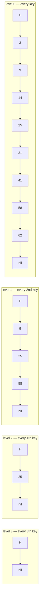
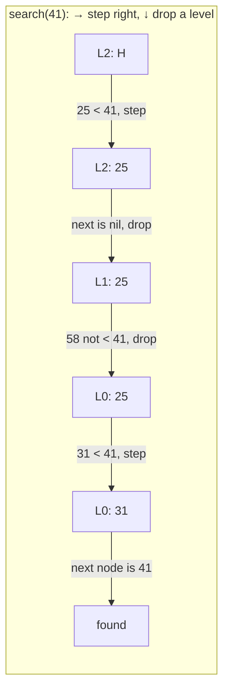
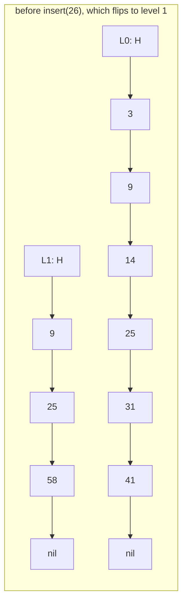
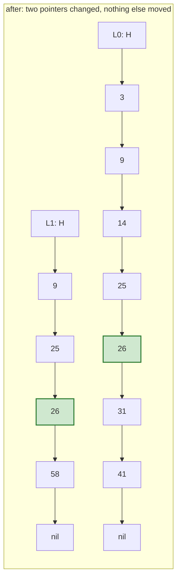

# 36.4 Skip lists

[Chapter 35](../ch35-balanced-trees/index.md) bought its $O(\log n)$
guarantee with rotations, and rotations are fiddly: four cases for AVL, five
properties and a "doubly black" node for red-black deletion, and a class of
bug that only shows up after ten thousand random operations. This section
reaches the same performance by a completely different route. A **skip
list** keeps a sorted linked list and flips coins. There are no rotations,
no rebalancing, no cases — insertion is "splice a node into a few lists" —
and the structure is short enough to hold in your head and get right on the
first try.

!!! abstract "In plain words"

    - **What it is.** A *skip list* is a sorted linked list with extra "express"
      lanes stacked on top, so a search can leap ahead in big hops before
      dropping down to step through keys one at a time.
    - **Picture it.** Think of a subway line with express and local trains. The
      express skips most stops to cover ground fast; when you are near your
      station you hop down to the local for the final stretch. Each higher lane
      in a skip list is a faster express — and a coin flip on each insert
      decides who earns an express stop, with no committee and no rebalancing.
    - **Why it matters.** Those express lanes turn the hopeless $O(n)$ crawl of
      a plain linked list into an $O(\log n)$ search — matching a balanced tree
      — yet with no rotations and no tricky cases, because the randomness of the
      coin flips does the balancing for free.

## Start from a sorted linked list

A sorted singly linked list ([Chapter 18](../ch18-linked-lists/02-singly-linked.md))
keeps its keys in order, which sounds like it should help. It does not.

```python
class Node:
    __slots__ = ("key", "next")
    def __init__(self, key, nxt=None):
        self.key, self.next = key, nxt

keys = [3, 9, 14, 25, 31, 41, 58, 62, 77, 84]
head = None
for k in reversed(keys):
    head = Node(k, head)

def search(head, target):
    steps, node = 0, head
    while node is not None and node.key < target:
        steps += 1
        node = node.next
    steps += 1
    return (node is not None and node.key == target), steps

for target in (3, 41, 84, 50):
    found, steps = search(head, target)
    print(f"search({target:>2}): found={found!s:<5} after {steps:>2} steps")
```

```text
search( 3): found=True  after  1 steps
search(41): found=True  after  6 steps
search(84): found=True  after 10 steps
search(50): found=False after  7 steps
```

Ten keys, ten steps for the last one. Sorted order lets you *stop early* on
a miss, but it never lets you *skip*: to reach the eighth node you must
touch the first seven, because a linked list offers no way to jump. Binary
search needs random access, and a linked list has none. That is the whole
problem — and the fix is to add the jumps by hand.

## Add an express lane

Put every second node onto a second list — an express lane above the local one.
Search the express lane until the next key would overshoot, then drop down and
walk the local lane.

That helps, but not enough. With $n$ nodes below and $n/2$ above you pay about
$n/2 + 2$ steps; with an express lane of every $\sqrt n$-th node you pay about
$2\sqrt n$. Better, still not logarithmic.

The move that *is* logarithmic: **put an express lane above the express lane,
and keep going.** Each level halves the number of nodes, so there are about
$\log_2 n$ levels, and at each level you take a couple of steps before dropping
down.



Every node lives in level 0; a node that appears at level $k$ also appears at
every level below it.

!!! note "The skip-list search rule"

    Start at the header on the top level, then repeat two moves:

    1. While the next key on this level is **smaller** than the target, step
       right.
    2. Otherwise, drop down one level.

    At the bottom, the next node is either the answer or proof that the target
    is absent.

Searching for 41 in the picture, step by step: at level 2, step right to 25
(25 < 41); next is `nil`, so drop. At level 1, the next key is 58, which is not
smaller, so drop again. At level 0, step right to 31, and the node after it is
41.

Four comparisons instead of six, on ten keys — and the gap widens fast with
$n$.



## Coin flips instead of counting

The picture above is *perfectly* levelled — every second node promoted, then
every fourth. Maintaining that exactly under insertion and deletion would
require shuffling half the structure on every update, which is precisely the
rebalancing work we were trying to avoid.

The skip list's idea, due to William Pugh in 1990, is to stop insisting.

!!! note "The promotion rule"

    When a node is inserted, **flip a coin**: heads, promote it one level and
    flip again; tails, stop. Nobody coordinates and nobody rebalances.

And yet the level populations come out right *on average* — half the nodes at
level 0 only, a quarter reaching level 1, an eighth reaching level 2, and so
on:

$$ P(\text{node reaches level } k) = p^{\,k} = 2^{-k}, \qquad
   \mathbb{E}[\text{levels}] = \frac{1}{1-p} = 2 $$

so the expected height is $\log_{1/p} n = \log_2 n$ and the expected number
of pointers per node is 2, regardless of $n$. Check both claims:

```python
import math, random

def random_level(rng, p=0.5, max_level=16):
    """Flip until tails. Level 0 means 'bottom lane only'."""
    level = 0
    while rng.random() < p and level < max_level:
        level += 1
    return level

rng = random.Random(36)
N = 1000
levels = [random_level(rng) for _ in range(N)]

print(f"{'level k':>8}{'nodes reaching >= k':>21}{'expected n/2^k':>16}"
      f"{'ratio to k-1':>14}")
previous = None
for k in range(0, 9):
    reaching = sum(1 for lvl in levels if lvl >= k)
    ratio = "-" if previous is None else f"{previous / reaching:.2f}x"
    print(f"{k:>8}{reaching:>21}{N * 0.5 ** k:>16.1f}{ratio:>14}")
    previous = reaching

print(f"\naverage pointers per node: {sum(levels) / N + 1:.3f} "
      f"(theory: 1/(1-p) = 2)")
print(f"tallest tower reached level {max(levels)} "
      f"(log2(1000) = {math.log2(N):.2f})")
```

```text
 level k  nodes reaching >= k  expected n/2^k  ratio to k-1
       0                 1000          1000.0             -
       1                  491           500.0         2.04x
       2                  237           250.0         2.07x
       3                  123           125.0         1.93x
       4                   49            62.5         2.51x
       5                   32            31.2         1.53x
       6                   16            15.6         2.00x
       7                   12             7.8         1.33x
       8                    3             3.9         4.00x

average pointers per node: 1.965 (theory: 1/(1-p) = 2)
tallest tower reached level 10 (log2(1000) = 9.97)
```

Each level really does hold about half of the one below — 1000, 491, 237, 123 —
and the average tower is 1.97 pointers tall against a prediction of 2.

The ratios wobble once the counts get small, exactly as coin flips should:
there is no mechanism forcing them, only probability. Nobody counted anything,
nobody rebalanced anything, and the structure came out levelled. That is the
entire balancing mechanism.

## A complete skip list

The one piece of machinery an implementation needs is the **update array**.
Every operation is then the same three steps:

1. **Search down and right**, and for each level remember the last node you
   stood on. That array of remembered nodes is `update`.
2. **Roll the dice** (insert only) to decide how tall the new node is.
3. **Splice or unsplice**, one lane at a time, using `update[i]` as the
   predecessor at level $i$.

Those remembered nodes are exactly the ones whose pointers must change — the
linked-list "keep hold of the predecessor" trick from Chapter 18, once per
level.

```python
import random


class SkipNode:
    __slots__ = ("key", "value", "forward")

    def __init__(self, key, value, level):
        self.key, self.value = key, value
        self.forward = [None] * (level + 1)     # one pointer per level


class SkipList:
    def __init__(self, seed=36, p=0.5, max_level=16):
        self.p, self.max_level = p, max_level
        self.header = SkipNode(None, None, max_level)
        self.level = 0                          # highest level in use
        self.rng = random.Random(seed)          # seeded: reproducible
        self.comparisons = 0
        self._size = 0

    def random_level(self):
        level = 0
        while self.rng.random() < self.p and level < self.max_level:
            level += 1
        return level

    def _predecessors(self, key):
        """The last node before `key` on every level, plus level-0 successor."""
        update = [self.header] * (self.max_level + 1)
        node = self.header
        for i in range(self.level, -1, -1):
            nxt = node.forward[i]
            while nxt is not None and nxt.key < key:
                self.comparisons += 1
                node = nxt
                nxt = node.forward[i]
            if nxt is not None:
                self.comparisons += 1           # the comparison that stopped us
            update[i] = node
        return update, node.forward[0]

    def search(self, key, default=None):
        _, candidate = self._predecessors(key)
        if candidate is not None and candidate.key == key:
            return candidate.value
        return default

    def insert(self, key, value):
        update, candidate = self._predecessors(key)
        if candidate is not None and candidate.key == key:
            candidate.value = value             # already here: overwrite
            return False
        level = self.random_level()
        if level > self.level:                  # taller than anything so far
            for i in range(self.level + 1, level + 1):
                update[i] = self.header
            self.level = level
        node = SkipNode(key, value, level)
        for i in range(level + 1):              # splice in, one lane at a time
            node.forward[i] = update[i].forward[i]
            update[i].forward[i] = node
        self._size += 1
        return True

    def delete(self, key):
        update, candidate = self._predecessors(key)
        if candidate is None or candidate.key != key:
            return False
        for i in range(self.level + 1):
            if update[i].forward[i] is not candidate:
                break                           # node not present above here
            update[i].forward[i] = candidate.forward[i]
        while self.level > 0 and self.header.forward[self.level] is None:
            self.level -= 1                     # top lanes emptied out
        self._size -= 1
        return True

    def keys(self):
        out, node = [], self.header.forward[0]
        while node is not None:
            out.append(node.key)
            node = node.forward[0]
        return out

    def __len__(self):
        return self._size

    def __contains__(self, key):
        return self.search(key, default=None) is not None

    def height_of(self, key):
        node = self.header.forward[0]
        while node is not None and node.key != key:
            node = node.forward[0]
        return None if node is None else len(node.forward) - 1

    def render(self):
        base = self.keys()
        lines = []
        for lvl in range(self.level, -1, -1):
            present, node = set(), self.header.forward[lvl]
            while node is not None:
                present.add(node.key)
                node = node.forward[lvl]
            cells = "".join(f"{k:>4}" if k in present else "   ." for k in base)
            lines.append(f"L{lvl}:   H{cells}")
        return "\n".join(lines)


sl = SkipList(seed=136)
for k in [3, 9, 14, 25, 31, 41, 58, 62, 77, 84]:
    sl.insert(k, f"v{k}")

print(sl.render())
print("\nlen:", len(sl), " keys in order:", sl.keys())
print("search(41):", sl.search(41), "  search(50):", sl.search(50))
print("41 in sl:", 41 in sl, "  50 in sl:", 50 in sl)
print("node 25 reaches level", sl.height_of(25))

print("\ndelete(41):", sl.delete(41), " delete(41) again:", sl.delete(41))
print("keys now:", sl.keys())
print(sl.render())
```

```text
L2:   H   .   .   .  25   .   .  58   .   .   .
L1:   H   .   .  14  25  31   .  58   .   .  84
L0:   H   3   9  14  25  31  41  58  62  77  84

len: 10  keys in order: [3, 9, 14, 25, 31, 41, 58, 62, 77, 84]
search(41): v41   search(50): None
41 in sl: True   50 in sl: False
node 25 reaches level 2

delete(41): True  delete(41) again: False
keys now: [3, 9, 14, 25, 31, 58, 62, 77, 84]
L2:   H   .   .   .  25   .  58   .   .   .
L1:   H   .   .  14  25  31  58   .   .  84
L0:   H   3   9  14  25  31  58  62  77  84
```

Notice how much lumpier the real structure is than the idealised diagram above:
the coin flips gave 14 a tower and skipped 9 entirely, and level 2 holds two
nodes rather than a tidy every-fourth.

It does not matter. What matters is only that towers get rarer at a fixed rate,
and the search still took the same shape.

Every operation is the same three steps — find the predecessors, then splice or
unsplice — and there is no case analysis anywhere. Compare that with
[AVL rebalancing](../ch35-balanced-trees/02-avl.md)'s four cases and red-black
deletion's six.

## Watching one insertion

Insertion changes only the lanes the new node reaches. If the coin gives it
level 1, exactly two pointers are re-routed: the level-0 predecessor and the
level-1 predecessor. Everything else in the structure is untouched — no
subtree is moved, no node is re-parented.





And here is a real search, traced level by level, so you can watch it walk:

```python
# continues
def trace(self, key):
    """Print every step of a search: → is a step right, ↓ is a drop."""
    node, steps = self.header, []
    for i in range(self.level, -1, -1):
        nxt = node.forward[i]
        while nxt is not None and nxt.key < key:
            steps.append(f"L{i}: at {node.key if node.key is not None else 'H'}"
                         f" -> step right to {nxt.key}")
            node = nxt
            nxt = node.forward[i]
        reason = "next is nil" if nxt is None else f"{nxt.key} is not < {key}"
        steps.append(f"L{i}: at {node.key if node.key is not None else 'H'}"
                     f" -> {reason}, drop")
    candidate = node.forward[0]
    hit = candidate is not None and candidate.key == key
    steps.append(f"L0: next node is "
                 f"{candidate.key if candidate else 'nil'} -> "
                 f"{'FOUND' if hit else 'NOT FOUND'}")
    return steps


SkipList.trace = trace

sl = SkipList(seed=136)
for k in [3, 9, 14, 25, 31, 41, 58, 62, 77, 84]:
    sl.insert(k, f"v{k}")
print(sl.render())
print("\nsearch(77), step by step:")
for line in sl.trace(77):
    print("   ", line)

before = sl.comparisons
sl.search(77)
print(f"\nkey comparisons for that search: {sl.comparisons - before}")
```

```text
L2:   H   .   .   .  25   .   .  58   .   .   .
L1:   H   .   .  14  25  31   .  58   .   .  84
L0:   H   3   9  14  25  31  41  58  62  77  84

search(77), step by step:
    L2: at H -> step right to 25
    L2: at 25 -> step right to 58
    L2: at 58 -> next is nil, drop
    L1: at 58 -> 84 is not < 77, drop
    L0: at 58 -> step right to 62
    L0: at 62 -> 77 is not < 77, drop
    L0: next node is 77 -> FOUND

key comparisons for that search: 5
```

Three steps right, three drops, five key comparisons — against the nine
steps a plain sorted linked list would need for the same key. Trace it with
a finger on the `render()` picture above and the express lanes do exactly
what the name says.

## Expected, not guaranteed — and why that is fine

An AVL tree's $O(\log n)$ is a **theorem about every possible input**. A skip
list's is a statement about probability: the expected search cost is
$O(\log n)$, and the chance of being much worse falls off very fast.

The formal statement is *with high probability*: for any constant $c$, the
probability that a search on $n$ keys costs more than $c\log_2 n$ steps shrinks
polynomially in $n$. A skip list of a million keys taking a thousand steps is
not impossible — it is roughly as likely as flipping a hundred heads in a row.

The crucial detail is **whose randomness it is**. A plain BST also has good
*average* behaviour, and Chapter 35 opened by showing how easily an adversary
(or an ordinary sorted file) destroys it, because the randomness came from the
*input*.

A skip list's randomness comes from its own private generator. Feed it
perfectly sorted keys, reversed keys, or keys chosen by an attacker who has read
this page — the coin flips do not care.

```python
# continues
import math
import matplotlib.pyplot as plt

sizes = [125, 250, 500, 1000, 2000, 4000]
TRIALS = 5

print(f"{'n':>6} {'sorted input':>13} {'shuffled input':>15} "
      f"{'log2(n)':>9} {'measured/log2 n':>16} {'top level':>10}")
xs, measured = [], []
for n in sizes:
    total, top = 0.0, 0
    for t in range(TRIALS):
        sl = SkipList(seed=n + t)
        for k in range(n):                       # WORST-CASE input order
            sl.insert(k, k)
        before = sl.comparisons
        for k in range(n):
            sl.search(k)
        total += (sl.comparisons - before) / n
        top = max(top, sl.level)
    sorted_cost = total / TRIALS

    total = 0.0
    for t in range(TRIALS):
        sl = SkipList(seed=n + 7919 * t)
        order = list(range(n))
        random.Random(n + t).shuffle(order)
        for k in order:
            sl.insert(k, k)
        before = sl.comparisons
        for k in range(n):
            sl.search(k)
        total += (sl.comparisons - before) / n
    shuffled_cost = total / TRIALS

    xs.append(n)
    measured.append(sorted_cost)
    print(f"{n:>6} {sorted_cost:>13.2f} {shuffled_cost:>15.2f} "
          f"{math.log2(n):>9.2f} {sorted_cost / math.log2(n):>16.2f} {top:>10}")

plt.plot(xs, measured, "o-", label="skip list (measured)")
plt.plot(xs, [math.log2(n) for n in xs], "--", label="log2(n)")
plt.plot(xs, [2 * math.log2(n) for n in xs], ":", label="2 log2(n)")
plt.xscale("log")
plt.xlabel("number of keys n (log scale)")
plt.ylabel("key comparisons per search")
plt.title("Skip list search cost grows like log n, on sorted input")
plt.legend()
```

```text
     n  sorted input  shuffled input   log2(n)  measured/log2 n  top level
   125         12.56           12.70      6.97             1.80          9
   250         15.20           14.17      7.97             1.91         10
   500         16.41           16.26      8.97             1.83         12
  1000         19.10           18.67      9.97             1.92         12
  2000         20.79           21.36     10.97             1.90         14
  4000         23.26           21.41     11.97             1.94         16
```

Two things to read off that table. First, **each doubling of $n$ adds about
two comparisons** — 12.6, 15.2, 16.4, 19.1, 20.8, 23.3 as the list grows
from 125 keys to 4000. A constant increase per doubling *is* what
$O(\log n)$ looks like; a linear structure would have added 125, then 250,
then 500. Second, **the sorted and shuffled columns agree**. The input order
is irrelevant, which is exactly the property a plain BST lacks and the
property that cost Chapter 35 three rotation schemes to obtain.

The ratio column settles just under 2. For $p = 1/2$ the theory predicts about
$\log_2 n$ drops plus about $\log_2 n$ steps to the right — roughly
$2\log_2 n$ node visits, of which our counter sees the key comparisons.

The `top level` column tracks $\log_2 n$ as well, until it meets the
`max_level = 16` ceiling at $n = 4000$. That ceiling is why a real
implementation sizes it for the largest table it expects. Turning $p$ down to
$1/4$ makes the towers shorter and the walks longer, trading memory for time —
Redis uses $p = 1/4$ for exactly that reason.

## Where skip lists are used, and why

Given that balanced trees exist and are taught first, why do skip lists keep
showing up in real systems?

- **Redis** implements its sorted sets (`ZSET`) as a skip list paired with a
  hash table: the hash gives $O(1)$ score lookup by member, and the skip
  list gives ordered range queries and rank operations.
- **LevelDB and RocksDB** use a skip list for the in-memory *memtable*, the
  write buffer that absorbs incoming keys before they are flushed to disk in
  sorted order.
- **Java** ships `ConcurrentSkipListMap` and `ConcurrentSkipListSet` in
  `java.util.concurrent` — the standard library's sorted map for concurrent
  use, sitting alongside the single-threaded red-black `TreeMap`.
- **Apache Lucene** uses skip pointers inside its postings lists to jump
  forward through document ids without decoding everything in between.

The pattern behind that list is **concurrency**. Rebalancing a tree is a
structural change: a rotation moves several nodes at once, so a writer must lock
a whole neighbourhood and readers must be kept out of it.

A skip list insertion is a handful of independent single-pointer updates, each
of which can be done atomically, and a reader traversing at level 0 never sees a
half-finished rotation because there are none. Lock-free skip lists are merely
difficult; lock-free balanced trees are a research topic.

The second reason is plain economics of engineering: an implementation is about
eighty lines and reviewers can verify it. Red-black deletion is not.

| | Skip list | [Balanced BST](../ch35-balanced-trees/index.md) | Hash table |
|---|---|---|---|
| Search / insert / delete | $O(\log n)$ **expected** | $O(\log n)$ **guaranteed** | $O(1)$ average |
| Worst case | $O(n)$, vanishingly unlikely | $O(\log n)$ | $O(n)$ |
| Depends on input order | no (own randomness) | no (rotations) | no (with a good hash) |
| Ordered iteration / ranges | ✓ walk level 0 | ✓ in-order walk | ✗ |
| Memory per key | 2 pointers on average | 2 pointers + colour/height | table slack |
| Implementation size | ~80 lines, no case analysis | 200+ lines, many cases | ~60 lines + resizing |
| Concurrency | pointer-local updates, lock-free versions exist | rotations need wide locks | resizing needs care |
| Cache behaviour | poor (pointer chasing) | poor | good |

!!! info "Java corner"

    `java.util.TreeMap` is a red-black tree; `java.util.concurrent.ConcurrentSkipListMap`
    is a skip list. Both implement `NavigableMap`, so the same code —
    `headMap`, `tailMap`, `floorKey`, `ceilingKey` — works over either. The
    choice between them is a choice about *concurrency*, not about the
    interface, and it is the clearest real-world illustration that the
    structure is an implementation detail behind an ADT
    ([Section 18.1](../ch18-linked-lists/01-adts-generics.md)).

!!! warning "Common mistakes"

    - **Forgetting the update array.** Splicing needs the predecessor at
      *every* level the new node reaches, not just at level 0. Collect them
      on the way down; there is no way back up.
    - **Walking with `<=` instead of `<`.** The search must stop at the first
      key **not less than** the target. Using `<=` steps past the key you
      wanted and reports it missing.
    - **Not lowering `self.level` after deletions.** Once the top lanes are
      empty, every future search wastes a drop through each of them. The
      `while` loop at the end of `delete` costs nothing and keeps searches
      honest.
    - **Unseeded randomness in tests.** A skip list is a randomized
      structure: without a fixed seed, a failing test cannot be reproduced.
      Seed the generator, and keep the seed in the failure message.
    - **Expecting the guarantee.** "Expected $O(\log n)$" is not "always
      $O(\log n)$". For a hard real-time deadline, use a structure with a
      worst-case bound.

## Check your understanding

1. In a skip list with $p = 1/2$ and 1024 keys, roughly how many nodes reach
   level 3 or higher, and roughly how tall is the tallest tower?

    ??? success "Answer"
        A node reaches level $k$ with probability $2^{-k}$, so level 3 or
        higher has about $1024/8 = 128$ nodes. The expected maximum level is
        about $\log_2 1024 = 10$, and levels much beyond that are very
        unlikely — which is why a `max_level` of 16 comfortably covers
        tables of tens of thousands of keys.

2. Predict before running: you build a skip list by inserting `1, 2, 3, …,
   10000` in that exact order. Is the result any worse than inserting them
   shuffled?

    ??? success "Answer"
        No — the two columns in the experiment above agree. The structure's
        shape is decided entirely by its own coin flips, not by the arrival
        order, so sorted input is just another input. This is precisely
        where a plain BST collapses into a linked list, and it is why the
        randomness must belong to the *structure* rather than being assumed
        of the data.

3. `delete` breaks out of its loop as soon as `update[i].forward[i]` is not
   the node being removed. Why is that correct rather than a bug?

    ??? success "Answer"
        Because the levels a node occupies are contiguous from 0 upward. If
        the node is not the successor of `update[i]` at level $i$, it does
        not exist at level $i$ — and therefore does not exist at any level
        above $i$ either. Every remaining iteration would be a no-op, so
        stopping is both correct and cheaper.

4. Both a skip list and an AVL tree give $O(\log n)$. If you are writing an
   ordered map for a system with a hard 5-millisecond deadline per
   operation, which do you pick, and why?

    ??? success "Answer"
        The AVL tree (or another balanced tree). Its bound holds for every
        operation on every input; the skip list's holds in expectation, and
        an unlucky run of coin flips — however improbable — can exceed the
        deadline. For throughput, or for a structure many threads must
        update at once, the trade goes the other way and the skip list wins.
