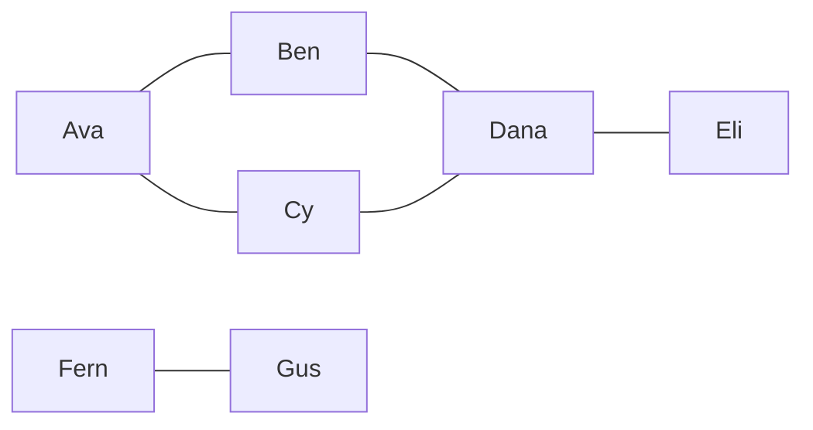
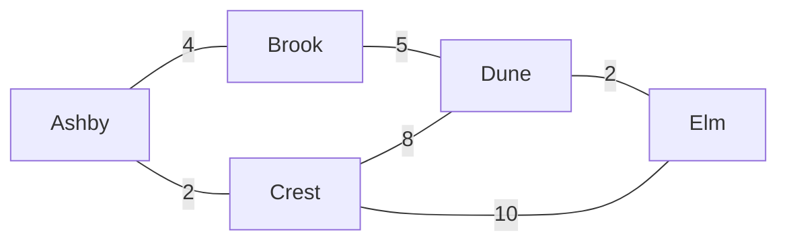
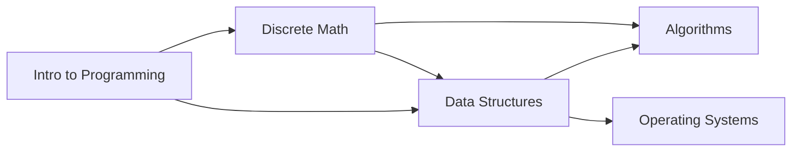
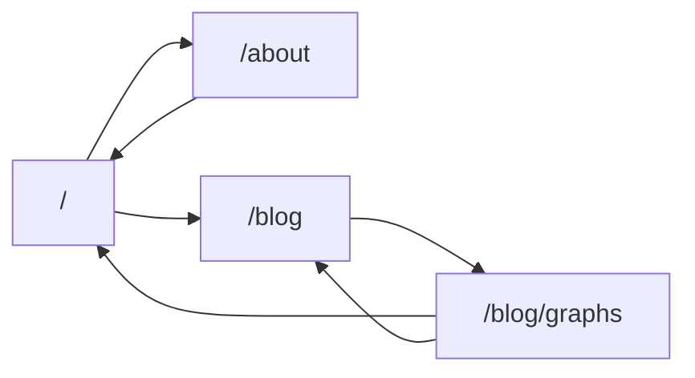
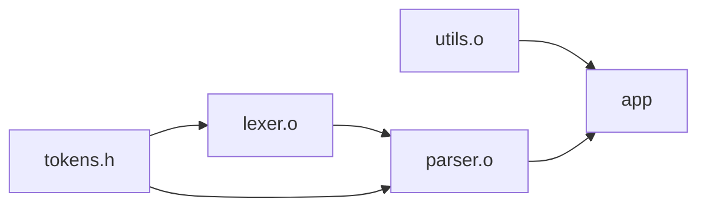
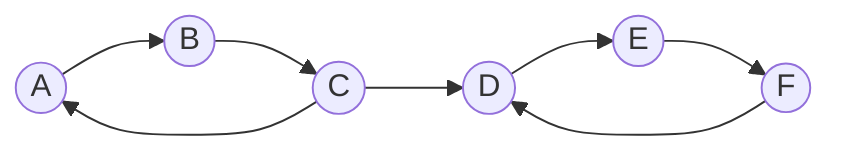
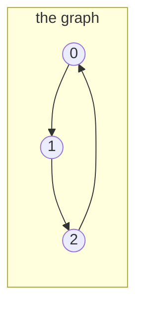

# 37.1 Representing graphs

A graph is two sets: a set of **vertices** (the things) and a set of **edges**
(the pairs of things that are related). That definition is so thin it sounds
useless, and that is exactly its power — almost any collection of things with
relationships between them *is* a graph, and the moment you notice that, a
whole library of algorithms becomes available. This section is about the
unglamorous but decisive first step: choosing how to store one. Get the
representation wrong and a graph that fits comfortably in memory as a
dictionary will demand four gigabytes as a matrix, or a lookup that should
cost one array access will cost a linear scan.

!!! abstract "In plain words"

    - **What it is.** A graph is just *dots joined by lines*: the dots are the
      things you care about, and a line means two of them are related somehow.
    - **Picture it.** People joined by friendships, towns joined by roads,
      courses joined by "you must take this one first". Draw the things as dots
      and each relationship as a line, and you have drawn a graph — no more, no
      less.
    - **Why it matters.** A startling range of problems is secretly this same
      shape. The instant you notice "these things are connected like *this*",
      every algorithm in this chapter becomes available to you for free — which
      is why the first job is simply choosing how to store the dots and lines.

## Five graphs you already know

Before any code, look at five graphs from five unrelated fields and notice
how little they have in common except structure.

**A social network.** Vertices are people, edges are friendships. Friendship
goes both ways, so the edges have no arrowheads — the graph is *undirected*.



Notice that Fern and Gus are off on their own. A graph is not required to be
in one piece.

**A road map.** Vertices are towns, edges are roads — and each edge carries a
number, the distance. A graph whose edges carry numbers is *weighted*.



**Course prerequisites.** Vertices are courses, edges are "must be taken
before". Direction matters enormously here, and a cycle would be a
catastrophe: a set of courses that each require another one first can never be
taken at all.



**Web links.** Vertices are pages, edges are hyperlinks. Directed, and full of
cycles — page A links to B, B links back to A. This is the graph Google's
original PageRank algorithm ran on.



**A build dependency graph.** Vertices are files or packages, edges mean "must
be built first". Every package manager and every build tool you have ever
waited on is walking a graph like this.



Social ties, geography, curriculum design, the web, and a Makefile. Five
fields, one structure. That is the whole argument for learning graphs.

## The vocabulary, on one picture

Every term in this chapter can be read off a single small directed graph.
Here it is; keep it in view for the next few paragraphs.



- A **vertex** (plural *vertices*; also called a **node**) is one of the
  circles. This graph has $V = 6$ vertices.
- An **edge** is one of the arrows. This graph has $E = 7$ edges. Writing $V$
  and $E$ for those two counts is universal, and every cost in this chapter is
  quoted in terms of them.
- The graph is **directed**: each edge has a direction, written $A \to B$. In
  an **undirected** graph, edges are unordered pairs and you may travel either
  way. Undirected graphs are usually stored as directed graphs with both
  arrows present.
- It is **unweighted** — no numbers on the edges. Add a number to each edge
  and it becomes **weighted**; the number is a cost, distance, time, or
  capacity depending on what you are modelling.
- The **out-degree** of a vertex is how many edges leave it; the **in-degree**
  is how many arrive. Vertex $C$ has out-degree 2 and in-degree 1. In an
  undirected graph there is just **degree**, the number of incident edges.
- A **path** is a sequence of vertices where each consecutive pair is joined
  by an edge: $A \to B \to C \to D$ is a path of length 3 (paths are measured
  in edges, not vertices).
- A **cycle** is a path that returns to where it started. This graph has two:
  $A \to B \to C \to A$ and $D \to E \to F \to D$.
- A directed graph with no cycles at all is a **DAG** — a *directed acyclic
  graph*. The prerequisite and build graphs above are DAGs; this one is not.
  DAGs matter enough to get their own algorithm in the next section.
- Ignore the arrowheads and the graph is **connected**: there is a route
  between every pair of vertices. Respect the arrowheads and it is *not*
  **strongly connected**, because once you cross $C \to D$ you can never get
  back to $A$. A directed graph that *is* strongly connected has a directed
  path both ways between every pair.
- $E$ can be as small as 0 and, for a directed graph with no self-loops, as
  large as $V(V-1)$. A graph near the top of that range is **dense**; one near
  the bottom — where $E$ is proportional to $V$ rather than $V^2$ — is
  **sparse**. Nearly every real graph is sparse, and that single fact decides
  most representation questions.
- Finally: **a tree is a special graph.** A tree is a connected, undirected,
  acyclic graph, and it always has exactly $V - 1$ edges. Everything you
  learned in [Chapter 20](../ch20-bst/01-tree-vocab.md) was graph theory with
  extra rules; this chapter simply removes the rules.

Here is that same graph as data, with each of those quantities computed rather
than asserted:

```python
# The drawn example: vertex -> list of vertices it points at.
graph = {
    "A": ["B"],
    "B": ["C"],
    "C": ["A", "D"],
    "D": ["E"],
    "E": ["F"],
    "F": ["D"],
}

V = len(graph)
E = sum(len(out) for out in graph.values())
print(f"V = {V}, E = {E}")

in_deg = {v: 0 for v in graph}
for v, outs in graph.items():
    for u in outs:
        in_deg[u] += 1

print(f"{'vertex':>7}{'out-degree':>12}{'in-degree':>11}")
for v in graph:
    print(f"{v:>7}{len(graph[v]):>12}{in_deg[v]:>11}")

print("sum of out-degrees =", sum(len(o) for o in graph.values()))
print("sum of in-degrees  =", sum(in_deg.values()))

max_edges = V * (V - 1)
print(f"density: {E}/{max_edges} = {E / max_edges:.2f}  -> sparse")
```

```text
V = 6, E = 7
 vertex  out-degree  in-degree
      A           1          1
      B           1          1
      C           2          1
      D           1          2
      E           1          1
      F           1          1
sum of out-degrees = 7
sum of in-degrees  = 7
density: 7/30 = 0.23  -> sparse
```

Both degree sums equal $E$, and they always will: every edge contributes
exactly one to somebody's out-degree and one to somebody's in-degree. In an
undirected graph the same argument gives the *handshake lemma* — the sum of
all degrees is $2E$, because each edge is counted from both ends.

## Representation 1 — the adjacency matrix

!!! abstract "In plain words"

    - **What it is.** Two ways to write down who-connects-to-whom: a per-vertex
      *list* of the neighbours each vertex actually has, or a full *grid* with
      every vertex down the side and across the top, ticking each connected
      pair.
    - **Picture it.** The adjacency list is a **contacts book** — each person's
      page names only the people they actually know. The adjacency matrix is a
      giant **spreadsheet** with everyone listed on both axes and a tick in a
      cell for every pair, including all the empty cells for pairs who have
      never met.
    - **Why it matters.** The contacts book stays small when connections are few
      (almost always the case) and instantly answers "who does X know?"; the
      grid instantly answers "are X and Y connected?" but spends a cell on every
      *possible* pair whether or not it exists. Which question you ask most
      decides which one wins.

The most literal storage is a $V \times V$ grid of booleans, where cell
`(i, j)` answers "is there an edge from $i$ to $j$?" This is a
[2-D array](../ch08-grids/index.md) exactly like the ones in Chapter 8, and
numpy gives us one for free.



For that three-vertex cycle the matrix is

$$
M = \begin{pmatrix} 0 & 1 & 0 \\ 0 & 0 & 1 \\ 1 & 0 & 0 \end{pmatrix}
$$

— row $i$ says where $i$ points. Here it is as a working class:

```python
import numpy as np

class MatrixGraph:
    """Adjacency-matrix graph over vertices 0 .. n-1."""

    def __init__(self, n, directed=False):
        self.n = n
        self.directed = directed
        self.m = np.zeros((n, n), dtype=np.uint8)

    def add_edge(self, u, v):
        self.m[u, v] = 1
        if not self.directed:
            self.m[v, u] = 1

    def has_edge(self, u, v):
        return bool(self.m[u, v])          # one array access: O(1)

    def neighbours(self, u):
        return [v for v in range(self.n) if self.m[u, v]]   # scans a row: O(V)

    def degree(self, u):
        return int(self.m[u].sum())

g = MatrixGraph(5)                          # undirected, 5 vertices
for u, v in [(0, 1), (0, 2), (1, 3), (2, 3), (3, 4)]:
    g.add_edge(u, v)

print(g.m)
print("has_edge(0, 3) ->", g.has_edge(0, 3))
print("has_edge(1, 3) ->", g.has_edge(1, 3))
print("neighbours(3)  ->", g.neighbours(3))
print("degree(3)      ->", g.degree(3))
```

```text
[[0 1 1 0 0]
 [1 0 0 1 0]
 [1 0 0 1 0]
 [0 1 1 0 1]
 [0 0 0 1 0]]
has_edge(0, 3) -> False
has_edge(1, 3) -> True
neighbours(3)  -> [1, 2, 4]
degree(3)      -> 3
```

Read row 3 of the printed matrix — `0 1 1 0 1` — and `neighbours(3)` and
`degree(3)` are just two different ways of summarising it. That is the
matrix's charm: the data structure *is* the picture.

It is also symmetric ($M = M^T$), because the graph is undirected: cell `(0,1)`
and cell `(1,0)` are both 1. Half the storage is therefore redundant, and
libraries that care store only the upper triangle.

Note too the two costs written in the comments. `has_edge` is a single array
access; `neighbours` scans an entire row of $V$ cells even if the vertex has
one neighbour. Hold on to that asymmetry — it decides everything below.

## Representation 2 — the adjacency list

The alternative stores, for each vertex, only the vertices it actually points
at. In Python that is a `dict` of `list`s, and nothing more exotic:

```python
class ListGraph:
    """Adjacency-list graph. Vertices can be any hashable value."""

    def __init__(self, directed=False):
        self.adj = {}
        self.directed = directed

    def add_vertex(self, v):
        self.adj.setdefault(v, [])

    def add_edge(self, u, v):
        self.add_vertex(u)
        self.add_vertex(v)
        self.adj[u].append(v)
        if not self.directed:
            self.adj[v].append(u)

    def has_edge(self, u, v):
        return v in self.adj.get(u, [])    # scans one list: O(degree(u))

    def neighbours(self, u):
        return self.adj[u]                 # already exactly what we want: O(1)

    def degree(self, u):
        return len(self.adj[u])

g = ListGraph()
for u, v in [("Ashby", "Brook"), ("Ashby", "Crest"), ("Brook", "Dune"),
             ("Crest", "Dune"), ("Crest", "Elm"), ("Dune", "Elm")]:
    g.add_edge(u, v)

for town in g.adj:
    print(f"{town:>6}: {g.adj[town]}")
print("has_edge(Ashby, Dune) ->", g.has_edge("Ashby", "Dune"))
print("has_edge(Ashby, Crest) ->", g.has_edge("Ashby", "Crest"))
print("degree(Crest) ->", g.degree("Crest"))
```

```text
 Ashby: ['Brook', 'Crest']
 Brook: ['Ashby', 'Dune']
 Crest: ['Ashby', 'Dune', 'Elm']
  Dune: ['Brook', 'Crest', 'Elm']
   Elm: ['Crest', 'Dune']
has_edge(Ashby, Dune) -> False
has_edge(Ashby, Crest) -> True
degree(Crest) -> 3
```

Notice a second advantage that has nothing to do with speed: vertices can be
*strings*. A matrix needs integer indices 0..n-1, so any real application
using one also needs a name-to-index dictionary alongside it. The adjacency
list gets that for free because a `dict` already maps arbitrary keys.

## Which one, and why

The two representations answer different questions cheaply.

| Operation | Adjacency matrix | Adjacency list |
|---|---|---|
| Space | $O(V^2)$ always | $O(V + E)$ |
| `add_edge(u, v)` | $O(1)$ | $O(1)$ |
| `has_edge(u, v)` | $O(1)$ — one array access | $O(\deg u)$ — scan the list |
| `neighbours(u)` | $O(V)$ — scan a whole row | $O(\deg u)$ — it *is* the list |
| Loop over all edges | $O(V^2)$ | $O(V + E)$ |
| Delete an edge | $O(1)$ | $O(\deg u)$ |
| Add a vertex | $O(V^2)$ — reallocate | $O(1)$ |

The decisive row is `neighbours(u)`. Almost every algorithm in this chapter
spends its time asking "who are $u$'s neighbours?", and almost never "is there
an edge from $u$ to $v$?" — BFS, DFS, Dijkstra, Prim, and topological sort all
walk neighbour lists.

That is why the adjacency list is the default, and why every complexity in this
chapter is written $O(V + E)$ rather than $O(V^2)$: those are the same thing
only for dense graphs.

Storing an adjacency list's neighbours in a `set` instead of a `list` buys
$O(1)$ `has_edge` back, at the cost of more memory per vertex and the loss of
edge insertion order. That is the representation Python's own `dict`-of-`set`s
idiom gives you, and a perfectly good default when you need both operations.

## Measuring the waste

Here is the space argument as an actual measurement rather than an asymptotic
claim. We build the same 600-vertex graph at three densities and compare the
matrix's byte count with the adjacency list's.

```python
import sys
import numpy as np

def build_matrix(n, p, seed=37):
    """Undirected random graph: each possible edge present with probability p."""
    rng = np.random.default_rng(seed)
    m = rng.random((n, n)) < p
    m = np.triu(m, 1)          # keep the upper triangle only …
    return (m | m.T).astype(np.uint8)   # … then mirror it: undirected

def to_adjacency_list(m):
    adj = {v: [] for v in range(m.shape[0])}
    rows, cols = np.nonzero(m)
    for v, u in zip(rows.tolist(), cols.tolist()):
        adj[v].append(u)
    return adj

def list_bytes(adj):
    """Dict machinery plus one list object per vertex.

    We deliberately do not count the integer objects: small ints are shared
    by CPython, and each list slot holds only an 8-byte pointer to one.
    """
    return sys.getsizeof(adj) + sum(sys.getsizeof(nbrs) for nbrs in adj.values())

n = 600
print(f"{'density':>8}{'edges':>9}{'matrix KB':>12}{'adj list KB':>13}{'cheaper':>9}")
for p in (0.005, 0.05, 0.5):
    m = build_matrix(n, p)
    adj = to_adjacency_list(m)
    e = int(m.sum()) // 2
    mk, lk = m.nbytes / 1024, list_bytes(adj) / 1024
    print(f"{2 * e / (n * (n - 1)):8.4f}{e:9,}{mk:12.1f}{lk:13.1f}"
          f"{('list' if lk < mk else 'matrix'):>9}")
```

```text
 density    edges   matrix KB  adj list KB  cheaper
  0.0048      863       351.6         71.8     list
  0.0504    9,054       351.6        209.6     list
  0.4991   89,695       351.6       1533.0   matrix
```

The matrix's size never changes — $600^2$ bytes, whatever the graph contains.
The adjacency list grows with the number of edges, so it wins massively on the
sparse graph, comfortably at 5% density, and loses on the dense one.

The crossover sits somewhere near a density of a tenth or two, which in
practice means: **use an adjacency list unless you know your graph is dense.**

And the sparse row is where the real-world argument lives. A social network
with a million users where everyone has 200 friends has $E \approx 10^8$
adjacency entries — large but tractable. The matrix for the same graph has
$10^{12}$ cells: a terabyte to store the answer "no edge" a trillion times.

## Representation 3 — the edge list

The third representation is the simplest of all: just a list of the edges,
with no per-vertex index at all.

```python
edges = [
    ("Ashby", "Brook", 4),
    ("Ashby", "Crest", 2),
    ("Brook", "Dune",  5),
    ("Crest", "Dune",  8),
    ("Crest", "Elm",  10),
    ("Dune",  "Elm",   2),
]

total = sum(w for _, _, w in edges)
cheapest = min(edges, key=lambda e: e[2])
print(f"{len(edges)} roads, {total} km of tarmac total")
print("cheapest road:", cheapest)

for u, v, w in sorted(edges, key=lambda e: e[2]):
    print(f"  {u:>5} -- {v:<5} {w:>3} km")

# Building an adjacency list from an edge list is four lines.
adj = {}
for u, v, w in edges:
    adj.setdefault(u, []).append((v, w))
    adj.setdefault(v, []).append((u, w))
print("Crest ->", adj["Crest"])
```

An edge list is terrible for "who are $u$'s neighbours?" — that question costs
a full $O(E)$ scan — so it is useless for traversal.

But it is exactly right in three situations:

1. **As an interchange format.** Every graph file format on disk, and every
   graph you will be handed in an interview or a coding problem, arrives as a
   list of edges. Reading one and building an adjacency list is the four lines
   above, and it is the first thing you should write.
2. **When the algorithm processes edges, not vertices.** Kruskal's algorithm
   in [§37.4](04-mst.md) sorts all the edges by weight and considers them one
   at a time; an edge list is not merely acceptable there, it is the natural
   input. Bellman-Ford in [§37.3](03-shortest-paths.md) relaxes every edge on
   every pass — same story.
3. **When you only ever aggregate.** Counting edges, summing weights, finding
   the heaviest — none of that needs an index.

## The `Graph` class this chapter uses

Everything from here on uses one small class: a dictionary of dictionaries,
mapping each vertex to `{neighbour: weight}`. Weights default to 1, so the
same class serves unweighted algorithms without a second code path. It is
kept deliberately short — under thirty lines — because later pages will
redefine it inside their own blocks so that every Run button works on its own.

```python
class Graph:
    """Adjacency-map graph: {vertex: {neighbour: weight}}."""

    def __init__(self, directed=False):
        self.adj = {}
        self.directed = directed

    def add_vertex(self, v):
        self.adj.setdefault(v, {})
        return self

    def add_edge(self, u, v, weight=1):
        self.add_vertex(u)
        self.add_vertex(v)
        self.adj[u][v] = weight
        if not self.directed:
            self.adj[v][u] = weight
        return self

    def neighbours(self, u):
        return self.adj[u].keys()

    def weight(self, u, v):
        return self.adj[u][v]

    def has_edge(self, u, v):
        return v in self.adj.get(u, {})     # O(1): dict lookup

    def vertices(self):
        return self.adj.keys()

    def edges(self):
        """Each undirected edge yielded once, as (u, v, weight)."""
        seen = set()
        for u in self.adj:
            for v, w in self.adj[u].items():
                if self.directed or (v, u) not in seen:
                    seen.add((u, v))
                    yield u, v, w

    def __len__(self):
        return len(self.adj)


roads = Graph()
for u, v, w in [("Ashby", "Brook", 4), ("Ashby", "Crest", 2),
                ("Brook", "Dune", 5), ("Crest", "Dune", 8),
                ("Crest", "Elm", 10), ("Dune", "Elm", 2)]:
    roads.add_edge(u, v, w)

print(f"{len(roads)} towns, {len(list(roads.edges()))} roads")
print("Crest's neighbours:", list(roads.neighbours("Crest")))
print("Crest -> Dune costs", roads.weight("Crest", "Dune"))
print("has_edge(Ashby, Elm):", roads.has_edge("Ashby", "Elm"))
for u, v, w in roads.edges():
    print(f"  {u} -- {v}: {w}")
```

Two design notes worth stealing for your own code:

- **The inner container is a `dict`, not a `list`.** That makes `has_edge`
  $O(1)$ *and* keeps `neighbours` at $O(\deg u)$ — the matrix's fast edge test
  without the matrix's memory.
- **`add_edge` returns `self`.** Calls can therefore be chained; a small
  ergonomic touch that costs one line.

## The visited set is not optional

One more ingredient before we start walking graphs, and it is the ingredient
that trees let you skip. A tree traversal never revisits a node, because a tree
has no cycles — there is exactly one path from the root to any node. A graph
has cycles, so a walk that does not remember where it has been will go round
and round forever.

The remembering is done by a `set`, the structure from
[Chapter 14](../ch14-beyond/01-collections-tour.md). The reason it is a `set`
rather than a list is a complexity argument you can now make yourself: `x in
some_set` is $O(1)$ average, `x in some_list` is $O(n)$. Use a list and a
linear-time algorithm silently becomes quadratic.

```python
import time

n = 20_000
items = list(range(n))
as_list, as_set = list(items), set(items)

t0 = time.perf_counter()
hits = sum(1 for x in items if x in as_set)
t_set = time.perf_counter() - t0

t0 = time.perf_counter()
hits = sum(1 for x in items[:2000] if x in as_list)   # only a tenth as many!
t_list = (time.perf_counter() - t0) * 10              # scaled up for a fair compare

print(f"{n:,} membership tests against a set:  {t_set * 1000:7.1f} ms")
print(f"{n:,} membership tests against a list: {t_list * 1000:7.1f} ms (estimated)")
print(f"the set is roughly {t_list / t_set:,.0f}x faster")
```

The set finishes in a fraction of a millisecond; the list takes tens of
milliseconds for the same 20,000 questions, a couple of hundred times slower.
The exact ratio depends on your machine, but the important part is that it
*grows with $n$* — precisely the difference between $O(1)$ and $O(n)$ inside a
loop that runs $V + E$ times.

Every traversal from here on therefore carries a `visited = set()`, and
[§37.2](02-traversal.md) opens by showing what happens when it does not.

!!! warning "Common mistakes"

    - **Using a list as the visited set.** It works on the ten-vertex example
      and turns your $O(V+E)$ traversal into $O(V \cdot E)$ on real data. Use a
      `set`, or a `dict` when you also need to store a distance or a parent.
    - **Reaching for a matrix because it "feels" like the real structure.**
      A matrix costs $V^2$ *regardless of how few edges exist*, and every
      neighbour lookup scans a whole row. Unless your graph is dense or you
      genuinely need constant-time edge tests on integer vertices, use an
      adjacency map.
    - **Adding only one direction of an undirected edge.** `adj[u].append(v)`
      without the matching `adj[v].append(u)` produces a graph that looks
      right when you print it and silently gives wrong answers in every
      traversal. Write one `add_edge` that handles the symmetry and never
      touch `adj` by hand.
    - **Forgetting isolated vertices.** Building an adjacency list purely from
      an edge list drops any vertex with no edges — and a vertex with degree 0
      is a perfectly legal vertex. If the vertex set matters, add the vertices
      first, then the edges.
    - **Assuming vertices are integers `0..n-1`.** They often are in coding
      problems and almost never are in real data. An adjacency *map* keyed by
      whatever the vertices actually are (usernames, URLs, file paths) removes
      an entire class of index-translation bugs.

## Check your understanding

1. A graph has $V = 10{,}000$ vertices and $E = 30{,}000$ edges. Roughly how
   many bytes does a one-byte-per-cell adjacency matrix need, and how many
   entries does an adjacency list hold if the graph is undirected?

    ??? success "Answer"
        The matrix needs $10{,}000^2 = 10^8$ bytes — 100 MB — no matter how
        few edges exist. The undirected adjacency list holds $2E = 60{,}000$
        entries, each an 8-byte pointer plus per-list overhead: well under a
        megabyte. That is a factor of more than a hundred, and it is the
        normal situation, not an extreme one.

2. In the vocabulary graph ($A \to B \to C \to A$, $C \to D$,
   $D \to E \to F \to D$), is there a path from $F$ to $B$? Is the graph
   strongly connected?

    ??? success "Answer"
        No, and no — and they are the same fact. Every edge out of the
        $\{D, E, F\}$ group leads back inside it; the only link between the
        groups is $C \to D$, which points one way. So $F$ can never reach $B$,
        and a graph is strongly connected only when *every* ordered pair is
        mutually reachable. Ignoring directions it *is* connected, which is
        why "connected" and "strongly connected" need separate words.

3. You are writing a program that repeatedly asks "are these two users
   friends?" over a network of a million users, and never enumerates anyone's
   friend list. Which representation, and why is the usual advice wrong here?

    ??? success "Answer"
        The usual advice — adjacency list — optimises neighbour enumeration,
        which you never do. But a $10^6 \times 10^6$ matrix is a terabyte, so
        that is out too. The right answer is a **set of edges**: store each
        friendship as a frozenset or a sorted tuple in one big `set`, giving
        $O(1)$ membership with $O(E)$ space. Recognising that neither classic
        representation is the answer is the point of the question.

4. Why does the `Graph` class on this page store `{neighbour: weight}` instead
   of a list of `(neighbour, weight)` tuples?

    ??? success "Answer"
        Because a dict makes `has_edge(u, v)` and `weight(u, v)` $O(1)$
        instead of $O(\deg u)$, while `neighbours(u)` — iterating the keys —
        is still $O(\deg u)$, exactly as fast as iterating a list. The only
        costs are slightly more memory per vertex and losing the original
        insertion order of parallel edges (a dict cannot hold two edges
        between the same pair). For this chapter's algorithms that is a pure
        win.
