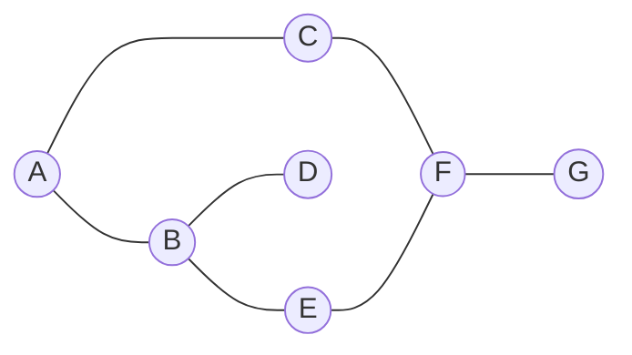
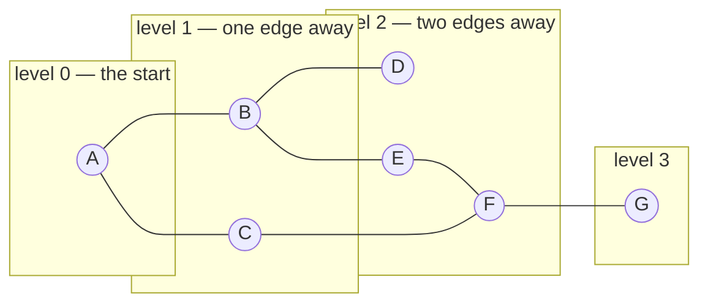
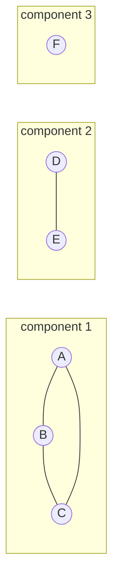
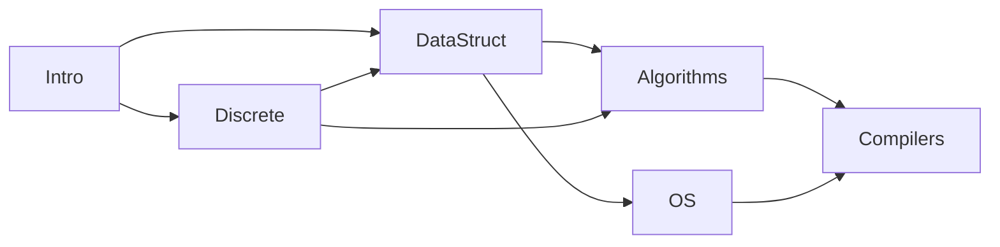

# 37.2 Breadth-first and depth-first search

Almost every question you can ask about a graph reduces to *visiting every
vertex reachable from somewhere*, and there are exactly two famous ways to do
it. Breadth-first search explores in rings — everything one edge away, then
everything two edges away — and depth-first search plunges down one path until
it is stuck, then backs up. What is remarkable, and what this section is built
around, is that the two algorithms are **the same eight lines of code**. Swap
one container for another and BFS becomes DFS. Understand that single
substitution and you understand both, plus the half-dozen classic algorithms
built on top of them: connected components, cycle detection, bipartite
checking, topological ordering, and shortest paths in unweighted graphs.

Throughout this page we use one small undirected graph. Draw it once; every
trace below refers to it.



As an adjacency map, with neighbours listed in a fixed order (that order
matters, and we will see exactly how much):

```python
graph = {
    "A": ["B", "C"],
    "B": ["A", "D", "E"],
    "C": ["A", "F"],
    "D": ["B"],
    "E": ["B", "F"],
    "F": ["C", "E", "G"],
    "G": ["F"],
}

print("V =", len(graph))
print("E =", sum(len(n) for n in graph.values()) // 2)
for v, nbrs in graph.items():
    print(f"  {v}: {nbrs}")
```

## Breadth-first search: rings around the start

BFS uses a [queue](../ch19-stacks-queues/03-queues.md) — first in, first out.
Put the start vertex in, then repeatedly take the front vertex out and push
every unvisited neighbour onto the back.

!!! note "The BFS guarantee"

    Because the queue is FIFO, everything at distance 1 enters before anything
    at distance 2. So vertices come out in **non-decreasing order of
    distance** — and that single fact is where every BFS result on this page
    comes from.

Starting at `A`, the rings are:



The **frontier** is the set of vertices currently in the queue: `{A}`, then
`{B, C}`, then `{D, E, F}`, then `{G}`. Here is BFS printing exactly that,
level by level:

```python
from collections import deque

graph = {
    "A": ["B", "C"], "B": ["A", "D", "E"], "C": ["A", "F"], "D": ["B"],
    "E": ["B", "F"], "F": ["C", "E", "G"], "G": ["F"],
}

def bfs(graph, start):
    visited = {start}                  # mark when ENQUEUED, not when dequeued
    queue = deque([start])
    order = []
    while queue:
        v = queue.popleft()            # FIFO: take from the front
        order.append(v)
        for nbr in graph[v]:
            if nbr not in visited:
                visited.add(nbr)
                queue.append(nbr)      # … and add to the back
    return order

def bfs_levels(graph, start):
    """The same walk, but grouped into rings."""
    visited = {start}
    frontier = [start]
    levels = []
    while frontier:
        levels.append(frontier)
        nxt = []
        for v in frontier:
            for nbr in graph[v]:
                if nbr not in visited:
                    visited.add(nbr)
                    nxt.append(nbr)
        frontier = nxt
    return levels

print("BFS visit order:", " -> ".join(bfs(graph, "A")))
for d, ring in enumerate(bfs_levels(graph, "A")):
    print(f"  level {d}: {ring}")
```

```text
BFS visit order: A -> B -> C -> D -> E -> F -> G
  level 0: ['A']
  level 1: ['B', 'C']
  level 2: ['D', 'E', 'F']
  level 3: ['G']
```

Two details in that code are worth pausing on, because both are the source of
classic bugs.

**Mark on enqueue, not on dequeue.** `visited.add(nbr)` happens at the moment
the neighbour is pushed. If you instead marked vertices when you popped them,
a vertex with three unvisited-looking neighbours could be pushed three times
before its first pop, and the queue would fill with duplicates. The visit
*order* would still be right, but the queue could grow to $O(E)$ and each
duplicate costs work.

**`deque`, not `list`.** `list.pop(0)` removes from the front by shifting every
remaining element left — $O(n)$ per call, which quietly turns BFS into a
quadratic algorithm. `collections.deque` pops from either end in $O(1)$. This
is exactly the point [Chapter 19](../ch19-stacks-queues/03-queues.md) made
about queues, arriving now with real consequences.

## Depth-first search: dive, then back up

DFS makes the opposite choice: always continue from the vertex you saw *most*
recently. Written recursively it is barely an algorithm at all — it is just a
function that calls itself on each neighbour, with a set to stop it looping.

```python
graph = {
    "A": ["B", "C"], "B": ["A", "D", "E"], "C": ["A", "F"], "D": ["B"],
    "E": ["B", "F"], "F": ["C", "E", "G"], "G": ["F"],
}

def dfs_recursive(graph, start):
    visited = set()
    order = []

    def visit(v, depth):
        visited.add(v)
        order.append(v)
        print(f"{'  ' * depth}enter {v}")
        for nbr in graph[v]:
            if nbr not in visited:
                visit(nbr, depth + 1)
        print(f"{'  ' * depth}leave {v}")

    visit(start, 0)
    return order

order = dfs_recursive(graph, "A")
print("DFS visit order:", " -> ".join(order))
```

```text
enter A
  enter B
    enter D
    leave D
    enter E
      enter F
        enter C
        leave C
        enter G
        leave G
      leave F
    leave E
  leave B
leave A
DFS visit order: A -> B -> D -> E -> F -> C -> G
```

The indented `enter`/`leave` trace *is* the DFS tree, drawn sideways, and it
yields two orderings worth naming:

- **Pre-order** — the order vertices are first entered: `A B D E F C G`.
- **Post-order** — the order they are left: `D C G F E B A`.

Both are useful, and the post-order turns out to be the key to topological
sorting later on this page.

Compare that trace with the tree traversals of
[Chapter 20](../ch20-bst/03-traversals-balance.md) and you will recognise it
immediately: DFS on a graph is a tree traversal with a visited set bolted on
to cope with cycles.

## The same DFS with an explicit stack

Recursion works because Python's call stack remembers where to come back to.
Replace it with a [stack](../ch19-stacks-queues/02-stacks.md) you manage
yourself and the recursion disappears — which is the trade
[section 17.3](../ch17-recursion/03-vs-iteration.md) is about. This matters
practically: Python's default recursion limit is around a thousand frames, so
recursive DFS on a long chain of vertices *crashes*, while the iterative
version does not.

```python
graph = {
    "A": ["B", "C"], "B": ["A", "D", "E"], "C": ["A", "F"], "D": ["B"],
    "E": ["B", "F"], "F": ["C", "E", "G"], "G": ["F"],
}

def dfs_stack(graph, start, reverse_push=False):
    visited = set()
    order = []
    stack = [start]
    while stack:
        v = stack.pop()                # LIFO: take from the END
        if v in visited:               # it may have been pushed twice
            continue
        visited.add(v)                 # mark on POP for the stack version
        order.append(v)
        nbrs = graph[v][::-1] if reverse_push else graph[v]
        for nbr in nbrs:
            if nbr not in visited:
                stack.append(nbr)
    return order

print("stack DFS, neighbours pushed in order:  ",
      " -> ".join(dfs_stack(graph, "A")))
print("stack DFS, neighbours pushed reversed:  ",
      " -> ".join(dfs_stack(graph, "A", reverse_push=True)))
```

```text
stack DFS, neighbours pushed in order:   A -> C -> F -> G -> E -> B -> D
stack DFS, neighbours pushed reversed:   A -> B -> D -> E -> F -> C -> G
```

Both lines are correct depth-first searches. They differ because a stack
reverses whatever you push into it: pushing `B` then `C` means `C` comes off
first. To reproduce the *recursive* order exactly, push the neighbours in
reverse.

Textbooks and interviewers rarely mention that, and it is the single most
common reason a hand-traced DFS disagrees with a running one.

Note also that the stack version marks vertices visited on **pop**, not on
push, and therefore needs the `if v in visited: continue` guard — a vertex can
sit in the stack more than once. That is the mirror image of BFS's rule, and it
is deliberate: marking on pop is what lets DFS reach a vertex by the deepest
available route.

!!! warning "Recursive DFS has a depth limit"

    A graph that is one long chain sends the recursive version straight into
    Python's frame limit. The block below is *meant* to fail — that is what
    the `# raises` marker means.

```python
# raises RecursionError
chain = {i: [i + 1] for i in range(3000)}
chain[3000] = []

def visit(v, visited):
    visited.add(v)
    for nbr in chain[v]:
        if nbr not in visited:
            visit(nbr, visited)

visit(0, set())          # ~3000 nested frames: over the default limit
```

The iterative version handles the same chain without complaint, because its
stack lives on the heap where there is room:

```python
chain = {i: [i + 1] for i in range(3000)}
chain[3000] = []

visited, stack, count = set(), [0], 0
while stack:
    v = stack.pop()
    if v in visited:
        continue
    visited.add(v)
    count += 1
    for nbr in chain[v]:
        if nbr not in visited:
            stack.append(nbr)

print(f"iterative DFS visited {count} vertices, deepest stack was fine")
```

## The single structural difference

Put the two algorithms side by side with everything except the container held
constant, and the claim at the top of this page becomes literal:

```python
from collections import deque

graph = {
    "A": ["B", "C"], "B": ["A", "D", "E"], "C": ["A", "F"], "D": ["B"],
    "E": ["B", "F"], "F": ["C", "E", "G"], "G": ["F"],
}

def traverse(graph, start, mode):
    """One function, two algorithms. `mode` picks the container."""
    frontier = deque([start])
    visited = set()
    order = []
    while frontier:
        v = frontier.popleft() if mode == "bfs" else frontier.pop()
        if v in visited:
            continue
        visited.add(v)
        order.append(v)
        nbrs = graph[v] if mode == "bfs" else graph[v][::-1]
        for nbr in nbrs:
            if nbr not in visited:
                frontier.append(nbr)
    return order

for mode in ("bfs", "dfs"):
    print(f"{mode.upper()}: {' -> '.join(traverse(graph, 'A', mode))}")
```

```text
BFS: A -> B -> C -> D -> E -> F -> G
DFS: A -> B -> D -> E -> F -> C -> G
```

`popleft()` versus `pop()`. That is the entire difference between an algorithm
that finds shortest paths and one that finds deep structure. Everything else —
the visited set, the neighbour loop, the order list — is shared.

| | BFS | DFS |
|---|---|---|
| Container | queue (FIFO) | stack (LIFO) |
| Explores | in rings, nearest first | one branch to the end, then backtracks |
| Extra memory | $O(\text{widest level})$ | $O(\text{longest path})$ |
| Finds shortest unweighted paths | **yes** | no |
| Natural for | distances, levels, "closest match" | cycles, topological order, connectivity, backtracking |
| Recursive form | awkward | natural |

Neither is better. On a wide, shallow graph (a social network) BFS's frontier
can be enormous while DFS's stack stays short; on a long, thin graph (a chain
of dependencies) it is the reverse.

## Why the visited set is what makes cycles safe

A tree traversal needs no visited set, because a tree has no cycles — you can
never come back. Our graph has a cycle, `B — E — F — C — A — B`, and without
the set a traversal walks it forever. Rather than assert that, let us count
it. The block below runs BFS *without* a visited set but with a hard budget
of 60 dequeues, so it stops instead of hanging:

```python
from collections import deque

graph = {
    "A": ["B", "C"], "B": ["A", "D", "E"], "C": ["A", "F"], "D": ["B"],
    "E": ["B", "F"], "F": ["C", "E", "G"], "G": ["F"],
}

def bfs_no_visited(graph, start, budget=60):
    """Deliberately broken: no visited set. The budget is the only thing
    that stops this loop, and it would never stop on its own."""
    queue = deque([start])
    times_seen = {v: 0 for v in graph}
    steps = 0
    while queue and steps < budget:
        v = queue.popleft()
        times_seen[v] += 1
        steps += 1
        for nbr in graph[v]:
            queue.append(nbr)          # no check at all
    return times_seen, len(queue)

seen, still_queued = bfs_no_visited(graph, "A")
print("after 60 dequeues, times each vertex was processed:")
for v, n in seen.items():
    print(f"  {v}: {n}")
print("vertices still waiting in the queue:", still_queued)
print("with a visited set the whole traversal takes 7 dequeues.")
```

```text
after 60 dequeues, times each vertex was processed:
  A: 10
  B: 15
  C: 10
  D: 5
  E: 8
  F: 9
  G: 3
vertices still waiting in the queue: 77
with a visited set the whole traversal takes 7 dequeues.
```

Sixty steps in, the queue is not shrinking — it is *growing*, from a single
entry to seventy-seven, because every vertex keeps re-adding its neighbours.
There are seven vertices in this graph and `B` has already been processed
fifteen times. Left alone, the loop runs until memory fails.

The fix is one `set` and two lines, and the reason it is a `set` rather than a
list is the $O(1)$ membership test from
[Chapter 14](../ch14-beyond/01-collections-tour.md).

Note that a visited set does something subtler than "prevent infinite loops":
it guarantees each vertex is processed **exactly once**, which is what makes
the cost linear.

## The cost: $O(V + E)$, derived

Count the work in the shared `traverse` loop above.

- Each vertex is added to the frontier at most once (BFS, marking on enqueue)
  or at most $\deg(v)$ times (DFS, marking on pop), and it is *processed* —
  appended to `order`, its neighbour loop run — exactly once, because of the
  visited check.
- Processing vertex $v$ runs its neighbour loop $\deg(v)$ times.
- So the total neighbour-loop work is $\sum_v \deg(v)$, which is $2E$ for an
  undirected graph and $E$ for a directed one.
- Every individual operation — `set` add, `set` membership, `deque` append,
  `deque` popleft, `list` append — is $O(1)$.

Total: $O(V + E)$. Both terms are needed: a graph with a million isolated
vertices and no edges still costs $O(V)$ to walk, and a graph with ten
vertices and forty-five edges costs $O(E)$. Here is that linearity measured
rather than argued:

```python
from collections import deque
import time

def make_ring_graph(n, extra=2):
    """A ring plus a deterministic chord from every vertex: V = n, E = 2n."""
    g = {v: [] for v in range(n)}
    for v in range(n):
        for u in ((v + 1) % n, (v + extra * 17 + 1) % n):
            if u != v and u not in g[v]:
                g[v].append(u)
                g[u].append(v)
    return g

def bfs_count(g, start):
    visited, queue, edges_looked_at = {start}, deque([start]), 0
    while queue:
        v = queue.popleft()
        for nbr in g[v]:
            edges_looked_at += 1
            if nbr not in visited:
                visited.add(nbr)
                queue.append(nbr)
    return len(visited), edges_looked_at

print(f"{'V':>8}{'E':>9}{'V+E':>9}{'neighbour looks':>17}{'ms':>8}")
for n in (1000, 2000, 4000, 8000):
    g = make_ring_graph(n)
    E = sum(len(x) for x in g.values()) // 2
    t0 = time.perf_counter()
    reached, looks = bfs_count(g, 0)
    ms = (time.perf_counter() - t0) * 1000
    print(f"{n:>8}{E:>9}{n + E:>9}{looks:>17}{ms:>8.1f}")
```

```text
       V        E      V+E  neighbour looks      ms
    1000     2000     3000             4000     0.1
    2000     4000     6000             8000     0.3
    4000     8000    12000            16000     0.6
    8000    16000    24000            32000     1.2
```

The "neighbour looks" column is exactly $2E$ every time — never more, never
less — and doubling $V$ roughly doubles the milliseconds too. (The absolute
times depend on your machine; the counts do not.) That is what $O(V + E)$ looks
like on a clock.

## Application 1 — connected components

A graph need not be in one piece. A **connected component** is a maximal set
of vertices that can all reach each other. Finding them is one traversal per
component: start anywhere unvisited, traverse everything reachable, repeat.



```python
from collections import deque

graph = {
    "A": ["B", "C"], "B": ["A", "C"], "C": ["A", "B"],
    "D": ["E"], "E": ["D"],
    "F": [],
}

def components(graph):
    seen = set()
    found = []
    for start in graph:
        if start in seen:
            continue
        comp, queue = [], deque([start])
        seen.add(start)
        while queue:
            v = queue.popleft()
            comp.append(v)
            for nbr in graph[v]:
                if nbr not in seen:
                    seen.add(nbr)
                    queue.append(nbr)
        found.append(comp)
    return found

comps = components(graph)
print(f"{len(comps)} components:")
for i, c in enumerate(comps, 1):
    print(f"  {i}: {sorted(c)}  (size {len(c)})")
print("largest component size:", max(len(c) for c in comps))
```

```text
3 components:
  1: ['A', 'B', 'C']  (size 3)
  2: ['D', 'E']  (size 2)
  3: ['F']  (size 1)
largest component size: 3
```

The outer `for start in graph` loop is what makes this $O(V + E)$ overall
rather than per-component: each vertex is a start candidate once, and the
`seen` check skips it immediately if some earlier traversal already claimed
it. This little routine answers "is the network fully connected?", "how many
separate friend groups are there?", and "which files are unreachable from
`main`?".

## Application 2 — is the graph bipartite?

A graph is **bipartite** if its vertices can be split into two groups such
that every edge goes *between* the groups, never inside one. Equivalently: can
you colour it with two colours so no edge joins same-coloured vertices?
Bipartite graphs model any two-sided relationship — students and courses,
jobs and machines, buyers and sellers — and matching algorithms depend on
recognising them.

BFS answers this for free. Colour the start 0; colour every neighbour the
opposite of your own colour; if you ever meet an already-coloured neighbour
with *your* colour, the graph is not bipartite.

```python
from collections import deque

def is_bipartite(graph):
    colour = {}
    for start in graph:
        if start in colour:
            continue
        colour[start] = 0
        queue = deque([start])
        while queue:
            v = queue.popleft()
            for nbr in graph[v]:
                if nbr not in colour:
                    colour[nbr] = 1 - colour[v]
                    queue.append(nbr)
                elif colour[nbr] == colour[v]:
                    return False, (v, nbr), colour
    return True, None, colour

square = {"A": ["B", "D"], "B": ["A", "C"], "C": ["B", "D"], "D": ["C", "A"]}
triangle = {"X": ["Y", "Z"], "Y": ["X", "Z"], "Z": ["X", "Y"]}

for name, g in [("4-cycle A-B-C-D-A", square), ("triangle X-Y-Z", triangle)]:
    ok, clash, colour = is_bipartite(g)
    if ok:
        side0 = sorted(v for v in colour if colour[v] == 0)
        side1 = sorted(v for v in colour if colour[v] == 1)
        print(f"{name}: bipartite. {side0} | {side1}")
    else:
        print(f"{name}: NOT bipartite — edge {clash[0]}-{clash[1]} joins "
              f"two vertices of colour {colour[clash[0]]}")
```

```text
4-cycle A-B-C-D-A: bipartite. ['A', 'C'] | ['B', 'D']
triangle X-Y-Z: NOT bipartite — edge Y-Z joins two vertices of colour 1
```

There is a theorem hiding in those two examples: **a graph is bipartite if and
only if it contains no odd-length cycle.** The 4-cycle is even and colours
fine; the triangle is a 3-cycle and cannot. Walking a cycle alternates colours
at every step, so you return to the start with the original colour only if the
cycle has even length.

## Application 3 — cycle detection

Detecting a cycle takes two different algorithms depending on whether the graph
is directed, and the difference trips up nearly everyone the first time.

### Undirected: track the parent

In an undirected graph, every edge `u — v` looks like a cycle from `u`'s point
of view, because `v`'s neighbour list contains `u` right back. So the rule is:
seeing an already-visited neighbour means a cycle *unless* that neighbour is
the vertex you just came from.

```python
def has_cycle_undirected(graph):
    visited = set()

    def visit(v, parent):
        visited.add(v)
        for nbr in graph[v]:
            if nbr not in visited:
                if visit(nbr, v):
                    return True
            elif nbr != parent:        # visited AND not where we came from
                return True
        return False

    return any(visit(v, None) for v in graph if v not in visited)

tree = {"A": ["B", "C"], "B": ["A", "D"], "C": ["A"], "D": ["B"]}
ring = {"A": ["B", "C"], "B": ["A", "D"], "C": ["A", "D"], "D": ["B", "C"]}

print("tree  A-B, A-C, B-D        has a cycle?", has_cycle_undirected(tree))
print("ring  A-B, A-C, B-D, C-D   has a cycle?", has_cycle_undirected(ring))
print("edges in the tree:", sum(len(n) for n in tree.values()) // 2,
      "= V - 1, the signature of an acyclic connected graph")
```

```text
tree  A-B, A-C, B-D        has a cycle? False
ring  A-B, A-C, B-D, C-D   has a cycle? True
edges in the tree: 3 = V - 1, the signature of an acyclic connected graph
```

### Directed: three colours

The parent trick does not work on a directed graph, because `u → v` does not
imply `v → u`. Instead, track *where each vertex is in the traversal*:

- **white** — not visited yet;
- **grey** — visiting now: it is on the current recursion path;
- **black** — finished: it and everything below it are done.

An edge to a **grey** vertex is a **back edge**, and a back edge means a
cycle: you have found a way back to a vertex that is still on your own path.
An edge to a black vertex is fine — it just means two paths merge.

```python
WHITE, GREY, BLACK = 0, 1, 2

def find_cycle_directed(graph):
    """Return a cycle as a list of vertices, or None if the graph is a DAG."""
    colour = {v: WHITE for v in graph}
    stack = []                          # the current grey path

    def visit(v):
        colour[v] = GREY
        stack.append(v)
        for nbr in graph[v]:
            if colour[nbr] == GREY:                 # back edge -> cycle
                return stack[stack.index(nbr):] + [nbr]
            if colour[nbr] == WHITE:
                found = visit(nbr)
                if found:
                    return found
        stack.pop()
        colour[v] = BLACK
        return None

    for v in graph:
        if colour[v] == WHITE:
            found = visit(v)
            if found:
                return found
    return None

cyclic = {"A": ["B"], "B": ["C"], "C": ["A", "D"], "D": ["E"],
          "E": ["F"], "F": ["D"]}
dag = {"A": ["B", "C"], "B": ["D"], "C": ["D"], "D": []}

print("cyclic graph:", find_cycle_directed(cyclic))
print("DAG:         ", find_cycle_directed(dag))
```

```text
cyclic graph: ['A', 'B', 'C', 'A']
DAG:          None
```

The grey stack is doing double duty: it detects the cycle *and* reports it, by
slicing itself from the repeated vertex onward.

Being able to print the actual cycle — not just "yes there is one" — is what
makes this useful in a build tool, where the error message needs to name the
files involved.

## Application 4 — topological sort

Here is the payoff for DAGs. A **topological order** is a listing of the
vertices such that every edge points forward: if $u \to v$, then $u$ appears
before $v$. For a prerequisite graph that is a legal study plan; for a build
graph it is a legal compile order; for a spreadsheet it is the order to
recompute cells.



There are two standard algorithms, and it is worth knowing both because they
fail differently and produce different (equally valid) orders.

### Kahn's algorithm — BFS on in-degrees

Repeat one move until the graph runs out:

1. Take a vertex whose in-degree is **0** — nothing left is blocking it.
2. Output it.
3. Decrement the in-degree of everything it points at, and enqueue any that
   just reached 0.

```python
from collections import deque

courses = {
    "Intro":      ["Discrete", "DataStruct"],
    "Discrete":   ["DataStruct", "Algorithms"],
    "DataStruct": ["Algorithms", "OS"],
    "Algorithms": ["Compilers"],
    "OS":         ["Compilers"],
    "Compilers":  [],
}

def kahn(graph):
    in_deg = {v: 0 for v in graph}
    for v in graph:
        for u in graph[v]:
            in_deg[u] += 1

    ready = deque(v for v in graph if in_deg[v] == 0)
    order = []
    while ready:
        v = ready.popleft()
        order.append(v)
        for u in graph[v]:
            in_deg[u] -= 1
            if in_deg[u] == 0:
                ready.append(u)
    if len(order) < len(graph):
        blocked = [v for v in graph if v not in order]
        raise ValueError(f"cycle detected; never scheduled: {sorted(blocked)}")
    return order

order = kahn(courses)
print("a legal study plan:")
for i, c in enumerate(order, 1):
    print(f"  semester {i}: {c}")
```

```text
a legal study plan:
  semester 1: Intro
  semester 2: Discrete
  semester 3: DataStruct
  semester 4: Algorithms
  semester 5: OS
  semester 6: Compilers
```

### DFS-based topological sort — reverse the post-order

This one is even shorter, and rests on a small observation: in a DAG, a vertex
*finishes* (turns black) only after everything reachable from it has finished.
So the reverse of the post-order is a topological order.

```python
courses = {
    "Intro":      ["Discrete", "DataStruct"],
    "Discrete":   ["DataStruct", "Algorithms"],
    "DataStruct": ["Algorithms", "OS"],
    "Algorithms": ["Compilers"],
    "OS":         ["Compilers"],
    "Compilers":  [],
}

def topo_dfs(graph):
    visited, finished = set(), []

    def visit(v):
        visited.add(v)
        for u in graph[v]:
            if u not in visited:
                visit(u)
        finished.append(v)             # post-order: after all descendants

    for v in graph:
        if v not in visited:
            visit(v)
    return finished[::-1]              # reverse it

order = topo_dfs(courses)
print("post-order reversed:", order)

# Verify: every edge must point forwards in the list.
pos = {v: i for i, v in enumerate(order)}
bad = [(u, v) for u in courses for v in courses[u] if pos[u] > pos[v]]
print("edges pointing backwards:", bad, "-> valid" if not bad else "-> INVALID")
```

```text
post-order reversed: ['Intro', 'Discrete', 'DataStruct', 'OS', 'Algorithms', 'Compilers']
edges pointing backwards: [] -> valid
```

Two different orders — Kahn put `Algorithms` before `OS`, DFS put `OS` first —
and *both are correct*, because there is no edge between those two courses. A
DAG generally has many topological orders; an algorithm is required to produce
one, not a specific one.

### What if the prerequisites are impossible?

Add one edge that closes a loop — say the Compilers course secretly requires
Discrete, which requires DataStruct, which requires Algorithms, which requires
Compilers — and Kahn's algorithm cannot start it:

```python
# raises ValueError
from collections import deque

courses = {
    "Intro":      ["Discrete", "DataStruct"],
    "Discrete":   ["DataStruct", "Algorithms"],
    "DataStruct": ["Algorithms", "OS"],
    "Algorithms": ["Compilers"],
    "OS":         ["Compilers"],
    "Compilers":  ["Discrete"],           # <-- the impossible edge
}

def kahn(graph):
    in_deg = {v: 0 for v in graph}
    for v in graph:
        for u in graph[v]:
            in_deg[u] += 1
    ready = deque(v for v in graph if in_deg[v] == 0)
    order = []
    while ready:
        v = ready.popleft()
        order.append(v)
        for u in graph[v]:
            in_deg[u] -= 1
            if in_deg[u] == 0:
                ready.append(u)
    if len(order) < len(graph):
        blocked = sorted(v for v in graph if v not in order)
        raise ValueError(f"cycle detected; never scheduled: {blocked}")
    return order

print(kahn(courses))
```

The error names exactly the courses caught in the loop, which is what a good
build tool prints.

Notice that Kahn's algorithm detects the cycle *for free*. It does not need a
separate check; it simply notices that it ran out of ready vertices before it
ran out of graph.

## Application 5 — shortest paths without weights

Finally, the guarantee BFS has been quietly earning all page. Because BFS
processes vertices in non-decreasing distance order, **the first time it
reaches a vertex is along a path with the fewest possible edges**. Record who
discovered whom — a *parent pointer* — and the path itself falls out by
walking backwards from the destination.

```python
from collections import deque

graph = {
    "A": ["B", "C"], "B": ["A", "D", "E"], "C": ["A", "F"], "D": ["B"],
    "E": ["B", "F"], "F": ["C", "E", "G"], "G": ["F"],
}

def bfs_paths(graph, start):
    dist = {start: 0}
    parent = {start: None}
    queue = deque([start])
    while queue:
        v = queue.popleft()
        for nbr in graph[v]:
            if nbr not in dist:
                dist[nbr] = dist[v] + 1
                parent[nbr] = v
                queue.append(nbr)
    return dist, parent

def reconstruct(parent, target):
    """Walk parent pointers backwards, then flip the list."""
    if target not in parent:
        return None                     # unreachable
    path = []
    while target is not None:
        path.append(target)
        target = parent[target]
    return path[::-1]

dist, parent = bfs_paths(graph, "A")
print("distances from A:", dist)
print("parent pointers: ", parent)
for target in ("D", "F", "G"):
    path = reconstruct(parent, target)
    print(f"  A to {target}: {' -> '.join(path)}  ({dist[target]} edges)")
```

```text
distances from A: {'A': 0, 'B': 1, 'C': 1, 'D': 2, 'E': 2, 'F': 2, 'G': 3}
parent pointers:  {'A': None, 'B': 'A', 'C': 'A', 'D': 'B', 'E': 'B', 'F': 'C', 'G': 'F'}
  A to D: A -> B -> D  (2 edges)
  A to F: A -> C -> F  (2 edges)
  A to G: A -> C -> F -> G  (3 edges)
```

The parent dictionary is a tree — the **BFS tree** — rooted at the start, and
it contains a shortest path to *every* reachable vertex simultaneously. One
$O(V + E)$ traversal answers "how far is everything from here?" for the whole
graph, which is a much better deal than it first appears.

There are two ways to lose this guarantee, and both are common:

- **Use a stack instead of a queue.** You still get *a* path, generally a
  terrible one.
- **Put weights on the edges.** "Fewest edges" stops meaning "cheapest route"
  — which is exactly where [§37.3](03-shortest-paths.md) begins.

!!! warning "Common mistakes"

    - **Marking visited at the wrong moment.** BFS must mark on *enqueue*
      (otherwise duplicates flood the queue and distances can be recorded
      twice); the iterative DFS must mark on *pop* and re-check, because a
      vertex legitimately sits in the stack more than once. Copying one
      pattern into the other algorithm produces subtly wrong results.
    - **`queue.pop(0)` on a list.** It looks like a queue and behaves like one,
      but each call is $O(n)$. Import `deque`.
    - **Undirected cycle detection without the parent check.** Every single
      edge will be reported as a cycle, because `v`'s neighbour list contains
      the vertex you arrived from.
    - **Assuming the topological order is unique.** It almost never is. Test
      the *property* — every edge points forwards — not equality against one
      expected list.
    - **Expecting BFS distances to be meaningful on a weighted graph.** BFS
      counts edges. If the edges are kilometres, three short hops may be far
      cheaper than one long one, and BFS will confidently return the long one.
    - **Recursing on a large graph.** Recursive DFS is beautiful and dies at
      roughly a thousand levels deep. Long chains, linked-list-shaped graphs,
      and grid mazes all reach that easily.

## Check your understanding

1. On the page's graph, BFS from `A` visits `A B C D E F G` and DFS visits
   `A B D E F C G`. Both start `A B`. At which vertex do they first diverge,
   and why?

    ??? success "Answer"
        At the third vertex. After processing `A`, both have `B` and `C` in
        the frontier. BFS takes from the front and gets `C` — a vertex at
        distance 1. DFS takes from the back, having just pushed `B`'s
        neighbours, and gets `D` — a vertex at distance 2. The container
        choice is the divergence.

2. You need to know whether a maze has *any* route from entrance to exit, on a
   grid with a million cells. BFS or DFS?

    ??? success "Answer"
        For existence alone, either works and DFS usually uses less memory —
        its stack holds one path, while BFS's frontier can hold a whole ring
        of cells. But use the **iterative** DFS: a million-cell maze has paths
        far longer than Python's recursion limit. If you need the *shortest*
        route, it must be BFS.

3. Kahn's algorithm raised `ValueError` on the cyclic course graph. How did it
   know, given that it never explicitly looks for a cycle?

    ??? success "Answer"
        It counted. The loop can only output a vertex whose in-degree has
        reached 0, and every vertex inside a cycle is permanently blocked by
        another vertex in that cycle. So the loop runs dry with fewer than $V$
        vertices emitted, and `len(order) < len(graph)` is the detection. The
        unscheduled vertices are precisely those in or downstream of a cycle.

4. Why is the reverse of a DFS post-order a topological order?

    ??? success "Answer"
        Because a vertex is appended to the post-order only after every vertex
        reachable from it has already been appended. So for any edge
        $u \to v$, $v$ finishes before $u$, meaning $v$ sits earlier in the
        post-order and therefore *later* once the list is reversed — which is
        exactly the requirement that $u$ comes before $v$. (The argument needs
        the graph to be acyclic; with a cycle, "everything reachable finishes
        first" is impossible.)

5. A graph has 5,000 vertices and 4,999 edges and is connected. What shape is
   it, and what does that tell you about the maximum BFS frontier size?

    ??? success "Answer"
        Connected with exactly $V-1$ edges means it is a **tree**. The
        frontier size depends entirely on the tree's shape: a star (one centre
        joined to 4,999 leaves) gives a frontier of 4,999 at level 1, while a
        path graph gives a frontier of 1 at every level — and that same path
        graph is the one that would blow the recursion limit in a recursive
        DFS. Same $V$, same $E$, opposite memory profiles.
