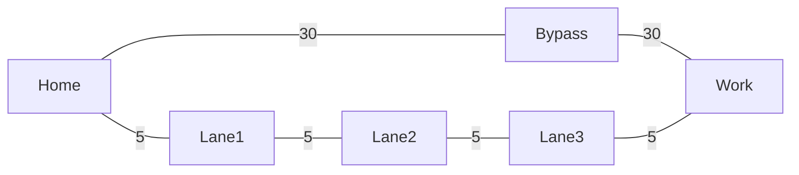
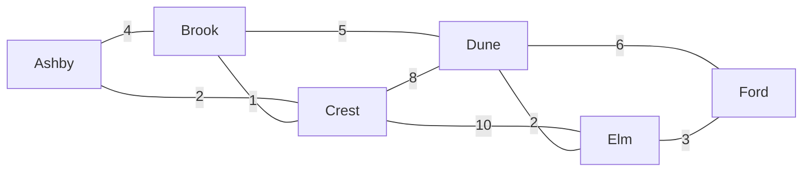
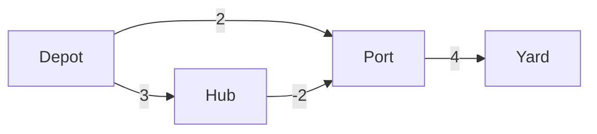

# 37.3 Shortest paths

Breadth-first search ended the last section with a guarantee: the first time it
reaches a vertex is along a path with the fewest edges. Real graphs quietly
break that guarantee, because in a real graph the edges are not
interchangeable. Roads have lengths, flights have prices, networks have
latencies, and "fewest hops" and "cheapest route" become different questions
with different answers. This section is about the second question. It builds up
through four algorithms — Dijkstra, Bellman-Ford, A\*, and Floyd-Warshall —
chosen because each one exists to fix a specific way the previous one fails.
Along the way we will make Dijkstra return a *wrong* answer on purpose, because
knowing exactly where an algorithm's guarantee runs out is worth more than
knowing the algorithm.

## Weights break BFS

Here is a commuter's graph. There is a fast bypass with two long legs, and a
back route through four short residential lanes.



BFS counts edges, so it will find the two-hop route and stop. Watch it choose
the route that takes three times as long:

```python
from collections import deque

roads = {
    "Home":   {"Bypass": 30, "Lane1": 5},
    "Bypass": {"Home": 30, "Work": 30},
    "Lane1":  {"Home": 5, "Lane2": 5},
    "Lane2":  {"Lane1": 5, "Lane3": 5},
    "Lane3":  {"Lane2": 5, "Work": 5},
    "Work":   {"Bypass": 30, "Lane3": 5},
}

def bfs_path(g, start, target):
    parent = {start: None}
    queue = deque([start])
    while queue:
        v = queue.popleft()
        for nbr in g[v]:
            if nbr not in parent:
                parent[nbr] = v
                queue.append(nbr)
    path, cur = [], target
    while cur is not None:
        path.append(cur)
        cur = parent[cur]
    return path[::-1]

def cost(g, path):
    return sum(g[a][b] for a, b in zip(path, path[1:]))

bfs_route = bfs_path(roads, "Home", "Work")
back_route = ["Home", "Lane1", "Lane2", "Lane3", "Work"]

for name, route in [("BFS's answer", bfs_route), ("the back lanes", back_route)]:
    print(f"{name:>15}: {' -> '.join(route):<45} "
          f"{len(route) - 1} hops, {cost(roads, route)} minutes")
```

```text
   BFS's answer: Home -> Bypass -> Work                        2 hops, 60 minutes
 the back lanes: Home -> Lane1 -> Lane2 -> Lane3 -> Work       4 hops, 20 minutes
```

BFS is not broken; it answered the question it was asked. The question just
stopped being the one we cared about. What we need is an algorithm that pulls
the *cheapest* frontier vertex next instead of the *earliest* one — and you
already own the structure that does that.

## Dijkstra's algorithm: BFS with a priority queue

Edsger Dijkstra's algorithm is BFS with one substitution: replace the FIFO
queue with a [priority queue](../ch21-heaps/02-priority-queues.md) keyed on
distance-so-far. The queue is the only thing that changes; the shape of the
loop is identical.

The algorithm maintains, for every vertex, a **tentative distance**: the best
route found *so far*. Initially that is 0 for the source and $\infty$ for
everything else. Then it repeats one move until the queue is empty:

1. Pop the unsettled vertex $u$ with the smallest tentative distance.
2. Declare $u$ **settled** — its tentative distance is now final.
3. **Relax** every edge out of $u$: for each neighbour $v$ with weight $w$, if
   $\text{dist}[u] + w < \text{dist}[v]$, we have found a better route to $v$;
   record it and push $v$ back onto the heap.

Step 2 is the whole algorithm, and it is a *claim*, not an observation. It says:

!!! note "The greedy invariant"

    When the vertex with the smallest tentative distance is popped, that
    distance is already optimal — no route discovered later can improve it.

Why should that be true? Suppose we pop $u$ with tentative distance $d$, and
suppose some better route to $u$ exists. That route must leave the settled
region somewhere, crossing to an unsettled vertex $x$ before eventually
reaching $u$. But $x$'s tentative distance is *at most* the length of that
route's prefix, and the rest of the route adds more length — so $x$'s tentative
distance is less than $d$, and $x$, not $u$, would have been popped. Contradiction.

Read that argument once more and notice the assumption it leans on: *the rest
of the route adds more length*. That is true only when every edge weight is
non-negative. Remember it; it is the load-bearing sentence of this page.

### The centrepiece: Dijkstra traced on a road map

Six towns, nine roads, distances in kilometres:



The implementation below prints the state after every settle: which vertex was
settled and at what distance, the full contents of the heap (the **frontier**),
and which tentative distances improved.

```python
import heapq

INF = float("inf")

def build(edge_list, directed=False):
    g = {}
    for u, v, w in edge_list:
        g.setdefault(u, {})[v] = w
        g.setdefault(v, {})
        if not directed:
            g[v][u] = w
    return g

roads = build([
    ("Ashby", "Brook", 4), ("Ashby", "Crest", 2), ("Brook", "Crest", 1),
    ("Brook", "Dune", 5), ("Crest", "Dune", 8), ("Crest", "Elm", 10),
    ("Dune", "Elm", 2), ("Dune", "Ford", 6), ("Elm", "Ford", 3),
])

def dijkstra(g, src, trace=False):
    dist = {v: INF for v in g}
    parent = {v: None for v in g}
    dist[src] = 0
    settled = set()
    heap = [(0, src)]                       # (tentative distance, vertex)
    step = 0

    if trace:
        print(f"{'step':>4} {'settle':>7} {'dist':>5}  "
              f"{'heap contents (the frontier)':<34} improved")
    while heap:
        d, u = heapq.heappop(heap)
        if u in settled:                    # a stale copy — see "lazy deletion"
            continue
        settled.add(u)
        step += 1
        improved = []
        for v, w in sorted(g[u].items()):
            if v in settled:
                continue
            if d + w < dist[v]:
                dist[v] = d + w
                parent[v] = u
                heapq.heappush(heap, (d + w, v))
                improved.append(f"{v}={d + w}")
        if trace:
            front = ", ".join(f"{v}:{x}" for x, v in sorted(heap))
            print(f"{step:>4} {u:>7} {d:>5}  {front:<34} {' '.join(improved)}")
    return dist, parent

def path_to(parent, target):
    path = []
    while target is not None:
        path.append(target)
        target = parent[target]
    return path[::-1]

dist, parent = dijkstra(roads, "Ashby", trace=True)

print("\nfinal distances from Ashby:")
for town in sorted(dist, key=dist.get):
    route = path_to(parent, town)
    print(f"  {town:<6} {dist[town]:>3} km   {' -> '.join(route)}")
```

```text
step  settle  dist  heap contents (the frontier)       improved
   1   Ashby     0  Crest:2, Brook:4                   Brook=4 Crest=2
   2   Crest     2  Brook:3, Brook:4, Dune:10, Elm:12  Brook=3 Dune=10 Elm=12
   3   Brook     3  Brook:4, Dune:8, Dune:10, Elm:12   Dune=8
   4    Dune     8  Dune:10, Elm:10, Elm:12, Ford:14   Elm=10 Ford=14
   5     Elm    10  Elm:12, Ford:13, Ford:14           Ford=13
   6    Ford    13  Ford:14

final distances from Ashby:
  Ashby    0 km   Ashby
  Crest    2 km   Ashby -> Crest
  Brook    3 km   Ashby -> Crest -> Brook
  Dune     8 km   Ashby -> Crest -> Brook -> Dune
  Elm     10 km   Ashby -> Crest -> Brook -> Dune -> Elm
  Ford    13 km   Ashby -> Crest -> Brook -> Dune -> Elm -> Ford
```

Follow the story that trace tells.

**Step 2 improves a route that already existed.** Ashby–Brook is a direct
4 km road, but going Ashby → Crest → Brook is 2 + 1 = 3 km. The moment Crest
is settled, `Brook=3` replaces the direct road. A greedy algorithm that
committed to the first route it found would have kept the 4.

**The cheapest route is the one with the most hops.** Ashby to Ford is five
edges long. Every shorter-hop alternative — via Crest → Elm (10 + 3 = 13 too,
by coincidence) or via Crest → Dune → Ford (2 + 8 + 6 = 16) — is no better or
much worse. This is the counterexample from the top of the page appearing
inside a real trace.

**The heap fills with stale entries.** Look at step 3: the frontier contains
both `Brook:3` and `Brook:4`. Both are copies of the same vertex at different
tentative distances. That is deliberate, and it has a name.

### Lazy deletion versus decrease-key

Textbook Dijkstra says "decrease the key of $v$ in the priority queue".
Python's `heapq` has no such operation, and neither do most heap
implementations, because finding an arbitrary element inside a binary heap
costs $O(n)$ unless you maintain a side index from vertex to heap position.

So real code does one of two things.

**Decrease-key** keeps exactly one heap entry per vertex and maintains a
`position` dictionary so the entry can be found and sifted up in $O(\log V)$.
The heap never exceeds $V$ entries. It is the version in the textbook analysis,
and it is genuinely more code: every swap inside the heap must update the
position map.

**Lazy deletion** — what the block above does — simply pushes a *new* entry and
leaves the stale one behind. When a stale entry surfaces, the `if u in settled`
check throws it away. The heap can grow to $O(E)$ entries instead of $O(V)$,
and there are up to $E$ pops instead of $V$.

The costs come out almost the same, which is why lazy deletion wins in practice:

$$
\underbrace{O(E \log V)}_{\text{lazy: } E \text{ pushes and pops}}
\quad\text{versus}\quad
\underbrace{O(V \log V + E \log V)}_{\text{decrease-key}} = O((V + E)\log V)
$$

Since $E \ge V - 1$ in a connected graph, both are $O(E \log V)$. Lazy deletion
uses more memory and less code, and the constant factor on "less code" is
usually the one that matters. One rule though: with lazy deletion you **must**
check for staleness on pop, either with a `settled` set as above or with
`if d > dist[u]: continue`. Skip it and every stale entry re-relaxes the whole
neighbourhood.

!!! info "The heap you already built"

    `heapq` is the same binary heap as
    [Chapter 21](../ch21-heaps/01-heap-property.md) — an array where the
    children of index $i$ live at $2i+1$ and $2i+2$, with `heappush` sifting up
    and `heappop` sifting down, both $O(\log n)$. Dijkstra is not using
    anything you have not implemented yourself.

## Where Dijkstra is simply wrong

Now the sentence we were told to remember: *the rest of the route adds more
length*. Negative edge weights make that false, and when it is false the greedy
invariant collapses.

Negative weights are not a contrivance. A freight network where consolidating a
load earns a rebate, a currency-exchange graph where a sequence of trades
produces a profit, a game where crossing a tile restores health — all of them
have edges that reduce the running total.



Read the picture: Depot → Port directly costs 2. Depot → Hub → Port costs
$3 + (-2) = 1$, which is cheaper. Dijkstra will not find it.

```python
import heapq

INF = float("inf")

freight = {
    "Depot": {"Port": 2, "Hub": 3},
    "Hub":   {"Port": -2},                 # a rebate for consolidating
    "Port":  {"Yard": 4},
    "Yard":  {},
}

def dijkstra(g, src):
    dist = {v: INF for v in g}
    dist[src] = 0
    settled = set()
    heap = [(0, src)]
    while heap:
        d, u = heapq.heappop(heap)
        if u in settled:
            continue
        settled.add(u)                     # <- the greedy commitment
        for v, w in g[u].items():
            if v in settled:               # <- never reconsidered
                continue
            if d + w < dist[v]:
                dist[v] = d + w
                heapq.heappush(heap, (d + w, v))
    return dist

truth = {"Depot": 0, "Hub": 3, "Port": 1, "Yard": 5}
got = dijkstra(freight, "Depot")

print(f"{'vertex':>7}{'Dijkstra':>10}{'truth':>7}   verdict")
for v in ("Depot", "Hub", "Port", "Yard"):
    mark = "ok" if got[v] == truth[v] else f"WRONG (off by {got[v] - truth[v]})"
    print(f"{v:>7}{got[v]:>10}{truth[v]:>7}   {mark}")
```

```text
 vertex  Dijkstra  truth   verdict
  Depot         0      0   ok
    Hub         3      3   ok
   Port         2      1   WRONG (off by 1)
   Yard         6      5   WRONG (off by 1)
```

Trace the failure exactly. Depot is settled at 0, giving `Port = 2` and
`Hub = 3`. Port has the smaller tentative distance, so Port is popped and
**settled at 2** — the algorithm has now promised that 2 is final. Only
afterwards is Hub popped, and the edge Hub → Port with weight $-2$ would have
given 1 — but Port is settled, so the edge is skipped. The error then
propagates: Yard was computed from the wrong Port distance and is wrong too.

!!! warning "The failure is silent"

    Dijkstra does not raise, warn, or return `None`. It returns a complete,
    plausible, wrong distance table. If your weights can ever be negative, no
    amount of testing on positive-weight graphs will reveal it.

A tempting patch is to delete the `if v in settled: continue` line and let
vertices be re-settled. That does produce the right answer here, but it is no
longer Dijkstra — it has become a slow, unstructured Bellman-Ford, it can
re-expand vertices exponentially many times on adversarial graphs, and it still
loops forever if the graph has a **negative cycle** (a cycle whose weights sum
to less than zero, around which you can lap forever getting cheaper). Another
tempting patch is to add a constant to every weight to make them all positive:
that changes the answer, because it penalises paths with more edges. Neither
patch is a fix. The fix is a different algorithm.

## Bellman-Ford: slower, and right

Bellman-Ford abandons the greedy commitment entirely. It never settles
anything. Instead it relaxes **every edge in the graph**, $V-1$ times.

The reasoning is a small induction. After one pass over all edges, every
shortest path that uses one edge is correct. After two passes, every shortest
path using two edges is correct. A shortest path in a graph with no negative
cycle visits no vertex twice, so it has at most $V-1$ edges — hence $V-1$
passes suffice. And if a $V$-th pass still improves something, then some path
with $V$ edges beats every shorter one, which is only possible if a negative
cycle exists.

```python
INF = float("inf")

def bellman_ford(vertices, edges, src, trace=False):
    dist = {v: INF for v in vertices}
    parent = {v: None for v in vertices}
    dist[src] = 0

    for i in range(len(vertices) - 1):
        changed = False
        for u, v, w in edges:
            if dist[u] != INF and dist[u] + w < dist[v]:
                dist[v] = dist[u] + w
                parent[v] = u
                changed = True
        if trace:
            print(f"  after pass {i + 1}: {dist}")
        if not changed:                    # early exit: nothing left to improve
            break

    for u, v, w in edges:                  # one extra pass = the cycle detector
        if dist[u] != INF and dist[u] + w < dist[v]:
            raise ValueError(f"negative cycle reachable via edge {u} -> {v}")
    return dist, parent

vertices = ["Depot", "Hub", "Port", "Yard"]
edges = [("Depot", "Port", 2), ("Depot", "Hub", 3),
         ("Hub", "Port", -2), ("Port", "Yard", 4)]

dist, parent = bellman_ford(vertices, edges, "Depot", trace=True)
print("Bellman-Ford result:", dist)

def path_to(parent, t):
    p = []
    while t is not None:
        p.append(t)
        t = parent[t]
    return " -> ".join(reversed(p))

print("cheapest Depot -> Port:", path_to(parent, "Port"), "=", dist["Port"])
print("cheapest Depot -> Yard:", path_to(parent, "Yard"), "=", dist["Yard"])
```

```text
  after pass 1: {'Depot': 0, 'Hub': 3, 'Port': 1, 'Yard': 5}
  after pass 2: {'Depot': 0, 'Hub': 3, 'Port': 1, 'Yard': 5}
Bellman-Ford result: {'Depot': 0, 'Hub': 3, 'Port': 1, 'Yard': 5}
cheapest Depot -> Port: Depot -> Hub -> Port = 1
cheapest Depot -> Yard: Depot -> Hub -> Port -> Yard = 5
```

Correct on the first pass, in fact — because the edge list happened to be in a
lucky order. Bellman-Ford is not clever; it is *thorough*, and thoroughness is
what buys correctness here. Notice the edge-list representation from
[§37.1](01-representations.md) is exactly the right input: the algorithm never
asks "who are $u$'s neighbours?", only "give me every edge again".

Now the detector, on a graph you can lap forever:

```python
# raises ValueError
INF = float("inf")

def bellman_ford(vertices, edges, src, trace=False):
    dist = {v: INF for v in vertices}
    dist[src] = 0
    for i in range(len(vertices) - 1):
        changed = False
        for u, v, w in edges:
            if dist[u] != INF and dist[u] + w < dist[v]:
                dist[v] = dist[u] + w
                changed = True
        if trace:
            print(f"  after pass {i + 1}: {dist}")
        if not changed:
            break
    for u, v, w in edges:
        if dist[u] != INF and dist[u] + w < dist[v]:
            raise ValueError(f"negative cycle reachable via edge {u} -> {v}")
    return dist

# X -> Y -> Z -> X costs 2 + (-4) + 1 = -1 per lap.
vertices = ["S", "X", "Y", "Z"]
edges = [("S", "X", 1), ("X", "Y", 2), ("Y", "Z", -4), ("Z", "X", 1)]
print(bellman_ford(vertices, edges, "S", trace=True))
```

```text
  after pass 1: {'S': 0, 'X': 0, 'Y': 3, 'Z': -1}
  after pass 2: {'S': 0, 'X': -1, 'Y': 2, 'Z': -2}
  after pass 3: {'S': 0, 'X': -2, 'Y': 1, 'Z': -3}
```

Every pass drops the distances by exactly one, forever, and then the final
check raises. "Shortest path" is *undefined* on such a graph — there is no
shortest path, only cheaper and cheaper ones — so raising is the honest
response. This detector is how currency-arbitrage finders work: model exchange
rates as $-\log(\text{rate})$ edges and a negative cycle *is* a profitable
sequence of trades.

## Choosing between them

| Algorithm | Time | Space | Negative weights | What it gives you |
|---|---|---|---|---|
| BFS | $O(V + E)$ | $O(V)$ | n/a — unweighted | fewest-edge paths from one source |
| Dijkstra, binary heap | $O(E \log V)$ | $O(V + E)$ | **no** | cheapest paths from one source |
| Dijkstra, Fibonacci heap | $O(E + V \log V)$ | $O(V)$ | **no** | same, better in theory, rarely in practice |
| A\* | $O(E \log V)$ worst case | $O(V + E)$ | no | one cheapest path, guided by a heuristic |
| Bellman-Ford | $O(V E)$ | $O(V)$ | **yes**, and detects negative cycles | cheapest paths from one source |
| Floyd-Warshall | $O(V^3)$ | $O(V^2)$ | yes (no negative cycles) | cheapest paths between *all* pairs |

The practical decision tree is short. Unweighted? BFS. Weighted,
non-negative? Dijkstra. Any negative weights? Bellman-Ford. Need every pair and
$V$ is small (a few hundred)? Floyd-Warshall. Have a good guess at the
remaining distance? A\*.

## A\*: Dijkstra with a hunch

Dijkstra spreads out equally in all directions, because it has no idea where
the goal is. If you are routing across a city and the destination is east, half
of Dijkstra's work explores west. A\* fixes that with one change: order the
heap by

$$
f(v) = g(v) + h(v)
$$

where $g(v)$ is the distance actually travelled to $v$ (what Dijkstra uses) and
$h(v)$ is a **heuristic** — an estimate of the remaining distance from $v$ to
the goal. Setting $h(v) = 0$ everywhere gives back Dijkstra exactly.

The heuristic must be **admissible**: it must never *overestimate* the true
remaining cost. That is the condition under which A\* still returns an optimal
path, and the argument is the greedy invariant again — if $h$ never
overestimates, then popping the smallest $f$ still means popping a vertex whose
$g$ is already final.

On a grid where you may move up, down, left, or right, and every step costs at
least 1, the **Manhattan distance** $|r_1 - r_2| + |c_1 - c_2|$ is admissible:
you cannot possibly reach the goal in fewer steps than that, so it never
overestimates. (Straight-line Euclidean distance is admissible too, and weaker
— it under-estimates more, so it guides less.)

Here is A\* and Dijkstra as the same function, run on two 31×31 grid maps: an
open plain, and one with a band of mud in the middle that costs 20 per cell
instead of 1.

```python
import heapq

N = 31
START, GOAL = (15, 1), (15, 29)

def open_plain(cell):
    return 1

def muddy(cell):
    r, c = cell
    return 20 if (13 <= c <= 17 and r >= 2) else 1   # a wall of mud, gap at the top

def neighbours(cell):
    r, c = cell
    for dr, dc in ((-1, 0), (1, 0), (0, -1), (0, 1)):
        p = (r + dr, c + dc)
        if 0 <= p[0] < N and 0 <= p[1] < N:
            yield p

def search(terrain, h):
    """Dijkstra when h returns 0; A* otherwise. Counts vertices expanded."""
    dist = {START: 0}
    parent = {START: None}
    heap = [(h(START), 0, START)]        # (f = g + h, g, cell)
    done = set()
    expanded = 0
    while heap:
        f, g, u = heapq.heappop(heap)
        if u in done:
            continue
        done.add(u)
        expanded += 1
        if u == GOAL:
            break                        # A* may stop the moment the goal pops
        for v in neighbours(u):
            ng = g + terrain(v)
            if ng < dist.get(v, float("inf")):
                dist[v] = ng
                parent[v] = u
                heapq.heappush(heap, (ng + h(v), ng, v))
    steps = 0
    cur = GOAL
    while parent.get(cur) is not None:
        cur = parent[cur]
        steps += 1
    return dist.get(GOAL), expanded, steps

manhattan = lambda c: abs(c[0] - GOAL[0]) + abs(c[1] - GOAL[1])

print(f"{'map':<12}{'heuristic':<26}{'path cost':>10}{'expanded':>10}{'steps':>7}")
for map_name, terrain in (("open plain", open_plain), ("mud band", muddy)):
    for h_name, h in (("h = 0  (plain Dijkstra)", lambda c: 0),
                      ("Manhattan (admissible)", manhattan),
                      ("5x Manhattan (NOT adm.)", lambda c: 5 * manhattan(c))):
        c, e, s = search(terrain, h)
        print(f"{map_name:<12}{h_name:<26}{c:>10}{e:>10}{s:>7}")
```

```text
map         heuristic                  path cost  expanded  steps
open plain  h = 0  (plain Dijkstra)           28       675     28
open plain  Manhattan (admissible)            28        29     28
open plain  5x Manhattan (NOT adm.)           28        29     28
mud band    h = 0  (plain Dijkstra)           56       722     56
mud band    Manhattan (admissible)            56       569     56
mud band    5x Manhattan (NOT adm.)          123       286     28
```

Three lessons in six rows.

**The payoff is real.** On the open plain, Dijkstra expands 675 of the 961
cells — it fans out in a diamond in every direction — while A\* expands 29, one
per step of the path. A twenty-three-fold reduction, same answer.

**The payoff shrinks when the heuristic is a poor guess.** On the mud map the
true cost is 56 but Manhattan still says 28, because it knows nothing about
mud. The estimate is admissible (it never overestimates) so the answer is still
optimal, but it under-guesses so badly that A\* only saves about a fifth of the
work. **A heuristic helps in proportion to how well it predicts.**

**Breaking admissibility breaks the answer.** Multiplying Manhattan by 5 makes
the estimate wildly optimistic about progress toward the goal — it *over*states
remaining cost, so A\* stops caring about cost already paid and charges
straight at the goal. It is fast (286 expansions instead of 569) and it is
wrong: it drives straight through the mud for a cost of 123 instead of 56, more
than double. Notice the trap — the returned path is *shorter in steps* (28
versus 56) and looks perfectly reasonable. Nothing about the output announces
that it is not optimal.

!!! tip "Inadmissible on purpose"

    Multiplying an admissible heuristic by $\varepsilon > 1$ is a real
    technique called **weighted A\***, used in robotics and games where a fast
    good-enough route beats a slow perfect one. The guarantee it keeps is that
    the returned path costs at most $\varepsilon$ times the optimum — bounded
    suboptimality, chosen deliberately. That is a different thing from having
    an inadmissible heuristic by accident.

## Floyd-Warshall: every pair, three lines

Sometimes you want the distance between *all* pairs — a routing table, a graph
diameter, a "closest facility" query answered instantly for any origin. Running
Dijkstra $V$ times works. Floyd-Warshall does it in three nested loops and is a
beautiful piece of dynamic programming.

Let $D_k[i][j]$ be the cheapest route from $i$ to $j$ using only vertices
numbered below $k$ as intermediate stops. Then the route either uses vertex $k$
or it does not:

$$
D_{k+1}[i][j] = \min\bigl(D_k[i][j],\; D_k[i][k] + D_k[k][j]\bigr)
$$

Do that for every $k$ and every pair, updating in place, and you are done.

```python
INF = float("inf")

names = ["A", "B", "C", "D"]
W = [
    [0,   3, INF,   7],
    [8,   0,   2, INF],
    [5, INF,   0,   1],
    [2, INF, INF,   0],
]

n = len(names)
D = [row[:] for row in W]                 # copy: never mutate the input

for k in range(n):                        # k = allowed intermediate vertex
    for i in range(n):
        for j in range(n):
            if D[i][k] + D[k][j] < D[i][j]:
                D[i][j] = D[i][k] + D[k][j]

print("     " + "".join(f"{c:>5}" for c in names))
for i, row in enumerate(D):
    print(f"{names[i]:>4} " + "".join(f"{x:>5}" for x in row))

print("graph diameter (longest shortest path):",
      max(D[i][j] for i in range(n) for j in range(n)))
```

```text
         A    B    C    D
   A     0    3    5    6
   B     5    0    2    3
   C     3    6    0    1
   D     2    5    7    0
graph diameter (longest shortest path): 7
```

The direct road A → D is 7, but the table says 6, via B and C: $3 + 2 + 1$. The
whole table was computed with 64 comparisons.

The loop order matters and is the most common Floyd-Warshall bug: `k` must be
the **outermost** loop. Written `for i / for j / for k` the algorithm silently
produces wrong answers, because the dynamic-programming argument requires all
pairs to be updated for a given intermediate vertex before moving on.

The cost is $O(V^3)$ time and $O(V^2)$ space, with a tiny constant — three
integer operations in the inner loop, and no heap. For $V = 300$ that is 27
million operations, a second or two in Python and milliseconds in C. Beyond
about a thousand vertices, $V^3$ becomes a billion and you should run Dijkstra
from each source instead — which costs $O(V E \log V)$ and is far better on a
sparse graph.

!!! warning "Common mistakes"

    - **Running Dijkstra on a graph with negative weights.** It returns a
      confident wrong answer with no error. Check your weights; if any can be
      negative, use Bellman-Ford.
    - **Forgetting the staleness check with lazy deletion.** Without
      `if u in settled: continue` (or `if d > dist[u]: continue`) every
      outdated heap entry re-relaxes its neighbourhood and the runtime degrades
      badly.
    - **Pushing mutable or unorderable items into the heap.** `heapq` compares
      tuples element by element, so `(distance, vertex)` needs `vertex` to be
      comparable when distances tie. Strings and ints are fine; custom objects
      are not, unless you add a tie-breaking counter as the second element.
    - **Building the path forwards.** Parent pointers run *backwards* from the
      target. Collect them, then reverse. Trying to walk forwards from the
      source needs a child map you do not have.
    - **An inadmissible A\* heuristic.** Any heuristic that can overestimate —
      including "straight-line distance" on a graph whose edge weights are
      *times* rather than distances, where a motorway is fast but long — voids
      the optimality guarantee silently.
    - **`for i / for j / for k` in Floyd-Warshall.** The intermediate vertex
      must be the outer loop. This one is famous for passing small tests and
      failing large ones.

## Check your understanding

1. In the road-map trace, `Brook` was given tentative distance 4 at step 1 and
   3 at step 2, and both entries sat in the heap simultaneously. Why is that
   not a bug?

    ??? success "Answer"
        It is lazy deletion. `heapq` cannot cheaply update an existing entry,
        so an improved distance is pushed as a new entry and the old one is
        left to rot. When `Brook:4` eventually reaches the top of the heap,
        `Brook` is already in `settled` and the entry is discarded. The only
        cost is extra memory; the answer is unaffected — *provided* the
        staleness check is there.

2. Someone suggests handling negative weights by adding 10 to every edge so
   they are all positive, running Dijkstra, then subtracting. Why does that not
   work?

    ??? success "Answer"
        Because the correction is not a constant. A path with $k$ edges gains
        $10k$, so the shift penalises paths in proportion to how many edges
        they have — and the shortest path in the shifted graph is generally the
        one with fewest edges, not the cheapest one. Our very first example on
        this page (four cheap lanes versus two expensive legs) is exactly the
        graph where this goes wrong.

3. A\* with `h(v) = 0` gave 675 expansions and with Manhattan gave 29 on the
   open plain. What would `h(v) =` the *true* remaining distance give, and why
   is that not a useful answer?

    ??? success "Answer"
        A perfect heuristic makes $f$ constant along every optimal path, so A\*
        walks straight to the goal expanding only the path itself — about 29
        cells here, and 0 wasted. It is not useful because computing the true
        remaining distance *is* the problem you were trying to solve. The whole
        art of A\* is finding a heuristic that is cheap to compute and still
        close to the truth.

4. You have 500 airports and want the cheapest itinerary between every pair.
   Flight prices are all positive. Floyd-Warshall or 500 runs of Dijkstra?

    ??? success "Answer"
        It depends on $E$. Floyd-Warshall is $500^3 = 1.25 \times 10^8$
        operations regardless of how many routes exist. Repeated Dijkstra is
        $O(V \cdot E \log V)$; with, say, 5,000 flight routes that is roughly
        $500 \times 5000 \times 9 \approx 2 \times 10^7$ — several times
        better. If the airports were densely connected ($E \approx V^2$),
        Floyd-Warshall's tiny constant factor and cache-friendly loops would
        win instead. Sparse favours Dijkstra; dense favours Floyd-Warshall.

5. Bellman-Ford's early exit stops as soon as a pass changes nothing. Could
   that ever cause it to miss a negative cycle?

    ??? success "Answer"
        No. If a reachable negative cycle exists, *every* pass improves at
        least one distance around that cycle, so `changed` is never `False` and
        the early exit never fires. The final detection pass is only reached
        after $V-1$ full passes, which is exactly when the theorem says nothing
        more should be improvable.
