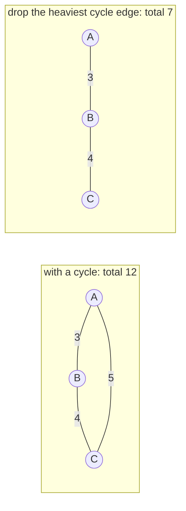
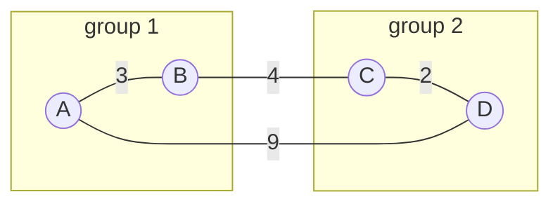
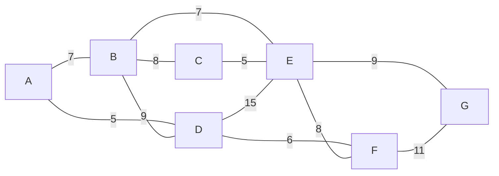
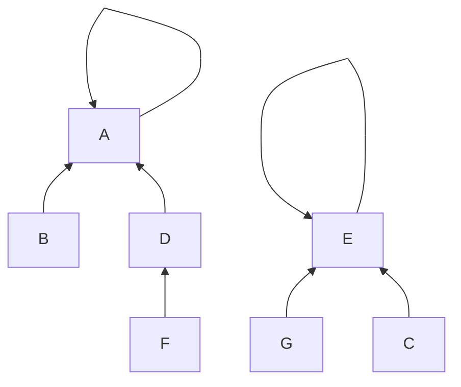

# 37.4 Minimum spanning trees

Shortest paths answered "how do I get from here to there cheaply?" This
section answers a different question: **"how do I connect everything cheaply?"**
Lay fibre to every building on a campus, wire every house on a street to the
grid, link every office in a company network — you need every location
reachable, you do not care which route any particular pair takes, and you want
the total cost of cable to be as small as possible. The answer is called a
**minimum spanning tree**, and it is one of the rare places in algorithms where
two completely different strategies both turn out to be exactly right.

## Why the answer is a tree

Start with a definition. A **spanning subgraph** is one that includes every
vertex and enough edges to keep the whole thing connected. A **spanning tree**
is a spanning subgraph that is a tree — connected and acyclic. A **minimum
spanning tree (MST)** is a spanning tree whose edge weights sum to the smallest
possible total.

Why must the cheapest connected subgraph be a *tree*? Because a cycle is always
wasteful, and here is the argument in three moves:

1. Suppose your solution contains a cycle. Pick any edge $e$ on that cycle and
   delete it.
2. Every pair of vertices that used to travel through $e$ can now go the other
   way round the cycle instead — so the graph is still connected, and it costs
   $w(e)$ less.
3. Repeat until no cycles remain.



A, B and C are still mutually reachable after the cut — the route from A to C
is just A → B → C instead of the direct edge. That gives us two facts to lean
on for the rest of the page:

- **An MST has exactly $V - 1$ edges.** Any connected graph on $V$ vertices
  needs at least $V-1$ edges, and any acyclic graph has at most $V-1$; a tree
  is where both bounds meet.
- **An MST exists whenever the graph is connected.** If it is not connected,
  there is no spanning tree at all — you get a *spanning forest*, one tree per
  component.

Here is the cycle-removal argument as running code:

```python
def connected(vertices, edges):
    """Simple BFS reachability check over an edge list."""
    adj = {v: [] for v in vertices}
    for u, v, w in edges:
        adj[u].append(v)
        adj[v].append(u)
    seen, stack = {vertices[0]}, [vertices[0]]
    while stack:
        x = stack.pop()
        for y in adj[x]:
            if y not in seen:
                seen.add(y)
                stack.append(y)
    return len(seen) == len(vertices)

vertices = ["A", "B", "C"]
cyclic = [("A", "B", 3), ("B", "C", 4), ("C", "A", 5)]

print(f"{'edges kept':<34}{'total':>7}{'connected?':>12}")
print(f"{str([f'{u}-{v}' for u, v, _ in cyclic]):<34}"
      f"{sum(w for *_, w in cyclic):>7}{str(connected(vertices, cyclic)):>12}")

for i in range(len(cyclic)):
    trimmed = cyclic[:i] + cyclic[i + 1:]
    label = [f"{u}-{v}" for u, v, _ in trimmed]
    print(f"{str(label):<34}{sum(w for *_, w in trimmed):>7}"
          f"{str(connected(vertices, trimmed)):>12}")
```

```text
edges kept                          total  connected?
['A-B', 'B-C', 'C-A']                  12        True
['B-C', 'C-A']                          9        True
['A-B', 'C-A']                          8        True
['A-B', 'B-C']                          7        True
```

Every single edge of the cycle can be removed and the graph stays connected.
Naturally you remove the most expensive one, and the cheapest spanning tree of
this triangle costs 7.

## The cut property — why greedy works here

Both algorithms on this page are greedy: they repeatedly grab the cheapest edge
that satisfies some condition and never reconsider. Greedy algorithms are
usually wrong. Here they are provably right, and the reason is a single theorem.

A **cut** is any way of splitting the vertices into two non-empty groups. An
edge **crosses** the cut if its two endpoints land in different groups.

!!! note "The cut property"

    For any cut of the graph, the **cheapest edge crossing that cut** belongs
    to some minimum spanning tree.

The proof is short, and it is a swap argument:

1. Let $e$ be the cheapest crossing edge, and suppose some MST $T$ does not
   contain it.
2. Adding $e$ to $T$ creates exactly one cycle — a tree plus any edge always
   does.
3. That cycle starts on one side of the cut and returns, so it must cross the
   cut at least twice: once via $e$, and at least once via some other edge $f$.
4. Since $e$ is the cheapest crossing edge, $w(e) \le w(f)$. Swap them: remove
   $f$, add $e$.
5. The result is still a spanning tree, and it costs no more than $T$. So a
   minimum spanning tree containing $e$ exists.



Cut this graph into $\{A, B\}$ and $\{C, D\}$. Two edges cross it: B–C at
weight 4 and A–D at weight 9.

The cut property says B–C is safe to take, and you can see why: any spanning
tree must join the two groups somehow, and 4 is the cheapest way to do it.

The two algorithms are simply two different ways of choosing which cut to look
at next:

- **Prim** always cuts "the tree grown so far" against "everything else", and
  takes the cheapest edge crossing it.
- **Kruskal** considers edges in increasing weight order; when an edge joins
  two different components, there is a cut (that component against the rest)
  for which this edge is cheapest.

Same theorem, two schedules.

## Prim's algorithm: grow one tree

Prim's algorithm starts at any vertex and repeatedly adds the cheapest edge
leading out of the tree it has built so far. Structurally it is Dijkstra with
one word changed: where Dijkstra keys the heap on *distance from the source*,
Prim keys it on *distance from the tree*.

Here is the graph the rest of this page uses — seven vertices, eleven edges:



```python
import heapq

EDGES = [("A", "B", 7), ("A", "D", 5), ("B", "C", 8), ("B", "D", 9),
         ("B", "E", 7), ("C", "E", 5), ("D", "E", 15), ("D", "F", 6),
         ("E", "F", 8), ("E", "G", 9), ("F", "G", 11)]

def build(edges):
    g = {}
    for u, v, w in edges:
        g.setdefault(u, {})[v] = w
        g.setdefault(v, {})[u] = w
    return g

def prim(g, start, trace=False):
    in_tree = {start}
    tree = []
    heap = [(w, start, v) for v, w in sorted(g[start].items())]
    heapq.heapify(heap)                    # (weight, from, to)

    if trace:
        print(f"{'step':>4} {'edge':>6} {'w':>3}   tree now spans")
    while heap and len(in_tree) < len(g):
        w, u, v = heapq.heappop(heap)
        if v in in_tree:                   # stale: v joined by a cheaper edge
            continue
        in_tree.add(v)
        tree.append((u, v, w))
        for x, wx in sorted(g[v].items()):
            if x not in in_tree:
                heapq.heappush(heap, (wx, v, x))
        if trace:
            print(f"{len(tree):>4} {u + '-' + v:>6} {w:>3}   {sorted(in_tree)}")
    return tree

g = build(EDGES)
tree = prim(g, "A", trace=True)
print(f"\n{len(tree)} edges for {len(g)} vertices (V - 1 = {len(g) - 1})")
print("total weight:", sum(w for *_, w in tree))
```

```text
step   edge   w   tree now spans
   1    A-D   5   ['A', 'D']
   2    D-F   6   ['A', 'D', 'F']
   3    A-B   7   ['A', 'B', 'D', 'F']
   4    B-E   7   ['A', 'B', 'D', 'E', 'F']
   5    E-C   5   ['A', 'B', 'C', 'D', 'E', 'F']
   6    E-G   9   ['A', 'B', 'C', 'D', 'E', 'F', 'G']

6 edges for 7 vertices (V - 1 = 6)
total weight: 39
```

Watch the tree grow. It starts at A and only ever adds vertices adjacent to
what it already has — the connected blob expands outward like ink.

Step 5 is worth noticing: it adds an edge of weight 5, *cheaper* than the
weight-7 edges added at steps 3 and 4. Prim's edges do not come out in sorted
order, because the C–E edge only became available once E joined the tree. **Prim
takes the cheapest edge crossing the current cut, not the cheapest edge
overall.**

The same `if v in in_tree: continue` staleness check from Dijkstra appears here,
for the same reason: a vertex can sit in the heap several times at different
weights, and lazy deletion is cheaper than decrease-key.

## Kruskal's algorithm — and the structure it needs

Kruskal's algorithm looks at the problem globally instead of locally: **sort
all the edges by weight**, then walk the sorted list adding every edge that
does not create a cycle. That is it. The [sorting](../ch22-sorting/index.md)
step is where most of the time goes, and after that the algorithm is a single
pass.

The hard part is the cycle test. "Does adding edge $u$–$v$ create a cycle?" is
the same question as "are $u$ and $v$ already connected?"

Asking that with a BFS every time would cost $O(V + E)$ per edge, making the
whole algorithm $O(E^2)$. We need something far faster.

### Union-find (disjoint sets)

The structure that answers it is **union-find**, also called a
**disjoint-set union** (DSU). It maintains a collection of disjoint groups and
supports exactly two operations:

- `find(x)` — which group is `x` in? (Returns the group's *representative*.)
- `union(a, b)` — merge the groups containing `a` and `b`.

The representation is a forest: every element points at a parent, and following
parents until you reach a self-pointing element gives the representative.



Two groups here: everything under A, and everything under E. `find(F)` walks
F → D → A and answers "A".

Two optimisations turn this from mediocre to spectacular:

- **Union by rank.** Always hang the shorter tree under the taller one, so
  trees stay shallow instead of degenerating into a chain — the same failure
  mode as an unbalanced [BST](../ch35-balanced-trees/index.md).
- **Path compression.** During a `find`, re-point every node visited directly
  at the root, so the next `find` on that chain is instant. One traversal pays
  for all future ones.

```python
class UnionFind:
    """Disjoint sets with union by rank and path compression."""

    def __init__(self, items):
        self.parent = {x: x for x in items}
        self.rank = {x: 0 for x in items}     # an upper bound on tree height
        self.count = len(self.parent)         # number of disjoint groups

    def find(self, x):
        root = x
        while self.parent[root] != root:      # walk to the representative
            root = self.parent[root]
        while self.parent[x] != root:         # then flatten the path
            self.parent[x], x = root, self.parent[x]
        return root

    def union(self, a, b):
        ra, rb = self.find(a), self.find(b)
        if ra == rb:
            return False                      # already together: nothing to do
        if self.rank[ra] < self.rank[rb]:     # hang the shorter under the taller
            ra, rb = rb, ra
        self.parent[rb] = ra
        if self.rank[ra] == self.rank[rb]:
            self.rank[ra] += 1
        self.count -= 1
        return True

uf = UnionFind("ABCDEFG")
print("start:", uf.count, "groups")
for a, b in [("A", "B"), ("C", "D"), ("B", "D"), ("E", "F")]:
    merged = uf.union(a, b)
    print(f"  union({a}, {b}) -> {'merged' if merged else 'already joined'};"
          f" {uf.count} groups")
print("  union(A, C) ->",
      "merged" if uf.union("A", "C") else "already joined (A-B-D-C are one set)")
print("representatives:", {x: uf.find(x) for x in "ABCDEFG"})
```

```text
start: 7 groups
  union(A, B) -> merged; 6 groups
  union(C, D) -> merged; 5 groups
  union(B, D) -> merged; 4 groups
  union(E, F) -> merged; 3 groups
  union(A, C) -> already joined (A-B-D-C are one set)
representatives: {'A': 'A', 'B': 'A', 'C': 'A', 'D': 'A', 'E': 'E', 'F': 'E', 'G': 'G'}
```

!!! note "How fast is union-find, honestly?"

    With both optimisations, $m$ operations on $n$ elements take
    $O(m \, \alpha(n))$ time, where $\alpha$ is the **inverse Ackermann
    function**. It is not constant — the claim "union-find is $O(1)$" is false
    — but it grows so unimaginably slowly that $\alpha(n) \le 4$ for every $n$
    that could be written down in this universe. So the honest statement is:
    *amortised near-constant, effectively constant in practice, but not
    literally $O(1)$*. It is one of the few places in computing where the
    precise answer is stranger than the approximation.

### Kruskal, with reasons printed

```python
class UnionFind:
    def __init__(self, items):
        self.parent = {x: x for x in items}
        self.rank = {x: 0 for x in items}

    def find(self, x):
        root = x
        while self.parent[root] != root:
            root = self.parent[root]
        while self.parent[x] != root:
            self.parent[x], x = root, self.parent[x]
        return root

    def union(self, a, b):
        ra, rb = self.find(a), self.find(b)
        if ra == rb:
            return False
        if self.rank[ra] < self.rank[rb]:
            ra, rb = rb, ra
        self.parent[rb] = ra
        if self.rank[ra] == self.rank[rb]:
            self.rank[ra] += 1
        return True

EDGES = [("A", "B", 7), ("A", "D", 5), ("B", "C", 8), ("B", "D", 9),
         ("B", "E", 7), ("C", "E", 5), ("D", "E", 15), ("D", "F", 6),
         ("E", "F", 8), ("E", "G", 9), ("F", "G", 11)]
VERTICES = sorted({v for u, w, _ in EDGES for v in (u, w)})

def kruskal(vertices, edges, trace=False):
    uf = UnionFind(vertices)
    tree = []
    if trace:
        print(f"{'edge':>6}{'w':>4}   decision")
    for u, v, w in sorted(edges, key=lambda e: e[2]):     # the sort is the cost
        if uf.union(u, v):
            tree.append((u, v, w))
            if trace:
                print(f"{u + '-' + v:>6}{w:>4}   accept — joins two components")
        elif trace:
            print(f"{u + '-' + v:>6}{w:>4}   REJECT — both already in "
                  f"component '{uf.find(u)}'")
        if len(tree) == len(vertices) - 1:
            break                                          # early exit: done
    return tree

tree = kruskal(VERTICES, EDGES, trace=True)
print("\nMST edges:", [(u, v, w) for u, v, w in tree])
print("total weight:", sum(w for *_, w in tree))
```

```text
  edge   w   decision
   A-D   5   accept — joins two components
   C-E   5   accept — joins two components
   D-F   6   accept — joins two components
   A-B   7   accept — joins two components
   B-E   7   accept — joins two components
   B-C   8   REJECT — both already in component 'A'
   E-F   8   REJECT — both already in component 'A'
   B-D   9   REJECT — both already in component 'A'
   E-G   9   accept — joins two components

MST edges: [('A', 'D', 5), ('C', 'E', 5), ('D', 'F', 6), ('A', 'B', 7), ('B', 'E', 7), ('E', 'G', 9)]
total weight: 39
```

Kruskal's story is completely different from Prim's. It happily accepts the two
weight-5 edges first even though they are in *opposite corners* of the graph.
For most of the run it is growing several disconnected fragments at once, and
only at the end do they merge into one tree. **Where Prim keeps a single blob,
Kruskal keeps a forest.**

The three rejections are the interesting lines. B–C at weight 8 is rejected
because B and C were both already pulled into the same component by A–B, B–E,
and C–E; adding it would close the cycle B–C–E–B.

Note also the early exit. As soon as $V-1$ edges are accepted, the remaining
edges cannot possibly help, so the loop stops before even looking at F–G and
D–E.

## Both algorithms, one graph, one check

```python
import heapq

EDGES = [("A", "B", 7), ("A", "D", 5), ("B", "C", 8), ("B", "D", 9),
         ("B", "E", 7), ("C", "E", 5), ("D", "E", 15), ("D", "F", 6),
         ("E", "F", 8), ("E", "G", 9), ("F", "G", 11)]
VERTICES = sorted({v for u, w, _ in EDGES for v in (u, w)})

def build(edges):
    g = {}
    for u, v, w in edges:
        g.setdefault(u, {})[v] = w
        g.setdefault(v, {})[u] = w
    return g

def prim(g, start):
    in_tree, tree = {start}, []
    heap = [(w, start, v) for v, w in g[start].items()]
    heapq.heapify(heap)
    while heap and len(in_tree) < len(g):
        w, u, v = heapq.heappop(heap)
        if v in in_tree:
            continue
        in_tree.add(v)
        tree.append((u, v, w))
        for x, wx in g[v].items():
            if x not in in_tree:
                heapq.heappush(heap, (wx, v, x))
    return tree

def kruskal(vertices, edges):
    parent = {x: x for x in vertices}

    def find(x):
        while parent[x] != x:
            parent[x] = parent[parent[x]]      # halving: compression, one line
            x = parent[x]
        return x

    tree = []
    for u, v, w in sorted(edges, key=lambda e: e[2]):
        ru, rv = find(u), find(v)
        if ru != rv:
            parent[rv] = ru
            tree.append((u, v, w))
    return tree

def normalise(tree):
    """Edges as sorted (u, v, w) triples, so the two results are comparable."""
    return sorted((min(u, v), max(u, v), w) for u, v, w in tree)

g = build(EDGES)
p_tree = normalise(prim(g, "A"))
k_tree = normalise(kruskal(VERTICES, EDGES))

print("Prim   :", p_tree)
print("Kruskal:", k_tree)
print("same total weight?",
      sum(w for *_, w in p_tree) == sum(w for *_, w in k_tree),
      f"({sum(w for *_, w in p_tree)})")
print("same edge set?    ", p_tree == k_tree)
```

```text
Prim   : [('A', 'B', 7), ('A', 'D', 5), ('B', 'E', 7), ('C', 'E', 5), ('D', 'F', 6), ('E', 'G', 9)]
Kruskal: [('A', 'B', 7), ('A', 'D', 5), ('B', 'E', 7), ('C', 'E', 5), ('D', 'F', 6), ('E', 'G', 9)]
same total weight? True (39)
same edge set?     True
```

On this graph the two algorithms happen to agree on the edges as well as the
total. **Do not test for that.** The correct equality check is on total weight,
and here is a four-vertex graph that shows why:

```python
import heapq

TIE = [("A", "B", 1), ("B", "C", 1), ("C", "D", 1), ("D", "A", 1)]
VERTICES = ["A", "B", "C", "D"]

def build(edges):
    g = {}
    for u, v, w in edges:
        g.setdefault(u, {})[v] = w
        g.setdefault(v, {})[u] = w
    return g

def prim(g, start):
    in_tree, tree = {start}, []
    heap = [(w, start, v) for v, w in sorted(g[start].items())]
    heapq.heapify(heap)
    while heap and len(in_tree) < len(g):
        w, u, v = heapq.heappop(heap)
        if v in in_tree:
            continue
        in_tree.add(v)
        tree.append((u, v, w))
        for x, wx in sorted(g[v].items()):
            if x not in in_tree:
                heapq.heappush(heap, (wx, v, x))
    return tree

def kruskal(vertices, edges):
    parent = {x: x for x in vertices}

    def find(x):
        while parent[x] != x:
            parent[x] = parent[parent[x]]
            x = parent[x]
        return x

    tree = []
    for u, v, w in sorted(edges, key=lambda e: e[2]):
        ru, rv = find(u), find(v)
        if ru != rv:
            parent[rv] = ru
            tree.append((u, v, w))
    return tree

def label(tree):
    return sorted(f"{min(u, v)}-{max(u, v)}" for u, v, _ in tree)

p, k = prim(build(TIE), "A"), kruskal(VERTICES, TIE)
print("square A-B-C-D-A, every edge weight 1")
print("  Prim picked   :", label(p), "total", sum(w for *_, w in p))
print("  Kruskal picked:", label(k), "total", sum(w for *_, w in k))
print("  same edges?", label(p) == label(k),
      " same total?", sum(w for *_, w in p) == sum(w for *_, w in k))
```

```text
square A-B-C-D-A, every edge weight 1
  Prim picked   : ['A-B', 'A-D', 'B-C'] total 3
  Kruskal picked: ['A-B', 'B-C', 'C-D'] total 3
  same edges? False  same total? True
```

Different trees, identical cost. The square has four spanning trees (drop any
one of the four edges) and all four are minimum. When weights tie, "the" MST is
a fiction: there are several, and which one an algorithm returns depends on
tie-breaking inside the heap or the sort.

**When all edge weights are distinct the MST is unique.** That is a useful
thing to know when a test fails — if your weights are distinct and two
implementations disagree, one of them is wrong.

## Which algorithm, and when

| | Prim (binary heap) | Kruskal (union-find) |
|---|---|---|
| Time | $O(E \log V)$ | $O(E \log E)$ for the sort, then $O(E\,\alpha(V))$ |
| Needs | adjacency list | edge list |
| Grows | one connected tree | a forest that merges |
| Best when | the graph is **dense** ($E \approx V^2$) | the graph is **sparse**, or the edges are already sorted |
| Dense variant | $O(V^2)$ with a plain array and no heap — beats $O(E \log V)$ when $E \approx V^2$ | — |
| Parallel-friendly | not really | the sort is, and edges can be filtered independently |

Since $E \le V^2$, $\log E \le 2 \log V$, so the two are asymptotically the same
$O(E \log V)$. The real differences are constant factors and inputs:

- **The graph arrives as an edge list** (which they usually do) — Kruskal needs
  no conversion at all.
- **It arrives as an adjacency structure and is dense** — Prim's $O(V^2)$ array
  variant avoids heap overhead entirely.

## MST clustering: cut the heaviest edges

Here is an application that looks nothing like laying cable. Suppose you have
points in space and want to group them into $k$ clusters. Two steps:

1. **Build the MST of the points**, treating every pair as an edge whose weight
   is the distance between them.
2. **Delete the $k-1$ heaviest edges.** The tree falls into $k$ pieces, and
   those pieces are your clusters.

The intuition is exactly the cut property read backwards. The MST connects each
group to its nearest neighbouring group using the single shortest link between
them, so the longest edges in the tree are precisely the links *between* natural
clusters, not within them.

This is called **single-linkage clustering**. Unlike $k$-means it needs no
coordinates, only distances, and it finds non-spherical clusters happily.

```python
import numpy as np
import matplotlib.pyplot as plt

rng = np.random.default_rng(37)
centres = np.array([[0.0, 0.0], [6.0, 1.0], [3.0, 6.0]])
points = np.vstack([c + rng.normal(0, 0.7, size=(15, 2)) for c in centres])
n = len(points)

def prim_mst(pts):
    """O(V^2) Prim: right choice here, because the distance graph is complete."""
    n = len(pts)
    rest = list(range(1, n))
    best = {j: (float(np.linalg.norm(pts[0] - pts[j])), 0) for j in rest}
    edges = []
    while rest:
        j = min(rest, key=lambda x: best[x][0])
        d, i = best[j]
        edges.append((i, j, d))
        rest.remove(j)
        for k in rest:                       # update every remaining vertex
            dk = float(np.linalg.norm(pts[j] - pts[k]))
            if dk < best[k][0]:
                best[k] = (dk, j)
    return edges

mst = prim_mst(points)
by_weight = sorted(mst, key=lambda e: -e[2])
print(f"MST on {n} points: {len(mst)} edges, total length "
      f"{sum(w for *_, w in mst):.2f}")
print("five longest MST edges:", [f"{w:.2f}" for *_, w in by_weight[:5]])

K = 3
cut = by_weight[:K - 1]                      # the k-1 heaviest links
keep = by_weight[K - 1:]
print(f"cutting {K - 1} edges of length "
      f"{', '.join(f'{w:.2f}' for *_, w in cut)}")

parent = list(range(n))                      # union-find over what's left
def find(x):
    while parent[x] != x:
        parent[x] = parent[parent[x]]
        x = parent[x]
    return x
for i, j, _ in keep:
    ri, rj = find(i), find(j)
    if ri != rj:
        parent[rj] = ri

labels = {}
for i in range(n):
    labels.setdefault(find(i), len(labels))
cluster = np.array([labels[find(i)] for i in range(n)])
for c in range(K):
    print(f"  cluster {c}: {int((cluster == c).sum())} points")

truth = np.repeat([0, 1, 2], 15)
pure = all(len(set(truth[cluster == c])) == 1 for c in range(K))
print("every cluster contains exactly one of the three true groups:", pure)

for i, j, _ in mst:                          # draw the full MST faintly
    plt.plot(points[[i, j], 0], points[[i, j], 1], color="0.8", lw=1, zorder=1)
for i, j, w in cut:                          # highlight the cut links
    plt.plot(points[[i, j], 0], points[[i, j], 1], color="crimson",
             lw=1.5, ls="--", zorder=2)
for c, marker in zip(range(K), "os^"):
    sel = cluster == c
    plt.scatter(points[sel, 0], points[sel, 1], marker=marker, s=45,
                zorder=3, label=f"cluster {c}")
plt.title("MST clustering: cut the 2 longest edges (dashed) to get 3 clusters")
plt.xlabel("x")
plt.ylabel("y")
plt.legend()
```

```text
MST on 45 points: 44 edges, total length 28.80
five longest MST edges: ['4.27', '2.92', '1.24', '1.06', '0.92']
cutting 2 edges of length 4.27, 2.92
  cluster 0: 15 points
  cluster 1: 15 points
  cluster 2: 15 points
every cluster contains exactly one of the three true groups: True
```

Look at the edge lengths: 4.27 and 2.92, then a cliff down to 1.24. Those first
two are the only links bridging the three blobs, and the gap between 2.92 and
1.24 is the algorithm telling you that $k = 3$ is the natural number of clusters
for this data.

Choosing $k$ by looking for that gap is a standard heuristic, and it comes free
with the MST — not something $k$-means offers. The plot shows the whole tree in
grey with the two cut links dashed in red, so you can see the bridges rather
than take our word for it.

!!! warning "Common mistakes"

    - **Running an MST algorithm on a directed graph.** MSTs are defined for
      undirected graphs. The directed version is a different, much harder
      problem (a *minimum spanning arborescence*, solved by Edmonds' algorithm).
      Feeding a directed adjacency structure to Prim will silently produce
      something that is not a tree of the graph you meant.
    - **Assuming the MST contains the shortest path between two vertices.** It
      usually does not. In the seven-vertex graph, the MST route from D to E is
      D–A–B–E costing 19, while the direct D–E edge costs 15. MSTs minimise the
      *total*, not any individual journey.
    - **Comparing MSTs by edge set.** With tied weights there are several
      correct answers. Compare total weight.
    - **Forgetting to check connectivity.** If the graph is disconnected there
      is no spanning tree. Both algorithms will return fewer than $V-1$ edges;
      check `len(tree) == V - 1` and report a forest rather than pretending.
    - **Union-find without path compression.** Union by rank on its own still
      keeps every tree $O(\log V)$ deep, so `find` costs $O(\log V)$ per edge
      instead of $O(\alpha(V))$ — survivable, but the compression is one line.
      It is dropping *both* optimisations that lets `find` walk a chain of
      length $O(V)$. Both are three lines; write them once, keep them forever.
    - **Union by *size* versus by *rank*.** Both work and both give the same
      guarantee. What does *not* work is `parent[find(a)] = find(b)` with no
      balancing at all — that is how you build a linked list by accident.

## Check your understanding

1. A connected graph has 100 vertices. How many edges does its MST have, and
   how many edges does Kruskal *reject* if the graph has 400 edges?

    ??? success "Answer"
        The MST has $V - 1 = 99$ edges. Kruskal examines edges in sorted order
        and would reject $400 - 99 = 301$ of them — except that the early exit
        stops the loop as soon as 99 edges are accepted, so many of those 301
        are never even looked at. The count of *examined-and-rejected* edges
        depends on where in the sorted order the 99th acceptance happens.

2. Prim's trace added a weight-5 edge (E–C) at step 5, after adding two
   weight-7 edges. Does that contradict "always take the cheapest edge"?

    ??? success "Answer"
        No — it clarifies it. Prim takes the cheapest edge **crossing the
        current cut**, i.e. the cheapest edge with exactly one endpoint in the
        tree. At steps 3 and 4 the C–E edge had *neither* endpoint in the tree,
        so it was not a candidate at all. It became available only when E
        joined at step 4.

3. All the edges in a graph have distinct weights. Can Prim and Kruskal return
   different trees?

    ??? success "Answer"
        No. With distinct weights the MST is unique, so any correct algorithm
        returns the same tree. (Sketch: if two different MSTs existed, take the
        cheapest edge in one but not the other; adding it to the other creates
        a cycle containing a strictly heavier edge, which can be swapped out for
        a strictly cheaper tree — contradicting minimality.)

4. Why does MST clustering find the three blobs even though the algorithm was
   never told there were three, or where they were?

    ??? success "Answer"
        Because the MST always joins two groups of points using the *single
        shortest* link between them. Within a blob the points are close, so
        those links are short; between blobs the nearest pair is still far
        apart, so those links are long. Cutting the two longest edges therefore
        cuts exactly the two inter-blob bridges. The algorithm was told $k = 3$;
        what it discovered on its own is *which* points belong together — and
        the sudden drop from 2.92 to 1.24 in the edge lengths is data telling
        you $k = 3$ was the right guess.

5. You need to connect 5,000 offices, and you already have the 12,000 possible
   cable runs stored in a file sorted by cost. Prim or Kruskal?

    ??? success "Answer"
        Kruskal, comfortably. The data is already an edge list *and* already
        sorted, so the $O(E \log E)$ sort — normally the dominant cost —
        disappears entirely, leaving a single near-linear pass with union-find.
        Prim would first need the edge list converted into an adjacency
        structure, then pay full heap costs on a graph that is very sparse
        ($E \approx 2.4V$).
