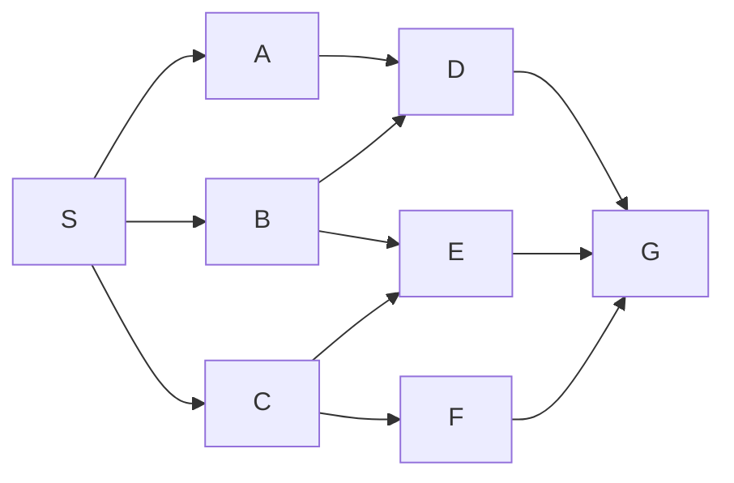
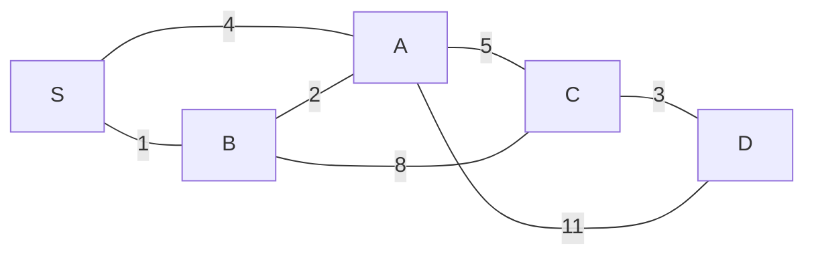

# Chapter 37 · Exercises

## The chapter in brief

- A graph is just **vertices and edges**, which is why one set of algorithms
  serves roads, friendships, prerequisites, hyperlinks, and build files
  ([37.1](01-representations.md)).
- The vocabulary — degree, path, cycle, DAG, connected versus strongly
  connected, sparse versus dense — all reads off a single small drawing.
- An **adjacency matrix** costs $O(V^2)$ whatever the graph contains; an
  **adjacency list** costs $O(V + E)$ and is the default, because algorithms
  ask for neighbours far more often than for a single edge.
- An **edge list** is the wrong shape for traversal and exactly right for
  Kruskal, Bellman-Ford, and every file format you will be handed.
- BFS and DFS are **the same loop with a different container** — a queue
  versus a stack — and the `visited` set is what makes both terminate and stay
  linear ([37.2](02-traversal.md)).
- One traversal answers a surprising number of questions: connected
  components, 2-colouring, cycle detection, topological order, and
  fewest-edge paths.
- **Weights break BFS**, because "fewest hops" and "cheapest route" are
  different questions ([37.3](03-shortest-paths.md)).
- **Dijkstra** is BFS with a priority queue, and its greedy invariant holds
  only while every weight is non-negative.
- On a negative edge Dijkstra returns a confident, silent, wrong answer;
  **Bellman-Ford** relaxes every edge $V-1$ times instead and detects negative
  cycles for free.
- **A\*** is Dijkstra plus a heuristic, and it stays optimal exactly while
  that heuristic is **admissible** — never an overestimate.
- A **minimum spanning tree** is the cheapest way to connect everything, has
  exactly $V-1$ edges, and both greedy algorithms are justified by the same
  **cut property** ([37.4](04-mst.md)).
- **Prim** grows one blob with a heap, **Kruskal** merges a forest with
  union-find, and union-find's cost is near-constant but honestly
  $O(\alpha(n))$, not $O(1)$.

### Key terms

| Term | What it means |
| --- | --- |
| [vertex / edge](../concept-index.md#v) | the things, and the pairs of things that are related |
| [degree](../concept-index.md#d) | edges touching a vertex; in- and out- versions when directed |
| [DAG](../concept-index.md#d) | directed acyclic graph — the shape of prerequisites and builds |
| [adjacency list](../concept-index.md#a) | vertex → its neighbours; $O(V+E)$ space, the usual choice |
| [adjacency matrix](../concept-index.md#a) | $V \times V$ grid; $O(1)$ edge test, $O(V^2)$ space |
| [BFS](../concept-index.md#b) | queue-driven traversal in rings; gives fewest-edge paths |
| [DFS](../concept-index.md#d) | stack- or recursion-driven traversal; gives cycles and orderings |
| visited set | the $O(1)$ membership test that makes traversal terminate |
| [topological sort](../concept-index.md#t) | a listing of a DAG in which every edge points forwards |
| [Dijkstra's algorithm](../concept-index.md#d) | cheapest paths from one source, non-negative weights only |
| [Bellman-Ford](../concept-index.md#b) | $V-1$ relaxation passes; handles negative weights, detects cycles |
| [admissible heuristic](../concept-index.md#a) | an estimate that never overestimates the remaining cost |
| [minimum spanning tree](../concept-index.md#m) | cheapest set of $V-1$ edges connecting every vertex |
| [cut property](../concept-index.md#c) | the cheapest edge across any cut belongs to some MST |
| [union-find](../concept-index.md#u) | disjoint sets with `find` and `union`; Kruskal's cycle test |
| [$O(V + E)$](../appendix/B-big-o.md) | the currency every cost in this chapter is quoted in |

Now put it to work. Graphs reward drawing: for most of these, sketch the
vertices and edges on paper first, run the algorithm with a finger, write down
your answer — *then* open the solution and run the code. The exercises go from
representation choices through traversal to the two greedy algorithms, and the
last one is a small research project with a measurable payoff.

### Exercise 37.1 — Choose the representation ●

For each scenario, say whether you would store the graph as an **adjacency
matrix**, an **adjacency list/map**, an **edge list**, or a **set of edge
pairs**, and give one sentence of justification.

1. A web crawler holding 50 million pages, each with about 20 outgoing links.
   The only operation is "give me every page this page links to".
2. A flight network of 200 airports. The program answers "is there a direct
   flight from X to Y?" millions of times per second and never enumerates
   anybody's destinations.
3. 1,000 sensors, with candidate cable runs streamed in from a file. The task
   is to compute a minimum spanning tree with Kruskal's algorithm.
4. A 120-node office network where you need the shortest route between *every*
   pair, computed once at start-up with Floyd-Warshall.

??? success "Solution"

    1. **Adjacency map.** $V + E \approx 5 \times 10^7 + 10^9$ entries is large
       but possible; the matrix would be $2.5 \times 10^{15}$ cells. The one
       operation needed is exactly what an adjacency map is fastest at.
    2. **Adjacency matrix** (or a set of edge pairs). $200^2 = 40{,}000$ cells
       is nothing, and the single operation is a constant-time array access —
       the case where the matrix genuinely wins.
    3. **Edge list.** Kruskal sorts edges and never asks for a neighbour list.
       The data already arrives in that shape, so no conversion is needed.
    4. **Adjacency matrix.** Floyd-Warshall *is* a matrix algorithm: it
       initialises a $V \times V$ distance table and updates it in place.
       Anything else would be converted to a matrix on the first line.

    ```python
    scenarios = [
        # name,                 V,          avg degree, matrix bytes/cell
        ("web crawler",         50_000_000, 20,  1),
        ("flight network",      200,        12,  1),
        ("sensor cables",       1_000,      4,   1),
        ("office network",      120,        6,   8),   # distances, not booleans
    ]

    print(f"{'scenario':<18}{'matrix':>18}{'adjacency map':>18}{'ratio':>12}")
    for name, V, deg, cell in scenarios:
        matrix = V * V * cell
        adj = V * 100 + V * deg * 8          # rough: dict slot + 8 bytes/edge
        print(f"{name:<18}{matrix:>18,}{adj:>18,}{matrix / adj:>12,.1f}x")
    ```

    The ratio column is the whole argument: for the crawler the matrix is
    hundreds of thousands of times larger, and for the 120-node office it is
    smaller than the map. Size decides, and size depends on density.

### Exercise 37.2 — Predict the traversal orders ●

Here is a directed graph. Neighbour lists are given in the order shown, and
both traversals start at `S`.



```text
S: [A, B, C]    A: [D]    B: [D, E]    C: [E, F]
D: [G]          E: [G]    F: [G]       G: []
```

**Write down both orders before running anything.** Then predict one more
thing: at which position do the two orders first differ?

??? success "Solution"

    BFS: `S A B C D E F G`. DFS (recursive, neighbours in the listed order):
    `S A D G B E C F`. They first differ at position 3 — BFS's third vertex is
    `B`, DFS's is `D`, because DFS follows `A` down to `D` before ever looking
    at `B`.

    ```python
    from collections import deque

    g = {"S": ["A", "B", "C"], "A": ["D"], "B": ["D", "E"], "C": ["E", "F"],
         "D": ["G"], "E": ["G"], "F": ["G"], "G": []}

    def bfs(g, s):
        seen, q, order = {s}, deque([s]), []
        while q:
            v = q.popleft()
            order.append(v)
            for x in g[v]:
                if x not in seen:
                    seen.add(x)
                    q.append(x)
        return order

    def dfs(g, s):
        seen, order = set(), []
        def visit(v):
            seen.add(v)
            order.append(v)
            for x in g[v]:
                if x not in seen:
                    visit(x)
        visit(s)
        return order

    b, d = bfs(g, "S"), dfs(g, "S")
    print("BFS:", " ".join(b))
    print("DFS:", " ".join(d))
    first_diff = next(i for i, (x, y) in enumerate(zip(b, d)) if x != y)
    print(f"first difference at position {first_diff + 1}: "
          f"BFS has {b[first_diff]}, DFS has {d[first_diff]}")
    ```

    Both orders are valid — they answer different questions. `G` is the last
    vertex in BFS because it is genuinely the farthest away; it is the fourth
    in DFS purely because DFS dived at it immediately.

### Exercise 37.3 — Find the cycle in a dependency graph ●●

A build system refuses to start and reports "circular dependency". The module
graph is:

```text
app     -> auth, db
auth    -> crypto
crypto  -> utils
utils   -> config
config  -> auth
db      -> utils
```

Find the cycle by hand, then write code that *reports* the cycle as a list of
module names rather than just answering "yes".

??? success "Solution"

    The cycle is `auth -> crypto -> utils -> config -> auth`. `app` and `db`
    are not in it — they merely depend on modules that are.

    ```python
    WHITE, GREY, BLACK = 0, 1, 2

    modules = {
        "app":    ["auth", "db"],
        "auth":   ["crypto"],
        "crypto": ["utils"],
        "utils":  ["config"],
        "config": ["auth"],
        "db":     ["utils"],
    }

    def find_cycle(graph):
        colour = {v: WHITE for v in graph}
        path = []

        def visit(v):
            colour[v] = GREY
            path.append(v)
            for u in graph[v]:
                if colour[u] == GREY:                # back edge
                    return path[path.index(u):] + [u]
                if colour[u] == WHITE:
                    found = visit(u)
                    if found:
                        return found
            path.pop()
            colour[v] = BLACK
            return None

        for v in graph:
            if colour[v] == WHITE:
                found = visit(v)
                if found:
                    return found
        return None

    cycle = find_cycle(modules)
    print("circular dependency:", " -> ".join(cycle))
    print("modules involved:", sorted(set(cycle)))
    print("modules NOT in the cycle:",
          sorted(set(modules) - set(cycle)))
    ```

    The grey path list is what turns "there is a cycle" into an error message a
    human can act on. Reporting the names is the difference between a useful
    build tool and an annoying one.

### Exercise 37.4 — Hand-trace Dijkstra, then verify ●●



Run Dijkstra from `S` on paper. Record, for every vertex, the order in which it
is settled and its final distance. At least one vertex should have its
tentative distance improved *after* it was first assigned — find it.

??? success "Solution"

    Settle order `S, B, A, C, D` with distances `0, 1, 3, 8, 11`. Three
    vertices are improved after their first assignment: `A` goes 4 → 3 (via
    B), `C` goes 9 → 8 (via A), and `D` goes 14 → 11 (via C).

    ```python
    import heapq

    INF = float("inf")
    edges = [("S", "A", 4), ("S", "B", 1), ("B", "A", 2), ("A", "C", 5),
             ("B", "C", 8), ("C", "D", 3), ("A", "D", 11)]
    g = {}
    for u, v, w in edges:
        g.setdefault(u, {})[v] = w
        g.setdefault(v, {})[u] = w

    dist = {v: INF for v in g}
    parent = {v: None for v in g}
    dist["S"] = 0
    settled, heap, order = set(), [(0, "S")], []

    while heap:
        d, u = heapq.heappop(heap)
        if u in settled:
            continue
        settled.add(u)
        order.append((u, d))
        for v, w in sorted(g[u].items()):
            if v not in settled and d + w < dist[v]:
                old = dist[v]
                dist[v] = d + w
                parent[v] = u
                heapq.heappush(heap, (d + w, v))
                print(f"  settling {u}: {v} improves "
                      f"{'inf' if old == INF else old} -> {d + w}")

    print("settle order:", " ".join(f"{v}({d})" for v, d in order))
    path, cur = [], "D"
    while cur is not None:
        path.append(cur)
        cur = parent[cur]
    print("cheapest S -> D:", " -> ".join(reversed(path)), "=", dist["D"])
    ```

    Notice the direct `S–A` road of length 4 is never used, and the direct
    `A–D` road of length 11 is never used either. Dijkstra is not choosing
    between roads; it is choosing between *routes*.

### Exercise 37.5 — Break Dijkstra ●●

Build the smallest directed weighted graph you can in which Dijkstra returns a
wrong distance, using exactly one negative edge. Prove it is wrong by computing
the true answer with Bellman-Ford. How few vertices do you need?

??? success "Solution"

    Three vertices are enough. Let $S \to A$ cost 5, $S \to B$ cost 6, and
    $B \to A$ cost $-3$. Dijkstra settles `A` at 5 because 5 < 6, and never
    revisits it; the true cheapest route is $S \to B \to A$ at
    $6 - 3 = 3$. Add a fourth vertex `T` with $A \to T$ costing 1 and the
    error propagates: 6 instead of 4.

    ```python
    import heapq

    INF = float("inf")
    graph = {"S": {"A": 5, "B": 6}, "B": {"A": -3}, "A": {"T": 1}, "T": {}}
    edges = [(u, v, w) for u in graph for v, w in graph[u].items()]

    def dijkstra(g, src):
        dist = {v: INF for v in g}
        dist[src] = 0
        settled, heap = set(), [(0, src)]
        while heap:
            d, u = heapq.heappop(heap)
            if u in settled:
                continue
            settled.add(u)
            for v, w in g[u].items():
                if v not in settled and d + w < dist[v]:
                    dist[v] = d + w
                    heapq.heappush(heap, (d + w, v))
        return dist

    def bellman_ford(vertices, edges, src):
        dist = {v: INF for v in vertices}
        dist[src] = 0
        for _ in range(len(vertices) - 1):
            for u, v, w in edges:
                if dist[u] != INF and dist[u] + w < dist[v]:
                    dist[v] = dist[u] + w
        return dist

    d1 = dijkstra(graph, "S")
    d2 = bellman_ford(list(graph), edges, "S")
    print(f"{'vertex':>7}{'Dijkstra':>10}{'Bellman-Ford':>14}   verdict")
    for v in ("S", "A", "B", "T"):
        print(f"{v:>7}{d1[v]:>10}{d2[v]:>14}   "
              f"{'ok' if d1[v] == d2[v] else 'WRONG'}")
    ```

    Two vertices cannot do it: with a single edge there is only one route, and
    Dijkstra cannot pick the wrong one. Three is the minimum, and the shape is
    always the same — a *cheap-looking direct edge* that gets settled before a
    *more expensive first hop* whose second hop is negative.

### Exercise 37.6 — `has_path` and `all_paths` ●●

Write two functions on a directed graph:

- `has_path(graph, start, goal)` — `True` if any route exists, and it must not
  explore more of the graph than necessary;
- `all_paths(graph, start, goal)` — every *simple* path (no repeated vertices)
  as a list of vertex lists.

Test them on the graph from Exercise 37.2. How many simple paths are there from
`S` to `G`, and why is `all_paths` a fundamentally more expensive operation
than `has_path`?

??? success "Solution"

    Five paths. `has_path` is $O(V + E)$ because each vertex is visited once;
    `all_paths` can be exponential because the *number of answers* can be
    exponential — no algorithm can enumerate $2^n$ paths in polynomial time.

    ```python
    graph = {"S": ["A", "B", "C"], "A": ["D"], "B": ["D", "E"],
             "C": ["E", "F"], "D": ["G"], "E": ["G"], "F": ["G"], "G": []}

    def has_path(graph, start, goal):
        """DFS with early exit: stops the moment `goal` is reached."""
        seen, stack = {start}, [start]
        while stack:
            v = stack.pop()
            if v == goal:
                return True
            for u in graph[v]:
                if u not in seen:
                    seen.add(u)
                    stack.append(u)
        return False

    def all_paths(graph, start, goal):
        """Backtracking DFS: the visited marker is undone on the way out."""
        results, path, on_path = [], [], set()

        def walk(v):
            path.append(v)
            on_path.add(v)
            if v == goal:
                results.append(list(path))
            else:
                for u in graph[v]:
                    if u not in on_path:          # simple paths only
                        walk(u)
            path.pop()
            on_path.discard(v)                    # <- the crucial undo

        walk(start)
        return results

    print("has_path(S, G):", has_path(graph, "S", "G"))
    print("has_path(G, S):", has_path(graph, "G", "S"))
    paths = all_paths(graph, "S", "G")
    print(f"{len(paths)} simple paths from S to G:")
    for p in paths:
        print("  " + " -> ".join(p))
    ```

    The one line that separates the two functions is `on_path.discard(v)`.
    A normal traversal marks a vertex visited *forever*; path enumeration marks
    it visited only *while it is on the current path*, because a vertex excluded
    from one path may well belong to another.

### Exercise 37.7 — Union-find by hand ●●

Start with eight singletons `0..7` and a union-find using **union by rank with
path compression**. Apply, in order:

```text
union(0,1)  union(2,3)  union(4,5)  union(6,7)
union(0,2)  union(4,6)  union(0,4)
```

Answer on paper: (a) what is `rank[0]` at the end? (b) how deep is element 7?
(c) when you then call `find(7)`, how many parent pointers change?

??? success "Solution"

    (a) `rank[0] == 3`. (b) Element 7 is three links from the root:
    `7 -> 6 -> 4 -> 0`. (c) Two pointers change — `parent[7]` and `parent[6]`
    are both re-pointed at 0; `parent[4]` already *is* 0.

    ```python
    class UnionFind:
        def __init__(self, items):
            self.parent = {x: x for x in items}
            self.rank = {x: 0 for x in items}
            self.compressions = 0

        def find(self, x):
            root = x
            while self.parent[root] != root:
                root = self.parent[root]
            while self.parent[x] != root:
                self.parent[x], x = root, self.parent[x]
                self.compressions += 1
            return root

        def union(self, a, b):
            ra, rb = self.find(a), self.find(b)
            if ra == rb:
                return False
            if self.rank[ra] < self.rank[rb]:
                ra, rb = rb, ra
            self.parent[rb] = ra
            if self.rank[ra] == self.rank[rb]:
                self.rank[ra] += 1
            return True

    uf = UnionFind(range(8))
    for a, b in [(0, 1), (2, 3), (4, 5), (6, 7), (0, 2), (4, 6), (0, 4)]:
        uf.union(a, b)
        print(f"  after union({a},{b}): parents = "
              f"{[uf.parent[i] for i in range(8)]}  rank[0] = {uf.rank[0]}")

    depth, x = 0, 7
    while uf.parent[x] != x:
        x = uf.parent[x]
        depth += 1
    print("rank[0] =", uf.rank[0], " depth of 7 =", depth)

    before = uf.compressions
    uf.find(7)
    print("pointers changed by find(7):", uf.compressions - before)
    print("parents now:", [uf.parent[i] for i in range(8)])
    ```

    Note that `rank` is an *upper bound* on height, not the exact height —
    after path compression the tree gets shallower but ranks are never
    decreased. That is fine: the analysis only needs the bound.

### Exercise 37.8 — Bidirectional BFS ●●●

Ordinary BFS from a start vertex to a goal explores a ball of radius $d$
around the start. If the graph has branching factor $b$, that is roughly $b^d$
vertices. **Bidirectional BFS** runs two searches at once — one forward from
the start, one backward from the goal — and stops when they meet. Each search
only has to reach depth $d/2$, so the total is about $2b^{d/2}$, which for
$b = 3, d = 10$ is roughly $2 \times 243$ instead of $59{,}049$.

Implement it. Requirements: it must return the same distance as plain BFS
(verify this, do not assume it), and it must always expand whichever frontier
is currently smaller. Measure the reduction in expanded vertices over several
random start–goal pairs in a 20,000-vertex graph.

??? success "Solution"

    The two traps are (1) expanding one *whole level* at a time rather than one
    vertex at a time — otherwise the meeting point may not be on a shortest
    path — and (2) checking for a meeting when you *generate* a neighbour, not
    when you pop it.

    ```python
    import random
    from collections import deque

    def make_graph(n, seed=37):
        """Ring (keeps it connected) plus one random chord per vertex."""
        rng = random.Random(seed)
        g = {v: set() for v in range(n)}
        for v in range(n):
            g[v].add((v + 1) % n)
            g[(v + 1) % n].add(v)
        for v in range(n):
            u = rng.randrange(n)
            if u != v:
                g[v].add(u)
                g[u].add(v)
        return {v: sorted(s) for v, s in g.items()}

    def bfs(g, s, t):
        dist, q, expanded = {s: 0}, deque([s]), 0
        while q:
            v = q.popleft()
            expanded += 1
            if v == t:
                return dist[v], expanded
            for x in g[v]:
                if x not in dist:
                    dist[x] = dist[v] + 1
                    q.append(x)
        return None, expanded

    def bidirectional_bfs(g, s, t):
        if s == t:
            return 0, 1
        fwd, bwd = {s: 0}, {t: 0}
        qf, qb = deque([s]), deque([t])
        expanded = 0
        while qf and qb:
            # always grow the smaller frontier — that is where the saving is
            if len(qf) <= len(qb):
                dist, queue, other = fwd, qf, bwd
            else:
                dist, queue, other = bwd, qb, fwd
            for _ in range(len(queue)):            # one whole level
                v = queue.popleft()
                expanded += 1
                for x in g[v]:
                    if x in other:                 # the two searches met
                        return dist[v] + 1 + other[x], expanded
                    if x not in dist:
                        dist[x] = dist[v] + 1
                        queue.append(x)
        return None, expanded

    g = make_graph(20_000)
    rng = random.Random(1)
    print(f"{'start':>7}{'goal':>7}{'dist':>6}{'BFS':>10}{'bi-BFS':>9}{'saving':>9}")
    total_bfs = total_bi = 0
    for _ in range(5):
        s, t = rng.randrange(20_000), rng.randrange(20_000)
        d1, e1 = bfs(g, s, t)
        d2, e2 = bidirectional_bfs(g, s, t)
        assert d1 == d2, f"distance mismatch: {d1} vs {d2}"
        total_bfs += e1
        total_bi += e2
        print(f"{s:>7}{t:>7}{d1:>6}{e1:>10,}{e2:>9,}{e1 / e2:>8.0f}x")
    print(f"\ntotals: {total_bfs:,} vs {total_bi:,} "
          f"-> {total_bfs / total_bi:.0f}x fewer vertices expanded")
    ```

    The `assert` is the important line: a bidirectional search that returns the
    right distance on five random pairs of a 20,000-vertex graph is probably
    correct, and one that does not is definitely not.

    Two caveats to keep the result honest. Bidirectional search needs the
    *reverse* graph to walk backwards, which is free for undirected graphs and
    an extra data structure for directed ones. And it only helps when you have
    a specific goal — it cannot compute distances to everything, which is what
    plain BFS gives you for the same price as one target.
