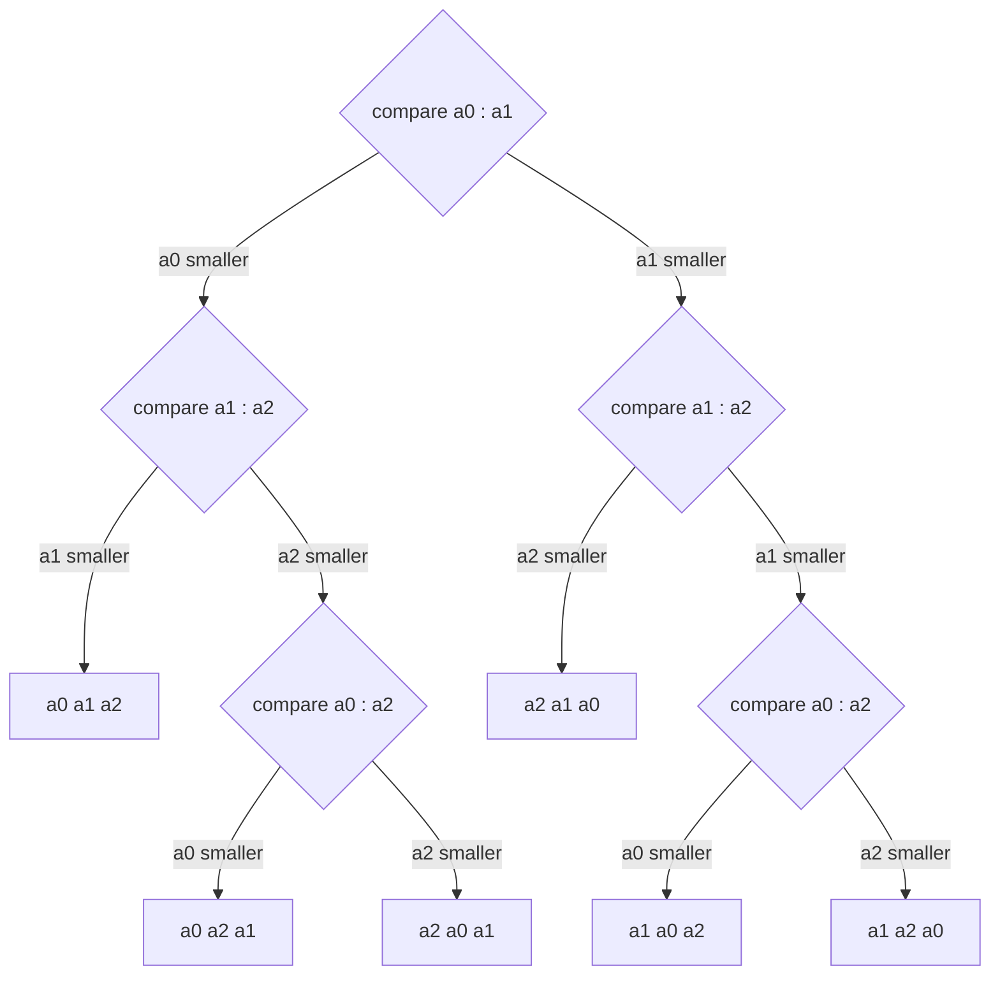

# 38.1 The comparison lower bound

[Chapter 22](../ch22-sorting/02-merge-quick.md) left one assumption unstated,
and it is doing a lot of work. Every sorting algorithm in that chapter —
bubble, selection, insertion, merge, quick — decided what to do next by asking
one kind of question: *is this element smaller than that one?* Nothing else was
ever inspected. The algorithms never looked at whether a number was even, never
used a value as an array index, never examined a string's first character. They
compared, and swapped, and that was all. This section proves that any algorithm
restricted to that one question is stuck at $O(n \log n)$ — not "in practice",
not "with current techniques", but permanently. And then it points out exactly
where the escape hatch is.

## What makes a sort "comparison-based"

An algorithm is a **comparison sort** if the only thing it ever learns about
the data is the outcome of comparisons between pairs of elements. It may
compare in any order, remember anything it likes, and move elements anywhere;
it just may not *look inside* a value.

That restriction is the reason `sorted()` works on anything you can order:

```python
words = ["pear", "fig", "apple", "kiwi"]
tuples = [(3, "c"), (1, "b"), (1, "a")]
mixed = [2.5, -1, 100, 0.0]

print(sorted(words))
print(sorted(tuples))
print(sorted(mixed))

# A comparison sort in eight lines. It never inspects a value — only `<`.
def insertion_sort(items):
    a = list(items)
    for i in range(1, len(a)):
        j = i
        while j > 0 and a[j] < a[j - 1]:     # the ONLY question it ever asks
            a[j - 1], a[j] = a[j], a[j - 1]
            j -= 1
    return a

print(insertion_sort(words))
print(insertion_sort(mixed))
```

```text
['apple', 'fig', 'kiwi', 'pear']
[(1, 'a'), (1, 'b'), (3, 'c')]
[-1, 0.0, 2.5, 100]
['apple', 'fig', 'kiwi', 'pear']
[-1, 0.0, 2.5, 100]
```

One function, three unrelated types. That generality is the *benefit* of the
restriction — and, as we are about to see, also its cost.

## A sort is a decision tree

Fix an algorithm and fix $n$. Now watch the algorithm run, and record only the
comparisons it makes and their answers. The first comparison is the same
regardless of input (the algorithm has learned nothing yet, so it has no reason
to choose differently). Its answer — yes or no — determines the second
comparison, whose answer determines the third, and so on. That structure is a
**binary tree**: internal nodes are comparisons, edges are answers, and each
leaf is one complete run of the algorithm.

Here is that tree for $n = 3$, sorting `a0, a1, a2`:



Rhombuses are comparisons, edge labels are the two possible answers, and the
rectangles at the bottom are the six leaves — each labelled with the
arrangement that leads there. Two leaves sit at depth 2; four sit at depth 3.
Here is the same tree as code, so you can check every branch:

```python
from itertools import permutations

def sort3(a):
    """The decision tree above, written out. Returns (sorted, path)."""
    path = []
    if a[0] < a[1]:
        path.append("a0<a1")
        if a[1] < a[2]:
            path.append("a1<a2")
            return [a[0], a[1], a[2]], path
        path.append("a1>a2")
        if a[0] < a[2]:
            path.append("a0<a2")
            return [a[0], a[2], a[1]], path
        path.append("a0>a2")
        return [a[2], a[0], a[1]], path
    path.append("a0>a1")
    if a[1] > a[2]:
        path.append("a1>a2")
        return [a[2], a[1], a[0]], path
    path.append("a1<a2")
    if a[0] < a[2]:
        path.append("a0<a2")
        return [a[1], a[0], a[2]], path
    path.append("a0>a2")
    return [a[1], a[2], a[0]], path

leaves = {}
print(f"{'input':<12}{'comparisons made':<26}{'depth':>6}   result")
for perm in permutations([1, 2, 3]):
    result, path = sort3(list(perm))
    leaves[tuple(path)] = perm
    ok = "correct" if result == [1, 2, 3] else "WRONG"
    print(f"{str(perm):<12}{' '.join(path):<26}{len(path):>6}   {ok}")

print(f"\ndistinct leaves reached: {len(leaves)}  (there are 3! = 6 orderings)")
print(f"deepest leaf: {max(len(p) for p in leaves)} comparisons")
print(f"a tree of depth 2 has at most 2**2 = {2 ** 2} leaves — not enough for 6")
```

```text
input       comparisons made           depth   result
(1, 2, 3)   a0<a1 a1<a2                    2   correct
(1, 3, 2)   a0<a1 a1>a2 a0<a2              3   correct
(2, 1, 3)   a0>a1 a1<a2 a0<a2              3   correct
(2, 3, 1)   a0<a1 a1>a2 a0>a2              3   correct
(3, 1, 2)   a0>a1 a1<a2 a0>a2              3   correct
(3, 2, 1)   a0>a1 a1>a2                    2   correct

distinct leaves reached: 6  (there are 3! = 6 orderings)
deepest leaf: 3 comparisons
a tree of depth 2 has at most 2**2 = 4 leaves — not enough for 6
```

Every one of the six inputs lands on its own leaf, and the deepest path takes
three comparisons. The last line is the entire proof in miniature.

## The counting argument

Three observations, each of which you can verify against the table above.

**1. Every ordering needs its own leaf.** Two different input arrangements that
follow the *same* path through the tree are indistinguishable to the algorithm
— it made identical comparisons and got identical answers, so it must perform
identical swaps. But they need *different* rearrangements to become sorted, so
at least one of them ends up wrong. Therefore the tree needs at least $n!$
distinct leaves, one per possible ordering.

**2. A binary tree of height $h$ has at most $2^h$ leaves.** Depth 0 gives one
leaf, and each extra level can at most double the count. This is the same
counting you used for [tree height](../ch20-bst/03-traversals-balance.md).

**3. Put them together.** The height $h$ is the worst-case number of
comparisons, so

$$
2^h \ \ge\ n! \qquad\Longrightarrow\qquad h \ \ge\ \log_2(n!)
$$

That is the theorem. Any comparison sort, on some input, makes at least
$\log_2(n!)$ comparisons.

### Turning $\log_2(n!)$ into something readable

$\log_2(n!)$ is exact but hard to feel. **Stirling's approximation** says that
for large $n$,

$$
n! \ \approx\ \sqrt{2\pi n}\left(\frac{n}{e}\right)^{n}
$$

Take $\log_2$ of both sides. The dominant term is $\log_2\bigl((n/e)^n\bigr) =
n\log_2 n - n\log_2 e$, and $\log_2 e \approx 1.4427$, so

$$
\log_2(n!) \ \approx\ n \log_2 n - 1.44\,n
$$

with a smaller $\tfrac{1}{2}\log_2(2\pi n)$ correction we are dropping. The
shape is what matters: **the lower bound is $n \log_2 n$ minus a linear term**,
which is $\Omega(n \log n)$. Here is how good the approximation actually is:

```python
import math

print(f"{'n':>8}{'exact log2(n!)':>17}{'n log2(n) - 1.44n':>20}{'error':>10}")
for n in (8, 16, 32, 100, 1000):
    exact = math.lgamma(n + 1) / math.log(2)      # log2(n!) without overflow
    approx = n * math.log2(n) - n / math.log(2)   # 1/ln 2 = log2(e) = 1.4427
    print(f"{n:>8}{exact:>17.1f}{approx:>20.1f}{(exact - approx) / exact:>9.1%}")
```

```text
       n   exact log2(n!)   n log2(n) - 1.44n     error
       8             15.3                12.5    18.6%
      16             44.3                40.9     7.5%
      32            117.7               113.8     3.3%
     100            524.8               520.1     0.9%
    1000           8529.4              8523.1     0.1%
```

The approximation is poor for tiny $n$ and excellent by $n = 1000$, which is
exactly what "asymptotic" means. Note the use of `math.lgamma(n + 1)` rather
than `math.log2(math.factorial(n))`: for large $n$ the factorial itself is an
enormous integer, and `lgamma` computes its logarithm directly.

## Checking the bound against a real algorithm

A lower bound is only interesting if real algorithms come close to it. Merge
sort does — remarkably close. The block below counts every comparison merge
sort performs, averaged over 300 random shuffles at each size, and puts the
count next to the theoretical floor.

```python
import math
import random

def merge_sort_counting(a):
    """Standard merge sort, returning (sorted list, comparisons made)."""
    comparisons = 0

    def sort(x):
        nonlocal comparisons
        if len(x) <= 1:
            return x
        mid = len(x) // 2
        left, right = sort(x[:mid]), sort(x[mid:])
        merged, i, j = [], 0, 0
        while i < len(left) and j < len(right):
            comparisons += 1                        # the one question asked
            if left[i] <= right[j]:
                merged.append(left[i])
                i += 1
            else:
                merged.append(right[j])
                j += 1
        merged.extend(left[i:])
        merged.extend(right[j:])
        return merged

    return sort(list(a)), comparisons

rng = random.Random(38)
print(f"{'n':>4}{'lower bound':>14}{'merge avg':>12}{'merge worst':>13}"
      f"{'n log2 n':>11}{'avg / bound':>13}")
for n in (8, 16, 32):
    total, worst = 0, 0
    for _ in range(300):
        data = list(range(n))
        rng.shuffle(data)
        result, c = merge_sort_counting(data)
        assert result == sorted(data)
        total += c
        worst = max(worst, c)
    bound = math.lgamma(n + 1) / math.log(2)
    avg = total / 300
    print(f"{n:>4}{bound:>14.1f}{avg:>12.1f}{worst:>13}"
          f"{n * math.log2(n):>11.1f}{avg / bound:>12.2f}x")
```

```text
   n   lower bound   merge avg  merge worst   n log2 n  avg / bound
   8          15.3        15.7           17       24.0        1.03x
  16          44.3        45.5           49       64.0        1.03x
  32         117.7       121.1          127      160.0        1.03x
```

Read the final column. Merge sort uses about **three percent** more comparisons
than the information-theoretic minimum. It is not merely $O(n \log n)$ — it is
very nearly optimal among all possible comparison sorts, at every size. The
crude $n \log_2 n$ column is a noticeably worse predictor than $\log_2(n!)$,
because it omits the $-1.44n$ term.

That is a striking thing to have proved with nothing but counting: we now know
that no future algorithm will ever beat merge sort by more than a few percent,
*provided it sorts by comparing*.

## What the theorem does not forbid

Read the statement carefully and the loopholes appear.

> **Any comparison sort makes $\Omega(n \log n)$ comparisons in the worst
> case.**

- It says nothing about algorithms that **do not compare**. If your algorithm
  uses a key as an array index, or looks at a number's digits, or checks a
  string's third character, it is not a comparison sort and the theorem simply
  does not apply to it. This is the loophole [§38.2](02-counting-radix-bucket.md)
  drives a truck through.
- It bounds the **worst case**, not every case. Insertion sort makes exactly
  $n-1$ comparisons on already-sorted input. Timsort — the algorithm behind
  Python's `sorted()` — is built around detecting runs that are already in
  order, and beats $n \log n$ on real-world data all day long. The bound says
  there must exist *some* input requiring $\log_2(n!)$ comparisons; it says
  nothing about the input you actually have.
- It counts **comparisons**, not time. An algorithm could make $n \log n$
  comparisons and still be slow because of memory traffic, or make more
  comparisons and be faster because of cache behaviour. Comparison count is a
  clean proxy for time, not a synonym for it.
- It assumes the keys are **arbitrary**. The theorem's $n!$ comes from "any
  ordering is possible". If you know the keys are integers from 0 to 100, there
  are far fewer possible inputs, and less information is needed to distinguish
  them.

The last two bullets are the same idea from two directions, and together they
are the whole of the next section. Sorting is fundamentally about *acquiring
information*: you need $\log_2(n!)$ bits to identify which of the $n!$ orderings
you were handed, and a yes/no comparison supplies at most one bit. But an
algorithm that reads a two-digit key learns $\log_2 100 \approx 6.6$ bits in a
single operation. It is not cheating the bound; it is asking a better question.

```python
import math

n = 1000
bits_needed = math.lgamma(n + 1) / math.log(2)
print(f"to identify one of {n}! orderings you need {bits_needed:,.0f} bits")
print(f"a yes/no comparison yields 1 bit  -> at least {bits_needed:,.0f} of them")

k = 1000                       # keys are integers 0..999
bits_per_key_read = math.log2(k)
print(f"\nreading one key from a range of {k} yields "
      f"{bits_per_key_read:.1f} bits")
print(f"{n} such reads yield {n * bits_per_key_read:,.0f} bits — "
      f"{n * bits_per_key_read / bits_needed:.1f}x what we need")
```

```text
to identify one of 1000! orderings you need 8,529 bits
a yes/no comparison yields 1 bit  -> at least 8,529 of them

reading one key from a range of 1000 yields 10.0 bits
1000 such reads yield 9,966 bits — 1.2x what we need
```

One pass that reads every key can, in principle, gather enough information to
determine the whole ordering. Whether an algorithm can *use* that information
in linear time is the question the next section answers — and the answer is
yes.

!!! warning "Common mistakes"

    - **Saying "sorting is $\Omega(n \log n)$".** Comparison sorting is.
      Dropping the qualifier turns a theorem into a falsehood, and the next
      section is a page full of counterexamples.
    - **Believing the bound applies to every input.** It is a *worst-case*
      bound: it guarantees that a hard input exists, not that your input is
      hard. Nearly-sorted data is genuinely cheaper for good algorithms.
    - **Computing `log2(factorial(n))` for large `n`.** `factorial(1000)` is a
      2,568-digit integer; building it to take its logarithm is wasteful and
      `math.log2` on it can lose precision. Use `math.lgamma(n + 1) / log(2)`.
    - **Confusing $\log_2(n!)$ with $n\log_2 n$.** They differ by about $1.44n$,
      which at $n = 32$ is a third of the total. Both are $\Theta(n \log n)$,
      but only one of them is the actual bound.
    - **Assuming a lower bound is achievable.** $\log_2(n!)$ is a floor, not a
      promise. Merge sort gets within 3% of it; no algorithm has to.

## Check your understanding

1. Why must the decision tree have at least $n!$ leaves, rather than $n$ or
   $2^n$?

    ??? success "Answer"
        Because the algorithm must be able to produce a different *rearrangement*
        for each of the $n!$ possible input orderings, and its behaviour is
        completely determined by the path it takes through the tree. Two
        orderings sharing a leaf would receive identical treatment, and since
        they need different treatment, at least one would come out unsorted.

2. A friend claims to have a comparison sort that always uses at most
   $2n$ comparisons. For which $n$ could that be true?

    ??? success "Answer"
        Only for very small $n$. We need $2n \ge \log_2(n!)$: at $n = 8$ that
        is $16 \ge 15.3$, just barely true; at $n = 16$ it would be
        $32 \ge 44.3$, false. So the claim is impossible from $n = 12$ or so
        upward — a quick calculation ($n=12$: $24$ versus $\log_2(12!) = 28.8$)
        settles it. Any claim of a *linear* comparison sort is false for all
        large $n$.

3. Python's `sorted()` sorts an already-sorted list of a million elements in
   about a million comparisons — far below $\log_2(10^6!) \approx 1.8 \times
   10^7$. Does that break the theorem?

    ??? success "Answer"
        No. The theorem bounds the **worst case**: it guarantees that *some*
        input forces $\log_2(n!)$ comparisons. Already-sorted input is the
        easiest possible case, and Timsort is specifically designed to detect
        it. Feed `sorted()` an adversarial permutation and it will need its
        full $n \log n$.

4. Counting sort (next section) sorts $n$ integers in $O(n + k)$ time, which is
   linear. Which sentence of the theorem's statement does it evade?

    ??? success "Answer"
        The word **comparison**. Counting sort never asks "is $a < b$?"; it uses
        each key directly as an index into an array of counters. The decision
        tree model does not describe it at all — its behaviour is not a sequence
        of yes/no branches — so the bound has nothing to say about it. No
        contradiction, just a different model.
