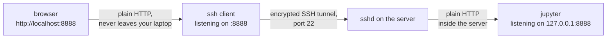

# 40.2 SSH and remote development

Sooner than you expect, the machine that runs your code stops being the
machine in front of you. The dataset is 400 GB and lives on a file server.
The model needs a GPU your laptop does not have. The web application has to
run on something with a public address that never sleeps. The build must
happen on the same operating system as production. In every one of those
cases the answer is the same: you keep the keyboard, and the computation
moves somewhere else. **SSH** — the Secure Shell — is the tool that makes
that split feel like nothing happened, and it is close to universal: the same
command works on a university cluster, a cloud instance, a Raspberry Pi, and
a router.

!!! info "No Run button for `ssh`"
    SSH needs a network, so nothing here can execute in your browser. The
    `console` blocks are transcripts to copy into a real terminal. The three
    **runnable** blocks on this page model the ideas underneath: a toy key
    pair that authenticates without revealing its secret, the fingerprint
    calculation behind that alarming first-connection prompt, and a decoder
    for the permission bits SSH is so fussy about.

## The client/server model, and what SSH adds

A **server** is a program that waits for connections; a **client** is a
program that starts one. On the remote machine, a long-running program called
`sshd` (the *SSH daemon*) listens on TCP port 22. On your machine, `ssh`
connects to it. Everything else follows from that.

What SSH provides on top of a plain connection is two things, and it is worth
keeping them separate in your head:

- **Confidentiality and integrity** — an encrypted channel, so anyone able to
  observe the network sees only ciphertext and cannot alter it undetected.
- **Authentication in both directions** — the server proves it is the machine
  you meant to reach, and you prove you are who you claim to be.

```mermaid
sequenceDiagram
    participant C as ssh (your laptop)
    participant S as sshd (the server)
    C->>S: TCP connect, port 22
    S-->>C: server's host public key
    Note over C: compare against ~/.ssh/known_hosts
    Note over C,S: key exchange — everything below is encrypted
    C->>S: "I am kim; here is my public key"
    S-->>C: a fresh random challenge
    C->>S: the challenge, signed with the private key
    Note over S: verify using authorized_keys
    S-->>C: shell session (or a command's output)
```

Read the diagram in two halves. The top half authenticates the *server* to
*you*. The bottom half authenticates *you* to the *server*. Beginners usually
only think about the second one, which is why the first one produces such a
confusing prompt the first time.

## Public-key cryptography, without the mathematics

Here is the whole idea, honestly, with no equations.

You generate a **key pair**: two files that are mathematically linked.

- The **private key** (`~/.ssh/id_ed25519`) stays on your laptop forever. It
  is never sent anywhere, never emailed, never committed, never copied to a
  server. Ideally it is itself encrypted with a passphrase, so a stolen
  laptop is not a stolen key.
- The **public key** (`~/.ssh/id_ed25519.pub`) is one short line of text that
  you can publish on a billboard. You copy it onto every server you want to
  use, into a file called `~/.ssh/authorized_keys`.

The pair has one magic property: **the private key can produce a signature
that the public key can check, and the public key cannot produce that
signature.**

Authentication is then a four-step challenge and response:

1. The server sends you a fresh random number.
2. You sign it with your private key.
3. You send back **only the signature** — never the key.
4. The server checks the signature against the public key it already has. If
   it verifies, you are in.

Three consequences are worth stating explicitly, because they are what make
this better than a password:

1. **The server never learns your secret.** A password gets sent to the
   server, so a compromised server learns it — and learns the password you
   probably reused elsewhere. A signature reveals nothing that helps forge
   the next one.
2. **The challenge is fresh every time.** An eavesdropper who records one
   successful login cannot replay it, because the next challenge is a
   different number.
3. **Revocation is one line.** Deleting a line from `authorized_keys` removes
   that key's access, with no effect on any other machine or user.

Two names to know:

| Algorithm | Where it stands |
|---|---|
| **Ed25519** | the modern default — short keys, fast, excellent security margin |
| **RSA** | the older standard, still fine at 3072 bits or more, much longer keys |

If you have no reason to choose otherwise, generate Ed25519.

## The same idea with numbers you can run

The prose above is the part you must remember. This block is optional, and it
makes "signs without revealing" concrete using RSA with absurdly small
numbers. It is a **toy**: real keys use numbers hundreds of digits long, and
the last few lines of output show exactly why size matters.

```python
"""A toy public-key pair. Real SSH keys use vastly larger numbers."""

# Two small primes. Real RSA uses primes of ~1024 bits each; Ed25519, the
# modern default, is built on elliptic curves and different mathematics.
p, q = 61, 53
n = p * q                     # the modulus: part of the PUBLIC key
phi = (p - 1) * (q - 1)       # computable only if you know p and q

e = 17                        # public exponent
d = pow(e, -1, phi)           # private exponent: e * d == 1 (mod phi)

print(f"public key  (n={n}, e={e})      <- copied to every server you use")
print(f"private key (n={n}, d={d})    <- never leaves your laptop")
print(f"check: e*d mod phi = {e * d % phi}")

# --- authentication, in the shape SSH actually uses ------------------------
# The server sends a random challenge. You sign it with d. The server checks
# the signature with e. Your private exponent never crosses the wire.
challenge = 1234                                  # server -> client
signature = pow(challenge, d, n)                  # client signs (needs d)
recovered = pow(signature, e, n)                  # server verifies (needs e)

print(f"\nchallenge from server : {challenge}")
print(f"signature sent back   : {signature}   (this is all the server sees)")
print(f"server computes s^e   : {recovered}  -> accepted: {recovered == challenge}")

# --- an impostor without the private key -----------------------------------
forged = signature + 1
print(f"\nimpostor guesses      : {forged}")
print(f"server computes s^e   : {pow(forged, e, n)}  -> accepted: "
      f"{pow(forged, e, n) == challenge}")

# --- and why the toy is a toy ----------------------------------------------
for candidate in range(2, n):
    if n % candidate == 0:
        print(f"\nfactored n in {candidate - 1} tries: "
              f"{n} = {candidate} * {n // candidate}"
              f"  -> the private key falls out immediately")
        break
```

```text
public key  (n=3233, e=17)      <- copied to every server you use
private key (n=3233, d=2753)    <- never leaves your laptop
check: e*d mod phi = 1

challenge from server : 1234
signature sent back   : 1512   (this is all the server sees)
server computes s^e   : 1234  -> accepted: True

impostor guesses      : 1513
server computes s^e   : 2601  -> accepted: False

factored n in 52 tries: 3233 = 53 * 61  -> the private key falls out immediately
```

The middle section is the real mechanism, faithfully: sign with the private
exponent, verify with the public one, and an attacker who changes the
signature by 1 produces garbage.

The last section is the honest caveat. A 2 000-year-old algorithm (trial
division) breaks a four-digit modulus in 52 steps, which is why real keys are
enormous. **Never write your own cryptography** — use the tools below, which
are written and audited by people who do this full time.

## Host keys, and that alarming first connection

The *server* has a key pair too, and it uses it to prove its identity to you.
The first time you connect, your client has never seen that key, so it asks:

```console
$ ssh kim@cluster.example.edu
The authenticity of host 'cluster.example.edu (192.0.2.31)' can't be established.
ED25519 key fingerprint is SHA256:vMdxWrV8C1yCzbkcWjyJnAmj/ZqhLxvd8OnqrpHZy30.
This key is not known by any other names.
Are you sure you want to continue connecting (yes/no/[fingerprint])? yes
Warning: Permanently added 'cluster.example.edu' (ED25519) to the list of known hosts.
kim@cluster:~$
```

Everyone types `yes` without reading it. What it is actually asking is: *do
you have any independent way to know this is the right machine?*

The correct answer is to compare the fingerprint against one published by
whoever runs the server — a wiki page, an onboarding email, the cloud console.
The fingerprint is a hash of the server's public key, printed compactly:

```python
import base64
import hashlib

# Stand-in for a server's public host key. A real one is the base64 blob in
# /etc/ssh/ssh_host_ed25519_key.pub, decoded back to raw bytes.
host_key = b"ssh-ed25519 AAAA-not-a-real-key-just-bytes-for-the-demo"


def fingerprint(key_bytes):
    """What OpenSSH prints: SHA-256 of the key, base64, padding stripped."""
    digest = hashlib.sha256(key_bytes).digest()
    return "SHA256:" + base64.b64encode(digest).decode().rstrip("=")


print("the server you trust     :", fingerprint(host_key))

# An impostor must present a DIFFERENT key: they do not have the server's
# private half. A four-byte change is more than enough.
impostor = host_key.replace(b"demo", b"demX")
print("an impostor's key        :", fingerprint(impostor))
print("first four chars match?  :",
      fingerprint(host_key)[7:11] == fingerprint(impostor)[7:11])
print("digest length            :",
      len(hashlib.sha256(host_key).digest()) * 8, "bits")
```

```text
the server you trust     : SHA256:vMdxWrV8C1yCzbkcWjyJnAmj/ZqhLxvd8OnqrpHZy30
an impostor's key        : SHA256:XrBvclO5OICMFSdd9k3VIxLjfXofBFmP8V1eKfXFB4w
first four chars match?  : False
digest length            : 256 bits
```

Once you answer `yes`, the key is stored in `~/.ssh/known_hosts` and checked
on every future connection. Which is why *this* message deserves genuine
alarm:

```console
@@@@@@@@@@@@@@@@@@@@@@@@@@@@@@@@@@@@@@@@@@@@@@@@@@@@@@@@@@@
@    WARNING: REMOTE HOST IDENTIFICATION HAS CHANGED!     @
@@@@@@@@@@@@@@@@@@@@@@@@@@@@@@@@@@@@@@@@@@@@@@@@@@@@@@@@@@@
IT IS POSSIBLE THAT SOMEONE IS DOING SOMETHING NASTY!
```

Usually it is innocent — the server was rebuilt and generated a new host key.
Occasionally it is not. Ask the administrator *before* you run
`ssh-keygen -R hostname` to forget the old key; deleting the warning is the
one action that turns a detected attack into a successful one.

## The practical workflow

Five commands cover almost everything. The first two are a one-time setup,
done in order; the rest are daily habits.

### 1. Generate a key pair — once per machine you type on

```console
$ ssh-keygen -t ed25519 -C "kim@laptop"
Generating public/private ed25519 key pair.
Enter file in which to save the key (/Users/kim/.ssh/id_ed25519):
Enter passphrase (empty for no passphrase):
Enter same passphrase again:
Your identification has been saved in /Users/kim/.ssh/id_ed25519
Your public key has been saved in /Users/kim/.ssh/id_ed25519.pub
```

Use a passphrase. The whole point of the private key is that possessing the
file is *not enough*; the passphrase is the second factor, and you will type
it approximately once per day thanks to the agent below.

### 2. Install the public key on a server

```console
$ ssh-copy-id kim@cluster.example.edu
kim@cluster.example.edu's password:
Number of key(s) added: 1
$ ssh kim@cluster.example.edu        # no password this time
```

`ssh-copy-id` is a small script that appends your `.pub` file to the server's
`~/.ssh/authorized_keys` and fixes the permissions. If it is not installed,
the manual equivalent is to paste the one-line contents of `id_ed25519.pub`
into that file yourself.

### 3. Stop typing long commands — `~/.ssh/config`

```text
Host cluster
    HostName        cluster.example.edu
    User            kim
    IdentityFile    ~/.ssh/id_ed25519
    ServerAliveInterval 60          # a keepalive every 60s, so idle sessions live

Host gpu-*
    User            kim
    ProxyJump       cluster         # reach these only via the login node
    ForwardAgent    no

Host github.com
    User            git
    IdentityFile    ~/.ssh/id_ed25519
```

Now `ssh cluster` is the whole command and `scp file cluster:` works.
`ssh gpu-04` automatically hops through the login node first — that is what
`ProxyJump` does, and it replaces the fragile nested-`ssh` incantations you
will see in older documentation. Wildcards in `Host` patterns mean one block
can configure a whole fleet.

### 4. Type your passphrase once — the agent

```console
$ eval "$(ssh-agent -s)"          # start the agent (many systems do this for you)
Agent pid 4711
$ ssh-add ~/.ssh/id_ed25519       # unlock the key and hand it to the agent
Enter passphrase for /Users/kim/.ssh/id_ed25519:
Identity added: /Users/kim/.ssh/id_ed25519 (kim@laptop)
$ ssh-add -l                      # what the agent is currently holding
256 SHA256:vMdxWrV8C1... kim@laptop (ED25519)
```

`ssh-agent` holds the decrypted key in memory and does the signing on
request, so every later connection is passphrase-free until you log out. Put
`AddKeysToAgent yes` in your config to have it happen automatically.

### 5. Copy files — `scp` for one-offs, `rsync` for everything else

```console
$ scp results.csv cluster:~/data/            # local -> remote
$ scp cluster:~/logs/app.log .               # remote -> local
$ scp -r ./figures cluster:~/paper/          # -r for a directory

$ rsync -avz --progress ./dataset/ cluster:~/dataset/
$ rsync -avz --exclude '*.pyc' --exclude '.git' ./src/ cluster:~/src/
$ rsync -avz --delete ./site/ cluster:/var/www/site/     # make remote match exactly
```

`rsync` transfers only the differences, resumes cleanly after a dropped
connection, preserves timestamps and permissions (`-a`), compresses in
flight (`-z`), and can mirror a directory exactly (`--delete`).

!!! tip "One trap worth memorising: the trailing slash"

    A **trailing slash on the source** means "the contents of this directory".
    `rsync -a src/ dest/` puts the contents into `dest`; `rsync -a src dest/`
    creates `dest/src`. Nearly every rsync surprise is that slash.

### Run one command without an interactive shell

```console
$ ssh cluster 'df -h /scratch | tail -n 1'
/dev/sdb1       7.3T  4.1T  2.9T  59% /scratch
$ ssh cluster 'cd project && git pull && make test'
```

Quote the remote command in single quotes so *your* shell does not expand
`$HOME` and `*` locally before sending it.

## Sessions that survive: `tmux`

Here is the problem every remote newcomer hits exactly once. You start an
eight-hour training run over SSH. Four hours later your laptop sleeps, the
Wi-Fi changes, or a train goes into a tunnel. The connection drops, the
remote shell receives a hang-up signal, and it kills everything it started.
Four hours of compute, gone.

The fix is a **terminal multiplexer**: a program that runs *on the server* and
owns your shells, so that your SSH connection is merely a window onto them.

Detach — deliberately or by accident — and the programs keep running.
Reconnect from a different machine and attach again.

```console
$ ssh cluster
$ tmux new -s train              # create a named session
                                 # ... start the long job ...
                                 # press Ctrl-b then d  ->  [detached]
$ exit                           # close SSH entirely; the job keeps running

# hours later, possibly from a different computer
$ ssh cluster
$ tmux ls
train: 3 windows (created Tue Mar  4 09:12:41 2024)
$ tmux attach -t train           # everything exactly as you left it
```

Every tmux command starts with the **prefix** key, ++ctrl+b++, released, then
one more key. These are the ones worth learning first:

| Keys | Does |
|---|---|
| ++ctrl+b++ then ++d++ | **detach** — leave everything running |
| ++ctrl+b++ then ++c++ | create a new window |
| ++ctrl+b++ then ++n++ / ++p++ | next / previous window |
| ++ctrl+b++ then a digit | jump straight to that window number |
| ++ctrl+b++ then `,` | rename the current window |
| ++ctrl+b++ then `%` | split the pane left/right |
| ++ctrl+b++ then `"` | split the pane top/bottom |
| ++ctrl+b++ then an arrow key | move between panes |
| ++ctrl+b++ then ++z++ | zoom the current pane to full screen (and back) |
| ++ctrl+b++ then `[` | scrollback / copy mode (++q++ to leave) |
| ++ctrl+b++ then ++x++ | kill the current pane (asks first) |

A typical remote layout is one window per concern: an editor in one, a log
tail in another, a shell for git in a third.

Two alternatives worth knowing. `screen` is the older program that does the
same job and is sometimes the only one installed; the concepts transfer
directly. For a single fire-and-forget command, `nohup command &` or `setsid`
is enough — but tmux is what you want the moment you need to look at the
output again.

## Port forwarding: reaching a service that is not public

Servers frequently run something useful on a port that is firewalled off from
the internet — a Jupyter notebook on 8888, a development web server on 3000,
a database on 5432. Rather than exposing it, tunnel it through the SSH
connection you already have.

```console
$ ssh -L 8888:localhost:8888 cluster
```

Read `-L` as **L**ocal: "open port 8888 *on my machine*, and forward anything
that connects to it through the encrypted channel to `localhost:8888` *as seen
from the server*".

Now typing `http://localhost:8888` into your own browser reaches the remote
notebook, and no port was ever opened to the world.



The important detail is that `localhost` in `-L 8888:localhost:8888` is
resolved **on the server**, not on your laptop. That is why the target can be
a service bound to the server's loopback interface and unreachable from
anywhere else — which is exactly how such services should be configured.

Four variations complete the picture:

| Command | Effect |
|---|---|
| `ssh -L 5432:db-internal:5432 cluster` | forward to a *third* machine that only the server can reach |
| `ssh -R 9000:localhost:3000 cluster` | **R**everse: let the server reach a service on your laptop |
| `ssh -D 1080 cluster` | a SOCKS proxy: send a browser's whole traffic through the server |
| `ssh -N -f -L 8888:localhost:8888 cluster` | `-N` no shell, `-f` background: a tunnel and nothing else |

The same thing lives in `~/.ssh/config` as `LocalForward 8888 localhost:8888`
so that `ssh cluster` always brings the tunnel with it.

## Editing remote code from your editor

Editing over SSH with `vim` or `nano` is a genuine skill worth having for
five-line fixes on a server at 2 a.m. For daily work, modern editors do
something smarter than syncing files back and forth.

**VS Code Remote-SSH** connects over your existing SSH configuration and
installs a small server component into your home directory on the remote
machine. The user interface runs locally, so typing is instant, while the file
system, the integrated terminal, the language server, the debugger, and most
extensions run *on the remote host*. There is no local copy of the project to
fall out of sync, and the remote machine's Python, compilers, and GPUs are the
ones in use.

**JetBrains Gateway** takes the same approach for IntelliJ, PyCharm, and the
rest: a thin client on your laptop draws the interface, and the full IDE
backend — indexing, inspections, refactoring — runs on the server, where the
code and the memory are.

Both are, underneath, ordinary SSH connections, so everything on this page
still applies:

- they read `~/.ssh/config` and use your agent — if `ssh cluster` works in a
  terminal, they will generally work too;
- they keep their remote component running for a while after you disconnect,
  which is why an editor session survives a brief network blip in the same way
  a tmux session does.

## Permissions, decoded

SSH is famously fussy about file permissions: it will refuse to use a private
key that other users could read.

Understanding the refusal means reading Unix permission bits, which are just
[binary](../ch00-machine/02-binary.md) grouped in threes and tested with the
[bitwise operators](../ch06-loops/04-bitwise-enums.md) from Chapter 6. A file
has nine permission bits — read, write, and execute, for the **owner**, the
owner's **group**, and **others**. `ls -l` prints them as letters; `chmod`
takes them as an octal number, because each octal digit is exactly three bits.

```python
FLAGS = "rwxrwxrwx"


def to_symbolic(mode):
    """0o755 -> 'rwxr-xr-x'. Nine bits, tested one at a time."""
    out = []
    for i in range(9):
        mask = 1 << (8 - i)     # bit 8 = owner read ... bit 0 = other execute
        out.append(FLAGS[i] if mode & mask else "-")
    return "".join(out)


def to_mode(symbolic):
    """'rwxr-xr-x' -> 0o755. Set a bit wherever a letter appears."""
    mode = 0
    for i, char in enumerate(symbolic):
        if char != "-":
            mode |= 1 << (8 - i)
    return mode


print(f"{'oct':>5}  {'binary':>9}  {'symbolic':<10} round-trips?")
for mode in [0o755, 0o644, 0o700, 0o600, 0o400, 0o664, 0o777, 0o000]:
    sym = to_symbolic(mode)
    print(f"  {mode:03o}  {mode:>09b}  {sym:<10} {to_mode(sym) == mode}")

print("\neach octal digit is exactly three bits -- one rwx group:")
for digit in range(8):
    print(f"  {digit} = {digit:03b} = {to_symbolic(digit)[6:]}")

print("\nwhat SSH insists on:")
for mode, path, rule in [
    (0o700, "~/.ssh",                 "directory: only you"),
    (0o600, "~/.ssh/id_ed25519",      "private key: only you, or ssh refuses it"),
    (0o644, "~/.ssh/id_ed25519.pub",  "public key: safe to be world-readable"),
    (0o600, "~/.ssh/authorized_keys", "on the server: only you may edit it"),
]:
    sym = to_symbolic(mode)
    readable = "yes" if sym[6:] != "---" else "no"
    print(f"  {mode:03o}  {sym}  {path:<22} others can read: {readable:<3} ({rule})")
```

```text
  oct     binary  symbolic   round-trips?
  755  111101101  rwxr-xr-x  True
  644  110100100  rw-r--r--  True
  700  111000000  rwx------  True
  600  110000000  rw-------  True
  400  100000000  r--------  True
  664  110110100  rw-rw-r--  True
  777  111111111  rwxrwxrwx  True
  000  000000000  ---------  True

each octal digit is exactly three bits -- one rwx group:
  0 = 000 = ---
  1 = 001 = --x
  2 = 010 = -w-
  3 = 011 = -wx
  4 = 100 = r--
  5 = 101 = r-x
  6 = 110 = rw-
  7 = 111 = rwx

what SSH insists on:
  700  rwx------  ~/.ssh                 others can read: no  (directory: only you)
  600  rw-------  ~/.ssh/id_ed25519      others can read: no  (private key: only you, or ssh refuses it)
  644  rw-r--r--  ~/.ssh/id_ed25519.pub  others can read: yes (public key: safe to be world-readable)
  600  rw-------  ~/.ssh/authorized_keys others can read: no  (on the server: only you may edit it)
```

Now `chmod 755 script.sh` is readable rather than memorised: `7` = `rwx` for
you, `5` = `r-x` for your group, `5` = `r-x` for everyone else — a script
anybody may run but only you may change. And SSH's complaint —

```console
$ ssh cluster
@@@@@@@@@@@@@@@@@@@@@@@@@@@@@@@@@@@@@@@@@@@@@@@@@@@@@@@@@@@
@         WARNING: UNPROTECTED PRIVATE KEY FILE!          @
@@@@@@@@@@@@@@@@@@@@@@@@@@@@@@@@@@@@@@@@@@@@@@@@@@@@@@@@@@@
Permissions 0644 for '/Users/kim/.ssh/id_ed25519' are too open.
$ chmod 600 ~/.ssh/id_ed25519
```

— says exactly what the decoder shows: `0644` is `rw-r--r--`, so every other
account on that machine could read your private key. `600` is `rw-------`.

!!! note "The `d` and the execute bit on directories"
    `ls -l` prints a tenth character *before* the nine, and it is a type, not
    a permission: `-` for a regular file, `d` for a directory, `l` for a
    symbolic link. On a directory the bits also mean something slightly
    different: `r` lists the names inside, `w` creates and deletes entries,
    and `x` means "may enter" — which is why directories are almost always
    `755` or `700` and never `644`.

## Security hygiene

A short list, all of it learned the hard way by somebody.

- **Never copy a private key to a server.** If you need to reach machine C
  from machine B, generate a *new* key pair on B, or use `ProxyJump` so the
  signing always happens on your laptop. Agent forwarding (`ForwardAgent
  yes`) also avoids copying the key, but anyone with root on the intermediate
  machine can use your agent while you are connected — prefer `ProxyJump`.
- **Never commit keys.** A private key, a `.pem` file, an API token, or a
  `.env` file in a repository is public the moment the repository is —
  including in the history, forever, even after you delete the file in a
  later commit. Put `*.pem`, `id_*`, and `.env` in `.gitignore`
  ([Section 24.1](../ch24-practice/01-git-workflow.md)), and if it has
  already happened, treat the key as compromised and rotate it rather than
  trying to scrub history.
- **Use a passphrase plus the agent.** The combination costs you one prompt a
  day and makes a stolen laptop far less interesting.
- **Turn off password authentication on servers you administer.** In
  `/etc/ssh/sshd_config`, `PasswordAuthentication no` plus
  `PermitRootLogin no` eliminates the entire category of password-guessing
  attacks that any machine with a public address receives constantly. Test
  that key login works in a second terminal *before* you restart `sshd` and
  lock yourself out.
- **One key per device, not one key per server.** Then losing a laptop means
  removing one line from each server's `authorized_keys`, and you always know
  which machine a key belongs to — which is what the `-C "kim@laptop"`
  comment is for.
- **Do not disable host-key checking.** `StrictHostKeyChecking no` appears in
  a lot of copy-pasted scripts and turns off the only protection you have
  against connecting to the wrong machine.

!!! warning "Common mistakes"
    - **Copying `id_ed25519` instead of `id_ed25519.pub`** onto a server. The
      one *with* `.pub` is the one that gets shared. If the private one ever
      leaves your machine, generate a new pair.
    - **`Permission denied (publickey)`** almost always means one of: the key
      is not in the server's `authorized_keys`, the agent does not have your
      key loaded (`ssh-add -l`), or permissions are too open. `ssh -v` prints
      which keys it offered and why each was refused.
    - **Running long jobs outside tmux.** Any dropped connection kills them.
      Start tmux *before* the job, not after.
    - **Forgetting the rsync trailing slash**, and creating
      `~/dataset/dataset/`.
    - **Typing `yes` to a changed host key** without asking anyone. That is
      the one prompt on this page that is worth stopping for.
    - **Editing files locally and `scp`-ing them up by hand.** Within a day
      you will have two divergent copies. Use rsync, a remote-development
      editor, or — best — `git push` and `git pull`.

## Check your understanding

??? success "1. A colleague asks you to email them your SSH key so they can give you access to their server. What do you send?"

    The **public** key only: the one-line contents of `~/.ssh/id_ed25519.pub`.
    They append it to `~/.ssh/authorized_keys` on the server. The private
    key `~/.ssh/id_ed25519` never leaves your machine — there is no
    legitimate workflow that requires sending it, and anyone asking for it is
    either confused or malicious.

??? success "2. Why can the server verify you without ever learning your private key?"

    Because verification and signing are different operations. The server
    sends a fresh random challenge; you return a signature computed with the
    private key; the server checks that signature against the public key it
    already holds. The signature proves you hold the private key without
    containing it, and because the challenge changes every time, a recorded
    signature is useless for the next login. The toy RSA block above shows
    exactly this: `pow(challenge, d, n)` needs `d`, but
    `pow(signature, e, n)` needs only `e`.

??? success "3. You run `ssh -L 8080:localhost:80 web-01`. Whose `localhost` is `localhost`?"

    The server's. The forwarding target is resolved on `web-01`, so traffic
    arriving at port 8080 on *your* laptop is delivered to port 80 on
    `web-01`'s own loopback interface. That is precisely why the tunnel can
    reach a service that `web-01` has deliberately bound to loopback and
    exposed to nobody.

??? success "4. What does `chmod 640 notes.txt` allow, and who can execute the file?"

    `6` = `110` = `rw-` for the owner, `4` = `100` = `r--` for the group,
    `0` = `000` = `---` for everyone else: the owner can read and write, the
    group can read, others cannot touch it. Nobody can execute it — the
    execute bit is clear in all three groups. Run the decoder block with
    `0o640` added to the list to confirm.
