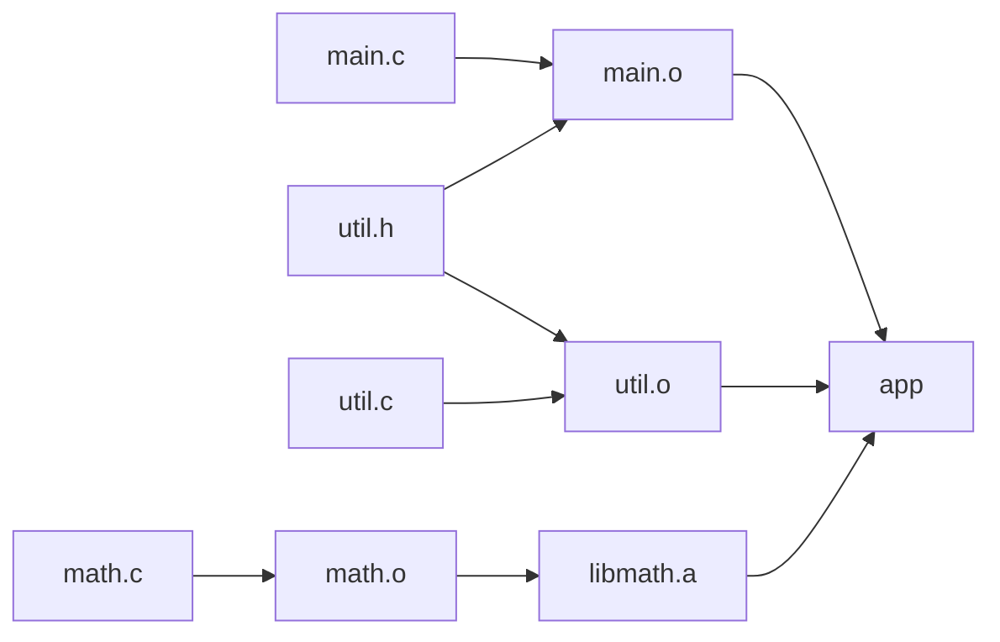

# 40.3 Make and build systems

Every project eventually stops being one file. A C program becomes forty
source files that compile to forty object files that link into one binary; a
Java project becomes hundreds of classes plus a jar; a website becomes
TypeScript that compiles, images that get resized, and CSS that gets bundled.
All of those steps have the same shape — *this* output depends on *those*
inputs, and it needs redoing only if an input changed. A **build system** is
the program that knows that shape. `make` was the first one, it is about half
a century old, it is on every Unix machine ever made, and every modern
build tool is a variation on the two ideas it introduced: a dependency graph,
and a staleness test.

!!! info "Makefiles cannot run here — the model can"
    Makefiles go in `makefile` fences and shell sessions in `console` fences,
    neither of which gets a Run button. The centrepiece of this page is a
    **mini-make written in Python**: it parses a rule table, builds the
    dependency graph, sorts it topologically, tracks timestamps, rebuilds
    only what is stale, and detects cycles. Once you have run it, real `make`
    holds no mysteries — only syntax.

## The arithmetic that makes this worth it

The case for incremental builds is not aesthetic, it is arithmetic. Suppose
each source file takes 0.8 seconds to compile and the final link takes 4
seconds. You change one file and rebuild — thirty times a day, which is a
quiet day.

```python
# What does rebuilding everything actually cost?
COMPILE_S = 0.8        # seconds to compile one source file
LINK_S = 4.0           # seconds to link the finished program
EDITS_PER_DAY = 30     # how often you change one file and rebuild

print(f"{'files':>7} {'full build':>12} {'incremental':>12} {'speed-up':>9} "
      f"{'wasted/day':>12}")
for files in (10, 100, 400, 2000):
    full = files * COMPILE_S + LINK_S
    incremental = 1 * COMPILE_S + LINK_S       # one file changed, then relink
    wasted = (full - incremental) * EDITS_PER_DAY
    print(f"{files:>7} {full:>10.1f}s {incremental:>11.1f}s "
          f"{full / incremental:>8.1f}x {wasted / 3600:>10.2f}h")

print("\nAnd the same arithmetic for a test suite:")
TEST_S = 0.05
for tests in (200, 5000, 50000):
    print(f"  {tests:>6} tests x {TEST_S}s = {tests * TEST_S / 60:>6.1f} min "
          f"per full run")
```

```text
  files   full build  incremental  speed-up   wasted/day
     10       12.0s         4.8s      2.5x       0.06h
    100       84.0s         4.8s     17.5x       0.66h
    400      324.0s         4.8s     67.5x       2.66h
   2000     1604.0s         4.8s    334.2x      13.33h

And the same arithmetic for a test suite:
     200 tests x 0.05s =    0.2 min per full run
    5000 tests x 0.05s =    4.2 min per full run
   50000 tests x 0.05s =   41.7 min per full run
```

At ten files nobody cares. At four hundred — a small project by professional
standards — rebuilding everything costs you two and two-thirds *hours* of
waiting per day, and the 2 000-file row is more waiting than there are working
hours, which is a polite way of saying that no large project has ever been
built that way.

The waiting is also worse than the clock suggests: a five-minute build is long
enough to lose your train of thought and check your messages, so the real cost
is measured in broken concentration rather than seconds.

## The idea: a dependency graph plus timestamps

A build is a **directed acyclic graph** — exactly the structure from
[Chapter 37](../ch37-graphs/01-representations.md). Each node is a file. An
edge from `util.c` to `util.o` means "`util.o` is built *from* `util.c`". A
small C project looks like this:



Two rules turn that picture into a build system.

### Rule 1 — order

A file must be built after everything it depends on. That is precisely a
**topological sort** — [Section 37.2's](../ch37-graphs/02-traversal.md) "list
the vertices so that every edge points forwards" — and the graph *must* be
acyclic for such an order to exist, which is why a dependency cycle is a fatal
error rather than a warning.

### Rule 2 — staleness

Walking that order, `make` decides what to run by asking three questions about
each target, in this sequence:

1. **Does the target exist?** If not, run its recipe.
2. **Has any prerequisite a newer modification time?** If so, run its recipe.
3. **Otherwise, skip it** — and print nothing.

That single timestamp comparison is the whole caching strategy: **`make` never
looks inside your files.**

Notice that staleness *propagates*. Touching `math.c` makes `math.o` stale;
rebuilding `math.o` gives it a new timestamp, which makes `libmath.a` stale;
which makes `app` stale. One edit, three commands, and `main.o` and `util.o`
are never touched. Getting that propagation right by hand is exactly the job
you are delegating.

## Makefile anatomy

A `Makefile` is a list of **rules**. Each rule has a target, its
prerequisites, and a recipe — the shell commands that produce the target.

```makefile
target: prerequisite1 prerequisite2
	command to build the target
	another command
```

### The tab

The indentation of a recipe line **must be a real tab character**. Not four
spaces, not eight. This is the single most notorious wart in the tool, it
dates from 1976, and its author has publicly called it a mistake. Getting it
wrong produces:

```console
$ make
Makefile:5: *** missing separator.  Stop.
```

"Missing separator" always means "you used spaces where a tab belongs". Most
editors can be told to keep literal tabs in `Makefile`s; do that once and
forget about it.

### Variables

Variables avoid repetition, and there are four assignment operators:

| Written | Means |
|---|---|
| `=` | expanded at the moment of *use* |
| `:=` | expanded immediately, at the point of definition — usually what you want |
| `?=` | set a default, only if the variable is unset |
| `+=` | append to what is already there |

```makefile
CC      := cc
CFLAGS  := -Wall -Wextra -O2
SRCS    := main.c util.c math.c
OBJS    := $(SRCS:.c=.o)          # main.o util.o math.o
PREFIX  ?= /usr/local             # overridable: make PREFIX=~/.local install
```

### Automatic variables

These are set by `make` inside each recipe, and they are what make rules
reusable:

| Variable | Means |
|---|---|
| `$@` | the target being built |
| `$<` | the **first** prerequisite |
| `$^` | **all** prerequisites, space-separated, duplicates removed |
| `$?` | only the prerequisites newer than the target |
| `$*` | the *stem* — the part a pattern rule's `%` matched |

### Pattern rules

A pattern rule states a recipe once for a whole class of files. `%` is a
wildcard that must match the same text on both sides:

```makefile
%.o: %.c
	$(CC) $(CFLAGS) -c $< -o $@
```

Read it as: "any `.o` file can be built from the `.c` file with the same
stem, by compiling the first prerequisite (`$<`) into the target (`$@`)".
That one rule replaces one rule per source file.

### `.PHONY`

`.PHONY` marks targets that are not files. Without it, a target called `clean`
would be considered up to date the moment a *file* named `clean` existed in
the directory — a genuinely confusing bug:

```makefile
.PHONY: all clean test install
```

### A complete Makefile, dissected

```makefile
# ---- configuration ---------------------------------------------------- 1
CC       := cc
CFLAGS   := -Wall -Wextra -O2 -MMD -MP
LDFLAGS  :=
LDLIBS   := -lm

SRCS     := main.c util.c math.c                                       # 2
OBJS     := $(SRCS:.c=.o)
DEPS     := $(OBJS:.o=.d)
TARGET   := app

.PHONY: all clean test run                                             # 3

all: $(TARGET)                                                         # 4

$(TARGET): $(OBJS)                                                     # 5
	$(CC) $(LDFLAGS) -o $@ $^ $(LDLIBS)

%.o: %.c                                                               # 6
	$(CC) $(CFLAGS) -c $< -o $@

test: $(TARGET)                                                        # 7
	./$(TARGET) --self-test

run: $(TARGET)
	./$(TARGET)

clean:                                                                 # 8
	rm -f $(OBJS) $(DEPS) $(TARGET)

-include $(DEPS)                                                       # 9
```

1. Configuration at the top, in variables, so every recipe below is short
   and there is one place to change the compiler or the flags. `-MMD -MP`
   asks the compiler to write out a small dependency file per object —
   see note 9.
2. The source list is written once; `$(SRCS:.c=.o)` derives the object list
   by substitution. On a larger project this is often
   `SRCS := $(wildcard src/*.c)`.
3. All four of these are commands, not files, so they are declared phony.
4. The **first** target in the file is what plain `make` builds, so `all`
   goes at the top by convention.
5. The link step. `$^` expands to every object file; `$@` is `app`. Nothing
   here mentions a specific file name, so adding a source to `SRCS` is the
   only edit needed.
6. The pattern rule that compiles each `.c` into a `.o`. Note `$<` and not
   `$^`: only the source file is passed to the compiler, not the headers
   that also appear as prerequisites.
7. A phony target may still have a prerequisite. `make test` builds the
   program first if it is stale, then runs it — the dependency graph does the
   sequencing for free.
8. `clean` has no prerequisites, so it always runs. `rm -f` does not
   complain about files that are already gone.
9. The subtle one. A `.o` depends on the headers its `.c` includes, but
   listing those by hand rots instantly. `-MMD` makes the compiler emit
   `main.d` containing exactly that rule, and `-include` pulls those files
   in if they exist (the leading `-` means "do not fail on the first build,
   when they do not"). This is the standard way real C projects get header
   dependencies right, and it is worth recognising when you meet it.

## `make -n`, `make -j`, and why parallel builds work

Two flags earn their keep immediately.

```console
$ make -n                    # dry run: print the commands, execute nothing
cc -Wall -Wextra -O2 -MMD -MP -c util.c -o util.o
cc -Wall -Wextra -O2 -MMD -MP -o app main.o util.o math.o -lm

$ make -j8                   # run up to 8 recipes at once
$ make -j$(nproc)            # ... one per CPU core (Linux; sysctl -n hw.ncpu on macOS)
```

`-n` answers "what *would* this do?" without doing it, which is the correct
first move whenever a Makefile is unfamiliar or a target is called `deploy`.

`-j` is the payoff for having a graph rather than a script. Two targets with
no path between them cannot affect each other, so they can be built
simultaneously. In the graph above, `main.o`, `util.o`, and `math.o` are
mutually independent — three cores, one third of the time.

A shell script that ran the same commands could not do this: **a script
encodes an *order*, while a Makefile encodes *constraints*** — and constraints
leave the tool free to fill in the schedule.

The catch is that parallelism exposes dependencies you forgot to declare. If
`util.c` is generated by a script and you never said so, a serial build might
happen to run the script first and work by luck, while `-j8` runs them at the
same time and fails intermittently. "Works with `make` but fails with
`make -j`" almost always means a missing prerequisite, not a broken tool.

## A mini-make in Python

Now build the thing. Everything above is in here: rules as data, a graph,
topological order with cycle detection, simulated timestamps, and a staleness
test. The commands are printed rather than run, which is exactly `make -n`
plus a clock.

```python
"""A mini-make: dependency graph + timestamps + topological order."""

# ---- the Makefile, as data ------------------------------------------------
# target: (prerequisites, command)
RULES = {
    "app":       (["main.o", "util.o", "libmath.a"],
                  "cc -o app main.o util.o libmath.a"),
    "main.o":    (["main.c", "util.h"], "cc -c main.c"),
    "util.o":    (["util.c", "util.h"], "cc -c util.c"),
    "libmath.a": (["math.o"],           "ar rcs libmath.a math.o"),
    "math.o":    (["math.c"],           "cc -c math.c"),
}

# ---- the file system, as data ---------------------------------------------
# name -> modification time (a counter standing in for a clock)
mtimes = {"main.c": 1, "util.c": 2, "util.h": 3, "math.c": 4}
clock = 10          # the next timestamp a build will stamp on its output


def prerequisites(target):
    return RULES[target][0] if target in RULES else []


def reachable(goal):
    """Every node the goal depends on, directly or indirectly."""
    seen, stack = set(), [goal]
    while stack:
        node = stack.pop()
        if node in seen:
            continue
        seen.add(node)
        stack.extend(prerequisites(node))
    return seen


def topological_order(goal):
    """Prerequisites before dependents. Raises on a dependency cycle."""
    order, state = [], {}          # state: "visiting" or "done"

    def visit(node, path):
        if state.get(node) == "done":
            return
        if state.get(node) == "visiting":
            cycle = " -> ".join(path[path.index(node):] + [node])
            raise ValueError(f"dependency cycle: {cycle}")
        state[node] = "visiting"
        for prereq in prerequisites(node):
            visit(prereq, path + [node])
        state[node] = "done"
        order.append(node)         # post-order: after all prerequisites

    visit(goal, [])
    return order


def build(goal, dry_run=False):
    global clock
    ran, rebuilt = 0, set()
    for target in topological_order(goal):
        if target not in RULES:                      # a source file
            if target not in mtimes:
                raise FileNotFoundError(f"no rule to make target '{target}'")
            continue
        prereqs, command = RULES[target]
        newer = [p for p in prereqs
                 if p in rebuilt or mtimes[p] > mtimes.get(target, -1)]
        if target not in mtimes:
            reason = "does not exist"
        elif newer:
            reason = "older than " + ", ".join(newer)
        else:
            continue                                 # up to date: skip it
        print(f"  {command:<38}# {target} {reason}")
        ran += 1
        rebuilt.add(target)
        if not dry_run:
            mtimes[target] = clock
            clock += 1
    if ran == 0:
        print(f"  make: '{goal}' is up to date.")
    return ran


print(f"targets reachable from 'app': {len(reachable('app'))}")
print("build order:", " -> ".join(topological_order("app")))
print("\n$ make app")
build("app")
print("\n$ make app          # nothing changed")
build("app")
```

```text
targets reachable from 'app': 9
build order: main.c -> util.h -> main.o -> util.c -> util.o -> math.c -> math.o -> libmath.a -> app

$ make app
  cc -c main.c                          # main.o does not exist
  cc -c util.c                          # util.o does not exist
  cc -c math.c                          # math.o does not exist
  ar rcs libmath.a math.o               # libmath.a does not exist
  cc -o app main.o util.o libmath.a     # app does not exist

$ make app          # nothing changed
  make: 'app' is up to date.
```

Three details are worth pausing on:

- **`topological_order` is a depth-first search** that appends each node
  *after* visiting its prerequisites — the post-order trick from
  [Section 37.2](../ch37-graphs/02-traversal.md).
- **The `rebuilt` set makes staleness propagate** correctly even in a dry run,
  where no timestamp is updated.
- **The second `make` prints the sentence every developer has seen a thousand
  times**, produced by exactly the logic you just read.

### Touch one file, and watch the subgraph

`touch` is the shell command that updates a file's modification time without
changing its contents — the standard way to force a rebuild. Here it is as
one line, and the answer to "which targets does one edit cost me?":

```python
# continues — uses RULES, mtimes, clock and build() from the block above


def touch(name):
    """The shell's `touch`: give a file a brand-new modification time."""
    global clock
    mtimes[name] = clock
    clock += 1
    print(f"$ touch {name}")


touch("math.c")
print("$ make app")
build("app")

touch("util.h")
print("$ make app")
build("app")
```

```text
$ touch math.c
$ make app
  cc -c math.c                          # math.o older than math.c
  ar rcs libmath.a math.o               # libmath.a older than math.o
  cc -o app main.o util.o libmath.a     # app older than libmath.a
$ touch util.h
$ make app
  cc -c main.c                          # main.o older than util.h
  cc -c util.c                          # util.o older than util.h
  cc -o app main.o util.o libmath.a     # app older than main.o, util.o
```

That is the whole value proposition in one block of output. Touching `math.c`
rebuilds three of the five targets and leaves `main.o` and `util.o` alone —
and the reason column shows the staleness propagating up the chain one edge at
a time.

Touching the *header* `util.h` is more expensive, because two object files
include it. This is why experienced C programmers care about which header
includes which: **a widely included header turns every edit into a full
rebuild, and no build system can save you from a graph shaped like that.**

### The dry run, and why it must reason ahead

```python
# continues — the mini-make and touch() are already defined

touch("util.c")
print("$ make -n app        # dry run: print the commands, run nothing")
build("app", dry_run=True)
print("$ make -n app        # again -- still nothing has been built")
build("app", dry_run=True)
print("$ make app           # for real this time")
build("app")
```

```text
$ touch util.c
$ make -n app        # dry run: print the commands, run nothing
  cc -c util.c                          # util.o older than util.c
  cc -o app main.o util.o libmath.a     # app older than util.o
$ make -n app        # again -- still nothing has been built
  cc -c util.c                          # util.o older than util.c
  cc -o app main.o util.o libmath.a     # app older than util.o
$ make app           # for real this time
  cc -c util.c                          # util.o older than util.c
  cc -o app main.o util.o libmath.a     # app older than util.o
```

The dry run lists `app` even though `app` is still newer than the *current*
`util.o` on disk — because it reasons about the timestamps that *would*
exist. That is what the `rebuilt` set is for, and a dry run that forgot it
would under-report the work by exactly the interesting part. Running it twice
prints the same thing, confirming nothing was modified.

### Cycles

A dependency cycle has no topological order, so it cannot be built at all.
Here is one that people create by accident — a document that depends on a
figure that is generated from the document:

```python
# continues — extends RULES with a cyclic pair

RULES["figures.tex"] = (["plot.py", "report.pdf"], "python plot.py")
RULES["report.pdf"] = (["report.tex", "figures.tex"], "pdflatex report.tex")
mtimes.update({"report.tex": 1, "plot.py": 2})

try:
    build("report.pdf")
except ValueError as exc:
    print("make:", exc)
```

```text
make: dependency cycle: report.pdf -> figures.tex -> report.pdf
```

The detection is the classic three-colour DFS: a node currently on the
recursion stack is marked `"visiting"`, and reaching such a node again means
the edge just followed closes a loop.

Carrying the `path` list along costs a little memory and buys an error message
that names the cycle instead of saying "cycle detected somewhere". Real `make`
prints `Circular report.pdf <- figures.tex dependency dropped`, which is the
same diagnosis in fewer words.

## The modern landscape

`make` is not what you will use on most projects, but everything that
replaced it is solving the same two problems — *what depends on what*, and
*what can be skipped* — with more convention and better caching.

| Tool | Ecosystem | What it adds beyond make |
|---|---|---|
| **Maven**, **Gradle** | JVM | Dependency *resolution* (fetching libraries by coordinate), a standard project layout, and — in Gradle — a build cache keyed by content, plus incremental task inputs/outputs |
| **CMake** | C/C++ | Does not build; *generates* build files for Make, Ninja, Visual Studio, or Xcode, so one description works across platforms |
| **Ninja** | C/C++ | A deliberately minimal, machine-generated replacement for Make, optimised purely for the speed of deciding what to rebuild |
| **npm scripts** | JavaScript | A task runner rather than a graph; the real dependency graph lives in bundlers such as webpack, Rollup, or Vite |
| **uv**, **Poetry**, **pip-tools** | Python | Environment and dependency management with a lockfile so a build is reproducible; not a compiler-style task graph |
| **Bazel**, **Buck**, **Pants** | Very large repos | Hermetic builds keyed by *content hashes* rather than timestamps, with distributed caching and remote execution — a cache hit means someone else's machine already built it |

### Timestamps versus content hashes

That is the distinction worth carrying away. `make` asks "is the input
newer?"; Bazel and Gradle ask "have I ever built this exact input before?".

| | Timestamps (`make`) | Content hashes (Bazel, Gradle) |
|---|---|---|
| The question asked | is the prerequisite newer than the target? | have I built *this exact content* before? |
| Cost of the check | one `stat` call — nearly free | read and hash every input |
| Clock skew, NFS, CI runners | can silently break it | irrelevant |
| `git checkout` restoring an identical file | rebuilds it | correctly skips it |
| Sharing a cache across a team | impossible | the normal case — a hit means someone else already built it |
| Typical failure | "it says it is up to date but it is not" | slower first build |

`make`'s timestamp model is the reason for that occasional false "up to date".
The immediate fix is `make clean`; the deeper fix is a build system that
hashes.

None of this changes the mental model. Whatever the tool, you are declaring a
graph and letting it skip the parts that cannot have changed.

!!! warning "Common mistakes"
    - **Spaces instead of a tab** in a recipe. The error is
      `*** missing separator.  Stop.` and it means exactly that.
    - **Forgetting `.PHONY`.** Create a file called `test` and `make test`
      silently stops running your tests.
    - **Undeclared prerequisites.** The build works serially and fails
      randomly under `-j`. If a recipe reads a file, that file belongs in the
      prerequisites.
    - **Using `$^` where `$<` belongs.** Passing every prerequisite — headers
      included — to the compiler produces confusing errors.
    - **Each recipe line is its own shell.** `cd build` on one line does not
      affect the next line. Join them with `&&` and a backslash, or use
      `$(MAKE) -C build`.
    - **`make clean` as a reflex.** If you need it often, something is
      missing from the graph; find that instead of deleting everything.

## Check your understanding

??? success "1. Given the graph on this page, which commands run after `touch util.c`? And after `touch util.h`?"

    After `touch util.c`: `cc -c util.c` and then the link, because only
    `util.o` depends on `util.c`, and rebuilding it makes `app` stale.
    After `touch util.h`: `cc -c main.c`, `cc -c util.c`, and the link —
    *both* object files list the header as a prerequisite. `math.o` and
    `libmath.a` are untouched either way; there is no path from `util.h` to
    them. The `# continues` blocks above print exactly this.

??? success "2. Why must the dependency graph be acyclic?"

    Because building requires a topological order — every target after
    everything it depends on — and such an order exists **only** for a
    directed acyclic graph. In a cycle, each target is waiting for the other,
    so there is no legal place to start. That is why the mini-make raises
    `dependency cycle: report.pdf -> figures.tex -> report.pdf` rather than
    attempting a build, and why real `make` reports a circular dependency.

??? success "3. This rule is wrong. Why, and what does it do instead?"

    ```makefile
    report.html: report.md style.css
    	pandoc $^ -o $@
    ```

    `$^` is *all* prerequisites, so the command becomes
    `pandoc report.md style.css -o report.html` and `pandoc` treats the
    stylesheet as a second input document. The fix is `$<` — the first
    prerequisite — with the stylesheet passed by its own flag:
    `pandoc $< --css style.css -o $@`. Keeping `style.css` in the
    prerequisite list is still right: it makes the target rebuild when the
    stylesheet changes.

??? success "4. Predict what the mini-make prints for `build('libmath.a')` immediately after a successful `build('app')`."

    `make: 'libmath.a' is up to date.` — one line and nothing else. The
    topological order for that goal contains only `math.c`, `math.o`, and
    `libmath.a`; all three exist, and `libmath.a` is newer than `math.o`
    which is newer than `math.c`, so no rule is stale and the counter `ran`
    stays at zero. Add the call to the end of the first block to check.
