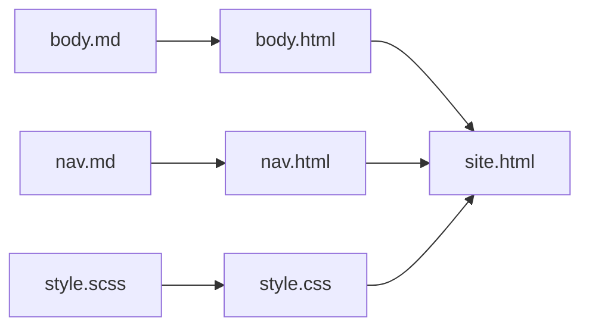

# Chapter 40 · Exercises

## The chapter in brief

- A shell script is a program: a shebang line says which interpreter runs it,
  `chmod +x` makes it executable, and `./name.sh` is how you invoke it
  ([40.1](01-bash.md)).
- **Quoting every expansion is the single habit that prevents most bash
  bugs**, because bash splits an expanded variable on whitespace before
  running anything.
- All shell control flow is built on **exit status**: `0` is success, and
  `&&`, `||`, and `if` all branch on that number rather than on a boolean.
- `set -euo pipefail` at the top of a script turns three dangerous defaults
  off — but `set -e` is a seatbelt, not an airbag, and does not fire inside
  `if` conditions or `&&` chains.
- Redirection is applied left to right, which is why `> file 2>&1` and
  `2>&1 > file` do different things, and `|` connects one process's stdout
  straight to the next process's stdin.
- SSH gives you an encrypted channel **and** authentication in both
  directions: the server proves itself with a host key, and you prove yourself
  by signing a fresh challenge with a private key that never leaves your
  machine ([40.2](02-ssh-remote.md)).
- The remote workflow is five commands — `ssh-keygen`, `ssh-copy-id`,
  `~/.ssh/config`, `ssh-agent`, `rsync` — plus `tmux`, so a dropped connection
  cannot kill a long job.
- Unix permission bits are binary in groups of three, which is why `600` is
  `rw-------` and why SSH refuses a private key that is `644`.
- A build is a **directed acyclic graph**, and `make` needs only two ideas: a
  topological order, and "rebuild if the target is missing or older than a
  prerequisite" ([40.3](03-make.md)).
- Because a Makefile encodes constraints rather than an order, `make -j` can
  build independent targets at once — and will expose any prerequisite you
  forgot to declare.
- A test framework adds six things to a bare `assert`: discovery, isolation,
  fixtures, reporting, parameterization, and diagnostics
  ([40.4](04-junit.md)).
- JUnit builds a fresh instance of the test class for every method for one
  reason — **shared mutable state is what makes tests flaky**, and no
  framework can save a suite that has it.

### Key terms

| Term | One-clause reminder |
|---|---|
| Shebang (`#!`) | the first line, telling the OS which interpreter runs the file |
| [Word splitting](../concept-index.md#q) | bash splits an unquoted expansion on whitespace, changing the argument list |
| Exit status (`$?`) | `0` means success; every shell conditional reads this number |
| `set -euo pipefail` | stop on error, error on an unset variable, fail a pipeline on any stage |
| File descriptor | 0 stdin, 1 stdout, 2 stderr — the numbers redirection operates on |
| Host key | the server's own key pair, checked against `~/.ssh/known_hosts` |
| `authorized_keys` | the server-side file holding the **public** keys allowed in |
| `ssh-agent` | holds the decrypted private key in memory and signs on request |
| Port forwarding (`-L`) | a local port tunnelled to a service only the server can reach |
| Octal mode | three bits per digit — `7` is `rwx`, `6` is `rw-`, `4` is `r--` |
| Target, prerequisite, recipe | the three parts of a `make` rule |
| Staleness | a target is stale if it is missing or older than a prerequisite |
| Phony target | a `make` target that names a command rather than a file |
| Fixture | declared setup and teardown, run around each test |
| Test double | a stub, fake, or mock standing in for a real dependency |
| Flaky test | one whose verdict depends on order, timing, or leftover state |

Every command named above is tabulated in
[Appendix F](../appendix/F-toolchain-reference.md).

Now put it to work. Toolchain exercises are different from algorithm
exercises: the skill being practised is *reading* — reading a script and
spotting the quoting bug, reading a pipeline and predicting its output,
reading a dependency graph and predicting a rebuild, reading a test suite and
spotting the shared state.

Two of these ask you to **predict before you run**, which is the whole point:
if you can only find out by running it, you cannot debug it in a terminal on
a server at midnight. Every solution is runnable, so you can check yourself
immediately.

### Exercise 40.1 — Four bugs in eight lines ●

This script is meant to move every `.log` file in the current directory into
an archive folder. It contains four bugs. Find them all, then write the
corrected version.

```text
#!/bin/sh
# archive-logs.sh -- move old logs into an archive folder

DEST = $HOME/log archive
mkdir -p $DEST

for f in *.log
do
    echo Archiving $f
    mv $f $DEST/$f
done
```

??? success "Solution"

    The four bugs:

    1. **`DEST = ...` has spaces around the `=`.** Bash reads this as the
       command `DEST` with arguments `=` and `$HOME/log`. Assignment must be
       written `DEST=value` with no spaces.
    2. **The value contains a space and is unquoted**, so even with the `=`
       fixed, `DEST` would be set to `/home/kim/log` and `archive` would
       become a stray argument.
    3. **Every expansion is unquoted.** `mv $f $DEST/$f` on a file called
       `app 2024.log` passes *five* arguments to `mv` instead of two, and
       `mv` interprets the last one as a destination directory.
    4. **There is no guard for "no matching files".** If the directory
       contains no `.log` files, the glob does not expand and the loop runs
       once with the literal string `*.log`.

    A fifth, softer issue: `#!/bin/sh` promises POSIX shell but the script is
    written in bash, and there is no `set -euo pipefail`, so a failed `mkdir`
    would not stop the moves.

    ```text
    #!/usr/bin/env bash
    set -euo pipefail

    dest="$HOME/log archive"
    mkdir -p "$dest"

    shopt -s nullglob            # an unmatched glob expands to nothing
    for f in *.log; do
        echo "Archiving $f"
        mv -- "$f" "$dest/$f"    # -- stops mv treating a leading - as a flag
    done
    ```

    And here is the difference, measured with the same word-splitting rules
    bash uses:

    ```python
    import shlex

    dest = "/home/kim/log archive"      # a directory name containing a space
    f = "app 2024.log"                  # a filename containing a space

    print("BROKEN  mv $f $DEST/$f  ->", shlex.split(f"mv {f} {dest}/{f}"))
    print('FIXED   mv -- "$f" "$dest/$f"  ->',
          shlex.split(f'mv -- "{f}" "{dest}/{f}"'))
    print()
    print("broken: mv receives",
          len(shlex.split(f"mv {f} {dest}/{f}")) - 1, "arguments")
    print("fixed : mv receives",
          len(shlex.split(f'mv -- "{f}" "{dest}/{f}"')) - 1, "arguments")
    ```

    ```text
    BROKEN  mv $f $DEST/$f  -> ['mv', 'app', '2024.log', '/home/kim/log', 'archive/app', '2024.log']
    FIXED   mv -- "$f" "$dest/$f"  -> ['mv', '--', 'app 2024.log', '/home/kim/log archive/app 2024.log']

    broken: mv receives 5 arguments
    fixed : mv receives 3 arguments
    ```

    Five arguments where two were meant: `mv` would try to move four
    non-existent files into a directory called `2024.log`.

### Exercise 40.2 — Predict the pipeline ●

**Write the exact output down before running anything.** Include the leading
spaces.

```console
$ cat votes.txt
# ballot export 2024
1,ada
2,grace
3,ada
4,linus
5,ada
# spoiled ballots removed below
6,grace
7,ada
8,linus
9,grace
$ grep -v '^#' votes.txt | cut -d, -f2 | sort | uniq -c | sort -rn | head -2
```

??? success "Solution"

    Stage by stage: `grep -v '^#'` drops the two comment lines, leaving nine;
    `cut -d, -f2` keeps the name from each; `sort` puts equal names next to
    each other; `uniq -c` collapses each run into a count; `sort -rn` orders
    by that count, largest first; `head -2` keeps the top two.

    ```python
    VOTES = """\
    # ballot export 2024
    1,ada
    2,grace
    3,ada
    4,linus
    5,ada
    # spoiled ballots removed below
    6,grace
    7,ada
    8,linus
    9,grace
    """


    def pipeline(text):
        lines = text.splitlines()
        kept = [ln for ln in lines if not ln.startswith("#")]   # grep -v '^#'
        field = [ln.split(",")[1] for ln in kept]               # cut -d, -f2
        ordered = sorted(field)                                 # sort
        counts = []                                             # uniq -c
        for name in ordered:
            if counts and counts[-1][1] == name:
                counts[-1][0] += 1
            else:
                counts.append([1, name])
        counts.sort(key=lambda pair: pair[0], reverse=True)     # sort -rn
        return counts[:2]                                       # head -2


    for count, name in pipeline(VOTES):
        print(f"{count:>7} {name}")
    ```

    ```text
          4 ada
          3 grace
    ```

    Two traps to notice. Removing the `sort` stage would break `uniq -c`
    completely — it only collapses *adjacent* duplicates, so it would report
    `ada` four separate times with no error. And `sort -rn` sorts
    numerically; without `-n` it would sort the counts as text, where `10`
    comes before `4`.

### Exercise 40.3 — Permission modes, both directions ●●

Answer each without running code, then check with the block.

1. What does `chmod 640 report.csv` allow, and for whom?
2. Which numeric mode is `rwxr-x---`?
3. `ls -l ~/.ssh/id_ed25519` shows `-rw-r--r--` and `ssh` refuses to use it.
   Why, and what is the fix?

??? success "Solution"

    ```python
    FLAGS = "rwxrwxrwx"


    def to_symbolic(mode):
        return "".join(FLAGS[i] if mode & (1 << (8 - i)) else "-"
                       for i in range(9))


    def to_mode(symbolic):
        mode = 0
        for i, ch in enumerate(symbolic):
            if ch != "-":
                mode |= 1 << (8 - i)
        return mode


    print("(a) chmod 640 ->", to_symbolic(0o640))
    print("(b) rwxr-x--- ->", f"{to_mode('rwxr-x---'):03o}")
    print("(c) key is    ->", to_symbolic(0o644),
          "-> too open; fix with chmod 600")
    print("    after fix ->", to_symbolic(0o600))
    print()
    for who, shift in [("owner", 6), ("group", 3), ("others", 0)]:
        print(f"  {who:<7} bits of 0o640: {(0o640 >> shift) & 0b111:03b} "
              f"= {to_symbolic((0o640 >> shift) & 0b111)[6:]}")
    ```

    ```text
    (a) chmod 640 -> rw-r-----
    (b) rwxr-x--- -> 750
    (c) key is    -> rw-r--r-- -> too open; fix with chmod 600
        after fix -> rw-------

      owner   bits of 0o640: 110 = rw-
      group   bits of 0o640: 100 = r--
      others  bits of 0o640: 000 = ---
    ```

    1. `640` is `rw-r-----`: the owner reads and writes, the group reads,
       everyone else is locked out entirely. Nobody can execute it.
    2. `rwxr-x---` is `750`.
    3. `rw-r--r--` is `644`, which lets **every other account on the machine
       read your private key**. SSH refuses rather than let that pass
       silently. `chmod 600 ~/.ssh/id_ed25519` fixes it. Note the shift
       trick in the last loop: `(mode >> 6) & 0b111` extracts the owner's
       three bits, exactly the masking from
       [Section 6.4](../ch06-loops/04-bitwise-enums.md).

### Exercise 40.4 — A Makefile for a stated graph ●●

A small documentation site is built like this:



- `body.html` and `nav.html` are produced from the matching `.md` file by
  `pandoc SOURCE -o TARGET`.
- `style.css` is produced from `style.scss` by `sass style.scss style.css`.
- `site.html` is `cat nav.html body.html > site.html`, and must also be
  rebuilt when the stylesheet changes.

Write the Makefile, with a pattern rule for the two Markdown files, a
`clean` target, and correct `.PHONY` declarations.

??? success "Solution"

    ```makefile
    .PHONY: all clean

    all: site.html

    site.html: nav.html body.html style.css
    	cat nav.html body.html > $@

    %.html: %.md
    	pandoc $< -o $@

    style.css: style.scss
    	sass $< $@

    clean:
    	rm -f body.html nav.html style.css site.html
    ```

    Three decisions worth defending. `style.css` is a prerequisite of
    `site.html` even though the recipe never mentions it — prerequisites
    declare *when to rebuild*, not only *what to read*. The pattern rule
    `%.html: %.md` covers both Markdown files with one recipe and would cover
    a third for free. And `all` comes first so that a bare `make` builds the
    site.

    Here is the mini-make from
    [Section 40.3](03-make.md) running this exact graph:

    ```python
    RULES = {
        "site.html": (["body.html", "nav.html", "style.css"],
                      "cat nav.html body.html > site.html"),
        "body.html": (["body.md"], "pandoc body.md -o body.html"),
        "nav.html": (["nav.md"], "pandoc nav.md -o nav.html"),
        "style.css": (["style.scss"], "sass style.scss style.css"),
    }
    mtimes = {"body.md": 1, "nav.md": 2, "style.scss": 3}
    clock = 100


    def prereqs(target):
        return RULES[target][0] if target in RULES else []


    def order(goal):
        out, seen = [], set()

        def visit(node):
            if node in seen:
                return
            seen.add(node)
            for p in prereqs(node):
                visit(p)
            out.append(node)

        visit(goal)
        return out


    def build(goal):
        global clock
        rebuilt = set()
        for t in order(goal):
            if t not in RULES:
                continue
            ps, cmd = RULES[t]
            if t not in mtimes or any(p in rebuilt or mtimes[p] > mtimes[t]
                                      for p in ps):
                print("  " + cmd)
                rebuilt.add(t)
                mtimes[t] = clock
                clock += 1
        if not rebuilt:
            print("  make: nothing to be done")
        return rebuilt


    print("build order:", " -> ".join(order("site.html")))
    print("$ make site.html")
    build("site.html")
    print("$ make site.html")
    build("site.html")
    ```

    ```text
    build order: body.md -> body.html -> nav.md -> nav.html -> style.scss -> style.css -> site.html
    $ make site.html
      pandoc body.md -o body.html
      pandoc nav.md -o nav.html
      sass style.scss style.css
      cat nav.html body.html > site.html
    $ make site.html
      make: nothing to be done
    ```

### Exercise 40.5 — Predict the rebuild ●●

The site from Exercise 40.4 has just been built successfully, so every file
exists and nothing is stale. **Write down, before running anything**, which
commands run for each of these — and in which order:

1. `touch nav.md; make site.html`
2. then `touch style.scss; make site.html`
3. and, as a bonus, `touch site.html; make site.html`

??? success "Solution"

    ```python
    RULES = {
        "site.html": (["body.html", "nav.html", "style.css"],
                      "cat nav.html body.html > site.html"),
        "body.html": (["body.md"], "pandoc body.md -o body.html"),
        "nav.html": (["nav.md"], "pandoc nav.md -o nav.html"),
        "style.css": (["style.scss"], "sass style.scss style.css"),
    }
    # the state AFTER a successful build: everything exists and is up to date
    mtimes = {"body.md": 1, "nav.md": 2, "style.scss": 3,
              "body.html": 10, "nav.html": 11, "style.css": 12, "site.html": 13}
    clock = 20


    def prereqs(target):
        return RULES[target][0] if target in RULES else []


    def order(goal):
        out, seen = [], set()

        def visit(node):
            if node in seen:
                return
            seen.add(node)
            for p in prereqs(node):
                visit(p)
            out.append(node)

        visit(goal)
        return out


    def build(goal):
        global clock
        rebuilt = set()
        for t in order(goal):
            if t not in RULES:
                continue
            ps, cmd = RULES[t]
            if t not in mtimes or any(p in rebuilt or mtimes[p] > mtimes[t]
                                      for p in ps):
                print("  " + cmd)
                rebuilt.add(t)
                mtimes[t] = clock
                clock += 1
        if not rebuilt:
            print("  make: nothing to be done for 'site.html'")
        return rebuilt


    def touch(name):
        global clock
        mtimes[name] = clock
        clock += 1
        print(f"$ touch {name}")


    print("$ make site.html          # already built")
    build("site.html")

    touch("nav.md")
    print("$ make site.html")
    print("  rebuilt:", sorted(build("site.html")))

    touch("style.scss")
    print("$ make site.html")
    print("  rebuilt:", sorted(build("site.html")))
    ```

    ```text
    $ make site.html          # already built
      make: nothing to be done for 'site.html'
    $ touch nav.md
    $ make site.html
      pandoc nav.md -o nav.html
      cat nav.html body.html > site.html
      rebuilt: ['nav.html', 'site.html']
    $ touch style.scss
    $ make site.html
      sass style.scss style.css
      cat nav.html body.html > site.html
      rebuilt: ['site.html', 'style.css']
    ```

    Touching `nav.md` costs two commands: `nav.html` becomes stale, and
    rebuilding it makes `site.html` stale in turn. `body.html` is never
    touched, because no path leads from `nav.md` to it. Touching
    `style.scss` costs two commands for the same reason — and note that
    `site.html` rebuilds even though its recipe never reads `style.css`,
    because you *declared* the dependency.

    The bonus: `touch site.html` causes **nothing** to rebuild. It makes the
    target newer than all its prerequisites, which is the definition of up to
    date. That is also the trick behind `make -t` ("touch"), which marks
    targets as current without building them — and the reason a corrupted
    output file can convince `make` that everything is fine.

### Exercise 40.6 — Find the flaky test ●●

This suite passes on one developer's machine and fails on the build server.
Which test is flaky, why, and what is the minimal fix?

```java
class IdGeneratorTest {

    private static final IdGenerator GENERATOR = new IdGenerator();

    @Test
    void firstIdIsOne() {
        assertEquals(1, GENERATOR.next());
    }

    @Test
    void idsIncrease() {
        long a = GENERATOR.next();
        long b = GENERATOR.next();
        assertTrue(b > a);
    }
}
```

??? success "Solution"

    `firstIdIsOne` is the flaky one. `GENERATOR` is `static`, so a single
    instance is shared by both tests, and its counter carries over. If
    `firstIdIsOne` happens to run first it sees `1` and passes; if
    `idsIncrease` runs first, the counter is already at 2 and `firstIdIsOne`
    sees `3`. JUnit makes no promise about the order, so which one you get
    depends on the JUnit version, the class file, and whether tests run in
    parallel — which is exactly why it works locally and fails on the server.

    The minimal fix is to stop sharing: make it an instance field and create
    it in `@BeforeEach`, so each test gets a fresh generator.

    ```java
    class IdGeneratorTest {

        private IdGenerator generator;          // instance field, not static

        @BeforeEach
        void freshGenerator() {
            generator = new IdGenerator();
        }

        @Test
        void firstIdIsOne() {
            assertEquals(1, generator.next());
        }

        @Test
        void idsIncrease() {
            long a = generator.next();
            long b = generator.next();
            assertTrue(b > a);
        }
    }
    ```

    Reproduced runnably — the same two tests, three runs, and the only
    variable is what they share:

    ```python
    class IdGenerator:
        def __init__(self):
            self.last = 0

        def next(self):
            self.last += 1
            return self.last


    def first_id_is_one(gen):
        got = gen.next()
        assert got == 1, f"expected 1 but was {got}"


    def ids_increase(gen):
        a, b = gen.next(), gen.next()
        assert b > a, f"expected {b} > {a}"


    def run_suite(label, tests, make_generator):
        print(label)
        for name, body in tests:
            try:
                body(make_generator())
                print(f"  PASS  {name}")
            except AssertionError as exc:
                print(f"  FAIL  {name}: {exc}")


    SHARED = IdGenerator()
    run_suite("shared generator, order A:",
              [("firstIdIsOne", first_id_is_one), ("idsIncrease", ids_increase)],
              lambda: SHARED)

    SHARED = IdGenerator()
    run_suite("shared generator, order B:",
              [("idsIncrease", ids_increase), ("firstIdIsOne", first_id_is_one)],
              lambda: SHARED)

    run_suite("fresh generator per test (the fix), order B:",
              [("idsIncrease", ids_increase), ("firstIdIsOne", first_id_is_one)],
              IdGenerator)
    ```

    ```text
    shared generator, order A:
      PASS  firstIdIsOne
      PASS  idsIncrease
    shared generator, order B:
      PASS  idsIncrease
      FAIL  firstIdIsOne: expected 1 but was 3
    fresh generator per test (the fix), order B:
      PASS  idsIncrease
      PASS  firstIdIsOne
    ```

    The third run is the point: with a fresh instance per test, the order
    stops mattering. Note the fix that would *not* work — asserting
    `assertTrue(generator.next() > 0)` to make the test pass in any order.
    That weakens the test to hide the problem instead of fixing it.

### Exercise 40.7 — Parameterized tests that find a missing guard ●●

Here is a grading function. Write parameterized tests for it, using the
micro-framework from [Section 40.4](04-junit.md). Cover **both sides of every
boundary** (89 and 90, 79 and 80, and so on), plus the ends of the range, plus
what should happen for a score outside 0–100.

```python
def grade(score):
    if score >= 90:
        return "A"
    if score >= 80:
        return "B"
    if score >= 70:
        return "C"
    if score >= 60:
        return "D"
    return "F"


for score in [95, 85, 60, 12]:
    print(f"grade({score:>3}) -> {grade(score)}")
```

```text
grade( 95) -> A
grade( 85) -> B
grade( 60) -> D
grade( 12) -> F
```

??? success "Solution"

    Boundary pairs are where off-by-one bugs live, so every threshold gets
    two cases. The out-of-range cases are the interesting ones: they fail,
    because the function has no validation at all.

    ```python
    class TestFailure(AssertionError):
        pass


    registry = []


    def assert_equals(expected, actual, hint=""):
        if expected != actual:
            raise TestFailure(f"expected: <{expected!r}> but was: <{actual!r}>"
                              + (f" -- {hint}" if hint else ""))


    def assert_raises(exc_type, func, *args):
        try:
            func(*args)
        except exc_type as exc:
            return exc
        except Exception as exc:
            raise TestFailure(f"expected {exc_type.__name__} but "
                              f"{type(exc).__name__} was raised: {exc}") from None
        raise TestFailure(f"expected {exc_type.__name__} to be raised, "
                          f"but nothing was")


    def parameterized(name, rows):
        def decorate(func):
            for row in rows:
                args = row if isinstance(row, tuple) else (row,)
                label = f"{name}[{', '.join(repr(a) for a in args)}]"
                registry.append((label, lambda f=func, a=args: f(*a)))
            return func
        return decorate


    def run_tests(title):
        passed = failed = errored = 0
        print(title)
        for name, func in registry:
            try:
                func()
            except TestFailure as exc:
                failed += 1
                print(f"  FAIL   {name}\n         {exc}")
            except Exception as exc:
                errored += 1
                print(f"  ERROR  {name}\n         {type(exc).__name__}: {exc}")
            else:
                passed += 1
                print(f"  PASS   {name}")
        print(f"Tests run: {passed + failed + errored}, "
              f"Failures: {failed}, Errors: {errored}")


    def grade(score):
        if score >= 90:
            return "A"
        if score >= 80:
            return "B"
        if score >= 70:
            return "C"
        if score >= 60:
            return "D"
        return "F"


    @parameterized("grade", [(100, "A"), (90, "A"), (89, "B"), (80, "B"),
                             (79, "C"), (70, "C"), (69, "D"), (60, "D"),
                             (59, "F"), (0, "F")])
    def test_grade_boundaries(score, expected):
        assert_equals(expected, grade(score))


    @parameterized("rejects out of range", [-1, 101, 1000])
    def test_grade_rejects(score):
        assert_raises(ValueError, grade, score)


    run_tests("GradeTest")

    # ---- the tests found a real gap: add the guard and run them again -----
    def checked_grade(score):
        if not 0 <= score <= 100:
            raise ValueError(f"score must be between 0 and 100, got {score}")
        return grade(score)


    registry.clear()


    @parameterized("grade", [(100, "A"), (90, "A"), (89, "B"), (60, "D"),
                             (0, "F")])
    def test_checked_boundaries(score, expected):
        assert_equals(expected, checked_grade(score))


    @parameterized("rejects out of range", [-1, 101, 1000])
    def test_checked_rejects(score):
        assert_raises(ValueError, checked_grade, score)


    print()
    run_tests("GradeTest (after adding the guard)")
    ```

    ```text
    GradeTest
      PASS   grade[100, 'A']
      PASS   grade[90, 'A']
      PASS   grade[89, 'B']
      PASS   grade[80, 'B']
      PASS   grade[79, 'C']
      PASS   grade[70, 'C']
      PASS   grade[69, 'D']
      PASS   grade[60, 'D']
      PASS   grade[59, 'F']
      PASS   grade[0, 'F']
      FAIL   rejects out of range[-1]
             expected ValueError to be raised, but nothing was
      FAIL   rejects out of range[101]
             expected ValueError to be raised, but nothing was
      FAIL   rejects out of range[1000]
             expected ValueError to be raised, but nothing was
    Tests run: 13, Failures: 3, Errors: 0

    GradeTest (after adding the guard)
      PASS   grade[100, 'A']
      PASS   grade[90, 'A']
      PASS   grade[89, 'B']
      PASS   grade[60, 'D']
      PASS   grade[0, 'F']
      PASS   rejects out of range[-1]
      PASS   rejects out of range[101]
      PASS   rejects out of range[1000]
    Tests run: 8, Failures: 0, Errors: 0
    ```

    The ten boundary cases all pass — the thresholds really are right — and
    the three range cases fail, because `grade(1000)` cheerfully returns
    `"A"` and `grade(-1)` returns `"F"`. That is the value of writing the
    test for behaviour you *expect* rather than behaviour you observe: the
    suite is not confirming the code, it is interrogating it. In JUnit the
    same two groups would be `@CsvSource({"100, A", "90, A", ...})` and
    `@ValueSource(ints = {-1, 101, 1000})` with `assertThrows`.

### Exercise 40.8 — Batch the graph for a parallel build ●●●

`make -j` can run independent targets at the same time. Extend the mini-make
so that instead of one flat topological order it produces **batches**: a list
of lists, where everything in batch $k$ depends only on things in earlier
batches and can therefore be built simultaneously.

Then, given a build time for each target, compute how long the build takes
serially (the sum of all durations) versus in parallel with unlimited workers
(the sum, over batches, of the *slowest* target in each batch).

Use the documentation-site graph from Exercise 40.4, with these durations:
`body.html` 3.0 s, `nav.html` 1.0 s, `style.css` 2.0 s, `site.html` 0.5 s.

??? success "Solution"

    The key insight is that a target's batch number is one more than the
    largest batch number among its prerequisites — the *longest path* from a
    source, not the shortest. Computing it is one pass over the topological
    order, because that order guarantees every prerequisite already has its
    depth when you need it.

    ```python
    from collections import defaultdict

    RULES = {
        "site.html": (["body.html", "nav.html", "style.css"],
                      "cat nav.html body.html > site.html"),
        "body.html": (["body.md"], "pandoc body.md -o body.html"),
        "nav.html": (["nav.md"], "pandoc nav.md -o nav.html"),
        "style.css": (["style.scss"], "sass style.scss style.css"),
    }
    DURATION = {"body.html": 3.0, "nav.html": 1.0,
                "style.css": 2.0, "site.html": 0.5}


    def prereqs(target):
        return RULES[target][0] if target in RULES else []


    def order(goal):
        out, seen = [], set()

        def visit(node):
            if node in seen:
                return
            seen.add(node)
            for p in prereqs(node):
                visit(p)
            out.append(node)

        visit(goal)
        return out


    def levels(goal):
        """Group targets so every member of a batch can be built at once."""
        depth = {}
        for target in order(goal):                  # prerequisites come first
            depth[target] = 1 + max((depth[p] for p in prereqs(target)),
                                    default=-1)
        batches = defaultdict(list)
        for target, d in depth.items():
            if target in RULES:                     # sources need no command
                batches[d].append(target)
        return [sorted(batches[d]) for d in sorted(batches) if batches[d]]


    serial = parallel = 0.0
    for i, batch in enumerate(levels("site.html")):
        times = [DURATION[t] for t in batch]
        serial += sum(times)
        parallel += max(times)
        print(f"  batch {i}: {batch}")
        print(f"           serial {sum(times):.1f}s   parallel {max(times):.1f}s")

    print(f"\nmake      : {serial:.1f}s")
    print(f"make -j4  : {parallel:.1f}s   ({serial / parallel:.2f}x faster)")
    ```

    ```text
      batch 0: ['body.html', 'nav.html', 'style.css']
               serial 6.0s   parallel 3.0s
      batch 1: ['site.html']
               serial 0.5s   parallel 0.5s

    make      : 6.5s
    make -j4  : 3.5s   (1.86x faster)
    ```

    Three things to take away. The speed-up is capped by the **critical
    path** — the longest chain through the graph, here `body.md -> body.html
    -> site.html` at 3.5 seconds — so no number of cores gets you below that;
    this is Amdahl's law wearing a build system's clothes. Batching by level
    is slightly pessimistic compared with real `make -j`, which starts a
    target the instant *its own* prerequisites are done rather than waiting
    for the whole batch, but it is the right mental model and it is safe.
    And note that the level assignment must use `max`, not `min`: a target
    whose prerequisites finish in batches 0 and 2 cannot start until batch 3.
