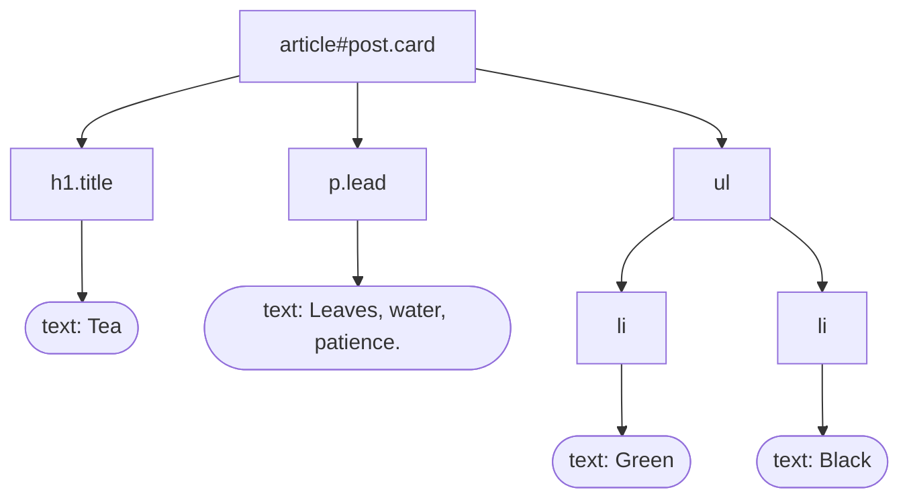

# 42.1 HTML and CSS

A web page is not a picture, a document format, or a program. It is a **plain
text file** — the kind you have been writing since Chapter 11 — that a browser
reads, parses into a tree of objects, and then paints. Everything that follows
in this chapter depends on taking that sentence literally, so this section
starts there: the text, the tree, and the two languages that describe them.
HTML says *what the content is*; CSS says *what it should look like*. Keeping
those two jobs separate is the single most useful habit in front-end work, and
it is the habit this section builds.

## A page is text; a browser makes it a tree

Here is a small document and the structure a browser builds from it. Read them
side by side — the indentation on the left is exactly the nesting on the right.

```html
<article id="post" class="card">
  <h1 class="title">Tea</h1>
  <p class="lead">Leaves, water, patience.</p>
  <ul>
    <li>Green</li>
    <li>Black</li>
  </ul>
</article>
```



That tree has a name: the **DOM**, the Document Object Model. Every angle
bracket you type becomes a **node**; nodes contain other nodes; the whole page
is one tree with a single root.

!!! note "The one sentence this whole chapter rests on"

    **A web page is a text document that the browser parses into a tree.**
    CSS styles that tree by selecting nodes out of it, and JavaScript
    (section 42.3) changes the page by editing that tree — never by editing
    the text file.

Once you see the tree behind the markup, "why is my `<div>` inside my `<p>`?"
and "why does this style leak into that box?" become questions with visible
answers.

## The document skeleton

A real page needs a small amount of ceremony around the content.

!!! tip "Save this file and open it in a browser"

    Copy the block below into a file called `page.html` on your own machine
    and **double-click it** — your browser will open it, and you can edit and
    reload as often as you like.

    **The Run button on this site cannot do that.** The Python sandbox in your
    browser tab has no way to render a document, so every HTML, CSS, and
    JavaScript block in this chapter is meant to be saved and opened locally.
    It is the only way to experience these examples.

```html
<!DOCTYPE html>
<html lang="en">
<head>
  <meta charset="utf-8">
  <meta name="viewport" content="width=device-width, initial-scale=1">
  <title>Teahouse — Brewing Notes</title>
  <link rel="stylesheet" href="style.css">
</head>
<body>
  <h1>Brewing notes</h1>
  <p>Everything below is content the reader can see.</p>
</body>
</html>
```

Six lines of ceremony, each earning its place:

| Line | Why it is there |
|---|---|
| `<!DOCTYPE html>` | Puts the browser in standards mode. Without it you get "quirks mode", a 1990s bug-compatibility layer, and your layout will be subtly wrong. |
| `<html lang="en">` | Tells screen readers which language to pronounce, and browsers which dictionary to spell-check against. |
| `<meta charset="utf-8">` | Says the bytes are UTF-8. Omit it and `café` may render as `café`. |
| `<meta name="viewport" ...>` | Stops phones from pretending to be a 980-pixel desktop and shrinking everything. Required for responsive design. |
| `<title>` | The tab label, the bookmark name, and the blue line in search results. |
| `<link rel="stylesheet">` | Loads the CSS file. More on the three ways to do this below. |

**`<head>` versus `<body>`** is the division that trips up beginners: the head
is *metadata about the page* and renders nothing; the body is *the page*. If
text is not showing up, the first thing to check is whether it landed in the
head.

## The elements you will actually use

Ninety percent of real HTML is a dozen elements. Here they are in one file —
**save it, open it in a browser, and change things.**

```html
<h1>Brewing notes</h1>
<h2>Water temperature</h2>
<h3>Green tea</h3>

<p>Paragraphs hold ordinary prose. Inside them you can mark text as
   <strong>important</strong> or <em>emphasised</em>, and drop in
   <code>inline code</code> or a <abbr title="degrees Celsius">&deg;C</abbr>
   abbreviation.</p>

<ul>
  <li>Unordered list — bullets, order does not matter</li>
  <li>Second item</li>
</ul>

<ol>
  <li>Ordered list — numbers, order is the point</li>
  <li>Boil the water</li>
</ol>

<p><a href="https://example.org/steeping">A link to another page</a>,
   an <a href="#water">in-page link to id="water"</a>, and a
   <a href="notes.html">link to a file beside this one</a>.</p>


<blockquote>
  <p>Tea is the drink of thoughtful people.</p>
</blockquote>

<hr>
<pre><code>preformatted text
    keeps   its    spacing</code></pre>
```

Three notes worth internalising now:

- **Headings are structure, not size.** Use `<h1>` once for the page's
  subject, then `<h2>` for its sections and `<h3>` for their subsections,
  without skipping levels. Make them smaller with CSS, not by picking `<h4>`
  because it looks right.
- **`alt` on an image is not optional.** It is the text a blind reader hears
  and the text everyone sees when the image fails to load. Write what the
  picture *conveys*, and use `alt=""` only for purely decorative images.
- **`<br>` is not a paragraph break.** It is a line break *inside* one
  paragraph — appropriate for poetry and postal addresses, and almost nothing
  else.

## Semantic elements, and why they matter

You can build any page out of `<div>` and `<span>`, the two elements that mean
nothing at all. You should not. HTML has elements that *say what a region is*,
and choosing them costs nothing and buys a great deal:

```html
<body>
  <header>
    <h1>Teahouse</h1>
    <nav aria-label="Main">
      <ul>
        <li><a href="/brewing">Brewing</a></li>
        <li><a href="/leaves">Leaves</a></li>
      </ul>
    </nav>
  </header>

  <main>
    <article>
      <h2>Water temperature</h2>
      <p>Green tea wants water below boiling.</p>
      <section>
        <h3>Why</h3>
        <p>Boiling water scalds the leaf and turns it bitter.</p>
      </section>
    </article>

    <aside>
      <h2>Related</h2>
      <p>See also: steeping times.</p>
    </aside>
  </main>

  <footer>
    <p>&copy; 2024 Teahouse</p>
  </footer>
</body>
```

The payoff is **accessibility**. A screen-reader user does not read a page top
to bottom any more than you do; they jump. Their software offers "list all
landmarks" and "list all headings", and those lists are built from exactly
these elements:

- `<nav>` becomes a **navigation landmark**;
- `<main>` becomes the **"skip to content" target**;
- headings become the **table of contents**.

A page of `<div>`s offers nothing to jump to, so the user must listen to the
entire navigation menu before reaching the article, on every single page.
Search engines and browser reader modes use the same signals.

**Semantics are a five-second choice that makes your page usable by people who
cannot see it.**

## Forms: how a page collects data

A form is the browser's built-in way to send user input to a server. Its
mechanics matter for section 42.2, so read the attributes carefully.

```html
<form action="/subscribe" method="post">
  <p>
    <label for="email">Email address</label>
    <input type="email" id="email" name="email" required
           placeholder="you@example.org">
  </p>

  <p>
    <label for="strength">Preferred strength</label>
    <select id="strength" name="strength">
      <option value="light">Light</option>
      <option value="medium" selected>Medium</option>
      <option value="strong">Strong</option>
    </select>
  </p>

  <fieldset>
    <legend>Send me</legend>
    <input type="radio" id="weekly" name="cadence" value="weekly" checked>
    <label for="weekly">Weekly notes</label>
    <input type="radio" id="monthly" name="cadence" value="monthly">
    <label for="monthly">Monthly notes</label>
  </fieldset>

  <p>
    <input type="checkbox" id="terms" name="terms" value="yes">
    <label for="terms">I have read the brewing guidelines</label>
  </p>

  <p>
    <label for="notes">Anything else?</label>
    <textarea id="notes" name="notes" rows="3"></textarea>
  </p>

  <button type="submit">Subscribe</button>
</form>
```

- **`name` is what gets sent**; `id` is what CSS and JavaScript grab. A control
  with no `name` is simply not submitted — a genuinely confusing bug.
- **`<label for="x">` must match `id="x"`.** Do this and clicking the label
  focuses the control, the touch target grows from 13 pixels to the whole line,
  and a screen reader announces "Email address, edit text" instead of "edit
  text". An unlabelled input is the most common accessibility failure on the
  web.
- **`method="post"` versus `method="get"`**: `get` puts the values in the URL
  (`/search?q=tea`) — shareable, bookmarkable, and visible in server logs;
  `post` puts them in the request body — right for anything that changes data
  or is private. Never send a password with `get`.
- **`type=` earns you a keyboard.** `email`, `tel`, `number`, `date`, `url`,
  and `search` all give phones the right on-screen keyboard and desktops free
  validation. `required` blocks submission of an empty field.

!!! warning "Client-side validation is a courtesy, not a defence"

    `required`, `type="email"`, and `pattern=` improve the experience for
    honest users, and stop nobody. Anyone can send a request without ever
    loading your form — you will do it yourself in
    [42.2](02-http-server.md). **Every rule must be enforced again on the
    server.**

## Tables — for tabular data

Tables were abused for page layout in the 1990s; that job now belongs to CSS.
Use a table when your data genuinely has rows and columns.

```html
<table>
  <caption>Steeping guide</caption>
  <thead>
    <tr><th scope="col">Tea</th><th scope="col">Water</th><th scope="col">Time</th></tr>
  </thead>
  <tbody>
    <tr><th scope="row">Green</th><td>80 &deg;C</td><td>2 min</td></tr>
    <tr><th scope="row">Oolong</th><td>90 &deg;C</td><td>3 min</td></tr>
    <tr><th scope="row">Black</th><td>95 &deg;C</td><td>4 min</td></tr>
  </tbody>
</table>
```

`<th>` marks a header cell and `scope` says whether it heads a column or a
row. That is what lets a screen reader announce "Oolong, Water, 90 degrees
Celsius" when the user lands on that cell, instead of a bare "90".

`<caption>` names the table for someone who cannot see its position on the
page.

## Attributes, ids, and classes

An **attribute** is a `name="value"` pair inside a start tag that configures the
element: `href`, `src`, `alt`, `type`, `disabled`. Two of them are special
because they exist purely as hooks for CSS and JavaScript.

| | `id` | `class` |
|---|---|---|
| How many per element | at most one | as many as you like, space-separated |
| How many per page | **unique** — one element only | reusable across any number of elements |
| CSS selector | `#post` | `.card` |
| Typical use | a link target, a form label's partner, one specific element | "all things styled like this" |

```html
<article id="post" class="card featured highlight">…</article>
```

That element has one id and three classes.

**Prefer classes.** Duplicate ids are invalid HTML, break `<label for>` and
in-page links, and make `document.getElementById` return whichever one it
finds first. Reserve ids for things that really are one-of-a-kind.

## The browser forgives, and that is a trap

HTML is not like Python: there is no syntax error, no traceback, no refusal to
run. Browsers implement a specified recovery algorithm for broken markup
because the web is full of it. Feed a browser this:

```html
<p>First paragraph
<p>Second <b>paragraph</i>
<ul>
  <li>item
</ul>
```

…and it will silently produce two paragraphs, a bold run, and a one-item list.
Nothing complains.

That is wonderful for reading the web and awful for writing it, because your
bug does not announce itself. It just moves your layout three pixels or nests
an element somewhere you did not intend, and you spend an hour in the
developer tools finding out. Two defences:

1. **Close every element you open**, and check the nesting.
2. **Run the page through a validator** (the W3C's is free) before wondering
   why CSS is not applying.

!!! tip "Open the developer tools now"

    ++f12++ (or ++cmd+alt+i++ on macOS) opens your browser's developer tools.
    The **Elements** panel shows the DOM tree the browser actually built —
    not your file, the *tree* — with the CSS rules that matched each node and
    which ones were overridden. It is the single most useful debugging tool in
    web development, and it is already installed.

## CSS: three ways to attach styles

CSS is a list of **rules**. Each rule is a **selector** (which elements) and a
**declaration block** (what to change), where each declaration is
`property: value;`.

```css
/* selector      declaration block                      */
p.lead        { font-size: 1.25rem; color: #334; }
```

There are three ways to get that rule to the browser, and they are not equal.

```html
<!-- 1. External stylesheet — PREFERRED -->
<link rel="stylesheet" href="style.css">

<!-- 2. Internal: a <style> block in the head — fine for a one-file demo -->
<style>
  p.lead { font-size: 1.25rem; }
</style>

<!-- 3. Inline: a style attribute — avoid -->
<p style="font-size: 1.25rem;">…</p>
```

**Prefer the external file.** One stylesheet serves every page, the browser
caches it, your markup stays readable, and every rule lives in one searchable
place.

Inline styles are the worst of the three: they cannot be reused, they cannot
be cached, they clutter the content, and — as the next section shows — they
win almost every specificity fight, which makes them impossible to override
later.

## Selectors and specificity

### The selector forms you will actually use

A handful of them covers nearly everything:

```css
p               { }   /* type: every <p>                                */
.card           { }   /* class: every element with class="… card …"     */
#post           { }   /* id: the one element with id="post"             */
*               { }   /* universal: everything                          */

article p       { }   /* descendant: a <p> anywhere inside an <article> */
article > p     { }   /* child: a <p> that is a DIRECT child            */
h2 + p          { }   /* adjacent sibling: the <p> right after an <h2>  */
h2 ~ p          { }   /* general sibling: any later <p> sibling         */

a[href^="https"]{ }   /* attribute: href starting with "https"          */
input[required] { }   /* attribute: has the attribute at all            */

a:hover         { }   /* pseudo-class: state                            */
li:first-child  { }   /* pseudo-class: position                         */
tr:nth-child(2n){ }   /* pseudo-class: every second row                 */
p::first-line   { }   /* pseudo-element: part of an element             */

h1, h2, h3      { }   /* selector list: applies to all three            */
```

### Specificity: who wins when two rules disagree

When two rules set the same property on the same element, the winner is
decided by **specificity**. Score every selector in three steps:

1. Count the **ids**.
2. Count the **classes**, plus attribute selectors and pseudo-classes.
3. Count the **element names**.

Then compare those three numbers left to right.

| Selector | ids | classes | elements | Specificity | Beats |
|---|---|---|---|---|---|
| `*` | 0 | 0 | 0 | `0,0,0` | nothing |
| `p` | 0 | 0 | 1 | `0,0,1` | `*` |
| `article p` | 0 | 0 | 2 | `0,0,2` | `p` |
| `.lead` | 0 | 1 | 0 | `0,1,0` | any number of elements |
| `p.lead` | 0 | 1 | 1 | `0,1,1` | `.lead` |
| `article p.lead:hover` | 0 | 2 | 2 | `0,2,2` | `p.lead` |
| `#post` | 1 | 0 | 0 | `1,0,0` | any number of classes |
| `#post .lead` | 1 | 1 | 0 | `1,1,0` | `#post` |
| a `style=""` attribute | — | — | — | higher than any selector | all of the above |
| `!important` | — | — | — | outside the system | everything |

The comparison is **left to right, and it does not carry**: one id beats
eleven classes, because `1,0,0` is compared against `0,11,0` on the first
number and stops there.

Only when all three numbers tie does the last rule in source order win — which
is why "just move it to the bottom of the file" sometimes works and sometimes
does not.

!!! tip "Why isn't my style applying? — a triage in order"

    Work down this list; it is almost always one of these.

    1. **Is the stylesheet loading at all?** Open the Network panel of the
       developer tools and look for a 404 on your `.css` file. A wrong path is
       the number-one cause.
    2. **Does the selector actually match?** Inspect the element and read the
       list of matched rules. If your rule is absent, the selector is wrong —
       a typo, a missing dot, `article > p` where the `<p>` is a grandchild.
    3. **Is it being overridden?** In the Elements panel an overridden
       declaration is shown ~~struck through~~. Hover it to see the winning
       rule; the fix is a more specific selector, not `!important`.
    4. **Is the property inherited or not?** `color` and `font-family` inherit
       from parent to child; `border`, `padding`, and `background` do not.
       Styling the parent will never draw a border on the child.
    5. **Is the value legal?** One invalid declaration is dropped silently, and
       so is everything after a missing semicolon in the same block.
    6. **Is the element even there?** Look at the DOM, not your file. An
       unclosed tag may have nested it somewhere unexpected.

    Reach for `!important` last, and expect to regret it: it wins today and
    makes tomorrow's override impossible, so teams end up with `!important`
    fighting `!important`.

## The box model

Every element the browser draws is a rectangle built from four nested layers.

```text
        ┌───────────────────────────────────────────┐
        │                 MARGIN                    │   space outside, transparent
        │   ┌───────────────────────────────────┐   │
        │   │             BORDER                │   │   the drawn edge
        │   │   ┌───────────────────────────┐   │   │
        │   │   │          PADDING          │   │   │   space inside, background shows
        │   │   │   ┌───────────────────┐   │   │   │
        │   │   │   │     CONTENT       │   │   │   │   text, image, child boxes
        │   │   │   │   width × height  │   │   │   │
        │   │   │   └───────────────────┘   │   │   │
        │   │   └───────────────────────────┘   │   │
        │   └───────────────────────────────────┘   │
        └───────────────────────────────────────────┘
```

### The historical wart, and the one-rule fix

By default, `width` sets the **content** width only, so padding and border are
added *outside* it:

```css
.card {
  width: 300px;
  padding: 20px;
  border: 2px solid #ccc;
}
/* Actual space taken: 300 + 20 + 20 + 2 + 2 = 344px.  Not 300. */
```

Two cards side by side in a 600-pixel container therefore overflow, and you
spend an afternoon subtracting numbers by hand. The fix is one rule that
essentially every real stylesheet begins with:

```css
*, *::before, *::after {
  box-sizing: border-box;
}
```

`border-box` means "`width` is the width of the whole box, border included" —
the padding and border eat inward instead of pushing outward. Now
`width: 300px` occupies exactly 300 pixels and two of them fit in 600.

**Put those three lines at the top of every stylesheet you write.**

!!! note "Margins collapse; padding never does"

    Two stacked elements with `margin-bottom: 20px` and `margin-top: 30px` end
    up **30px** apart, not 50 — adjacent vertical margins collapse to the
    larger of the two. This is deliberate (it keeps paragraph spacing even) and
    it surprises everyone once. Horizontal margins never collapse, and neither
    does padding.

## Flexbox

Before flexbox, centring a box vertically was a folk art. Flexbox lays a set of
children out along one axis and distributes the space. Set
`display: flex` on the **parent**; the properties then split into two groups —
those you set on the container and those you set on the children.

```css
.toolbar {
  display: flex;
  flex-direction: row;          /* row (default) | column | row-reverse     */
  justify-content: space-between;/* along the main axis:
                                    flex-start | center | flex-end |
                                    space-between | space-around | space-evenly */
  align-items: center;          /* across the other axis:
                                    stretch (default) | flex-start | center | flex-end */
  gap: 1rem;                    /* space between children — use this, not margins */
  flex-wrap: wrap;              /* let children move to a second line       */
}

.toolbar .spacer { flex: 1; }   /* on a CHILD: grow to absorb leftover space */
.toolbar .logo   { flex: 0 0 auto; }  /* never grow, never shrink            */
```

Those six properties handle the overwhelming majority of layout work:

| Want | Set |
|---|---|
| a navigation bar | `row` + `justify-content: space-between` |
| a centred hero | `align-items: center` + `justify-content: center` |
| a card stack | `column` + `gap` |
| a responsive tag list | `flex-wrap: wrap` |
| one child absorbing the slack | `flex: 1` on that child |

And the long-promised vertical centring is now genuinely two lines:

```css
.hero {
  display: flex;
  align-items: center;      /* vertical, when direction is row   */
  justify-content: center;  /* horizontal, when direction is row */
  min-height: 60vh;
}
```

### Grid, flexbox's two-dimensional sibling

Where flexbox arranges items along one axis, **CSS Grid** defines rows *and*
columns at once, which makes it the right tool for a page skeleton.
`display: grid; grid-template-columns: 200px 1fr;` gives you a sidebar and a
main area in two declarations, and `grid-template-areas` lets you draw the
layout as ASCII art in the stylesheet and then reshuffle it for small screens
without touching the HTML.

The working rule of thumb: **grid for the page, flexbox for the components
inside it** — and reach for grid the moment you find yourself nesting three
flex containers to make a shape.

## Responsive design

One page must work on a 360-pixel phone and a 2560-pixel monitor. Three tools
do it.

### 1. Relative units instead of pixels

`rem` is relative to the root font size, so a reader who has set a larger
default font gets a proportionally larger page — a real accessibility win that
`px` throws away. `%` and `fr` are relative to the container; `vw`/`vh` are
percentages of the viewport.

```css
body      { font-size: 1rem; line-height: 1.6; }
h1        { font-size: 2.5rem; }        /* scales with the reader's setting */
.container{ width: min(65rem, 100% - 2rem); margin-inline: auto; }
img       { max-width: 100%; height: auto; }   /* never overflow the parent */
```

### 2. Media queries

A media query applies a block of rules only when a condition holds:

```css
@media (min-width: 40rem)  { .grid { grid-template-columns: 1fr 1fr; } }
@media (min-width: 64rem)  { .grid { grid-template-columns: 1fr 1fr 1fr; } }
@media (prefers-reduced-motion: reduce) { * { animation: none !important; } }
@media print { nav, footer { display: none; } }
```

### 3. Mobile-first ordering

Write the small-screen layout as the base rules with *no* media query, then
add `min-width` queries that progressively enhance it for bigger screens.

The alternative — desktop styles first, then `max-width` queries undoing them
— means the least powerful device downloads and applies the most rules, and
every override is a subtraction: harder to reason about and easy to leave
inconsistent. **Base rules simple, then add.**

## A complete styled page

!!! tip "Save both files and open the first one"

    1. Save the HTML below as **`page.html`**.
    2. Save the CSS below it as **`style.css`**, in the **same folder** — that
       is what `<link rel="stylesheet" href="style.css">` is looking for.
    3. Double-click `page.html`.

    Then change a colour in `style.css`, reload, and watch it move. Reading
    this page is not the same as seeing it.

```html
<!DOCTYPE html>
<html lang="en">
<head>
  <meta charset="utf-8">
  <meta name="viewport" content="width=device-width, initial-scale=1">
  <title>Teahouse — Steeping Guide</title>
  <link rel="stylesheet" href="style.css">
</head>
<body>
  <header class="bar">
    <span class="logo">Teahouse</span>
    <nav aria-label="Main">
      <a href="#guide">Guide</a>
      <a href="#notes">Notes</a>
    </nav>
  </header>

  <main class="container">
    <h1 id="guide">Steeping guide</h1>

    <div class="cards">
      <article class="card">
        <h2>Green</h2>
        <p class="lead">80 &deg;C, two minutes.</p>
        <p>Cooler water keeps the leaf sweet.</p>
      </article>
      <article class="card featured">
        <h2>Oolong</h2>
        <p class="lead">90 &deg;C, three minutes.</p>
        <p>Rewards a second and third pour.</p>
      </article>
      <article class="card">
        <h2>Black</h2>
        <p class="lead">95 &deg;C, four minutes.</p>
        <p>The only one that wants near-boiling water.</p>
      </article>
    </div>
  </main>

  <footer class="bar" id="notes">
    <p>Times are a starting point, not a rule.</p>
  </footer>
</body>
</html>
```

```css
/* 1. Reset: predictable boxes everywhere. */
*, *::before, *::after { box-sizing: border-box; }
body { margin: 0; }

/* 2. Design tokens: change a colour once, not in twelve places. */
:root {
  --ink:    #22303c;
  --muted:  #5b6b7a;
  --accent: #0f766e;
  --paper:  #ffffff;
  --wash:   #f2f5f7;
  --radius: 10px;
}

/* 3. Base typography, in relative units. */
body {
  font-family: system-ui, -apple-system, "Segoe UI", sans-serif;
  color: var(--ink);
  background: var(--wash);
  line-height: 1.6;
}
h1, h2 { line-height: 1.2; }
.lead  { color: var(--accent); font-weight: 600; }

/* 4. Layout: one flex bar, one centred column. */
.bar {
  display: flex;
  justify-content: space-between;
  align-items: center;
  gap: 1rem;
  padding: 1rem 1.5rem;
  background: var(--paper);
  border-bottom: 1px solid #dde3e8;
}
.bar nav a { margin-left: 1rem; color: var(--muted); text-decoration: none; }
.bar nav a:hover,
.bar nav a:focus-visible { color: var(--accent); text-decoration: underline; }
.logo { font-weight: 700; letter-spacing: 0.02em; }

.container { width: min(60rem, 100% - 3rem); margin-inline: auto; padding: 2rem 0; }

/* 5. Components: mobile-first — one column by default. */
.cards { display: grid; gap: 1.25rem; grid-template-columns: 1fr; }

.card {
  background: var(--paper);
  border: 1px solid #dde3e8;
  border-radius: var(--radius);
  padding: 1.25rem;
}
.card h2 { margin-top: 0; }
.card.featured { border-color: var(--accent); box-shadow: 0 2px 10px rgb(15 118 110 / 0.12); }

/* 6. Enhance for wider screens. */
@media (min-width: 45rem) { .cards { grid-template-columns: repeat(3, 1fr); } }
```

Read the stylesheet in the order its comments number it, because that order is
a reusable structure for any stylesheet you write:

1. **The reset.** `box-sizing: border-box` on everything, so no width ever
   surprises you.
2. **Design tokens.** `--accent` is declared once on `:root` and read with
   `var(--accent)` everywhere, so restyling the site is a one-line edit.
3. **Base typography, set on `body`**, where `color`, `font-family`, and
   `line-height` inherit down to everything automatically.
4. **Layout.** `.bar` is a flex row pushing the logo and nav to opposite ends;
   `.container` uses `min()` so it is 60rem on a monitor and
   full-width-minus-a-gutter on a phone.
5. **Components, written for the narrow screen first** — `.cards` starts as a
   single-column grid.
6. **Exactly one media query**, which upgrades that single column to three
   when there is room.

Two details in there repay a second look. `.card.featured` has specificity
`0,2,0`, so it beats the plain `.card` rule regardless of source order. And
`:focus-visible` alongside `:hover` is what makes the navigation usable from a
keyboard.

## Runnable: build the DOM in Python

Enough looking. The browser's first job is to turn that text into a tree, and
Python's standard library has an HTML tokenizer we can drive to do the same
thing.

`html.parser.HTMLParser` calls a method of ours for each start tag, end tag,
and run of text. We keep a **stack of open elements** — exactly what a real
browser keeps — and every new element is appended to whatever is on top.

```python
from html.parser import HTMLParser

VOID = {"area", "base", "br", "col", "embed", "hr",
        "img", "input", "link", "meta", "source", "track", "wbr"}


class Node:
    """One element of the tree. Text belongs to the element containing it."""

    def __init__(self, tag, attrs=()):
        self.tag = tag
        self.attrs = dict(attrs)
        self.children = []
        self.parent = None
        self.text = ""

    @property
    def id(self):
        return self.attrs.get("id")

    @property
    def classes(self):
        return self.attrs.get("class", "").split()

    def __repr__(self):
        label = self.tag
        if self.id:
            label += "#" + self.id
        for c in self.classes:
            label += "." + c
        return "<" + label + ">"


class DOMBuilder(HTMLParser):
    def __init__(self):
        super().__init__(convert_charrefs=True)
        self.root = Node("#document")
        self.open = [self.root]              # stack of not-yet-closed elements

    def handle_starttag(self, tag, attrs):
        node = Node(tag, attrs)
        node.parent = self.open[-1]          # top of the stack is the parent
        self.open[-1].children.append(node)
        if tag not in VOID:
            self.open.append(node)           # void elements never get children

    def handle_endtag(self, tag):
        for i in range(len(self.open) - 1, 0, -1):
            if self.open[i].tag == tag:
                del self.open[i:]            # also closes anything left dangling
                return
        # a stray </tag> that was never opened: ignore it, exactly as a browser does

    def handle_data(self, data):
        squashed = " ".join(data.split())    # collapse whitespace, like a browser
        if squashed:
            self.open[-1].text += squashed


def parse(html):
    builder = DOMBuilder()
    builder.feed(html)
    builder.close()
    return builder.root


PAGE = """
<article id="post" class="card featured">
  <h1 class="title">Tea</h1>
  <p class="lead">Leaves, water, patience.</p>
  <p>Steep for <em class="hot">three minutes</em></p>
  <ul class="notes">
    <li>Green: 80 C</li>
    <li class="hot">Black: 95 C</li>
  </ul>
</article>
"""

document = parse(PAGE)


def show(node, depth=0):
    if node.tag != "#document":
        body = f'   "{node.text}"' if node.text else ""
        print("    " * (depth - 1) + repr(node) + body)
    for child in node.children:
        show(child, depth + 1)


def walk(node):
    """Every element in the tree, in document order."""
    for child in node.children:
        yield child
        yield from walk(child)


show(document)
print()
print("elements:", [e.tag for e in walk(document)])
```

```text
<article#post.card.featured>
    <h1.title>   "Tea"
    <p.lead>   "Leaves, water, patience."
    <p>   "Steep for"
        <em.hot>   "three minutes"
    <ul.notes>
        <li>   "Green: 80 C"
        <li.hot>   "Black: 95 C"

elements: ['article', 'h1', 'p', 'p', 'em', 'ul', 'li', 'li']
```

That is the DOM: the same tree the mermaid diagram drew at the top of this
page, now a live Python object graph with parent pointers, children lists,
attributes, and text.

`walk` is a recursive generator
([Chapter 17](../ch17-recursion/index.md),
[39.3](../ch39-streams/03-pipelines.md)) yielding elements in **document
order** — the order they appear in the source, which is the order the browser
paints them and the order a screen reader reads them.

## Runnable: a mini CSS selector matcher

Now the other half. A CSS engine's core question is: *given this selector and
this node, does it match?* We support the four forms that carry most real
stylesheets — `tag`, `.class`, `#id`, and descendant combinations of them — and
we compute specificity while we are at it.

The algorithm is three steps:

1. **Split the selector on whitespace** into **compound selectors**, each
   parsed with a regular expression straight out of
   [section 41.2](../ch41-regex/02-groups-parsing.md).
2. **Match right to left**: check the node itself against the *last* piece,
   then walk up the parent chain looking for each earlier piece in turn.
3. **Score the specificity** — ids, classes, elements — and let the highest
   score win.

Step 2 is how real browser engines do it, and the reason is speed:
right-to-left rejects almost every node on the very first test, where
left-to-right would have to explore the whole subtree.

```python
# continues
import re

COMPOUND = re.compile(r"""
    ^(?P<tag>[a-zA-Z][\w-]*|\*)?      # optional tag name, or * for "any"
     (?P<hooks>(?:[.#][\w-]+)*)$      # any number of .class and #id parts
""", re.VERBOSE)


def parse_compound(piece):
    """'p.lead#x' -> {'tag': 'p', 'id': 'x', 'classes': ['lead']}"""
    m = COMPOUND.match(piece)
    if m is None:
        raise ValueError(f"cannot parse selector piece {piece!r}")
    tag, hooks = m.group("tag"), m.group("hooks")
    ids = re.findall(r"#([\w-]+)", hooks)
    return {"tag": None if tag in (None, "*") else tag,
            "id": ids[0] if ids else None,
            "classes": re.findall(r"\.([\w-]+)", hooks)}


def parse_selector(selector):
    return [parse_compound(piece) for piece in selector.split()]


def matches_compound(node, comp):
    if comp["tag"] is not None and node.tag != comp["tag"]:
        return False
    if comp["id"] is not None and node.id != comp["id"]:
        return False
    return all(c in node.classes for c in comp["classes"])


def matches(node, parts):
    """Right-to-left: the last piece must match the node, each earlier
    piece must match some ancestor, in order."""
    if not matches_compound(node, parts[-1]):
        return False
    current = node.parent
    for comp in reversed(parts[:-1]):
        while current is not None and current.tag != "#document":
            if matches_compound(current, comp):
                current = current.parent
                break
            current = current.parent
        else:
            return False                     # ran out of ancestors: no match
    return True


def select(root, selector):
    parts = parse_selector(selector)
    return [n for n in walk(root) if matches(n, parts)]


def specificity(selector):
    """(ids, classes, elements) — compared left to right, no carrying."""
    parts = parse_selector(selector)
    return (sum(1 for p in parts if p["id"]),
            sum(len(p["classes"]) for p in parts),
            sum(1 for p in parts if p["tag"]))


SELECTORS = ["li", ".hot", "#post", "article li", "ul .hot",
             "article p em.hot", "#post .title", "p.lead", "h2"]

print(f"{'selector':<20}{'specificity':<14}would style")
for sel in SELECTORS:
    hits = [repr(h) for h in select(document, sel)]
    print(f"{sel:<20}{str(specificity(sel)):<14}{hits or 'nothing'}")

print()
print("a specificity fight over the same <li.hot>:")
for sel in ["li", ".hot", "ul li.hot", "#post li"]:
    print(f"   {sel:<12} -> {specificity(sel)}")
print("   winner:", max(["li", ".hot", "ul li.hot", "#post li"], key=specificity))
```

```text
selector            specificity   would style
li                  (0, 0, 1)     ['<li>', '<li.hot>']
.hot                (0, 1, 0)     ['<em.hot>', '<li.hot>']
#post               (1, 0, 0)     ['<article#post.card.featured>']
article li          (0, 0, 2)     ['<li>', '<li.hot>']
ul .hot             (0, 1, 1)     ['<li.hot>']
article p em.hot    (0, 1, 3)     ['<em.hot>']
#post .title        (1, 1, 0)     ['<h1.title>']
p.lead              (0, 1, 1)     ['<p.lead>']
h2                  (0, 0, 1)     nothing

a specificity fight over the same <li.hot>:
   li           -> (0, 0, 1)
   .hot         -> (0, 1, 0)
   ul li.hot    -> (0, 1, 2)
   #post li     -> (1, 0, 1)
   winner: #post li
```

Four things became concrete in that output:

- **`.hot` matches two elements of different tag names** — which is the entire
  point of classes.
- **`ul .hot` matches only the list item**, because the `<em>` has no `<ul>`
  ancestor. The descendant combinator means "somewhere above me", and the
  engine proved it by walking parent pointers.
- **`h2` matches nothing and Python did not complain** — exactly like CSS. A
  selector that matches no elements is not an error, which is why a typo in a
  selector produces silence rather than a message.
- **The fight at the bottom is decided on the very first number.** `#post li`
  at `(1,0,1)` beats `ul li.hot` at `(0,1,2)`, because one id outranks any
  pile of classes however long.

That is a real, if small, CSS engine: parse the selector, match right-to-left
up the tree, score the specificity, highest score wins. Browsers add hundreds
of selector forms, the cascade, inheritance, and heroic optimisation — but the
question they answer for every node and every rule is the one you just wrote.

## An accessibility checklist

Run through this before you call a page finished. None of it takes long, and
all of it is the difference between a page some people can use and a page
everyone can.

- [ ] `<html lang="…">` is set.
- [ ] Every image has an `alt` that says what it *conveys* (`alt=""` if purely
      decorative).
- [ ] Headings descend without skipping: one `<h1>`, then `<h2>`, then `<h3>`.
- [ ] Every form control has a `<label for="…">` pointing at its `id`.
- [ ] The page works with the keyboard alone: ++tab++ reaches every control in a
      sensible order, ++enter++ and ++space++ activate them.
- [ ] Focus is **visible** — never `outline: none` without a `:focus-visible`
      replacement.
- [ ] Text contrast is at least 4.5:1 against its background (3:1 for large
      text). Browser developer tools will measure it for you.
- [ ] Landmarks exist: `<header>`, `<nav>`, `<main>` (exactly one), `<footer>`.
- [ ] Buttons are `<button>` and links are `<a href>`. A clickable `<div>` is
      invisible to a screen reader and unreachable by keyboard.
- [ ] Colour is never the *only* signal — pair red text with an icon or a word.
- [ ] Tables use `<th scope>` and a `<caption>`.
- [ ] The page still makes sense with the stylesheet disabled.

!!! warning "Common mistakes"

    - **Styling with ids.** `#sidebar p { color: red; }` wins over every class
      rule you write later, and there is no polite way to undo it. Style with
      classes; save ids for anchors and labels.
    - **Forgetting `box-sizing: border-box`.** Your 300px card is 344px wide,
      three of them do not fit, and you start subtracting padding by hand.
      Set it once at the top of the stylesheet.
    - **Clickable `<div>`s.** A `<div onclick=…>` cannot be focused, cannot be
      activated by ++enter++, and is announced as nothing. Use `<button>`; if
      it navigates, use `<a href>`.
    - **Inputs without labels.** `placeholder` is not a label — it vanishes as
      soon as the user types, and screen readers may skip it entirely.
    - **Reaching for `!important` to win a fight.** It works once, then makes
      every future override impossible. Read the specificity in the developer
      tools and out-specify the rule properly.
    - **Assuming a broken tag will be reported.** HTML has no syntax errors.
      An unclosed `<div>` silently swallows the rest of your page.

## Check your understanding

??? success "1. Why does `#post .lead { color: red; }` beat `article p.lead.big { color: blue; }`?"

    Specificity is compared **left to right with no carrying**. The first
    selector scores `(1, 1, 0)`; the second scores `(0, 2, 2)`. The comparison
    stops at the first number: `1 > 0`, so the id wins and the text is red.
    Source order is irrelevant — it only breaks ties between equal scores.

??? success "2. A card is declared `width: 300px; padding: 24px; border: 1px solid`. How wide is it, and how do you make it 300?"

    By default `width` sizes the **content box** only, so the element occupies
    `300 + 24 + 24 + 1 + 1 = 350` pixels. Add
    `*, *::before, *::after { box-sizing: border-box; }` and `width: 300px`
    then means the whole box: padding and border eat inward and the element is
    exactly 300 pixels wide.

??? success "3. Why prefer `<nav>`, `<main>`, and `<article>` over `<div>`?"

    They are **landmarks**. Screen readers let a user jump directly to
    navigation, to the main content, or between headings, and that list is
    built from semantic elements. A page of `<div>`s offers nothing to jump to,
    so the user must listen through the menu on every page. Browser reader
    modes, search engines, and your future self reading the markup all benefit
    too — at zero cost, since they style identically to a `<div>`.

??? success "4. Both the `li` and the `em` carry `class=hot`. Why does `ul .hot` match only the list item?"

    A space is the **descendant combinator**: the last piece must match the
    node itself and each earlier piece must match some ancestor. Both elements
    have `class="hot"`, so both pass the last piece. Then the matcher walks up
    the parent chain looking for a `<ul>`: from `<li>` it finds `<ul>`
    immediately, but from `<em>` the ancestors are `<p>` and `<article>` and
    then the document root, with no `<ul>` anywhere — so the `<em>` fails.
    Matching right-to-left like this is what real browser engines do, because
    the first test rejects almost every node instantly.
