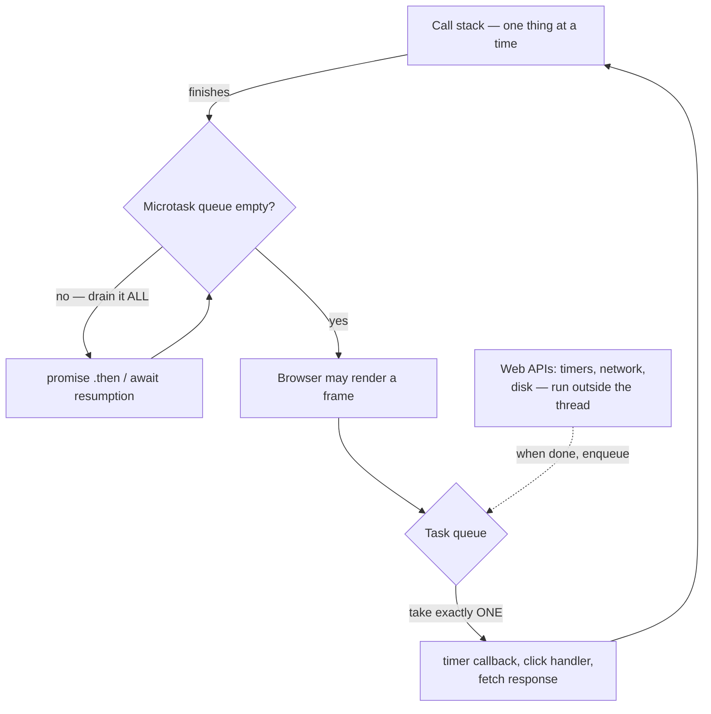

# 42.3 JavaScript in the browser

[42.1](01-html-css.md) gave the page structure and [42.2](02-http-server.md)
gave it a server. Both produce a document that, once painted, never changes.
The third language of the browser is what makes a page *behave*: JavaScript
runs inside the tab, holds a live reference to the DOM tree, and rewrites it in
response to what the user does. This section teaches it as a second language
for someone who already thinks in Python — the differences that will bite you,
the DOM and event APIs, and then the part that trips up every newcomer
regardless of background: **asynchrony**, which exists because a browser tab
runs your code on exactly one thread and cannot afford to let you block it.

## Three languages, three jobs

| Language | Job | Lives in |
|---|---|---|
| HTML | what the content **is** | `.html` files, parsed into the DOM |
| CSS | what it **looks like** | `.css` files, matched against the DOM |
| JavaScript | what it **does** | `.js` files, executed with the DOM in hand |

Load a script with `<script src="app.js" defer></script>` in the `<head>`.

`defer` tells the browser "download this now, run it after the HTML is
parsed", which is what you want: **a script that runs before the document
exists finds an empty tree and `null` everywhere.** (The old advice — put
`<script>` at the bottom of `<body>` — solves the same problem less tidily.)

## JavaScript for a Python programmer

The shapes are familiar; the details are not. Here are the differences that
actually cause bugs.

| Topic | Python | JavaScript |
|---|---|---|
| Declaring | `x = 1` | `let x = 1;` (reassignable), `const x = 1;` (not). Never `var`. |
| Equality | `==` compares values | `===` compares value **and type**; `==` converts first. Use `===`. |
| Empty container | `[]` and `{}` are **falsy** | `[]` and `{}` are **truthy** |
| Absence | `None` | `undefined` (never set) *and* `null` (deliberately empty) |
| Statement ends | newline | `;` — inserted automatically, but the rules surprise; write them |
| Interpolation | `f"hi {name}"` | `` `hi ${name}` `` — backticks, not quotes |
| Short functions | `lambda x: x * 2` | `x => x * 2` (and it may contain statements) |
| Mapping | `dict` — any hashable key | object literal — string keys only; use `Map` for the rest |
| Loop over values | `for v in seq:` | `for (const v of seq)` — `of`, not `in` |
| Loop over keys | `for k in d:` | `for (const k in obj)` — `in` gives **keys/indices** |
| Blocks | indentation | `{ }` braces |
| Comments | `#` | `//` and `/* */` |

Each of the sharp ones, shown running:

```javascript
// === versus ==   (the single most important line in this section)
console.log(1 === "1");    // false — different types
console.log(1 ==  "1");    // true  — "1" is converted to 1.  Never use ==
console.log(0 ==  "");     // true  — and this is why
console.log(null == undefined);   // true, but null === undefined is false

// Truthiness is NOT Python's
if ([])  console.log("an empty array is truthy!");   // this runs
if ({})  console.log("an empty object is truthy!");  // this runs too
console.log([].length === 0);      // the check you actually wanted
// falsy values, exhaustively: false, 0, -0, 0n, "", null, undefined, NaN

// undefined versus null
let notSet;                      // declared, never assigned
const emptied = null;            // deliberately nothing
console.log(notSet, emptied);    // undefined null
console.log(typeof notSet, typeof emptied);   // "undefined" "object"  (a famous bug)

// Template literals
const name = "Ada", cups = 3;
console.log(`${name} drank ${cups} cups (${cups * 250} ml)`);

// Arrow functions — the everyday form
const double = x => x * 2;
const add = (a, b) => a + b;
const describe = (n) => { const label = n > 2 ? "many" : "few"; return `${n}: ${label}`; };
console.log([1, 2, 3].map(double));        // [2, 4, 6]
console.log([1, 2, 3].filter(n => n > 1)); // [2, 3]
console.log([1, 2, 3].reduce(add, 0));     // 6

// Objects are not dicts
const tea = { name: "Oolong", celsius: 90 };
console.log(tea.name, tea["celsius"]);     // both work
tea.minutes = 3;                            // add a key by assignment
console.log(Object.keys(tea));              // ["name", "celsius", "minutes"]
console.log(tea.missing);                   // undefined — NOT a KeyError

// for...of gives values; for...in gives KEYS
const teas = ["green", "oolong", "black"];
for (const t of teas)  console.log(t);      // green, oolong, black
for (const i in teas)  console.log(i);      // "0", "1", "2"  — strings!
for (const [k, v] of Object.entries(tea)) console.log(k, "=", v);
```

`.map`, `.filter`, and `.reduce` are the same higher-order functions
[Chapter 39](../ch39-streams/02-map-filter-reduce.md) built in Python and
Java. JavaScript puts them directly on arrays, and they are used constantly.

!!! warning "Two JavaScript traps with no Python equivalent"

    **Reading a missing key gives `undefined`, not an error.** `tea.mispelled`
    is `undefined`, which is falsy, so your `if` silently takes the wrong
    branch and the bug surfaces three functions later. Use optional chaining
    (`config?.theme?.color`) and `??` for defaults (`name ?? "anonymous"`) to
    make the absence explicit.

    **`this` is not `self`.** In a regular `function`, `this` depends on *how
    the function was called*, not where it was defined — so a method passed as
    a callback loses it. Arrow functions do not have their own `this`, they
    inherit it from the surrounding scope, which is exactly why event handlers
    are almost always written as arrows.

## Talking to the DOM

Your script receives the tree from [42.1](01-html-css.md) as a live object
called `document`. Everything below is a method on it, and the selectors are
the CSS selectors you already know.

The listing covers five jobs in order: **finding** elements, **reading and
writing** their text, changing their **classes and attributes**, **creating and
inserting** new ones, and **reading form values**.

```javascript
// --- finding elements (CSS selectors, the same ones you wrote in 42.1)
const title  = document.querySelector("#post h1.title");  // first match, or null
const cards  = document.querySelectorAll(".card");        // all matches
console.log(cards.length);
cards.forEach(c => console.log(c.textContent));

// --- reading and writing text
title.textContent = "Steeping guide";     // text only — ALWAYS prefer this
title.innerHTML   = "<em>careful</em>";   // parses HTML — dangerous with user input

// --- classes and attributes: change the CLASS, let CSS do the styling
title.classList.add("highlight");
title.classList.remove("muted");
title.classList.toggle("open");            // add if absent, remove if present
console.log(title.classList.contains("highlight"));   // true
title.setAttribute("aria-live", "polite");
console.log(title.dataset.teaId);          // reads data-tea-id="..."

// --- creating and inserting elements
const li = document.createElement("li");
li.textContent = "Oolong — 90 C";          // safe: text is text
li.classList.add("note");
document.querySelector("ul.notes").append(li);
li.remove();                                // and take it away again

// --- reading form values
const form  = document.querySelector("form");
const email = document.querySelector("#email").value;   // .value, not .textContent
const agreed = document.querySelector("#terms").checked;
console.log(email, agreed);
```

!!! warning "`textContent` versus `innerHTML` — this is the XSS rule"

    `innerHTML` **parses its string as HTML**. Assign user-supplied text to it
    and the user chooses what elements appear on your page. Injected
    `<script>` tags are not executed by `innerHTML`, but this is:

    ```javascript
    // A "name" a user typed into your form:
    const name = '';

    box.innerHTML   = `Hello ${name}`;  // BROKEN: the image fails, onerror fires,
                                        // and the session cookie is posted to evil.example
    box.textContent = `Hello ${name}`;  // SAFE: shows the angle brackets as text
    ```

    That is **cross-site scripting**, and it is the most common serious web
    vulnerability there is. The rule is small:

    - **`textContent`** for text;
    - **`createElement` plus `append`** for structure;
    - **`innerHTML`** only for strings you built yourself.

    If you truly must render user HTML, run it through a maintained sanitiser —
    never a regex, for the reasons
    [41.2](../ch41-regex/02-groups-parsing.md) gave. And note the payload above
    reads `document.cookie`: a session cookie marked `HttpOnly`
    ([42.2](02-http-server.md)) would have been invisible to it. Defences
    stack.

## Events

Nothing in a JavaScript program "waits for a click". You **register a handler**
and return control to the browser — the same inversion of control introduced in
[Chapter 14.3](../ch14-beyond/03-guis-and-beyond.md).

```javascript
const button = document.querySelector("#add");

button.addEventListener("click", (event) => {
  console.log("type      :", event.type);          // "click"
  console.log("target    :", event.target);        // the element clicked
  console.log("current   :", event.currentTarget); // the element listening
  console.log("modifier  :", event.shiftKey);      // was Shift held?
});

// Common events: click, input, change, submit, keydown, focus, blur, scroll

form.addEventListener("submit", (event) => {
  event.preventDefault();     // stop the browser's default: navigating away
  console.log("handled here instead of reloading the page");
});

link.addEventListener("click", (e) => e.preventDefault());  // do not follow the href
```

### Bubbling, and event delegation

**Bubbling** is the rule that decides who hears an event. It fires on the
deepest element under the pointer, then on its parent, then *its* parent, all
the way to `document`. That is what makes this work:

```javascript
// One listener for a list that grows: "event delegation"
document.querySelector("ul.notes").addEventListener("click", (event) => {
  const item = event.target.closest("li");   // walk up to the <li> that was hit
  if (!item) return;                          // clicked the padding, not an item
  item.classList.toggle("done");
});
```

Instead of attaching a handler to every `<li>` — and remembering to attach one
to each new `<li>` you create — you attach a single handler to the parent and
use `event.target` to find out what was actually clicked.

`event.stopPropagation()` halts the climb. Use it sparingly, because a handler
that swallows events breaks other people's delegation.

## A complete page: HTML, CSS, and JavaScript together

!!! tip "Save this file and open it in a browser"

    Save the whole block below as **`todo.html`** and **double-click it**. It
    is deliberately one file, so it needs no server and no build step — type
    something into the box and watch the list respond.

    In a real project the CSS and the JavaScript would be separate files,
    exactly as in [42.1](01-html-css.md). Reading the code is not the same as
    clicking the buttons.

```html
<!DOCTYPE html>
<html lang="en">
<head>
  <meta charset="utf-8">
  <meta name="viewport" content="width=device-width, initial-scale=1">
  <title>Brewing list</title>
  <style>
    *, *::before, *::after { box-sizing: border-box; }
    body { font-family: system-ui, sans-serif; line-height: 1.6;
           max-width: 32rem; margin: 3rem auto; padding: 0 1rem; color: #22303c; }
    form { display: flex; gap: .5rem; }
    input, button { font: inherit; padding: .5rem .75rem; border-radius: 8px;
                    border: 1px solid #cbd5dd; }
    button { background: #0f766e; color: white; border-color: #0f766e; cursor: pointer; }
    ul { list-style: none; padding: 0; }
    li { display: flex; justify-content: space-between; align-items: center;
         gap: .5rem; padding: .5rem 0; border-bottom: 1px solid #e6ebef; }
    li.done span { text-decoration: line-through; color: #8b9aa7; }
    .remove { background: none; color: #b04a3f; border: none; cursor: pointer; }
    #count { color: #5b6b7a; }
  </style>
</head>
<body>
  <h1>Brewing list</h1>

  <form id="add-form">
    <label for="what" class="visually-hidden">Tea to brew</label>
    <input id="what" name="what" placeholder="Oolong, 90 C" required autocomplete="off">
    <button type="submit">Add</button>
  </form>

  <ul id="list" aria-live="polite"></ul>
  <p id="count">0 to brew</p>

  <script>
    const form  = document.querySelector("#add-form");
    const input = document.querySelector("#what");
    const list  = document.querySelector("#list");
    const count = document.querySelector("#count");

    const items = [];                       // the state: one array, one source of truth

    function render() {                     // state -> DOM, never the other way
      list.textContent = "";                // clear
      for (const item of items) {
        const li = document.createElement("li");
        li.className = item.done ? "done" : "";
        li.dataset.id = item.id;

        const span = document.createElement("span");
        span.textContent = item.text;       // SAFE: user text stays text

        const remove = document.createElement("button");
        remove.className = "remove";
        remove.type = "button";
        remove.textContent = "remove";
        remove.setAttribute("aria-label", `Remove ${item.text}`);

        li.append(span, remove);
        list.append(li);
      }
      const left = items.filter(i => !i.done).length;
      count.textContent = `${left} to brew`;
    }

    form.addEventListener("submit", (event) => {
      event.preventDefault();               // do not reload the page
      const text = input.value.trim();
      if (!text) return;
      items.push({ id: Date.now(), text, done: false });
      input.value = "";
      input.focus();
      render();
    });

    list.addEventListener("click", (event) => {      // one listener, delegated
      const li = event.target.closest("li");
      if (!li) return;
      const id = Number(li.dataset.id);
      if (event.target.classList.contains("remove")) {
        const at = items.findIndex(i => i.id === id);
        items.splice(at, 1);
      } else {
        const item = items.find(i => i.id === id);
        item.done = !item.done;
      }
      render();
    });

    render();
  </script>
</body>
</html>
```

The shape of that script is worth more than its features. It is three rules:

1. **State lives in one place** — the `items` array, and nowhere else.
2. **`render()` turns state into DOM**, rebuilding the list from scratch.
3. **Handlers change state and call `render()`** — they never poke at the DOM
   directly.

That one-way flow is the idea every framework on the last page of this section
automates, and it is why the code stays comprehensible as it grows.

The alternative — each handler surgically editing whichever elements it thinks
are affected — works for ten minutes and then produces the bug where the
counter disagrees with the list.

## The single thread, and why blocking is fatal

A browser tab runs your JavaScript on **one thread**, and that same thread also
does layout, painting, and event dispatch. So while your function is running,
nothing else in the tab can happen: no click is handled, no animation advances,
no scroll moves, nothing repaints.

Run this and the page is a brick for three seconds — the browser will
eventually offer to kill it:

```javascript
// DO NOT do this. The tab is frozen for the whole loop.
const end = Date.now() + 3000;
while (Date.now() < end) { /* burn the thread */ }
```

This is the same "long handler freezes the window" hazard flagged in
[Chapter 14.3](../ch14-beyond/03-guis-and-beyond.md), and its cause is the
scheduling reality of
[Chapter 23.1](../ch23-os/01-os-processes.md): your tab is one process with,
for your purposes, one runnable thread of JavaScript. The operating system will
happily switch to other processes; it cannot make your single thread be in two
places at once.

The escape is not threads — it is **not blocking in the first place**.

Anything slow (a network request, a timer, reading a file the user picked) is
handed to the browser, which does it elsewhere and puts a *callback* in a queue
when it is finished. Your function returns immediately, the thread goes back to
handling clicks, and your callback runs later.



Three rules govern that picture, and they explain every ordering puzzle you
will ever meet:

1. **Synchronous code runs to completion.** Nothing interrupts it.
2. **The microtask queue is drained completely** — including microtasks added
   while draining — before the next task is taken. Promise callbacks and the
   code after an `await` are microtasks.
3. **Exactly one task** (a timer callback, a click, a delivered network
   response) is taken per turn, and then the microtask queue is drained again.

## Callbacks, promises, `async`/`await`

The same operation, written three ways, twenty years apart — and each
generation exists to fix the previous one's error handling.

```javascript
// 1. Callbacks (1995–2014). Nesting is what "callback hell" means.
getUser(42, (err, user) => {
  if (err) return handle(err);
  getNotes(user.id, (err, notes) => {
    if (err) return handle(err);
    render(user, notes);              // three levels deep, two error paths
  });
});

// 2. Promises (2015). A promise is an object representing a future value:
//    pending -> fulfilled (with a value) or rejected (with an error).
getUser(42)
  .then(user => getNotes(user.id).then(notes => ({ user, notes })))
  .then(({ user, notes }) => render(user, notes))
  .catch(handle)                      // ONE error path for the whole chain
  .finally(() => spinner.hide());

// 3. async/await (2017). The same promises, written like ordinary code.
async function show(id) {
  try {
    const user  = await getUser(id);      // "pause here; resume when it resolves"
    const notes = await getNotes(user.id);
    render(user, notes);
  } catch (err) {
    handle(err);                          // try/catch works again
  } finally {
    spinner.hide();
  }
}
```

**`await` does not block the thread.** It returns from the function
immediately, registering the rest of the body as a microtask to run when the
promise settles — which is why the page stays responsive while a request is in
flight, and why `await` is only legal inside an `async` function.

When two operations do not depend on each other, awaiting them in sequence
wastes time; start both, then wait for both:

```javascript
const [user, teas] = await Promise.all([getUser(42), getTeas()]);   // concurrent
```

## `fetch`: calling the API from 42.2

`fetch` performs an HTTP request — exactly the request you parsed by hand in
[42.2](02-http-server.md) — and returns a promise. Here is a browser talking to
the `/api/notes` endpoint you built there.

```javascript
async function loadNotes() {
  const response = await fetch("/api/notes", {
    headers: { "Authorization": "Bearer demo-token" }
  });

  // IMPORTANT: fetch only rejects on a network failure. A 404 or a 500 is a
  // perfectly successful fetch with response.ok === false. Check it yourself.
  if (!response.ok) {
    throw new Error(`server said ${response.status} ${response.statusText}`);
  }
  const data = await response.json();      // parsing the body is async too
  return data.notes;
}

async function addNote(text) {
  const response = await fetch("/api/notes", {
    method: "POST",
    headers: { "Content-Type": "application/json",
               "Authorization": "Bearer demo-token" },
    body: JSON.stringify({ text })         // an object -> a JSON string
  });
  if (response.status === 400) {
    const problem = await response.json();
    throw new Error(problem.error);        // "field 'text' is required"
  }
  return response.json();                  // the 201 body: {id, text}
}

document.querySelector("#add-form").addEventListener("submit", async (event) => {
  event.preventDefault();
  const status = document.querySelector("#status");
  try {
    status.textContent = "saving…";
    const note = await addNote(document.querySelector("#what").value);
    status.textContent = `saved as #${note.id}`;
    render(await loadNotes());
  } catch (err) {
    status.textContent = `could not save: ${err.message}`;   // ALWAYS handle this
  }
});
```

The comment about `response.ok` is the mistake everyone makes once. **`fetch`
rejects only when the request could not be made at all** — no network, DNS
failure, blocked by CORS.

A `404` arrived successfully. It is your job to look at `response.status`, the
codes tabulated in [42.2](02-http-server.md).

## Modules, and where a build step comes from

Split code across files with the module system:

```javascript
// notes.js
export const MAX = 50;
export function summarise(notes) { return `${notes.length} notes`; }
export default class NoteList { /* … */ }

// app.js
import NoteList, { summarise, MAX } from "./notes.js";
```

```html
<script type="module" src="app.js"></script>
```

`type="module"` is required, and modules are deferred and run in strict mode
automatically. **This works with no tools at all — which is where to start.**

### Why a build step appears

A build step appears when the browser cannot run your source directly. Four
usual reasons:

1. **You import from npm packages.** A bare specifier like
   `import React from "react"` is not a URL, and the browser has nowhere to
   fetch it from.
2. **You write TypeScript or JSX**, which no browser understands.
3. **You want one small file** instead of two hundred small requests.
4. **You want minification, cache-busting file names, and transpilation** for
   older browsers.

A **bundler** — Vite is the common modern choice, with webpack, Rollup, and
esbuild also in wide use — reads your entry file, follows every import, and
emits a handful of optimised files. This is the same idea as the build tools in
any compiled language: a step that turns source into an artefact.

## Frameworks, honestly

- **React** (Meta, 2013). You write functions that return a description of the
  UI in JSX — HTML-like syntax inside JavaScript — and React works out the
  minimal DOM changes needed when state changes, using a virtual DOM. State
  lives in hooks (`useState`, `useEffect`). It is the largest ecosystem by a
  wide margin and the one most job listings name; it is also the one with the
  most concepts to learn before the first screen works, and effects in
  particular reward careful reading.
- **Vue** (Evan You, 2014). Single-file components put template, script, and
  scoped style in one `.vue` file, and reactivity is automatic: read a value in
  a template and Vue re-renders that template when it changes. It is markedly
  gentler to adopt — it can be dropped into an existing page from a `<script>`
  tag with no build step at all — while scaling to large applications with an
  official router and store.
- **Svelte** (Rich Harris, 2016). A **compiler** rather than a runtime library:
  your components are compiled at build time into direct DOM-updating
  JavaScript, so there is no virtual DOM and very little framework shipped to
  the browser. Components read like enhanced HTML, the bundles are small, and
  the ecosystem is the smallest of the three.

All three solve the same problem the todo page solved by hand: keeping the DOM
in agreement with state without hand-written update code.

And that is the argument for learning the hand-written version first. If you
understand `querySelector`, `addEventListener`, one-way data flow, and the
event loop, a framework is a labour-saving device you can evaluate. If you do
not, it is a box of incantations, and you will be stuck the first time it
behaves unusually.

**Write one real page in vanilla JavaScript before you pick a framework.**

## Runnable: model the event loop in Python

Now the promised runnable part. The event loop is not exotic machinery — it is
three pieces:

- a **priority queue of timers**, ordered by when they are due;
- a **plain queue of microtasks**;
- about fifteen lines of **scheduling policy** tying them together.

Written out in Python, it *predicts the exact output* of the JavaScript
ordering puzzle that every interview asks about. The puzzle is this, and the
answer is not the order the lines are written:

```javascript
console.log("script start");
setTimeout(() => console.log("setTimeout"), 0);
Promise.resolve()
  .then(() => console.log("promise1"))
  .then(() => console.log("promise2"));
console.log("script end");
```

```python
import heapq
from collections import deque


class EventLoop:
    """The browser's single thread: synchronous code runs to completion, then
    the microtask queue is drained, then ONE task runs, then microtasks are
    drained again, and so on."""

    def __init__(self):
        self.clock = 0            # milliseconds of pretend time
        self.timers = []          # min-heap of (due, insertion_order, label, fn)
        self.microtasks = deque()
        self.order = 0

    # --- the two ways to schedule work ----------------------------------
    def set_timeout(self, fn, delay, label):
        self.order += 1           # ties broken by registration order, as in a browser
        heapq.heappush(self.timers, (self.clock + delay, self.order, label, fn))

    def queue_microtask(self, fn, label):
        self.microtasks.append((label, fn))

    def busy(self, millis):
        """Synchronous work: the one thread is occupied for this long."""
        self.clock += millis

    # --- the loop itself -------------------------------------------------
    def drain_microtasks(self):
        while self.microtasks:                      # drains COMPLETELY, including
            label, fn = self.microtasks.popleft()   # microtasks added while draining
            print(f"[t={self.clock:>4}ms] microtask  {label}")
            fn()

    def run(self, script):
        print(f"[t={self.clock:>4}ms] script     top-level code starts")
        script()                                    # nothing can interrupt this
        self.drain_microtasks()
        while self.timers:
            due, _order, label, fn = heapq.heappop(self.timers)
            self.clock = max(self.clock, due)       # a timer is a floor, not a promise
            late = f"   (due at {due}ms, {self.clock - due}ms late)" if self.clock > due else ""
            print(f"[t={self.clock:>4}ms] task       {label}{late}")
            fn()
            self.drain_microtasks()                 # ... after EVERY single task
        print(f"[t={self.clock:>4}ms] idle       queues empty; the page is responsive")


loop = EventLoop()


def script():
    print("           log: script start")

    loop.set_timeout(lambda: print("           log: setTimeout"), 0, "setTimeout(..., 0)")

    def promise2():
        print("           log: promise2")

    def promise1():
        print("           log: promise1")
        loop.queue_microtask(promise2, "second .then")   # queued DURING the drain

    loop.queue_microtask(promise1, "first .then")
    print("           log: script end")


loop.run(script)
print()
print("log order:", ["script start", "script end", "promise1", "promise2", "setTimeout"])
```

```text
[t=   0ms] script     top-level code starts
           log: script start
           log: script end
[t=   0ms] microtask  first .then
           log: promise1
[t=   0ms] microtask  second .then
           log: promise2
[t=   0ms] task       setTimeout(..., 0)
           log: setTimeout
[t=   0ms] idle       queues empty; the page is responsive

log order: ['script start', 'script end', 'promise1', 'promise2', 'setTimeout']
```

That is the real answer, and now it is not a fact to memorise but a consequence
of three lines of code:

- **`script end` comes before `promise1`**, because synchronous code runs to
  completion first.
- **`promise1` and `promise2` come before `setTimeout`**, because
  `drain_microtasks` empties the whole microtask queue — including the `.then`
  chained *during* the drain — before the loop ever looks at a timer.
- **`setTimeout(..., 0)` does not mean "now".** It means "as a task, and no
  sooner than 0 ms from now", which puts it behind every pending microtask.

### What a slow handler does to that schedule

The other half of the story, measured:

```python
# continues
slow = EventLoop()


def script2():
    # a 10ms animation tick, and a click handler that does 500ms of work
    slow.set_timeout(lambda: print("           log: animation frame"), 10, "animation tick (10ms)")
    slow.set_timeout(lambda: slow.busy(500), 0, "expensive click handler")


slow.run(script2)

print()
print("=== and with the work moved off the main thread ===")
quick = EventLoop()


def script3():
    quick.set_timeout(lambda: print("           log: animation frame"), 10, "animation tick (10ms)")
    # the handler hands the work to the browser and returns at once; the result
    # arrives later as its own task, exactly like a fetch response
    quick.set_timeout(lambda: quick.set_timeout(
        lambda: print("           log: heavy result ready"), 500, "worker result"),
        0, "cheap click handler")


quick.run(script3)
```

```text
[t=   0ms] script     top-level code starts
[t=   0ms] task       expensive click handler
[t= 500ms] task       animation tick (10ms)   (due at 10ms, 490ms late)
           log: animation frame
[t= 500ms] idle       queues empty; the page is responsive

=== and with the work moved off the main thread ===
[t=   0ms] script     top-level code starts
[t=   0ms] task       cheap click handler
[t=  10ms] task       animation tick (10ms)
           log: animation frame
[t= 500ms] task       worker result
           log: heavy result ready
[t= 500ms] idle       queues empty; the page is responsive
```

The first run is the frozen page, measured: an animation frame due at 10 ms did
not run until 500 ms, because the loop could not take the next task while the
previous one was still on the stack. At 60 frames per second that is **29
dropped frames** from one handler.

The second run does the same total amount of work and the frame lands on time,
because the expensive part was handed off — in a browser, to a `Worker`, or to
the network, or split across several tasks — and its completion arrived as an
ordinary task.

Notice that the final result still appears at 500 ms. **Moving work off the
thread does not make it faster; it makes the interface stay alive while it
happens.**

!!! warning "Common mistakes"

    - **Using `==` instead of `===`.** `0 == ""` and `1 == "1"` are both true.
      There is no situation in which you want that; use `===` always.
    - **Assuming `[]` is falsy.** It is truthy in JavaScript. Test
      `arr.length === 0`.
    - **`innerHTML` with user text.** That is cross-site scripting. Use
      `textContent`, or build elements with `createElement`.
    - **Forgetting `event.preventDefault()` on a form submit.** The page
      reloads, your JavaScript state vanishes, and it looks like nothing
      happened.
    - **Not checking `response.ok` after `fetch`.** A `404` or `500` is a
      *successful* fetch; only a network-level failure rejects.
    - **Blocking the thread.** A long synchronous loop freezes clicks, scroll,
      animation, and paint — everything.
    - **Believing `setTimeout(fn, 0)` runs immediately.** It runs after the
      current code *and* after every pending microtask, and later still if the
      thread is busy.
    - **Running a script before the DOM exists.** `querySelector` returns
      `null` and you get "cannot read properties of null". Use `defer` or
      `type="module"`.

## Check your understanding

??? success "1. What does this print, and why?  `console.log('a'); setTimeout(() => console.log('b'), 0); Promise.resolve().then(() => console.log('c')); console.log('d');`"

    `a`, `d`, `c`, `b`. The synchronous statements run first and to completion
    (`a`, then `d`). Then the microtask queue is drained, which runs the
    promise callback (`c`). Only then does the loop take one task from the task
    queue, the `setTimeout` callback (`b`). A `setTimeout` of `0` is always
    behind every pending microtask.

??? success "2. Why is `element.textContent = userInput` safe when `element.innerHTML = userInput` is not?"

    `textContent` sets a **text node**: whatever the string contains, it is
    displayed as characters, so `` appears on screen as
    that literal text. `innerHTML` **parses the string as HTML**, so the same
    input becomes a real `` element whose `onerror` attribute the browser
    then executes — cross-site scripting. Use `textContent` for text and
    `createElement` for structure; reserve `innerHTML` for markup you wrote
    yourself.

??? success "3. A `<ul>` gains new `<li>` items over time. Why attach one listener to the `<ul>` instead of one per `<li>`?"

    Because events **bubble**: a click on an `<li>` fires on the `<li>`, then
    on the `<ul>`, then upward. A single listener on the parent therefore hears
    every child's clicks, and `event.target.closest("li")` identifies which one.
    This is **event delegation**. It also works for elements that did not exist
    when the listener was attached, which is exactly the case for a list you
    keep adding to — no re-binding, no leaked listeners.

??? success "4. `await` is often described as 'pausing'. What actually happens to the thread?"

    Nothing pauses. `await` makes the `async` function **return immediately**
    to its caller, registering the remainder of the function body as a
    microtask to be resumed when the awaited promise settles. The single thread
    goes straight back to the event loop and keeps handling clicks, scrolling,
    and painting. That is why `await` is only allowed inside an `async`
    function, and why an `await` in a tight synchronous loop is not the same as
    blocking — the blocking version (`while (Date.now() < end) {}`) really does
    freeze the tab, because it never returns to the loop.
