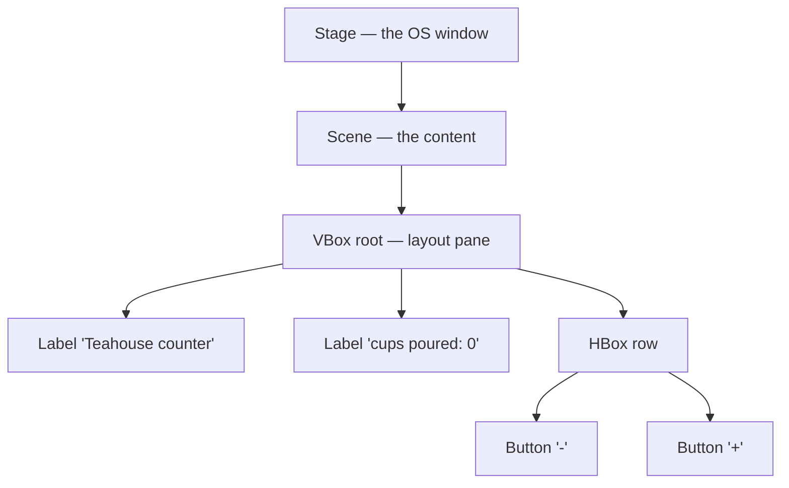

# 42.4 Desktop GUIs — JavaFX and tkinter

A web page is delivered; a desktop application is installed. That one
difference cascades into everything else — how it starts, what it can touch,
how it updates, who can use it — and it is why desktop toolkits still exist
after thirty years of the web. This section covers the concepts every GUI
toolkit shares, then teaches **JavaFX** properly, because it is the toolkit the
parallel Java course uses and the one whose ideas (a scene graph, layout panes,
observable properties, a strict UI thread) recur in every other toolkit you
will meet. Then, as always, we rebuild the engine in Python you can run: a
widget tree with a layout pass, hit testing, event bubbling, and a
dirty-tracking re-render.

## When a desktop app beats a web page

**Choose a desktop application when the program must reach the machine.** Read
and write arbitrary local files at speed, drive specialised hardware, use the
GPU heavily, run offline for hours, sit in the menu bar or system tray, or
respond with sub-frame latency. Video editors, IDEs, CAD tools, digital audio
workstations, and instrument-control software are desktop applications for
these reasons and not out of nostalgia.

**Choose a web application when reach and updating matter more.** No install,
one URL, every platform including phones, an update that ships to everyone the
moment you deploy, and a natural place to keep shared data. Most business
software is a web application because the alternative is shipping an installer
to ten thousand machines every fortnight.

**And be honest about the third option: a terminal program.** The kind you have
been writing all book is often the correct answer for a tool used by one person
or invoked by other programs. It is faster to build, trivially scriptable,
works over SSH, and does not need a designer. A great deal of software has been
made worse by a graphical interface nobody asked for.

## The concepts every toolkit shares

Five ideas transfer between JavaFX, tkinter, Qt, Swing, SwiftUI, Android, and
the browser. Learn them once.

### 1. The widget tree

A window contains panels, which contain controls. It is the same shape as the
DOM from [42.1](01-html-css.md) — a tree with one root, each node holding
children, drawn parent-first so children paint on top.

JavaFX calls it the **scene graph**; the browser calls it the DOM; tkinter just
calls them widgets. **Same tree.**



### 2. Layout managers, not coordinates

You *could* place every control at an absolute pixel position. Do not: the
window resizes, the user's font is bigger than yours, the translated German
label is 40% longer, and the layout falls apart.

Instead you declare *relationships* — "stack these vertically", "put this in
the centre", "share the extra space equally" — and a **layout manager**
computes the positions on every resize. This is exactly the flexbox bargain
from [42.1](01-html-css.md), and every toolkit makes it: JavaFX has `VBox`,
`HBox`, `GridPane`, `BorderPane`; tkinter has `pack`, `grid`, `place`; Qt has
box and grid layouts.

### 3. Event handlers

You register functions; the framework calls them. The inversion of control from
[Chapter 14.3](../ch14-beyond/03-guis-and-beyond.md), unchanged.

### 4. The UI thread rule

Every toolkit has exactly one thread allowed to touch widgets — the **JavaFX
Application Thread**, tkinter's main loop thread, Swing's Event Dispatch
Thread. Two consequences follow, and they are the source of most GUI bugs in
existence:

- **Never do slow work on it.** The loop cannot dispatch the next event while
  your handler is running, so a three-second database query means a
  three-second frozen window: no repaint, no button response, and on macOS a
  spinning cursor while the OS asks whether to force-quit. This is the same
  single-thread reality as the browser's event loop in
  [42.3](03-javascript.md), and its cause is the scheduling model of
  [Chapter 23.1](../ch23-os/01-os-processes.md) — the operating system is
  perfectly willing to run other threads, but your one UI thread cannot be in
  two places at once.
- **Never touch widgets from another thread.** Toolkit state is not
  thread-safe. Do the slow work on a background thread, then hand the *result*
  back to the UI thread with `Platform.runLater` (JavaFX), `widget.after`
  (tkinter), or `invokeLater` (Swing). Violating this produces the worst class
  of bug: intermittent, unreproducible, and dependent on timing.

### 5. Separate the state from the view

The pattern has several names — **MVC** (Model, View, Controller) and **MVVM**
(Model, View, ViewModel) are the common two — and one idea, in three parts:

- the **model** is the data and the rules, knowing nothing about buttons;
- the **view** displays it;
- a **thin layer in between** reacts to input and updates the model.

Keep them apart and you can test the model without a screen, redesign the
screen without touching the logic, and answer "why is this number wrong?" by
looking in one place. It is the same one-way flow the todo page in
[42.3](03-javascript.md) used, and the same
[encapsulation](../ch13-design/01-encapsulation.md) argument from Chapter 13.

## JavaFX: the skeleton

Every JavaFX program has the same three-object spine:

1. A **`Stage`** is an operating-system window.
2. A **`Scene`** is the content inside it, and holds the root of the scene
   graph.
3. The **root** is a layout pane containing controls.

```java
import javafx.application.Application;
import javafx.scene.Scene;
import javafx.scene.control.Label;
import javafx.scene.layout.StackPane;
import javafx.stage.Stage;

public class Hello extends Application {

    @Override
    public void start(Stage stage) {          // called on the JavaFX Application Thread
        Label label = new Label("Hello, teahouse");
        StackPane root = new StackPane(label); // a pane that centres its children
        Scene scene = new Scene(root, 320, 140);

        stage.setTitle("Hello");
        stage.setScene(scene);
        stage.show();                          // nothing is visible until this call
    }

    public static void main(String[] args) {
        launch(args);                          // starts the toolkit, then calls start()
    }
}
```

`launch` starts the JavaFX runtime, creates the Application Thread, and calls
your `start` method **on that thread**. After `start` returns, control belongs
to the toolkit — your code only runs again when an event arrives.

Two other lifecycle hooks exist: `init()` runs before the toolkit starts, off
the UI thread, which makes it the right place to load configuration; `stop()`
runs on shutdown, for saving state.

### Controls and layout panes

```java
// Controls — the things a user manipulates
Label     label   = new Label("Cups poured");
Button    button  = new Button("Add one");
TextField field   = new TextField("Oolong");
TextArea  notes   = new TextArea();
CheckBox  strong  = new CheckBox("Extra strong");
Slider    minutes = new Slider(1, 10, 3);          // min, max, initial
ComboBox<String> kind = new ComboBox<>();
kind.getItems().addAll("Green", "Oolong", "Black");
ListView<String> log = new ListView<>();
ProgressBar bar = new ProgressBar(0);
```

| Pane | Arranges children |
|---|---|
| `VBox` | in a single column, top to bottom |
| `HBox` | in a single row, left to right |
| `StackPane` | on top of one another, centred — the easy way to centre anything |
| `BorderPane` | five slots: top, bottom, left, right, centre — the classic app frame |
| `GridPane` | in rows and columns, with spans — the right pane for forms |
| `FlowPane` / `TilePane` | left to right, wrapping onto new lines |
| `AnchorPane` | pinned to the edges at fixed distances |

```java
VBox root = new VBox(10, label, field, button);   // 10px gap between children
root.setPadding(new Insets(16));
root.setAlignment(Pos.CENTER);

GridPane form = new GridPane();
form.setHgap(8);
form.setVgap(8);
form.add(new Label("Tea"),  0, 0);     // column 0, row 0
form.add(kind,              1, 0);
form.add(new Label("Minutes"), 0, 1);
form.add(minutes,           1, 1);

BorderPane frame = new BorderPane();
frame.setTop(new Label("Teahouse"));
frame.setCenter(form);
frame.setBottom(button);
```

`VBox.setVgrow(node, Priority.ALWAYS)` and `HBox.setHgrow(...)` say which child
absorbs extra space when the window grows — the equivalent of CSS `flex: 1`.

### Event handlers are lambdas

A JavaFX handler is an `EventHandler<ActionEvent>`, a **functional interface**:
one abstract method, so a lambda can implement it. This is exactly the
machinery of [section 39.1](../ch39-streams/01-lambdas.md), cashed in.

```java
button.setOnAction(event -> label.setText("Clicked!"));

// The pre-Java-8 spelling of the identical thing:
button.setOnAction(new EventHandler<ActionEvent>() {
    @Override public void handle(ActionEvent event) { label.setText("Clicked!"); }
});

// A method reference, when a method already does the job
button.setOnAction(this::handleAdd);

// Other useful handlers
field.setOnAction(e -> submit());                       // Enter pressed in the field
scene.setOnKeyPressed(e -> { if (e.getCode() == KeyCode.ESCAPE) stage.close(); });
node.setOnMouseClicked(e -> System.out.println(e.getX() + "," + e.getY()));
stage.setOnCloseRequest(e -> { if (unsaved) e.consume(); });   // veto the close
```

`e.consume()` stops the event travelling further. JavaFX events propagate along
the scene graph much as DOM events bubble in [42.3](03-javascript.md), and
`consume()` is that chapter's `stopPropagation()` under another name.

### Properties and binding — JavaFX's distinctive idea

This is what JavaFX has that Swing and tkinter do not. A **property** is an
observable value: something can watch it and react when it changes.

**Bind a control's property to a model property and the control updates
itself, for ever, with no handler code.**

```java
IntegerProperty cups = new SimpleIntegerProperty(0);

Label count = new Label();
count.textProperty().bind(cups.asString("cups poured: %d"));   // one-way

Button minus = new Button("-");
minus.disableProperty().bind(cups.lessThanOrEqualTo(0));       // greys itself out

// A computed binding: recalculates whenever any dependency changes
Label total = new Label();
total.textProperty().bind(Bindings.createStringBinding(
        () -> String.format("%.2f ml", cups.get() * 250.0), cups));

// Two-way: edit the field, the property changes; change the property, the field updates
TextField nameField = new TextField();
StringProperty teaName = new SimpleStringProperty("Oolong");
nameField.textProperty().bindBidirectional(teaName);

// A plain listener, when you need a side effect rather than a value
cups.addListener((obs, oldValue, newValue) -> System.out.println(oldValue + " -> " + newValue));

cups.set(cups.get() + 1);      // every bound control updates itself, right now
```

That is the MVVM idea made concrete: `cups` is the model, the labels are the
view, and the binding is the entire controller. A bound label cannot drift out
of sync with the model, because there is no code path that changes one without
the other.

Collections have observable versions too —
`FXCollections.observableArrayList()` backing a `ListView` means adding to the
list updates the list on screen.

!!! info "Java corner — bind versus set"

    A bound property is **read-only from your code**: calling
    `count.setText("x")` after `count.textProperty().bind(...)` throws
    `RuntimeException: A bound value cannot be set`. That is a feature — it
    catches the exact bug where two code paths fight over one label. Call
    `unbind()` first if you really mean to take manual control.

### FXML, Scene Builder, and CSS

Building an interface entirely in Java gets verbose. **FXML** is an XML dialect
that describes the scene graph declaratively, keeping layout out of your logic:

```xml
<?xml version="1.0" encoding="UTF-8"?>
<?import javafx.scene.control.*?>
<?import javafx.scene.layout.*?>

<VBox xmlns:fx="http://javafx.com/fxml" fx:controller="app.CounterController"
      spacing="10" alignment="CENTER">
    <Label fx:id="countLabel" text="cups poured: 0"/>
    <HBox spacing="10" alignment="CENTER">
        <Button text="-" onAction="#handleMinus"/>
        <Button text="+" onAction="#handlePlus"/>
    </HBox>
</VBox>
```

```java
public class CounterController {
    @FXML private Label countLabel;            // injected by name from fx:id
    private int cups = 0;

    @FXML private void handlePlus()  { cups++; countLabel.setText("cups poured: " + cups); }
    @FXML private void handleMinus() { if (cups > 0) cups--; countLabel.setText("cups poured: " + cups); }
}

// In start():
Parent root = FXMLLoader.load(getClass().getResource("/counter.fxml"));
```

**Scene Builder** (maintained by Gluon, free and separate from the JDK) is a
drag-and-drop editor that reads and writes exactly this FXML, so a designer can
lay out the window while you write the controller. The two halves meet at
`fx:id` and `onAction`.

Styling is CSS — a subset of the language from [42.1](01-html-css.md), with
JavaFX-specific properties that all begin `-fx-`:

```css
/* app.css — attached with scene.getStylesheets().add(...) */
.root        { -fx-font-family: "Inter"; -fx-background-color: #f2f5f7; }
.button      { -fx-background-color: #0f766e; -fx-text-fill: white;
               -fx-background-radius: 8; -fx-padding: 6 14 6 14; }
.button:hover{ -fx-background-color: #115e59; }
#countLabel  { -fx-font-size: 20px; -fx-text-fill: #22303c; }
.card        { -fx-border-color: #dde3e8; -fx-border-radius: 8; }
```

Selectors match the same way as in the browser:

| JavaFX | Browser equivalent |
|---|---|
| `.button` — a style class every `Button` carries by default | `.button` |
| `#countLabel` — matches `setId("countLabel")` | `#countLabel` |
| `node.getStyleClass().add("card")` | `classList.add("card")` |

The property *names* are JavaFX's own — `-fx-text-fill`, not `color` — because
they set scene-graph attributes rather than CSS ones.

### Background work without freezing the window

`Task<V>` is JavaFX's answer to the UI thread rule: it runs `call()` on a
background thread and delivers results back on the Application Thread.

```java
Task<String> brew = new Task<>() {
    @Override protected String call() throws Exception {   // BACKGROUND thread
        for (int i = 1; i <= 100; i++) {
            Thread.sleep(30);                 // pretend: a slow query or download
            updateProgress(i, 100);           // safe from the background thread
            updateMessage("steeping " + i + "%");
        }
        return "Tea is ready";                // becomes getValue()
    }
};

bar.progressProperty().bind(brew.progressProperty());   // progress bar follows along
status.textProperty().bind(brew.messageProperty());

brew.setOnSucceeded(e -> {                    // runs on the UI THREAD — safe
    status.textProperty().unbind();
    status.setText(brew.getValue());
});
brew.setOnFailed(e -> status.setText("failed: " + brew.getException().getMessage()));

new Thread(brew, "brew-task").start();        // or hand it to an ExecutorService

// When you have a raw background thread and just need one UI update:
Platform.runLater(() -> status.setText("done"));
```

`updateProgress`, `updateMessage`, and the `setOnSucceeded`/`setOnFailed`
callbacks are the only thread-safe bridges — everything else about a widget
must happen on the Application Thread.

## A complete JavaFX application

The same counter the Python model at the end of this page will implement, so
you can compare them line by line.

```java
package app;

import javafx.application.Application;
import javafx.beans.property.IntegerProperty;
import javafx.beans.property.SimpleIntegerProperty;
import javafx.geometry.Insets;
import javafx.geometry.Pos;
import javafx.scene.Scene;
import javafx.scene.control.Button;
import javafx.scene.control.Label;
import javafx.scene.layout.HBox;
import javafx.scene.layout.VBox;
import javafx.stage.Stage;

public class Counter extends Application {

    // 1. THE MODEL — observable state, knows nothing about buttons.
    private final IntegerProperty cups = new SimpleIntegerProperty(0);

    @Override
    public void start(Stage stage) {
        // 2. THE VIEW — controls, bound to the model.
        Label title = new Label("Teahouse counter");
        title.setId("title");

        Label count = new Label();
        count.textProperty().bind(cups.asString("cups poured: %d"));

        Button minus = new Button("-");
        Button plus  = new Button("+");
        minus.disableProperty().bind(cups.lessThanOrEqualTo(0));

        // 3. THE CONTROLLER — handlers change the model, never the view.
        minus.setOnAction(event -> cups.set(cups.get() - 1));
        plus.setOnAction(event -> cups.set(cups.get() + 1));

        // 4. LAYOUT — relationships, not coordinates.
        HBox buttons = new HBox(10, minus, plus);
        buttons.setAlignment(Pos.CENTER);

        VBox root = new VBox(12, title, count, buttons);
        root.setAlignment(Pos.CENTER);
        root.setPadding(new Insets(20));

        // 5. THE WINDOW.
        Scene scene = new Scene(root, 320, 180);
        scene.getStylesheets().add(getClass().getResource("/app.css").toExternalForm());

        stage.setTitle("Counter");
        stage.setScene(scene);
        stage.show();
    }

    public static void main(String[] args) {
        launch(args);
    }
}
```

Five numbered parts, and the numbering is the lesson:

1. **The model is one `IntegerProperty`** — the entire truth of the
   application, testable without a window.
2. **The view binds to it.** No code ever calls `count.setText(...)`, so the
   label physically cannot disagree with `cups`, and `minus` greys itself out
   at zero through a binding rather than an `if` duplicated in two handlers.
3. **The handlers are lambdas that modify only the model.**
4. **Layout is expressed as nesting and alignment**, so the window resizes and
   translates without breaking.
5. **The `Stage` is created for you** and handed to `start`; nothing appears
   until `show()`.

Compare that with the todo page in [42.3](03-javascript.md): state in one
place, view derived from state, handlers touching only state. Different
language, different century, **same architecture**.

### Building and running it, honestly

Since Java 11, **JavaFX is not part of the JDK**. You download the OpenJFX SDK
separately (from Gluon) and point the compiler and the runtime at it, or — far
more commonly in practice — let Maven or Gradle fetch it.

```console
# 1. Download the JavaFX SDK for your platform and unzip it, then:
$ export FX=/path/to/javafx-sdk-21/lib

$ javac --module-path $FX --add-modules javafx.controls,javafx.fxml \
        -d out src/app/Counter.java

$ java  --module-path $FX --add-modules javafx.controls,javafx.fxml \
        -cp out app.Counter

# 2. Or with Maven, which downloads the platform-specific artifacts for you:
$ mvn javafx:run          # using the org.openjfx:javafx-maven-plugin
```

If you forget `--module-path` you get the notoriously unhelpful
`Error: JavaFX runtime components are missing, and are required to run this
application`.

**That message means precisely one thing: the JavaFX modules are not on the
module path.** Every JavaFX tutorial that omits the flags is assuming an IDE
has added them for you.

## The same program in Python

`tkinter` ships with Python, so this needs no installation — but it needs a
real desktop, which the browser sandbox running this book's Python does not
have.

!!! tip "Save this file and run it on your own machine"

    Save the block below as **`counter.py`** and run `python counter.py` from a
    terminal. A small window appears with two buttons. There is no Run button
    for it here, and no way to see it without doing this, as
    [Chapter 14.3](../ch14-beyond/03-guis-and-beyond.md) first showed.

```text
# counter.py — run on your own machine, not with the Run button
import tkinter as tk

class Counter:
    def __init__(self, root):
        self.cups = tk.IntVar(value=0)          # tkinter's observable property

        tk.Label(root, text="Teahouse counter").pack(pady=(16, 4))

        # trace_add is the listener; textvariable is the closest thing to a binding
        self.label = tk.Label(root)
        self.label.pack()
        self.cups.trace_add("write", lambda *_: self.refresh())

        row = tk.Frame(root)                    # a Frame is tkinter's HBox
        self.minus = tk.Button(row, text="-", width=4, command=self.decrement)
        self.plus  = tk.Button(row, text="+", width=4, command=self.increment)
        self.minus.pack(side="left", padx=4)
        self.plus.pack(side="left", padx=4)
        row.pack(pady=12)

        self.refresh()

    def refresh(self):
        self.label.config(text=f"cups poured: {self.cups.get()}")
        self.minus.config(state="disabled" if self.cups.get() <= 0 else "normal")

    def increment(self):
        self.cups.set(self.cups.get() + 1)      # change the MODEL; refresh follows

    def decrement(self):
        self.cups.set(max(0, self.cups.get() - 1))

root = tk.Tk()
root.title("Counter")
root.geometry("320x180")
Counter(root)
root.mainloop()                                  # hand control to the event loop
```

Every JavaFX idea is present in a different accent:

| JavaFX | tkinter |
|---|---|
| `Stage` | `Tk()` |
| a layout pane (`HBox`, `VBox`) | `Frame` |
| the pane's own arrangement rules | `pack`, `grid`, `place` |
| `setOnAction(...)` | `command=...` |
| `IntegerProperty` + binding | `IntVar` + `trace_add` |
| `launch(args)` | `mainloop()` |
| `Platform.runLater(fn)` | `widget.after(0, fn)` |

Note `command=self.increment` with **no parentheses** — the classic first GUI
bug, flagged back in Chapter 14.3. tkinter's UI thread rule is identical to
JavaFX's.

Two other Python toolkits are worth knowing by name:

- **PyQt** (and the API-compatible **PySide**) wraps the Qt framework: far
  richer widgets, a designer tool, and genuinely native-looking applications —
  at the cost of a large dependency and a licence to read.
- **Kivy** targets touch and mobile with its own drawing stack, so the same
  code runs on Android and iOS.

For a small tool, tkinter's zero-install advantage is hard to beat.

## Runnable: a GUI engine, headless

A toolkit's job is three passes over a tree, plus a rule for when to do it all
again:

1. **Layout** — where does everything go?
2. **Render** — draw it.
3. **Dispatch** — whose handler does this click belong to?

All three are straightforward, and none of them needs a screen: we will draw to
a grid of characters and feed the dispatcher a scripted list of click
coordinates.

```python
from dataclasses import dataclass, field

SCREEN_W, SCREEN_H = 34, 9


@dataclass
class Widget:
    name: str
    kind: str                                  # "panel" | "label" | "button"
    text: str = ""
    children: list = field(default_factory=list)
    handlers: dict = field(default_factory=dict)
    direction: str = "column"                  # panels only: column or row
    border: bool = False
    pad: int = 0
    gap: int = 0
    parent: object = None
    x: int = 0                                 # filled in by the layout pass
    y: int = 0
    w: int = 0
    h: int = 0

    def add(self, *kids):
        for kid in kids:
            kid.parent = self                  # parent pointers make bubbling possible
            self.children.append(kid)
        return self

    def on(self, event, handler):
        self.handlers[event] = handler
        return self


# ---------------------------------------------------------- the layout pass

def natural(widget):
    """How big does this widget want to be, given its content?"""
    if widget.kind == "label":
        return len(widget.text), 1
    if widget.kind == "button":
        return len(widget.text) + 4, 1                     # rendered as "[ text ]"
    sizes = [natural(c) for c in widget.children] or [(0, 0)]
    if widget.direction == "row":
        w = sum(s[0] for s in sizes) + widget.gap * (len(sizes) - 1)
        h = max(s[1] for s in sizes)
    else:
        w = max(s[0] for s in sizes)
        h = sum(s[1] for s in sizes) + widget.gap * (len(sizes) - 1)
    return w + 2 * widget.pad, h + 2 * widget.pad


def layout(widget, x, y, w=None, h=None):
    """Give every widget an absolute rectangle. Parents place their children;
    children never choose their own position."""
    nw, nh = natural(widget)
    widget.x, widget.y = x, y
    widget.w = nw if w is None else w
    widget.h = nh if h is None else h
    if widget.kind != "panel":
        return
    cx, cy = x + widget.pad, y + widget.pad
    for child in widget.children:
        cw, ch = natural(child)
        if widget.direction == "row":
            layout(child, cx, cy, cw, ch)
            cx += cw + widget.gap
        else:
            layout(child, cx, cy, widget.w - 2 * widget.pad, ch)
            cy += ch + widget.gap


# ---------------------------------------------------------- the render pass

def render(root):
    grid = [[" "] * SCREEN_W for _ in range(SCREEN_H)]

    def put(x, y, text):
        for i, ch in enumerate(text):
            if 0 <= y < SCREEN_H and 0 <= x + i < SCREEN_W:
                grid[y][x + i] = ch

    def draw(widget):
        if widget.kind == "panel" and widget.border:
            put(widget.x, widget.y, "+" + "-" * (widget.w - 2) + "+")
            put(widget.x, widget.y + widget.h - 1, "+" + "-" * (widget.w - 2) + "+")
            for row in range(widget.y + 1, widget.y + widget.h - 1):
                put(widget.x, row, "|")
                put(widget.x + widget.w - 1, row, "|")
        elif widget.kind == "label":
            put(widget.x, widget.y, widget.text)
        elif widget.kind == "button":
            put(widget.x, widget.y, f"[ {widget.text} ]")
        for child in widget.children:           # parents paint first, children on top
            draw(child)

    draw(root)
    print("    " + "".join(str(i % 10) for i in range(SCREEN_W)))
    for r, row in enumerate(grid):
        print(f"{r:>3} " + "".join(row))


# ------------------------------------------------------- the event dispatcher

def hit_test(widget, px, py):
    """The deepest widget whose rectangle contains the point, or None."""
    if not (widget.x <= px < widget.x + widget.w
            and widget.y <= py < widget.y + widget.h):
        return None
    for child in reversed(widget.children):     # last drawn is on top
        found = hit_test(child, px, py)
        if found is not None:
            return found
    return widget


def dispatch(root, px, py):
    target = hit_test(root, px, py)
    if target is None:
        print(f"    click ({px},{py}) -> outside the window, ignored")
        return
    chain, node = [], target
    while node is not None:                     # the bubble path, target upward
        chain.append(node.name)
        node = node.parent
    print(f"    click ({px},{py}) -> hit {target.name}; bubbles {' -> '.join(chain)}")

    node = target
    while node is not None:
        handler = node.handlers.get("click")
        if handler is not None:
            outcome = handler(node)
            print(f"      handler on {node.name} ran")
            if outcome == "stop":
                print(f"      {node.name} stopped propagation")
                return
        node = node.parent


# ---------------------------------------------------------- observable state

class State:
    """The model. Setting a value updates every bound widget and marks it dirty."""

    def __init__(self, **values):
        self.values = dict(values)
        self.bindings = []                      # (key, widget, format function)
        self.dirty = set()

    def bind(self, key, widget, fmt):
        self.bindings.append((key, widget, fmt))
        widget.text = fmt(self.values[key])

    def set(self, key, value):
        if self.values[key] == value:
            return                              # unchanged -> nothing to repaint
        self.values[key] = value
        for k, widget, fmt in self.bindings:
            if k == key:
                widget.text = fmt(value)
                self.dirty.add(widget.name)


# ----------------------------------------------------------------- the app

title = Widget("title", "label", "Teahouse counter")
count = Widget("count", "label")
minus = Widget("minus", "button", "-")
plus = Widget("plus", "button", "+")
row = Widget("row", "panel", direction="row", gap=2).add(minus, plus)
window = Widget("window", "panel", border=True, pad=2, gap=1).add(title, count, row)

state = State(cups=0)
state.bind("cups", count, lambda n: f"cups poured: {n}")


def bump(delta):
    def handler(widget):
        state.set("cups", max(0, state.values["cups"] + delta))
        return "stop"                           # JavaFX's consume(), JS's stopPropagation()
    return handler


BACKGROUND_CLICKS = []
plus.on("click", bump(+1))
minus.on("click", bump(-1))
window.on("click", lambda w: BACKGROUND_CLICKS.append(state.values["cups"]))

layout(window, 0, 0, SCREEN_W, SCREEN_H)
render(window)

for px, py in [(11, 6), (11, 6), (4, 6), (25, 2)]:      # a scripted user
    print()
    dispatch(window, px, py)
    if state.dirty:
        print("      dirty:", sorted(state.dirty), "-> re-layout and repaint")
        state.dirty.clear()
        layout(window, 0, 0, SCREEN_W, SCREEN_H)
        render(window)
    else:
        print("      nothing dirty -> no repaint")

print()
print("clicks that reached the window itself:", BACKGROUND_CLICKS)
```

```text
    0123456789012345678901234567890123
  0 +--------------------------------+
  1 |                                |
  2 | Teahouse counter               |
  3 |                                |
  4 | cups poured: 0                 |
  5 |                                |
  6 | [ - ]  [ + ]                   |
  7 |                                |
  8 +--------------------------------+

    click (11,6) -> hit plus; bubbles plus -> row -> window
      handler on plus ran
      plus stopped propagation
      dirty: ['count'] -> re-layout and repaint
    0123456789012345678901234567890123
  0 +--------------------------------+
  1 |                                |
  2 | Teahouse counter               |
  3 |                                |
  4 | cups poured: 1                 |
  5 |                                |
  6 | [ - ]  [ + ]                   |
  7 |                                |
  8 +--------------------------------+

    click (11,6) -> hit plus; bubbles plus -> row -> window
      handler on plus ran
      plus stopped propagation
      dirty: ['count'] -> re-layout and repaint
    0123456789012345678901234567890123
  0 +--------------------------------+
  1 |                                |
  2 | Teahouse counter               |
  3 |                                |
  4 | cups poured: 2                 |
  5 |                                |
  6 | [ - ]  [ + ]                   |
  7 |                                |
  8 +--------------------------------+

    click (4,6) -> hit minus; bubbles minus -> row -> window
      handler on minus ran
      minus stopped propagation
      dirty: ['count'] -> re-layout and repaint
    0123456789012345678901234567890123
  0 +--------------------------------+
  1 |                                |
  2 | Teahouse counter               |
  3 |                                |
  4 | cups poured: 1                 |
  5 |                                |
  6 | [ - ]  [ + ]                   |
  7 |                                |
  8 +--------------------------------+

    click (25,2) -> hit title; bubbles title -> window
      handler on window ran
      nothing dirty -> no repaint

clicks that reached the window itself: [1]
```

Every mechanism in the JavaFX program above appears in that output.

- **Layout is computed, not stored.** No widget was given a coordinate; the
  parents placed the children, so the `[ - ]` and `[ + ]` buttons ended up at
  columns 2 and 9 because the row panel put them there with a gap of 2. Change
  the window width and everything moves — that is what a layout manager buys.
- **Hit testing walks the tree deepest-first.** The click at `(11,6)` is inside
  the window rectangle *and* the row rectangle *and* the plus button; the
  deepest match wins, which is why toolkits check children before parents and
  in reverse draw order.
- **Events bubble along parent pointers.** `plus -> row -> window` is printed
  before any handler runs, and it is the same climb the DOM makes in
  [42.3](03-javascript.md). `return "stop"` is `event.consume()` in JavaFX and
  `stopPropagation()` in the browser — which is exactly why the window handler
  recorded only the one click that reached it.
- **State drives the view.** No handler touched a label. `state.set` updated
  the bound widget's text and added it to `dirty`; the loop then re-laid-out
  and repainted only because something was dirty. That is the whole idea behind
  JavaFX bindings, React's virtual DOM, and Svelte's compiled updates: **the
  view is a function of the state, and a repaint happens when the state
  changes** — and when nothing changes, nothing repaints, which is the last
  click in the log.

## Web, desktop, or terminal?

| | Web application | Desktop application | Terminal program |
|---|---|---|---|
| Install | none — a URL | download, install, update | already there |
| Reach | every platform with a browser | one platform per build (or a cross-platform toolkit) | anywhere with a shell |
| Updating | deploy once, everyone has it | ship an installer, chase versions | copy a file |
| Local machine access | sandboxed and permission-gated | full, at the user's privilege | full |
| Offline | needs deliberate work | natural | natural |
| Latency | a network round trip for data | none | none |
| Startup | page load | process start | instant |
| Scripting / automation | an API, if you build one | limited | trivial — pipes and arguments |
| Accessibility | mature, standardised, free if you use semantic HTML | toolkit-dependent, needs care | screen readers handle text well |
| Typical use | anything shared or multi-user | media, engineering, hardware, IDEs | developer tools, batch jobs, servers |
| You have now built | the router in [42.2](02-http-server.md) | the layout and event engine above | every program in Parts I–III |

The honest summary is three sentences:

- Build a **terminal program** if the user is a programmer or another program.
- Build a **web application** if more than one person needs the same data.
- Build a **desktop application** when the machine itself is the point.

And notice how little of your knowledge is stranded by the choice. The widget
tree, the event handlers, the one-way flow from state to view, and the rule
about not blocking the UI thread are the same in all three.

!!! warning "Common mistakes"

    - **Slow work on the UI thread.** A network call or a big file read inside
      a handler freezes the window. Use `Task` and `Platform.runLater` in
      JavaFX, `widget.after` in tkinter — never a `Thread.sleep` in a handler.
    - **Touching widgets from a background thread.** It sometimes works, which
      is what makes it dangerous. Marshal every UI update back to the UI
      thread.
    - **Absolute positioning.** Hard-coded pixel coordinates break on resize,
      on a different font size, and in every other language. Use layout panes.
    - **Calling the handler instead of passing it.** `command=self.increment()`
      in tkinter runs it once at setup and registers `None`; JavaFX's
      `setOnAction(handleClick())` fails the same way. No parentheses.
    - **Setting a bound property.** In JavaFX, `label.setText(...)` after
      `label.textProperty().bind(...)` throws. Change the model, not the view.
    - **Forgetting the JavaFX module path.** "JavaFX runtime components are
      missing" always means `--module-path` and `--add-modules` are absent, not
      that your code is wrong.
    - **Business logic inside handlers.** Put it in the model, where it can be
      tested without a window; keep handlers to a line or two.

## Check your understanding

??? success "1. Why is `Thread.sleep(3000)` inside a JavaFX button handler a bug?"

    The handler runs on the JavaFX Application Thread — the single thread that
    also dispatches events and repaints the scene. While it sleeps, no other
    event is handled and nothing is drawn, so the window is frozen for three
    seconds and the operating system may mark it "not responding". Slow work
    belongs in a `Task` whose `call()` runs on a background thread, with the
    result delivered back through `setOnSucceeded` or `Platform.runLater`.

??? success "2. What does binding a label to `count.textProperty()` buy over calling `setText` in both handlers?"

    Correctness by construction. With a binding there is exactly one place the
    label's text can come from, so it cannot disagree with the model — add a
    third button tomorrow and it still cannot. With `setText` in each handler
    the truth is duplicated, and the first handler someone forgets to update is
    a bug that only shows in one code path. It also means the model is testable
    with no window at all, which is the point of MVC/MVVM.

??? success "3. In the runnable engine, why does `hit_test` check children before the widget itself, and in reverse order?"

    A click lands on the **topmost, innermost** thing under the pointer. The
    parent's rectangle contains all its children's rectangles, so if the parent
    answered first, no child would ever be hit — hence children first.
    Reverse order matters because later children are painted over earlier ones,
    so where two overlap, the later one is what the user actually sees and must
    be what receives the click. Real toolkits and browsers do exactly this.

??? success "4. What is the point of the `dirty` set, given the program could simply repaint after every click?"

    Repainting is the expensive part, and most events change nothing — the last
    click in the output hit a label with no handler and bubbled to the window,
    whose handler only appended to a log, so no *bound* state changed and no
    repaint happened. Tracking which widgets a state change affected lets the
    toolkit skip the work entirely when nothing changed, and repaint only the
    affected region when something did. This is the same economy behind JavaFX
    bindings, React's virtual-DOM diff, and Svelte's compiled updates: compute
    the minimum work implied by the state change, then do only that.
