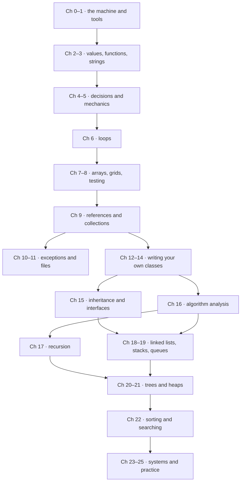

# Learning path

Twenty-six chapters look like a wall from the bottom. It isn't — it is a
sequence with a small number of genuine dependencies, and depending on where
you start from, you may be able to skip a good part of it. This page gives
you the prerequisite map, three ready-made routes through it, and a
five-question self-test to pick your entry point.

## The prerequisite map

Arrows mean "read this first". Anything not connected by a path is fair game
in any order.



## Path A — absolute beginner

You have never programmed. Perfect: [Chapter 0](ch00-machine/index.md)
assumes exactly that.

- Read **Chapters 0–14 in order** — this is a complete first-semester
  programming course. Then continue with **Chapters 15–22**, the second
  semester.
- **Pace: about one chapter per week.** That matches a university semester
  (Ch 0–14 in one, Ch 15–22 in the next). Faster is fine; skipping
  exercises is not — the exercises *are* the course.
- Cement each stage with a project:
  [Project 1](projects/01-number-tool/README.md) after Chapter 6,
  [Project 2](projects/02-text-adventure/README.md) after Chapter 13,
  [Project 3](projects/03-data-structures-library/README.md) after
  Chapter 21, and [Project 4](projects/04-sorting-visualizer/README.md)
  after Chapter 22.

## Path B — companion to a Java course

You are enrolled in a Java-based Programming I or II course and want this
handbook as your concept-first second textbook.

- **Read each chapter the same week your course covers the matching
  module.** The full module-to-chapter mapping tables are on the
  [Home page](index.md#course-mapping).
- Before a course week: skim the chapter here to meet the concepts in
  low-ceremony Python. After the lecture: do the chapter's exercises, then
  redo one or two of them in Java. The translation step is where the
  understanding sticks.
- Keep [Python and Java](python-vs-java.md) and the
  [cheat sheet](appendix/A-python-java.md) open while you work.

## Path C — "I know some Python; I want data structures"

You can already write loops, functions, and basic classes.

- **Skim Chapters [2](ch02-data/index.md)–[9](ch09-collections/index.md)** —
  read the *Common mistakes* boxes and attempt one ●●● exercise per chapter.
  If any of those exercises bites, slow down and read that chapter properly.
  Pay real attention to [Chapter 9](ch09-collections/index.md) (references
  and memory): it is the one "basics" chapter that data structures lean on
  hardest.
- **Start seriously at [Chapter 15](ch15-inheritance/index.md)** and work
  through Chapter 22 in order — Part III is a dependency chain, not a menu.
- **Then continue into [Part VI](part6-overview.md)** (Chapters 35–42), which
  picks up exactly where Chapter 22 stops.

## Path D — advanced data structures and the working toolchain

You have finished Part III (through [Chapter 22](ch22-sorting/index.md)) and
want the third-course material: the structures that stay fast under
adversarial input, plus the tools professionals use daily.

- **Go straight to [Part VI](part6-overview.md).** Parts IV and V are not
  prerequisites, which is why the chapter numbers jump from 22 to 35.
- **Read 35 → 38 in order** — [balanced trees](ch35-balanced-trees/index.md),
  [hashing, tries, skip lists](ch36-hashing-tries/index.md),
  [graphs](ch37-graphs/index.md), and
  [linear-time sorting](ch38-linear-sorting/index.md). Chapter 35 resolves
  the balance problem [Chapter 20](ch20-bst/index.md) left open, so start
  there.
- **Chapters [39](ch39-streams/index.md)–[42](ch42-web-gui/index.md) are a
  menu, not a chain** — streams, the toolchain, regex, and web/GUI can be
  read in any order as you need them.
- **Build [Project 9](projects/09-route-finder/README.md)** after Chapter 37
  and [Project 10](projects/10-fullstack-app/README.md) after Chapter 42.

## Path E — the AI-engineering track

You have finished Parts I–IV and want to understand how language models and
agents actually work, from the inside.

- **Go to [Part V](part5-overview.md)** (Chapters 26–34). Part VI is not a
  prerequisite.
- **Read [Chapter 26](ch26-llm-internals/index.md) first and slowly** — every
  later chapter leans on tokens, attention, and sampling. You need no machine
  learning background; the chapter assumes none.
- **Then 27 → 30** (serving, tools and MCP, retrieval and memory, agents) is
  the applied spine, and **31 → 33** (RL, data, evaluation) is the training
  and measurement spine. [Chapter 31](ch31-rl/index.md) is the hardest in the
  book — read its opening note before starting.
- **Build the projects as you go**: [Project 5](projects/05-mcp-server/README.md)
  after Chapter 28, [Project 6](projects/06-react-agent/README.md) after
  Chapter 30, [Project 7](projects/07-dpo-alignment/README.md) after
  Chapter 31, and [Project 8](projects/08-eval-harness/README.md) after
  Chapter 33.
- **[Chapter 34](ch34-ai-career/index.md)** turns all of it into a plan.

## Not sure? A five-question self-test

Answer honestly before peeking. Your score at the end picks your path.

**1.** What does `print(2 ** 3)` print?

??? success "Answer"

    `8` — `**` is Python's exponent operator. If you weren't sure, start at
    [Chapter 2](ch02-data/index.md) (or Chapter 0 for the full story).

**2.** Predict the output, then run to check:

```python
total = 0
for n in [2, 4, 6]:
    total += n
print(total)
```

??? success "Answer"

    `12` — the loop adds each element to `total`. If tracing this felt
    shaky, loops ([Chapter 6](ch06-loops/index.md)) need practice before
    anything in Part III will make sense.

**3.** When would you reach for a dictionary instead of a list?

??? success "Answer"

    When you look things up **by key** (a name, an ID) rather than by
    position, and you want that lookup to stay fast no matter how much data
    there is. Fuzzy on this? Visit [Chapter 7](ch07-arrays/index.md) and
    [Chapter 14](ch14-beyond/index.md).

**4.** Predict the output, then run to check:

```python
a = [1, 2]
b = a
c = list(a)
b.append(3)
print(a, c)
```

??? success "Answer"

    `[1, 2, 3] [1, 2]` — `b` is a second name for the *same* list, while
    `list(a)` made a copy. If that surprised you, read
    [Chapter 9](ch09-collections/index.md) before touching Part III;
    references are the ground data structures stand on.

**5.** What does $O(n \log n)$ describe, and can you name one sorting
algorithm that achieves it?

??? success "Answer"

    It describes how an algorithm's running time grows with input size —
    proportional to $n \log n$. Merge sort and heapsort achieve it. If this
    was new, begin Part III at [Chapter 16](ch16-complexity/index.md); if it
    was easy, you can start at [Chapter 18](ch18-linked-lists/index.md).

**Scoring.** 0–2 confident answers: take **Path A** from Chapter 0 (or
Chapter 2 if the machine basics bore you). 3–4: **Path C**, skimming
honestly. All 5: jump straight into Part III wherever the self-test pointed
you — and enjoy.
