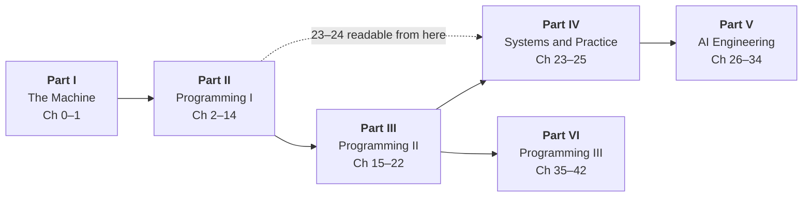

# Map of the book

This page is the whole handbook on one screen. It is written for two readers.
If you are **deciding where to start**, read the graph and the part table
below, then jump to the part overview that matches where you already are — or
to the [learning path](learning-path.md), which prescribes five complete routes
instead of describing the terrain. If you are **coming back to find one
thing**, skip straight to
[Where do I find…?](#where-do-i-find), which answers about thirty concrete
questions with a link to the exact section that answers each one.

Forty-three chapters (plus the optional Chapter 23.5 on computer
architecture), six parts, ten projects, six appendices. Every Python
block on every page runs in your browser — see
[How to use this handbook](how-to-use.md) for the Run button, the
`# continues` marker, and the exercise solutions.

## The six parts, and how they depend on each other

Read it as "the arrow tail comes first". Four things this picture is telling
you:

- **Parts I → II → III are one continuous course**, and they are the only
  stretch of the book that must be read in order.
- **Part IV depends on Part II throughout and touches Part III lightly.**
  [Chapter 23](ch23-os/index.md) needs the call stack and
  [Chapter 24](ch24-practice/index.md) needs a data structure to test, but both
  are substantially readable once Part II is behind you.
  [Chapter 25](ch25-next/index.md) is the one that assumes all of Part III.
- **Part V requires Parts I–IV and no machine learning at all.** Every ML idea
  in it is built from Python, classes, Big-O, files, and processes.
- **Part VI continues Part III directly, from Chapter 22.**

!!! info "Why the chapter numbers jump from 22 to 35"

    Because Part VI was written after Part V, and the numbering records the
    order the book was *written* rather than a required reading order.
    [Chapter 35](ch35-balanced-trees/index.md) opens exactly where
    [Section 20.3](ch20-bst/03-traversals-balance.md) stops — with a binary
    search tree that has degenerated into a linked list on sorted input — so
    the classic Programming I → II → III sequence is **Chapters 2–14, then
    15–22, then 35–42**, and skipping 23–34 costs you nothing on that route.
    Parts IV and V are independent side-quests: recommended, not prerequisite.

| Part | Chapters | Overview | What it is for |
| --- | --- | --- | --- |
| **I · The Machine** | 0–1 | [Part I](part1-overview.md) | The floor below the language: hardware, bits, what a program is, the terminal, Git. Assumes nothing at all |
| **II · Programming I** | 2–14 | [Part II](part2-overview.md) | The first full arc — values through loops, lists, grids, references, exceptions, files, and your own classes. A dependency chain; read in order |
| **III · Programming II** | 15–22 | [Part III](part3-overview.md) | The second arc, where syntax stops and judgement starts: inheritance, Big-O, recursion, and the data structures and sorts themselves |
| **IV · Systems and Practice** | 23–25 (+ 23.5) | [Part IV](part4-overview.md) | The shortest part: what actually runs your code, and the Git/testing/style habits a team assumes — plus an optional architecture deep-dive (23.5) |
| **V · AI Engineering** | 26–34 | [Part V](part5-overview.md) | Language models from the inside — attention, serving, tools and MCP, retrieval, agents, RL, data, evaluation — all in numpy, all runnable |
| **VI · Programming III** | 35–42 | [Part VI](part6-overview.md) | The third course, on two tracks: advanced structures (balanced trees, hashing, graphs, linear sorting) and the working toolchain (streams, bash, Make, regex, web, GUI) |

## Every chapter

| Ch | Title | Part | What it covers |
| --- | --- | --- | --- |
| 0 | [How Computers Work](ch00-machine/index.md) | I | Hardware and the fetch–decode–execute cycle; binary and hexadecimal; two's complement; text as Unicode code points; compilers versus interpreters |
| 1 | [Tools of the Trade](ch01-tools/index.md) | I | The terminal, the shell, and paths; installing Python and the four ways to run it; virtual environments; your first Git repository and GitHub |
| 2 | [Values, Types, and Expressions](ch02-data/index.md) | II | Variables as names for objects; `int`, `float`, `str`, `bool`; number bases; the arithmetic operators, precedence, and `%`; the `math` module |
| 3 | [Functions and Objects](ch03-functions/index.md) | II | Objects and dot notation; the full string tour; writing functions with `def`, defaults, and `return`; scope; f-string formatting |
| 4 | [Making Decisions](ch04-branching/index.md) | II | Booleans, truth tables, and De Morgan's laws; `if`/`elif`/`else`; `==` versus `is`; `match`/`case` and dictionary dispatch |
| 5 | [Under the Hood](ch05-under-the-hood/index.md) | II | Integer overflow and floating-point error; short-circuit evaluation and the guard idiom; compound assignment; the call stack and the heap; imports |
| 6 | [Loops](ch06-loops/index.md) | II | `while` and `for`; all three forms of `range`; counter, accumulator, and sentinel patterns; nested loops, `break`, `continue`; bitwise operators; enums |
| 7 | [Arrays and Lists](ch07-arrays/index.md) | II | Java arrays versus Python lists; zero-based indexing and `IndexError`; the four traversal patterns; parallel lists; NumPy arrays and `dtype` |
| 8 | [Grids, Algorithms, and Testing](ch08-grids/index.md) | II | Two-dimensional lists and the `[[0] * 3] * 2` aliasing trap; passing lists to functions; linear search and selection sort traced; unit testing with `assert` |
| 9 | [Collections and Memory](ch09-collections/index.md) | II | The reference model: aliasing, `==` versus `is`, shallow and deep copies; the `ArrayList` ↔ `list` method map; stack frames and heap objects |
| 10 | [The Command Line and Exceptions](ch10-exceptions/index.md) | II | `sys.argv`, argument validation, usage messages, exit codes; `try`/`except`/`else`/`finally`; raising your own; reading tracebacks bottom-up |
| 11 | [Files](ch11-files/index.md) | II | The directory tree and absolute versus relative paths; `pathlib`; `open` and `with`; reading line by line; a CSV processed into a report |
| 12 | [Writing Your Own Classes](ch12-classes/index.md) | II | `class`, `__init__`, `self`, attributes and methods; `__repr__`; class versus instance attributes; two worked classes grown in stages; composition |
| 13 | [Class Design and UML](ch13-design/index.md) | II | Invariants and encapsulation; Java access modifiers versus Python conventions; `@property`; mermaid class diagrams and the five arrows; a multi-class system from requirements |
| 14 | [Beyond the Basics](ch14-beyond/index.md) | II | Sets, dictionaries, and tuples, and how to choose; `Counter` and `defaultdict`; timing two solutions honestly; the GUI event loop |
| 15 | [Inheritance and Interfaces](ch15-inheritance/index.md) | III | Base classes, overriding, and `super()`; polymorphism and dynamic dispatch; Java casts versus duck typing; contracts with `abc.ABC` |
| 16 | [Algorithm Analysis](ch16-complexity/index.md) | III | Counting steps as a function of $n$; Big-O and its formal definition; best/worst/average case; the doubling experiment; the complexity zoo and amortized cost |
| 17 | [Recursion](ch17-recursion/index.md) | III | A recursive call as an ordinary call; base case and progress; the canon from list sums to Towers of Hanoi; memoization; recursion versus iteration |
| 18 | [ADTs and Linked Lists](ch18-linked-lists/index.md) | III | ADT versus data structure; generics and type hints; singly and doubly linked lists built by hand; pointer surgery; sentinels; `collections.deque` |
| 19 | [Iterators, Stacks, and Queues](ch19-stacks-queues/index.md) | III | The `__iter__`/`__next__` protocol and generators; stacks for bracket matching and undo; queues, why `list.pop(0)` is $O(n)$, and circular buffers |
| 20 | [Binary Search Trees](ch20-bst/index.md) | III | Tree vocabulary; the BST invariant; insert, search, min/max, and all three delete cases; the four traversals; the balance problem |
| 21 | [Heaps and Priority Queues](ch21-heaps/index.md) | III | The heap property versus the BST invariant; a complete tree stored in a list; sift-up and sift-down; `heapq`; heapsort; the top-$k$ pattern |
| 22 | [Sorting and Searching](ch22-sorting/index.md) | III | Selection, insertion, and bubble sort under comparison counters; stability; merge sort and quicksort; binary search and its famous bugs; `bisect` |
| 23 | [Memory, Processes, and the OS](ch23-os/index.md) | IV | What an OS does; processes, threads, and race conditions; a program's memory layout; CPython's reference counting; bytecode and `dis`; the virtual-machine tower under this page |
| 23.5 | [Computer Architecture](ch23b-architecture/index.md) | IV | *(Optional deep-dive)* The CPU performance equation and Amdahl's law; the six RISC-V instruction formats and the calling convention; hardware add/multiply/divide and IEEE-754; the single-cycle datapath and control; pipelining, hazards, and forwarding; parallelism, SIMD, GPUs, TPUs, and the memory wall |
| 24 | [Engineering Practice](ch24-practice/index.md) | IV | Branches, merges, conflicts, pull requests, and commit messages; arrange–act–assert and table-driven tests; coverage; naming, small functions, and code review |
| 25 | [The Road Ahead](ch25-next/index.md) | IV | A guided taste of balanced trees, hash tables, and graphs, then a roadmap of next steps organised by goal |
| 26 | [How Language Models Work](ch26-llm-internals/index.md) | V | Tokenization; embeddings and an attention head in numpy; the decoder-only stack; sampling, temperature, top-$k$ and top-$p$ |
| 27 | [Serving Models — Inference Infrastructure](ch27-inference/index.md) | V | The KV cache; continuous batching, PagedAttention, chunked prefill; TTFT versus throughput and streaming; quantization and deployment arithmetic |
| 28 | [Tools, Schemas, and MCP](ch28-tools-mcp/index.md) | V | Function calling and JSON Schema; structured output by masking logits; the Model Context Protocol and the $M \times N$ problem; writing a real MCP server |
| 29 | [Memory, Retrieval, and Knowledge](ch29-memory-rag/index.md) | V | Embeddings and vector search; the RAG pipeline and how to measure it; agent memory on a token budget; knowledge graphs and GraphRAG |
| 30 | [Agent Architectures](ch30-agents/index.md) | V | The ReAct loop and the four ways it breaks; planning, replanning, and reflection; multi-agent topologies; tracing; the framework landscape |
| 31 | [Reinforcement Learning for LLMs](ch31-rl/index.md) | V | RL from first principles; REINFORCE then PPO as four patches to it; DPO and GRPO; reward models, RLHF, RLAIF, and process rewards |
| 32 | [Data-Centric AI](ch32-data/index.md) | V | Why the corpus decides quality; Self-Instruct and Evol-Instruct; model collapse reproduced on purpose; agent trajectory data; filtering, dedup, and verification |
| 33 | [Evaluation](ch33-eval/index.md) | V | What benchmarks actually measure; a harness with per-task isolation, bootstrap intervals, and a regression gate; LLM-as-a-judge with its biases measured |
| 34 | [Becoming an AI Engineer](ch34-ai-career/index.md) | V | A four-phase learning path, portfolio projects that convince a stranger, open-source contribution, and how to keep up |
| 35 | [Balanced Search Trees](ch35-balanced-trees/index.md) | VI | Rotations; AVL trees and their height bound; red-black trees and their five colour properties; B-trees and the block-transfer cost model |
| 36 | [Hashing, Tries, and Skip Lists](ch36-hashing-tries/index.md) | VI | A working `dict` built from a list and one arithmetic idea; the birthday paradox, chaining, probing, tombstones, and resizing; tries; skip lists |
| 37 | [Graphs](ch37-graphs/index.md) | VI | Adjacency matrices, lists, and edge lists; BFS and DFS with five applications including topological sort; Dijkstra and A\*; minimum spanning trees |
| 38 | [Sorting in Linear Time](ch38-linear-sorting/index.md) | VI | The $n \log n$ comparison lower bound proved by counting, then counting sort, radix sort, and bucket sort escaping it |
| 39 | [Functional Style, Streams, and Pipes](ch39-streams/index.md) | VI | Functions as values and lambdas; `map`, `filter`, `reduce` and Java's Streams API; generators, pipelines, and Unix pipes |
| 40 | [The Developer Toolchain](ch40-toolchain/index.md) | VI | Bash scripting; SSH, keys, and remote development; Make, dependency graphs, and staleness; JUnit and testing at scale |
| 41 | [Regular Expressions](ch41-regex/index.md) | VI | Pattern syntax from literals to quantifiers and classes; capture groups; greedy versus lazy; real parsing, and where regex is the wrong tool |
| 42 | [Web and GUI Development](ch42-web-gui/index.md) | VI | HTML and CSS; HTTP and a web server written from scratch; JavaScript and the DOM; desktop GUIs with JavaFX and tkinter |

## Where do I find…?

Each row points at the one section that answers the question properly.

| Question | Go to |
| --- | --- |
| How do I read a file? | [11.2 Reading and writing files](ch11-files/02-read-write.md) |
| Why is `0.1 + 0.2` not `0.3`? | [5.1 Overflow and floating-point pitfalls](ch05-under-the-hood/01-numeric-pitfalls.md) |
| What is two's complement? | [0.2 Bits, binary, and how data is stored](ch00-machine/02-binary.md) |
| What is a pointer, or a reference — and why did changing one list change another? | [9.1 Values vs references](ch09-collections/01-references.md), plus [8.1](ch08-grids/01-2d-arrays.md) for the `[[0] * 3] * 2` trap |
| What is the difference between `==` and `is`? | [4.3 Equality vs identity](ch04-branching/03-equality-identity.md) |
| How do I read this error message? | [10.3 Reading stack traces](ch10-exceptions/03-stack-traces.md) |
| Where do my variables actually live? | [5.3 The stack and the heap](ch05-under-the-hood/03-stack-heap.md), then [23.2 Memory layout](ch23-os/02-memory-layout.md) |
| What is Big-O? | [16.1 Big-O notation](ch16-complexity/01-big-o.md), with everything tabulated in [Appendix B](appendix/B-big-o.md) |
| How do I make my code faster? | [14.2 Comparing algorithms](ch14-beyond/02-choosing-algorithms.md) for the habit, [16.2 Measuring running time](ch16-complexity/02-timing.md) for the method |
| What is recursion, and why does it crash? | [17.1 The call stack](ch17-recursion/01-call-stack.md) |
| Stack or queue — which do I want? | [19.2 Stacks](ch19-stacks-queues/02-stacks.md) and [19.3 Queues](ch19-stacks-queues/03-queues.md) |
| Which sorting algorithm should I use? | [22.2 Merge sort and quicksort](ch22-sorting/02-merge-quick.md) |
| How does binary search work, and why is it so buggy? | [22.3 Searching](ch22-sorting/03-searching.md) |
| What is a hash table, and why is `dict` fast? | [36.1 Hash tables from scratch](ch36-hashing-tries/01-hash-tables.md) |
| Why do binary search trees go bad on sorted input? | [20.3 Traversals and the balance problem](ch20-bst/03-traversals-balance.md), fixed in [35.2 AVL trees](ch35-balanced-trees/02-avl.md) |
| How does Dijkstra's algorithm work? | [37.3 Shortest paths](ch37-graphs/03-shortest-paths.md) |
| How do I order tasks that depend on each other? | [37.2 Breadth-first and depth-first search](ch37-graphs/02-traversal.md), applied in [40.3 Make](ch40-toolchain/03-make.md) |
| What is an interface or an abstract class? | [15.3 Interfaces and abstract classes](ch15-inheritance/03-interfaces.md) |
| How do I test my code? | [8.4 Unit testing](ch08-grids/04-unit-testing.md) first, then [24.2 Testing beyond the basics](ch24-practice/02-testing.md) |
| How do I use Git properly — branches, conflicts, PRs? | [24.1 A real Git workflow](ch24-practice/01-git-workflow.md), after [1.3](ch01-tools/03-git.md) |
| Compiler or interpreter — what is the difference? | [0.3 What is a program](ch00-machine/03-programs.md) |
| How does Python actually run my code? | [23.3 Interpreters and virtual machines](ch23-os/03-interpreters-vms.md) |
| What is a process, a thread, a race condition? | [23.1 What an operating system does](ch23-os/01-os-processes.md) |
| How does a CPU actually run my code, instruction by instruction? | [23.5.4 The datapath and control](ch23b-architecture/04-datapath.md), built on [23.5.2 The instruction set](ch23b-architecture/02-instruction-set.md) |
| What is pipelining, and why doesn't it make one instruction faster? | [23.5.5 Pipelining](ch23b-architecture/05-pipelining.md) |
| How does the ALU add, multiply, divide, and store floats? | [23.5.3 How hardware does arithmetic](ch23b-architecture/03-arithmetic.md) |
| Why did CPUs stop getting faster and go multicore? | [23.5.1 What makes a computer fast](ch23b-architecture/01-performance.md) (the power wall) and [23.5.6 Parallelism](ch23b-architecture/06-parallelism.md) |
| Where do the constant factors Big-O throws away come from? | [23.5.1 The CPU performance equation](ch23b-architecture/01-performance.md) |
| What is a regular expression? | [41.1 Regex fundamentals](ch41-regex/01-fundamentals.md), with a card in [Appendix F](appendix/F-toolchain-reference.md) |
| How do I write a bash script? | [40.1 Bash scripting](ch40-toolchain/01-bash.md) |
| What is a lambda, or a higher-order function? | [39.1 Lambdas and higher-order functions](ch39-streams/01-lambdas.md) |
| How do I serve a web page? | [42.1 HTML and CSS](ch42-web-gui/01-html-css.md) and [42.2 HTTP and a web server from scratch](ch42-web-gui/02-http-server.md) |
| How does an LLM pick the next word? | [26.4 Sampling](ch26-llm-internals/04-sampling.md) |
| What is a KV cache, and why does everyone care? | [27.1 The KV cache](ch27-inference/01-kv-cache.md) |
| What is MCP? | [28.3 The Model Context Protocol](ch28-tools-mcp/03-mcp-protocol.md) |
| What is RAG? | [29.2 The RAG pipeline](ch29-memory-rag/02-rag-pipeline.md) |
| What is an AI agent, mechanically? | [30.1 The agent loop and ReAct](ch30-agents/01-agent-loop-react.md) |
| What are RLHF, PPO, and DPO? | [31.2 Policy gradients and PPO](ch31-rl/02-policy-gradient-ppo.md) and [31.3 DPO and GRPO](ch31-rl/03-dpo-grpo.md) |
| How do I know whether a model got better? | [33.2 Building an eval harness](ch33-eval/02-eval-harness.md) |

Still no luck? The two glossaries are the other index into this book:
[Appendix C](appendix/C-glossary.md) for general programming vocabulary and
[Appendix E](appendix/E-ai-glossary.md) for Part V's, and both link each term
back to the section that teaches it.

## The ten projects

Each project is a single program you build in labelled milestones, with a
complete reference implementation at the end.

| # | Project | What you build | Chapters it needs |
| --- | --- | --- | --- |
| 1 | [Number-Systems Toolkit](projects/01-number-tool/README.md) | Base conversion both ways, two's complement with overflow detection, and Unix permission bit-masks | 2.2, 3.3–3.4, 5.1, 6.4, 10.2 |
| 2 | [Text Adventure (OOP)](projects/02-text-adventure/README.md) | A four-room mansion with rooms, items, a player, a command parser, and a win condition | 10.2, 12, 13.2–13.3, 14.1 |
| 3 | [Data-Structures Library](projects/03-data-structures-library/README.md) | A dynamic array, singly linked list, stack, queue, and min-heap, each backed by its own checks | 8.4, 16.1, 18, 19, 21 |
| 4 | [Sorting Visualizer](projects/04-sorting-visualizer/README.md) | Four instrumented sorts, a comparisons-and-moves table across three input shapes, and a six-panel figure | 8.3, 12, 16.1–16.2, 22.1–22.2 |
| 5 | [Mini MCP Server and Client](projects/05-mcp-server/README.md) | A JSON-RPC 2.0 server with five MCP methods, a schema validator, three tools, URI resources, and a client that handshakes | 10, 11.1, 17, 28 |
| 6 | [A ReAct Agent from Scratch](projects/06-react-agent/README.md) | A validating tool registry, a parser with a repair path, loop and budget guards, self-summarising memory, a tracer, and a five-task eval | 13, 28.1, 29.3, 30, 41 |
| 7 | [Preference Alignment with DPO](projects/07-dpo-alignment/README.md) | A synthetic annotator, a finite-difference-verified gradient, a DPO training run, a baseline it must beat, and a $\beta$ sweep | 16, 26.4, 31, 32.2 |
| 8 | [An Evaluation Harness](projects/08-eval-harness/README.md) | A dataset on disk, a swappable model interface, four scorers including a measured judge, bootstrap intervals, and a regression gate | 11, 12, 15.3, 24.2, 33 |
| 9 | [Route Finder (Graphs)](projects/09-route-finder/README.md) | A fifteen-district city map answering four different routing questions with BFS, Dijkstra, A\*, and Kruskal, plus a drawn map | 12, 19.3, 21, 37 |
| 10 | [Full-Stack Mini App](projects/10-fullstack-app/README.md) | A bookmark manager: JSON API, browser front end, validation, JSONL persistence, tests, and one-command startup | 8.4, 10.2, 11.2, 40.1, 40.3–40.4, 41.2, 42 |

Projects 1–4 belong to Parts II–III, 5–8 to Part V, and 9–10 to Part VI. The
[learning path](learning-path.md) says where each one slots into a route.

## Reference material

Six appendices sit behind the chapters. Four are references you look things up
in:

- **[A · Python ↔ Java cheat sheet](appendix/A-python-java.md)** — the two
  languages side by side, row by row, each row linking to the chapter that
  explains *why* they differ. Also see the longer discussion in
  [Python and Java](python-vs-java.md).
- **[B · Big-O reference](appendix/B-big-o.md)** — the growth families and the
  cost of every operation on every structure in the book, on one page.
- **[D · Further reading](appendix/D-reading.md)** — a short shelf rather than
  a library, each entry with an honest one-line reason.
- **[F · Toolchain quick reference](appendix/F-toolchain-reference.md)** — the
  shell, SSH, Make, Git, and regex cards from Chapter 40, condensed for
  looking up rather than learning.

And two are glossaries, which double as an alphabetical index into the book:
**[C · Glossary](appendix/C-glossary.md)** for general programming and
**[E · AI engineering glossary](appendix/E-ai-glossary.md)** for Part V, each
entry linking to the section that teaches the idea properly.

## If you would rather be told where to go

This page is a map; it deliberately does not choose for you. The
**[learning path](learning-path.md)** does: five routes (absolute beginner,
companion to a Java course, "I know some Python and want data structures",
advanced structures and toolchain, and the AI-engineering track), each with a
pace, a chapter order, and the projects to build along the way — plus a
five-question self-test that picks your entry point if none of the five
descriptions fits.

[Start at Chapter 0](ch00-machine/index.md){ .md-button .md-button--primary }
[Pick a route instead](learning-path.md){ .md-button }
