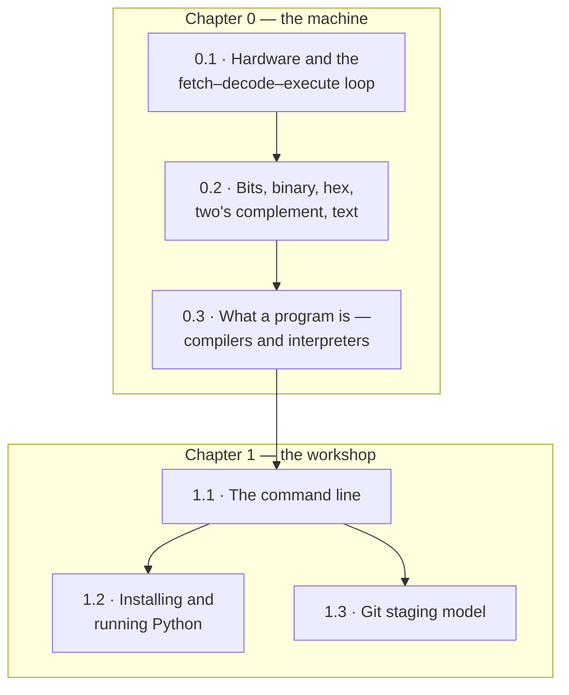

# Part I · The Machine

Most programming books open with `print("Hello, world!")`. This one spends two
chapters below that line first, and the reason is worth stating plainly: the
mysteries that make beginners give up are almost never mysteries about
syntax. They are mysteries about the machine. Why does `0.1 + 0.2` refuse to
equal `0.3`? Why does a program crash with a message about a *stack*? What
exactly is the difference between the file you edited and the thing that ran?
Why does the tutorial say `python script.py` when your terminal has never
heard of `script.py`? Every one of those questions has a short, satisfying
answer — and every one of them is unanswerable in terms of Python alone.

So Part I goes one floor down. [Chapter 0](ch00-machine/index.md) is the
machine: the processor, memory, storage, the fetch–decode–execute loop the
CPU repeats forever, the bits that are the only alphabet it knows, and the
translation step — compiler or interpreter — between the text you type and
the electrons that move. [Chapter 1](ch01-tools/index.md) is the workshop:
the command line, a real Python installation, and the Git staging model. Two
chapters, six sections, no prior knowledge assumed anywhere.

The payoff is not philosophical, it is compound interest. A reader who knows
what a bit is finds [Chapter 5's](ch05-under-the-hood/01-numeric-pitfalls.md)
floating-point surprises obvious rather than arbitrary, and
[Chapter 6.4's](ch06-loops/04-bitwise-enums.md) bitwise operators a
formality. A reader who knows what a file path is loses no time in
[Chapter 11](ch11-files/01-paths.md). A reader who has met the
fetch–decode–execute cycle finds [Chapter 23](ch23-os/index.md) a homecoming
rather than a new subject — and a reader who knows that a number occupies a
fixed number of bits can, by [Chapter 27](ch27-inference/04-quantization-deploy.md),
work out how many gigabytes a language model's weights need. This part is
short, and it makes every part after it shorter.

## The two chapters

| Ch | Title | What you can do after it |
|---|---|---|
| 0 | [How Computers Work](ch00-machine/index.md) | Name the hardware and describe the fetch–decode–execute cycle; count in binary and hex; represent negative numbers with two's complement and text with Unicode code points; explain what a compiler and an interpreter each do; trace a short program by hand and predict its output |
| 1 | [Tools of the Trade](ch01-tools/index.md) | Navigate a file system from a terminal with `pwd`, `ls`, `cd`, `mkdir`, `cp`, `mv`, `rm`; resolve absolute and relative paths, `..`, and `~`; install Python and run code four different ways; create a virtual environment; make a Git repository, commit to it, and read `git log` and `git diff` |

## Prerequisites

**None whatsoever.** Not "a little familiarity helps" — genuinely nothing.
Part I assumes you have used a computer as a person, not as a programmer. No
mathematics beyond arithmetic, no prior language, no software installed:
every Python block on these pages runs in your browser when you press
**▶ Run**. If you have not yet read
[How to use this handbook](how-to-use.md), it takes two minutes and explains
the Run buttons, the `# continues` marker, and the exercise solutions.

Chapter 1.2 is the one section that asks something of your own machine, and
even that is optional. Read it once now to see the landscape, then return to
it the day you decide to install Python for real.

## The one idea worth arriving with

Chapter 0's central claim is that a value in memory has no built-in meaning.
Eight bits are eight bits; the *program* decides whether they are a number,
a signed number, a character, or a shade of grey. Run this and watch three
byte patterns get read four ways each:

```python
# One byte, four readings — Chapter 0 in miniature.
print(f"{'bits':>10}{'unsigned':>10}{'signed':>8}{'hex':>6}  as text")
for byte in (0b0100_0001, 0b0011_0111, 0b1111_1111):
    signed = byte - 256 if byte >= 128 else byte   # two's complement, 8 bits
    text = repr(chr(byte)) if 32 <= byte < 127 else "(not printable)"
    print(f"{format(byte, '08b'):>10}{byte:>10}{signed:>8}{byte:>6X}  {text}")

print("\nThe bits never change. Nothing in memory records which reading is")
print("the right one — the program decides, and a wrong decision is a bug.")
```

`11111111` is 255 or it is $-1$, depending entirely on which question you
asked. That is not a curiosity; it is the reason integers overflow
([Section 5.1](ch05-under-the-hood/01-numeric-pitfalls.md)), the reason text
files need an encoding ([Section 11.2](ch11-files/02-read-write.md)), and the
reason a corrupted download shows up as gibberish rather than an error.

## How the sections depend on each other



The chain is real but gentle. Section 0.3 needs 0.2 (machine code is bits),
and Chapter 1 needs 0.3 (the whole chapter turns on the difference between
source code and a running program). Within Chapter 1, both 1.2 and 1.3 need
only the paths and prompts from 1.1; they do not need each other.

## How to read Part I

**Pace: one or two sittings.** Part I is the shortest part of the handbook
and the least demanding. An afternoon is a reasonable target for Chapter 0
and an evening for Chapter 1. Do not stretch it out — the point is to arrive
at Chapter 2 with vocabulary, not to become a hardware engineer.

**Do the binary conversions by hand at least twice.** Section 0.2's Run
buttons will convert anything you like, which makes it very easy to read the
chapter without ever converting a number yourself. Convert `13` to binary and
`0x2F` to decimal on paper first, then check with the code. Ten minutes of
this is the difference between recognising binary and reading it.

**Safe to skim on a first pass.** The speed-hierarchy numbers in 0.1
(cache versus RAM versus disk latencies) are worth meeting but not worth
memorising — they return, in context, in
[Chapter 35.4](ch35-balanced-trees/04-b-trees.md) where they justify B-trees.
Most of 1.2 is installation logistics you can defer. And 1.3's Git material
is deliberately a *taste*: branches, merges, conflicts, and pull requests all
wait for [Chapter 24.1](ch24-practice/01-git-workflow.md), so do not try to
learn Git properly here.

**Do not skim 0.3 or 1.1.** Those two sections carry the ideas the rest of
the handbook quietly assumes: what a program *is*, and how to name a file.

## Where this leads

Straight into [Part II](part2-overview.md), which is the full first arc of
programming — thirteen chapters from values and types to writing your own
classes. Nothing in Part II asks you to remember a latency number or a Git
command; it asks you to remember that a name refers to an object, that
integers are bits, and that a program is text until something translates it.

Chapter 0 also has two long-range sequels worth knowing about now. The
fetch–decode–execute loop you meet in 0.1 comes back in
[Chapter 23](ch23-os/index.md), which reveals that this very page runs a
Python interpreter compiled to WebAssembly — a machine imitating a machine
imitating a machine. And the terminal from 1.1 grows into a genuine
programming environment in [Chapter 40](ch40-toolchain/index.md).

[Begin with Chapter 0 · How Computers Work](ch00-machine/index.md){ .md-button .md-button--primary }
[Or see the whole book at once](map-of-the-book.md){ .md-button }
