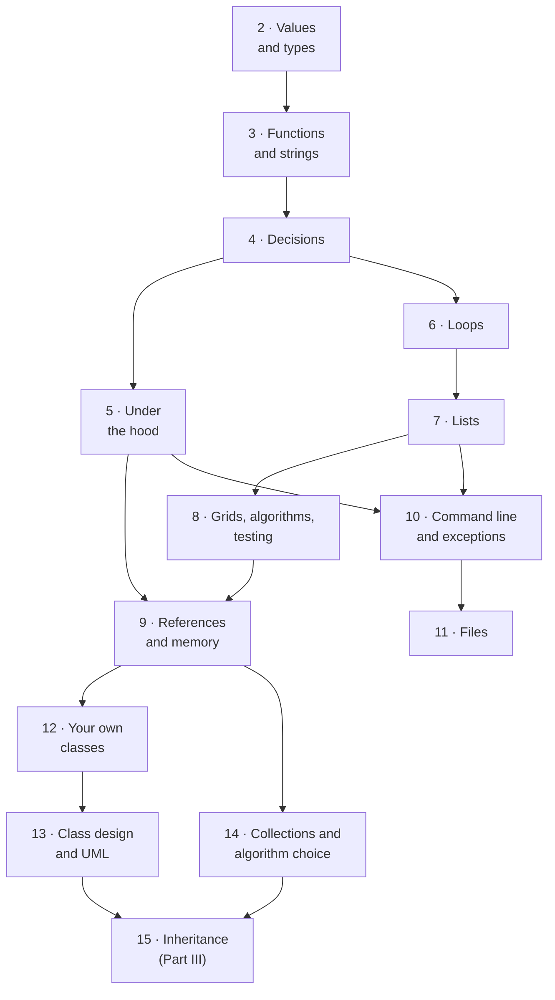

# Part II · Programming I

This is the long one, and the one everything else stands on. Thirteen chapters
take you from "a name refers to a value" to designing a multi-class program,
covering the same ground as a full first-semester university programming
course — because that is exactly what they are for. By the end of
[Chapter 14](ch14-beyond/index.md) you will have written branches, loops,
lists, grids, file readers, exception handlers, and classes of your own, and
met the two ideas beginners most often carry around as superstition: that a
variable *refers to* an object rather than containing one, and that two
correct programs can differ enormously in cost.

The arc has a deliberate shape. Chapters 2–5 build the atoms: values,
functions, decisions, and an honest look at the hardware underneath. Chapters
6–9 build the collections and the loops that walk them, ending with the chapter
that names the reference model outright. Chapters 10–11 connect your program to
a world where inputs are hostile and data survives the program's death.
Chapters 12–14 turn the corner from *using* other people's types to
*inventing your own*.

**Read Part II in order.** It is a genuine dependency chain rather than a
menu: Chapter 6's loops are unreadable without Chapter 4's conditions,
Chapter 8's grids are nested Chapter 7 lists, and Chapter 12's classes assume
Chapter 9's heap picture. Skipping ahead does not save time, it moves the
confusion somewhere harder to diagnose. If you already program a little, skim
rather than skip — the [learning path](learning-path.md) has a route (Path C)
for exactly that.

## The thirteen chapters

| Ch | Title | What you can do after it |
|---|---|---|
| 2 | [Values, Types, and Expressions](ch02-data/index.md) | Create variables and follow the name → object model; convert between `int`, `float`, and `str`; read binary and hex literals; evaluate any arithmetic expression, both divisions, and `%` |
| 3 | [Functions and Objects](ch03-functions/index.md) | Call methods with dot notation; index, slice, search, and transform strings; write functions with parameters, defaults, and return values; format aligned output with f-strings |
| 4 | [Making Decisions](ch04-branching/index.md) | Combine comparisons with `and`/`or`/`not` and simplify them; write `if`/`elif`/`else` in the right order; tell `==` from `is`; choose between an `elif` chain, `match`, and dictionary dispatch |
| 5 | [Under the Hood](ch05-under-the-hood/index.md) | Explain integer overflow and why `0.1 + 0.2 != 0.3`; compare floats safely; pick a type for money; predict short-circuit evaluation; draw the call stack and the heap |
| 6 | [Loops](ch06-loops/index.md) | Write `while` and `for` loops that provably terminate; use the counter, accumulator, and sentinel patterns; trace nested loops; use `break` and `continue`; set and clear individual bits; define enums |
| 7 | [Arrays and Lists](ch07-arrays/index.md) | Create, index, and measure lists (and Java arrays); apply the four traversal recipes — visit, accumulate, search-for-best, transform; diagnose an `IndexError`; make a NumPy array |
| 8 | [Grids, Algorithms, and Testing](ch08-grids/index.md) | Build and traverse 2-D grids; avoid the `[[0] * 3] * 2` aliasing trap; predict whether a function changes the caller's list; implement and trace linear search and selection sort; write `assert`-based tests, edge cases first |
| 9 | [Collections and Memory](ch09-collections/index.md) | Predict when two names refer to one object; use `==` and `is` correctly; make shallow and deep copies; translate the `ArrayList` ↔ `list` API in both directions; draw the stack-and-heap picture for a running program |
| 10 | [The Command Line and Exceptions](ch10-exceptions/index.md) | Read and validate `sys.argv`; write `try`/`except`/`else`/`finally` and `raise` your own; read any traceback bottom-up; recognise the seven commonest exception types on sight |
| 11 | [Files](ch11-files/index.md) | Build paths with `pathlib` instead of gluing strings; write, read, and append text files with `with`; iterate a file line by line; process a CSV into a report; handle `FileNotFoundError` |
| 12 | [Writing Your Own Classes](ch12-classes/index.md) | Write a class with `__init__`, attributes, methods, and `__repr__`; say what `self` refers to; separate class attributes from instance attributes; build one class out of others |
| 13 | [Class Design and UML](ch13-design/index.md) | Defend an invariant with encapsulation; map Java's `public`/`private` onto Python's conventions; turn an attribute into a guarded `@property`; draw and read mermaid UML class diagrams; grow a multi-class system from written requirements |
| 14 | [Beyond the Basics](ch14-beyond/index.md) | Choose correctly between list, set, dict, and tuple; reach for `Counter` and `defaultdict`; time two solutions with `perf_counter` and tell linear growth from quadratic; describe a GUI's event loop |

## Prerequisites

**[Part I](part1-overview.md)**, whose two load-bearing sections are
[0.2 Bits and binary](ch00-machine/02-binary.md) — which
[Section 2.2](ch02-data/02-number-systems.md) continues directly — and
[0.3 What a program is](ch00-machine/03-programs.md), because the whole part
depends on knowing that your text is translated before it runs.
[Chapter 1](ch01-tools/index.md) is useful and not required: every block here
runs in your browser, so you can finish Part II without installing anything.
[Section 1.1](ch01-tools/01-command-line.md) does become a real prerequisite at
[Chapter 10](ch10-exceptions/01-cli-programs.md), where your programs start
taking command-line arguments. No mathematics beyond arithmetic, and no prior
programming.

## What thirteen chapters buys you

Here is a program you could not have read at the start of Part II and can
write by the end of it. Every comment names the chapter the line comes from:

```python
# Every idea in Part II, in one program. The comments name the chapter.
class Reading:                                     # Ch 12 — your own class
    def __init__(self, city, celsius):             # Ch 12 — __init__ and self
        self.city, self.celsius = city, celsius

    def is_freezing(self):
        return self.celsius <= 0                   # Ch 4 — a decision


raw = "Oslo,-3\nCairo,29\nOslo,1\nQuito,fourteen\nQuito,14\n"   # Ch 11 reads a file
readings = []                                      # Ch 7 — a list
for line in raw.splitlines():                      # Ch 6 — a loop
    city, value = line.split(",")                  # Ch 3 — string methods
    try:
        readings.append(Reading(city, int(value)))  # Ch 2 — types and conversion
    except ValueError:                             # Ch 10 — exceptions
        print(f"skipped bad row: {line!r}")

by_city = {}                                       # Ch 14 — a dictionary
for r in readings:                                 # Ch 9 — each r is a reference
    by_city.setdefault(r.city, []).append(r.celsius)

print(f"\n{'city':<8}{'mean C':>8}{'n':>4}")       # Ch 3 — formatted output
for city, values in sorted(by_city.items()):       # Ch 8 — sorting
    print(f"{city:<8}{sum(values) / len(values):>8.1f}{len(values):>4}")
print("\nfreezing:", [r.city for r in readings if r.is_freezing()])
```

Twenty-six lines, nine chapters, one bad row survived rather than crashed.
That is the destination.

## How the chapters depend on each other

Arrows mean "read this first"; each one is a prerequisite the chapter declares.



The spine is **2 → 3 → 4 → 6 → 7 → 8 → 9**, and it narrows at Chapter 9, which
both branches of the second half depend on — hence the note below. There is
some slack elsewhere: Chapters 10–11 hang off Chapter 7 and are independent of
the classes branch, and Chapter 14 needs only Chapter 9, so its dictionaries
are available well before Part II ends. The spine itself has no slack at all.

!!! tip "Chapter 9 is the one to slow down for"

    [Chapter 9](ch09-collections/index.md) is the hardest chapter in Part II,
    and hard in an unusual way: nothing in it is complicated and everything in
    it is *surprising*. A variable does not hold a value, it refers to one. Two
    names can refer to one list, so changing it through either changes it for
    both. `list(a)` copies the outer list and shares everything inside it.

    Budget extra time — a second pass, all the exercises, the stack-and-heap
    drawings done by hand — because the rest of the handbook leans on this
    harder than on anything else in the part.
    [Chapter 12's](ch12-classes/index.md) objects are heap objects,
    [Chapter 18's](ch18-linked-lists/index.md) linked lists are nothing but
    references, and [Chapter 20's](ch20-bst/index.md) trees are the same idea
    with two children.

## How to read Part II

**Pace: roughly one chapter per week, a semester in total.** That is what the
parallel university course allows, and a sane rhythm for a self-learner.
Faster is fine if the exercises stay easy; faster *by skipping the exercises*
is not, because the exercises are where reading turns into skill.

**Safe to skim on a first pass.** [Section 5.4](ch05-under-the-hood/04-overloading-imports.md)
on Java overloading, and the Java tabs generally, if no Java course is running
alongside — they are a translation layer, not new content.
[Section 6.4](ch06-loops/04-bitwise-enums.md) on bitwise operators can wait
until [Project 1](projects/01-number-tool/README.md) or
[Chapter 36](ch36-hashing-tries/01-hash-tables.md) asks for it.
[Section 13.2](ch13-design/02-uml.md) on UML is a notation reference: read it
once, return when you need to draw a design. And
[Section 14.3](ch14-beyond/03-guis-and-beyond.md) is a signpost whose subject
gets the full treatment in [Chapter 42](ch42-web-gui/index.md).

**Do not skim** any of Chapter 9,
[Section 8.2](ch08-grids/02-arrays-functions.md) where a function reaches back
and changes the caller's list, or
[Section 10.3](ch10-exceptions/03-stack-traces.md) on reading tracebacks —
the highest hourly-rate skill in the part.

**Cement it with projects:**
[Project 1 · Number-Systems Toolkit](projects/01-number-tool/README.md) after
Chapter 6, and
[Project 2 · Text Adventure](projects/02-text-adventure/README.md) after
Chapter 13.

## Where this leads

[Part III](part3-overview.md) picks up immediately at
[Chapter 15](ch15-inheritance/index.md), which resolves a tension Chapter 13
leaves hanging: three nearly-identical classes and no clean way to treat them
as one kind of thing. Chapter 14's timing experiments become a theory in
[Chapter 16](ch16-complexity/index.md).

Two chapters reach further still.
[Chapter 11](ch11-files/index.md) and [Chapter 12](ch12-classes/index.md) are
the pair [Part V](part5-overview.md) leans on hardest — datasets on disk and
classes with one job each are most of what an AI engineering codebase is. And
[Chapter 14's](ch14-beyond/01-collections-tour.md) dictionary, used on faith
here, is rebuilt from a list and one arithmetic idea in
[Chapter 36](ch36-hashing-tries/01-hash-tables.md).

[Begin with Chapter 2 · Values, Types, and Expressions](ch02-data/index.md){ .md-button .md-button--primary }
[Or see the whole book at once](map-of-the-book.md){ .md-button }
