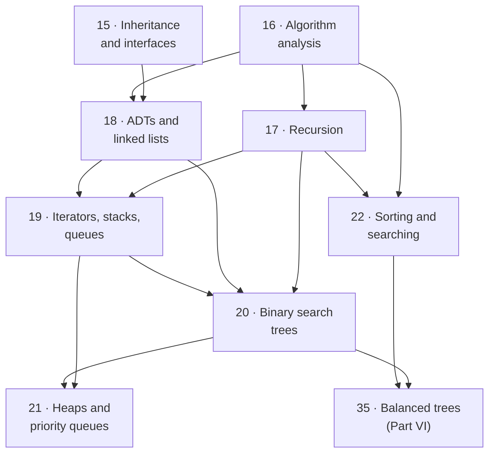

# Part III · Programming II

Part II taught you to make a program work. Part III teaches you to argue about
it. That is a genuine change of subject, and it is why a second programming
course exists at all: from here on you will rarely meet a piece of syntax you
have not seen. What you will meet instead are *choices* — an array or a chain
of nodes, a stack or a queue, insertion sort or merge sort, recursion or a
loop — each of which is correct, and each of which has a cost you can predict
before writing a line. Learning to predict that cost, and to defend the choice
out loud, is what separates someone who can code from someone who can engineer.

The eight chapters split into three movements.
[Chapter 15](ch15-inheritance/index.md) finishes the object-oriented story Part
II left open: inheritance, polymorphism, and the idea of a *contract* a class
promises to honour. [Chapters 16](ch16-complexity/index.md)–[17](ch17-recursion/index.md)
install the two tools everything afterwards is built with — Big-O, which lets
you discuss cost without a stopwatch, and recursion, which is how every
structure in the part is defined. [Chapters 18](ch18-linked-lists/index.md)–[22](ch22-sorting/index.md)
are the structures themselves — linked lists, iterators, stacks, queues, binary
search trees, heaps — and the sorting and searching algorithms that use them.
You build every one by hand, not because you will ship your own linked list,
but because `heapq`, `dict`, and `sorted` stop being magic the day you have
written their small honest ancestors.

**Read Part III in order.** Like Part II it is a chain rather than a menu, and
the links are tighter here: Chapter 20's trees are Chapter 18's nodes with two
children, walked by Chapter 17's recursion, level-order-traversed with
Chapter 19's queue, and costed in Chapter 16's notation. Chapter 22 is the one
place the whole part cashes out at once.

## The eight chapters

| Ch | Title | What you can do after it |
|---|---|---|
| 15 | [Inheritance and Interfaces](ch15-inheritance/index.md) | Move shared behaviour into a base class; override a method and extend it with `super()`; write one loop that handles many types; apply the *is-a* test to choose inheritance over composition; define a contract with `abc.ABC` and `@abstractmethod` |
| 16 | [Algorithm Analysis](ch16-complexity/index.md) | Count a program's operations as a function of $n$; read and write Big-O and justify it; separate best, worst, and average case; run a doubling experiment to infer a growth family from the outside; say what *amortized* $O(1)$ means |
| 17 | [Recursion](ch17-recursion/index.md) | Trace a recursive run frame by frame; design a function from its base case and its progress toward it; write the classics — list sum, reversal, `power`, binary search, Fibonacci, Towers of Hanoi; kill exponential blow-up with memoization; convert recursion to iteration with an explicit stack |
| 18 | [ADTs and Linked Lists](ch18-linked-lists/index.md) | State the difference between an ADT and a data structure; build singly and doubly linked lists from scratch; perform pointer surgery in an order that never loses a node; collapse edge cases with a sentinel; reach for `collections.deque` in real code |
| 19 | [Iterators, Stacks, and Queues](ch19-stacks-queues/index.md) | Explain what `for x in obj` actually does; make your own class iterable with `__iter__`/`__next__` or a generator; implement a stack and use it for bracket matching and undo; explain why `list.pop(0)` is $O(n)$; build a circular buffer |
| 20 | [Binary Search Trees](ch20-bst/index.md) | Use tree vocabulary precisely; state the BST invariant and spot a violation; implement insert, search, min/max, and all three delete cases; write the four traversals and predict their output; explain how insertion *order* controls height |
| 21 | [Heaps and Priority Queues](ch21-heaps/index.md) | State the heap property and contrast it with the BST invariant; store a complete tree in a plain list with index arithmetic; implement sift-up and sift-down; use `heapq` with the `(priority, item)` pattern; sort with a heap; find the top $k$ without sorting everything |
| 22 | [Sorting and Searching](ch22-sorting/index.md) | Implement three elementary sorts and predict their comparison counts on sorted, random, and reversed input; explain stability and when it matters; trace and implement merge sort and quicksort; demonstrate quicksort's $O(n^2)$ collapse; write a binary search that is correct on the first try |

## Prerequisites

**All of [Part II](part2-overview.md)**, and three chapters of it especially:

- **[Chapter 9 · Collections and Memory](ch09-collections/index.md)** — the
  reference model. A `Node` variable *is* a reference, and pointer surgery in
  Chapter 18 is unreadable without this picture. If one chapter of Part II
  deserves a second pass before you start here, it is this one.
- **[Chapter 12 · Writing Your Own Classes](ch12-classes/index.md)** — every
  structure in Part III is a class you write.
- **[Chapter 16's own prerequisites](ch16-complexity/index.md)**: loops
  ([Chapter 6](ch06-loops/index.md)), lists
  ([Chapter 7](ch07-arrays/index.md)), the first algorithms of
  [Section 8.3](ch08-grids/03-first-algorithms.md), and the informal timing
  experiments of [Section 14.2](ch14-beyond/02-choosing-algorithms.md), which
  Chapter 16 turns into a theory.

No new mathematics: $\log_2 n$ here always means "how many times can you halve
$n$ before you reach 1", and that is all you need.

## The number this part exists for

Every choice in Part III is ultimately this table. One task, one million
items, four growth rates, one honest guess at a modern machine's speed:

```python
import math

n = 1_000_000
rate = 100_000_000        # a rough modern figure: steps per second


def pretty(seconds):
    for unit, scale in (("us", 1e6), ("ms", 1e3), ("s", 1), ("hours", 1 / 3600)):
        if seconds * scale < 1000:
            return f"{seconds * scale:.1f} {unit}"
    return f"{seconds / 3600:,.0f} hours"


rows = [("O(log n)     binary search", math.log2(n)),
        ("O(n)         linear search", n),
        ("O(n log n)   merge sort", n * math.log2(n)),
        ("O(n^2)       selection sort", n * n)]

print(f"n = {n:,} items, at {rate:,} steps per second\n")
print(f"{'growth, and one algorithm with it':<32}{'steps':>19}{'time':>10}")
for name, steps in rows:
    print(f"{name:<32}{steps:>19,.0f}{pretty(steps / rate):>10}")
```

Twenty steps against a trillion; sub-microsecond against most of an afternoon.
All four of those algorithms are built and measured in
[Chapter 22](ch22-sorting/index.md) alone, on the same data in the same
language — so none of that gap is faster hardware or cleverer syntax. It is all
*choice*, and Part III is the vocabulary for seeing the difference before you
have paid for it.

## How the chapters depend on each other



Chapter 15 has exactly one arrow out of it, and it is a conceptual one:
[Section 15.3's](ch15-inheritance/03-interfaces.md) interfaces are the
what-versus-how split that [Section 18.1](ch18-linked-lists/01-adts-generics.md)
applies to collections — Java literally spells the List ADT as
`interface List<E>`. Chapter 16 is the true root: every cost claim in the five
chapters after it is written in its notation, and
[Appendix B](appendix/B-big-o.md) collects them all on one page.

## How to read Part III

**Pace: one chapter per week, eight weeks.** That is a semester, and it is the
right speed. Part III is shorter than Part II by chapter count and longer by
difficulty; the chapters are denser and the exercises take real time.

**Draw the structure before you write the code.** Every chapter from 18 onward
diagrams its structure in mermaid before implementing it, and that is the
working method, not decoration. Draw the before-and-after picture of a pointer
move on paper, order the assignments from the picture, then type. Nearly every
bug in this part is a pointer moved before the thing it pointed at was saved.

**Instrument, do not trust.** Chapter 16 gives you step counters and Chapter 22
comparison counters. When a page claims insertion sort is fast on nearly-sorted
data, the counter is right there — run it, change the input, watch the number
move.

**Safe to defer on a first pass.** [Section 15.2's](ch15-inheritance/02-polymorphism.md)
Java casting and `instanceof` material, and the Java tabs generally, if no
Java course is running alongside. [Section 16.2's](ch16-complexity/02-timing.md)
log-log plots are a lovely technique and not needed to proceed.
[Section 18.3's](ch18-linked-lists/03-doubly-linked.md) doubly linked list
can wait until you need one — the singly linked list in 18.2 carries the
whole idea. Chapter 20's three delete cases are the hardest half-page in the
part; understand the leaf and one-child cases now, and come back for the
two-child case.

**Do not defer any of [Chapter 16](ch16-complexity/index.md).** It is the
shortest path to everything else, and the one chapter interviewers,
documentation, and the rest of this book all assume you have read.

**Cement it with projects:**
[Project 3 · Data-Structures Library](projects/03-data-structures-library/README.md)
after Chapter 21 — a dynamic array, a linked list, a stack, a queue, and a
min-heap, each with tests — and
[Project 4 · Sorting Visualizer](projects/04-sorting-visualizer/README.md)
after Chapter 22, which instruments four sorts and photographs one in flight.

## Where this leads

**[Part VI](part6-overview.md) continues Part III directly.** Chapter 35 opens
where [Section 20.3](ch20-bst/03-traversals-balance.md) stops — with a binary
search tree that has degenerated into a linked list on sorted input — and
fixes it four ways. Chapter 36 rebuilds the dictionary you have used since
Part II, Chapter 37 adds graphs — where Dijkstra's algorithm runs on exactly
the priority queue you built in Chapter 21 — and Chapter 38 breaks the
$O(n \log n)$ bound Chapter 22 seemed to establish. The chapter numbers jump
from 22 to 35 only because Part VI was written after Part V; nothing in
between is required, and [Path D of the learning path](learning-path.md) is
that route.

Nearer at hand, [Part IV](part4-overview.md) is three short chapters on what
actually runs your code, plus the Git, testing, and style practices a team
expects. And [Part V](part5-overview.md) leans on this part more than it looks:
attention's $O(n^2)$ cost in the sequence length is what forces most of Part
V's engineering.

[Begin with Chapter 15 · Inheritance and Interfaces](ch15-inheritance/index.md){ .md-button .md-button--primary }
[Or see the whole book at once](map-of-the-book.md){ .md-button }
