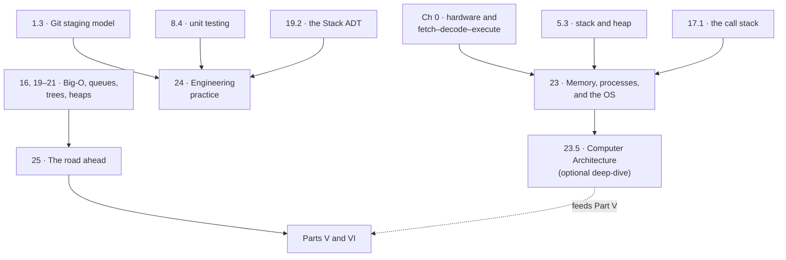

# Part IV · Systems & Practice

This is the shortest part of the handbook — three chapters — and the one most
likely to change how you read the other forty. Everything so far has been
about programs: how to write them, how to reason about their cost, how to
choose their structures. Part IV is about the two contexts a program actually
lives in. Underneath it there is a machine, an operating system, and an
interpreter, none of which you have been allowed to look at. Around it there
are other people, a repository, a test suite, and a reviewer, none of whom
have appeared yet. Both contexts are load-bearing, and both are usually left
out of a programming course entirely.

[Chapter 23](ch23-os/index.md) opens the box downward. What is a process? How
does one processor run thirty programs? Where in memory do your variables live,
and which end of the address space does the stack grow from? What does CPython
*do* with your source code, and why is "interpreted" half a lie? The chapter
ends by cashing in a promise the handbook has been making since Chapter 0: the
Run button on this page works because a real CPython interpreter has been
compiled to WebAssembly and is executing inside your browser — a virtual
machine, inside a virtual machine, inside a sandboxed process, on a time-sliced
kernel, on silicon. If that bottom layer leaves you wanting the silicon itself,
the optional [Chapter 23.5 · Computer Architecture](ch23b-architecture/index.md)
rebuilds the processor from the ground up — the performance equation, the RISC-V
instruction formats, hardware arithmetic, the datapath, pipelining, and the
parallel hardware behind GPUs — everything runnable in the browser.

[Chapter 24](ch24-practice/index.md) opens the box sideways, toward the team.
Branches, merges, conflicts, pull requests, and commit messages that explain
*why*; arrange–act–assert, table-driven tests, edge-case checklists, and what
100% coverage does and does not prove; naming, small functions, honest comments,
and a review checklist for your own code. None of it needs a new language
feature. All of it needs a change of audience — from the interpreter, satisfied
by anything that parses, to a person, who is not.

[Chapter 25](ch25-next/index.md) closes the first four parts by looking
forward: a guided taste of balanced trees, hash tables, and graphs, and a
roadmap organised by goal rather than by topic.

## The three chapters

| Ch | Title | What you can do after it |
|---|---|---|
| 23 | [Memory, Processes, and the OS](ch23-os/index.md) | Say what an operating system does and what a process is; explain time-slicing, threads, and how a race condition happens; draw a program's memory layout — code, static data, heap, stack — and which way each grows; explain CPython's reference counting and cycle collector; trace source → bytecode → execution and read `dis` output; place C, Java, and Python on the compiled/interpreted spectrum; describe every layer of the tower running this page |
| 24 | [Engineering Practice](ch24-practice/index.md) | Work the daily Git loop — pull, branch, commit small, push, open a pull request; read conflict markers and resolve a merge calmly; write a commit message that explains *why*; structure any test as arrange–act–assert and collapse near-duplicates into a table-driven loop; apply an edge-case checklist; write a pytest suite and its JUnit 5 counterpart, including tests that expect an exception; run a self-review checklist before every commit |
| 25 | [The Road Ahead](ch25-next/index.md) | Say what AVL, red-black, and B-trees solve, and what a rotation does in one sentence; describe how a hash table turns a key into a bucket index; model a network as a graph, store it as an adjacency list, and trace breadth-first search; name the big topics that come next; choose a concrete personal next step |

## Prerequisites

The three chapters have **different** prerequisites, which is unusual for this
handbook and worth stating plainly.

- **Chapter 23** needs [Chapter 0](ch00-machine/index.md) (hardware and the
  fetch–decode–execute cycle), [Section 5.3](ch05-under-the-hood/03-stack-heap.md)
  (the first look at the stack and heap),
  [Chapter 10](ch10-exceptions/index.md) (exceptions and stack traces), and
  [Section 17.1](ch17-recursion/01-call-stack.md) (the call stack in action).
  It rereads all four from underneath.
- **Chapter 24** needs [Section 1.3](ch01-tools/03-git.md) (your first
  commits), [Section 8.4](ch08-grids/04-unit-testing.md) (asserts and
  unit-test thinking), [Section 10.2](ch10-exceptions/02-exceptions.md) (we
  test error paths), and — for the worked test suite —
  [Section 19.2](ch19-stacks-queues/02-stacks.md), the Stack ADT.
- **Chapter 25** leans on the whole of [Part III](part3-overview.md),
  especially [Big-O](ch16-complexity/index.md),
  [queues](ch19-stacks-queues/index.md),
  [binary search trees](ch20-bst/index.md), and
  [heaps](ch21-heaps/index.md).
- **Chapter 23.5** (Computer Architecture) is an optional deep-dive extending
  [Chapter 23](ch23-os/index.md): it needs only
  [Chapter 0](ch00-machine/index.md) (the fetch–decode–execute loop and the
  tiny CPU), and rewards [Chapter 16](ch16-complexity/index.md) (Big-O). It
  *feeds* Part V's GPU and inference material but is a prerequisite for nothing
  later.

If you have finished Parts I–III, all of Part IV is open. If you are partway
through, Chapter 23 becomes readable as soon as you have met the call stack, and
Chapter 24 as soon as you have written a test.

## The reveal, in four lines

Chapter 23's last section is the payoff of the whole first half of the book.
Here is the smallest version of it — press **▶ Run** and ask the interpreter
where it is:

```python
import platform
import sys

print(f"implementation : {sys.implementation.name}")
print(f"version        : {sys.version.split()[0]}")
print(f"sys.platform   : {sys.platform}")
print(f"machine        : {platform.machine()}")
```

Run in this page, `sys.platform` reports `emscripten` and `platform.machine()`
names a WebAssembly target — neither of which is a computer you can buy,
because the interpreter answering you is real CPython compiled to WebAssembly
and executing inside a browser tab. Save the same four lines to a file, run
them in a terminal on your own machine, and they will name your actual
operating system and your actual CPU instead (`darwin` and `arm64`, say, or
`linux` and `x86_64`). Same language, same standard library, same `print` — a
different machine three layers underneath.
[Section 23.3](ch23-os/03-interpreters-vms.md) draws the full tower, all five
floors of it.

## How the chapters depend on each other



Notice what is missing: there are no arrows *between* the three core chapters.
Part IV is the one part of this handbook that is genuinely a menu. Read 23, 24,
and 25 in any order, or read one and come back for the others months later.
Every arrow into the part comes from somewhere earlier in the book. The one
extension is **Chapter 23.5**, an optional architecture deep-dive that hangs off
Chapter 23 and that nothing later in the book requires.

## How to read Part IV

**Pace: a weekend, or two evenings.** Part IV is a third the length of Part III
and much less dense. It is also the part most worth rereading after you have
written something real, because its subject is the experience you do not have
yet.

**Chapter 24 is the one chapter you cannot do on this page.** Branching,
merging, and resolving a conflict are motor skills the Run button cannot give
you. Make a scratch repository on your own machine, follow
[Section 24.1](ch24-practice/01-git-workflow.md) in a real terminal, and create
a merge conflict on purpose, so the first one you meet is not on work you care
about. [Section 1.3](ch01-tools/03-git.md) is enough preparation.

**Safe to skim on a first pass.** The object-size measurements in
[Section 23.2](ch23-os/02-memory-layout.md) are worth meeting, not
memorising. The JUnit 5 counterparts in
[Section 24.2](ch24-practice/02-testing.md) matter only if a Java course is
running alongside. And if you already intend to read
[Part VI](part6-overview.md), you can skim
[Section 25.1](ch25-next/01-cs400-preview.md) with a clear conscience: it is a
deliberate preview of balanced trees, hash tables, and graphs, and
[Chapters 35](ch35-balanced-trees/index.md),
[36](ch36-hashing-tries/index.md), and
[37](ch37-graphs/index.md) are the same three subjects done in full.

**Do not skim [Section 23.3](ch23-os/03-interpreters-vms.md).** It is the
chapter this handbook was built to arrive at, and it is where "compiled versus
interpreted" stops being a quiz answer and becomes a spectrum you can place
any language on.

## Where this leads

Part IV is the last part of the core sequence, and the book forks after it.

**[Part V · AI Engineering](part5-overview.md)** (Chapters 26–34) requires
Parts I–IV and nothing else — and Chapter 23 is not optional decoration there.
GPU memory budgets, KV-cache arithmetic, and the difference between latency
and throughput are all the processes-and-memory material of Chapter 23 applied
to an unusually expensive component.

**[Part VI · Programming III](part6-overview.md)** (Chapters 35–42) continues
[Part III](part3-overview.md) and treats Part IV as helpful rather than
required: Chapter 23's block-and-page model is what makes B-trees make sense,
and Chapter 24's Git and testing habits are assumed by
[Chapter 40](ch40-toolchain/index.md), which takes both much further.

Either order works; neither part is a prerequisite for the other.
[Section 25.2](ch25-next/02-roadmap.md) helps you choose, and the
[learning path](learning-path.md) sets out both routes in full.

[Begin with Chapter 23 · Memory, Processes, and the OS](ch23-os/index.md){ .md-button .md-button--primary }
[Or see the whole book at once](map-of-the-book.md){ .md-button }
