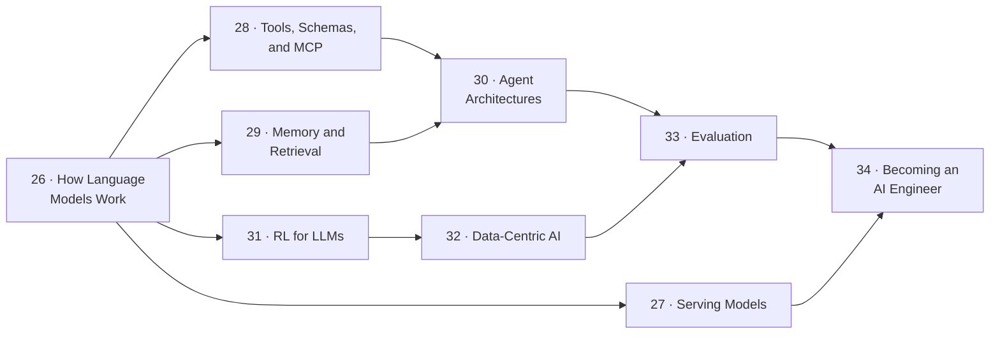

# Part V · AI Engineering

Somewhere around 2023 a job appeared that had not existed before. It is not
research — the people doing it are not designing new architectures or
proving theorems — and it is not classical machine learning either, since
most of them never train a model from scratch. The job is to take models
that already exist and turn them into systems that work: wire them to tools
and data, serve them fast enough and cheaply enough to matter, measure
whether they are any good, and fix them when they are not. It is called
**AI engineering**, and it is mostly software engineering — the kind you
have been learning since Chapter 0 — applied to a component that is
probabilistic, expensive, and occasionally wrong with total confidence.

That last property makes it a distinct discipline. Every other component
you have built in this handbook is deterministic: a sorted list is sorted, a
stack pops what it pushed. A language model returns a *sample from a
distribution*. You cannot unit-test it into correctness — you measure it
statistically, constrain it structurally, and design the system around the
assumption that the component sometimes fails. Part V is the engineering
that assumption forces.

## The six skill areas

Job postings vary, but the underlying skills cluster into six areas. Here is
how the nine chapters of Part V cover them:

| Skill area | What it means in practice | Chapters |
| --- | --- | --- |
| **Transformers & RL** | Knowing what the model actually is, and how post-training shapes its behaviour | 26 · How Language Models Work<br>31 · Reinforcement Learning for LLMs |
| **Inference infrastructure** | Making generation fast and affordable: caching, batching, quantization, latency budgets | 27 · Serving Models — Inference Infrastructure |
| **Agent architecture & protocols** | Giving a model tools, memory, and a control loop; the protocols that standardise it | 28 · Tools, Schemas, and MCP<br>29 · Memory, Retrieval, and Knowledge<br>30 · Agent Architectures |
| **Data-centric AI** | Treating the dataset as the artefact you engineer: synthesis, filtering, trajectories | 32 · Data-Centric AI |
| **Evaluation** | Deciding whether a change helped, on evidence rather than vibes | 33 · Evaluation |
| **Coding & open-source output** | Shipping — the portfolio, the repository, the career path | 34 · Becoming an AI Engineer |

The order is not arbitrary. Chapter 26 comes first because every later
chapter reduces to it: a KV cache is a consequence of causal masking, a tool
call is a token sequence, and an evaluation measures a sampler's output.



## What this Part can and cannot do

**It cannot train a real model.** Every Python block in this handbook runs in
your browser under Pyodide: no PyTorch, no `transformers`, no network calls,
no API keys, no GPU. Nothing here produces a checkpoint worth downloading. A
frontier model represents millions of dollars of electricity, no browser tab
will reproduce that, and any tutorial implying otherwise is selling
something.

**It can teach you every mechanism inside one.** Attention is a matrix
multiply, a division, a softmax, and another matrix multiply — roughly
fifteen lines of numpy, which you will write in Section 26.2 and watch
produce real attention weights. A DPO update on six preference pairs with a
two-parameter policy is a *correct* DPO update; only the scale is toy. A KV
cache holding five tokens obeys exactly the arithmetic that decides how many
users fit on an 80 GB GPU. Throughout Part V, where a snippet needs a
language model, it gets a deterministic stand-in named `FakeLLM` — no
network, no key, and completely reproducible:

```python
class FakeLLM:
    """Stands in for a real API call: scripted, deterministic, offline."""

    def __init__(self, name="toy-1"):
        self.name = name

    def complete(self, prompt):
        p = prompt.lower()
        if "capital of france" in p:
            return "Paris."
        if "2 + 2" in p:
            return "4"
        return "I don't know."


llm = FakeLLM()
for question in ["What is the capital of France?", "What is 2 + 2?",
                 "What will the weather be next Tuesday?"]:
    print(f"{question:<38} -> {llm.complete(question)!r}")
print(f"\nmodel: {llm.name} — no network, no API key, no GPU,")
print("but the request/response shape is exactly a real client's.")
```

Anything that genuinely requires the real stack — `vllm serve`, `ollama
run`, an SDK call with your key in it — appears in a `text` or `console`
fence, so it gets no Run button and is never pretended to have executed.

Why is the small version worth building? Because the alternative — reading
about attention, nodding, moving on — reliably produces people who can
recite "queries, keys, and values" but cannot say what breaks if you drop
the causal mask. Once you have written the fifteen lines, deleted the
`/ np.sqrt(d_k)`, and watched the softmax saturate, the knowledge stops
being verbal. Building the small version is the fastest route to real
understanding precisely because it is the *smallest* thing that is still
the real thing.

!!! warning "This field moves fast"
    Part V marks what is settled and what is merely current. Settled:
    attention, the KV cache, parameter-count arithmetic, the PPO and DPO
    update rules. Current, and liable to change: which frameworks people
    use, which benchmark is respected, what a model of a given size costs.
    Where a number would date badly, this Part gives the formula instead.

## Prerequisites

**Parts I–IV, and nothing else.** You need Python fluency
([Chapter 2](ch02-data/index.md) onward), comfort with classes and
dictionaries ([Chapter 12](ch12-classes/index.md)), Big-O thinking
([Chapter 16](ch16-complexity/index.md) — attention's $O(n^2)$ cost drives
most of Part V's engineering), and a working mental model of processes and
memory ([Chapter 23](ch23-os/index.md)), which is what makes GPU memory
budgets and inference servers sensible rather than arbitrary.

You need **no** machine learning background, no calculus, and no linear
algebra: vectors, matrix products, dot products, softmax, and gradients are
each introduced concretely, with a runnable implementation, where they first
matter. Part VI (Programming III) is **not** a prerequisite, and Part V is
not a prerequisite for Part VI — the two continue the handbook in
independent directions, and either order works.

## How to read Part V

1. **Run every block, then break it.** The arrays are tiny so you can change
   a number and see the consequence immediately. Set the temperature to 5.
   Delete the mask. Halve the head count. An experiment costs one click.
2. **Do the arithmetic yourself.** Parameter counts, KV-cache sizes, tokens
   per second, cost per million tokens — these are the daily currency of the
   job, and every one of them is a calculator you can write. Part V gives
   you the formula in LaTeX and then makes you run it.
3. **Distinguish toy from faithful.** Every chapter says explicitly which is
   which. The scale is always toy; the algorithm is always real. Carry that
   distinction into your own reading of papers and blog posts.
4. **Start at Chapter 26.** Even if you came for agents or for serving, the
   later chapters constantly reach back into it. It is short, and it is the
   only chapter with no substitute.

[Begin with Chapter 26 · How Language Models Work](ch26-llm-internals/index.md){ .md-button .md-button--primary }
