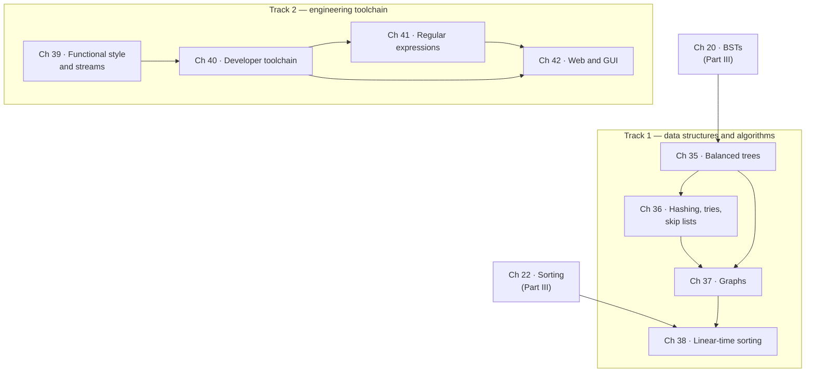

# Part VI · Programming III

[Part III](ch16-complexity/index.md) handed you a toolbox: linked lists,
stacks, queues, binary search trees, heaps, and the sorting algorithms that
made $O(n \log n)$ feel routine. Part VI is the third course in that
sequence, and it exists because the toolbox has two holes.

The first hole is **adversarial input**. Nearly every structure in Part III
performs beautifully on typical data and catastrophically on some
perfectly ordinary special case. A binary search tree fed keys in sorted
order becomes a linked list. A hash table fed colliding keys becomes a
linked list. Part VI closes those holes one by one: balanced trees, hash
tables with real collision strategies, tries, skip lists, graph algorithms,
and the sorts that beat the $O(n \log n)$ comparison bound by refusing to
compare.

The second hole is **everything around the code**. Working programmers
spend their days in a shell, a build system, a test runner, a regex
dialect, and a browser — none of which appeared in Parts I–III, and all of
which are assumed knowledge in every job and every upper-level course. Part
VI runs that material as a second track, in parallel with the algorithms.

## The eight chapters, on two tracks

| Ch | Title | Track | What it gives you |
|---|---|---|---|
| 35 | [Balanced Search Trees](ch35-balanced-trees/index.md) | Data structures | Rotations, AVL, red-black, B-trees — $O(\log n)$ *guaranteed*, whatever the input order |
| 36 | Hashing, Tries, and Skip Lists | Data structures | $O(1)$ average lookup, prefix search, and a randomized alternative to balancing |
| 37 | Graphs | Algorithms | Representations, BFS/DFS, shortest paths, spanning trees, topological order |
| 38 | Linear-Time Sorting | Algorithms | Counting, radix, and bucket sort — and why they do not violate the comparison lower bound |
| 39 | Functional Style and Streams | Toolchain | Lambdas, higher-order functions, immutability, Java's Streams API, pipelines |
| 40 | The Developer Toolchain | Toolchain | The shell in depth, SSH, Make, dependency graphs, JUnit-style testing |
| 41 | Regular Expressions | Toolchain | Pattern syntax, capture groups, greedy versus lazy, and where regex is the wrong tool |
| 42 | Web and GUI Programming | Toolchain | HTTP, HTML/CSS/JavaScript, request routing, and event-driven interfaces |

The two tracks are independent of each other. If you are preparing for a
data-structures exam, read 35–38 and stop. If you have just been handed a
codebase and a terminal, read 39–42 first. Nothing in the toolchain
chapters depends on the algorithms chapters, or the reverse.

!!! note "Why the numbering jumps"

    Part VI is numbered 35–42 because it was written after Part V's
    AI-engineering material (Chapters 26–34), not because you must read
    thirty-four chapters first. **Part VI continues directly
    from Chapter 22** — the last chapter of Part III. Parts IV (systems and
    practice) and V (AI engineering) are independent side-quests: useful,
    recommended, but not prerequisites for anything here. If your goal is
    the classic Programming I → II → III sequence, the path is Chapters
    2–14, then 15–22, then 35–42, and you have missed nothing.

## What you need before starting

- **[Part II](ch02-data/index.md), Chapters 2–14** — Python fundamentals,
  functions, collections, files, exceptions, and classes.
- **[Part III](ch15-inheritance/index.md), Chapters 15–22** — inheritance
  and interfaces, [Big-O](ch16-complexity/01-big-o.md),
  [recursion](ch17-recursion/index.md),
  [linked structures](ch18-linked-lists/index.md),
  [binary search trees](ch20-bst/index.md),
  [heaps](ch21-heaps/index.md), and
  [sorting and searching](ch22-sorting/index.md).
- **Comfort with a terminal** — the level reached in
  [Chapter 1](ch01-tools/01-command-line.md) is enough; Chapter 40 takes it
  much further.
- **Optional but helpful** — [Chapter 23](ch23-os/index.md) on memory,
  processes, and the block-and-page model that motivates B-trees, and
  [Chapter 24](ch24-practice/index.md) on Git and testing practice.

Here is the one number that motivates the whole first track. Part III's
structures promise $O(\log n)$; Part VI's *guarantee* it:

```python
import math

n = 1_000_000
print(f"{'structure':<34}{'worst-case steps for n = 1,000,000':>36}")
print(f"{'binary search tree, sorted input':<34}{n - 1:>36,}")
print(f"{'AVL tree (Chapter 35)':<34}"
      f"{math.ceil(1.4405 * math.log2(n + 1) - 1.3277):>36,}")
print(f"{'B-tree, 256-way (Chapter 35)':<34}"
      f"{math.ceil(math.log(n, 128)):>36,}")
```

```text
structure                           worst-case steps for n = 1,000,000
binary search tree, sorted input                               999,999
AVL tree (Chapter 35)                                               28
B-tree, 256-way (Chapter 35)                                         3
```

Same data, same operation, same asymptotic *claim* in the textbook — and a
factor of thirty thousand between the first row and the second. That gap is
what Part VI is about.

## How the chapters depend on each other



Solid arrows are real dependencies, and there are fewer of them than the
numbering suggests. Chapter 35 needs only Chapter 20. Chapter 37's graph
algorithms lean on Chapter 36's hash tables (for adjacency maps) and on the
priority queue you already built in [Chapter 21](ch21-heaps/index.md).
Chapter 38 uses Chapter 22's lower-bound argument as the thing it evades.
On the toolchain side the order is a gentle ramp rather than a chain — you
can read Chapter 41 on regular expressions the moment you can run Python.

## How to read this part

Part VI is where a handbook stops being a tutorial and starts being a
reference you return to. Two habits make that transition work.

**Draw before you code.** Every data structure here is defined by an
invariant — a sentence that is true of the structure at all times. The
chapters state each invariant formally, draw it, and then supply a runnable
checker that verifies it after every operation. Write the checker first, run
it constantly, and a class of bug simply stops happening.

**Run the toolchain chapters for real.** Bash, SSH, Make, JUnit, and a
browser cannot execute inside this page, so those chapters teach the
underlying mechanism with a Python model you *can* run — a dependency
resolver that does what Make does, an HTTP parser, a route dispatcher, a
tiny assertion library. Run those, then go do the real thing in a terminal
on your own machine. The model teaches you why; the terminal teaches you
how.

Start with [Chapter 35](ch35-balanced-trees/index.md), which picks up
exactly where [section 20.3](ch20-bst/03-traversals-balance.md) left off:
with a binary search tree that has quietly turned into a linked list, and
the promise that it can be fixed.
