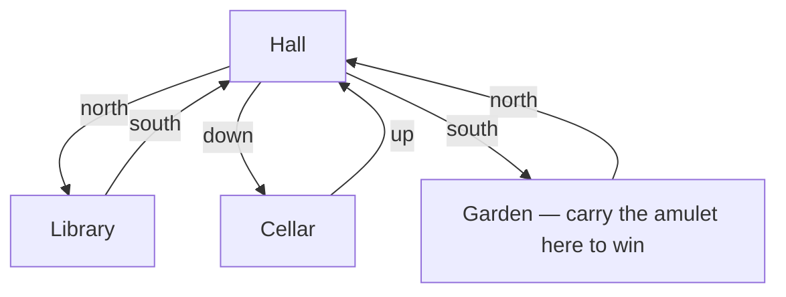

# Project 2 · Text Adventure (OOP)

Before graphics cards, games were made of sentences. Building a tiny text
adventure is the classic way to make object-oriented design *click*: rooms,
items, and a player are objects with state; the game is just those objects
talking to each other.

## What you'll build

A four-room mansion, a player who can walk and carry things, and a command
parser. Bring the golden amulet out to the garden and you win. A play
session looks like this (excerpt):

```text
== Hall ==
A dusty entrance hall. Portraits watch you.
You see: lantern
Exits: down, north, south

> take lantern
You take the lantern. A battered brass lantern.

> go down
== Cellar ==
Cold air. Something glints in the dark.
You see: amulet
Exits: up

> take amulet
You take the amulet. The golden amulet of Zork Manor.

> go up
> go south
== Garden ==
Sunlight! The gate to freedom stands open.

You carry the amulet into the sunlight. YOU WIN!
```

The map you will wire together:



!!! note "No `input()` on this page"

    The in-browser runner cannot pause for keyboard input, so the runnable
    version plays itself from a scripted command list. Two lines change for
    real interactive play on your own machine — Milestone 5 shows exactly
    which two.

## What it exercises

- [Chapter 12 · Writing Your Own Classes](../../ch12-classes/index.md) —
  `__init__`, attributes, and methods for `Item`, `Room`, and `Player`.
- [13.3 Multi-class systems](../../ch13-design/03-multi-class.md) — four
  classes that reference each other, wired up by a `World` class.
- [13.2 UML class diagrams](../../ch13-design/02-uml.md) — sketch this design
  before you code it.
- [14.1 Sets, maps, and dictionaries](../../ch14-beyond/01-collections-tour.md)
  — the `exits` dictionary *is* the map.
- [10.2 Exceptions](../../ch10-exceptions/02-exceptions.md) — a parser is one
  long exercise in handling bad input gracefully.

## Milestones

### Milestone 1 — rooms that describe themselves

**Goal:** write the `Room` class: a name, a description, an `exits`
dictionary mapping direction words to other `Room` objects, and a
`describe()` method returning the text a player sees.

**Done when...** you can create two rooms, link them by hand
(`hall.exits["north"] = library`), and `print(hall.describe())` shows the
name, description, and a sorted list of exits.

??? tip "Hint"

    The trick that makes the whole game work: dictionary values can be
    *objects*. `exits["north"]` is not the string `"Library"` — it is the
    Library `Room` itself, so moving is one dictionary lookup:

    ```python
    hall = {"name": "Hall"}          # stand-ins for Room objects
    library = {"name": "Library"}
    exits = {"north": library}
    print(exits["north"]["name"])    # the actual room, not just a label
    ```

    A `connect(direction, other, back)` method that sets both directions at
    once will save you wiring bugs in Milestone 3.

### Milestone 2 — items and the player

**Goal:** write `Item` (name, description) and `Player` (current `location`,
an `inventory` list). Give `Room` an `items` list and a `take(item_name)`
method that removes and returns the named item, or `None` if absent.

**Done when...** a lantern placed in the hall can be taken (hall's list
shrinks, inventory grows), taking it twice fails politely, and
`player.has("lantern")` returns `True`/`False` correctly.

??? tip "Hint"

    "Find by name in a list" is a loop you will write twice (room items,
    inventory) — or once, with `any()` for the yes/no version:

    ```python
    class Thing:
        def __init__(self, name):
            self.name = name

    inventory = [Thing("lantern"), Thing("book")]
    print(any(t.name == "amulet" for t in inventory))
    ```

    `Room.take` should *return the Item object* — the caller decides what
    to do with it. Returning `None` for "not here" beats raising here,
    because a missing item is normal gameplay, not a bug.

### Milestone 3 — the world map

**Goal:** write `World.__init__` that builds all four rooms, connects them
according to the mermaid diagram above, places the lantern, book, and
amulet, and creates the player in the Hall.

**Done when...** starting a `World` prints the Hall description, and
walking `north / south / down / up` by calling your movement code lands in
the rooms the diagram promises (every passage works in both directions).

??? tip "Hint"

    Wiring is data, not logic — keep it flat and readable, one line per
    passage, and let `connect` handle the reverse direction:

    ```text
    hall.connect("north", library, back="south")
    hall.connect("down",  cellar,  back="up")
    hall.connect("south", garden,  back="north")
    ```

    If a passage only works one way, you forgot the `back` link — the
    classic text-adventure bug.

### Milestone 4 — the command parser

**Goal:** write `World.do_command(line)` that splits a command into a verb
and an optional noun, then dispatches: `look`, `go DIR`, `take X`,
`drop X`, `inventory`. Unknown input gets a help line, never a crash.

**Done when...** every verb works, `go nowhere` and `take unicorn` produce
friendly messages, `"  GO   NORTH "` still works (strip and lowercase), and
gibberish like `dance` prints the help line.

??? tip "Hint"

    `str.partition` splits off the verb and keeps the rest of the line
    intact — handy the day you add two-word item names:

    ```python
    verb, _, noun = "take brass lantern".strip().lower().partition(" ")
    print(verb, "|", noun)
    ```

    Dispatch with an `if/elif` chain first. Feeling fancy afterwards? A
    dictionary mapping verbs to methods is the grown-up version — compare
    [4.4 switch/match](../../ch04-branching/04-switch-style-debug.md).

### Milestone 5 — win condition and the scripted playthrough

**Goal:** add `check_win()` — carrying the amulet into the Garden sets
`world.won` and prints the victory line — and drive the whole game from a
`commands` list so it runs in the browser.

**Done when...** the scripted playthrough at the bottom of the reference
implementation wins the game, walking to the Garden *without* the amulet
does not win, and the loop stops as soon as `world.won` is `True`.

??? tip "Hint"

    The scripted loop and the interactive loop differ by exactly two lines.
    In the browser (and in the reference below):

    ```text
    for command in commands:          # scripted: plays itself
        if world.won:
            break
        world.do_command(command)
    ```

    On your own machine, swap those lines for:

    ```text
    while not world.won:              # interactive: you type the commands
        world.do_command(input("> "))
    ```

    Everything else — every class, every method — stays identical. That
    separation of *engine* from *input source* is real architecture.

## Reference implementation

Design yours first (a UML sketch of the four classes is worth ten minutes),
then compare.

??? success "Full reference implementation"

    ```python
    """A tiny text adventure: rooms, items, a player, and a command parser."""


    class Item:
        """Something the player can pick up and carry."""

        def __init__(self, name, description):
            self.name = name
            self.description = description


    class Room:
        """One location. `exits` maps a direction word to another Room."""

        def __init__(self, name, description):
            self.name = name
            self.description = description
            self.exits = {}      # e.g. {"north": <the Library Room>}
            self.items = []

        def connect(self, direction, other, back):
            """Two-way link: `direction` leads to `other`, `back` returns here."""
            self.exits[direction] = other
            other.exits[back] = self

        def take(self, item_name):
            """Remove and return the named item, or None if it is not here."""
            for item in self.items:
                if item.name == item_name:
                    self.items.remove(item)
                    return item
            return None

        def describe(self):
            """Return the full text a player sees on entering or on 'look'."""
            lines = [f"== {self.name} ==", self.description]
            if self.items:
                lines.append("You see: " + ", ".join(i.name for i in self.items))
            lines.append("Exits: " + ", ".join(sorted(self.exits)))
            return "\n".join(lines)


    class Player:
        """Tracks where the player is and what they carry."""

        def __init__(self, start_room):
            self.location = start_room
            self.inventory = []

        def has(self, item_name):
            return any(item.name == item_name for item in self.inventory)


    class World:
        """Wires the rooms together and turns command strings into actions."""

        def __init__(self):
            hall = Room("Hall", "A dusty entrance hall. Portraits watch you.")
            library = Room("Library", "Shelves sag under forgotten books.")
            cellar = Room("Cellar", "Cold air. Something glints in the dark.")
            garden = Room("Garden", "Sunlight! The gate to freedom stands open.")

            hall.connect("north", library, back="south")
            hall.connect("down", cellar, back="up")
            hall.connect("south", garden, back="north")

            hall.items.append(Item("lantern", "A battered brass lantern."))
            library.items.append(Item("book", "'Binary for Wizards', 3rd edition."))
            cellar.items.append(Item("amulet", "The golden amulet of Zork Manor."))

            self.player = Player(hall)
            self.goal_room = garden
            self.won = False
            print(hall.describe())

        # --- one method per verb -------------------------------------------
        def go(self, direction):
            room = self.player.location
            if direction not in room.exits:
                print(f"You can't go {direction} from here.")
                return
            self.player.location = room.exits[direction]
            print(self.player.location.describe())
            self.check_win()

        def take(self, item_name):
            item = self.player.location.take(item_name)
            if item is None:
                print(f"There is no {item_name} here.")
            else:
                self.player.inventory.append(item)
                print(f"You take the {item.name}. {item.description}")

        def drop(self, item_name):
            for item in self.player.inventory:
                if item.name == item_name:
                    self.player.inventory.remove(item)
                    self.player.location.items.append(item)
                    print(f"You drop the {item.name}.")
                    return
            print(f"You are not carrying a {item_name}.")

        def show_inventory(self):
            if self.player.inventory:
                names = ", ".join(item.name for item in self.player.inventory)
                print(f"You are carrying: {names}")
            else:
                print("You are carrying nothing.")

        def check_win(self):
            if self.player.location is self.goal_room and self.player.has("amulet"):
                self.won = True
                print("\nYou carry the amulet into the sunlight. YOU WIN!")

        # --- the parser -----------------------------------------------------
        def do_command(self, line):
            """Split a command into a verb and (maybe) a noun, then dispatch."""
            print(f"\n> {line}")
            verb, _, noun = line.strip().lower().partition(" ")
            if verb == "look":
                print(self.player.location.describe())
            elif verb == "go" and noun:
                self.go(noun)
            elif verb == "take" and noun:
                self.take(noun)
            elif verb == "drop" and noun:
                self.drop(noun)
            elif verb in ("inventory", "i"):
                self.show_inventory()
            else:
                print("I don't understand. "
                      "Try: look / go DIR / take X / drop X / inventory")


    # --- scripted playthrough (swap in input() for interactive play) --------
    commands = [
        "take lantern",
        "go north",
        "take book",
        "inventory",
        "dance",
        "go south",
        "go down",
        "take amulet",
        "go up",
        "go south",
    ]

    world = World()
    for command in commands:
        if world.won:
            break
        world.do_command(command)
    ```

    Edit the `commands` list and re-run: try dropping the amulet in the
    Garden and picking it back up, or walking to the Garden empty-handed to
    confirm you do *not* win.

## Going further

- **Locked doors.** Give `Room` a `locked_exits` dictionary mapping a
  direction to the item name that opens it (`{"down": "lantern"}` — too dark
  to enter the cellar without it). `go` refuses passage unless
  `player.has(...)` says otherwise.
- **NPCs.** A `Character` class with a `talk()` method and a room to stand
  in; a librarian who hints where the amulet is hidden turns the parser verb
  `talk` into a quest system.
- **Save games.** Serialize the game state (player location, inventory
  names, item positions) to a file and load it back — in the browser,
  create-then-read works within one run, as shown in
  [11.2 Reading and writing files](../../ch11-files/02-read-write.md).
- **Score and turns.** Count commands executed; report both in the victory
  message. Ten-turn speedruns of Zork Manor await.
- **Room subclasses.** A `DarkRoom` that only describes itself when the
  player carries the lantern is a natural first use of
  [inheritance](../../ch15-inheritance/01-inheritance.md).
